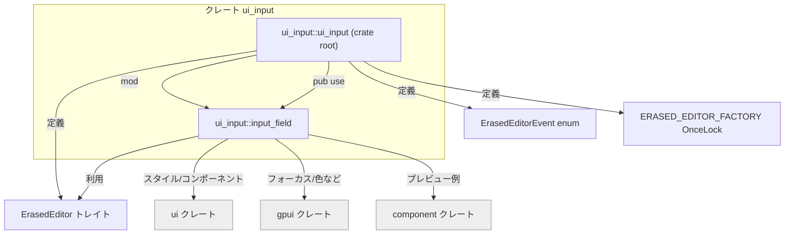
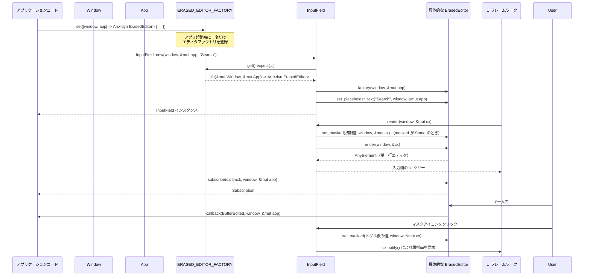

## 1. ざっくり一言

`ui_input` クレートは、フォーム入力などに使えるテキスト入力コンポーネント `InputField` と、その内部で利用するエディタ抽象化 `ErasedEditor` を提供するクレートです。  
UI フレームワーク (`ui` / `gpui`) と実際のエディタ実装 (`editor` 系クレート) の間をつなぐ役割を持ちます。

---

## 2. このモジュールの役割

### 2.1 概要

- このクレートは、**フォームライクな UI**（検索ボックス・設定フォーム・パスワード入力など）を実装するための入力コンポーネントを提供します。
- 具体的には、以下を提供します。
  - ラベル・プレースホルダー・先頭アイコン・マスク表示（パスワード表示切り替え）などを備えた `InputField` コンポーネント
  - 実際のテキストエディタを抽象化する `ErasedEditor` トレイトと、そのファクトリ `ERASED_EDITOR_FACTORY`
- クレート内にはエディタ本体は含まれず、外部クレートで定義されたエディタ実装を差し込んで使う構造になっています。

### 2.2 アーキテクチャ内での位置づけ

このクレートは、UI レイヤー (`ui` / `gpui`) とエディタ実装レイヤー（`editor` クレートなど、ここには出てこない）を橋渡しする位置にあります。



- `ui_input::ui_input`（crate ルート）が `ErasedEditor` まわりの基本抽象を定義し、`mod input_field;` で `InputField` 実装を読み込みます。
- `InputField` は `ErasedEditor` を内部フィールドとして保持し、UI 構築には `ui::prelude::*` のレイアウト DSL（`v_flex`, `h_flex` など）を使います。
- `ERASED_EDITOR_FACTORY` によって、実際のエディタ実装は別クレートから注入されます。

### 2.3 設計上のポイント

- **エディタ実装の抽象化**
  - `ErasedEditor` トレイトと `Arc<dyn ErasedEditor>` により、`InputField` は「具体的なエディタ型」を知らずに動作します。
  - これにより、`ui` クレートにエディタへの依存を持ち込まずに、フォーム用コンポーネントだけを別クレートに切り出しています。
- **ファクトリの一度きり初期化**
  - `ERASED_EDITOR_FACTORY: OnceLock<fn(&mut Window, &mut App) -> Arc<dyn ErasedEditor>>` を通じて、アプリケーション起動時に一度だけエディタ生成関数を登録し、以降はそれを使って `InputField` ごとのエディタを生成します。
- **UI コンポーネントとしての構造**
  - `InputField` は `#[derive(RegisterComponent)]` と `Component` / `Render` / `Focusable` を実装しており、`ui` フレームワーク上の 1 コンポーネントとして動作します。
  - 内部状態としては、エディタと表示用設定（ラベルやマスク状態など）を持ちます。
- **フォーカスとキーボードナビゲーション**
  - `gpui::Focusable` を実装し、内部のエディタの `FocusHandle` を委譲しています。
  - `tab_index` / `tab_stop` によってタブ移動順やタブストップ可否を制御します。
- **マスク入力サポート**
  - `InputField` の `masked: Option<bool>` によって「マスク機能を持つか」「初期状態でマスクかどうか」を制御します。
  - 有効な場合、入力欄の右端に「Eye / EyeOff」アイコンボタンが表示され、クリックで内部の `masked` 値とエディタの表示モードがトグルされます。

---

## 3. 主要な機能一覧

このディレクトリ（クレート）が提供する主な機能は次のとおりです。

- `InputField` コンポーネント:  
  単一行エディタをラップし、ラベル・プレースホルダー・先頭アイコン・マスクトグルなどを備えたフォーム用入力フィールドを提供します。
- フォーカス制御:  
  `Focusable` 実装と `tab_index` / `tab_stop` 設定により、キーボードによるフォーカス移動順の制御が可能です。
- マスク入力（パスワード・API キーなど）のサポート:  
  `masked` プロパティとトグル用アイコンボタンにより、マスクのオン・オフを UI から切り替えられます。
- エディタ抽象 `ErasedEditor`:  
  テキスト取得・設定・プレースホルダー・フォーカス・マスク・イベント購読・描画などを行う共通インターフェースを定義します。
- エディタイベント `ErasedEditorEvent`:  
  編集バッファの変更やフォーカス喪失（Blur）など、エディタ側から発生するイベント種別を表現します。
- エディタファクトリ `ERASED_EDITOR_FACTORY`:  
  `OnceLock` を通じて、アプリケーション側で一度だけ「エディタ生成関数」を登録し、それを `InputField::new` が利用します。

---

## 4. 関数・構造体の解説

### 4.1 型一覧（構造体・列挙体・静的値）

| 名前 | 種別 | 役割 / 用途 |
|------|------|-------------|
| `InputField` | 構造体（コンポーネント） | 単一行エディタをラップした入力コンポーネント。ラベル・アイコン・マスクなどの UI 部分を含みます。 |
| `InputFieldStyle` | 構造体 | 入力欄の文字色・背景色・枠線色をまとめた内部用スタイルデータ。フィールドは非公開です。 |
| `ErasedEditor` | トレイト | 実際のテキストエディタを抽象化するインターフェース。`InputField` は `Arc<dyn ErasedEditor>` を保持して利用します。 |
| `ErasedEditorEvent` | 列挙体 | エディタから通知されるイベント種別。`BufferEdited` と `Blurred` の 2 種類が定義されています。 |
| `ERASED_EDITOR_FACTORY` | `OnceLock<fn(&mut Window, &mut App) -> Arc<dyn ErasedEditor>>` | エディタ実装を生成するためのグローバルファクトリ。アプリケーション起動時に一度だけセットされ、`InputField::new` から利用されます。 |

### 4.2 主要な関数・メソッド詳細（最大 7 件）

#### `InputField::new(window: &mut Window, cx: &mut App, placeholder_text: &str) -> InputField`

**概要**

- 新しい `InputField` コンポーネントを生成します。
- 内部で `ERASED_EDITOR_FACTORY` からエディタを生成し、プレースホルダーテキストを設定します。

**引数**

| 引数名 | 型 | 説明 |
|--------|----|------|
| `window` | `&mut Window` | UI ウィンドウコンテキスト。エディタ初期化や描画に必要です。 |
| `cx` | `&mut App` | `gpui` / `ui` アプリケーションコンテキスト。エディタ初期化・状態管理に利用されます。 |
| `placeholder_text` | `&str` | 入力欄に表示するプレースホルダー文字列。`InputField` の ID にも使われます。 |

**戻り値**

- 初期化済みの `InputField` インスタンス。

**内部処理の流れ**

1. `ERASED_EDITOR_FACTORY.get()` で登録済みのファクトリ関数を取得します。
2. `expect("ErasedEditorFactory to be initialized")` により、ファクトリが未設定の場合は panic します。
3. ファクトリ関数を `editor_factory(window, cx)` の形で呼び出し、`Arc<dyn ErasedEditor>` を生成します。
4. 生成したエディタに対して `set_placeholder_text(placeholder_text, window, cx)` を呼び出し、プレースホルダーを設定します。
5. 以下のデフォルト値を持つ `InputField` を構築して返します。
   - `label: None`
   - `label_size: LabelSize::Small`
   - `placeholder: SharedString::new(placeholder_text)`
   - `start_icon: None`
   - `min_width: px(192.).into()`
   - `tab_index: None`
   - `tab_stop: true`
   - `masked: None`（マスク機能無効）

**Examples（使用例）**

```rust
use std::sync::Arc;
use ui_input::{InputField, ErasedEditor, ERASED_EDITOR_FACTORY};
use ui::{App, Window};

// アプリケーション初期化時などに、一度だけエディタファクトリを登録する例
fn init_editor_factory() {
    // 仮のエディタ型。別クレートで ErasedEditor を実装している想定です。
    struct MyEditor;
    impl ErasedEditor for MyEditor {
        // 必須メソッド群の実装は省略
        fn text(&self, _cx: &App) -> String { String::new() }
        fn set_text(&self, _text: &str, _window: &mut Window, _cx: &mut App) {}
        fn clear(&self, _window: &mut Window, _cx: &mut App) {}
        fn set_placeholder_text(&self, _text: &str, _window: &mut Window, _cx: &mut App) {}
        fn move_selection_to_end(&self, _window: &mut Window, _cx: &mut App) {}
        fn set_masked(&self, _masked: bool, _window: &mut Window, _cx: &mut App) {}
        fn focus_handle(&self, _cx: &App) -> gpui::FocusHandle {
            // 実装は省略
            unimplemented!()
        }
        fn subscribe(
            &self,
            _callback: Box<dyn FnMut(ui_input::ErasedEditorEvent, &mut Window, &mut App) + 'static>,
            _window: &mut Window,
            _cx: &mut App,
        ) -> gpui::Subscription {
            // 実装は省略
            unimplemented!()
        }
        fn render(&self, _window: &mut Window, _cx: &App) -> ui::AnyElement {
            // 実装は省略
            unimplemented!()
        }
        fn as_any(&self) -> &dyn std::any::Any { self }
    }

    // OnceLock にファクトリ関数を登録（1 回だけ成功します）
    let _ = ERASED_EDITOR_FACTORY.set(|window: &mut Window, cx: &mut App| {
        Arc::new(MyEditor)
    });
}

// どこかの UI コード内で InputField を生成する例
fn create_input(window: &mut Window, cx: &mut App) -> InputField {
    InputField::new(window, cx, "Search…")
        .label("Search")
}
```

**Errors / Panics**

- `ERASED_EDITOR_FACTORY` が設定されていない状態で呼び出すと、`expect("ErasedEditorFactory to be initialized")` により **panic** します。
- それ以外の明示的なエラー処理はなく、エディタ生成関数内でのエラー挙動はエディタ実装側に依存します。

**Edge cases（エッジケース）**

- `placeholder_text` が空文字でも、そのままプレースホルダーとして設定されます。
- `placeholder_text` は `v_flex().id(self.placeholder.clone())` によりコンポーネント ID にも使われます。同じ文字列を複数の `InputField` に与えると ID も同じになります。

**使用上の注意点**

- `InputField::new` を使う前に、アプリケーション側で必ず `ERASED_EDITOR_FACTORY.set(...)` を呼び出しておく必要があります。
- `window` / `cx` は UI スレッド（`gpui` / `ui` の想定する文脈）で有効なものを渡す必要があります。

---

#### `InputField::masked(self, masked: bool) -> Self`

**概要**

- この `InputField` をマスク入力フィールドとして扱うかどうか、初期状態を設定するビルダーメソッドです。
- `Some(true)` または `Some(false)` を `self.masked` に設定し、マスクトグル用のアイコンボタンを UI に追加するかどうかも決まります。

**引数**

| 引数名 | 型 | 説明 |
|--------|----|------|
| `masked` | `bool` | 初期状態でマスクするかどうか。`true` ならマスク表示、`false` なら通常表示ですがトグルボタンは表示されます。 |

**戻り値**

- `masked` 設定を変更した `InputField`（ビルダーパターンのため `self` を返します）。

**内部処理の流れ**

1. `self.masked = Some(masked);` で、マスク機能を有効にし、初期状態を保存します。
2. 変更された `self` を返します。
3. 実際のマスク適用は `Render for InputField::render` 内で行われます（`if let Some(masked) = self.masked { self.editor.set_masked(masked, ...) }`）。

**Examples（使用例）**

```rust
use ui_input::InputField;
use ui::{App, Window};

// パスワード入力欄として利用する例
fn create_password_input(window: &mut Window, cx: &mut App) -> InputField {
    InputField::new(window, cx, "Enter password")
        .label("Password")     // ラベルを設定
        .masked(true)          // 初期状態でマスクを有効にする
}
```

**Errors / Panics**

- このメソッド自体は panic するコードを含みません。
- 実際のマスク処理は後続の `render` 内で `ErasedEditor::set_masked` を呼ぶ箇所に依存します。

**Edge cases（エッジケース）**

- `masked(false)` とすると、初期状態は非マスクですが、`self.masked` が `Some(false)` になるため、マスクトグル用アイコンボタンは表示されます。
- `masked(true)` とすると、初期状態でマスクされて表示されます。

**使用上の注意点**

- 途中でプログラム側からマスク状態を変更したい場合は、`InputField::set_masked` ではなく、`InputField` の `masked` フィールドを書き換えて再描画するようなパターンが必要になる可能性があります（現状のコードでは、`set_masked` は `self.masked` を更新しません）。  
  `InputField` を直接所有している場合にのみ操作できます。

---

#### `InputField::is_empty(&self, cx: &App) -> bool`

**概要**

- 入力欄の現在のテキストが「空かどうか」を判定します。
- 空白（スペース・改行など）だけの入力も「空」と見なします。

**引数**

| 引数名 | 型 | 説明 |
|--------|----|------|
| `cx` | `&App` | エディタからテキストを取得するためのコンテキスト。 |

**戻り値**

- 空または空白だけのとき `true`、それ以外は `false`。

**内部処理の流れ**

1. `self.editor().text(cx)` で `ErasedEditor::text` を通じて文字列を取得します。
2. `.trim()` で前後の空白文字を削除します。
3. `.is_empty()` で、トリム後の文字列長が 0 かどうかを判定して返します。

**Examples（使用例）**

```rust
use ui_input::InputField;
use ui::{App, Window};

fn check_empty(window: &mut Window, cx: &mut App) {
    let input = InputField::new(window, cx, "Name").label("Name");
    // 何も入力されていない状態
    let is_empty = input.is_empty(cx); // true が返る想定
    println!("is empty: {}", is_empty);
}
```

**Errors / Panics**

- このメソッド自体には panic する箇所はありません。
- 実際の動作は `ErasedEditor::text` 実装に依存します。

**Edge cases（エッジケース）**

- `"   "` のような空白のみの入力は `trim()` により空と見なされます。
- 複数行を想定した実装かどうかは、このチャンクだけでは分かりませんが、`trim()` は全行の前後空白を削除します。

**使用上の注意点**

- フォームの必須チェックなどで「実際に何か入力されたか」を調べる用途に向いています。
- タブや改行なども空白として扱う点に注意が必要です。

---

#### `InputField::text(&self, cx: &App) -> String`

**概要**

- 内部のエディタが保持している現在のテキストを取得します。

**引数**

| 引数名 | 型 | 説明 |
|--------|----|------|
| `cx` | `&App` | エディタの状態にアクセスするためのコンテキスト。 |

**戻り値**

- 現在のテキスト内容を表す `String`。

**内部処理の流れ**

1. `self.editor()` で `&Arc<dyn ErasedEditor>` を取得します。
2. `editor.text(cx)` を呼び出して `String` を取得し、そのまま返します。

**Examples（使用例）**

```rust
use ui_input::InputField;
use ui::{App, Window};

fn read_text(window: &mut Window, cx: &mut App) {
    let input = InputField::new(window, cx, "Email").label("Email");
    // ここでユーザーが何か入力した後だと仮定
    let current = input.text(cx); // 現在の入力文字列を取得
    println!("current input: {}", current);
}
```

**Errors / Panics**

- このメソッド自体は panic を含みません。
- 返されるテキスト内容・文字エンコーディングなどは `ErasedEditor` の実装に依存します。

**Edge cases（エッジケース）**

- 空文字が返る場合は「何も入力されていない」か、エディタ実装がそう返しているかのどちらかです。
- 文字列の最大長・制限などはこのコードからは分かりません。

**使用上の注意点**

- このメソッドは読み取り専用で、エディタのカーソル位置や選択状態は変更しません。
- フォーム送信前に値を収集する用途に使えます。

---

#### `InputField::set_text(&self, text: &str, window: &mut Window, cx: &mut App)`

**概要**

- 内部のエディタのテキストを、指定した文字列に置き換えます。

**引数**

| 引数名 | 型 | 説明 |
|--------|----|------|
| `text` | `&str` | 設定したい新しいテキスト。 |
| `window` | `&mut Window` | エディタ更新に必要なウィンドウコンテキスト。 |
| `cx` | `&mut App` | エディタ更新に必要なアプリケーションコンテキスト。 |

**戻り値**

- ありません（`()`）。

**内部処理の流れ**

1. `self.editor()` から `&Arc<dyn ErasedEditor>` を取得します。
2. `editor.set_text(text, window, cx)` を呼び出してエディタ側のテキストを更新します。

**Examples（使用例）**

```rust
use ui_input::InputField;
use ui::{App, Window};

fn preset_value(window: &mut Window, cx: &mut App) {
    let input = InputField::new(window, cx, "Username").label("Username");
    // 外部データから既存ユーザー名を読み込んで表示する
    input.set_text("alice", window, cx);
}
```

**Errors / Panics**

- このメソッド自体には panic はありません。
- 実際にテキスト置き換えが成功するかどうか、Undo バッファとの統合などはエディタ実装に依存します。

**Edge cases（エッジケース）**

- 長い文字列を設定した場合の動作（スクロール・折り返しなど）は不明です。
- 現在のカーソル位置・選択状態がどうなるかは、`ErasedEditor::set_text` の実装によります（このコードからは分かりません）。

**使用上の注意点**

- `window` / `cx` は UI のライフサイクルに従った正しいコンテキストを渡す必要があります。
- 入力中のユーザーの操作を上書きすることになるため、タイミングには注意が必要です。

---

#### `Render for InputField::render(&mut self, window: &mut Window, cx: &mut Context<Self>) -> impl IntoElement`

**概要**

- `InputField` コンポーネントの見た目とレイアウトを組み立てるメソッドです。
- ラベル・入力欄・先頭アイコン・マスクトグルアイコンを組み合わせて UI 要素を返します。

**引数**

| 引数名 | 型 | 説明 |
|--------|----|------|
| `window` | `&mut Window` | 描画に必要なウィンドウコンテキスト。 |
| `cx` | `&mut Context<Self>` | コンポーネントの状態とテーマ情報を含むレンダリングコンテキスト。 |

**戻り値**

- `impl IntoElement`（`ui` クレートの要素に変換可能なビルダー）。  
  実際には `v_flex()` / `h_flex()` から組み立てたツリー構造の UI を返します。

**内部処理の流れ（概要）**

1. `editor` フィールドの `Arc<dyn ErasedEditor>` をクローンしてローカル変数に保持します。
2. `self.masked` が `Some(masked)` であれば、`self.editor.set_masked(masked, window, cx);` を呼び出し、エディタのマスク状態を合わせます。
3. `cx.theme().colors()` からテーマの色（テキスト・背景・枠線）を取得し、`InputFieldStyle` にまとめます。
4. `self.editor.focus_handle(cx)` から `FocusHandle` を取得し、`tab_index` / `tab_stop` を反映して `configured_handle` を作成します。
5. `v_flex()` をベースに縦方向レイアウトを構築します。
   - `.id(self.placeholder.clone())` でコンポーネント ID を設定。
   - `.when_some(self.label.clone(), ...)` でラベルがあれば `Label` を追加。
6. 入力欄本体は `h_flex()` で横方向レイアウトを構築します。
   - `.track_focus(&configured_handle)` でフォーカスハンドルを追跡。
   - 最小幅・高さ、パディング、背景色、枠線色などを設定。
   - `editor.focus_handle(cx).contains_focused(window, cx)` が真のときは枠線色を `border_focused` に切り替え。
   - `start_icon` があれば先頭に `Icon` を追加。
   - `.child(self.editor.render(window, cx))` でエディタ本体（単一行エディタ）を追加。
   - `masked` が `Some(is_masked)` であれば右端に `IconButton`（Eye/EyeOff）を追加し、`on_click` リスナーでマスク状態をトグルします。

**Examples（使用例）**

`render` 自体を直接呼ぶことは通常ありませんが、「見た目がどうなるか」をイメージするための簡単な ASCII 図を示します。

```text
[Label (optional)]
+------------------------------------------------------+
| [Icon?]  [    エディタテキストエリア          ] [👁] |
+------------------------------------------------------+
        ↑                              ↑
   start_icon がある場合           masked が Some(..) の場合
```

**Errors / Panics**

- このメソッド内に明示的な `panic!` 呼び出しはありません。
- `self.editor.render` や `self.editor.set_masked` の内部での挙動は、エディタ実装に依存します。

**Edge cases（エッジケース）**

- `masked` が `None` の場合、`set_masked` は呼ばれず、Eye/EyeOff アイコンも表示されません。
- `tab_index` が `None` で `tab_stop` が `false` の場合、`focus_handle.tab_stop(false)` によってタブでフォーカスが移動しない入力欄になります。
- `placeholder` が長い文字列でも、そのまま ID として使われます。

**使用上の注意点**

- 見た目やレイアウトを変更したい場合は、この `render` 実装を読むと、どこに何が配置されているか把握しやすくなります。
- フォーカス制御やマスクボタンの挙動を変える場合も、このメソッド内の対応箇所を修正する形になります。

---

#### `ErasedEditor::subscribe(&self, callback: Box<dyn FnMut(ErasedEditorEvent, &mut Window, &mut App) + 'static>, window: &mut Window, cx: &mut App) -> Subscription`

**概要**

- エディタからのイベント（テキスト編集・フォーカス喪失など）を購読するためのメソッドです。
- 登録したコールバックは、`ErasedEditorEvent` 発生時に呼び出されます。

**引数**

| 引数名 | 型 | 説明 |
|--------|----|------|
| `callback` | `Box<dyn FnMut(ErasedEditorEvent, &mut Window, &mut App) + 'static>` | イベント発生時に呼び出されるコールバック。イベント種別と `window` / `cx` が渡されます。 |
| `window` | `&mut Window` | サブスクライブ処理で必要となるウィンドウコンテキスト。 |
| `cx` | `&mut App` | サブスクライブ処理で必要となるアプリケーションコンテキスト。 |

**戻り値**

- `gpui::Subscription` 型。購読のライフタイム管理や解除に使われるオブジェクトです（詳細は `gpui` の実装に依存します）。

**内部処理**

- このクレートには `ErasedEditor` の実装が含まれていないため、具体的な処理内容は不明です。  
  実装側（別クレート）が、編集バッファ変更時などにコールバックを呼ぶ形をとると考えられます。

**Examples（使用例）**

```rust
use std::sync::Arc;
use ui_input::{ErasedEditor, ErasedEditorEvent};
use ui::{App, Window};
use gpui::Subscription;

// 何らかの手段で Arc<dyn ErasedEditor> を受け取ったと仮定
fn subscribe_to_changes(editor: Arc<dyn ErasedEditor>, window: &mut Window, cx: &mut App) -> Subscription {
    editor.subscribe(
        Box::new(|event, window, app| {
            match event {
                ErasedEditorEvent::BufferEdited => {
                    // テキストが変更されたときの処理
                    // （具体的な実装はアプリケーション側の責務）
                    println!("buffer edited");
                }
                ErasedEditorEvent::Blurred => {
                    // フォーカスを失ったときの処理
                    println!("editor blurred");
                }
            }
        }),
        window,
        cx,
    )
}
```

**Errors / Panics**

- このトレイトメソッド自体にはエラー情報は含まれておらず、戻り値も `Result` ではありません。
- 実際のエラー処理・panic の有無は、各 `ErasedEditor` 実装に依存します。

**Edge cases（エッジケース）**

- 同じエディタに対して複数回 `subscribe` した場合の挙動（イベントがすべての購読者に届くか、最後のものだけになるかなど）は、このコードからは分かりません。
- `Subscription` を破棄したときにコールバックが解除されるかどうかも、`gpui` 側の仕様に依存します。

**使用上の注意点**

- コールバック内では UI 更新や状態変更を行う可能性があるため、`window` / `app` の取り扱いに注意が必要です。
- 長時間ブロックする処理をコールバック内で行うと、UI の応答性に影響する可能性があります。

---

### 4.3 その他の関数・メソッド

簡単なラッパーやビルダーメソッドなど、比較的単純な API を一覧で示します。

| 関数 / メソッド名 | 役割（1 行） |
|-------------------|--------------|
| `InputField::start_icon(self, icon: IconName) -> Self` | 入力欄の先頭に表示するアイコン（例: 検索アイコン）を設定します。 |
| `InputField::label(self, label: impl Into<SharedString>) -> Self` | 入力欄のラベルテキストを設定します。 |
| `InputField::label_size(self, size: LabelSize) -> Self` | ラベルの文字サイズを変更します。 |
| `InputField::label_min_width(self, width: impl Into<Length>) -> Self` | 入力欄の最小幅を設定します。 |
| `InputField::tab_index(self, index: isize) -> Self` | キーボードフォーカス移動の順序を指定します。 |
| `InputField::tab_stop(self, tab_stop: bool) -> Self` | Tab キーでフォーカスが当たるかどうかを指定します。 |
| `InputField::clear(&self, window: &mut Window, cx: &mut App)` | 内部エディタのテキストをクリアします（`ErasedEditor::clear` をそのまま呼び出します）。 |
| `InputField::set_masked(&self, masked: bool, window: &mut Window, cx: &mut App)` | エディタのマスク状態を直接変更します（`self.masked` フィールドは更新しません）。 |
| `InputField::editor(&self) -> &Arc<dyn ErasedEditor>` | 内部のエディタへの参照を取得します。 |
| `impl Focusable for InputField::focus_handle(&self, cx: &App) -> FocusHandle` | `ErasedEditor::focus_handle` に委譲してフォーカスハンドルを返します。 |
| `impl Component for InputField::scope() -> ComponentScope` | コンポーネント種別を `ComponentScope::Input` として返します。 |
| `impl Component for InputField::preview(...) -> Option<AnyElement>` | コンポーネントカタログ用のプレビュー UI（小さいラベル / 通常ラベルの例）を返します。 |

---

## 5. データフロー

ここでは、アプリケーションコードが `InputField` を使って入力欄を作り、エディタが内部で動作する一連の流れを示します。

1. アプリケーション起動時などに、`ERASED_EDITOR_FACTORY` に具体的なエディタ実装のファクトリ関数を登録します。
2. UI コードで `InputField::new(window, cx, "...")` を呼び出すと、ファクトリから `Arc<dyn ErasedEditor>` が生成され、プレースホルダーが設定されます。
3. `ui` フレームワークがコンポーネントを描画する際に、`InputField::render` が呼び出され、内部で `ErasedEditor::render` によって実際のテキスト入力 UI が構築されます。
4. ユーザーが入力を行うと、エディタ実装側でバッファが更新され、必要であれば `ErasedEditor::subscribe` で登録されたコールバックが呼び出されます。
5. マスクトグルアイコンがクリックされると、`InputField` の `on_click` リスナーが `self.masked` をトグルし、`ErasedEditor::set_masked` を呼び出して表示状態を更新します。

これをシーケンス図で表すと次のようになります。



---

## 6. 使い方（How to Use）

### 6.1 基本的な使用方法

ここでは、最小限の流れとして「ファクトリの登録 → `InputField` 生成 → UI に配置 → テキストの取得」を例示します。  
外部クレートの具体的なエディタ実装はダミーで表現します。

```rust
use std::sync::Arc;
use ui_input::{InputField, ErasedEditor, ErasedEditorEvent, ERASED_EDITOR_FACTORY};
use ui::{App, Window, AnyElement};
use gpui::FocusHandle;

// 仮のエディタ実装（実際は別クレートで実装する想定）
struct MyEditor;
impl ErasedEditor for MyEditor {
    fn text(&self, _cx: &App) -> String { String::new() }
    fn set_text(&self, _text: &str, _window: &mut Window, _cx: &mut App) {}
    fn clear(&self, _window: &mut Window, _cx: &mut App) {}
    fn set_placeholder_text(&self, _text: &str, _window: &mut Window, _cx: &mut App) {}
    fn move_selection_to_end(&self, _window: &mut Window, _cx: &mut App) {}
    fn set_masked(&self, _masked: bool, _window: &mut Window, _cx: &mut App) {}

    fn focus_handle(&self, _cx: &App) -> FocusHandle {
        unimplemented!()
    }

    fn subscribe(
        &self,
        _callback: Box<dyn FnMut(ErasedEditorEvent, &mut Window, &mut App) + 'static>,
        _window: &mut Window,
        _cx: &mut App,
    ) -> gpui::Subscription {
        unimplemented!()
    }

    fn render(&self, _window: &mut Window, _cx: &App) -> AnyElement {
        unimplemented!()
    }

    fn as_any(&self) -> &dyn std::any::Any { self }
}

// アプリケーション起動時に一度だけ呼び出す初期化
fn init_ui_input() {
    let _ = ERASED_EDITOR_FACTORY.set(|_window: &mut Window, _cx: &mut App| {
        Arc::new(MyEditor)
    });
}

// どこかの UI 構築コード内
fn build_form(window: &mut Window, cx: &mut App) -> InputField {
    // プレースホルダーとラベルを設定した InputField を作成
    InputField::new(window, cx, "Your name")
        .label("Name")
}

// フォーム送信時に値を読む例
fn on_submit(input: &InputField, cx: &App) {
    let value = input.text(cx);          // 現在の入力値を取得
    let is_empty = input.is_empty(cx);   // 空かどうかをチェック
    println!("value = {value}, is_empty = {is_empty}");
}
```

※ 上記コードは外部クレート（`ui` / `gpui` など）の実装に依存するため、そのままではコンパイルできない可能性があります。  
ここでは API の使い方イメージを示しています。

### 6.2 よくある使用パターン

#### パターン 1: 通常のテキスト入力（ラベル付き）

```rust
use ui_input::InputField;
use ui::{App, Window};

fn name_field(window: &mut Window, cx: &mut App) -> InputField {
    InputField::new(window, cx, "Enter your name")
        .label("Name")                  // ラベルを設定
        .label_size(LabelSize::Default) // ラベルサイズをデフォルトに変更
}
```

- 単純なラベル付きテキスト入力欄として使う例です。

#### パターン 2: 検索フィールド（アイコン付き）

```rust
use ui_input::InputField;
use ui::{App, Window};

fn search_field(window: &mut Window, cx: &mut App) -> InputField {
    InputField::new(window, cx, "Search")
        .label("Search")
        .start_icon(IconName::Search) // 先頭に検索アイコンを表示（IconName::Search は ui クレート側の定義想定）
}
```

- `start_icon` によってプレフィックスアイコンを表示します。
- このチャンクのコードでは `IconName::Eye`, `IconName::EyeOff` が参照されているため、`IconName::Search` の有無は外部クレート側に依存します。

#### パターン 3: パスワード入力（マスクトグル付き）

```rust
use ui_input::InputField;
use ui::{App, Window};

fn password_field(window: &mut Window, cx: &mut App) -> InputField {
    InputField::new(window, cx, "Enter password")
        .label("Password")
        .masked(true) // 初期状態でマスク。Eye/EyeOff アイコンで表示/非表示を切り替え可能
}
```

- `masked(true)` により、`render` 時にマスク状態が適用され、右端にトグルアイコンと「Show / Hide」のツールチップが表示されます。

#### パターン 4: タブ移動順やタブストップ制御

```rust
use ui_input::InputField;
use ui::{App, Window};

fn login_fields(window: &mut Window, cx: &mut App) -> (InputField, InputField) {
    let username = InputField::new(window, cx, "Username")
        .label("Username")
        .tab_index(0);      // 最初にフォーカスさせたい

    let password = InputField::new(window, cx, "Password")
        .label("Password")
        .masked(true)
        .tab_index(1);      // 2 番目にフォーカス

    (username, password)
}
```

- `tab_index` により、フォーム内のフォーカス移動順を制御できます。
- `tab_stop(false)` を指定すると、Tab キーでフォーカスが飛ばない入力欄にできます。

### 6.3 使用上の注意点

このディレクトリ（クレート）全体に共通する注意点をまとめます。

- **エディタファクトリの初期化が必須**
  - `InputField::new` は `ERASED_EDITOR_FACTORY.get().expect(...)` を呼びます。
  - そのため、アプリケーション側で `ERASED_EDITOR_FACTORY.set(...)` を **事前に 1 回だけ** 実行しておく必要があります。
- **`set_masked` と `masked` の違い**
  - ビルダーメソッド `masked(true/false)` は `self.masked` フィールドを更新し、`render` 内でのマスク状態やトグルアイコン表示に影響します。
  - 一方、`InputField::set_masked` は内部エディタの `set_masked` だけを呼び出し、`self.masked` フィールドは変更しません。
  - そのため、`set_masked` を単独で呼ぶと、UI 上のトグルアイコンの状態と内部フラグが一致しない場合があります。  
    UI 挙動を一貫させたい場合は、`masked` フィールドとエディタ両方の状態を揃える必要があります（このコードでは直接フィールドを書き換えるなど）。
- **プレースホルダー文字列が ID に使われる**
  - `v_flex().id(self.placeholder.clone())` により、コンポーネント ID にプレースホルダーテキストが使われます。
  - 同じプレースホルダーを持つ `InputField` を複数配置すると ID が重複します。ID にどの程度一意性が要求されるかは `ui` クレートの仕様に依存します。
- **コンテキスト (`Window`, `App`) を必ず渡す**
  - `InputField::clear` / `set_text` / `set_masked` や `ErasedEditor::subscribe` など、多くのメソッドは `&mut Window` / `&mut App` を引数に取ります。
  - これらは UI のライフサイクル下でのみ有効なため、適切なスコープから呼び出す必要があります。
- **イベント購読コールバック内の処理時間**
  - `ErasedEditor::subscribe` で登録するコールバックは、編集イベント発生時に UI スレッドから呼ばれる可能性があります。
  - 重い処理を直接実行すると UI 応答性に影響しうるため、必要に応じて別スレッドに委譲するなどの工夫が必要です（実際のモデルは `gpui` の仕様に依存します）。

---

## 7. 関連ファイル

このディレクトリ内のファイルと、その役割をまとめます。

| パス | 役割 / 関係 |
|------|------------|
| `ui_input/Cargo.toml` | クレート名・依存関係・ライブラリのエントリポイント（`lib.path = "src/ui_input.rs"`）を定義しています。 |
| `ui_input/src/ui_input.rs` | クレートルート。`ErasedEditor` トレイト、`ErasedEditorEvent` enum、`ERASED_EDITOR_FACTORY` を定義し、`mod input_field;` および `pub use input_field::*;` により `InputField` を外部に公開しています。 |
| `ui_input/src/input_field.rs` | `InputField` コンポーネント本体を定義するファイルです。エディタのラッピング、フォーカス制御、ラベルやアイコンの表示、マスクトグルボタン、およびプレビュー用 UI（`Component::preview`）などが実装されています。 |

このチャンクには `number field` コンポーネントなどは含まれていませんが、クレートレベルのドキュメントコメントには「input and number field」とあるため、将来的に追加されるか、別のブランチ / ファイルで定義されている可能性があります（この情報だけでは断定できません）。
