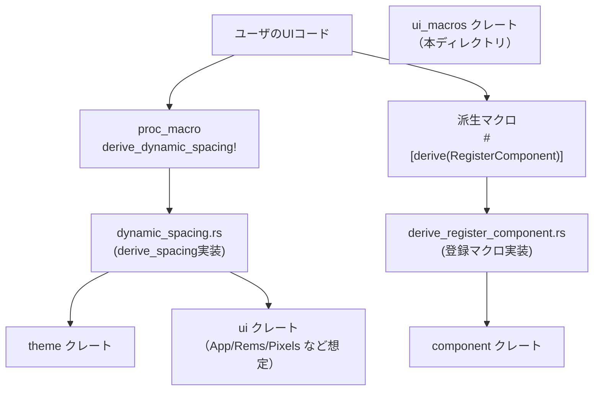
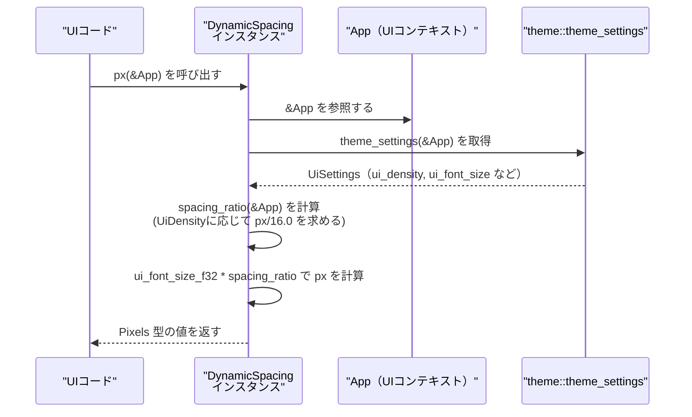

# ui_macros ディレクトリ解説

## 1. ざっくり一言

UI フレームワーク向けの **proc-macro クレート**で、  

- UI 密度（Compact / Default / Comfortable）に応じてサイズが変わる `DynamicSpacing` 列挙型を自動生成するマクロ  
- `Component` を実装した構造体をコンポーネントレジストリへ自動登録する派生マクロ  

を提供します。

---

## 2. このモジュールの役割

### 2.1 概要

- このディレクトリは Rust の **proc-macro クレート `ui_macros`** の実装です。
- 主な役割は次の 2 つです。
  - UI の余白・パディングなどに使う `DynamicSpacing` 列挙型と、その計算ロジックを **コード生成**する。
  - `component::Component` を実装した型を、`ComponentRegistry` へ **自動登録**するための `#[derive(RegisterComponent)]` を提供する。

### 2.2 アーキテクチャ内での位置づけ

このクレートは「UI / theme / component」などのランタイムクレートとは別にビルド時に動作し、  
ユーザコードのソースを受け取って新たなコード（列挙型や登録関数）を生成します。

主要な関係を Mermaid 図で示します。



※ `theme`, `ui`, `component` クレートの実装はこのチャンクには含まれていませんが、コードから依存が読み取れます。

### 2.3 設計上のポイント

- **ビルド時専用**  
  - Cargo.toml で `proc-macro = true` なライブラリとして定義されており、実行時のロジックは持たず **TokenStream を受け取って TokenStream を返す**関数のみを公開します。
- **状態を持たない実装**  
  - グローバル状態やキャッシュなどはなく、入力トークンから出力トークンを決定的に生成する構造になっています。
- **エラーハンドリング**  
  - `syn::parse_macro_input!` を利用しており、構文が不正な場合はコンパイルエラーとして報告されます。
  - 数値リテラルのパースで `unwrap()` を使っているため、想定外の数値形式の場合はマクロ展開時にコンパイルエラーになります。
- **外部クレートへの強い結合**  
  - `DynamicSpacing` の生成コードは `App`, `Rems`, `Pixels`, `rems`, `px`, `theme::theme_settings`, `theme::UiDensity` などのシンボルを前提としており、**特定の UI / theme 環境での利用を想定**しています。
  - `RegisterComponent` は `component::Component`, `component::register_component`, `component::__private::inventory` に依存します。

---

## 3. 主要な機能一覧

- **`derive_dynamic_spacing` マクロ**  
  - 整数または 3 要素タプルのリストから、UI 密度に応じて値が変わる `DynamicSpacing` 列挙型と、その `rems` / `px` メソッドを自動生成します。
- **`#[derive(RegisterComponent)]` 派生マクロ**  
  - `component::Component` を実装した構造体に対して、コンポーネントレジストリへの登録関数を生成し、`inventory` 経由で自動登録します。

---

## 4. 関数・構造体の解説

### 4.1 型一覧

このディレクトリ内で定義される主な型をまとめます。

| 名前 | 種別 | 定義場所 | 役割 / 用途 |
|------|------|----------|-------------|
| `DynamicSpacingInput` | 構造体 | `dynamic_spacing.rs` | `derive_dynamic_spacing!` マクロの入力全体（カンマ区切りの値リスト）を表すパーサ用の型 |
| `DynamicSpacingValue` | 列挙体 | `dynamic_spacing.rs` | 単一値 or 3 要素タプルの 1 要素分を表すパーサ用の型 |
| `DynamicSpacing` | 列挙体（マクロ生成） | 呼び出し側 | UI 密度に応じて rem / px を返す動的なスペーシング値を表す列挙型。`derive_dynamic_spacing!` によって生成されます |
| `AssertComponent<T>` | 構造体（マクロ生成、内部用） | 派生先モジュール内 | `T: component::Component` という制約を付けることで、`RegisterComponent` 派生対象が `Component` を実装しているかをコンパイル時に確認するためのダミー型 |

`DynamicSpacing` と `AssertComponent` はいずれも **マクロ展開結果としてユーザコード側に生成される型**です。

---

### 4.2 主要な関数 / メソッドの詳細

ここでは特に重要な 5 つの関数・メソッドについて詳しく説明します。

#### 4.2.1 `dynamic_spacing::derive_spacing(input: TokenStream) -> TokenStream`

**概要**

- `derive_dynamic_spacing!` マクロの本体です。
- ユーザが指定した整数または 3 要素タプルのリストから、`DynamicSpacing` 列挙型とその実装（`spacing_ratio`, `rems`, `px`）を生成します。

**引数**

| 引数名 | 型 | 説明 |
|--------|----|------|
| `input` | `proc_macro::TokenStream` | `4, 8, (12, 16, 20)` のようなトークン列。`DynamicSpacingInput` としてパースされます。 |

**戻り値**

- `TokenStream`  
  - 次のようなコード断片を含みます（概略）:
    - `pub enum DynamicSpacing { Base04, Base08, Base16, ... }`
    - `impl DynamicSpacing { fn spacing_ratio(&self, cx: &App) -> f32 { ... } ... }`

**内部処理の流れ**

1. `parse_macro_input!(input as DynamicSpacingInput)` で入力を `DynamicSpacingInput` にパースします。
2. 各 `DynamicSpacingValue` から
   - 列挙子名 `BaseNN`（`NN` は 2 桁 0 埋めの整数）を `format_ident!` で生成します。
   - UI 密度ごとの比率計算式 (`spacing_ratios`) を `quote!` で生成します。
     - 単一値 `n` の場合:  
       - Compact: `(n - 4.0).max(0.0) / 16.0`  
       - Default: `n / 16.0`  
       - Comfortable: `(n + 4.0) / 16.0`
     - タプル `(a, b, c)` の場合:  
       - Compact: `a / 16.0`  
       - Default: `b / 16.0`  
       - Comfortable: `c / 16.0`
3. 同じく各値からドキュメント用の文字列を組み立てます。  
   - 例: `` `4px`|`8px`|`12px (@16px/rem)` - Scales with the user's rem size. ``
4. これらを組み合わせて、`DynamicSpacing` 列挙型と `impl` ブロック全体を `quote!` で構築し、`TokenStream` として返します。

**Examples（使用例）**

以下は典型的なマクロ呼び出し例と、生成されるコードのイメージです。

```rust
// App, Rems, Pixels, rems, px などがスコープにある前提（uiクレートなどから提供される想定）
use ui::{App, Rems, Pixels, rems, px};             // 必要な型・関数をインポートする

ui_macros::derive_dynamic_spacing! {               // proc-macro をアイテム位置で呼び出す
    4,                                             // 単一値 → Base04 というバリアントを生成
    8,                                             // 単一値 → Base08
    (12, 16, 20),                                  // タプル → 中央値 16 を使って Base16 という名前のバリアントを生成
}
```

上の呼び出しは概ね次のようなコードに展開されます（簡略化・コメント追加済み）。

```rust
/// A dynamic spacing system ...
#[derive(Debug, Clone, Copy, PartialEq, Eq, PartialOrd, Ord, Hash)]
pub enum DynamicSpacing {                          // 動的スペーシングを表す列挙型
    #[doc = "`0px`|`4px`|`8px (@16px/rem)` - Scales with the user's rem size."]
    Base04,                                        // Compact:0 / Default:4 / Comfortable:8
    #[doc = "`4px`|`8px`|`12px (@16px/rem)` - Scales with the user's rem size."]
    Base08,
    #[doc = "`12px`|`16px`|`20px (@16px/rem)` - Scales with the user's rem size."]
    Base16,
}

impl DynamicSpacing {
    fn spacing_ratio(&self, cx: &App) -> f32 {     // 内部用の比率計算
        const BASE_REM_SIZE_IN_PX: f32 = 16.0;     // 16px を 1rem の基準とする
        match self {
            DynamicSpacing::Base04 => match ::theme::theme_settings(cx).ui_density(cx) {
                ::theme::UiDensity::Compact => (4.0 - 4.0).max(0.0) / BASE_REM_SIZE_IN_PX,
                ::theme::UiDensity::Default => 4.0 / BASE_REM_SIZE_IN_PX,
                ::theme::UiDensity::Comfortable => (4.0 + 4.0) / BASE_REM_SIZE_IN_PX,
            },
            // Base08, Base16 も同様のパターンで展開される
            _ => unimplemented!(),
        }
    }

    pub fn rems(&self, cx: &App) -> Rems {         // rem単位を返す
        rems(self.spacing_ratio(cx))
    }

    pub fn px(&self, cx: &App) -> Pixels {         // ピクセル単位を返す
        let ui_font_size_f32: f32 =
            ::theme::theme_settings(cx).ui_font_size(cx).into();
        px(ui_font_size_f32 * self.spacing_ratio(cx))
    }
}
```

実際には全てのバリアントについて `match` 分岐が生成されます。

**Errors / Panics**

- `LitInt::base10_parse::<u32>()` / `<f32>()` に対する `unwrap()` を使用しているため、  
  - 10 進整数リテラルでない（例: `0x10` など）  
  - 型の範囲外の値  
  などの場合は **マクロ展開時にパニックし、コンパイルエラー**になります。
- 同じ「基準値」から同一のバリアント名（`BaseNN`）が重複して生成されると、  
  - 列挙型の定義や `match` 分岐が重複し、コンパイルエラーになります。

**Edge cases（エッジケース）**

- 単一値が 4 未満の場合  
  - Compact 用の値 `(n - 4.0)` は 0 未満になり得ますが、`.max(0.0)` により **0 でクリップ**されます。
  - 例: `2` → Compact: 0px, Default: 2px, Comfortable: 6px（@16px/rem 時）。
- 非リテラルや浮動小数点リテラルは扱えません。  
  - `LitInt` を使っているため、`4.0` や `SOME_CONST` のような入力は構文的にエラーになります。
- タプル `(a, b, c)` は **必ず 3 要素**である必要があります。2 要素や 4 要素ではパースに失敗します。

**使用上の注意点**

- マクロが生成するコードは `App`, `Rems`, `Pixels`, `rems`, `px`, `::theme::theme_settings`, `::theme::UiDensity` を前提としており、  
  これらのシンボルが存在しない環境で使うとコンパイルエラーになります。
- 同じ「基準値」（単一値の場合はその値、タプルの場合は中央値）を複数回指定しないようにする必要があります（`BaseNN` が重複するため）。
- 値が増えるほど `DynamicSpacing` の列挙子と `match` 分岐が増えるので、非常に多数の値を定義する場合はコードサイズに注意が必要です。

---

#### 4.2.2 `DynamicSpacing::spacing_ratio(&self, cx: &App) -> f32`

**概要**

- `DynamicSpacing` の各バリアントに対して、UI 密度に応じた **基準比率（rem に対する倍率）**を返します。
- この値は内部計算用であり、`rems` / `px` からのみ呼び出すことを意図しています。

**引数**

| 引数名 | 型 | 説明 |
|--------|----|------|
| `self` | `&DynamicSpacing` | 対象のスペーシング値（`Base04` など） |
| `cx` | `&App` | UI コンテキスト。`theme_settings(cx)` 呼び出しに使われます。`App` 型は外部クレートで定義されています。 |

**戻り値**

- `f32`  
  - 「1rem あたり何倍か」を表す比率。  
  - 実際の px 変換には `ui_font_size_f32` を掛け合わせて使用します。

**内部処理の流れ**

1. `const BASE_REM_SIZE_IN_PX: f32 = 16.0;` を基準とします。
2. `match self` で `DynamicSpacing` の各バリアントを分岐します。
3. 各バリアントごとに、`::theme::theme_settings(cx).ui_density(cx)` を呼び出し、
   - `UiDensity::Compact` / `Default` / `Comfortable` に応じて  
     事前にマクロで埋め込まれた計算式を評価します。
4. 最終的に `px / 16.0` の形で `f32` 値を返します。

**Examples（使用例）**

`spacing_ratio` 自体は `pub` ではなく、`rems` / `px` から内部的に利用されます。  
ここでは概念的な利用例を示します。

```rust
// cx: &App がある前提
let spacing = DynamicSpacing::Base08;              // Base08 のスペーシング値を選択する
let ratio: f32 = spacing.spacing_ratio(cx);        // 現在の UiDensity に応じた比率を取得する
```

**Errors / Panics**

- 関数内には `unwrap` などはなく、`theme_settings` 側の実装に依存します。
- このチャンクからは `theme_settings` のエラー条件は読み取れません。

**Edge cases**

- `DynamicSpacing` のバリアントが増えるほど `match` 分岐も増えますが、  
  パターンマッチとして全て網羅されるように生成されます。
- 単一値が 4 未満のバリアントでは、Compact の比率が 0 になる場合があります（前述のクリップ処理）。

**使用上の注意点**

- API としては公開されていません（`fn` で `pub` なし）。  
  直接呼び出すのではなく、`rems` / `px` メソッド経由で利用する前提の設計です。

---

#### 4.2.3 `DynamicSpacing::rems(&self, cx: &App) -> Rems`

**概要**

- `spacing_ratio` を使って、実際の **rem 単位の値**を `Rems` 型で返します。

**引数**

| 引数名 | 型 | 説明 |
|--------|----|------|
| `self` | `&DynamicSpacing` | 対象のスペーシング値 |
| `cx` | `&App` | UI コンテキスト |

**戻り値**

- `Rems`  
  - UI クレート側で定義された rem 単位の長さ型（このチャンクには定義がありません）。

**内部処理の流れ**

1. `self.spacing_ratio(cx)` を呼び出し、`f32` の比率を取得します。
2. `rems(self.spacing_ratio(cx))` を呼び出して `Rems` 型に変換して返します。  
   - `rems` 関数は外部クレート（おそらく `ui`）で提供されます。

**Examples（使用例）**

```rust
use ui::{App, Rems, rems};                          // App/Rems/rems をインポートする

fn padding_in_rems(cx: &App) -> Rems {              // rem単位のパディングを計算する関数
    DynamicSpacing::Base08.rems(cx)                 // Base08 の rem 値をそのまま返す
}
```

**Errors / Panics**

- `rems` 関数の実装に依存しますが、このチャンクからはエラー条件は読み取れません。
- `spacing_ratio` 自体は通常の浮動小数点演算のみで、特別なパニック要因はありません。

**Edge cases**

- UI 密度が変わると `spacing_ratio` の戻り値が変わるため、  
  同じ `BaseNN` でも rem 値が密度に依存して変化します。

**使用上の注意点**

- レイアウトロジックの一部として、UI 密度に応じた相対的な余白を取りたい場合に使うと整合性が保ちやすくなります。
- 固定 px 指定が必要な箇所では、`px` メソッドの方が直接的です。

---

#### 4.2.4 `DynamicSpacing::px(&self, cx: &App) -> Pixels`

**概要**

- 現在の UI フォントサイズと `spacing_ratio` を組み合わせて、**ピクセル単位の値**を `Pixels` 型で返します。

**引数**

| 引数名 | 型 | 説明 |
|--------|----|------|
| `self` | `&DynamicSpacing` | 対象のスペーシング値 |
| `cx` | `&App` | UI コンテキスト。テーマ設定およびフォントサイズ取得に使われます。 |

**戻り値**

- `Pixels`  
  - UI クレート側で定義されたピクセル単位の長さ型（このチャンクには定義がありません）。

**内部処理の流れ**

1. `::theme::theme_settings(cx).ui_font_size(cx).into()` で UI フォントサイズを `f32` に変換します。
2. `self.spacing_ratio(cx)` を呼び出して比率を取得します。
3. `ui_font_size_f32 * self.spacing_ratio(cx)` で最終的な px 値を計算し、`px(...)` 関数で `Pixels` 型へ変換して返します。

**Examples（使用例）**

```rust
use ui::{App, Pixels, px};                          // App/Pixels/px をインポートする

fn padding_in_pixels(cx: &App) -> Pixels {          // px単位のパディングを計算する関数
    DynamicSpacing::Base08.px(cx)                   // 現在のフォントサイズと密度に応じた px 値を取得する
}
```

**Errors / Panics**

- `theme_settings` や `ui_font_size`、`px` 関数の実装に依存しますが、このチャンクからはエラー条件は読み取れません。
- `spacing_ratio` 側の注意点は前述の通りです。

**Edge cases**

- ユーザのフォントサイズ設定が大きい／小さい場合、それに比例して px 値も増減します。
- UI 密度とフォントサイズの両方が変更された場合、その組み合わせで値が決まります。

**使用上の注意点**

- 「ピクセルでレイアウトするが、ユーザのフォントサイズや密度設定を尊重したい」という場面に適しています。
- 配置を完全固定にしたい場合（ユーザ設定に影響されないレイアウト）は、このメソッドではなく固定値を使う必要があります。

---

#### 4.2.5 `derive_register_component::derive_register_component(input: TokenStream) -> TokenStream`

**概要**

- `#[proc_macro_derive(RegisterComponent)]` の実装です。
- 対象の型が `component::Component` を実装していることをコンパイル時に検証しつつ、  
  コンポーネントレジストリへ登録するための関数と `inventory` 登録コードを生成します。

**引数**

| 引数名 | 型 | 説明 |
|--------|----|------|
| `input` | `proc_macro::TokenStream` | `struct MyComponent;` 等の `DeriveInput` としてパースされるトークン列 |

**戻り値**

- `TokenStream`  
  - 派生対象と同じモジュールに対して、次のようなコードを追加するトークン列です（概略）。

**内部処理の流れ**

1. `parse_macro_input!(input as DeriveInput)` で入力を `syn::DeriveInput` としてパースします。
2. `input.ident` から型名（例: `MyComponent`）を取得します。
3. `__component_registry_internal_register_{名前}` という形の関数名を `syn::Ident::new` で生成します。
4. `quote!` を使って次のようなコードを生成します。
   - `T: component::Component` の制約付きダミー型 `AssertComponent<T>` と、そのインスタンスを束縛するコード。  
     → `T` に `component::Component` が実装されていない場合、コンパイルエラーになります。
   - `fn __component_registry_internal_register_MyComponent()` という登録関数。  
     中で `component::register_component::<MyComponent>();` を呼び出します。
   - `component::__private::inventory::submit! { component::ComponentFn::new(__component_registry_internal_register_MyComponent) }` で、`inventory` に登録関数を登録します。

**Examples（使用例）**

ドキュメントコメントに含まれている例に、行コメントを追加したものです。

```rust
use ui::Component;                                  // Component トレイトをインポートする
use ui_macros::RegisterComponent;                   // 派生マクロをインポートする

#[derive(RegisterComponent)]                        // この構造体をコンポーネントとして自動登録する
struct MyComponent;                                 // シンプルなコンポーネント型

impl Component for MyComponent {                    // Component トレイトの実装
    // Component の具体的なメソッド実装はここに書く
}
```

上記は概ね次のようなコードに展開されます（簡略化）。

```rust
const _: () = {                                     // コンパイル時だけ使うダミーの定数
    struct AssertComponent<T: component::Component>(::std::marker::PhantomData<T>);
                                                    // T: component::Component という制約付きダミー型
    let _ = AssertComponent::<MyComponent>(::std::marker::PhantomData);
                                                    // MyComponent が Component を実装していないとここでコンパイルエラー
};

#[allow(non_snake_case)]
fn __component_registry_internal_register_MyComponent() {   // 自動登録用の関数
    component::register_component::<MyComponent>();         // ComponentRegistry に MyComponent を登録する
}

component::__private::inventory::submit! {                  // inventory に登録関数を登録
    component::ComponentFn::new(__component_registry_internal_register_MyComponent)
}
```

**Errors / Panics**

- `MyComponent` が `component::Component` を実装していない場合、  
  - `AssertComponent::<MyComponent>` のインスタンス生成により **トレイト境界違反としてコンパイルエラー**になります。
- `component` クレートに `Component`, `register_component`, `ComponentFn`, `__private::inventory::submit!` が存在しない場合もコンパイルエラーになります。

**Edge cases**

- 派生対象がジェネリック型である場合  
  - この実装では `input.ident`（型名）しか使っておらず、型パラメータやライフタイムを展開に含めていません。  
  - そのため、ジェネリック型に対する挙動は Rust の型システムに大きく依存し、  
    具体的な動作（コンパイル可否）をこのコードだけからは断定できません。
- `enum` や `union` など、構造体以外への適用可否も `component::Component` の想定に依存します。  
  このチャンクからは前提とされる型の種類は読み取れませんが、例では構造体を想定しています。

**使用上の注意点**

- 派生対象は **`component::Component` を実装していることが必須**です。  
  実装していない場合、コンパイル時にエラーになります。
- `component` クレートが `inventory` ベースの仕組みを持っていることが前提であり、  
  別の登録メカニズムへ切り替える場合はマクロ実装の更新が必要になります。

---

## 5. データフロー

ここでは `DynamicSpacing::px(&self, cx: &App)` を呼び出して  
最終的な px 値が計算されるまでの流れを、代表的なシナリオとして整理します。

### 5.1 処理の要点

- `DynamicSpacing` のバリアント（例: `Base08`）は、マクロ生成時に UI 密度ごとの基準 px 値を持つようにコード化されています。
- 実行時には
  1. `theme_settings(cx)` から UI 密度と UI フォントサイズを取得し、
  2. 密度に応じた px 値を 16px 基準の rem 比率に変換し、
  3. 実際のユーザ設定フォントサイズを掛けて最終的な px を求めます。

### 5.2 シーケンス図



このように、`DynamicSpacing` はテーマ設定とフォントサイズ設定の両方に基づいて  
最終的な px 値を決定する役割を持ちます。

---

## 6. 使い方（How to Use）

### 6.1 基本的な使用方法

#### 6.1.1 `derive_dynamic_spacing!` で DynamicSpacing を定義する

`DynamicSpacing` 列挙型を生成するための典型的なコード例です。

```rust
use ui::{App, Rems, Pixels, rems, px};             // マクロ展開先で必要となる型・関数をインポートする
use ui_macros::derive_dynamic_spacing;             // （または ui_macros::derive_dynamic_spacing! とパス指定で呼び出す）

// アイテム位置でマクロを呼び出す
ui_macros::derive_dynamic_spacing! {               // DynamicSpacing 列挙型と実装を自動生成する
    4,                                             // 単一値: Base04 （Compact:0px, Default:4px, Comfortable:8px）
    8,                                             // 単一値: Base08
    12,                                            // 単一値: Base12
    (16, 20, 24),                                  // タプル: Base20 （Compact:16px, Default:20px, Comfortable:24px）
}
```

このマクロを定義したモジュール内では、以降 `DynamicSpacing::Base08` などが利用可能になります。

```rust
fn example_spacing_px(cx: &App) -> Pixels {        // UI コンテキストから px を計算する関数
    DynamicSpacing::Base08.px(cx)                  // Base08 の密度・フォントサイズ依存の px 値を取得する
}

fn example_spacing_rems(cx: &App) -> Rems {        // rem単位での例
    DynamicSpacing::Base08.rems(cx)                // Base08 の rem 値を取得する
}
```

#### 6.1.2 `#[derive(RegisterComponent)]` でコンポーネントを登録する

`component::Component` を実装するコンポーネントを自動登録する例です。

```rust
use ui::Component;                                  // Component トレイトをインポートする
use ui_macros::RegisterComponent;                   // RegisterComponent 派生マクロをインポートする

#[derive(RegisterComponent)]                        // レジストリへの登録コードを自動生成する
struct Button;                                      // 例: Button コンポーネント

impl Component for Button {                         // Component トレイトの実装
    // Button 独自の振る舞いをここに定義する
}
```

このように定義しておくと、`component` クレート側の `inventory` 仕組みを通じて  
`Button` がコンポーネントレジストリに登録されるようになります（詳細実装はこのチャンクにはありません）。

---

### 6.2 よくある使用パターン

#### パターン 1: 単一値だけでスケーリングに任せる

```rust
ui_macros::derive_dynamic_spacing! {               // 単一値のみで定義する
    4,                                             // Base04: Compact:0, Default:4, Comfortable:8
    8,                                             // Base08: Compact:4, Default:8, Comfortable:12
    12,                                            // Base12: Compact:8, Default:12, Comfortable:16
}
```

- シンプルなケースでは単一値だけを指定し、Compact/Comfortable は ±4px のルールに任せる使い方です。

#### パターン 2: 特定値だけ 3 タプルで細かく調整する

```rust
ui_macros::derive_dynamic_spacing! {
    4,                                             // 通常のルールに任せる
    8,                                             // 同上
    (10, 12, 16),                                  // Base12: Compact:10, Default:12, Comfortable:16 と個別指定
}
```

- ほとんどは単一値でよいが、ある値だけは密度ごとに細かく調整したい場合にタプルを併用します。

#### パターン 3: 複数コンポーネントをまとめて自動登録する

```rust
use ui::Component;
use ui_macros::RegisterComponent;

#[derive(RegisterComponent)]
struct Button;                                     // ボタンコンポーネント

impl Component for Button { /* ... */ }

#[derive(RegisterComponent)]
struct Panel;                                      // パネルコンポーネント

impl Component for Panel { /* ... */ }
```

- アプリケーション内の複数コンポーネントに対して `#[derive(RegisterComponent)]` を付けることで、  
  レジストリへの登録処理を一括して自動化できます。

---

### 6.3 使用上の注意点（まとめ）

- **DynamicSpacing マクロの入力形式**
  - 入力は **10 進整数リテラルのみ**を想定しています（`base10_parse` を使用）。  
    `0x10`, `4.0`, 定数名などは使用できません。
  - タプルは必ず `(a, b, c)` の **3 要素**である必要があります。
- **バリアント名の重複**
  - 単一値 `n` / タプル `(a, b, c)` ともに、中央値（単一値はその値、タプルは `b`）から `BaseNN` という名前が生成されます。
  - これが重複すると列挙子や `match` 分岐が重複し、コンパイルエラーになります。
- **外部型・関数への依存**
  - `App`, `Rems`, `Pixels`, `rems`, `px`, `theme::theme_settings`, `theme::UiDensity` などが存在しないとコンパイルできません。  
    このクレート単体では定義されていないため、ワークスペース側で提供されている必要があります。
- **コンポーネント登録マクロの前提**
  - `#[derive(RegisterComponent)]` を付けた型は **`component::Component` を実装していることが必須**です。
  - `component` クレートに `register_component`、`ComponentFn`、`__private::inventory::submit!` が存在していなければなりません。
- **ジェネリック型への適用**
  - `RegisterComponent` の実装は型パラメータやライフタイムを展開に含めておらず、  
    ジェネリック型に対して利用した場合の挙動は Rust の型システムと `component` クレート側の期待に依存します。  
    このチャンクからだけでは安全に利用できる条件は明確ではありません。

---

## 7. 関連ファイル

| パス | 役割 / 関係 |
|------|------------|
| `ui_macros/Cargo.toml` | `ui_macros` クレートの設定ファイル。`proc-macro = true` のライブラリとして定義し、`quote` / `syn` に依存すること、`component` / `ui` を dev-dependency として持つことを指定しています。 |
| `ui_macros/src/ui_macros.rs` | クレートのエントリポイント。`#[proc_macro] pub fn derive_dynamic_spacing` と `#[proc_macro_derive(RegisterComponent)]` を公開し、それぞれ `dynamic_spacing` / `derive_register_component` モジュールへ委譲しています。 |
| `ui_macros/src/dynamic_spacing.rs` | `derive_dynamic_spacing!` マクロの実装本体。入力パース（`DynamicSpacingInput`, `DynamicSpacingValue`）と `DynamicSpacing` 列挙型＋メソッド群のコード生成ロジックを持ちます。 |
| `ui_macros/src/derive_register_component.rs` | `#[derive(RegisterComponent)]` 派生マクロの実装本体。`component::Component` 実装の確認と `inventory` を用いた登録関数の生成を行います。 |
| `component` クレート（外部） | `component::Component`, `register_component`, `ComponentFn`, `__private::inventory::submit!` などを提供すると考えられるクレートです。このチャンクには実装は含まれていません。 |
| `ui` クレート（外部） | `App`, `Rems`, `Pixels`, `rems`, `px` など、`DynamicSpacing` の利用に必要な型や関数を提供すると考えられるクレートです。 |
| `theme` クレート（外部） | `theme::theme_settings`, `theme::UiDensity` など、UI 密度やフォントサイズの情報を提供するクレートです。`DynamicSpacing` の計算ロジックはこのクレートに依存しています。 |

このディレクトリのコードを理解する際は、上記の外部クレート側の API と合わせて全体像を把握すると、  
`DynamicSpacing` とコンポーネント登録の仕組みがどのように連携しているかを把握しやすくなります。
