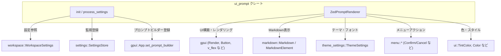
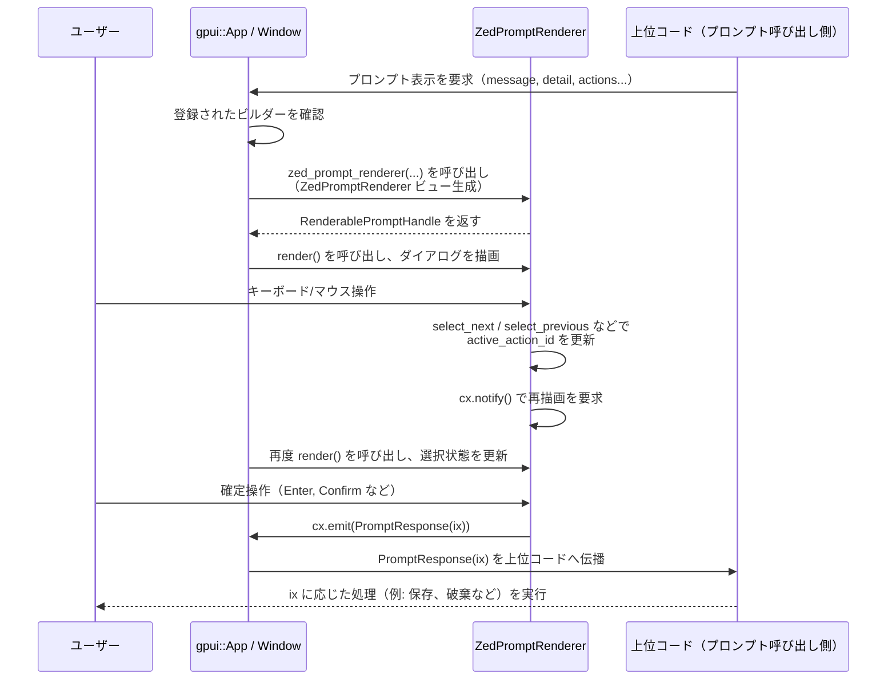

## 1. ざっくり一言

`ui_prompt` クレートは、**GPUI のプロンプト表示をこのプロジェクト独自のダイアログ UI に差し替えるためのモジュール**です。  
ワークスペース設定に応じてシステム標準のダイアログと内部実装のダイアログを切り替えつつ、Markdown でメッセージを描画します。

---

## 2. このモジュールの役割

### 2.1 概要

- このモジュールは、**ユーザーに確認や選択を促すプロンプトダイアログ**を描画する役割を持ちます。
- `workspace::WorkspaceSettings` の `use_system_prompts` 設定と OS に応じて、
  - OS のネイティブプロンプトを使うか、
  - 内蔵の `ZedPromptRenderer` によるプロンプトを使うか  
  を切り替えます。
- 内蔵プロンプトは **Markdown でメッセージ／詳細を表示**し、ボタン・キーボード操作を通じて `PromptResponse` を発行します。

### 2.2 アーキテクチャ内での位置づけ

このクレートが他のクレート／型とどうつながるかを、主要な依存関係に絞って表します。



- アプリ初期化時に `init` が呼ばれ、`WorkspaceSettings` と `SettingsStore` に基づいてプロンプトビルダーを登録します。
- 実際の描画・イベント処理は `ZedPromptRenderer` が行い、GPUI と UI/テーマ・Markdown クレートに依存しています。

### 2.3 設計上のポイント

- **設定駆動の切り替え**
  - `WorkspaceSettings::use_system_prompts` と `cfg!(target_os)` によって、プロンプト実装を決定しています。
- **状態付きビュー**
  - `ZedPromptRenderer` はアクティブなボタンのインデックス (`active_action_id`) やフォーカスハンドルを内部状態として持ちます。
- **イベント駆動**
  - メニューアクション (`menu::Confirm` など) やボタンのクリックを `cx.emit(PromptResponse)` にマッピングすることで、上位コードへ結果を返します。
- **Markdown による本文表示**
  - 本文と詳細を `markdown::Markdown` で描画し、テーマ設定 (`ThemeSettings`) に応じたフォント・色・選択色を適用します。
- **プラットフォーム条件付きコンパイル**
  - Linux / FreeBSD では常に内部プロンプトを使用するように分岐しています。

---

## 3. 主要な機能一覧

このモジュールが提供している主な機能は次のとおりです。

- **プロンプトビルダーの初期化**
  - `init` 関数で、アプリ起動時にプロンプトレンダラーを設定し、設定変更時の再設定も行います。
- **設定に応じたプロンプト種別の切り替え**
  - `use_system_prompts` と OS に応じて、システムプロンプトか内部プロンプトかを選択します。
- **内部プロンプト UI のレンダリング**
  - `ZedPromptRenderer` により、Markdown メッセージ・オプションボタン付きのダイアログを描画します。
- **キーボードショートカット／メニューアクションのハンドリング**
  - `menu::Confirm`, `menu::Cancel`, `menu::SelectNext` などを受け取り、選択中のボタンを変化させたり、結果を確定します。
- **テーマ／フォントに応じた Markdown スタイルの生成**
  - `markdown_style` 関数で、テーマやフォント設定から `MarkdownStyle` を構築します。

---

## 4. 関数・構造体の解説

### 4.1 型一覧（このファイルで定義されているもの）

| 名前               | 種別     | 役割 / 用途                                                                 |
|--------------------|----------|------------------------------------------------------------------------------|
| `ZedPromptRenderer` | 構造体   | 内部プロンプトダイアログの状態（メッセージ、ボタン一覧、選択状態、フォーカスなど）を保持し、描画やイベント処理を行う |

### 4.2 主要な関数

#### `pub fn init(cx: &mut App)`

**概要**

- アプリケーション起動時などに呼び出し、**現在の設定に応じてプロンプトレンダラーを登録**します。
- さらに、設定の変更を監視し、必要に応じて再設定します。

**引数**

| 引数名 | 型      | 説明                                     |
|--------|---------|------------------------------------------|
| `cx`   | `&mut App` | GPUI アプリケーションコンテキスト |

**戻り値**

- なし（`()`）。副作用として `cx` に対してプロンプトビルダーの登録と設定監視の登録を行います。

**内部処理の流れ**

1. `process_settings(cx)` を即時に呼び出し、現在の設定に基づいてプロンプトビルダーを登録します。
2. `cx.observe_global::<SettingsStore>(process_settings)` を呼び出し、設定ストアのグローバルな変化を監視するオブザーバを登録します。
3. `.detach()` で戻り値（おそらくオブザーバハンドル）を破棄しています。  
   - `observe_global` の詳細な挙動はこのチャンクにはありませんが、名前からは「`SettingsStore` の変化に応じて `process_settings` を再度呼び出す」仕組みと考えられます。

**Examples（使用例）**

アプリ初期化時に呼び出す想定の例です。

```rust
use gpui::App;              // GPUI のアプリケーション型
use ui_prompt::init;        // ui_prompt クレートの初期化関数

fn setup_app(cx: &mut App) { // アプリのセットアップ中に呼ぶ想定の関数
    init(cx);                // プロンプトシステムを設定に応じて構成する
    // ここで他の初期化処理を続ける ...
}
```

**Edge cases（エッジケース）**

- `WorkspaceSettings` に `use_system_prompts` が存在しない場合などは、コンパイルエラーとなるため実行前に検出されます。
- `SettingsStore` の変化が一度も起こらない場合でも、初回の `process_settings` により適切な設定が適用されます。

**使用上の注意点**

- この関数はアプリケーションの**初期化フェーズで一度呼び出す**ことを想定している構造になっています。
- 同じ `App` に対して何度呼び出すかについての制約はコードからは読み取れませんが、意図せず複数回呼ぶとオブザーバが重複登録される可能性があります（`observe_global` の仕様次第です）。

---

#### `fn process_settings(cx: &mut App)`

**概要**

- グローバルな `WorkspaceSettings` を読み込み、**システムプロンプトを使うか内部プロンプトを使うかを決定**し、`App` に対してプロンプトビルダーを登録します。

**引数**

| 引数名 | 型      | 説明                      |
|--------|---------|---------------------------|
| `cx`   | `&mut App` | アプリケーションコンテキスト |

**戻り値**

- なし（`()`）。

**内部処理の流れ**

1. `WorkspaceSettings::get_global(cx)` でワークスペース設定を取得します。
2. `settings.use_system_prompts` と OS 条件を評価します：
   - `settings.use_system_prompts` が `true` かつ  
     `cfg!(not(any(target_os = "linux", target_os = "freebsd")))` が `true` の場合
     - Linux / FreeBSD 以外（おそらく macOS / Windows）の環境でシステムプロンプトを使う設定になっているため、`cx.reset_prompt_builder()` を呼びます。
   - それ以外の場合
     - 内部プロンプトシステムを使うため、`cx.set_prompt_builder(zed_prompt_renderer)` を呼びます。

**重要な挙動（OS 依存）**

- **Linux / FreeBSD の場合**
  - `cfg!(not(any(target_os = "linux", target_os = "freebsd")))` が常に `false` となるため、`use_system_prompts` の値に関わらず **常に内部プロンプト** (`zed_prompt_renderer`) を使用します。
- **その他の OS（例: macOS, Windows）**
  - `use_system_prompts == true` → OS ネイティブのプロンプトにフォールバック（`reset_prompt_builder`）。
  - `use_system_prompts == false` → 内部プロンプト (`zed_prompt_renderer`) を利用。

**Examples（使用例）**

この関数自体は `init` からだけ呼び出されています。内部での利用例は次の 1 行です。

```rust
// use_system_prompts が false または Linux/FreeBSD の場合に実行される
cx.set_prompt_builder(zed_prompt_renderer); // 内部プロンプトレンダラーを登録する
```

**Edge cases（エッジケース）**

- `WorkspaceSettings::get_global(cx)` が設定の読み込みに失敗した場合の挙動は、このチャンクには現れません。
- `use_system_prompts` のデフォルト値が何かもコードからは読み取れません。

**使用上の注意点**

- OS によって `use_system_prompts` の意味が変わります。特に Linux / FreeBSD ではフラグを `true` にしてもシステムプロンプトには切り替わらない点に注意が必要です。

---

#### `fn zed_prompt_renderer(...) -> RenderablePromptHandle`

```rust
fn zed_prompt_renderer(
    level: PromptLevel,
    message: &str,
    detail: Option<&str>,
    actions: &[PromptButton],
    handle: PromptHandle,
    window: &mut Window,
    cx: &mut App,
) -> RenderablePromptHandle
```

**概要**

- GPUI の `App::set_prompt_builder` に渡されるコールバック関数です。
- プロンプトのレベル・本文・詳細・アクションボタン情報を受け取り、それを元に `ZedPromptRenderer` ビューを生成し、`RenderablePromptHandle` に包んで返します。

**引数**

| 引数名   | 型                      | 説明                                                                 |
|----------|-------------------------|----------------------------------------------------------------------|
| `level`  | `PromptLevel`           | プロンプトの重要度・レベル（警告／情報など）。この実装では `_level` として保持するのみです。 |
| `message`| `&str`                  | メインメッセージ（Markdown として解釈されます）。                   |
| `detail` | `Option<&str>`          | 追加の詳細メッセージ（Markdown）。空文字列は無視されます。          |
| `actions`| `&[PromptButton]`       | 表示するボタン群。ラベル文字列が抽出され、`actions: Vec<String>` に格納されます。 |
| `handle` | `PromptHandle`          | GPUI のプロンプトハンドル。ビューとの関連付けに使用されます。       |
| `window` | `&mut Window`           | プロンプトが描画されるウィンドウ。                                 |
| `cx`     | `&mut App`              | アプリケーションコンテキスト。ビューの生成などに使用されます。      |

**戻り値**

- `RenderablePromptHandle`  
  `handle.with_view(renderer, window, cx)` によって生成される、GPUI による管理付きのプロンプトハンドルです。

**内部処理の流れ**

1. `cx.new` を使って `ZedPromptRenderer` のインスタンスを `Entity<ZedPromptRenderer>` として生成します。
   - `message`: `Markdown::new(SharedString::new(message), ...)` で Markdown ビューを生成し、`Entity<Markdown>` として保持します。
   - `actions`: `actions` スライスから `label().to_string()` でラベル文字列を抽出し、`Vec<String>` に格納します。
   - `focus`: `cx.focus_handle()` でフォーカスハンドルを取得します。
   - `active_action_id`: 初期値として `0`（最初のボタン）をセットします。
   - `detail`: `detail` が `Some` かつ空文字列でない場合のみ `Markdown` エンティティを生成します。
2. `handle.with_view(renderer, window, cx)` を呼び出し、プロンプトハンドルとビューを関連付けた `RenderablePromptHandle` を返します。

**Examples（使用例）**

この関数は直接外部から呼ばれる想定ではなく、`process_settings` 内でプロンプトビルダーとして登録されます。

```rust
// process_settings の中から
cx.set_prompt_builder(zed_prompt_renderer); // プロンプト生成時に zed_prompt_renderer が呼ばれるよう登録
```

**Errors / Panics**

- この関数自体には明示的なパニックやエラー処理はありません。
- ただし、`actions` が空であっても `ZedPromptRenderer` は生成されます。  
  後続のメソッド（`select_next` など）では `self.actions.len()` を割り算に使うため、**空の `actions` を前提としない設計**になっている点に注意が必要です（詳細は後述）。

**Edge cases（エッジケース）**

- `detail` が `Some("")` の場合は `filter(|text| !text.is_empty())` により `None` になります（つまり詳細は表示されません）。
- `detail` が `None` の場合も同様に詳細は表示されません。
- `actions` に `"Cancel"` というラベルを持つボタンが含まれていない場合、`cancel` メソッドでキャンセル時に何も emit されません（仕様上許容されているケースと考えられます）。

**使用上の注意点**

- `actions` は **少なくとも 1 要素以上** を含むことが安全です。空の `actions` を渡した場合、`ZedPromptRenderer` 内の一部メソッドでパニックが発生しうるためです。
- `level` は現状 `_level` フィールドとして保持されるだけで UI 上は使われていません。そのため、レベルに応じた見た目の違いを出したい場合は `render` 実装に手を入れる必要があります。

---

#### `fn markdown_style(main_message: bool, window: &Window, cx: &App) -> MarkdownStyle`

**概要**

- テーマ・フォント設定に基づいて、Markdown テキストを描画するための `MarkdownStyle` を構築します。
- メインメッセージ用（強調色）と詳細用（ミュート色）で色を切り替えます。

**引数**

| 引数名        | 型          | 説明                                                   |
|---------------|-------------|--------------------------------------------------------|
| `main_message`| `bool`      | `true` ならメインメッセージ用、`false` なら詳細用のスタイルを生成します。 |
| `window`      | `&Window`   | 現在のウィンドウ。デフォルトのテキストスタイル取得に使用します。         |
| `cx`          | `&App`      | アプリコンテキスト。テーマ (`cx.theme()`) 取得などに使用します。        |

**戻り値**

- `MarkdownStyle`  
  - `base_text_style`: フォントファミリ・サイズ・色が `ThemeSettings` に従って調整されたスタイル。
  - `selection_background_color`: テーマの `element_selection_background` を使用。

**内部処理の流れ**

1. `window.text_style()` でベースとなる `TextStyle` を取得します。
2. `ThemeSettings::get_global(cx)` でテーマ設定を取得し、`settings.ui_font_size(cx)` から UI 用フォントサイズを決定します。
3. `main_message` が `true` なら `Color::Default.color(cx)`、`false` なら `Color::Muted.color(cx)` を使って文字色を決定します。
4. `base_text_style.refine(&TextStyleRefinement { ... })` でフォントファミリ・サイズ・色を上書きします。
5. `MarkdownStyle` を生成し、`selection_background_color` に `cx.theme().colors().element_selection_background` を設定した上で返却します。

**Examples（使用例）**

実際の利用例は `render` メソッド内にあります。

```rust
// メインメッセージ用のスタイル
let main_style = markdown_style(true, window, cx);  // 濃い色で表示される想定

// 詳細メッセージ用のスタイル
let detail_style = markdown_style(false, window, cx); // ミュートされた色で表示される想定
```

**Edge cases（エッジケース）**

- `ThemeSettings::get_global(cx)` がどのような場合に失敗するかはコードからは分かりませんが、ここではエラー処理を行っていません。
- `settings.ui_font_size(cx)` から返る値が極端に小さい／大きい場合、そのままスタイルに反映されます。

**使用上の注意点**

- 色は `main_message` の真偽のみに基づいて決まるため、より細かい色分けが必要な場合は関数の拡張が必要です。
- `window.text_style()` の返すデフォルトスタイルに依存しているため、他の箇所でこのデフォルトが変わるとプロンプトの見た目も影響を受けます。

---

### 4.3 `ZedPromptRenderer` のメソッドと挙動

#### 構造体フィールド

```rust
pub struct ZedPromptRenderer {
    _level: PromptLevel,
    message: Entity<Markdown>,
    actions: Vec<String>,
    focus: FocusHandle,
    active_action_id: usize,
    detail: Option<Entity<Markdown>>,
}
```

- `_level`: プロンプトレベルを保持しますが、現状 UI には使用されていません。
- `message`: メインメッセージ用の Markdown ビュー。
- `actions`: ボタンラベル一覧（`PromptButton::label()` から抽出）。
- `focus`: フォーカス状態を管理する `FocusHandle`。
- `active_action_id`: 現在選択中のボタンのインデックス。
- `detail`: 詳細メッセージ用の Markdown ビュー。なければ `None`。

#### `confirm(&mut self, _: &menu::Confirm, ...)`

- 現在の `active_action_id` を `PromptResponse(self.active_action_id)` として `cx.emit` します。
- アクション配列の長さとの整合性チェックは行っていません。

#### `cancel(&mut self, _: &menu::Cancel, ...)`

- `self.actions` 内で `"Cancel"` というラベルを持つボタンを検索します。
- 見つかった場合、そのインデックスを `PromptResponse(ix)` として emit します。
- 見つからなければ何も emit しません。

#### `select_first`, `select_last`, `select_next`, `select_previous`

- ボタン選択の移動ロジックを担当します。

挙動の要点:

- `select_first`
  - `self.actions.len().saturating_sub(1)` を設定するため、**最後のボタン**を選択します（`len == 0` の場合は 0）。
- `select_last`
  - `self.active_action_id = 0` として、最初のボタンを選択します。
- `select_next`
  - `self.active_action_id = (self.active_action_id + 1) % self.actions.len();`
  - **`self.actions.len() == 0` の場合は 0 での剰余となり、パニックする可能性があります。**
- `select_previous`
  - `active_action_id > 0` なら 1 減算。
  - 0 なら `len().saturating_sub(1)` で最後の要素に移動（ボタンが 1 つの場合は 0 のまま）。

いずれのメソッドも `cx.notify()` を呼び、ビューの再描画を促します。

**使用上の注意点（共通）**

- 上記メソッドは `actions` が **空でないことを前提**とするロジックを含みます（特に `select_next`）。
- キャンセル操作を `"Cancel"` ボタンに対応させたい場合、アクションラベルに厳密に `"Cancel"` を含める必要があります（他言語のラベルなどを使うとヒットしません）。

---

### 4.4 レンダリングとトレイト実装

#### `impl Render for ZedPromptRenderer`

`render(&mut self, window: &mut Window, cx: &mut Context<Self>) -> impl IntoElement`

- テーマ設定 (`ThemeSettings`) と `markdown_style` を利用してダイアログの見た目を組み立てます。
- 構造の概要:
  - 全画面を覆う半透明の黒背景 (`bg(black().opacity(0.2))`)。
  - 画面中央に配置されたダイアログ (`v_flex().w_80().p_4().elevation_3(...)` など)。
  - 上部にメインメッセージ (Markdown)。
  - 必要に応じて小さいフォントで詳細メッセージ。
  - 下部にボタン群（`Button::new(ix, action.clone())`）を縦に並べ、選択中のボタンは `ButtonStyle::Tinted(TintColor::Accent)` で強調。

イベント設定:

- `track_focus(&self.focus)` により、このビューがフォーカスを受け取ることを宣言。
- `.on_action(cx.listener(Self::confirm))` などで、メニューアクションとハンドラメソッドを結びます。
- ボタンには `.on_click(cx.listener(move |_, _, _window, cx| { cx.emit(PromptResponse(ix)); }))` を設定し、クリック時に対応する `PromptResponse` を emit します。

#### `impl EventEmitter<PromptResponse> for ZedPromptRenderer {}`

- この空実装により、`ZedPromptRenderer` が `PromptResponse` 型のイベントを emit できることを GPUI に知らせます。
- 実際の emit は `confirm`, `cancel`, ボタンの `on_click` で行われます。

#### `impl Focusable for ZedPromptRenderer`

```rust
impl Focusable for ZedPromptRenderer {
    fn focus_handle(&self, _: &crate::App) -> FocusHandle {
        self.focus.clone()
    }
}
```

- フォーカス可能なビューであることを表すためのトレイト実装です。
- 引数の `&crate::App` はこのメソッド内では使用されておらず、`self.focus` をそのまま返しています。

---

## 5. データフロー

ここでは、「設定に応じて内部プロンプトが表示され、ユーザーが選択して結果が上位コードに返る」という一連の流れを説明します。

### 処理の要点

1. アプリ初期化時に `ui_prompt::init` が呼ばれ、`process_settings` によってプロンプトビルダーが設定されます。
2. 上位コードが GPUI に対して「プロンプトを表示したい」と要求すると、登録済みの `zed_prompt_renderer` が呼ばれ、`ZedPromptRenderer` ビューが生成されます。
3. ユーザーのキーボード/マウス操作は `menu::SelectNext` などのアクションやボタンのクリックとして `ZedPromptRenderer` に届きます。
4. `ZedPromptRenderer` は内部状態 (`active_action_id`) を更新しつつ、`PromptResponse(ix)` を emit し、結果を上位コードへ伝えます。

### Sequence Diagram



※ 上位コードと GPUI の連携の詳細な実装はこのチャンクには含まれていないため、イベント伝播の部分は名前・挙動からの推測を含みます。

---

## 6. 使い方（How to Use）

### 6.1 基本的な使用方法

このクレートを利用する側は、**アプリの初期化時に `init` を呼び出すだけ**で、以降のプロンプト表示が自動的に内部ダイアログに切り替わります（設定と OS に応じて）。

```rust
use gpui::App;              // GPUI のアプリケーション型
use ui_prompt::init;        // ui_prompt クレートの初期化関数

fn setup_app(cx: &mut App) { // アプリケーション初期化時に呼ばれる関数の一例
    init(cx);                // プロンプトビルダーと設定監視を登録する
    // ここで他のビューやサービスの初期化を行う ...
}
```

以降、上位コードが GPUI を通してプロンプトを表示するとき、`WorkspaceSettings` と OS 条件に応じて:

- システムプロンプトが使われるか、
- `ZedPromptRenderer` による内部プロンプトが使われます。

### 6.2 よくある使用パターン

1. **システムプロンプトと内部プロンプトの切り替え**

   - Linux / FreeBSD 以外の環境では、`WorkspaceSettings::use_system_prompts` の値によってプロンプト種別が切り替わります。
   - 例えば、「通常はシステムプロンプトを使うが、一部環境では内部プロンプトを使いたい」といった運用が可能です。
   - 実際の `WorkspaceSettings` の変更 API はこのチャンクには含まれていませんが、設定を変更すると `SettingsStore` を介して `process_settings` が再実行される構造になっています。

2. **キーボードショートカットでボタン選択を移動**

   - `menu::SelectNext`, `menu::SelectPrevious`, `menu::SelectFirst`, `menu::SelectLast` に応じて `active_action_id` が更新されます。
   - ショートカットの具体的なキーバインドはこのファイルにはありませんが、メニュー／ショートカット設定側からこれらのアクションが送られてくる前提になっています。

3. **Markdown を活かしたメッセージ表現**

   - `message` および `detail` は `Markdown::new` で描画されるため、
     - 見出し
     - 箇条書き
     - コードフォーマット
     などを用いた分かりやすいプロンプト本文を作成できます（Markdown の具体的なサポート範囲は `markdown` クレート側の仕様に依存します）。

### 6.3 使用上の注意点（まとめ）

- **アクション（`actions`）の数**
  - `select_next` が `self.actions.len()` を除算に使うため、**`actions` は 1 件以上必ず渡す必要があります**。
  - 0 件の場合、キー操作でパニックが発生する可能性があります。

- **"Cancel" ラベルの扱い**
  - キャンセル操作 (`menu::Cancel`) 時に特定のボタンを選択させたい場合、そのボタンのラベルは厳密に `"Cancel"` である必要があります。
  - 別の言語や表記（例: `"キャンセル"`）を使うと、`cancel` メソッドでは見つからず、キャンセル操作で何も起きません。

- **OS ごとの挙動差**
  - Linux / FreeBSD では `use_system_prompts` が `true` でも内部プロンプトが使われる設計です。
  - 動作確認やドキュメントを書く際には、OS による挙動差を明記する必要があります。

- **レベル (`PromptLevel`) の未使用**
  - `_level` は保持しているものの、`render` では参照されていません。
  - レベルに応じて色やアイコンを変えたい場合は、`render` 内で `_level` を参照するよう明示的な変更が必要です。

- **テーマ・フォント設定との連動**
  - `ThemeSettings::get_global(cx)` と `settings.ui_font_size(cx)` に依存しているため、同クレート内のテーマ設定が変わるとプロンプトの見た目も変化します。
  - 一貫した見た目を保ちたい場合、他の UI 部分と同じフォント設定を利用していることを前提としています。

---

## 7. 関連ファイル

このディレクトリおよび周辺で、このモジュールと密接に関係するファイル・クレートを一覧にします。

| パス / クレート名               | 役割 / 関係                                                                                           |
|---------------------------------|--------------------------------------------------------------------------------------------------------|
| `ui_prompt/Cargo.toml`          | このクレートの設定ファイル。`gpui`, `markdown`, `menu`, `settings`, `theme_settings`, `ui`, `workspace` への依存を宣言しています。 |
| `ui_prompt/src/ui_prompt.rs`    | 本レポートで解説したメイン実装。プロンプトビルダーの初期化と `ZedPromptRenderer` の定義を含みます。 |
| `gpui`（ワークスペースクレート）       | `App`, `Window`, `Entity`, `Render`, `PromptButton` など UI フレームワークの中核となる型を提供します。パスはワークスペース設定に依存し、このチャンクからは特定できません。 |
| `markdown`（クレート）          | `Markdown`, `MarkdownElement`, `MarkdownStyle` を提供し、Markdown 文字列を UI 要素として描画します。 |
| `menu`（クレート）              | `menu::Confirm`, `menu::Cancel`, `menu::SelectNext` などのアクション型を提供し、キーボード／メニュー操作を表現します。 |
| `theme_settings`（クレート）    | `ThemeSettings` を提供し、UI 全体のテーマ・フォントなどの設定を管理します。                         |
| `settings` / `workspace`（クレート） | `SettingsStore`, `WorkspaceSettings` などの設定関連の型を提供し、`use_system_prompts` などのフラグを保持します。 |

このチャンクにはこれら外部クレートの実装は含まれていないため、詳細な API や挙動は別ファイル・別クレート側のコードを参照する必要があります。
