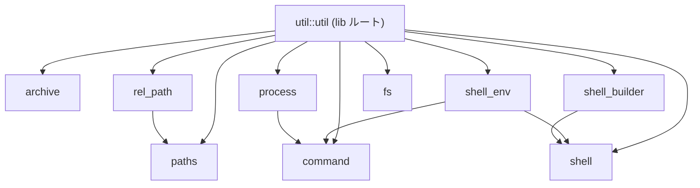
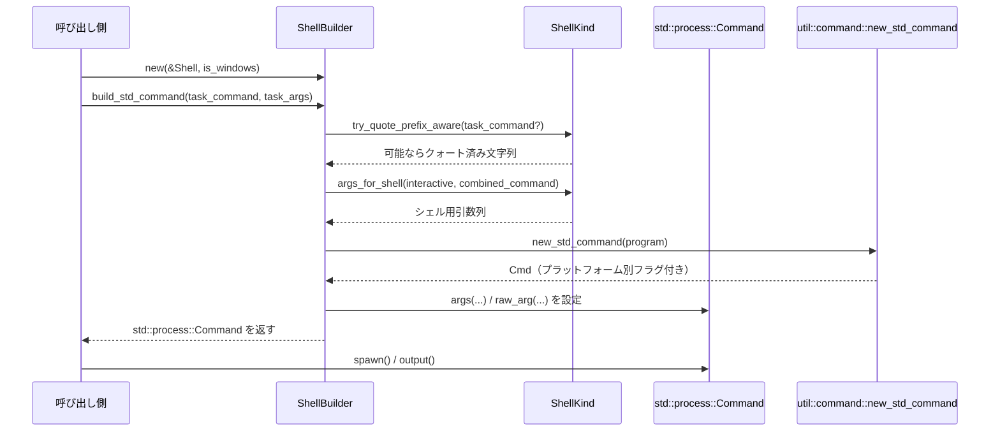

## 1. ざっくり一言

`util` クレートは、Zed / GPUI 全体から再利用される **「インフラ系ユーティリティ集」** です。  
パス操作・シェル／プロセス起動・ZIP 展開・Markdown エスケープ・JSON マージ・テスト補助など、周辺処理をまとめて提供します。

---

## 2. このモジュールの役割

### 2.1 概要

- このクレートは、エディタ本体や周辺サービスから共通して必要になる **OS 依存の処理** や **文字列・パス・JSON の補助処理** を提供します。
- 特に次の領域をカバーします。
  - パス表現の統一 (`RelPath`, `PathStyle`, `PathMatcher` など)
  - シェルや外部コマンドの起動・クォート・環境変数取得
  - ZIP アーカイブ展開、ファイル操作の補助
  - Markdown 文字列の安全なエスケープ
  - JSON のマージ、サイズ／時間表示、テスト用ヘルパー

アプリケーションコードはこのクレートを介することで、OS やシェル差異をあまり意識せずに処理を書けるようになっています。

### 2.2 アーキテクチャ内での位置づけ

主要モジュールの依存関係は概ね次のようになっています。



- `util::util`（`src/util.rs`）がクレートのエントリで、各サブモジュールを公開します。
- `paths` と `rel_path` がパス周りの「基盤」となり、他のモジュール（`shell_env`, ほか）から利用されます。
- `shell`, `shell_builder`, `command`, `process` が外部コマンド実行系のレイヤーを形成します。
- `archive`, `fs`, `markdown`, `size`, `time` などは比較的独立したユーティリティです。

### 2.3 設計上のポイント

コードから読み取れる設計上の特徴は次の通りです。

- **明確な OS 切り分け**
  - `#[cfg(unix)]`, `#[cfg(windows)]`, `#[cfg(target_os = "macos")]` などで、振る舞いを細かく分岐しています。
  - 例: `command` は macOS だけ独自実装（`posix_spawn`）を使い、それ以外は `smol::process` ラッパーです。
- **パス表現の抽象化**
  - `PathStyle`（Posix / Windows）と `RelPath`, `RelPathBuf`, `SanitizedPath`, `RemotePathBuf`, `WslPath` などで、ローカル／リモート／WSL を含むさまざまなパス表現を扱います。
  - パス比較には自然順ソート（`natural_sort`）や拡張子重視の比較関数群を用意しています。
- **シェルの差異吸収**
  - `ShellKind` で sh/zsh/bash, PowerShell, cmd.exe, Nushell 等を抽象化し、それぞれの引数クォート・環境変数展開・コマンドプレフィクスを統一 API で扱います。
  - `ShellBuilder` はユーザ定義タスクを「そのシェルで正しく動くコマンド列」に変換します。
- **エラー／セキュリティ配慮**
  - ZIP 展開ではパストラバーサルを明示的に拒否します。
  - root 実行の抑止（Unix）や、ログ出力時のシークレット値のマスクを行います。
- **テスト・ツール向けの補助**
  - テキスト内のマーカーからオフセット／Range を抽出するユーティリティ（`marked_text`）や、一時ディレクトリに JSON からツリーを展開する `TempTree` などが含まれます。

---

## 3. 主要な機能一覧

クレート全体としての主な機能を列挙します。

- アーカイブ／ファイル:
  - `archive::extract_zip`: 非同期 ZIP 展開（Unix ではパーミッションも復元）
  - `fs::remove_matching`, `fs::collect_matching`, `fs::move_folder_files_to_folder`
  - `fs::make_file_executable`: 実行権限付与（Unix のみ、他 OS は no-op）
- 外部コマンド・プロセス:
  - `command::Command`, `command::new_command`, `command::new_std_command`
  - macOS 専用の `command::darwin` 実装（`posix_spawn` ベース）
  - `process::Child`: プロセスグループ／ジョブ管理ラッパー
- パス処理:
  - `paths::PathExt`: `compact`, `local_to_wsl`, `multiple_extensions`, `try_shell_safe`
  - `paths::SanitizedPath`, `PathStyle`, `RemotePathBuf`, `WslPath`
  - `rel_path::RelPath`, `RelPathBuf`: 正規化された相対パス表現
  - `paths::PathWithPosition`: `"file.rs:10:2"` のような「位置付きパス」のパーサ
  - `paths::PathMatcher`: glob によるパスマッチ
  - 自然順ソート／パス比較（`natural_sort`, `compare_rel_paths_*`, `compare_paths`）
- シェル関連:
  - `shell::Shell`, `ShellKind`: シェル種別と振る舞いの抽象化
  - シェル固有のクォート処理 (`try_quote`, `try_quote_prefix_aware`, `to_shell_variable` 等)
  - `shell_builder::ShellBuilder`: タスク仕様から実行可能なコマンドラインを組み立て
  - `shell_env::capture`: ログインシェルから環境変数を取得
- JSON / schemars / serde:
  - `schemars::replace_subschema`, `add_new_subschema`, `DefaultDenyUnknownFields`, `AllowTrailingCommas`
  - `util::merge_json_value_into`, `merge_json_lenient_value_into`, `merge_non_null_json_value_into`
  - `serde::default_true`, `serde::is_default`: serde 用の共通ヘルパー
- 表示・文字列:
  - `markdown::MarkdownEscaped`, `MarkdownInlineCode`, `MarkdownCodeBlock`
  - `size::format_file_size`: B / (K|Ki)B / (M|Mi)B 表記
  - `time::duration_alt_display`: `3h 2m 1s` のような時間表記
  - 文字列切り詰め（`truncate*`, `truncate_lines*`, `truncate_to_byte_limit` など）
  - 絵文字判定（`word_consists_of_emojis`）
- テスト補助:
  - `test::TempTree`: JSON から一時ディレクトリへツリー展開
  - `test::sample_text`: 行・列を指定してサンプルテキスト生成
  - `test::marked_text_*`: 位置マーカー付きテキストから Range / offset を取り出す
  - 集合比較マクロ `set_eq!`, `assert_set_eq!`
- その他:
  - `util::prevent_root_execution`（Unix）: root 実行の抑止
  - `util::load_login_shell_environment`（Unix）: ログインシェルから環境変数を読み込み
  - `util::get_shell_safe_zed_path`, `get_zed_cli_path`
  - 汎用ソート補助（`extend_sorted`, `truncate_to_bottom_n_sorted_by`, `NumericPrefixWithSuffix`）
  - 接続結果ラッパー `ConnectionResult`

---

## 4. 関数・構造体の解説

### 4.1 主要な型一覧

代表的な公開型をまとめます（すべて util クレート内）。

| 名前 | 種別 | 所属モジュール | 役割 / 用途 |
|------|------|----------------|-------------|
| `Shell` | enum | `shell` | シェル起動設定（System / Program / WithArguments） |
| `ShellKind` | enum | `shell` | 実際のシェル種別（Posix, PowerShell, Cmd, Nushell など）とクォート規則 |
| `ShellBuilder` | 構造体 | `shell_builder` | シェル＋タスクから、実行可能なコマンドラインを組み立てる |
| `PathStyle` | enum | `paths` | パスのスタイル（Posix / Windows）を表現し、文字列ベースの操作を提供 |
| `RelPath` | 透過 newtype (`str`) | `rel_path` | 正規化された相対パスの借用ビュー（内部は `/` 区切り） |
| `RelPathBuf` | 構造体 | `rel_path` | `RelPath` の所有版（`String` ラップ） |
| `SanitizedPath` | 透過 newtype (`Path`) | `paths` | Windows の UNC などを正規化したパス表現 |
| `PathWithPosition` | 構造体 | `paths` | `"file.rs:10:2"` のような「位置付きパス」表現 |
| `PathMatcher` | 構造体 | `paths` | glob パターンによるパスマッチ |
| `RemotePathBuf` | 構造体 | `paths` | リモート環境のパス文字列＋スタイル |
| `WslPath` | 構造体 | `paths` | Windows 上での WSL UNC パスを表現 |
| `MarkdownString` | newtype | `markdown` | 「これは Markdown テキストである」という意味付け用 |
| `MarkdownEscaped` | newtype | `markdown` | Markdown の記号をエスケープしつつ `Display` 実装 |
| `MarkdownInlineCode` | newtype | `markdown` | インラインコードをバッククォート付きで安全に整形 |
| `MarkdownCodeBlock` | 構造体 | `markdown` | コードブロックを ``` 囲みで出力 |
| `Command` | 構造体 | `command` | 外部コマンド起動用ラッパー（macOS では独自実装、他では `smol::process::Command` ラッパー） |
| `process::Child` | 構造体 | `process` | 生成プロセスのラッパー（プロセスグループ／kill 実装を追加） |
| `PathList` | 構造体 | `path_list` | パス集合＋表示順情報（ソート済み＋元順序） |
| `SerializedPathList` | 構造体 | `path_list` | `PathList` のシリアライズ用 String 表現 |
| `TempTree` | 構造体 | `test` | JSON ツリーから一時ディレクトリにファイル／ディレクトリを展開 |
| `TextRangeMarker` | enum | `test::marked_text` | マーカー文字による Range 抽出の定義 |
| `NumericPrefixWithSuffix<'a>` | newtype | `util` | 先頭の数字＋残り文字列に基づくソートキー |
| `ConnectionResult<O>` | enum | `util` | タイムアウト／reset を含む接続結果の汎用表現 |

このほか、JSON マージ周りは `serde_json::Value` / `serde_json_lenient::Value` を直接扱う関数が中心で、専用構造体はありません。

---

### 4.2 重要な関数・メソッド詳細（7 件）

ここではクレート横断で特に中心的な 7 つを詳しく扱います。

#### 4.2.1 `archive::extract_zip<R: AsyncRead + Unpin>(destination: &Path, reader: R) -> anyhow::Result<()>`

**概要**

- 非同期ストリームから ZIP アーカイブを読み取り、`destination` ディレクトリ以下に展開します。
- パストラバーサル（`../` や絶対パス）を持つエントリは **スキップ** します。
- Unix では、ファイルパーミッションを ZIP エントリから復元します。

**引数**

| 引数名 | 型 | 説明 |
|--------|----|------|
| `destination` | `&Path` | 展開先ディレクトリ。存在しない場合は途中の `create_dir_all` で作成されます。 |
| `reader` | `R: AsyncRead + Unpin` | ZIP バイト列を読み出す非同期リーダ。Unix 版では一旦 tempfile に書き出されます。 |

**戻り値**

- `Ok(())`: 展開成功。
- `Err(anyhow::Error)`: 読み取り／ファイル操作／権限設定などの失敗。

**内部処理の流れ（Windows 版）**

1. `read::stream::ZipFileReader::new(BufReader::new(reader))` でストリームリーダを作成。
2. `destination` を `canonicalize()` し、失敗時はそのままの `PathBuf` を使用。
3. `while let Some(mut item) = reader.next_with_entry().await?` で各エントリを順次処理。
4. `entry.filename().as_str()?` でファイル名を取得し、`archive_path_is_normal` で安全性をチェック。
   - ここで `..` や絶対パス（`Component::ParentDir`, `RootDir` など）が含まれていればスキップ。
5. `destination.join(filename)` を展開先パスとする。
   - `entry.dir()?` が `true` ならディレクトリを `create_dir_all`。
   - それ以外は親ディレクトリを `create_dir_all` し、`smol::fs::File::create` → `futures::io::copy` で書き込み。
6. `item.skip().await?` で次エントリへ。

**内部処理の流れ（Unix 版のポイント）**

- `extract_zip`:
  1. `tempfile::tempfile()` で一時ファイルを開き、`reader` から全文をコピー。
  2. 一時ファイルを `async_fs::File::from` で非同期ハンドル化。
  3. `extract_seekable_zip(destination, file).await` に委譲。
- `extract_seekable_zip`:
  1. `read::seek::ZipFileReader::new` でシーク可能な ZIP リーダを作成。
  2. 全エントリを `to_vec().into_iter().enumerate()` で添字付きで列挙。
  3. Windows 版と同様にパスを解決し、ファイルを書き出す。
  4. `entry.unix_permissions()` が `Some(perms) && perms != 0o000` なら、その値で `set_permissions` を実行。

**Examples（使用例）**

```rust
use anyhow::Result;
use futures::io::BufReader;
use smol::fs::File;
use util::archive::extract_zip;

async fn extract_project_zip() -> Result<()> {
    // ZIP ファイルを開く
    let file = File::open("project.zip").await?;
    let reader = BufReader::new(file); // 非同期リーダを BufReader でラップ

    // 展開先ディレクトリ
    let dest = std::path::Path::new("./extracted");

    // ZIP を展開
    extract_zip(dest, reader).await?;

    Ok(())
}
```

**Errors / Panics**

- 各種 I/O エラーは `anyhow::Error` で返されます（`with_context` により原因文字列付き）。
- `canonicalize`, `create_dir_all`, `File::create`, `copy` などの失敗が直接 `Err` になります。
- パスが不正なエントリ（`filename().as_str()` が UTF-8 でない場合など）は、そのエントリのみ `Err` で伝播し、呼び出し側で `?` によって展開全体が失敗します。

**Edge cases（エッジケース）**

- 侵入的なパス（`../parent.txt`, `"/absolute/path"` など）は `archive_path_is_normal` によって **完全にスキップ** されます。
- ディレクトリが ZIP 内に明示的に存在しなくても、ファイルの親ディレクトリとして `create_dir_all` されます。
- Unix 版でパーミッションが `0o000` または `None` の場合は、ZIP に保存されていないとみなし、OS のデフォルト umask に任せます。

**使用上の注意点**

- `reader` がネットワークストリームなどの「ストリーミングソース」の場合、Unix では一度丸ごと tempfile に書き出すため、アーカイブサイズ分のディスク容量が必要です。
- `destination` がシンボリックリンク経由の場合、`canonicalize()` によって実パスに解決されます。

---

#### 4.2.2 `paths::PathExt::try_shell_safe(&self, shell_kind: crate::shell::ShellKind) -> anyhow::Result<String>`

**概要**

- 任意の `AsRef<Path>` に対して実装されている拡張メソッドです。
- 与えられたパスを、指定されたシェルで安全に使用できるようクォートして `String` として返します。
- `ShellKind` の内部実装（`try_quote`）を利用します。

**引数**

| 引数名 | 型 | 説明 |
|--------|----|------|
| `self` | `&impl AsRef<Path>` | クォート対象のパス。 |
| `shell_kind` | `ShellKind` | 利用するシェル種別（Posix, PowerShell, Cmd など）。 |

**戻り値**

- `Ok(String)`: シェル向けにクォートされたパス文字列。
- `Err(anyhow::Error)`: パスが UTF-8 でない等の理由で文字列化できない場合。

**内部処理の流れ**

1. `self.as_ref().to_str()` で `&str` へ変換（UTF-8 でないとエラー）。
2. `shell_kind.try_quote(path_str)` を呼び出し、必要に応じてクォート。
3. `Some(Cow<str>)` なら `String` に変換し、`Ok` で返す。`None` の場合は `"Failed to quote path"` エラー。

**Examples（使用例）**

```rust
use anyhow::Result;
use util::paths::PathExt;
use util::shell::ShellKind;

fn build_shell_command() -> Result<String> {
    let path = std::path::Path::new(r"C:\Program Files\My Tool\bin\tool.exe");
    let shell_kind = ShellKind::PowerShell;

    // PowerShell 用にパスをクォート
    let quoted = path.try_shell_safe(shell_kind)?;
    Ok(format!("{quoted} --version"))
}
```

**Edge cases**

- パスに UTF-8 でないバイト列が含まれている場合（主に Unix での生バイトパス）は、`"Path contains invalid UTF-8"` エラーになります。
- `ShellKind::Cmd` や `PowerShell` では Windows 特有のクォートルール（バックスラッシュやダブルクォートの扱い）が適用されます。

**使用上の注意点**

- **ユーザ入力由来のパス** をコマンドラインに埋め込むときは、手書きクォートではなくこのメソッド経由でクォートする方が安全です。
- コマンド文字列全体ではなく「パス部分」に対して呼ぶ想定です。`"tool arg1 arg2"` のような複合文字列に使うと、うまく分割されません。

---

#### 4.2.3 `rel_path::RelPath::new(path: &Path, path_style: PathStyle) -> anyhow::Result<Cow<'_, RelPath>>`

**概要**

- 任意の `Path` を **「正規化された相対パス」** 表現 `RelPath` に変換します。
- `.` / `..` を解決し、`/`（または `\`）終端を削除し、絶対パスならエラーとします。
- 変更が不要な場合は `Cow::Borrowed` として、必要な場合は `RelPathBuf` を内部に持つ `Cow::Owned` として返します。

**引数**

| 引数名 | 型 | 説明 |
|--------|----|------|
| `path` | `&Path` | 変換対象のパス。 |
| `path_style` | `PathStyle` | 入力パスをどのスタイルとして解釈するか（Posix / Windows）。 |

**戻り値**

- `Ok(Cow<RelPath>)`: 正規化された相対パス。
- `Err(anyhow::Error)`: 絶対パスであった場合や、正規化により「相対にならない」場合など。

**内部処理の流れ**

1. `path.to_str().context("non utf-8 path")?` で UTF-8 文字列を取得。
2. 先頭の `"./"` あるいは Windows の `".\"` を繰り返し削除。
3. 終端の `/` または `\` を削除（`suffixes` テーブルに応じる）。
4. `is_absolute(&path, path_style)` が真なら `"absolute path not allowed"` エラー。
5. Windows かつ `\` を含む場合、`/` に置き換えた `Cow::Owned` に変換。
6. `RelPath::new_unchecked` で一旦 `RelPath` として解釈。
7. `components()` を見て、`""` / `"."` / `".."` を含むか確認。
   - 含まなければそのまま返す。
   - 含む場合、`RelPathBuf` に対して
     - `"."` は無視
     - `".."` は `pop()` で親ディレクトリに戻る。ルートより上に出ようとしたら `"path is not relative"` エラー。
     - それ以外は `push()`。

**Examples（使用例）**

```rust
use anyhow::Result;
use std::path::Path;
use util::paths::PathStyle;
use util::rel_path::RelPath;

fn normalize_relative() -> Result<()> {
    // "./foo/bar/../baz/" -> "foo/baz"
    let path = Path::new("./foo/bar/../baz/");
    let rel = RelPath::new(path, PathStyle::Posix)?;
    assert_eq!(rel.as_ref().as_unix_str(), "foo/baz");
    Ok(())
}
```

**Errors / Panics**

- `/foo/bar`（Posix）や `C:\foo`（Windows）など、絶対パスはエラーになります。
- `"foo/../../bar"` のように `..` が「起点より上」に出てしまう場合もエラーです。

**Edge cases**

- 空文字列 `""` は `RelPath::empty()` として扱われ、`len() == 0` になります。
- Windows スタイル指定でも `C:/a/b` など `/` 区切りのパスは許可され、必要なら内部で `/` に統一されます。

**使用上の注意点**

- `RelPath` はあくまで「文字列としての正規化」であり、シンボリックリンクなどのファイルシステム情報は考慮しません（`normalize_lexically` に近い挙動）。
- 非 UTF-8 パスは扱えません。生バイトパスが必要な場合は別途 `Path` を用いる必要があります。

---

#### 4.2.4 `paths::PathWithPosition::parse_str(s: &str) -> PathWithPosition`

**概要**

- `"path/to/file.rs:10:2"` や `"file.c(22,5)"` などの文字列から
  - `path`: `PathBuf`
  - `row`: 行番号 `Option<u32>`
  - `column`: 列番号 `Option<u32>`
  を抽出します。
- 末尾の `:row:column` / `(row,column)` 形式をパターンマッチし、うまく解釈できない場合は「全体を単なるパス」とみなします。

**主な対応フォーマット**

- `file:10`
- `file:10:2`
- `file.rs(22)`
- `file.rs(22,5)`
- `file.rs:(10,2)` 等、テストコードに記載された多様なパターン

**戻り値**

- パスは `PathBuf` として常に設定されます。
- 行・列は解析できたときだけ `Some` になります。

**内部処理の流れ（概要）**

1. `s.trim()` で前後の空白を除去。
2. `Path::new(trimmed)` からファイル名部分の文字列を取得。
3. 複雑な正規表現 `ROW_COL_CAPTURE_REGEX` を使って
   - `filename:(row,column)`
   - `filename(row,column)`
   - `filename:row:column`
   などのバリエーションを一括処理。
4. 正規表現がマッチした場合:
   - 行・列部分を `u32` にパース。
   - ファイル名部分を基準に、元の文字列から実際のパス部分（suffix を除いた部分）を切り出し。
5. 正規表現にマッチしない場合:
   - `rsplitn(3, ':')` で末尾から最大 3 部分に分割し、「最後の 1〜2 部分が数字なら行／列と解釈する」というヒューリスティックで再解釈。

**Examples（使用例）**

```rust
use std::path::PathBuf;
use util::paths::PathWithPosition;

fn parse_example() {
    let p = PathWithPosition::parse_str("src/main.rs:10:2");
    assert_eq!(p.path, PathBuf::from("src/main.rs"));
    assert_eq!(p.row, Some(10));
    assert_eq!(p.column, Some(2));

    let p = PathWithPosition::parse_str("weird:file:name:1");
    // "weird:file:name" まではパスとみなし、末尾の :1 を行番号と解釈
    assert_eq!(p.path, PathBuf::from("weird:file:name"));
    assert_eq!(p.row, Some(1));
    assert_eq!(p.column, None);
}
```

**Edge cases**

- `test_file.rs:a` / `test_file.rs:a:b` のように数字でないサフィックスは「パスの一部」として扱われます（テスト参照）。
- POSIX でも Windows でも、コロンを含むファイル名（`app-editors:zed-0.143.6:log` 等）に対応するため、かなり細かい判定が入っています。
- 入力 `"test_file.rs:1::2"` は `"test_file.rs:1"` をパス、`2` を行番号と解釈するなど、全てのケースで直感的とは限りませんが、テストで期待値が定義されています。

**使用上の注意点**

- 「末尾の `:数字(:数字)` が位置情報である」という前提に基づくため、ログフォーマットによっては意図しない分解をする可能性があります。
- 元の文字列を保持しておきたい場合は、`parse_str` 前の文字列も併せて保存する必要があります。

---

#### 4.2.5 `shell::ShellKind::try_quote_prefix_aware(&self, arg: &str) -> Option<Cow<'_, str>>`

**概要**

- コマンド文字列を、そのシェルに適した形でクォートします。
- `ShellKind::command_prefix()`（例: Nushell の `^`, PowerShell の `&`）が付いている場合も **「中身のコマンド部分」だけを安全にクォート** します。
- 既に全体が `'...'` や `"..."` で囲まれている場合は、その内側を再クォートしてプレフィックス付きで戻します。

**主な挙動（Nushell の例）**

- `"'uname'"` → `"\"'uname'\""`（単なる引数として解釈されるようにクォート）
- `"^'uname'"` → `"^'uname'"`（プレフィックス付きコマンドとして維持）
- `"^uname"` → `"^uname"`（プレフィックス付きだがスペースがないため、そのまま）

**引数／戻り値**

| 名前 | 型 | 説明 |
|------|----|------|
| `self` | `ShellKind` | シェル種別。 |
| `arg` | `&str` | コマンドまたは引数文字列。 |
| 戻り値 | `Option<Cow<'a, str>>` | クォート後の文字列（必要がなければ `Some(Cow::Borrowed(arg))`）。クォート不可能な場合は `None`。 |

**内部処理の流れ（概要）**

1. `command_prefix()` が `Some(c)` の場合、`arg` がその文字で始まるかチェック。
2. プレフィックス付きかつ、すでに `'...'` または `"..."` で囲まれている場合:
   - 内側の文字列を `try_quote` で再クォート。
   - 必要に応じて再び `'` / `"` で囲み直し、プレフィックスを付けて返す。
3. プレフィックス付きだが引用されていない場合:
   - 残り部分を `try_quote` し、プレフィックスを付与。
4. プレフィックスがない場合:
   - `try_quote` の結果を返す。`Cow::Owned` の場合は `command_prefix` を頭に付けるべきシェルに対して追記。

**Examples（使用例）**

```rust
use util::shell::ShellKind;

fn quote_nu_command() {
    let nu = ShellKind::Nushell;

    // プレフィックス無し
    assert_eq!(
        nu.try_quote_prefix_aware("uname a").unwrap(),
        "\"uname a\""
    );

    // プレフィックス付き
    assert_eq!(
        nu.try_quote_prefix_aware("^'uname a'").unwrap(),
        "^'uname a'"
    );
}
```

**Edge cases**

- プレフィックス付きで、かつ内側が既に `'` / `"` で囲まれている場合には、元の包み方を尊重しつつ中身だけをクォートし直します。
- `try_quote` 自体が `None` を返すとき（shlex に失敗した場合など）は、そのまま `None` になります。

**使用上の注意点**

- **「シェルに渡すコマンド文字列」** をクォートする時には、通常の `try_quote` よりこちらを使うとプレフィックスとの整合性が保たれます。
- すでに複雑なクォートが入っている文字列に対してさらに使うと、意図しない入れ子クォートになる可能性があります。

---

#### 4.2.6 `shell_builder::ShellBuilder::build_std_command(self, task_command: Option<String>, task_args: &[String]) -> std::process::Command`

**概要**

- シェル設定 (`Shell`) とタスク定義（コマンド＋引数）から、**実際に OS 上で実行する `std::process::Command`** を構築します。
- シェル種別ごとの
  - 引数クォート
  - コマンドプレフィックス（PowerShell の `&` など）
  - インタラクティブ／非インタラクティブフラグ
  - `/dev/null` / `NUL` への標準入力リダイレクト
  を適切に組み立てます。

**引数**

| 引数名 | 型 | 説明 |
|--------|----|------|
| `self` | `ShellBuilder` | 事前に `ShellBuilder::new(shell, is_windows)` で構成されたビルダー。 |
| `task_command` | `Option<String>` | 実行したいコマンド（例: `"pytest"`）。`None` の場合はシェルのみ起動。 |
| `task_args` | `&[String]` | コマンドに渡す引数群。 |

**戻り値**

- 構築済みの `std::process::Command`。呼び出し側で `.spawn()` や `.output()` を行います。

**内部処理の流れ（簡略）**

1. Windows の場合、`kind`（`ShellKind`）をローカル変数に保持。
2. 引数が空かつ `task_command` がある場合、`try_quote_prefix_aware` でコマンド単体を安全にクォート。
3. `self.build(task_command, task_args)` を呼び出して `(program, args)` を得る。
   - `build` 内では
     - `kind.to_shell_variable` で `$VAR` / `%VAR%` などに変換
     - `kind.try_quote` で引数文字列をクォート
     - `kind.args_for_shell(interactive, combined_command)` で最終的な `-c "..."` 等を組み立て
     - `redirect_stdin` が有効なら、シェル毎に異なる形で標準入力を `/dev/null` や `$null` に接続
4. `crate::command::new_std_command(program)` で `std::process::Command` を生成。
5. Windows かつ `kind == ShellKind::Cmd` の場合は `raw_arg` で引数を追加し、それ以外では通常の `args()` を使う。

**Examples（使用例）**

```rust
use util::shell::{Shell, ShellKind};
use util::shell_builder::ShellBuilder;

fn build_pytest_command() -> std::process::Command {
    // 例: ユーザーが "bash" を選択しているとする
    let shell = Shell::Program("/bin/bash".to_string());
    let builder = ShellBuilder::new(&shell, false); // is_windows = false

    builder
        .non_interactive()
        .build_std_command(
            Some("pytest".to_string()),
            &["tests/test_example.py::test_case".to_string()],
        )
}
```

この例では、Posix シェル向けに `bash -c 'pytest "tests/test_example.py::test_case"'` のようなコマンドが組み立てられます（実際のクォートは `ShellKind` のルールに従います）。

**Edge cases**

- 引数が空で `task_command` のみ指定された場合、`task_command` 自体は再クォートされず、そのまま渡されます（`does_not_quote_sole_command_only` テスト参照）。
- Nushell や Windows の `cmd` では、シェル固有の挙動（プレフィックス `^` や `raw_arg` の扱い）が反映されます。

**使用上の注意点**

- シェルを介さず直接実行したい場合（`program` をそのまま起動する）には、このビルダーではなく直接 `std::process::Command` を使うべきです。
- `build_no_quote` は内部都合でのみ使われることを想定したメソッドです（コメントに `#[doc(hidden)]` とある通り）。

---

#### 4.2.7 `util::merge_json_value_into(source: serde_json::Value, target: &mut serde_json::Value)`

**概要**

- 2 つの `serde_json::Value` をマージします。
- オブジェクト同士ならキーごとに再帰的にマージ、配列同士は後ろに連結、それ以外は `source` で `target` を丸ごと上書きします。

**引数**

| 引数名 | 型 | 説明 |
|--------|----|------|
| `source` | `serde_json::Value` | マージ元。所有権は消費されます。 |
| `target` | `&mut serde_json::Value` | マージ先。ここに結果が書き戻されます。 |

**戻り値**

- 戻り値はなく、副作用として `target` が更新されます。

**内部処理の流れ**

1. パターンマッチで `(source, target)` の組み合わせを判定。
2. `(Object, Object)` の場合:
   - 各 `(key, value)` について、`target` に同名キーがあれば再帰的にマージ、なければ追加。
3. `(Array, Array)` の場合:
   - `source` の各要素を `target` の末尾に `push`。
4. それ以外の組み合わせでは `*target = source` として、`target` を `source` で上書き。

**Examples（使用例）**

```rust
use serde_json::json;
use util::merge_json_value_into;

fn merge_settings() {
    let mut base = json!({
        "editor": { "font_size": 12, "theme": "light" },
        "recent": [1, 2]
    });
    let override_ = json!({
        "editor": { "theme": "dark" },
        "recent": [3],
        "experimental": true
    });

    merge_json_value_into(override_, &mut base);

    assert_eq!(
        base,
        json!({
            "editor": { "font_size": 12, "theme": "dark" },
            "recent": [1, 2, 3],
            "experimental": true
        })
    );
}
```

**Edge cases**

- `target` が `Array` で `source` が `Object` のような異種型の場合、`target` はまるごと `source` に差し替えられます。
- ネストが深い場合でも再帰的に処理されますが、循環参照は起こり得ないのでスタックオーバーフローの心配は通常ありません。

**使用上の注意点**

- 「部分的に上書き／追加しつつ、`null` を無視したい」場合は、類似の `merge_non_null_json_value_into` を使う必要があります。
- `serde_json_lenient::Value` 版 (`merge_json_lenient_value_into`) も別途用意されているので、lenient なパーサを使っている場合はそちらを利用します。

---

### 4.3 その他の主な関数・ユーティリティ（抜粋）

代表的な補助関数を用途別に一覧します（内部処理は比較的単純なので概要のみ）。

| 関数名 | モジュール | 役割（1 行） |
|--------|-----------|--------------|
| `truncate`, `truncate_and_trailoff`, `truncate_and_remove_front` | `util` | 文字数ベースで文字列を切り詰め、「…」を付ける |
| `truncate_lines_and_trailoff`, `truncate_to_byte_limit`, `truncate_lines_to_byte_limit` | `util` | 行数／バイト数に基づくテキスト切り詰め |
| `extend_sorted` | `util` | 既にソート済みのベクタに、ソート済み列をマージしつつ最大長を保つ |
| `truncate_to_bottom_n_sorted_by` | `util` | 「下位 N 件」のみ残すような効率的なソート＋トリム |
| `prevent_root_execution`（Unix） | `util` | root での実行を検出し、`ZED_ALLOW_ROOT` がなければ終了させる |
| `get_shell_safe_zed_path` | `util` | Zed バイナリのパスを、シェル向けに安全な文字列へクォート |
| `get_zed_cli_path` | `util` | `zed-cli` のパスをプラットフォームごとの標準的な場所から探す |
| `load_login_shell_environment`（Unix） | `util` | ログインシェルから環境変数を取得し、プロセス環境に反映（`SHLVL` を除外） |
| `path_ends_with`, `strip_path_suffix` | `paths` | パス文字列レベルでの suffix 判定／除去（区切り文字を考慮） |
| `normalize_lexically` | `paths` | 標準ライブラリ由来の「ファイルシステムに触らないパス正規化」 |
| `compare_paths`, `compare_rel_paths_*` | `paths` | ファイル／ディレクトリ混在の自然順ソート関数群 |
| `is_absolute`（文字列版） | `paths` | `PathStyle` に応じた「文字列としての絶対パス判定」 |
| `size::format_file_size` | `size` | 10 進／2 進の KB / MB 表記を行う |
| `time::duration_alt_display` | `time` | `Duration` を `xh ym zs` のフォーマットで文字列化 |
| `redact::redact_command` | `redact` | ログ文字列中の `*_KEY`, `*_TOKEN` 等の値を `[REDACTED]` に置換 |
| `word_consists_of_emojis` | `util` | 文字列が絵文字（とゼロ幅結合子）だけで構成されているか検査 |
| `split_str_with_ranges` | `util` | 区切り条件関数に基づき、`(byte range, &str)` のペア列を返す |

これらは主に内部利用ですが、必要に応じて外部からも再利用できます。

---

## 5. データフロー

ここでは代表的なシナリオとして **「ユーザタスクをシェル経由で実行する」** ときのデータフローを示します。

### 5.1 タスク実行のフロー（ShellBuilder を使う場合）

1. 呼び出し側（例: タスクランナー）が `Shell` 設定（System / Program / WithArguments）と、実行したい `task_command` / `task_args` を持っている。
2. `ShellBuilder::new(&shell, is_windows)` でビルダーを作成。
3. `build_std_command(task_command, task_args)` を呼ぶ。
   - 内部で `ShellKind::new` によりシェル種別を決定。
   - 各引数を `to_shell_variable` → `try_quote` でシェル向けに変換。
   - `args_for_shell` で `-c` / `-C` などを付けた最終コマンドを生成。
   - `command::new_std_command(program)` で `std::process::Command` を構築。
4. 呼び出し側が `.spawn()` または `util::process::Child::spawn` で非同期プロセスを開始。

これをシーケンス図で表すと次のようになります。



- Windows では `new_std_command` が `CREATE_NO_WINDOW` を設定し、`cmd.exe` では `raw_arg` を使うなどの違いがあります。
- 呼び出し側がさらに `smol::process::Command::from(Cmd)` を通す場合は、`ShellBuilder::build_smol_command` を利用します。

---

## 6. 使い方（How to Use）

### 6.1 基本的な使用方法

ここでは、よくある利用フローを 2 つ示します。

#### 6.1.1 ZIP アーカイブを展開する

```rust
use anyhow::Result;
use futures::io::BufReader;
use smol::fs::File;
use util::archive::extract_zip;

async fn install_plugin() -> Result<()> {
    // 1. プラグインの ZIP ファイルを開く
    let zip = File::open("plugin.zip").await?; // 非同期にファイルを開く
    let reader = BufReader::new(zip);         // AsyncRead を BufReader でラップ

    // 2. 展開先ディレクトリ
    let dest = std::path::Path::new("./plugins/my-plugin");

    // 3. ZIP を展開する
    extract_zip(dest, reader).await?;

    Ok(())
}
```

#### 6.1.2 タスクをシェル経由で実行する

```rust
use anyhow::Result;
use util::shell::Shell;
use util::shell_builder::ShellBuilder;

async fn run_tests_via_shell() -> Result<()> {
    // 1. ユーザー設定されたシェル（ここではシステムデフォルト）を用意する
    let shell = Shell::System;

    // 2. ShellBuilder を作成（ここでは Unix を想定して is_windows=false）
    let builder = ShellBuilder::new(&shell, false).non_interactive();

    // 3. "pytest" コマンドと引数を指定して std::process::Command を構築
    let cmd = builder.build_std_command(
        Some("pytest".to_string()),
        &["tests/test_example.py".to_string()],
    );

    // 4. smol::process::Command に変換して非同期に実行
    let output = smol::process::Command::from(cmd).output().await?;

    // 5. 結果を確認
    if !output.status.success() {
        anyhow::bail!(
            "pytest failed: {}",
            String::from_utf8_lossy(&output.stderr)
        );
    }

    Ok(())
}
```

### 6.2 よくある使用パターン

いくつかの典型パターンを簡単に示します。

#### 6.2.1 相対パスの正規化と比較

```rust
use anyhow::Result;
use std::path::Path;
use util::paths::{PathStyle, compare_rel_paths};
use util::rel_path::RelPath;

fn sort_relative_paths() -> Result<()> {
    let a = RelPath::new(Path::new("src/./main.rs"), PathStyle::Posix)?;
    let b = RelPath::new(Path::new("src/lib.rs"), PathStyle::Posix)?;

    // "src/main.rs" vs "src/lib.rs" をファイルとして比較
    let ord = compare_rel_paths((a.as_ref(), true), (b.as_ref(), true));
    assert!(ord.is_gt());

    Ok(())
}
```

#### 6.2.2 位置付きパス文字列のパース

```rust
use util::paths::PathWithPosition;

fn jump_location(s: &str) {
    let p = PathWithPosition::parse_str(s);
    println!("Open file: {:?}", p.path);
    if let Some(row) = p.row {
        println!("  row={row}");
    }
    if let Some(col) = p.column {
        println!("  col={col}");
    }
}

fn example() {
    jump_location("src/main.rs:10:2");
    jump_location("Types.hs(617,9)");
}
```

#### 6.2.3 Markdown テキストのエスケープ

```rust
use util::markdown::{MarkdownEscaped, MarkdownInlineCode, MarkdownCodeBlock};

fn render_markdown() {
    let text = "1. list item and `code`";
    // ブロックテキストとしてエスケープ
    let escaped = MarkdownEscaped(text).to_string();

    // インラインコード
    let code = MarkdownInlineCode("`text` in code").to_string();

    // コードブロック
    let block = MarkdownCodeBlock {
        tag: "rust",
        text: "fn main() {}",
    }
    .to_string();

    println!("{escaped}\n{code}\n{block}");
}
```

### 6.3 よくある間違い

- **絶対パスを `RelPath::new` に渡す**
  - `RelPath` は「相対かつ正規化済み」を前提としており、絶対パスはエラーになります。
  - 絶対パスを扱う場合は `Path` / `PathBuf` や `SanitizedPath` を使用します。
- **シェルに渡す文字列を自前でクォートする**
  - PowerShell や cmd.exe のクォート規則は複雑です。`PathExt::try_shell_safe` や `ShellKind::try_quote` / `try_quote_prefix_aware` を利用する方が安全です。
- **`PathWithPosition::parse_str` が常に期待通りに分解すると仮定する**
  - コロンを含むファイル名や、複雑なログフォーマットでは意図と異なる分解をすることがあります。疑わしい場合はテスト値を確認する必要があります。
- **`merge_json_value_into` で `null` を消したいのに `null` が残ると思い込む**
  - `merge_json_value_into` は `null` も含めて丸ごと上書きします。`null` を無視したい場合は `merge_non_null_json_value_into` を使う必要があります。

### 6.4 使用上の注意点（まとめ）

- **パス関連**
  - `normalize_lexically` や `RelPath::new` はあくまで「文字列としての正規化」であり、ファイルシステム上のシンボリックリンクは解決しません。
  - `SanitizedPath` は Windows で `\\?\` プレフィクスを除去しますが、`Path` と同じレイアウトを前提に `mem::transmute` を使っているため、型変換時に所有権やライフタイムを正しく扱う必要があります。

- **シェル・コマンド起動**
  - `shell_env::capture` や `load_login_shell_environment` はログインシェルを起動するため、呼び出しコストが高めです。通常はアプリ起動時などに一度だけ行う前提の設計です。
  - Windows の `cmd` は `raw_arg` を使う前提で設計されているため、`ShellBuilder::build_std_command` 経由で `Command` を構築する方が安全です。

- **セキュリティ関連**
  - ZIP 展開ではパストラバーサルをスキップしますが、展開先ディレクトリ自体の権限管理までは行いません。
  - `redact_command` は環境変数名が `*_KEY`, `*_TOKEN` などの大文字＋サフィックスの場合のみマスクします。その他の秘密情報は別途マスクする必要があります。

- **テスト補助**
  - `test` モジュールは `#[cfg(any(test, feature = "test-support"))]` でのみコンパイルされます。他クレートから利用する場合は `test-support` フィーチャが必要です。

---

## 7. 関連ファイル

`util` クレート内の主なファイルと役割の一覧です。

| パス | 役割 / 関係 |
|------|------------|
| `util/src/util.rs` | クレートのメインモジュール。各サブモジュールを公開し、文字列／JSON／環境設定など横断的なユーティリティを提供する。 |
| `util/src/archive.rs` | ZIP アーカイブの非同期展開。パストラバーサル防止と Unix パーミッション復元を含む。 |
| `util/src/command.rs` | 外部コマンド起動の共通ラッパー。macOS 以外では `smol::process::Command` をラップ。 |
| `util/src/command/darwin.rs` | macOS 専用の `Command` 実装。`posix_spawn` と Mach 例外ポート設定を利用してプロセスを生成。 |
| `util/src/process.rs` | `smol::process::Child` のラッパー。プロセスグループ／kill 方法を OS ごとに隠蔽。 |
| `util/src/fs.rs` | 非同期ファイルシステムユーティリティ（ディレクトリ走査、ファイル移動、実行権限付与など）。 |
| `util/src/paths.rs` | パス関連の中心モジュール。`PathExt`, `PathStyle`, `SanitizedPath`, `PathMatcher`, `PathWithPosition` などを提供。 |
| `util/src/rel_path.rs` | 正規化された相対パス表現 `RelPath` / `RelPathBuf` とその操作。`paths` と連携。 |
| `util/src/path_list.rs` | パス集合＋表示順情報を保持する `PathList` とそのシリアライズ形式。 |
| `util/src/shell.rs` | シェル設定 (`Shell`) とシェル種別抽象 (`ShellKind`)・クォート・環境変数展開ロジック。 |
| `util/src/shell_builder.rs` | `Shell` + タスク定義から `Command` を組み立てるビルダー。Windows / Unix 両対応。 |
| `util/src/shell_env.rs` | ログインシェルを実際に起動して環境変数を JSON 形式で取得する処理。`get_shell_safe_zed_path` と連携。 |
| `util/src/markdown.rs` | Markdown テキスト・インラインコード・コードブロックの安全な `Display` 実装。 |
| `util/src/redact.rs` | 環境変数ログの中からシークレット値を検出し、`[REDACTED]` に置き換える。 |
| `util/src/size.rs` | バイト数を KB / KiB / MB / MiB 表記に整形。 |
| `util/src/time.rs` | `Duration` を人間向けの `h m s` 形式で表示。 |
| `util/src/schemars.rs` | `schemars` のスキーマ生成に対する補助（サブスキーマ置き換え・追加、Transform 実装）。 |
| `util/src/serde.rs` | serde 向けの `default_true`・`is_default` ヘルパー。 |
| `util/src/test.rs` | テスト共通ユーティリティのエントリ。`TempTree` やテキスト生成等を提供。 |
| `util/src/test/assertions.rs` | セットの等価性チェックマクロ `set_eq!` / `assert_set_eq!` とその補助型。 |
| `util/src/test/marked_text.rs` | 位置／範囲マーカー付きテキストから offset / `Range` を抽出するテストユーティリティ。 |
| `util/src/test/git.rs` | 現状は空ファイル。将来的に Git 関連のテスト補助が追加される可能性がありますが、コードからは詳細不明です。 |

このクレートを理解しておくことで、Zed / GPUI の他のコンポーネントで出てくるパス・シェル・JSON 等の処理がどこで行われているか把握しやすくなります。
