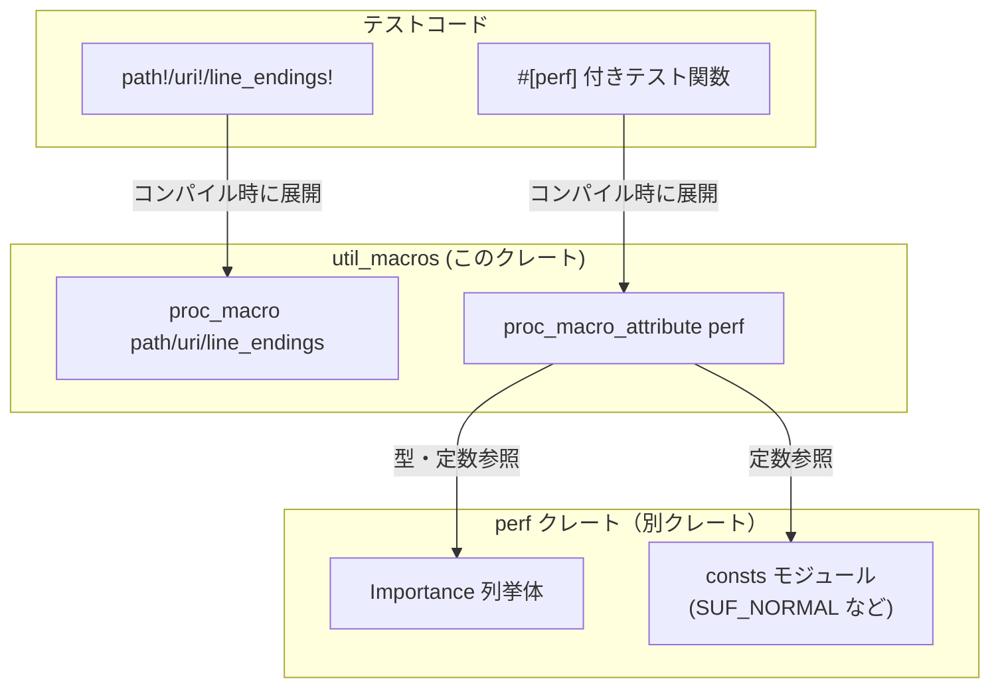
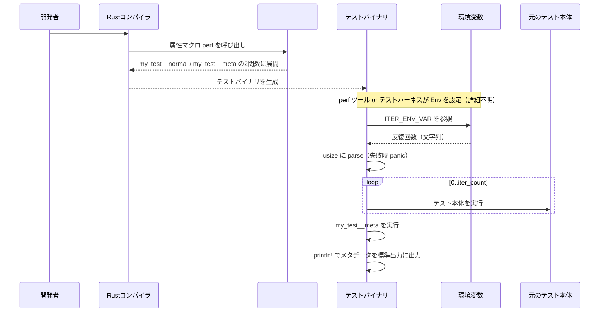

# util_macros/ ディレクトリ解説

## 1. ざっくり一言

`util_macros` は、主にテストコード向けの **ユーティリティ系プロシージャルマクロ** を提供するクレートです。  
パス・URI・改行コードのプラットフォーム差異吸収と、性能計測用の `#[perf]` 属性マクロが含まれています。

---

## 2. このモジュールの役割

### 概要

- テストコード内で
  - パス文字列
  - `file:///` URI
  - 改行コード（LF / CRLF）
  の差異を **コンパイル時に吸収** するマクロを提供します。
- 性能に敏感なテストをマークし、別ツールから解析しやすいように **メタデータを出力する `#[perf]` 属性マクロ** を提供します。

### アーキテクチャ内での位置づけ

このクレートは `proc-macro = true` なため、**コンパイル時にのみ実行される** コンパイラ拡張です。  
テストコードから参照され、必要に応じて `perf` クレートに依存します。



`perf` クレート側の具体的な実装（`Importance` や `consts` の中身）は、このチャンクには含まれていません。

### 設計上のポイント

- **プラットフォーム依存の処理は `#[cfg(target_os = "windows")]` で分岐**
  - Windows のときだけ文字列を書き換え、それ以外は入力をそのまま返す実装になっています。
- **テスト専用ユーティリティ**
  - クレート説明とマクロの内容から、主な用途はテストコードと読み取れます。
  - `Cargo.toml` で doctest を無効 (`doctest = false`) にしています。
- **`#[perf]` はコンパイル時にテスト関数を変形**
  - 条件付きコンパイル `cfg!(perf_enabled)` によって、  
    - 通常モードでは「ほぼそのままのテスト」
    - perf モードでは「本体用テスト + メタデータ出力用テスト」の 2 本に展開  
    という二段構えになっています。
- **属性引数の解析に `syn::meta::ParseNestedMeta` を利用**
  - `iterations`, `weight`, 重要度フラグ（`critical` など）を構造体 `PerfArgs` に集約して扱います。
  - 未知の引数はコンパイルエラーにします。

---

## 3. 主要な機能一覧

- `path!`: 文字列リテラルで書かれたパスを、Windows では `\` 区切り + `C:` 付き絶対パスに変換するマクロ
- `uri!`: `file:///` 形式の URI を、Windows では `file:///C:/` を付与した形に変換するマクロ
- `line_endings!`: 行末 `\n` を Windows では `\r\n` に変換するマクロ
- `#[perf]`: テストを性能計測対象としてマークし、重要度・重み・反復回数などのメタデータをコンソール出力する属性マクロ
- `PerfArgs`: `#[perf]` の引数（iterations / weight / importance）を保持・解析する内部用構造体

---

## 4. 関数・構造体の解説

### 4.1 `path` プロシージャルマクロ

```rust
#[proc_macro]
pub fn path(input: TokenStream) -> TokenStream
```

**役割**

- 引数として受け取った **文字列リテラル** を、プラットフォームごとに変換して再び文字列リテラルとして展開します。
  - Windows: `/` → `\` に変換し、先頭が `\` で始まるパスには `C:` を付与
  - それ以外: 入力をそのまま展開

**処理の流れ**

1. `parse_macro_input!(input as LitStr)` で `TokenStream` から `LitStr`（文字列リテラル）を取得します。
2. `.value()` で Rust の `String` に変換します。
3. Windows 向けコンパイルの場合（`#[cfg(target_os = "windows")]`）のみ:
   - `path = path.replace("/", "\\");`
   - `if path.starts_with("\\") { path = format!("C:{}", path); }`
4. 最後に `quote! { #path }` として再度トークン列に変換します。
   - `String` は `ToTokens` 実装により文字列リテラルの形で展開されます。

**エッジケース / 注意点**

- **リテラル以外は受け付けない**
  - 実装は `LitStr` へのパースを行っているため、`path!(some_var)` のように変数や式を渡すとコンパイルエラーになります。
- Windows で
  - `"C:/path/to/file"` → `"C:\\path\\to\\file"`（先頭が `\` ではないので `C:` 追加はされません）。
  - `"/path/to/file"` → `"C:\\path\\to\\file"`（`/` → `\` 変換後に `\` で始まるため `C:` が付与されます）。
- パスの妥当性や存在確認は行いません。完全に **文字列置換のみ** です。

---

### 4.2 `uri` プロシージャルマクロ

```rust
#[proc_macro]
pub fn uri(input: TokenStream) -> TokenStream
```

**役割**

- `file:///...` 形式の URI を、Windows 環境では `file:///C:/...` 形式に書き換えるマクロです。
- それ以外の OS では入力をそのまま展開します。

**処理の流れ**

1. `input` を `LitStr` としてパースし、`.value()` で `String` に変換します。
2. Windows のみ:

   ```rust
   let uri = uri.replace("file:///", "file:///C:/");
   ```

   で `"file:///"` を `"file:///C:/"` に置換します。

3. `quote! { #uri }` で文字列リテラルとして展開します。

**エッジケース / 注意点**

- 入力が `file:///` で始まらない場合でも、その文字列中に `"file:///"` が含まれていれば置換されます。
- `"file:///C:/..."` のように既にドライブ指定を含む文字列に対しても単純置換を行います。
- URI の形式が正しいかどうかは検証しません。

---

### 4.3 `line_endings` プロシージャルマクロ

```rust
#[proc_macro]
pub fn line_endings(input: TokenStream) -> TokenStream
```

**役割**

- 文字列リテラル中の行末 `\n` を、Windows 環境では `\r\n` に変換するマクロです。
- それ以外の OS では入力をそのまま展開します。

**処理の流れ**

1. `input` を `LitStr` としてパースし、`.value()` で `String` に変換します。
2. Windows のみ:

   ```rust
   let text = text.replace("\n", "\r\n");
   ```

   で全ての `\n` を `\r\n` に置換します。

3. `quote! { #text }` として展開します。

**エッジケース / 注意点**

- もともと `\r\n` を含んでいる文字列に適用すると、
  - `"\r\n"` → `"\r\r\n"` のように `\r` が重なる結果になります。
  - 想定としては「LF のみを含むテキスト」を前提にしていると考えられますが、コードからはそこまで強制していません。
- これも文字列置換のみで、ファイル I/O などは行いません。

---

### 4.4 `PerfArgs` 構造体

```rust
#[derive(Default)]
struct PerfArgs {
    iterations: Option<syn::Expr>,
    weight: Option<syn::Expr>,
    importance: Importance,
}
```

**役割**

- `#[perf(...)]` 属性に渡された引数を保持するための内部構造体です。
- フィールド:
  - `iterations`: `iterations = <expr>` で指定された反復回数。`syn::Expr` として保持します。
  - `weight`: `weight = <expr>` で指定された重み。`syn::Expr`。
  - `importance`: 重要度を表す `Importance` 列挙体（`perf` クレートより）。  
    デフォルト値は `Importance::Average`（`Importance` 側の `Default` 実装に依存）と考えられますが、定義はこのチャンクにはありません。

**引数解析メソッド**

```rust
fn parse_into(&mut self, meta: syn::meta::ParseNestedMeta) -> syn::Result<()>
```

- `syn::meta::ParseNestedMeta` を受け取り、1 つの引数（`iterations = ...` や `critical` など）を `PerfArgs` に反映します。
- 対応する識別子:
  - `iterations = <expr>`
  - `weight = <expr>`
  - 重要度フラグ（値なし）:
    - `critical`
    - `important`
    - `average`
    - `iffy`
    - `fluff`
- 未知の識別子の場合は

  ```rust
  Err(syn::Error::new_spanned(meta.path, "unexpected identifier"))
  ```

  を返し、コンパイルエラーになります。

**エッジケース / 注意点**

- 同じ項目が複数回指定された場合（例: `#[perf(weight = 10, weight = 20)]`）、  
  **最後にパースされた値が上書きされて有効** になります。
- 重要度フラグも同様で、複数指定すると最後のものだけが有効になります。
- `iterations` と `weight` は式 (`syn::Expr`) として保持されるため、リテラルだけでなく簡単な計算式も記述できます。

---

### 4.5 `perf` 属性マクロ

```rust
#[proc_macro_attribute]
pub fn perf(our_attr: TokenStream, input: TokenStream) -> TokenStream
```

**役割**

- テスト関数に付与して、そのテストを **性能計測対象** としてマークする属性マクロです。
- やることは大きく二つです。
  1. 必要なら `#[test]` 属性を自動付与し、関数名を書き換える。
  2. `cfg!(perf_enabled)` が有効なビルドでは、
     - 元のテスト本体を繰り返し実行するテスト関数
     - 重要度・重み・反復回数などを標準出力に出す「メタデータ用テスト関数」  
     の 2 つの関数に展開する。

**処理の流れ（共通部分）**

1. `our_attr` （`#[perf(...)]` の `...` 部分）を `PerfArgs` にパース:

   ```rust
   let mut args = PerfArgs::default();
   let parser = syn::meta::parser(|meta| PerfArgs::parse_into(&mut args, meta));
   parse_macro_input!(our_attr with parser);
   ```

2. テスト関数本体を `ItemFn` としてパースし、`attrs`, `vis`, `sig`, `block` を取り出す。

3. 既に `#[test]` が付いているかを確認し、なければ `#[test]` を付与:

   ```rust
   if !attrs_main
       .iter()
       .any(|a| Some(&parse_quote!(test)) == a.path().segments.last())
   {
       attrs_main.push(parse_quote!(#[test]));
   }
   ```

4. `#[allow(non_snake_case)]` を追加（名前を書き換えるため）。

**`cfg!(perf_enabled)` が `true` の場合の挙動**

この条件は、ビルド時に `perf_enabled` という `cfg` が有効かどうかで決まります。  
`Cargo.toml` には `perf-enabled` という feature が定義されていますが、それと `perf_enabled` の関係はこのチャンクからは分かりません。

1. `use consts::*;` により `perf` クレートの `consts` モジュール内定数をインポートします。
2. オリジナルの関数名から、新しい関数名を作成:

   ```rust
   let mut new_ident_main = sig_main.ident.to_string();
   let mut new_ident_meta = new_ident_main.clone();
   new_ident_main.push_str(SUF_NORMAL);
   new_ident_meta.push_str(SUF_MDATA);
   ```

   - `SUF_NORMAL`, `SUF_MDATA` は `consts` 内の文字列定数（詳細はこのチャンクにはありません）。
   - これにより「実行用テスト」と「メタデータ用テスト」を識別しやすくしています。

3. 実行用テスト関数の本体 `block_main` を作成:

   ```rust
   parse_quote!({
       let iter_count = std::env::var(#ITER_ENV_VAR).unwrap().parse::<usize>().unwrap();
       for _ in 0..iter_count {
           #block
       }
   })
   ```

   - `ITER_ENV_VAR` は `consts` 内の環境変数名です。
   - `unwrap()` を使用しているため
     - 環境変数が未設定
     - 数値としてパースできない  
     場合はパニックし、テストが失敗します。

4. メタデータ用テスト関数の本体 `block_meta` を作成:

   - 重要度を文字列に変換:

     ```rust
     let importance = format!("{}", args.importance);
     ```

   - `iterations` が指定されていれば、その行を `println!` で出力するコードを生成:

     ```rust
     let q_iter = if let Some(iter) = args.iterations {
         quote! {
             println!("{} {} {}", #MDATA_LINE_PREF, #ITER_COUNT_LINE_NAME, #iter);
         }
     } else {
         quote! {}
     };
     ```

   - `weight` は指定がなければ `WEIGHT_DEFAULT` を使う:

     ```rust
     let weight = args.weight.unwrap_or_else(|| parse_quote! { #WEIGHT_DEFAULT });
     ```

   - まとめてメタデータを標準出力に出すブロックを作成:

     ```rust
     parse_quote!({
         #q_iter
         println!("{} {} {}", #MDATA_LINE_PREF, #WEIGHT_LINE_NAME, #weight);
         println!("{} {} {}", #MDATA_LINE_PREF, #IMPORTANCE_LINE_NAME, #importance);
         println!("{} {} {}", #MDATA_LINE_PREF, #VERSION_LINE_NAME, #MDATA_VER);
     })
     ```

5. 最終的に、2 つの `ItemFn`（実行用 + メタデータ用）を `TokenStream` に変換して返します。

**`cfg!(perf_enabled)` が `false` の場合の挙動**

- 変換は簡易で、元のテスト関数に
  - 必要なら `#[test]` を付け
  - `#[allow(non_snake_case)]` を付け
 るだけです。
- 関数名変更やメタデータ用テストの追加は行いません。

**エッジケース / 注意点**

- **属性引数の制約**
  - `iterations`, `weight`, `critical`, `important`, `average`, `iffy`, `fluff` 以外の識別子はエラーになります。
- **環境変数の必須性（perf モード）**
  - `ITER_ENV_VAR` が未設定、あるいは数値でない場合、`unwrap()` によりパニックします。
- **I/O の注意**（ドキュメントコメントより）
  - `#[perf]` は同じテストを多数回繰り返し実行する可能性があるため、
    - 重いディスク I/O を行うテスト
    - ファイルロックの開放タイミングに依存するテスト  
    などに付けると、まれに失敗しやすくなる可能性があります。
- **他の属性との併用**
  - 例として `#[gpui::test]` との併用がコメントで紹介されています。
  - コード上は、既存の属性（`#[gpui::test]` など）をそのまま残しつつ `#[test]` などを追加しているため、組み合わせて使える前提になっています。

---

## 5. データフロー

ここでは、`cfg!(perf_enabled)` が有効なときの `#[perf]` 付きテストの実行フローを、概念的に説明します。

1. 開発者がテスト関数に `#[perf(iterations = N, weight = W, important)]` を付与します。
2. コンパイル時に `perf` 属性マクロが呼び出され、テスト関数は
   - 反復実行を行う「本体テスト関数」
   - メタデータを `println!` する「メタデータ用テスト関数」  
   の 2 つに展開されます。
3. テストバイナリ実行時に、テストハーネス（もしくは外部の perf ツール）が
   - `ITER_ENV_VAR` という環境変数に反復回数を設定し
   - 本体テスト関数を実行
   - メタデータ用テスト関数の標準出力を収集  
   する、という使い方が想定されます（実際のハーネス側の実装はこのチャンクにはありません）。



---

## 6. 使い方（How to Use）

### 6.1 基本的な使用方法

#### パス・URI・改行コードマクロの利用例

```rust
// テストコード側（例）                                      // ここはテストモジュール内のコード
use util_macros::{path, uri, line_endings};                  // マクロをスコープに持ってくる

#[test]                                                       // 通常のテスト属性
fn path_and_uri_example() {                                   // テスト関数定義
    let p = path!("/Users/user/file.txt");                    // POSIX 形式でパスを書く
    let u = uri!("file:///path/to/file");                     // file:/// 形式の URI を書く
    let text = line_endings!("Hello\nWorld");                 // LF 区切りの文字列を書く

    #[cfg(target_os = "windows")]
    {
        // Windows ではバックスラッシュ & C: が付く
        assert_eq!(p, "C:\\Users\\user\\file.txt");           // path! の結果を確認
        assert_eq!(u, "file:///C:/path/to/file");             // uri! の結果を確認
        assert_eq!(text, "Hello\r\nWorld");                   // CRLF に変換されている
    }

    #[cfg(not(target_os = "windows"))]
    {
        // 他の OS では入力そのまま
        assert_eq!(p, "/Users/user/file.txt");                // path! は文字列をそのまま返す
        assert_eq!(u, "file:///path/to/file");                // uri! もそのまま
        assert_eq!(text, "Hello\nWorld");                     // line_endings! もそのまま
    }
}
```

#### `#[perf]` の基本利用例

```rust
// テストコード側                                           // テストモジュール
use util_macros::perf;                                      // perf 属性マクロをインポート

#[perf]                                                     // 重要度・重みを指定しない場合
fn generic_test() {                                         // 普通のテスト関数
    // テスト本体                                           // ここに性能を計測したい処理を書く
}
```

- `#[perf]` を付けるだけで、そのテストは
  - 「perf モード無効」ビルドではほぼ通常の `#[test]` と同様
  - 「perf モード有効」ビルドでは反復実行 + メタデータ出力対象  
  になります。

### 6.2 よくある使用パターン

#### (1) クロスプラットフォームなパス比較テスト

```rust
use util_macros::path;                                      // path! マクロをインポート

#[test]
fn config_file_path_is_correct() {
    let expected = path!("/config/app.toml");               // テスト側は POSIX 形式で書く
    let actual = my_app::config_path();                     // 実際の関数から得られるパス

    assert_eq!(actual, expected);                           // Windows/非Windows で同じテストが通る
}
```

- 実装側が OS ネイティブなパス区切りで返しても、テスト側は 1 つの記述で済みます。

#### (2) `#[perf]` で重要度・重みを付けたベンチマーク風テスト

```rust
use util_macros::perf;                                      // perf 属性マクロをインポート

#[perf(fluff, weight = 30)]                                 // 重要度: fluff, 重み: 30
fn cold_path_test() {
    // アプリケーションのあまり通らない経路のテスト      // 「冷たいパス」の性能を軽くチェックする想定
}
```

- `fluff` や `weight = 30` などの情報は、メタデータ用テストから標準出力に出力され、  
  外部の perf ツールが解析する前提と考えられます（ツール側の実装はこのチャンクにはありません）。

#### (3) 他のテストフレームワーク属性との併用

コメントでは `#[gpui::test]` との併用例が挙げられています。

```rust,ignore
use util_macros::perf;                                      // perf 属性マクロ

#[perf(iterations = 1, critical)]                           // 1 回だけ実行する critical なテスト
#[gpui::test]                                               // gpui のテスト属性
fn oneshot_test(_cx: &mut gpui::TestAppContext) {           // gpui 用のシグネチャ
    // テスト本体
}
```

- `#[perf]` は `#[gpui::test]` を消さずに追加属性を付ける形で動作するため、  
  このような複合利用が可能な設計になっています。

### 6.3 使用上の注意点

**共通（path!/uri!/line_endings!）**

- **必ず文字列リテラルで呼び出す**
  - 実装は `LitStr` を前提としているため、式や変数を渡すとコンパイルエラーになります。
- **テキスト置換のみ**
  - パスの存在確認や URI の妥当性チェックは行いません。
- **`line_endings!` と `\r\n`**
  - 既に `\r\n` を含む文字列に対して `line_endings!` を適用すると `\r\r\n` になる可能性があります。
  - 入力テキストは基本的に `\n` のみを含むものを対象にする前提で使うのが安全です。

**`#[perf]` 関連**

- **属性引数の制約**
  - 許可されている識別子以外を指定すると、コンパイルエラーになります。
  - 例: `#[perf(foo = 1)]` は `"unexpected identifier"` エラーになります。
- **重複指定は後勝ち**
  - `#[perf(weight = 10, weight = 20)]` のような場合、20 が有効になります。
- **環境変数 `ITER_ENV_VAR` が必要（perf モード）**
  - `cfg!(perf_enabled)` が `true` の場合、テスト実行時に
    - `ITER_ENV_VAR` 環境変数が存在しない
    - 数値でない値が入っている  
    と `unwrap()` によりパニックします。
- **ディスク I/O の多いテストには注意**
  - 同じテストを多数回実行するため、ファイルロックの解放タイミングなどに依存するテストは  
    予期しない失敗をする可能性があります（ドキュメントコメントでも注意喚起されています）。
- **perf モードの有効化方法**
  - コード上は `cfg!(perf_enabled)` で分岐しています。
  - `Cargo.toml` には `perf-enabled` という feature が定義されていますが、  
    この feature と `perf_enabled` cfg の関連付けは、このチャンクだけでは分かりません。

---

## 7. 関連ファイル

| パス | 役割 / 関係 |
|------|------------|
| `util_macros/Cargo.toml` | クレート定義。`proc-macro = true` としてこのクレートをプロシージャルマクロクレートに設定し、`quote`, `syn`, `perf` への依存や `perf-enabled` feature を定義しています。 |
| `util_macros/src/util_macros.rs` | 本クレートの全てのマクロ実装が含まれるファイルです。`path!`, `uri!`, `line_endings!`, `#[perf]` と内部構造体 `PerfArgs` が定義されています。 |
| `perf` クレート（ワークスペース内、パス不明） | `use perf::*;` により依存しているクレートです。`Importance` 列挙体や `consts` モジュール（`SUF_NORMAL`, `ITER_ENV_VAR`, `WEIGHT_DEFAULT` など）を提供していることがコードから読み取れますが、具体的な定義はこのチャンクには含まれていません。 |

以上が `util_macros` ディレクトリ全体の構造と主要な機能の概要です。
