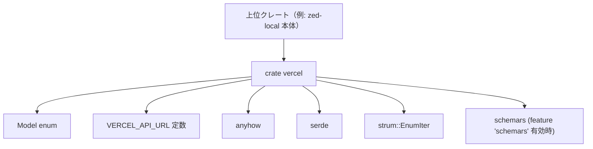
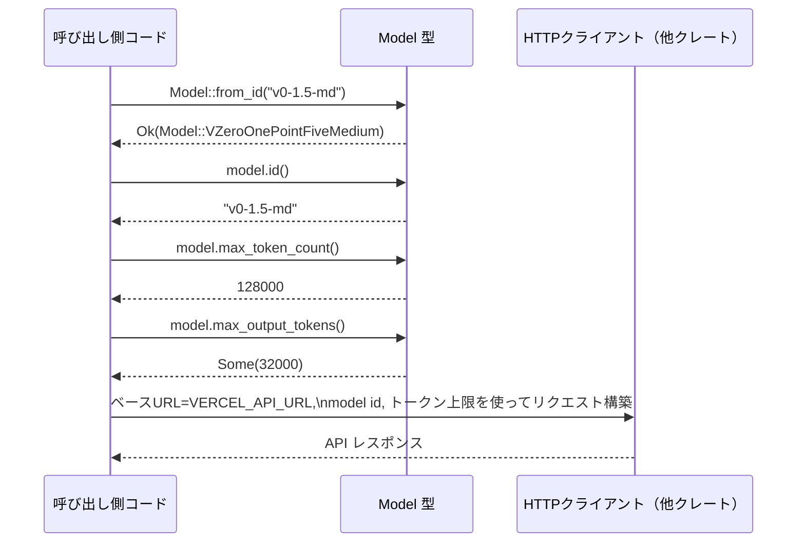

# vercel/ ディレクトリ解説

## 1. ざっくり一言

Vercel の `v0.dev` API 向けの「モデル」を表現し、  
モデル ID・表示名・トークン上限などのメタ情報を型安全に扱うための小さなクレートです。

---

## 2. このモジュールの役割

### 2.1 概要

- このディレクトリ（クレート）`vercel` は、Vercel の `v0.dev` API に対して使用するモデルを Rust の `enum` で表現します。
- モデル ID 文字列と `Model` 型の相互変換、およびトークン数の上限やサポート機能（並列ツール呼び出しなど）を問い合わせる API を提供します。
- JSON シリアライズ／デシリアライズ（`serde`）と、任意で JSON Schema 生成（`schemars` feature）にも対応しています。

### 2.2 アーキテクチャ内での位置づけ

`vercel` クレートはワークスペース内の 1 メンバーであり、他の上位クレートから「Vercel v0.dev API を使うときのモデル情報」を提供する位置づけと解釈できます。

依存関係と役割の関係を Mermaid 図で示します。



このチャンクには、`vercel` を実際に利用する他クレートのコードは含まれていないため、利用側の詳細な構造は不明です。

### 2.3 設計上のポイント

- **モデル種別の列挙**
  - `Model` は既知の 1 モデル（`VZeroOnePointFiveMedium`）と、任意定義の `Custom` バリアントを持ちます。
- **JSON 連携**
  - `Serialize` / `Deserialize` 派生により、`Model` はそのまま JSON と相互変換できます。
  - `#[serde(rename = "...")]` により、バリアント名と API 上の文字列 ID を分離しています。
- **エラーハンドリング**
  - モデル ID 文字列からの変換は `anyhow::Result` を使い、未知の ID の場合は `anyhow::bail!` でエラーを返します。
- **拡張性**
  - `Custom` バリアントにより、コードにハードコーディングされていないモデルも表現できます（詳細な意味は利用側次第です）。
- **列挙の支援**
  - `strum::EnumIter` の派生により、`Model` の全バリアントを列挙する仕組みが追加されています（具体的な使い方は `strum` のドキュメントに依存します）。
- **スキーマ生成（任意）**
  - `schemars` feature 有効時のみ `JsonSchema` を派生し、API 設定などのために JSON Schema を生成できるようになっています。

---

## 3. 主要な機能一覧

- モデル ID 文字列からの変換: `"v0-1.5-md"` から `Model::VZeroOnePointFiveMedium` を生成する。
- デフォルト「高速」モデルの取得: `Model::default_fast()` で推奨モデルを取得する。
- モデル ID の取得: `Model::id()` で API に渡す文字列 ID を取得する。
- 人間向け表示名の取得: `Model::display_name()` で UI 表示用の名前を取得する。
- トークン上限の取得:
  - `Model::max_token_count()` でコンテキスト長上限を取得。
  - `Model::max_output_tokens()` で出力トークン上限（ある場合）を取得。
- モデル機能フラグの確認:
  - `Model::supports_parallel_tool_calls()` で並列ツール呼び出し対応可否を取得。
  - `Model::supports_prompt_cache_key()` でプロンプトキャッシュキー対応可否を取得（現状すべて `false`）。
- Vercel v0.dev API ベース URL の提供:
  - `VERCEL_API_URL` 定数で `"https://api.v0.dev/v1"` を提供。

---

## 4. 関数・構造体の解説

### 4.1 型・定数一覧

| 名前 | 種別 | 役割 / 用途 |
|------|------|-------------|
| `Model` | `enum` | Vercel v0.dev のモデル種別と、それに関連するメタ情報（表示名・トークン上限など）を表現します。 |
| `VZeroOnePointFiveMedium` | `Model` バリアント | `"v0-1.5-md"` という ID の既知モデルを表します。トークン上限や機能フラグは固定です。 |
| `Custom` | `Model` バリアント | コード外部で定義された任意のモデルを表します。名前やトークン上限をフィールドで指定します。 |
| `VERCEL_API_URL` | `&'static str` 定数 | Vercel v0.dev API のベース URL (`"https://api.v0.dev/v1"`) を表します。 |

`Custom` バリアントのフィールド:

```rust
Custom {
    name: String,                 // API に渡す内部的なモデル名
    display_name: Option<String>, // UI などに表示する人間向けの名前
    max_tokens: u64,              // 入力＋出力の最大トークン数
    max_output_tokens: Option<u64>,      // 出力トークン上限（なければ None）
    max_completion_tokens: Option<u64>,  // 補完トークン上限（このチャンクでは未使用）
}
```

### 4.2 主要メソッド詳細（最大 7 件）

#### `Model::default_fast() -> Self`

**概要**

- デフォルトで使用する「高速」モデルを返します。
- 現時点では `Model::VZeroOnePointFiveMedium` を返します。

**引数**

- なし（関連関数）。

**戻り値**

- `Model` 型のインスタンス。現状は常に `VZeroOnePointFiveMedium` です。

**内部処理の流れ**

1. `Self::VZeroOnePointFiveMedium` をそのまま返すだけです。

**Examples（使用例）**

```rust
use vercel::Model; // vercel クレートから Model をインポートする

fn main() {
    // デフォルトの高速モデルを取得する
    let model = Model::default_fast();

    // モデル ID を表示する（"v0-1.5-md"）
    println!("Using model: {}", model.id());
}
```

**Errors / Panics**

- エラーも panic も発生しません。

**Edge cases（エッジケース）**

- エッジケースはありません。常に同じ値を返します。

**使用上の注意点**

- 「高速」モデルの定義は将来的に変更される可能性がありますが、このチャンクからは詳細は分かりません。
- 特定モデルを固定で使いたい場合は、`Model::VZeroOnePointFiveMedium` を直接指定する方が意図が明確です。

---

#### `Model::from_id(id: &str) -> anyhow::Result<Self>`

**概要**

- モデル ID 文字列から `Model` を生成します。
- 現在は `"v0-1.5-md"` のみをサポートし、それ以外はエラーを返します。

**引数**

| 引数名 | 型 | 説明 |
|--------|----|------|
| `id` | `&str` | モデル ID 文字列（例: `"v0-1.5-md"`）。 |

**戻り値**

- `anyhow::Result<Model>`  
  - 成功時: 対応する `Model`。
  - 失敗時: `anyhow::Error`（`bail!` で生成されたエラー）を返します。

**内部処理の流れ**

1. `match id` で渡された文字列を分岐します。
2. `id` が `"v0-1.5-md"` の場合、`Ok(Self::VZeroOnePointFiveMedium)` を返します。
3. それ以外の文字列の場合、`anyhow::bail!("invalid model id '{invalid_id}'")` で即座にエラーを返します。

簡易フロー図:

```mermaid
flowchart TD
  A["id: &str"] --> B{"id == \"v0-1.5-md\" ?"}
  B -- Yes --> C["Ok(Model::VZeroOnePointFiveMedium)"]
  B -- No --> D["Err(anyhow::Error: \"invalid model id ...\")"]
```

**Examples（使用例）**

```rust
use anyhow::Result;   // anyhow::Result を使う
use vercel::Model;    // Model 型をインポートする

fn main() -> Result<()> {
    // 有効な ID から Model を生成する
    let model = Model::from_id("v0-1.5-md")?;
    println!("model id = {}", model.id());

    // 無効な ID の例（エラー処理）
    if let Err(err) = Model::from_id("unknown-model") {
        eprintln!("failed to parse model id: {err}");
    }

    Ok(())
}
```

**Errors / Panics**

- `id` が `"v0-1.5-md"` 以外の場合は必ず `Err(anyhow::Error)` になります。
- `panic!` は発生しません（`bail!` は `Result::Err` を返すマクロです）。

**Edge cases（エッジケース）**

- 空文字 (`""`) を渡した場合も「不正な ID」として `Err` になります。
- 大文字・小文字は区別されますので、`"V0-1.5-MD"` もエラーです。
- `Custom` バリアントの ID を `from_id` で解決することはできません（自前で `Model::Custom { .. }` を生成する必要があります）。

**使用上の注意点**

- 設定ファイルや環境変数など「外部入力」をそのまま `from_id` に渡す場合は、`Err` 発生時の扱い（デフォルトモデルへのフォールバックなど）を決めておく必要があります。
- サポートする ID が増えた場合、この `match` に分岐が追加される想定ですが、現状このチャンクだけではそれ以上の情報はありません。

---

#### `Model::id(&self) -> &str`

**概要**

- `Model` の内部表現から、API に渡すモデル ID 文字列を取得します。

**引数**

| 引数名 | 型 | 説明 |
|--------|----|------|
| `self` | `&Model` | モデルインスタンス。 |

**戻り値**

- `&str` 型のモデル ID。
  - `VZeroOnePointFiveMedium` の場合: `"v0-1.5-md"`。
  - `Custom` の場合: `name` フィールドの値。

**内部処理の流れ**

1. `match self` でバリアントを分岐します。
2. `VZeroOnePointFiveMedium` なら、固定文字列 `"v0-1.5-md"` を返します。
3. `Custom { name, .. }` なら `name` への参照をそのまま返します。

**Examples（使用例）**

```rust
use vercel::Model;

fn main() {
    // 既知モデルの場合
    let model = Model::VZeroOnePointFiveMedium;
    println!("{}", model.id()); // "v0-1.5-md"

    // Custom モデルの場合
    let custom = Model::Custom {
        name: "my-model".to_string(),
        display_name: None,
        max_tokens: 100_000,
        max_output_tokens: Some(10_000),
        max_completion_tokens: None,
    };
    println!("{}", custom.id()); // "my-model"
}
```

**Errors / Panics**

- エラー・panic は発生しません。

**Edge cases（エッジケース）**

- `Custom` の `name` に空文字など任意の文字列を設定することができますが、その正当性は呼び出し元に委ねられています。

**使用上の注意点**

- API に渡すモデル名として使われることが想定されるため、`Custom` の `name` を設定する際は、実際の API が受け付ける値と一致している必要があります。

---

#### `Model::display_name(&self) -> &str`

**概要**

- UI 表示など人間向けに見せる名前を返します。
- `Custom` モデルでは `display_name` がある場合はそれを使い、なければ `name` を返します。

**引数**

| 引数名 | 型 | 説明 |
|--------|----|------|
| `self` | `&Model` | モデルインスタンス。 |

**戻り値**

- `&str` 型の表示名。
  - `VZeroOnePointFiveMedium`: `"v0-1.5-md"`。
  - `Custom`: `display_name` が `Some` ならその値、`None` なら `name`。

**内部処理の流れ**

1. `match self` でバリアントを分岐します。
2. `VZeroOnePointFiveMedium` はそのまま `"v0-1.5-md"` を返します。
3. `Custom { name, display_name, .. }` では、
   - `display_name.as_ref().unwrap_or(name)` を使い、`display_name` が `Some` ならそれへの参照を、`None` なら `name` への参照を返します。

**Examples（使用例）**

```rust
use vercel::Model;

fn main() {
    let model = Model::VZeroOnePointFiveMedium;
    println!("{}", model.display_name()); // "v0-1.5-md"

    let custom_with_display = Model::Custom {
        name: "my-model".to_string(),
        display_name: Some("My Friendly Model".to_string()),
        max_tokens: 100_000,
        max_output_tokens: None,
        max_completion_tokens: None,
    };
    println!("{}", custom_with_display.display_name()); // "My Friendly Model"

    let custom_without_display = Model::Custom {
        name: "my-model".to_string(),
        display_name: None,
        max_tokens: 100_000,
        max_output_tokens: None,
        max_completion_tokens: None,
    };
    println!("{}", custom_without_display.display_name()); // "my-model"
}
```

**Errors / Panics**

- `unwrap_or` を使っているため、`None` の場合も panic せずに `name` にフォールバックします。
- したがって、このメソッドで panic が発生することはありません。

**Edge cases（エッジケース）**

- `display_name` に空文字を設定した場合も、そのまま返ります。
- `name` 自体に空文字を設定した場合、`display_name` が `None` のときは空文字が返ります。

**使用上の注意点**

- UI で「ユーザーに見せる名前」と「API に渡す ID」を分けたい場合に `display_name` を利用できます。
- ログやメトリクスで識別したい場合は、`id()` と `display_name()` を使い分けると意図が明確になります。

---

#### `Model::max_token_count(&self) -> u64`

**概要**

- モデルが扱えるトークン数の上限（コンテキスト長）を返します。

**引数**

| 引数名 | 型 | 説明 |
|--------|----|------|
| `self` | `&Model` | モデルインスタンス。 |

**戻り値**

- `u64` 型のトークン数上限。
  - `VZeroOnePointFiveMedium`: `128_000`。
  - `Custom`: `max_tokens` フィールドの値。

**内部処理の流れ**

1. `match self` でバリアントを分岐します。
2. `VZeroOnePointFiveMedium` はリテラル `128_000` を返します。
3. `Custom { max_tokens, .. }` は `*max_tokens` の値を返します。

**Examples（使用例）**

```rust
use vercel::Model;

fn main() {
    let model = Model::VZeroOnePointFiveMedium;
    println!("max tokens: {}", model.max_token_count()); // 128000

    let custom = Model::Custom {
        name: "my-model".to_string(),
        display_name: None,
        max_tokens: 64_000,
        max_output_tokens: None,
        max_completion_tokens: None,
    };
    println!("max tokens: {}", custom.max_token_count()); // 64000
}
```

**Errors / Panics**

- エラー・panic は発生しません。

**Edge cases（エッジケース）**

- `max_tokens` に `0` などの値を設定しても、そのまま返されます。妥当性チェックは行われません。
- 非常に大きな値を設定した場合も同様で、意味の妥当性は呼び出し元に委ねられています。

**使用上の注意点**

- 実際の API が許容するコンテキスト長と一致する値を設定する必要があります。
- 高頻度でトークン計算を行う場合、本メソッド自体は軽量ですが、呼び出し回数や利用方法によってはパフォーマンス設計が必要になります（このチャンクではそこまでは扱っていません）。

---

#### `Model::max_output_tokens(&self) -> Option<u64>`

**概要**

- 生成される「出力トークン数」の上限値を返します（もし定義されていれば）。

**引数**

| 引数名 | 型 | 説明 |
|--------|----|------|
| `self` | `&Model` | モデルインスタンス。 |

**戻り値**

- `Option<u64>` 型。
  - `VZeroOnePointFiveMedium`: `Some(32_000)`。
  - `Custom`: `max_output_tokens` フィールドの値（`Some` または `None`）。

**内部処理の流れ**

1. `match self` でバリアントを分岐します。
2. `VZeroOnePointFiveMedium` は `Some(32_000)` を返します。
3. `Custom { max_output_tokens, .. }` は `*max_output_tokens` を返します。

**Examples（使用例）**

```rust
use vercel::Model;

fn main() {
    let model = Model::VZeroOnePointFiveMedium;
    if let Some(limit) = model.max_output_tokens() {
        println!("max output tokens: {}", limit); // 32000
    }

    let custom = Model::Custom {
        name: "my-model".to_string(),
        display_name: None,
        max_tokens: 64_000,
        max_output_tokens: None, // 上限を特に定めない
        max_completion_tokens: None,
    };
    println!("custom max output tokens: {:?}", custom.max_output_tokens()); // None
}
```

**Errors / Panics**

- エラー・panic は発生しません。

**Edge cases（エッジケース）**

- `Custom` で `max_output_tokens: Some(0)` を指定すると `Some(0)` が返ります。意味の妥当性はコードからは判断できません。
- `None` の場合、呼び出し側は「上限未指定」と解釈する必要があります。

**使用上の注意点**

- 上限値が `None` の場合の扱い（デフォルト値を使うのか、そのまま API に渡さないのかなど）は、利用側が決める必要があります。
- `max_token_count()` と整合しているかどうか（出力上限がコンテキスト長を超えないなど）は、呼び出し元が管理します。

---

#### `Model::supports_parallel_tool_calls(&self) -> bool`

**概要**

- モデルが「並列ツール呼び出し」をサポートしているかどうかを返します。

**引数**

| 引数名 | 型 | 説明 |
|--------|----|------|
| `self` | `&Model` | モデルインスタンス。 |

**戻り値**

- `bool`。
  - `VZeroOnePointFiveMedium`: `true`。
  - `Custom`: `false`。

**内部処理の流れ**

1. `match self` でバリアントを分岐します。
2. `VZeroOnePointFiveMedium` は `true` を返します。
3. `Model::Custom { .. }` は `false` を返します。

**Examples（使用例）**

```rust
use vercel::Model;

fn main() {
    let model = Model::VZeroOnePointFiveMedium;
    println!(
        "parallel tool calls supported: {}",
        model.supports_parallel_tool_calls()
    );

    let custom = Model::Custom {
        name: "my-model".to_string(),
        display_name: None,
        max_tokens: 64_000,
        max_output_tokens: None,
        max_completion_tokens: None,
    };
    println!(
        "custom parallel tool calls supported: {}",
        custom.supports_parallel_tool_calls()
    );
}
```

**Errors / Panics**

- エラー・panic は発生しません。

**Edge cases（エッジケース）**

- `Custom` では常に `false` です。`Custom` のフィールド値によって挙動が変わることはありません。

**使用上の注意点**

- このフラグを利用して、アプリケーション側で「並列ツール呼び出しを使うかどうか」を切り替えることができます。
- `Custom` でも並列ツール呼び出しをサポートしたい場合は、このメソッドの実装を拡張する必要があります（このクレート単体からは設計方針までは分かりません）。

---

### 4.3 その他のメソッド

| 関数名 | 役割（1 行） |
|--------|--------------|
| `Model::supports_prompt_cache_key(&self) -> bool` | 現状は常に `false` を返し、「プロンプトキャッシュキー」機能をサポートしていないことを表します。 |

`supports_prompt_cache_key` について:

- 実装は単純に `false` を返すだけです。
- 呼び出し側でこの値を見て、キャッシュキー関連の機能を無効化する用途が想定されます（詳細はコードからは分かりません）。

---

## 5. データフロー

ここでは、外部から渡されたモデル ID 文字列を `Model` に変換し、その情報を用いて API リクエストを組み立てる典型的なフローを想定して説明します。



要点:

- 呼び出し側は `Model::from_id` で ID 文字列を `Model` に変換します。
- `id()` や `max_token_count()` などのメソッドで、HTTP リクエストに必要な値を取得します。
- `VERCEL_API_URL` は API エンドポイントの土台として利用されます。
- HTTP クライアントの実装はこのディレクトリには含まれていませんが、上位クレートで行われる前提の設計と解釈できます。

---

## 6. 使い方（How to Use）

### 6.1 基本的な使用方法

もっとも単純な利用方法として、「既知のモデルを使って v0.dev API にリクエストを送る」流れを示します。

```rust
use anyhow::Result;            // エラー処理用
use vercel::{Model, VERCEL_API_URL}; // Model と API URL をインポートする

fn main() -> Result<()> {
    // 1. デフォルトの高速モデルを取得する
    let model = Model::default_fast();

    // 2. モデル ID やトークン上限を取得する
    let model_id = model.id();                      // "v0-1.5-md"
    let max_tokens = model.max_token_count();       // 128000
    let max_output = model.max_output_tokens();     // Some(32000)

    // 3. API URL を組み立てる
    let url = format!("{}/chat/completions", VERCEL_API_URL);

    // 4. 上記の情報を使って HTTP リクエストを組み立てる
    //    （実際の HTTP クライアントはこのクレート外で実装されます）
    println!("POST {} with model {}", url, model_id);
    println!("max_tokens={}, max_output={:?}", max_tokens, max_output);

    Ok(())
}
```

この例では HTTP リクエストの送信処理は省略していますが、  
`Model` から必要なパラメータを取得してリクエストを構成するまでの流れが示されています。

---

### 6.2 よくある使用パターン

#### パターン1: 設定ファイルからモデル ID を読み込む

外部設定でモデル ID を指定し、その値を検証しつつ利用するパターンです。

```rust
use anyhow::{Context, Result};
use vercel::Model;

fn model_from_config(id_from_config: &str) -> Result<Model> {
    // 設定値から Model を生成し、エラー時にメッセージを補足する
    Model::from_id(id_from_config)
        .with_context(|| format!("invalid model id in config: '{id_from_config}'"))
}

fn main() -> Result<()> {
    // 仮の設定値
    let config_model_id = "v0-1.5-md";

    let model = model_from_config(config_model_id)?;
    println!("using model: {}", model.display_name());

    Ok(())
}
```

#### パターン2: Custom モデルで動的にメタ情報を設定する

API 側で新しいモデルが追加されているが、このクレート内ではまだバリアントが用意されていない場合を想定し、  
`Custom` で必要な情報を埋めて利用するパターンです。

```rust
use vercel::Model;

fn main() {
    // Custom モデルを手動で構築する
    let model = Model::Custom {
        name: "experimental-model".to_string(),           // API 側のモデル ID
        display_name: Some("Experimental Model".into()),  // UI 用の名前
        max_tokens: 200_000,                              // コンテキスト長
        max_output_tokens: Some(50_000),                  // 出力上限
        max_completion_tokens: None,                      // この例では未使用
    };

    println!("id          : {}", model.id());
    println!("display name: {}", model.display_name());
    println!("max tokens  : {}", model.max_token_count());
}
```

#### パターン3: モデルの機能に応じて処理を分岐する

並列ツール呼び出しの対応状況に応じて、アプリケーション側の挙動を変える例です。

```rust
use vercel::Model;

fn main() {
    let model = Model::VZeroOnePointFiveMedium;

    if model.supports_parallel_tool_calls() {
        println!("run tools in parallel");
        // 並列ツール呼び出しを行う処理を書く
    } else {
        println!("run tools sequentially");
        // 逐次ツール呼び出しを行う処理を書く
    }
}
```

---

### 6.3 使用上の注意点

- **`from_id` が対応している ID は限定的**
  - 現状このチャンクでは `"v0-1.5-md"` のみが `from_id` の対象です。
  - それ以外のモデルを扱う場合は `Custom` を使うか、`from_id` の実装を拡張する必要があります。
- **`Custom` のフィールド値の妥当性は呼び出し元に委ねられる**
  - `name`, `max_tokens`, `max_output_tokens` などにどのような値でも設定できますが、
    実際の API が受け付けるかどうかは別問題です。
  - 特に `max_tokens` と `max_output_tokens` の関係（出力上限が全体上限を超えないなど）もチェックされません。
- **エラー処理の前提**
  - `from_id` は無効な ID で簡潔に `Err` を返す設計になっています。
  - 設定ファイルやユーザー入力など信頼できない入力を扱う場合は、必ず `Result` を確認し、
    デフォルト値へのフォールバックやエラー表示などの処理を実装する必要があります。
- **将来の拡張との関係**
  - `supports_parallel_tool_calls` や `supports_prompt_cache_key` は、機能フラグとして増減する可能性があります。
  - 呼び出し側では、これらを前提にした強い仮定（「必ず true/false である」など）を置きすぎない方が保守性を保ちやすいです。

---

## 7. 関連ファイル

| パス | 役割 / 関係 |
|------|------------|
| `vercel/Cargo.toml` | `vercel` クレートの設定ファイルです。ライブラリのエントリポイントを `src/vercel.rs` に設定し、`schemars` feature やワークスペース依存関係（`anyhow`, `serde`, `strum` など）を宣言しています。 |
| `vercel/src/vercel.rs` | 本レポートで解説した `Model` enum と `VERCEL_API_URL` 定数を定義するライブラリ本体です。 |

このチャンクにはテストコードや、`vercel` を利用する他クレートのコードは含まれていないため、  
実際の HTTP 通信やアプリケーション全体の構成はここからは分かりません。
