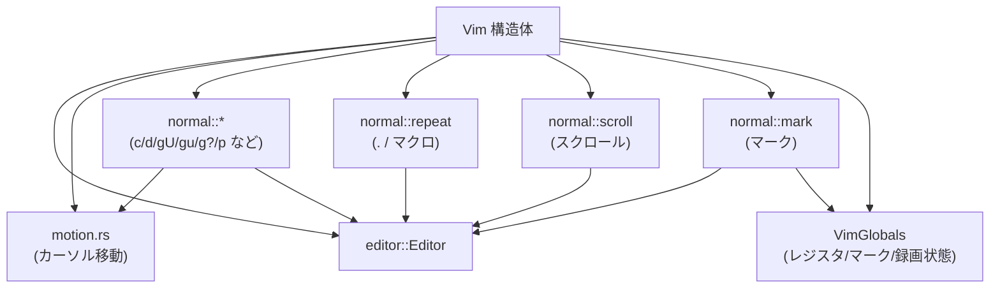
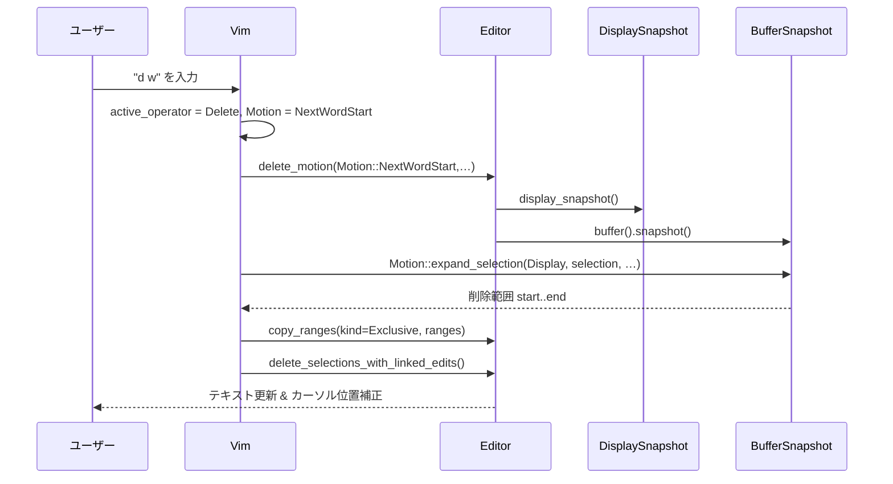
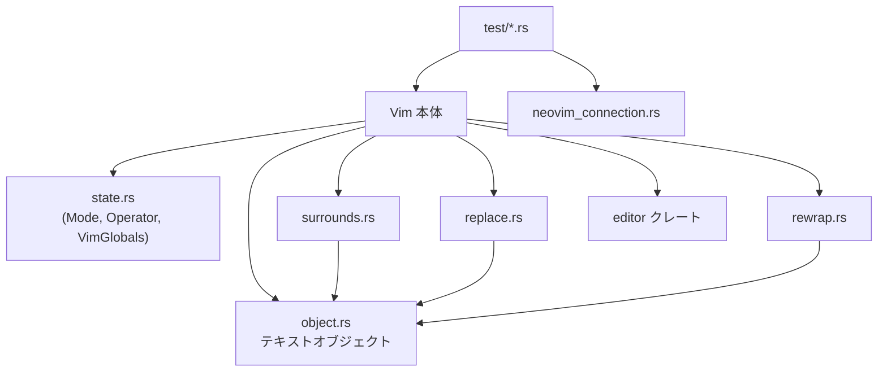
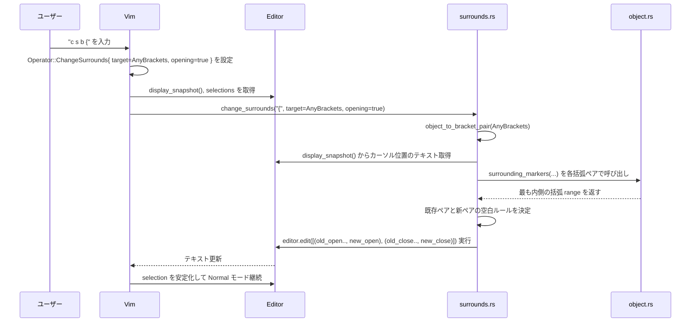
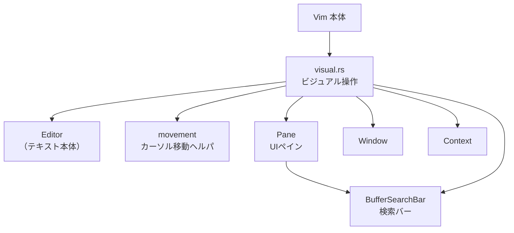
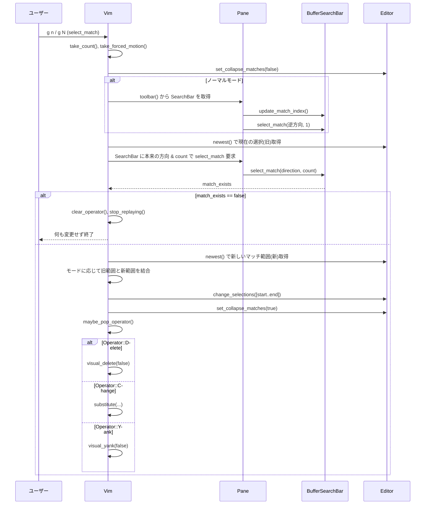

このチャンク（1/4）のコードを読み込みました。

現時点で分かっている概要だけ、簡潔にまとめます。最終的なディレクトリ全体の解説レポート（7 セクション構成）は、残り 3 チャンクを受け取った後にまとめて作成します。

---

## このチャンクに含まれる主な要素のざっくり概要

- `vim/Cargo.toml`
  - Zed エディタ内の Vim エミュレーション用クレート `vim` の定義。
  - ライブラリエントリは `src/vim.rs`。
  - Neovim 連携用の `neovim` feature（`nvim-rs`, `tokio`, `async-trait` など）を持つ。
  - 依存にはエディタ本体 (`editor`, `workspace`, `gpui` など) や検索、テーマ、設定系クレートが含まれる。
  - dev-dependencies に Neovim 連携テストや UI / LSP テスト用クレートが含まれており、Vim モードは他コンポーネントと統合テストされる設計。

- `vim/README.md`
  - このクレートが「Zed の Vim エミュレーションモード」の実装であることを説明。
  - 目的は「100% Vim 互換」ではなく「100% Vim に親しみやすい」挙動。
  - Neovim との動作差異を検証するための `NeovimBackedTestContext` の使い方が示されている。
  - `cargo test -p vim --features neovim ...` で Neovim を実際に起動して結果を JSON キャッシュとして保存する仕組み。
  - Zed 独自機能のテストには `VimTestContext` を使うことが案内されている。

- `src/change_list.rs`
  - 「変更位置リスト」（Neovim のジャンプリストに近い概念）のナビゲーションと記録。
  - アクション:
    - `ChangeListOlder`（`g;` 相当）: 過去の変更箇所へ移動。
    - `ChangeListNewer`（`g,` 相当）: 新しい変更箇所へ移動。
  - `Vim::move_to_change`:
    - カウント（`[count]g;` 等）を解釈し、その回数だけ `editor.change_list.next_change` で位置を取得。
    - 得られたアンカー群を display 座標に変換し、キャレットをその位置に移動。
  - `Vim::push_to_change_list`:
    - 現在の selection の head 行（Insert モードでは 1 文字左寄せ）をアンカーに変換し、change list に push。
    - 同時に `'.` マーク（最後の変更位置）も更新。
    - 直前の change_list 要素と行数が同じで行番号だけ一致する場合は `pop_state` を true にして、Neovim と同様の圧縮動作を再現。
  - 下部のテスト群で、`g;` / `g,` の挙動や `gi`, `` `.` `` が Neovim と一致するかを Neovim バックエンドで検証している。

- `src/command.rs`
  - 非常に大きなファイルで、主に **Vim のコマンドラインモード（`:...`）の解析・実行・補完**を担当。
  - 主な構成:
    - `VimOption`, `VimSet`:
      - `:set wrap`, `:set number`, `:set ignorecase`, `:set gdefault` など、Vim のいくつかのオプションを Zed の `EditorSettings` / `VimSettings` に橋渡し。
      - コマンドパレット用に補完候補（`VimOption::possible_commands`）も生成。
    - `VimSave`, `VimEdit`, `VimRead`, `VimSplit` など:
      - `:w`, `:w!`, `:w {file}`, `:e {file}`, `:sp`, `:vs`, `:read` 相当の動作。
      - プロジェクトの `Worktree` と統合されており、相対パスの解決やファイル上書き時の警告ダイアログ表示なども含む。
      - `CommandRange` による範囲指定（例: `:2,4w other.rs`）もサポート。
    - `CommandRange` / `Position`:
      - `:1,4`, `:0`, `:.,.+2`, `:'a,'b`, `:$`、`:%`、`:'<,'>` などの行レンジ構文を MultiBufferRow 範囲に変換するロジック。
      - オフセット `+n` / `-n` を解釈し、現在行やマーク位置からの相対行を計算。
    - `VimCommand` / `generate_commands`:
      - `:w`, `:q`, `:wq`, `:x`, `:bd`, `:tabnew`, `:tabedit`, `:bn`, `:bp`, `:sort`, `:reflow`, `:norm`, `:g`, `:v` など、多数のコマンドをパターン (`("w","rite")` 等) とアクションにマッピング。
      - `.args`, `.filename`, `.range`, `.default_range`, `.count` などを組み合わせて、引数・ファイル名補完・範囲・カウントの有無を定義するメタデータテーブルになっている。
    - `command_interceptor`:
      - `:...` で始まるユーザ入力を解析し、`CommandPalette` が利用する `CommandInterceptResult`（候補リスト）を生成。
      - `:g/pat/cmd` / `:v/pat/cmd` のような「マッチ行に対してコマンドを実行する」構文もここで扱う。
      - `:set`, `:s///`（置換）、`:/pat`, `:?pat`、`:{range}y` などを特別扱い。
      - ファイル名引数を持つコマンドには、`VimCommand::generate_filename_completions` を介した fuzzy マッチによる補完を実装。
    - `OnMatchingLines`:
      - `:g`, `:v` の本体。
      - 正規表現を `regex` クレートに変換し、該当行に selection を張ってから `:norm` 等のアクションを一括実行する。
      - 検索パターンは `BufferSearchBar` にも反映し、UI 上のハイライトと同期。
    - `ShellExec` + `Vim::shell_command_motion` / `shell_command_object`:
      - `:!cmd`, `:read !cmd`, `:[range]!cmd`、およびノーマルモードで `!{motion}` / `!{text-object}` といった「選択範囲を外部コマンドにパイプする」機能。
      - `%`（現在ファイル路径）、`!`（直前のシェルコマンド）展開を独自ルールで行い、Zed の `project.exec_in_shell` でプロセスを起動。
      - 選択範囲を入力として書き出し、stdout/stderr の結果を range に上書きする挙動を再現。
  - 下部のテスト群で、上記機能（`:w`, `:r`, `:sort`, `:reflow`, `:norm`, `:g`, `:v`, `:set ignorecase` など）が Vim / Neovim と同等かを Neovim バックエンドやフェイク FS と組み合わせて検証している。

- `src/digraph/default.rs` / `src/digraph.rs`
  - `default.rs`:
    - Neovim からコピーした **標準ダイグラフ表**（約 1300 エントリ）。`('o', ':', 0xF6)` のように 2 文字 + コードポイントで定義。
  - `digraph.rs`:
    - `ctrl-k` によるダイグラフ入力および `ctrl-v` による数値/コードポイント指定入力を扱うモジュール。
    - `Literal(String, char)` アクション + `Vim::literal` / `handle_literal_input` / `insert_literal`:
      - `ctrl-v 000`, `ctrl-v x65`, `ctrl-v U1F640` 等の数値指定入力を処理。
      - 8 進（`o` / `O`）、16 進（`x` / `X` / `u` / `U`）、10 進 (`0`..`9`) に対応し、桁数で確定タイミングを決定。
      - `\x00` 特例処理など、Neovim の挙動に合わせた制御文字扱いを再現。
    - `DEFAULT_DIGRAPHS_MAP` + `lookup_digraph`:
      - `DEFAULT_DIGRAPHS` を `HashMap<String, Arc<str>>` に変換。
      - ユーザ設定 `VimSettings.custom_digraphs` があればそれを優先（反転キーも見る）。
      - 見つからなければ 2 文字目そのものを挿入。
    - `Vim::insert_digraph`:
      - `ctrl-k` に続く 2 文字からダイグラフを検索し、挿入。
  - テストでは、Neovim と比較しながら:
    - 挿入モード・置換モードでの `ctrl-k` 動作、
    - `f ctrl-k o :` のような検索中のダイグラフ入力、
    - カスタムダイグラフ（絵文字まで含む複数コードポイント）、
    - `ctrl-v` + 数値 / エスケープ / control-key 入力
    をカバー。

- `src/helix/boundary.rs`, `src/helix/object.rs`, `src/helix/duplicate.rs`
  - これらは「Helix 風テキストオブジェクト / マルチカーソル動作」を Vim モードに統合するためのレイヤです。
  - `boundary.rs`:
    - `BoundedObject` トレイトと `ImmediateBoundary` / `FuzzyBoundary`:
      - Word / Subword / 括弧 / クォート / パラグラフ / センテンスといったオブジェクトの内側／外側の境界を `DisplaySnapshot` 上のオフセット単位で探索するためのロジック。
      - ネストとゼロ幅（例えば引号のみ）の扱い、曖昧な外側境界（クォートなど）への対処など、かなり細かい制御をしている。
    - `HelixTextObject for B: BoundedObject` 実装:
      - 「現在カーソルが含まれるオブジェクト」「次のオブジェクト」「前のオブジェクト」の範囲を、Helix と同じ規則で決定。
  - `object.rs`:
    - `HelixTextObject` トレイトの定義と、`VimObject` とのブリッジ (`to_helix_object`)。
    - `VimObject::helix_range / helix_next_range / helix_previous_range`:
      - Vim のテキストオブジェクト（`iw`, `aw`, `iW`, `i(` 等）のうち Helix 互換のものを、Helix アルゴリズム経由で選択範囲に変換。
      - 対応していないオブジェクトは `VimToHelixError` を返す。
    - `cursor_range`:
      - Helix の「カーソル位置」の定義に合わせて、Selection の head 周辺 1 文字を範囲に変換。
  - `duplicate.rs`:
    - Helix モードにおける selection の複製（`C`, `Alt-C` のような操作）を実装。
    - UTF-16 ベースで列位置を保持しつつ、上下の行へ「同じ見かけ位置」の選択範囲を増やしていく。
    - 全角文字やマルチバイトのある行でも視覚的な列がずれないように、`PointUtf16` と `MultiBufferRow` を使って調整している。

- `src/helix/paste.rs`
  - Helix 風の貼り付け（`HelixPaste` アクション）を実装するファイル。
  - このチャンクは途中（`else if action...`）で途切れており、後半のロジックはこのチャンクからは読めません。
  - 冒頭を見る限り:
    - `before: bool` で「カーソルの前にペースト」か否かを制御。
    - レジスタの内容を selection ごとに分割し、Helix 同様に「クリップボードの各 selection をカーソル selection と zip して貼る」挙動を再現していることが分かります。

---

このチャンクだけでも Vim コマンドライン、ダイグラフ、Helix 連携など主要な基盤がかなり見えていますが、ディレクトリ全体の役割や API を整理するには残り 3 チャンク（`vim.rs`, `normal.rs`, `motion.rs` など）の情報が必要です。

次のチャンクを受け取ったら、それも踏まえて最終的なディレクトリ全体の解説レポートを作成します。

---

# vim/src（motion.rs と normal/*）コード解説

## 1. ざっくり一言

`vim/src` 配下の `motion.rs` と `normal` ディレクトリは、Zed の Vim モードにおける

- カーソル移動（モーション）
- 削除・変更・大文字小文字変換・数値インクリメント
- ペースト・レジスタ操作・マーク・リピート・スクロール・検索

といったノーマルモードの中核的な挙動をまとめて実装しているモジュール群です。

---

## 2. このモジュールの役割

### 2.1 概要

この一連のモジュールは、Vim 互換のキーバインドを Zed の `Editor` に適用するための「橋渡し層」として動作します。

- `motion.rs` は `%`, `{`, `}`, `]]`, `[[`, `]m`, `[m` などの**カーソル移動ロジック**を実装します。
- `normal/change.rs`, `delete.rs`, `convert.rs`, `increment.rs`, `paste.rs` などは `c`, `d`, `gU`, `gu`, `g?`, `ctrl-a`, `p` などの**オペレータ系コマンド**を実装します。
- `normal/repeat.rs` は `.` とマクロ `q…@a` の**リピート機構**を実装します。
- `normal/mark.rs` は `'a`, `` `a `` や `'<`, `'>` の**マーク管理とジャンプ**を扱います。
- `normal/scroll.rs` は `ctrl-d/u/f/b`, `ctrl-e/y` などの**スクロールとカーソル追従**を実装します。
- `normal/search.rs` は `/`, `?`, `n`, `N` および「カーソル下検索」のためのアクション定義を行います（このチャンクでは定義のみで、実装は途中までです）。

### 2.2 アーキテクチャ内での位置づけ

これらのモジュールはすべて `Vim` 構造体のメソッドとしてまとまり、内部で `editor::Editor` と `motion.rs` のユーティリティを呼び出します。グローバル状態（レジスタ・マーク・`.` の記録など）は `VimGlobals` に保持されます。

以下は依存関係のおおまかな図です。



### 2.3 設計上のポイント

コードから読み取れる設計上の特徴は次の通りです。

- **Vim らしい 3 層構造**
  - キーバインド → `Action` → `Vim` メソッド → `Editor` 操作、という流れになっています。
- **モーションとオペレータの分離**
  - `Motion` / `Object` が「範囲の拡張」を担当し、`delete_motion` や `change_motion` はその範囲に対する「削除・変更」を担当します。
- **マルチカーソル・マルチセレクション対応**
  - すべてのオペレータは `editor.change_selections` を通じて複数の選択範囲に対して動作します。
- **Vim 互換の細かい挙動**
  - `cw` を `ce` のように扱う、`d}` が段落末の空行を含む／含まない、`%` が HTML タグも扱う、など Vim/Neovim の挙動がテストベースで再現されています。
- **テキスト構造の活用**
  - Tree-sitter ベースの `text_object_ranges` を用いてメソッド移動（`]m`, `[m`）やセクション移動（`]]`, `[[`）を実装しています。
- **スクロールとカーソル位置の一貫性**
  - `vertical_scroll_margin` 設定や「スクロールだけ」「スクロール＋カーソル移動」を切り替えるフラグを使い、Vim の `ctrl-d/u/f/b` と同様の動きを再現しています。
- **グローバル状態の集中管理**
  - レジスタ・マーク・マクロ録画・`.` の記録など、Vim のグローバル概念は `VimGlobals` に集約されています。

---

## 3. 主要な機能一覧

このチャンクに含まれるファイルが提供する主な機能を列挙します。

- **カーソル移動（motion.rs）**
  - 括弧・ブラケット・HTML タグのマッチング（`%`, `]}`, `[ {`）
  - 文・段落移動、文書先頭・末尾移動（`(`, `)`, `{`, `}`, `gg`, `G`, `N%`）
  - ウィンドウ内のトップ / ミドル / ボトムへの移動（`H`, `M`, `L`）
  - メソッド / クラス / コメント / セクション単位の移動（`]m`, `[m`, `]/`, `[/`, `]]`, `[[`）
  - インデントレベルによる移動（`[+`, `]-`, など）
  - 1 文字 / 2 文字検索（`f/t/F/T`、sneak 風モーション）

- **変更系（normal/change.rs）**
  - `c{motion}`, `cc`, `cw`, `ce`, `cb`, `c$`, `c0`, `cgg`, `cG` などの実装
  - `cw` を `ce` のように扱う特別処理（非空白上では語末まで選択）

- **削除系（normal/delete.rs）**
  - `d{motion}`, `dd`, `d}`, `d(`, `d)` などの実装
  - 段落・文・文末・行末・文書末までの削除とカーソル補正

- **変換系（normal/convert.rs）**
  - 大文字小文字トグル `~`、`gU`, `gu`、ROT13 `g?`、ROT47 など
  - モーション／テキストオブジェクト単位での変換（`gUw`, `gUiw` など）
  - Helix モード用のサブワード系挙動にも対応

- **数値・真偽値のインクリメント（normal/increment.rs）**
  - `ctrl-a`, `ctrl-x` での数値増減
  - 10 進／16 進（`0x`）／2 進（`0b`）の検出と桁数保持
  - 真偽値・Yes/No・On/Off のトグル（`true <-> false`, `Yes <-> No`, `On <-> Off`）、大文字・タイトルケース保持
  - ビジュアル／ビジュアルブロックでの複数値一括操作

- **マークとジャンプ（normal/mark.rs）**
  - ローカル・バッファ・パスベースのマーク設定 (`m{a-zA-Z}`)
  - `'{mark}`, `` `{mark} `` でのジャンプ
  - `'<`, `'>` などのビジュアルマーク管理
  - `{`, `}`, `(`, `)` を疑似マークとして扱う（段落／文単位）

- **ペースト・レジスタ操作（normal/paste.rs）**
  - `p`, `P` の通常ペースト、行単位ペースト、ビジュアル／ブロックペースト
  - レジスタ指定（`"a`, `"0`, `"1`…`"9`, `"+`, `"-`, `"_`, `"%' など）との連携
  - システムクリップボードとの連携（設定に応じて）
  - `gR` での範囲をレジスタ内容で置き換え（モーション／オブジェクト対応）

- **リピート・マクロ（normal/repeat.rs）**
  - `.` での直前変更のリピート（モーション／カウント／ビジュアル選択を含む）
  - `q{register}` / `@{register}` でのマクロ録画・再生
  - `@` 再利用、`.` 自体の録画・再生、IME／補完を含む挿入イベントの再再生

- **スクロール（normal/scroll.rs）**
  - `ctrl-e/y`（1 行スクロール）、`ctrl-d/u`（半ページ＋カーソル移動）
  - `ctrl-f/b`（1 ページスクロール）、水平スクロール（`zL`, `zH` などに相当）
  - `scrolloff` と同様の `vertical_scroll_margin` 適用

- **検索アクション定義（normal/search.rs の一部）**
  - 次／前の検索マッチへの移動を表すアクション `MoveToNext`, `MoveToPrevious`
  - カーソル下の単語を検索パターンとして扱う `SearchUnderCursor`
  - 大文字小文字・単語境界・正規表現使用のフラグを持つ（実装本体はこのチャンク外）

---

## 4. 関数・構造体の解説

### 4.1 主な型一覧

| 名前 | 種別 | 所在 | 役割 / 用途 |
|------|------|------|-------------|
| `ConvertTarget` | enum | `normal/convert.rs` | モーション／オブジェクト変換で適用する変換種別（Lower/Upper/Opposite/Rot13/Rot47）を表します。 |
| `Increment` | struct (Action) | `normal/increment.rs` | `vim::Increment` アクション (`ctrl-a`)。`step` フラグでステップモードかどうかを指定します。 |
| `Decrement` | struct (Action) | `normal/increment.rs` | `vim::Decrement` アクション (`ctrl-x`)。`step` フラグでステップモードかどうかを指定します。 |
| `Paste` | struct (Action) | `normal/paste.rs` | `p`,`P` 相当のペーストアクション。前に貼るか（`before`）／クリップボードを温存するか（`preserve_clipboard`）を指定します。 |
| `ReplayerState` | struct | `normal/repeat.rs` | `.` やマクロ再生時に実行予定の `ReplayableAction` 列と現在位置を保持します。 |
| `Replayer` | struct | `normal/repeat.rs` | 非同期的に `ReplayableAction` を順次 `Window` にディスパッチする小さな状態マシンです。 |
| `MoveToNext` | struct (Action) | `normal/search.rs` | 次の検索マッチへ移動するアクション。大文字小文字・単語境界・正規表現の挙動をフラグで指定します。（実装はこのチャンク外） |
| `MoveToPrevious` | struct (Action) | `normal/search.rs` | 前の検索マッチへ移動するアクション。`MoveToNext` と同じフラグを持ちます。 |
| `SearchUnderCursor` | struct (Action) | `normal/search.rs` | カーソル下の単語を検索パターンとして使うアクション。フィールド定義はこのチャンク途中までで、残りは別チャンクです。 |

※ `IndentType` など一部の型は、このチャンクには定義が現れていませんが、`indent_motion` 内でのみ使用されています。

### 4.2 重要な関数・メソッド詳細

ここでは代表的な 7 つの関数／メソッドを取り上げます。

---

#### `Vim::change_motion(&mut self, motion: Motion, times: Option<usize>, forced_motion: bool, window: &mut Window, cx: &mut Context<Self>)`

**概要**

- `c{motion}` や `cc`, `cw`, `ce`, `cj`, `cG` など、「変更オペレータ＋モーション」の共通実装です。
- モーションで選択範囲を拡張し、その内容をレジスタにコピーして削除した後、Insert モードに切り替えます。

**引数**

| 引数名 | 型 | 説明 |
|--------|----|------|
| `motion` | `Motion` | 適用するモーション（`Motion::NextWordStart` 等） |
| `times` | `Option<usize>` | 繰り返し回数（`3cw` の `3` に相当） |
| `forced_motion` | `bool` | 強制モーション（一部の演算子との組み合わせで使用） |
| `window` | `&mut Window` | 対象ウィンドウ |
| `cx` | `&mut Context<Self>` | アプリケーションコンテキスト |

**戻り値**

- 返り値はありません。`Editor` のバッファ内容・選択範囲・`Vim` のモードを更新します。

**内部処理の流れ**

1. `motion` の種類に応じて、初期の `motion_kind`（Exclusive/Linewise など）を一部ハードコードで決めます（`h`, `l`, `$`, `0` 等）。
2. `update_editor` 内で `editor.text_layout_details` を取得し、`editor.transact` を開始します。
3. クリッピング挙動を変更（`editor.set_clip_at_line_ends(false)`）してから、全選択範囲に対し `selection.move_with` を実行します。
   - `Motion::NextWordStart` / `NextSubwordStart` の場合は、`expand_changed_word_selection` を呼び、`cw` が `ce` になる Vim 特有の挙動を実現します。
   - 行単位モーション（`CurrentLine`, `Down`, `Up`）では、開始位置を先頭の非空白文字まで進めるよう補正します。
   - その他のモーションでは、`motion.expand_selection` に処理を委譲します。
4. 各選択から返された `MotionKind` を集約し、少なくとも 1 つの選択が有効に拡張されていれば:
   - `vim.copy_selections_content(editor, kind, …)` でレジスタにコピー。
   - `editor.delete_selections_with_linked_edits` で対象範囲を削除。
   - `editor.refresh_edit_prediction` でインレイ予測を更新。
5. トランザクション終了後、`motion_kind` が存在した場合は `Insert` モードへ、そうでなければ `Normal` モードへ切り替えます。

**Examples（使用例）**

モーション側からは次のように呼び出されます（イメージコード）。

```rust
use crate::{Vim, motion::Motion};
use gpui::{Context, Window};

fn change_to_end_of_word(vim: &mut Vim, window: &mut Window, cx: &mut Context<Vim>) {
    // "ce" 相当: 単語末まで変更
    vim.change_motion(
        Motion::NextWordEnd {
            ignore_punctuation: false,
        },
        None,          // 回数なし
        false,         // forced_motion なし
        window,
        cx,
    );
}
```

**Edge cases（エッジケース）**

- `cw` が非空白上で呼ばれた場合、`expand_changed_word_selection` によって `ce` と同様に「単語末まで」選択されます。
- 行単位モーション（`cc`, `cj`, `ck`, `cG`, `cgg` 等）の場合、開始位置の先頭空白はスキップされ、インデントの先頭から変更されます。
- モーションが有効な選択を作れなかった場合（例: バッファ先頭で `c h` など）、モードは `Normal` に戻り、変更は行われません。

**使用上の注意点**

- この関数は常に `editor.transact` の内部から使われており、`update_editor` 経由で呼ぶのが前提です。
- `expand_changed_word_selection` 内には `motion::next_word_end` 等への依存があるため、`motion.rs` 側の挙動変更の影響を受けます。

---

#### `Vim::delete_motion(&mut self, motion: Motion, times: Option<usize>, forced_motion: bool, window: &mut Window, cx: &mut Context<Self>)`

**概要**

- `d{motion}`, `dd`, `dj`, `dk`, `dG`, `dgg` など、削除オペレータ＋モーションの実装です。
- モーションで拡張された範囲をレジスタにコピーした後、削除を行います。

**引数・戻り値**

`change_motion` と同様で、`Motion` の種類が異なるだけです。戻り値は `()` です。

**内部処理の流れ**

1. レコーディングを停止（`self.stop_recording`）。
2. `update_editor` 内で `text_layout_details` を取得し、`editor.transact` を開始。
3. クリッピングを無効化し、各選択に対して:
   - 元のヘッド列（`selection.head().column()`）を記録。
   - `motion.expand_selection` で削除範囲を決定し、その `Point` 範囲を `ranges_to_copy` に保存。
   - `MotionKind::Linewise` の場合は、常に改行を含むように `selection.start` / `selection.end` を前後の行に調整。
4. 少なくとも 1 つの `MotionKind` が得られた場合のみ:
   - `vim.copy_ranges(editor, kind, …)` でコピー。
   - `editor.delete_selections_with_linked_edits` で削除。
5. 削除後に `editor.set_clip_at_line_ends(true)` を戻し、カーソル位置を補正:
   - 行単位削除時は、可能なら元の列を維持しつつ、行末を超えないように `clip_point` します。

**Edge cases**

- 行全体削除（`dd`）では、現在行の改行を含めて削除するため、次の行が繰り上がります。
- 末行を削除する場合、改行が後ろにないため、前の行の末尾まで範囲を広げてから削除します。
- モーションが無効（範囲が空）の場合は何も行いません。

**使用上の注意点**

- `ranges_to_copy` には `Point` ベースの範囲を格納しているため、`copy_ranges` 側で `MultiBufferOffset` 等に変換されます。
- 行単位削除と文字単位削除でカーソルの補正方法が異なります（行単位は列保持を試みる）。

---

#### `Vim::convert_motion(&mut self, motion: Motion, times: Option<usize>, forced_motion: bool, mode: ConvertTarget, window: &mut Window, cx: &mut Context<Self>)`

**概要**

- `gU{motion}`, `gu{motion}`, `g~{motion}`, `g?{motion}` 等の「変換＋モーション」を実装します。
- モーションで選択された範囲に対し、`ConvertTarget` で指定された変換（大文字化・小文字化・ケース反転・ROT13・ROT47）を適用します。

**引数**

| 引数名 | 型 | 説明 |
|--------|----|------|
| `motion` | `Motion` | 対象範囲を決めるモーション |
| `times` | `Option<usize>` | モーションの繰り返し回数 |
| `forced_motion` | `bool` | 強制モーションフラグ |
| `mode` | `ConvertTarget` | 適用する変換種別 |
| `window`, `cx` |  | 他メソッドと同様 |

**内部処理の流れ**

1. レコーディングを停止し、`editor.set_clip_at_line_ends(false)`。
2. 各選択のヘッド位置を `Anchor` として `selection_starts` に記録しつつ、`motion.expand_selection` で変換範囲を拡張。
3. 拡張後、`mode` に応じて `editor.convert_to_*` 系メソッドを呼び出し、バッファ内文字列を変換。
4. 最後に再度 `change_selections` を呼び、各選択を元のヘッド位置に collapse します。

**Examples**

```rust
use crate::{Vim, motion::Motion, normal::convert::ConvertTarget};
use gpui::{Context, Window};

fn uppercase_word(vim: &mut Vim, window: &mut Window, cx: &mut Context<Vim>) {
    vim.convert_motion(
        Motion::NextWordEnd { ignore_punctuation: false },
        None,
        false,
        ConvertTarget::UpperCase,
        window,
        cx,
    );
}
```

**使用上の注意点**

- `selection_starts.remove(&selection.id).unwrap()` という前提付きアクセスがあるため、`change_selections` の中で selection.id が変化しないことが前提です（`Editor` 実装がそれを保証している設計です）。
- 実際の変換処理は `Editor` 側の `convert_to_*` に委譲されます。

---

#### `Vim::increment(&mut self, delta: i64, step: i32, window: &mut Window, cx: &mut Context<Self>)`

**概要**

- `ctrl-a` / `ctrl-x` の本体です。
- カーソル付近の数値や真偽値を検出し、`delta`・`step` に従って値を増減します。

**引数**

| 引数名 | 型 | 説明 |
|--------|----|------|
| `delta` | `i64` | 基本の増分（`ctrl-a` なら正、`ctrl-x` なら負） |
| `step` | `i32` | ステップモード時の増分（複数行選択などで行ごとに加算する値） |
| `window`, `cx` |  | 他と同様 |

**内部処理の流れ**

1. ビジュアルマークを保存（後でモード復帰に使う）。
2. `editor.buffer().snapshot()` を取得し、各選択に対して:
   - 非空選択かつ Visual Block 以外の場合、選択開始位置を `new_anchors` に記録。
   - 行ごとに `find_target` を呼び、数値／真偽値を含むターゲットを文字列として検出。
   - 見つかった場合は `increment_*_string` で文字列を更新し、`edits` に `(範囲, 置換文字列)` を追加。`delta` に `step` を加算。
   - 空選択で何も見つからない場合は、その行の行頭アンカーを `new_anchors` に追加。
3. `editor.edit(edits, cx)` で一括置換。
4. 新しいスナップショットで `new_anchors` を `Point` に変換し、必要に応じて 1 文字左に戻しつつ、各選択の位置を更新。
5. 最後に `Mode::Normal` に戻ります。

**Edge cases**

- `increment_decimal_string` は負数・ゼロ・桁あふれを `u64::wrapping_add_signed` で扱い、符号反転とゼロパディングを維持します。
- `increment_hex_string`／`increment_binary_string` は元の桁数を維持しつつ wrap します。
- `increment_toggle_string` は `true/false`, `yes/no`, `on/off` のペアを大小文字パターンごとにトグルします。
- マルチバイト文字の直後から逆走査を行う際に、文字境界を跨がないよう careful にオフセットを更新しています（テストに韓国語文字のケースあり）。

**使用上の注意点**

- `find_target` は「現在の行の中で最初に見つかるターゲット」を返す挙動のため、数値や真偽値が複数ある場合の順序に注意します。
- `VisualBlock` モードでは、最初の選択だけがアンカー記録に使われるなど、モードによって挙動が違います。

---

#### `Vim::paste(&mut self, action: &Paste, window: &mut Window, cx: &mut Context<Self>)`

**概要**

- `p`, `P`、ビジュアルモードでのペースト、ブロックペーストなどを一括して実装します。
- Vim レジスタに加え、Zed の `ClipboardSelection` メタデータ（行単位かどうかなど）も尊重します。

**引数**

| 引数名 | 型 | 説明 |
|--------|----|------|
| `action` | `&Paste` | `before`（前に貼るか）、`preserve_clipboard`（ビジュアル時にクリップボードを上書きしないか）を持つアクション |
| `window`, `cx` |  | 共通 |

**内部処理の流れ（簡略版）**

1. 現在アクションを記録し、ビジュアルマークを保存。カウントを取得（`3p` など）。
2. グローバルから選択レジスタを読み出し、空ならステータス表示して終了。
3. ビジュアルモードかつ `preserve_clipboard == false` の場合は、先に現在の選択をレジスタにコピー（Vim の挙動）。
4. `display_map` と現在の選択を取得し、次のような「貼り付け対象セレクション」を構築:
   - もとの各選択範囲
   - クリップボードが複数行ブロックのとき、さらに下の行に追加カーソルを作る（Visual Block の貼り付け挙動）。
5. 各セレクションごとに:
   - 対応する `ClipboardSelection` から貼り付けテキストを切り出し（または全体を使用）。
   - 行モード／マルチライン／前に貼るか (`before`)／VisualLine モードかに応じて、改行を付け足したり削除したりして `to_insert` を調整。
   - 実際に置き換える表示範囲（`display_range`）を計算（VisualLine モードで末尾が `\n` 上にある場合には 1 文字左へずらすなど）。
   - 実際の `Point` 範囲と、貼り付け後のカーソルアンカー（先頭 or 末尾）を計算し、`edits` と `new_selections` に記録。
6. 言語設定の `auto_indent_on_paste` を見て、`editor.edit_with_block_indent` または `editor.edit` で一括挿入。
7. 置換後、`new_selections` をもとにカーソルの最終位置を計算:
   - 行モードでは挿入された行の先頭非空白に移動。
   - 単一行かつノーマルモードでは、最後に挿入された文字の位置（またはその直前）に移動。
8. Helix モード設定に応じて `Mode::Normal` か `Mode::HelixNormal` に切り替え。

**Examples**

```rust
use crate::{Vim, normal::paste::Paste};
use gpui::{Context, Window};

fn paste_after_cursor(vim: &mut Vim, window: &mut Window, cx: &mut Context<Vim>) {
    let action = Paste {
        before: false,          // 'p' と同じ（後ろに貼る）
        preserve_clipboard: false,
    };
    vim.paste(&action, window, cx);
}
```

**Edge cases**

- 行単位レジスタ（末尾が `\n` のテキスト）は、`p` で「次の行」、`P` で「前の行」に挿入され、カーソルは先頭非空白に移動します。
- Visual Line でのペーストでは、選択の末尾が改行上にある場合に 1 文字左にずらしてから置換し、行結合を避けています。
- Visual Block の複数カーソルに対するペーストでは、クリップボード内の行数に応じて足りないカーソルを下に追加します。

**使用上の注意点**

- `selected_register` は `paste` 内で `take` されるため、呼び出し側で複数回続けて使う場合は注意が必要です（Vim と同じ挙動）。
- システムクリップボードとの連携は別途 `UseSystemClipboard` 設定によって変化しますが、その処理はこのモジュール外（レジスタ読み出し側）にあります。

---

#### `Vim::repeat(&mut self, from_insert_mode: bool, window: &mut Window, cx: &mut Context<Self>)`

**概要**

- `.` コマンドの中核実装です。
- 直前に記録されたアクション列と選択形状を元に、同じ変更を現在位置で繰り返します。

**引数**

| 引数名 | 型 | 説明 |
|--------|----|------|
| `from_insert_mode` | `bool` | 挿入モードからの即時リピートかどうか（挿入時のカウント処理に影響） |
| `window`, `cx` |  | 共通 |

**内部処理の流れ（簡略）**

1. まだオペレータが保留中（`d.` のようなケース）なら、記録をクリアして何もせず終了（無限ループ防止）。
2. 現在のカウントを取り出し、`VimGlobals` から
   - 記録済みアクション列 `recorded_actions`
   - 記録済み選択 `RecordedSelection`
   - 記録済みカウント `recorded_count`
   を取り出します。
3. 選択種別に応じて、リピート時のモードを決定:
   - `SingleLine` / `Visual` → `Visual`
   - `VisualLine` → `VisualLine`
   - `VisualBlock` → `VisualBlock`
   - `None` → カウントが指定されていれば `recorded_count` を上書き
4. ドットリピート時に使用するレジスタ（`recorded_register_for_dot`）とナンバー付きレジスタのインクリメントを処理。
5. 必要ならモードを切り替え、記録された選択形状を再現するために `visual_motion` 等でカーソルと選択を構成。
6. アクション列の先頭が挿入系で `repeatable_insert` に該当する場合は、
   - 先頭アクションを「再挿入可能なアクション」に差し替え、
   - 記録カウント分だけアクション列を複製してから `NormalBefore` を末尾に追加する、という Vim 互換の挙動を再現。
7. 最後に `EndRepeat` アクションを追加し、必要なら `InsertBefore` も追加。
8. `Replayer` にアクション列を渡して非同期に実行開始し、`dot_replaying` フラグを立てます。

**Edge cases**

- 挿入モードからの `.` では、記録された挿入テキストをカウント回数分まとめて挿入します（`3a1 escape .` のような挙動）。
- レジスタを伴うペースト・削除などでは、`.` は「記録されたレジスタ」を必ず使い、`"x.` のような「ドットにレジスタ上書き」をしないようになっています。
- ビジュアル／ビジュアルライン／ブロックのいずれで記録したかによって、リピート時に自動で選択が復元されます。

**使用上の注意点**

- 記録中にエディタがフォーカスを失った場合でも、リプレイ終了時に `dot_replaying` が必ず false に戻るようになっています（安全のため）。
- `Repeat` 自体もマクロ録画の対象となりうるため、`.` や `@` のネスト時の挙動はテストでカバーされています。

---

#### `Vim::scroll(&mut self, preserve_cursor_position: bool, window: &mut Window, cx: &mut Context<Self>, by: fn(c: Option<f32>) -> ScrollAmount)`

**概要**

- `ctrl-e/y/f/b/d/u`, `zL`, `zH` 等のキーから呼ばれ、スクリーンをスクロールさせるラッパーです。
- カウントを `ScrollAmount` に変換したうえで、`scroll_editor` に処理を委譲します。

**引数**

| 引数名 | 型 | 説明 |
|--------|----|------|
| `preserve_cursor_position` | `bool` | カーソルの相対位置を維持するかどうか（`ctrl-d/u` では true） |
| `by` | `fn(Option<f32>) -> ScrollAmount` | カウントをもとにスクロール量を決定する関数 |
| `window`, `cx` |  | 共通 |

**内部処理の流れ**

1. `Vim::take_count` でカウントを取得し、`by` に渡して `ScrollAmount` を生成。
2. `Vim::take_forced_motion` で保留中の強制モーションをクリア。
3. `exit_temporary_normal` で一時ノーマルモードを抜け、`scroll_editor` を呼び出し。

#### `Vim::scroll_editor(&mut self, preserve_cursor_position: bool, amount: ScrollAmount, window: &mut Window, cx: &mut Context<Vim>)`

**概要**

- 実際に `Editor` のスクロールとカーソル位置補正を行う実装です。

**ポイント**

- `editor.scroll_hover(amount, …)` でホバー用のスクロールがあればそちらを優先。
- 全ページスクロールの場合、表示行数から実際にスクロールすべき行数を算出（Vim と同様に 1 行重複させるため ±1 行調整）。
- スクロール後に、カーソルが画面外であれば
  - `vertical_scroll_margin` を考慮しつつ行方向を補正。
  - `visible_column_count` とスクロールアンカー列に基づいて列方向も補正。
- Visual Block の場合は `vim.visual_block_motion` に任せ、それ以外では `editor.change_selections` で選択ヘッドを動かします。

**使用上の注意点**

- `preserve_cursor_position` が true の場合（`ctrl-d/u`）、縦方向は「スクロール前の top からの相対距離」を維持するよう計算されます。
- 横方向スクロール（`ScrollAmount::PageWidth` や `Column`）では `SelectionGoal::None` にして、縦方向のゴール位置との干渉を避けています。

---

#### `matching(map: &DisplaySnapshot, display_point: DisplayPoint, match_quotes: bool) -> DisplayPoint`（`motion.rs`）

**概要**

- `%` コマンドのコアです。
- 括弧／ブラケット／HTML タグのマッチ位置にジャンプし、必要に応じて引用符もマッチ対象に含めます。

**引数**

| 引数名 | 型 | 説明 |
|--------|----|------|
| `map` | `&DisplaySnapshot` | 現在の 1 つのバッファに対応する表示スナップショット |
| `display_point` | `DisplayPoint` | 現在のカーソル位置 |
| `match_quotes` | `bool` | 引用符も対象にするか（キー設定で切り替え） |

**戻り値**

- マッチする括弧／タグ／引用符側の `DisplayPoint`。見つからなければ元の `display_point` を返します。

**内部処理の流れ（簡略）**

1. マルチバッファ（差分ビューなど）の場合は何もせず終了。
2. `offset`・`line_range` を計算し、`buffer_snapshot.innermost_enclosing_bracket_ranges` を使って最も内側の括弧範囲を取得。
3. 現在位置が開き括弧側に含まれていれば対応する閉じ括弧へ、閉じ側なら開き側へ移動。
4. それ以外の場合、行内のすべての `bracket_ranges` を走査し、カーソル位置に最も近い括弧ペアの反対側にジャンプ。
   - `<tag>`/`</tag>` の場合は `matching_tag` を用いて HTML の開始タグ／終了タグ間を移動。
5. どの括弧ペアにも該当しなければ `find_matching_bracket_text_based` でテキストベースのフォールバック検索。

**Edge cases**

- `<br />` のような自己閉じタグは、その場から動かない仕様になっています（テストで確認されています）。
- `match_quotes == false` のとき、引用符は `bracket_ranges` から除外されます（Neovim の `%` 互換）。

---

### 4.3 その他の主な補助関数

| 関数名 | 所在 | 役割（1 行） |
|--------|------|--------------|
| `expand_changed_word_selection` | `normal/change.rs` | `cw` を `ce` と同様に扱うための特別な選択拡張ロジック。 |
| `move_selection_end_to_next_line` | `normal/delete.rs` | 選択末尾を次行の先頭（改行直後）に広げます。 |
| `ends_at_eof` | `normal/delete.rs` | 選択がバッファ末尾で終わっているかどうかを判定します。 |
| `increment_decimal_string` / `increment_hex_string` / `increment_binary_string` | `normal/increment.rs` | 各基数の数値文字列を、桁あふれ・符号付きでインクリメント／デクリメントします。 |
| `find_target` | `normal/increment.rs` | カーソル付近の数値／真偽値／トグルワードを検出し、範囲と基数を返します。 |
| `jump_motion` | `normal/mark.rs` | `Motion::Jump` 用に、マークに対応する `DisplayPoint` を求めます。 |
| `indent_motion` | `motion.rs` | 現在行とインデントの大小関係で次／前の行を探し、そこへ移動します。 |
| `method_motion` / `comment_motion` / `section_motion` | `motion.rs` | Tree-sitter のテキストオブジェクトを使って、関数／コメント／セクション単位に前後移動します。 |

---

## 5. データフロー

ここでは「`d w`（次の単語まで削除）」を例に、データがどのように流れるかを示します。

1. ユーザーが `d` の後に `w` を押すと、Vim レイヤーで「Delete オペレータ＋`Motion::NextWordStart`」として解釈されます。
2. `Vim::delete_motion` が呼ばれ、`Editor` の選択範囲を `motion.expand_selection` で単語末まで拡張します。
3. 拡張された範囲がレジスタにコピーされ、`Editor` がその範囲を削除します。
4. カーソル位置は Vim の仕様にしたがって調整されます。



このパターンは `change_motion` や `convert_motion` など、他のオペレータでもほぼ同様です。違いは「コピーした後に何をするか」（削除／変換／ペースト）だけです。

---

## 6. 使い方（How to Use）

ここでの「使い方」は、エンドユーザー視点ではなく **開発者としてこのモジュール群をどのように利用・拡張するか** を指します。

### 6.1 基本的な使用方法

各機能は、`register` 関数（例: `normal/increment.rs::register`, `normal/scroll.rs::register`）内で `Vim::action` を使ってエディタにバインドされています。

基本パターンは次のようになります。

```rust
use gpui::{Context, Window};
use editor::Editor;
use crate::{Vim, motion::Motion};

pub fn register(editor: &mut Editor, cx: &mut Context<Vim>) {
    // 例: "gU{motion}" を ConvertTarget::UpperCase に紐づける
    Vim::action(editor, cx, |vim, _: &crate::normal::ConvertToUpperCase, window, cx| {
        let motion = Motion::NextWordEnd { ignore_punctuation: false }; // 実際にはキー列から決まる
        vim.convert_motion(motion, None, false, crate::normal::convert::ConvertTarget::UpperCase, window, cx);
    });
}
```

- キー入力 → `Action`（例: `ConvertToUpperCase`） → `Vim::convert_motion` のように流れます。
- モーション／オブジェクトを伴うコマンドでは、`Motion`／`Object` 型を組み合わせて `expand_selection` を呼び出すのが基本です。

### 6.2 よくある使用パターン

- **オペレータ＋モーション**
  - `delete_motion`, `change_motion`, `convert_motion`, `replace_with_register_motion` などはすべて `Motion::expand_selection` に依存しています。
  - 新しいオペレータを実装したい場合も、`Motion` を受け取り、同様に `expand_selection` で範囲を決める構成にすると一貫性が保てます。

- **オペレータ＋テキストオブジェクト**
  - `change_object`, `delete_object`, `convert_object`, `replace_with_register_object` は `Object::expand_selection` を使います。
  - `target_visual_mode` を使って「行単位かどうか」を決定し、カーソル補正ロジックを組み立てています。

- **数値・真偽値操作**
  - `increment` は `find_target` → `increment_*_string` → `editor.edit` の流れです。
  - 他の「文字列検出 → 変換」系機能もこのパターンに合わせて実装すると理解しやすくなります。

- **ビジュアルモードとの連携**
  - ほとんどの操作は `store_visual_marks` を使ってビジュアルマークを保存し、モード切り替え後も `'<`, `'>` で元の範囲に戻れるようにしています。

- **リピート・マクロ**
  - 新しい `Action` をドットリピート対象にしたい場合、`VimGlobals::observe_action` 経由で適切に記録されるようにする必要があります（このチャンク外のコードが担当）。

### 6.3 使用上の注意点（まとめ）

- **`update_editor` と `editor.transact` を必ず通す**
  - 直接 `Editor` を操作すると Undo グループや複数カーソルの整合性を壊す可能性があります。既存コードと同じように `update_editor` → `editor.transact` のパターンに従うことが前提です。

- **マルチバッファ（差分ビュー）対応**
  - `matching`, `method_motion`, `comment_motion`, `section_motion` など、一部の機能は `snapshot.as_singleton().is_none()` の場合に何もしないようになっています。差分表示などでの挙動を変えたい場合は、この条件を考慮する必要があります。

- **unwrap/panic に依存した前提**
  - いくつかの関数は `HashMap::remove(...).unwrap()` のように「必ず存在する」という前提でアンカーや列情報を扱っています。`Editor` 側の API を変更する場合は、この前提を崩さないよう注意が必要です。

- **設定との連携**
  - `scroll_editor` は `EditorSettings::vertical_scroll_margin` や `ScrollBeyondLastLine` に依存します。
  - ペーストは言語ごとの `auto_indent_on_paste` 設定に応じて挙動が変わります。

- **テストに依存した互換性**
  - Vim/Neovim との互換性は豊富なテストにより保証されています。仕様を変更する場合は、テストがどのケースをカバーしているか確認することが重要です。

---

## 7. 関連ファイル

このチャンクに現れたモジュールと、密接な関係にある他ファイルの一覧です。

| パス | 役割 / 関係 |
|------|------------|
| `vim/src/motion.rs` | 全ノーマルモード操作が依存するカーソル移動ロジック（モーション）を提供します。`normal/change.rs` や `normal/delete.rs` から `Motion` 型や `motion::next_word_end` などが呼び出されています。 |
| `vim/src/normal/change.rs` | `c{motion}`, `c{object}` 系の変更オペレータ実装。`expand_changed_word_selection` で `cw` の特殊挙動を再現します。 |
| `vim/src/normal/convert.rs` | 大文字小文字変換・ROT13/47 と、それらのモーション／オブジェクト対応版を提供します。 |
| `vim/src/normal/delete.rs` | `d{motion}`, `d{object}` の削除オペレータ。段落や文末の扱いも実装されています。 |
| `vim/src/normal/increment.rs` | 数値・真偽値のインクリメント／デクリメントと、その検出ロジックを提供します。 |
| `vim/src/normal/mark.rs` | マークの設定・削除・ジャンプ、ビジュアルマークの保存／復元を担当します。 |
| `vim/src/normal/paste.rs` | ペーストとレジスタを使った置換（`gR` 相当）を扱います。システムクリップボードや `ClipboardSelection` メタデータとも連携します。 |
| `vim/src/normal/repeat.rs` | `.` とマクロ録画／再生（`q` / `@`）の実装。`Replayer` によるアクションリプレイを提供します。 |
| `vim/src/normal/scroll.rs` | 縦横スクロール操作とカーソル位置補正を実装します。 |
| `vim/src/normal/search.rs` | 検索関係の `Action` 型とロジックを定義します。このチャンクでは構造体定義のみ現れ、実装は別チャンクにあります。 |
| `editor::Editor`（他クレート） | すべてのノーマルモード操作が最終的に呼び出すエディタ本体。テキスト変更・選択・スクロールを提供します。 |
| `VimGlobals`（この crate 内） | マーク・レジスタ・ドット記録・マクロ録画などのグローバル状態を保持します。`mark.rs`, `paste.rs`, `repeat.rs` などから参照されます。 |

このチャンクに含まれていないファイル（例: `normal/insert.rs` など）も、ノーマルモードの挿入系機能としてこれらと連携している可能性がありますが、コードがないため詳細はここからは分かりません。

---

# vim/ ディレクトリ解説（chunk 3/4 相当）

## 1. ざっくり一言

Zed の Vim エミュレーションのうち、**テキストオブジェクト・置換モード・囲み操作 (surround)・再整形 (rewrap)・レジスタ／マーク・Neovim 互換テスト**など、やや高機能な部分をまとめた領域です。

---

## 2. このモジュールの役割

### 2.1 概要

このディレクトリのこの部分は、主に次の問題を解決するために存在します。

- Vim 互換の **テキストオブジェクト (iw, aw, a(, it, ip, af, as …)** を実現する
- Vim の **置換モード (R)、交換 (cx)、surround プラグイン互換の ys/cs/ds、gq rewrap** を再現する
- Vim の **レジスタ・マーク・`.` リピート・マクロ** といったグローバル状態を管理する
- Neovim を実行して **Zed の挙動を Neovim と自動的に比較するテスト基盤** を提供する

### 2.2 アーキテクチャ内での位置づけ

このチャンクに含まれる主なモジュール間の依存関係はおおよそ次のようになっています。



- `state.rs` … Vim のモード・オペレータ・レジスタ・マークなど「状態」を一手に持つ
- `object.rs` … 「単語」「文」「段落」「括弧」「タグ」などのテキストオブジェクト範囲を計算
- `surrounds.rs` … `ys`/`cs`/`ds` 相当の囲み操作ロジック
- `replace.rs` … `R` 置換モードと `cx` 交換、置換の Undo, クリップボード置換
- `rewrap.rs` … `gq` 相当の再整形（行幅に合わせて折り返し）
- `test/*` … VimTestContext と NeovimBackedTestContext により Neovim との比較テスト

### 2.3 設計上のポイント

- **表示座標とバッファ座標の分離**  
  - `DisplaySnapshot` / `DisplayPoint` を使って「折り返し後の表示座標」で選択を扱い、必要に応じて `BufferSnapshot` / `Point` に変換します。
- **Tree-sitter による構造認識**  
  - HTML タグ (`surrounding_html_tag`) や関数引数 (`argument`) などは Tree-sitter の AST を使って「構造上のまとまり」を選択します。
- **Vim 互換のキーマップ・用語**  
  - `Operator` や `Object` は Vim の用語・キーシーケンスにほぼ 1:1 対応しており、`Operator::id` や `status` でステータスバー表示用の文字列を生成します。
- **Neovim とのスナップショット比較**  
  - 重要な操作は `NeovimBackedTestContext` で Neovim と同じキーストロークを送り、テキスト・モードが一致するかを自動で検証します。
- **状態と UI の分離**  
  - レジスタ・マークは `VimGlobals` / `MarksState` が保持し、閲覧用 UI は `RegistersView` / `MarksView` が Picker ベースで提供します。

---

## 3. 主要な機能一覧

- **テキストオブジェクト (`object.rs` の一部)**
  - 単語 / サブワード（camelCase, snake_case, foo.bar など）
  - 文 (`sentence`)、段落 (`paragraph`, `start_of_paragraph`, `end_of_paragraph`)
  - 任意引用符 / 括弧 (`surrounding_markers`, `AnyQuotes`, `AnyBrackets`, `Mini*`)
  - HTML タグ (`surrounding_html_tag`)
  - 引数 (`argument`)、インデントブロック (`indent`)
- **surround 操作 (`surrounds.rs`)**
  - `ys`/`cs`/`ds` 相当の add/change/delete surround
  - Vim 互換エイリアス (`b`→`()`, `B`→`{}`, `r`→`[]`, `a`→`<>`)
  - Helix 互換 surround (`surround_pair_for_char_helix` など)
  - `AnyBrackets` 対応（ネストの内側の括弧を選ぶ）
- **置換・交換 (`replace.rs`)**
  - 置換モード (`R`) の複数カーソル対応、Undo (`UndoReplace`)
  - `cx` 交換オペレータ：オブジェクト／モーション／ビジュアル選択の入れ替え
  - `.paste_replace` でレジスタ長に合わせた置換ペースト
- **再整形 (`rewrap.rs`)**
  - `Rewrap` アクション（行幅に合わせて再整形）
  - モーション／オブジェクトを使った範囲指定 rewrap (`rewrap_motion`, `rewrap_object`)
- **Vim グローバル状態 (`state.rs`)**
  - モード (`Mode`)、オペレータ (`Operator`)
  - レジスタ (`Register`, `VimGlobals::write_registers/read_register`)
  - 検索状態 (`SearchState`)、`.` 用の記録 (`ReplayableAction`)
  - マークの保存・永続化 (`MarksState`, `VimDb`)
  - レジスタビュー／マークビュー UI (`RegistersView`, `MarksView`)
- **Neovim 連携テスト (`test/*.rs`)**
  - `NeovimConnection` による Neovim 起動・記録
  - `NeovimBackedTestContext` による「Neovim と Zed の同時操作」テスト
  - `VimTestContext` による Vim キーバインド付き EditorLspTestContext ラッパー

---

## 4. 関数・構造体の解説

ここでは、このチャンクに含まれる中で特に重要な構造体・関数に絞って説明します。

### 4.1 テキストオブジェクト関連（`object.rs` 抜粋）

#### 単語・サブワード

- `in_word(map, relative_to, ignore_punctuation, times) -> Option<Range<DisplayPoint>>`
  - カーソル位置を含む「単語」を返します。
  - `times > 1` の場合、後続の単語も含めて範囲を広げます（`2iw` など）。
  - `CharClassifier` を使い、空白・記号・単語を分類して境界判定をしています。
  - `ignore_punctuation` が true の場合、`WORD` (Vim の `W`) と同様に記号を単語の一部として扱います。
  - 行をまたぐ場合は `FindRange::MultiLine` を使い、単語単位で次の境界まで進みます。

- `in_subword(map, relative_to, ignore_punctuation) -> Option<Range<DisplayPoint>>`
  - `"._-"` をセパレータとする「サブワード」を返します。
    - `foo_bar_baz` → `foo`, `bar`, `baz`
    - `fooBarBaz` → `foo`, `Bar`, `Baz`
    - `foo.bar.baz` → `foo`, `bar`, `baz`
  - セパレータ自体は単語には含めません。
  - CamelCase の切れ目や、`._-` の前後を `is_subword_start` / `is_subword_end` で検出します。

- `around_word` / `around_subword`
  - `aw` / `aW` / `asubword` に相当する「単語＋周囲の空白」を選択する関数です。
  - 「単語の後ろの空白」を優先して含め、なければ前方の空白を含めます。
  - `around_containing_word` では、行頭の最初の単語のときにインデントは残しつつ単語後ろの空白だけを消す、といった細かい制御をしています。

#### HTML タグ

- `surrounding_html_tag(map, head, range, around) -> Option<Range<DisplayPoint>>`
  - Tree-sitter の HTML レイヤを使い、カーソル位置周辺の `<tag> ... </tag>` を検出します。
  - `around == false` の場合はタグの内側 (`>...<`) だけ、`around == true` の場合はタグ本体も含んだ範囲を返します。
  - 範囲決定の流れ
    1. `buffer.syntax_layer_at` で現在位置の AST ノードを取得
    2. 最も深い子ノードまで潜ってから、親を遡りつつ開閉タグ候補を探す
    3. 先頭子ノード・末尾子ノードを開閉タグとして `open_tag` / `close_tag` で文字列パース
    4. 一致するタグ名かつ有効な範囲なら、`around` に応じてタグを含む／含まない範囲を返す

  - HTML 以外の言語では `syntax_layer_at` が `None` になるので `None` を返します。

#### 文と段落

- `sentence(map, relative_to, around) -> Option<Range<DisplayPoint>>`
  - `is_sentence_end` / `is_possible_sentence_start` を使い、`.` `!` `?` や二重改行を手がかりに「文」の範囲を計算します。
  - `around == true` の場合、文前後の空白も含むように `expand_to_include_whitespace` で拡張します。
  - 行末の句読点に続く `)` `]` `"` `'` などを「sentence end filler」として扱い、これらを飛び越えて文末を認識します。

- `paragraph(map, relative_to, around, times)`
  - 「連続した空行」「連続した非空行」を 1 つの段落とみなし、その開始・終了位置を `start_of_paragraph` / `end_of_paragraph` で求めます。
  - `around == false` のときは「現在の段落」のみ、`around == true` かつ `times > 1` のときは前後の段落も含めます。
  - 最終段落が空行だけの場合など、いくつかの特殊ケースでは `None` を返すようにコメントされています（テストでもカバーされています）。

#### 括弧・引用符など

- `surrounding_markers(map, relative_to, around, search_across_lines, open_marker, close_marker)`
  - 任意の 1 文字の開き・閉じマーカー（`(`, `)`, `"`, `'`, `{`, `}`, `|` など）に囲まれた範囲を探します。
  - 主な特徴:
    - バックスラッシュ `\` によるエスケープを考慮（直前が `\` ならマーカーとみなさない）
    - ネストをサポート：手前から数えつつ、開きと閉じのカウンタで内側のペアを特定
    - `search_across_lines == false` のときは行を跨がない
    - `around == true` のとき、単一行の場合は囲みの外側の空白も一緒に選ぶ
    - `around == false` かつ複数行のときは、内側の先頭・末尾の空白を削って「中身だけ」を返す
  - `Object::AnyQuotes` や `AnyBrackets` ではこの関数を複数のマーカー組み合わせで呼び、カーソルに最も近い（あるいは一番内側の）ペアを選ぶロジックが上位にあります。

- `argument(map, relative_to, around)`
  - Tree-sitter の AST を使い、関数呼出し・タプル・配列・ジェネリクスの「現在の引数」を選択します。
  - 手順の概要:
    1. `innermost_enclosing_bracket_ranges` でカーソル周りの最内括弧を特定
    2. AST を親から子へ辿り、ちょうどその括弧範囲を覆うノードを探す
    3. その子ノード列の中から、カーソル位置を含む引数ノードを見つける
    4. `around == true` のときは前後のカンマも含め、単一引数を丸ごと削除・交換できるようにする

- `indent(map, relative_to, around, include_below)`
  - 現在行のインデントレベルを基準に、「同じインデント以上が続くブロック」を前後に探します。
  - `around == true` なら 1 段浅い行も含める、`include_below == true` なら下側の浅い行も含める、といった振る舞いでインデント単位のテキストオブジェクトを実現します（`ii`, `ai` のような操作に対応）。

### 4.2 Surrounds API（`surrounds.rs`）

#### `SurroundPair` とサポート済みペア

```rust
#[derive(Clone, Copy, Debug, PartialEq)]
pub struct SurroundPair {
    pub open: char,
    pub close: char,
}
```

- `SURROUND_PAIRS` は `()`, `[]`, `{}`, `<>`, `'`, `"`, `` ` ``, `||` の 8 種を定義します。
- `to_bracket_pair` で `language::BracketPair` に変換し、エディタ内部の括弧ハイライト・補完と統合します。
- `object_to_surround_pair` で `Object::Parentheses` 等から `SurroundPair` へマッピングします。

#### `Vim::add_surrounds`

```rust
pub fn add_surrounds(
    &mut self,
    text: Arc<str>,
    target: SurroundsType,
    window: &mut Window,
    cx: &mut Context<Self>,
)
```

- `ys` / ビジュアルモードの `S` から呼ばれます。
- `SurroundsType`:
  - `Motion(Motion)` … モーションで選んだ範囲（例: `ys$)`）
  - `Object(Object, bool)` … テキストオブジェクト（`ysiw{` など）。`bool` は「around/inside」相当
  - `Selection` … 既存のビジュアル選択範囲
- 文字列 `text` を `bracket_pair_for_str_vim` で `BracketPair` に変換し、Vim エイリアス（`b`, `B`, `a`, `r`）も解決します。
- Visual Line モードでは自動的に前後に `\n` を挿入し、行ごと括る動作になります。
- 括弧の場合、Vim と同様「内側に 1 スペース入れる」かどうかはエイリアスの種類で決まります（`{` vs `}` など）。

#### `Vim::delete_surrounds`

```rust
pub fn delete_surrounds(
    &mut self,
    text: Arc<str>,
    window: &mut Window,
    cx: &mut Context<Self>,
)
```

- `ds` 相当。`text` は削除対象の括弧種（`{`, `b`, `r` など）です。
- `surround_pair_for_char_vim` で対象ペアを解決し、対応する `Object` から範囲を取得します。
- 同一行でのミニオブジェクトと多行オブジェクトを区別し、「シングルライン Only」の場合はカーソル行と違う括弧は無視します。
- ペアの内側に 1 個だけスペースがあるようなケースでは、そのスペースも一緒に削除して見た目が詰まりすぎないよう調整しています。

#### `Vim::change_surrounds`

```rust
pub fn change_surrounds(
    &mut self,
    text: Arc<str>,
    target: Object,
    opening: bool,
    window: &mut Window,
    cx: &mut Context<Self>,
)
```

- `cs` 相当。`target` は今付いている囲み（`Object::CurlyBrackets` など）、`text` は新しい囲み、`opening` は「どちらの括弧側で指定したか」（Vim の挙動に影響）です。
- 空白処理は tpope/vim-surround に合わせた詳細なルールがあります（テストコメントに明示）:
  - 引用符 → 引用符: 空白は変えない
  - 引用符 → 括弧 (opening 指定): 内側の空白を 1 つ増やす
  - 括弧 → 引用符 (opening 指定): 内側の空白をすべて削除
  - 括弧 → 括弧: opening/closing の組み合わせで空白数を増減 or そのまま
- 開き側と閉じ側を独立してスキャンし、`preserve_space` / `add_space` で新しい文字列を構築します。

#### `Vim::check_and_move_to_valid_bracket_pair`

- `AnyBrackets` 向けの補助関数で、「現在カーソルが有効な括弧ペア内にいるか」を判定し、いればその開き括弧にカーソルを移動します。
- 複数カーソルでも動作し、それぞれに対して判定を行います。

#### `object_to_bracket_pair` / `surround_pair_for_char_vim` など

- Vim 互換 (`surround_pair_for_char_vim`) と Helix 互換 (`surround_pair_for_char_helix`) を分けてあり、Helix の場合は未知の文字でも対称なペアとして扱う（`*` → `*...*`）のが特徴です。

### 4.3 置換・交換処理（`replace.rs`）

#### `Vim::multi_replace`

```rust
pub(crate) fn multi_replace(
    &mut self,
    text: Arc<str>,
    window: &mut Window,
    cx: &mut Context<Self>,
)
```

- 置換モード (`R`) 中に入力された文字列を、全カーソル位置で同時に適用します。
- 単一文字の上書きではなく、複数文字列（`"One"` など）を一度に扱い、`vim.replacements` に「上書き前の内容」と「対象アンカー範囲」を記録します。
- 入力が `"\n"` の場合だけは Vim と同様「改行挿入」（置換ではなくインサート）として扱い、範囲拡張を行いません。

#### `Vim::undo_replace`

```rust
fn undo_replace(
    &mut self,
    maybe_times: Option<usize>,
    window: &mut Window,
    cx: &mut Context<Self>,
)
```

- `UndoReplace` アクション（キーマップで `gR` など）から呼ばれ、「直前の置換モード操作」を取り消します。
- 各カーソルごとに
  1. `motion::wrapping_left` で `times` 文左に戻った範囲を計算
  2. `vim.replacements` のうち、その範囲を包含するものを後ろから検索
  3. 見つかったら元テキストを `editor.edit` で戻し、`vim.replacements` から削除
- Undo に成功したカーソルだけが編集対象となります（`filter_map` で None はスキップ）。

#### 交換 (`exchange_*` / `exchange_impl`)

- `exchange_object(object, around, ...)`
  - テキストオブジェクト (`iw`, `ap` など) を 1 回目でマーキング、2 回目で別範囲と交換する。
- `exchange_motion` / `exchange_visual`
  - モーション (`w`, `tX` など) やビジュアル選択を対象とするバージョン。
- `exchange_impl(new_range, editor, snapshot, ...)`
  - 実際の交換ロジックを 3 パターンに分けて実装:
    1. 範囲が完全に離れている → 双方のテキストを単純に入れ替え
    2. 新しい範囲が以前の範囲を完全に含む
    3. 以前の範囲が新しい範囲を完全に含む
  - オーバーラップする場合、テキストの重複・崩壊を避けるため「一方を他方で置き換える」に留めます。
  - 最後にカーソル位置を結果の先頭にそろえ、ユーザにとって自然なフォーカス位置になるようにしています。

#### `paste_replace`

- 置換モード中にペーストしたとき、レジスタの長さ分だけ既存文字を上書きするためのヘルパです。
- 「残り文字数 < クリップボード長」の場合は何もしない（ペーストによって右側のテキストが消えないようにする）こともテストで確認されています。

### 4.4 Rewrap（`rewrap.rs`）

#### `Rewrap` アクション

```rust
#[derive(Clone, Deserialize, JsonSchema, PartialEq, Action)]
#[action(namespace = vim)]
pub(crate) struct Rewrap {
    pub line_length: Option<usize>,
}
```

- LSP やコマンドパレットから `vim::Rewrap` を呼び出すためのアクション型です。
- `line_length` を `Some(n)` にすると n カラムで折り直し、`None` の場合は言語設定またはグローバル設定による既定値が使われます。

#### `Vim::rewrap_motion` / `Vim::rewrap_object`

- モーション／オブジェクトを使って範囲を指定し、その範囲を `editor.rewrap_impl` に渡します。
- 共通のポイント:
  - 実行前に各選択の `head()` をアンカーとして保存し、再整形後に列 0 に揃えてその行の先頭にカーソルを戻します。
  - `override_language_settings: true` としており、コマンド側の line_length 設定を優先します。

### 4.5 グローバル状態・レジスタ・マーク（`state.rs` 抜粋）

#### `Mode`

```rust
pub enum Mode {
    Normal,
    Insert,
    Replace,
    Visual,
    VisualLine,
    VisualBlock,
    HelixNormal,
    HelixSelect,
}
```

- `is_visual` … Visual 系モードかどうか
- `is_helix` … Helix 系モードかどうか

#### `Operator`

- Vim の演算子（`c`, `d`, `y`, `gq`, `cx`, `gc` 等）をすべて列挙した enum です。
- メソッド:
  - `id()` … キーシーケンス的な ID（`"d"`, `"gq"`, `"helix_next"` など）を返す
  - `status()` … ステータスバーに表示する文字列（`^Kx`, `mr]` など）を返す
  - `is_waiting(mode)` … 追加の入力（文字、モーション、オブジェクト etc.）を待っているかどうか
  - `starts_dot_recording()` … `.` のリピートに記録すべきオペレータかどうか

#### レジスタ (`Register`, `VimGlobals::write_registers/read_register`)

- `Register { text: SharedString, clipboard_selections: Option<Vec<ClipboardSelection>> }`
  - 単純な文字列だけでなく、「マルチカーソルでの複数選択」（`ClipboardSelection`）も保存できます。
- `write_registers(content, register, is_yank, kind)`
  - `register` が `Some` の場合
    - 大文字 (`"A"`) は小文字レジスタ (`"a"`) に追記（append）されます。
    - `"+"` / `"*"` はシステムクリップボードと統合されます。
    - `"\""` はデフォルトレジスタ、`"0"` は直近の yank 専用です。
  - `register == None` の場合は設定 `UseSystemClipboard` に応じて `"0"` や `"-"` にも自動的に書き込みます。
  - 行単位の操作 (`kind.linewise()` true) や改行を含むテキストは `"1"`〜`"9"` レジスタにローテーションで保存されます。
- `read_register(register, editor, cx)`
  - `"+"`, `"*"` はシステムクリップボードから読み取り、`"` は設定に応じてシステムクリップボード or 内部レジスタから読みます。
  - `"%"` はカレントバッファのファイルパスを返します。

#### マーク (`MarksState`, `VimDb`)

- `MarksState` は Workspace ごとのマーク状態を管理します。
  - バッファ内マーク (`buffer_marks`)、マルチバッファ用マーク (`multibuffer_marks`)、ファイルパスに紐づく永続マーク (`serialized_marks`) を保持します。
  - 大文字・数字のマークは「グローバルマーク」として `global_marks` と DB (`VimDb`) に保存されます。
- `VimDb` は SQLite を使い、以下のテーブルを持ちます。
  - `vim_marks` … `(workspace_id, mark_name, path, value)` でマーク位置を JSON で保存
  - `vim_global_marks_paths` … グローバルマークのパスのみを保存
- 編集やファイル名変更（`BufferEvent::FileHandleChanged`）を監視し、必要に応じてマーク位置を再計算して DB へ書き戻します。

#### ビュー (`RegistersView`, `MarksView`)

- `RegistersView` … `"`, `+`, `*`, `%` を含む全レジスタを一覧表示する Picker。
  - 制御文字・不可視文字は `\t`, `\n`, `\uXXXX` などにエスケープされ、色分け表示されます。
- `MarksView` … マーク名・位置・ファイルパス or 行内容を一覧表示する Picker。
  - マーク選択後に `vim.jump` を呼び出し、選択位置にジャンプします。

### 4.6 テスト支援コード（`test/*.rs`）

#### `VimTestContext`

- `EditorLspTestContext` のラッパーで、Vim モードを有効にした Editor のテスト用コンテキストです。
- 主なメソッド:
  - `set_state(text, mode)` … 「ˇ」「«…»」マーカーを含むテキストとモードをセット
  - `simulate_keystrokes("d i w")` … キーシーケンスを模擬入力
  - `assert_state(expected_text, expected_mode)` … 現在のテキストとモードの検証
  - `shared_clipboard()` … クリップボードの内容検証用

#### `NeovimConnection` / `NeovimBackedTestContext`

- `NeovimConnection`
  - `neovim` feature が有効なときは実際に `nvim --embed --clean` を起動し、キーや状態を送受信します。
  - 無効なときは `test_data/*.json` から記録済みの `NeovimData` を読み出し、期待される操作シーケンスと突き合わせます。
  - `state()` で Neovim 側のモードとマーク付きテキストを返し、Zed と比較するために使われます。
- `NeovimBackedTestContext`
  - `VimTestContext` と `NeovimConnection` をまとめて持ち、`simulate_shared_keystrokes` で Neovim と Zed に同じキー列を送り、両者の状態を比較します。
  - `SharedState::assert_matches()` / `assert_eq()` により、「テスト期待値と Neovim」「Neovim と Zed」の両方を同時にチェックします。

---

## 5. データフロー

ここでは代表的なシナリオとして、「`csb{` で任意の括弧を `{}` に変更する」ケースのデータフローを示します。

### 5.1 フロー概要

1. ユーザが `c s b {` と入力すると、`Operator::ChangeSurrounds` とターゲット `Object::AnyBrackets` が設定されます。
2. `change_surrounds` が呼ばれ、`object_to_bracket_pair` / `object_to_surround_pair` / `object_to_bracket_pair(AnyBrackets)` が現在のカーソル位置に最も近い括弧ペアを特定します。
3. 既存ペアの内側を走査し、空白ルールに基づいて新しい `{` / `}` を生成し、`editor.edit` で置換します。
4. カーソルはもとの位置を保ちつつ、周囲のテキストだけが置き換わります。

### 5.2 シーケンス図



---

## 6. 使い方（How to Use）

ここでの「使い方」は、Zed 内部または拡張機能からこれらの機能を呼び出す際のイメージを示します。

### 6.1 基本的な使用方法

#### 6.1.1 Surround 追加 (`ys` 相当) をコードから呼ぶ例

```rust
use std::sync::Arc;
use gpui::{Context, Window};
use vim::{Vim, surrounds::SurroundsType, object::Object};

// editor には VimAddon がアタッチされている前提
fn surround_current_word_with_braces(
    vim: &mut Vim,
    window: &mut Window,
    cx: &mut Context<Vim>,
) {
    // 現在のテキストオブジェクトを単語 (inside word) として指定
    let target = SurroundsType::Object(Object::Word { ignore_punctuation: false }, false);

    // "{" を指定すると bracket_pair_for_str_vim が { } に解決する
    vim.add_surrounds(Arc::from("{"), target, window, cx);
}
```

このコードをキーバインディングに紐づければ、カスタムの囲み操作を追加できます。

#### 6.1.2 `gq` rewrap をコードから呼ぶ例

```rust
use gpui::{Context, Window};
use vim::{Vim, motion::Motion};

fn rewrap_current_paragraph(
    vim: &mut Vim,
    window: &mut Window,
    cx: &mut Context<Vim>,
) {
    // 段落モーション (例えば "ap") に対応する Motion 型を使う想定
    let motion = Motion::Paragraph { around: true };

    // 例として 80 カラム幅で再整形
    vim.rewrap_motion(motion, None, false, window, cx);
}
```

### 6.2 よくある使用パターン

- **テキストオブジェクトを別操作と組み合わせる**
  - Delete (`d`), Change (`c`), Yank (`y`), Exchange (`cx`) など、ほぼ全てのオペレータは `Object` を受け取ります。
  - 例えば `exchange_object(Object::Argument, around=true, …)` で「引数同士の入れ替え」を実現できます。

- **Neovim との互換性検証**
  - 新しいオペレータやテキストオブジェクトを実装した際には、`NeovimBackedTestContext` を使ったテストを追加することで Neovim と挙動の差異を検出できます。

- **レジスタビュー／マークビューの呼び出し**
  - `ToggleRegistersView` / `ToggleMarksView` アクションをキーにバインドすると、Picker ベースの一覧ビューを開くことができます。
  - これらは `VimGlobals` の `registers` や `MarksState` をそのまま参照しているため、内部状態のデバッグにも利用できます。

### 6.3 よくある間違い

```rust
// 間違い例: AnyBrackets 用に surround_markers を直接呼び、
// 「最も内側」の括弧を考慮していない
if let Some(range) = surrounding_markers(map, point, true, false, '(', ')') {
    // ...
}

// 正しい例: AnyBrackets では Surrounds::object_to_bracket_pair を使い、
// AnyBrackets 全体のロジックに委ねる
if let Some(pair) = vim.object_to_bracket_pair(Object::AnyBrackets, cx) {
    // pair.to_bracket_pair() で適切な括弧種が選択されている
}
```

```rust
// 間違い例: Replace モードの Undo を自前で editor.undo() に任せる
// → Vim 的な「直前の置換だけ戻す」挙動にはならない

// 正しい例: 必ず Vim::undo_replace を使う
vim.undo_replace(Some(3), window, cx);  // 3 文字分だけ戻すなど
```

### 6.4 使用上の注意点（まとめ）

- **DisplayPoint と Point の違い**
  - ほぼ全てのテキストオブジェクト関数は `DisplayPoint` を受け取り、`DisplaySnapshot` 上の座標で計算しています。
  - 折り返しやタブ幅の影響を考慮するため、バッファ座標 (`Point`) に変換する際には必ず `to_offset` / `to_display_point` を通す必要があります。

- **Tree-sitter に依存する機能**
  - HTML タグ・引数オブジェクト・Arrow function (`TextObject::AroundFunction` など) は Tree-sitter の `syntax_layer_at` と言語ごとのクエリに依存します。
  - 言語や文法バージョンによっては期待通り動かない場合があり、テストのコメントで「TODO: grammar 更新で壊れた」といった記述がある箇所もあります。

- **Neovim テストデータとの整合性**
  - `neovim` feature が無効なビルドでは、`test_data/*.json` の内容と完全に一致する操作シーケンスでないとテストが失敗します。
  - Neovim を使って挙動を更新した場合は、`--features=neovim` 付きでテストを走らせて JSON を再生成する必要があります。

- **グローバルマークの衝突**
  - 大文字・数字のマークはワークスペース全体で共有されるため、複数のバッファで同じ名前を使うと最後に設定したものが上書きされます。
  - `MarksState::is_global_mark` の定義（先頭文字が大文字または数字）を意識してマーク名を決める必要があります。

---

## 7. 関連ファイル

このチャンク以外に、vim ディレクトリ全体で密接に関わる主なファイルは次の通りです（このチャンクには定義が含まれていませんが、参照されています）。

| パス | 役割 / 関係 |
|------|-------------|
| `vim/src/motion.rs` | カーソル移動（`w`, `b`, `tX`, `}` など）とモーションベースの範囲選択を提供し、本チャンクの `rewrap_motion`, `exchange_motion` などから呼び出されます。 |
| `vim/src/normal.rs` | 通常モードのキーバインドとオペレータ・モーション・オブジェクトの組み合わせをハンドリングします。`Operator` や `Object` はここから使われます。 |
| `vim/src/object.rs`（前半） | このチャンクに含まれない部分で `Object` enum 本体や `AnyQuotes`, `MiniQuotes` 等の定義・`range` 実装の前半が定義されています。 |
| `vim/src/insert.rs` など | 挿入モード (`i`, `a`, `o` など) の処理。`VimGlobals::observe_insertion` で `.` リピートやマクロに記録されます。 |
| `vim/src/lib.rs` | Vim アドオン全体の初期化 (`crate::init(cx)`) や Editor へのアタッチを行います。`VimTestContext::init` から呼び出されています。 |

このチャンクに含まれるファイル同士は、上記のような上位モジュールと連携しつつ、Vim 的な高レベル機能（surround, rewrap, replace, registers, marks）を実現しています。

---

# vim/src/visual.rs と vim/test_data/\* コード解説

## 0. ざっくり一言

- `vim/src/visual.rs` は、Vim モードにおけるビジュアル選択（文字／行／ブロック）、テキストオブジェクト選択、およびそれに対する削除・ヤンク・置換・検索マッチ選択などの処理を実装するモジュールです。
- `vim/test_data/*.json` は、Neovim との互換性を検証するためのテスト入力・期待結果を JSON 形式で記述したデータ群です。

---

## 1. このモジュールの役割

### 1.1 概要

- このモジュールは **Vim 互換のビジュアルモード動作** を実現するために存在し、  
  - 選択範囲の構築・更新（文字単位／行単位／矩形）  
  - テキストオブジェクト（段落・タグなど）の選択  
  - ビジュアル選択に対する削除・ヤンク・置換  
  - 検索マッチ (`gn` / `gN`) を利用した選択  
  を提供します。
- 内部エディタの選択オブジェクトと、Vim のモードやオペレータの概念を橋渡しする役割を持ちます。

### 1.2 アーキテクチャ内での位置づけ

`visual.rs` は `Vim` 構造体のメソッドとして実装されており、エディタ本体・カーソル移動ロジック・検索バーと連携します。



- `Vim` 本体から、キー入力に応じて `visual.rs` 内の各メソッドが呼ばれます。
- 各メソッドは `update_editor` 経由で `Editor` とその `selections` を操作し、`movement` モジュールの関数でカーソル・範囲を調整します。
- `select_match` は `Pane` 内の `BufferSearchBar` と連携して検索マッチを選択し、必要なら Delete / Change / Yank オペレータを実行します。

### 1.3 設計上のポイント

コードから読み取れる主な特徴は次の通りです。

- **責務分割**
  - このモジュールはあくまで「ビジュアル操作の組み立て」を担当し、実際のテキスト編集は `Editor` が行う構造になっています。
  - カーソル移動や行折り返し処理は `movement` や `display_map` に委譲されています。

- **状態管理**
  - `self.mode: Mode` により現在の Vim モード（Normal / Visual / VisualLine / VisualBlock 等）を保持し、`switch_mode` でモード切り替えを行います。
  - 選択の向きは `Selection.reversed` で管理し、`other_end` / `other_end_row_aware` でトグルします。

- **エラーハンドリング**
  - `select_next` / `select_previous` では `editor.select_next(...).log_err().is_none()` のように、内部エラーをログ化しつつ、その場でループを打ち切る形で扱っています。
  - それ以外のメソッドでは、明示的な `Result` や `panic!` は登場せず、`Editor` 側の API が不正入力を安全にクリップする前提になっています（例: `map.clip_point`）。

- **表示行とバッファ行の分離**
  - コメントにもある通り、ソフトラップ（折り返し）された行に対応するため、`DisplayPoint`（表示上の座標）と `Point`（バッファ上の座標）を明確に分けています。
  - ビジュアルブロック選択の行移動では「バッファ行」を基準にするような実装になっています（`start_of_relative_buffer_row` など）。

- **Neovim 互換性重視**
  - テスト名・コメント・JSON テストデータから、Neovim と同等の挙動を再現することが強く意識されていると読み取れます（例: 段落オブジェクトの選択範囲、`gn` の動作、ブロックビジュアルのカーソル位置など）。

---

## 2. 主要な機能一覧

このチャンクに現れる機能を中心に列挙します。

- ビジュアルテキストオブジェクト選択: `visual_object`
- ビジュアル選択中の行頭／行末への複数カーソル挿入:
  - 行末: `visual_insert_end_of_line`（テスト上は `g A` 相当）
  - 行頭の最初の非空白: `visual_insert_first_non_white_space`（テスト上は `g I` 相当）
- ビジュアルモードのトグル:
  - 任意モードとのトグル: `toggle_mode`
  - 選択の「もう一方の端」にカーソルを移動: `other_end` / `other_end_row_aware`（`o` / `O` 相当）
- ビジュアル削除・ヤンク:
  - ビジュアル削除: `visual_delete`
  - ビジュアルヤンク: `visual_yank`
- ビジュアル置換（`r`）:
  - 選択範囲を指定文字列で置き換える: `visual_replace`（グラフェム（見かけ上の文字）単位）
- 検索マッチ選択:
  - 次／前のマッチを選択: `select_match`（`gn` / `gN`）
  - 次／前の一致箇所へ選択を拡張: `select_next`, `select_previous`（`g l` 等で使用）
- テストコード:
  - `#[gpui::test]` を用いた高レベルな Vim 操作テスト（ビジュアルモード、ブロック選択、`gn` / `gv` / `p g v y` など）。
- JSON テストデータ:
  - `vim/test_data/*.json` に、キー入力列と期待される状態（テキスト＋カーソル位置＋モード）やレジスタ内容を記録し、Neovim との挙動差分テストに利用。

---

## 3. 公開 API と詳細解説

### 3.1 型一覧（構造体・列挙体など）

このチャンクには型定義自体は含まれていませんが、使用されている主な型と推定される役割は以下の通りです。

| 名前 | 種別 | 役割 / 用途 |
|------|------|-------------|
| `Mode` | 列挙体 (`crate::state`) | Vim のモード（Normal / Visual / VisualLine / VisualBlock / Insert など）を表す。テストで `Mode::Visual`, `Mode::VisualBlock`, `Mode::Normal`, `Mode::Insert` が使用されています。 |
| `Object` | 列挙体 | テキストオブジェクトを表します。少なくとも `Object::Paragraph`, `Object::Tag` が存在します。`Object::range`, `Object::target_visual_mode`, `Object::always_expands_both_ways` メソッドが使われています。 |
| `Selection` | 構造体 | 1 つの選択範囲を保持します。`start`, `end`, `reversed`, `goal`, `id` フィールドが使われています。 |
| `DisplayPoint` | 構造体 | 折り返しを考慮した表示座標（行・カラム）を表します。`to_point(map)` / `to_display_point(map)` で `Point` と相互変換します。 |
| `Point` | 構造体 | バッファ上の行・カラムを表す座標です。`Point::new(row, column)` で生成されます。 |
| `MultiBufferRow` / `MultiBufferOffset` | 構造体 | 複数バッファ対応の行番号・オフセットを表します。`buffer_snapshot().line_len(MultiBufferRow(row))` 等で使用されています。 |
| `Window` | 構造体 | 1 つのエディタウィンドウを表す UI オブジェクトです（具体定義はこのチャンクにはありません）。 |
| `Context<Vim>` | 構造体 | gpui の更新コンテキストで、`update_editor` や `pane.update` などの呼び出しに使われます。 |
| `Direction` | 列挙体 | 検索方向を表します。`Direction::Prev` との比較や `direction.opposite()` で使用されています。 |
| `MotionKind` | 列挙体 | モーションの種別（`Linewise` / `Exclusive` 等）を表します。ヤンク／削除時に使用します。 |
| `SelectionGoal` | 列挙体 | カーソルの「目標カラム」などを表します。ここでは `SelectionGoal::None` のみ使用されています。 |
| `NeovimBackedTestContext`, `VimTestContext` | テスト用構造体 | gpui のテスト環境をラップし、Neovim 互換動作の検証や vim モード用のユーティリティを提供します。 |

> これらの型の詳細な定義はこのチャンクには含まれていないため、役割はメソッド名・フィールド名と使用箇所からの推測を含みます。

### 3.2 関数詳細（主要 7 件）

#### `pub fn visual_object(&mut self, object: Object, count: Option<usize>, window: &mut Window, cx: &mut Context<Vim>)`

**概要**

- アクティブなオペレータが `Operator::Object { around }` の場合に、指定されたテキストオブジェクト `object` を用いてビジュアル選択範囲を生成・拡張する関数です。
- 段落やタグなどのオブジェクト単位で選択を行い、必要に応じてモード（文字／行／ブロックビジュアル）を切り替えます。
- Neovim の `vi{`, `va{`, `vip`, `vap` などに相当する動作を担っていると解釈できます。

**引数**

| 引数名 | 型 | 説明 |
|--------|----|------|
| `object` | `Object` | 対象とするテキストオブジェクト（例: `Paragraph`, `Tag`）。 |
| `count` | `Option<usize>` | オブジェクトを複数回分選択するためのカウント。`None` の場合は 1 回として扱われます。 |
| `window` | `&mut Window` | 編集対象のウィンドウ。`update_editor` 内部でスクロールなどに利用されます。 |
| `cx` | `&mut Context<Vim>` | gpui のコンテキスト。`update_editor` やペイン・ツールバーへのアクセスに使用されます。 |

**戻り値**

- 戻り値はありません。  
  呼び出し副作用として、エディタ内の選択 (`editor.selections`) と Vim のモードが変更されます。

**内部処理の流れ**

1. `self.active_operator()` が `Some(Operator::Object { around })` の場合のみ処理を行い、オペレータを `pop_operator` で取り除きます。
2. 現在モードと `object.target_visual_mode(current_mode, around)` を比較し、必要であれば `switch_mode` でビジュアルモードを切り替えます（例: 段落オブジェクトでは VisualLine に切り替えるなど）。
3. `update_editor` → `editor.change_selections` → `s.move_with` という形で、全選択に対して以下を実行します。
   - `selection` をクローンした `mut_selection` を作成。
   - 「現在の文字はカーソルの後ろにある」という前提のモーションを流用するため、非反転選択かつ `Object::Tag` でない場合は、`movement::left` で `head` を 1 文字左へずらします。
   - `object.range(map, mut_selection, around, count)` を呼び出し、オブジェクトに対応する選択範囲（`range`）を取得します。
   - `range` が空でなければ、既存の選択や `object.always_expands_both_ways()` の結果に基づいて、  
     - **両端を更新**するか（`expand_both_ways`）  
     - **片側のみ更新**するか（`selection.reversed` に応じて `start` か `end` のみ更新）を決定します。
   - 段落オブジェクト (`Object::Paragraph`) の場合に特別な後処理を行い、Vim と同様に「選択末尾が最後の行の行頭にカーソル、選択範囲は行末の次の位置まで」という挙動に調整します。
   - VisualLine モードでは、元々の行に対してテール位置（`original_point`）をできるだけ保つように特別なロジックで `start` / `end` / `reversed` を調整します。

**Examples（使用例）**

テストコードの一部を簡略化した形で示します。段落オブジェクト `ap` 相当の動作を行うケースです。

```rust
// これは概念的な例であり、実際の呼び出しはキーマップ経由で行われます。

fn select_paragraph_object(vim: &mut Vim, window: &mut Window, cx: &mut Context<Vim>) {
    // ここまでに "a p" キーなどで Operator::Object { around: true } が
    // アクティブになっている前提で visual_object が呼び出される。
    let object = Object::Paragraph;              // 段落オブジェクト
    let count = Some(1);                         // 1 段落分

    vim.visual_object(object, count, window, cx); // 段落全体をビジュアル選択に反映
}
```

**Errors / Panics**

- この関数内部に `unwrap` や `panic!` は見当たらず、エラーは主に `object.range` や `movement` / `map` の内部で扱われると考えられます。
- `object.range` が `None` もしくは空範囲を返した場合は、選択は変更されず終了します。

**Edge cases（エッジケース）**

- **選択が既にオブジェクト範囲と一致している場合**  
  - `object.always_expands_both_ways()` が `true` のオブジェクトでは、同じキーを再実行するとさらに外側のオブジェクトへと範囲が拡張されます（`range` を再取得して上書き）。
- **段落オブジェクト (`Object::Paragraph`)**  
  - 最終行の行頭にカーソルが来ていても、選択範囲は行末の次（改行を含む位置）まで広がるように調整されます。
  - 1 行だけの空行段落については、この調整がスキップされます。
- **タグオブジェクト (`Object::Tag`)**  
  - HTML タグのようなオブジェクトは、コメントにある通り「現在の文字はカーソルの後ろにある」という前提が挙動に悪影響を与えるため、その調整をスキップしています。

**使用上の注意点**

- この関数は `Operator::Object` がアクティブな場合のみ動作するため、直接呼び出す場合はその前段の状態管理（オペレータのセット）が必要です。
- 呼び出し後にモードが切り替わる可能性があるため、直後にモード依存の処理を行う場合は `self.mode` を再確認する必要があります。
- 段落・タグなど各オブジェクトの具体的な範囲決定ロジックは `Object` 側にあり、この関数はその結果を「どちら側を更新するか」に絞って扱っています。

---

#### `fn visual_insert_end_of_line(&mut self, _: &VisualInsertEndOfLine, window: &mut Window, cx: &mut Context<Self>)`

**概要**

- 現在のビジュアル選択を各行ごとの複数カーソルに分割し、それぞれを行末に移動して Insert モードに入ります。
- Vim の `g A`（ビジュアル選択した各行の末尾に挿入）相当の挙動を実装しています（`test_visual_insert_end_of_line` 参照）。

**引数**

| 引数名 | 型 | 説明 |
|--------|----|------|
| `_` | `&VisualInsertEndOfLine` | コマンド型。中身は使用されていません。 |
| `window` | `&mut Window` | 編集ウィンドウ。 |
| `cx` | `&mut Context<Self>` | Vim 用コンテキスト。 |

**戻り値**

- なし。副作用として、選択の分割・カーソル位置の移動・モード遷移が行われます。

**内部処理の流れ**

1. `update_editor` 内で `editor.split_selection_into_lines` を呼び出し、現在のビジュアル選択を行単位の選択に分割します。  
   → これにより、各行に 1 つずつカーソルが割り当てられます。
2. `editor.change_selections` → `s.move_cursors_with` で、各カーソルを `next_line_end(map, cursor, 1)` に移動します。  
   - `SelectionGoal::None` に設定することで、目標カラムをリセットします。
3. `update_editor` を抜けた後、`self.switch_mode(Mode::Insert, false, window, cx)` で Insert モードに遷移します。

**Examples（使用例）**

テストコード相当の操作を簡略化します。

```rust
// ビジュアルモードで 3 行を選択している状態から、各行末にカーソルを置いて挿入を開始する例
fn on_visual_g_A(vim: &mut Vim, window: &mut Window, cx: &mut Context<Vim>) {
    // VisualInsertEndOfLine コマンドオブジェクトは、キーマップから渡される想定です。
    let cmd = VisualInsertEndOfLine;
    vim.visual_insert_end_of_line(&cmd, window, cx);

    // ここで vim.mode は Mode::Insert になり、各行末にカーソルがある状態で入力を受け付けます。
}
```

**Edge cases**

- ソフトラップ環境でも正しい「行末」を取得できるよう、`next_line_end` が内部で適切に処理している前提です（詳細はこのチャンクにはありません）。
- 空行に対しても、行末は列 0 として扱われると考えられます。

**使用上の注意点**

- 呼び出し前にビジュアルモード（少なくとも何らかの選択）が存在していることが前提です。  
  （テストでは `Mode::Visual` 状態から呼び出されています。）
- 呼び出し後にモードが Insert に変わるため、続く処理で `self.mode` を前提にしないよう注意が必要です。

---

#### `fn visual_insert_first_non_white_space(&mut self, _: &VisualInsertFirstNonWhiteSpace, window: &mut Window, cx: &mut Context<Self>)`

**概要**

- `visual_insert_end_of_line` と同様に選択を行単位に分割しますが、各行の「最初の非空白文字」の直前にカーソルを移動して Insert モードに入ります。
- Vim の `g I`（ビジュアル選択した各行のインデント後に挿入）相当の挙動です（`test_visual_insert_first_non_whitespace` 参照）。

**引数・戻り値**

- 引数・戻り値は `visual_insert_end_of_line` と同様で、コマンドオブジェクトの中身は使用されません。

**内部処理の流れ**

1. `editor.split_selection_into_lines` で選択を行ごとに分割。
2. `s.move_cursors_with` 内で、`first_non_whitespace(map, false, cursor)` によって各カーソルを「その行の最初の非空白文字」位置へ移動。
3. `switch_mode(Mode::Insert, false, ..)` で Insert モードに入る。

**Examples（使用例）**

```rust
fn on_visual_g_I(vim: &mut Vim, window: &mut Window, cx: &mut Context<Vim>) {
    let cmd = VisualInsertFirstNonWhiteSpace;
    vim.visual_insert_first_non_white_space(&cmd, window, cx);
}
```

**使用上の注意点**

- 行頭が完全に空白だけの行では、その行の終端または 0 カラムを返すかどうかは `first_non_whitespace` の実装依存です。  
  テストでは通常のコード行での挙動が検証されています。

---

#### `pub fn visual_delete(&mut self, line_mode: bool, window: &mut Window, cx: &mut Context<Self>)`

**概要**

- 現在のビジュアル選択を Vim 互換のルールで削除し、削除したテキストをヤンクレジスタにコピーする関数です。
- `line_mode` により「行単位の削除」として扱うか（`MotionKind::Linewise`）、「選択範囲だけを削除するか」（`Exclusive`）を切り替えます。
- 削除後のカーソル位置を、元のカラムにできるだけ近い位置に戻すための補正も行います。

**引数**

| 引数名 | 型 | 説明 |
|--------|----|------|
| `line_mode` | `bool` | `true` の場合、強制的に行モードとして削除します。`editor.selections.line_mode()` が `true` の場合も行モードになります。 |
| `window` | `&mut Window` | 編集ウィンドウ。 |
| `cx` | `&mut Context<Self>` | Vim コンテキスト。 |

**戻り値**

- なし。副作用として、選択範囲の削除・レジスタへのコピー・カーソル位置補正・モード変更が行われます。

**内部処理の流れ**

1. `store_visual_marks` により、ビジュアル選択範囲のマーク（`'<` / `'>` 相当）を保存します。
2. `update_editor` 内で
   - `original_columns: HashMap<SelectionId, column>` を用意し、削除前のヘッド位置のカラムを記録します（主に行モード時）。
   - `line_mode` を `line_mode || editor.selections.line_mode()` で確定。
   - `editor.selections.set_line_mode(false)` で、一旦フラグをリセットします。
3. `editor.transact` で削除操作をトランザクション化し、その中で:
   1. `editor.change_selections` で選択範囲を Vim 互換の境界に調整:
      - 行モード (`line_mode == true`) の場合:
        - 非反転選択では `head` を 1 文字左へずらし、削除後カーソルのカラムを `original_columns` に保存。
        - VisualBlock でなければ、`prev_line_boundary` / `next_line_boundary` を使って選択開始・終了を行頭・行末＋改行位置に揃えます。
        - `end.column == 0` で `end > start` の場合は、「次の行の先頭」を指しているだけなので、前の行の末尾に取り扱いを変えることで Neovim と同様の行削除になるよう調整します。
      - 全モードで `selection.goal = SelectionGoal::None` にリセット。
   2. `kind` を `Linewise` / `Exclusive` に決定し、`vim.copy_selections_content(editor, kind, window, cx)` で削除対象をレジスタにコピー。
   3. 行モードかつ非 VisualBlock では、選択範囲をさらに 1 行分拡張したり、前行末尾から始まるように調整し、「行を丸ごと削除した後、上下どちらにカーソルが残るか」を Vim と揃えます。
   4. `editor.delete_selections_with_linked_edits(window, cx)` で実際に削除を実行。
   5. `editor.set_clip_at_line_ends(true, cx)` を設定した上で、選択をカーソル位置に折りたたみ:
      - 先に保存した `original_columns` に対応するカラムを再適用。
      - `map.clip_point(..., Bias::Left)` で存在しない位置を行末にクリップ。
      - VisualBlock モードでは `s.select_anchors(vec![s.first_anchor()])` でアンカーを 1 つに揃えます。
4. `update_editor` を抜けた後、`self.switch_mode(Mode::Normal, true, window, cx)` でノーマルモードに戻ります。

**Examples（使用例）**

テストでは、以下のような高レベルの利用が確認できます。

```rust
// "v w j x" のようなキーストロークから、視覚的に選択した範囲を削除するケース
async fn delete_visual_selection(cx: &mut NeovimBackedTestContext) {
    // テキストとカーソル位置をセット
    cx.simulate("v w j x", indoc! {"
        The ˇquick brown
        fox jumps over
        the lazy dog"})
      .await
      .assert_matches();

    // 内部的には visual_delete(false, ...) が呼ばれ、選択範囲が削除されます。
}
```

**Errors / Panics**

- この関数自体には明示的な `panic!` はなく、`editor` 側の処理が失敗した場合の挙動（例: ファイルが閉じられた後など）はこのチャンクからは分かりません。
- `HashMap::insert` や `map.clip_point` は通常パニックしない前提で使用されています。

**Edge cases**

- **行末／行頭の扱い**  
  - `end.column == 0` のとき、次行の先頭なのか、空行なのかに応じて `start` / `end` を調整し、余計な行を巻き込まないようにしています。
- **ファイル最終行の削除**  
  - `end.row < max_point.row` のチェックにより、最終行では「次の行にカーソルを移す」パターンと、「前の行の末尾にカーソルを残す」パターンを場合分けしています。
- **VisualBlock モード**  
  - 列方向の選択幅を維持しつつ、`selection.end.column` を行末にセットしたり、削除後に `first_anchor` のみ残すなど、矩形選択特有の振る舞いがあります。

**使用上の注意点**

- `line_mode` 引数で行削除を強制するケース（`V` モードの `x` など）では、`editor.selections.line_mode()` の状態と合わせて挙動が決まる点に注意が必要です。
- 削除後は必ず Normal モードに戻るため、直後にビジュアルモード前提の処理を行うと不整合になります。
- 削除後のカーソルカラムは `original_columns` を優先して再現するため、`visual_delete` の外側でカラムを独自に記録する必要は基本的にありません。

---

#### `pub fn visual_yank(&mut self, line_mode: bool, window: &mut Window, cx: &mut Context<Self>)`

**概要**

- ビジュアル選択を Vim 互換のルールでヤンク（コピー）する関数です。
- 行モードか否かに応じて `MotionKind::Linewise` / `Exclusive` を使い分け、ヤンク後は選択を開始位置に畳み込んで Normal モードに戻ります。
- テストでは `v w y`, `shift-v y`, `shift-y` などで検証されています。

**引数・戻り値**

- 引数と戻り値の構造は `visual_delete` と同様で、`line_mode` によって行モードのヤンクかどうかを決めます。

**内部処理の流れ**

1. `store_visual_marks` でビジュアルマークを保存。
2. `update_editor` 内:
   1. `line_mode = line_mode || editor.selections.line_mode();` で行モードを確定。
   2. 行モードかつ VisualBlock 以外の場合、選択終端が「次行の先頭を指しているだけ」のケース（`end.column == 0 && end > start`）を検知して、前の行末に付け替えるなど、**余計な行をヤンクしない** よう補正します。
   3. `editor.selections.set_line_mode(line_mode)` でモード更新。
   4. `MotionKind` を決め、`vim.yank_selections_content(editor, kind, window, cx)` でレジスタにコピー。
   5. `editor.change_selections` で、各選択を開始位置に畳み込み:
      - 行モードでは `start_of_line(map, false, selection.start)` で行頭（もしくはインデント後）に揃えます。
      - いずれも `SelectionGoal::None` にリセット。
      - VisualBlock モードでは `first_anchor` のみに揃えます。
3. `switch_mode(Mode::Normal, true, window, cx)` で Normal モードに戻ります。

**Examples（使用例）**

```rust
// 1 単語をビジュアル選択してヤンクする例（テストの簡略版）
async fn yank_word(cx: &mut NeovimBackedTestContext) {
    cx.set_shared_state("The quick ˇbrown").await;
    cx.simulate_shared_keystrokes("v w y").await;

    // 状態: "The quick ˇbrown"
    // クリップボード: "brown"
    cx.shared_clipboard().await.assert_eq("brown");
}
```

**Edge cases**

- 行モードで、選択終端が次行の先頭にある場合に余分な行末改行を含まないよう調整しています（`visual_delete` と類似）。
- VisualBlock の場合、矩形選択の始点にカーソルを戻しつつ、`MotionKind::Linewise` ではなく矩形用の意味を持つ可能性があります（詳細は `yank_selections_content` の実装依存）。

**使用上の注意点**

- ヤンク後にビジュアルモードは解除され Normal モードに戻るため、連続してビジュアル操作を行う場合は再度ビジュアルモードに入る必要があります。
- 行モードのヤンクでは末尾の改行が含まれるかどうかが重要になるため、テストに倣って挙動を確認した上で仕様を変更する必要があります。

---

#### `pub(crate) fn visual_replace(&mut self, text: Arc<str>, window: &mut Window, cx: &mut Context<Self>)`

**概要**

- ビジュアル選択された範囲を、指定されたテキストの繰り返しで置換する関数です。
- 置換は「バイト数」ではなく「グラフェム数（ユーザーが 1 文字として認識する単位）」単位で行われます。
- Vim のビジュアルモードでの `r` コマンド（1 文字置換）を、多バイト文字や合成文字（`e\u{301}`）に対して正しく動作させるための実装です。

**引数**

| 引数名 | 型 | 説明 |
|--------|----|------|
| `text` | `Arc<str>` | 置換に使用する文字列。通常は長さ 1 の文字列（例: `"1"`）ですが、任意長も可能です。 |
| `window` | `&mut Window` | 編集ウィンドウ。 |
| `cx` | `&mut Context<Self>` | Vim コンテキスト。 |

**戻り値**

- なし。選択範囲内のテキストが置換された後、Normal モードに戻ります。

**内部処理の流れ**

1. `self.stop_recording(cx)` でマクロ録画を停止（置換操作を正しく記録するための前処理と考えられます）。
2. `update_editor` 内で `editor.transact` を開始し、その中で:
   1. `display_map = editor.display_snapshot(cx)` を取得。
   2. `selections = editor.selections.all_adjusted_display(&display_map)` で、表示座標に調整された全選択を取得。
   3. 「現在の selections は右寄りバイアスで保持されている」ため、  
      `disjoint_anchors_arc()` を用いて「左寄りバイアス」の安定したアンカー範囲 (`stable_anchors`) を作成。  
      - ここでは `start..start` の空範囲として保存しておき、編集後に選択を復元します。
   4. 各 selection について、`movement::split_display_range_by_lines` で行ごとに分割し、行ごとの `range` をバッファオフセットに変換。
   5. `buffer_snapshot().grapheme_count_for_range(&range)` で範囲内のグラフェム数を数え、`text.repeat(grapheme_count)` で同じ長さの置換文字列を生成。
   6. `(range, text)` のペアを `edits` ベクタに追加。
   7. 最後に `editor.edit(edits, cx)` で一括編集を行う。
   8. `editor.change_selections` で `s.select_ranges(stable_anchors)` を呼び出し、保存しておいたアンカー位置に選択を復元。
3. `switch_mode(Mode::Normal, false, window, cx)` で Normal モードに戻ります（第 2 引数 `false` の意味は、このチャンクからは分かりませんが、「ビジュアルマーク更新を行わない」などのフラグである可能性があります）。

**Examples（使用例）**

テスト `test_visual_replace_uses_graphemes` の動作を元にした例です。

```rust
fn replace_visual_with_digit_one(vim: &mut Vim, window: &mut Window, cx: &mut Context<Vim>) {
    // 例: 「Hällö」をビジュアル選択している状態から 'r 1' 相当の動作を行う
    let replacement: Arc<str> = "1".into();
    vim.visual_replace(replacement, window, cx);

    // テストでは "Hällö" 全体が "11111" に置き換わり、カーソルは先頭に戻ることが確認されています。
}
```

**Edge cases**

- **合成文字 (`e\u{301}`) や絵文字 (`🙂`)**  
  - テストから、1 グラフェムの文字列（たとえバイト長が複数でも）を 1 文字として数え、置換時に 1 つの `text` に置き換えていることが分かります。
- **複数行にまたがる選択**  
  - `split_display_range_by_lines` により行ごとに分割されるため、行境界での扱い（改行の有無）は `grapheme_count_for_range` と `edit` の実装に依存します。

**使用上の注意点**

- `text` が複数グラフェムを含む場合、`repeat(grapheme_count)` によってかなり長い文字列になる可能性があります。性能やメモリ使用量に注意が必要です。
- 置換後の選択範囲は「開始アンカー .. 開始アンカー」の空範囲として復元されるため、続く操作は通常の Normal モードのカーソル位置に基づいて行われます。

---

#### `pub fn select_match(&mut self, direction: Direction, window: &mut Window, cx: &mut Context<Self>)`

**概要**

- 現在の検索パターンに対する次／前のマッチを選択する関数です。
- ノーマルモードでは、カーソルをそのマッチに移動して選択を作り、必要ならオペレータ（Delete / Change / Yank）をマッチに適用します（`d g n`, `c g n`, `y g n` 等）。
- ビジュアルモードでは、既存の選択範囲をマッチまで拡張する挙動をします（テスト `test_gn`, `test_dgn_repeat`, `test_cgn_repeat` など）。

**引数**

| 引数名 | 型 | 説明 |
|--------|----|------|
| `direction` | `Direction` | 検索方向（次のマッチ or 前のマッチ）。テストでは `Direction::Prev` も使われています。 |
| `window` | `&mut Window` | ウィンドウ／ペインの取得やスクロールに使用されます。 |
| `cx` | `&mut Context<Self>` | コンテキスト。 |

**戻り値**

- なし。選択とモード、および必要に応じてテキストが変更されます。

**内部処理の流れ**

1. `Vim::take_forced_motion(cx);` / `Vim::take_count(cx).unwrap_or(1)` で、ドットリピートや数値プレフィックスに関連する状態を消費します。
2. `self.pane(window, cx)` で現在のペインを取得。なければ何もせず `return`。
3. `vim_is_normal = self.mode == Mode::Normal;` で現在がノーマルモードかどうかを記録。
4. `update_editor` で `editor.set_collapse_matches(false);` とし、検索マッチを折りたたまないように設定。
5. ノーマルモードの場合、まず「現在位置から見た 1 つ前のマッチ」を選択しておくために、ペインのツールバーから `BufferSearchBar` を取得し、
   - `update_match_index`
   - `select_match(direction.opposite(), 1, window, cx)`
   を呼び出します（コメントにある通り、「カーソルが最初のマッチより前にある場合のバグ」を避けるための前処理）。
6. 再度 `update_editor` で、`editor.selections.newest` を使って最新の選択範囲（`start_selection` / `end_selection`）を取得。
7. ペインを更新し、本来の `direction` と `count` を用いて `search_bar.select_match(direction, count, window, cx)` を呼び出し、`match_exists` フラグを得ます。
8. マッチが存在しない場合:
   - `self.clear_operator(window, cx);`
   - `self.stop_replaying(cx);`
   - 何も変更せずに終了。
9. マッチが存在する場合:
   - `editor.selections.newest` から最新のマッチ範囲を取得。
   - ノーマルモードなら単純にその範囲で `start_selection` / `end_selection` を置き換え、ビジュアルモードなら `min` / `max` を使って前回の選択と今回のマッチを結合（範囲を拡張）。
   - `direction == Direction::Prev` の場合は `std::mem::swap` で開始・終了を入れ替え、向きを揃えます。
   - `editor.change_selections` → `s.select_ranges([start_selection..end_selection]);` で選択を反映。
   - `editor.set_collapse_matches(true);` に戻しておきます。
10. 最後に `self.maybe_pop_operator()` でアクティブオペレータを取り出し、以下のいずれかを実行:
    - `Some(Operator::Change)` → `self.substitute(None, false, window, cx);`
    - `Some(Operator::Delete)` → `self.stop_recording(cx); self.visual_delete(false, window, cx);`
    - `Some(Operator::Yank)` → `self.visual_yank(false, window, cx);`
    - それ以外 → 何もしない。

**Mermaid シーケンス図**

この処理の流れを簡略化したシーケンス図です。



**Edge cases**

- **検索マッチが存在しない場合**  
  - 操作はキャンセルされ、アクティブオペレータもクリアされます（`d g n` を実行しても何も削除されない）。
- **ビジュアルモード中に `g n` を押す場合**  
  - 新しいマッチ範囲が既存のビジュアル選択と結合され、選択範囲が広がっていきます（テスト `test_gn` 参照）。
- **`Direction::Prev` の場合**  
  - 開始・終了を入れ替えることで、常に選択範囲が先→後の順で表現されるようにしています。

**使用上の注意点**

- この関数は `BufferSearchBar` が存在しない環境（検索バーが非表示のペインなど）では何もしません。
- `.maybe_pop_operator()` によってオペレータが消費されるため、この関数を呼び出した後に同じオペレータを再利用することはできません（`.` によるリピートは別メカニズムです）。
- 検索パターンやハイライト状態は `BufferSearchBar` 側に依存しており、この関数自体はパターンを変更しません。

---

### 3.3 その他の関数

このチャンクに含まれる補助的な関数を一覧で示します。

| 関数名 | 役割（1 行） |
|--------|--------------|
| `fn toggle_mode(&mut self, mode: Mode, ...)` | 与えられたモードが現在モードと同じなら Normal に戻し、異なればそのモードに切り替える（`v` / `V` / `Ctrl-V` のトグル実装に利用）。 |
| `pub fn other_end(&mut self, _: &OtherEnd, ...)` | 現在の選択について `reversed` を単純に反転し、カーソルを選択の反対側へ移す（Vim の `o` 相当）。 |
| `pub fn other_end_row_aware(&mut self, _: &OtherEndRowAware, ...)` | `other_end` の動作に加え、VisualBlock モードでは選択の並び順を反転させる（`O` の動作に対応）。 |
| `pub fn select_next(&mut self, _: &SelectNext, ...)` | 現在位置から次の一致箇所を選択または追加選択する。`Vim::take_count` により回数を決定。 |
| `pub fn select_previous(&mut self, _: &SelectPrevious, ...)` | `select_next` の逆方向版。 |

---

## 4. データフロー

ここでは、`select_match` による `g n` 操作のデータフローを例として説明します。

1. ユーザーが `g n` または `g N` を押すと、キーイベントハンドラから `select_match(direction, window, cx)` が呼ばれます。
2. `select_match` は現在のモードやカウントを読み出したあと、`Pane` に紐づく `BufferSearchBar` を通じて「どのマッチが現在の対象か」を決めます。
3. `Editor` の `selections` は `BufferSearchBar` が選んだマッチ範囲をもとに更新され、  
   - ノーマルモードでは「マッチ全体」が新たなビジュアル選択として成立し、オペレータ（`d`, `c`, `y`）があればその範囲に適用されます。
   - ビジュアルモードでは既存の選択とマッチ範囲を結合して、複数マッチを跨ぐ一続きの選択が出来上がります。

上記の流れは、先ほどの Mermaid シーケンス図で示した通りです。

---

## 5. 使い方（How to Use）

### 5.1 基本的な使用方法

このモジュールは通常、キー入力から直接呼ばれるのではなく、Vim モード全体のキーマップから呼び出されます。概念的なフローを Rust 風の疑似コードで示します。

```rust
// 設定や依存オブジェクトを用意する
let mut vim = Vim::new(/* ... */);                       // Vim モードの状態管理オブジェクト
let mut window = Window::new(/* ... */);                 // エディタウィンドウ
let mut cx: Context<Vim> = /* テスト／実行時コンテキスト */;

// 例: ビジュアルで段落オブジェクトを選択して削除する "v a p d" 相当の処理
fn on_key_sequence_v_ap_d(vim: &mut Vim, window: &mut Window, cx: &mut Context<Vim>) {
    // 1. 'v' でビジュアルモードに入る（実際には別メソッド）
    vim.toggle_mode(Mode::Visual, window, cx);

    // 2. 'a p' 入力で Operator::Object { around: true } をセットした後、
    //    visual_object が呼び出される前提（セット部分の実装はこのチャンクにはありません）。
    let object = Object::Paragraph;
    vim.visual_object(object, Some(1), window, cx);

    // 3. 'd' で視覚的に選択された段落を削除
    let line_mode = true; // 段落オブジェクトは通常行単位
    vim.visual_delete(line_mode, window, cx);

    // 4. vim.mode は Normal に戻り、カーソルは削除結果の位置に移動する
}
```

### 5.2 よくある使用パターン

1. **ビジュアル選択からの複数行挿入 (`g I` / `g A`)**

   ```rust
   fn visual_insert_examples(vim: &mut Vim, window: &mut Window, cx: &mut Context<Vim>) {
       // 既に複数行がビジュアル選択されているとする

       // 各行頭の最初の非空白にカーソルを置いて Insert
       let cmd_i = VisualInsertFirstNonWhiteSpace;
       vim.visual_insert_first_non_white_space(&cmd_i, window, cx);

       // ...入力完了後に再びビジュアルモードに入り直すなどの処理が続く
   }
   ```

2. **検索マッチに対するオペレータ適用 (`d g n`, `c g n`)**

   ```rust
   fn delete_next_match(vim: &mut Vim, window: &mut Window, cx: &mut Context<Vim>) {
       // 事前に "/" などで検索パターンが設定されている前提

       // 'd' を押した結果として Operator::Delete がアクティブになり、
       // 続く 'g n' で select_match が呼ばれる
       let direction = Direction::Next;
       vim.select_match(direction, window, cx);
       // マッチがあれば、その範囲が削除されてカーソルが更新される
   }
   ```

3. **ビジュアルブロックでの一括挿入**

   テスト `test_visual_block_insert` 等から、以下のような利用が読み取れます。

   ```rust
   async fn block_insert_example(cx: &mut NeovimBackedTestContext) {
       cx.set_shared_state(indoc! {
           "ˇThe quick brown
            fox jumps over
            the lazy dog
            "
       }).await;

       // "ctrl-v 9 down" で 3 行分の矩形選択を作る
       cx.simulate_shared_keystrokes("ctrl-v 9 down").await;

       // "shift-i k escape" で各行頭に 'k' を挿入
       // 内部的には visual_insert_first_non_white_space と
       // 複数カーソルの Insert が組み合わさって動作していると考えられます。
   }
   ```

### 5.3 よくある間違い

このモジュールを直接利用／拡張する際に起こりうる誤りと、その修正例を示します。

```rust
// 間違い例: visual_delete を呼んだ後に、まだビジュアルモードだと思って処理する
fn wrong_use(vim: &mut Vim, window: &mut Window, cx: &mut Context<Vim>) {
    vim.visual_delete(false, window, cx);
    // ここで vim.mode はすでに Mode::Normal に戻っている
    // ↓ ビジュアルモード前提の処理を書くと不整合
    // vim.other_end(&OtherEnd, window, cx); // 意図しない挙動になる可能性
}

// 正しい例: visual_delete などモード変更を伴う関数の後では mode を再確認する
fn correct_use(vim: &mut Vim, window: &mut Window, cx: &mut Context<Vim>) {
    vim.visual_delete(false, window, cx);

    if vim.mode == Mode::Normal {
        // Normal モード用の後処理を書く
    }
}
```

また、`visual_insert_*` 系関数は **既に何らかの選択がある** ことを前提としているため、Normal モードや空選択状態で直接呼ぶと、意図しない位置にカーソルが移動する可能性があります。

### 5.4 使用上の注意点（まとめ）

- **モード遷移**
  - `visual_delete` / `visual_yank` / `visual_replace` / `visual_insert_*` は、呼び出し後にモードを Normal / Insert に変更します。
  - モード依存のロジックを書き足す場合は、関数呼び出し前後で `self.mode` の値がどう変化するかを確認する必要があります。

- **ソフトラップと座標系**
  - 選択やカーソル位置は `DisplayPoint` と `Point` の 2 種類の座標系を行き来します。  
    ソフトラップ対応のロジックを変更する場合は、両者の対応関係に注意が必要です。

- **テキストオブジェクトの拡張**
  - 新しい `Object` を追加する場合は、`Object::range`, `Object::target_visual_mode`, `Object::always_expands_both_ways` など、`visual_object` から呼ばれるメソッドを整合的に実装する必要があります。

- **Unicode / グラフェム**
  - `visual_replace` はグラフェム数を基準に置換を行います。  
    多バイト文字や合成文字の扱いを変更する場合は、テスト (`test_visual_replace_uses_graphemes`, `test_convert_to_*`, `test_change_rot13_*` など) を必ず確認する必要があります。

---

## 6. 変更の仕方（How to Modify）

### 6.1 新しい機能を追加する場合

1. **新しいテキストオブジェクトを追加したい場合**
   - `Object` 列挙体に新しいバリアントを追加し、そのオブジェクトに対する:
     - `range(map, selection, around, count)`  
     - `target_visual_mode(current_mode, around)`  
     - `always_expands_both_ways()`  
     を実装します。
   - `visual_object` は `Object` の API に従って範囲を更新するだけなので、多くの場合、`visual.rs` 側の変更は不要です。

2. **新しいビジュアルコマンドを追加したい場合**
   - 既存のパターン（`visual_insert_*`, `visual_delete`, `visual_yank`）を参考に、
     - `update_editor` 経由で `editor.selections` を更新する
     - 必要なら `editor.transact` で編集操作をまとめる
     - モード切り替えは `switch_mode` で行う
     といった枠組みを踏襲すると理解しやすくなります。

3. **検索との連携を強化したい場合**
   - `select_match` は `BufferSearchBar` に依存しています。  
     検索バー側で追加した機能（例えばハイライト種別の切り替え）を利用したい場合は、`pane.update` 内で追加メソッドを呼び出す形をとるのが自然です。

### 6.2 既存の機能を変更する場合

- **影響範囲の確認**
  - `visual.rs` の変更は、多数の gpui テスト（このファイル末尾の `#[gpui::test]`）に影響します。
  - さらに、`vim/test_data/*.json` による Neovim 互換テストにも影響する可能性があります（特にビジュアル関連・テキストオブジェクト・検索系のテスト）。

- **注意すべき契約（前提条件・返り値の意味）**
  - `visual_delete` / `visual_yank` は:
    - ビジュアルマークを更新する（`store_visual_marks`）
    - レジスタに内容をコピーする
    - モードを Normal に戻す  
    という契約を暗黙に持っています。
  - `visual_replace` は「1 グラフェム = 1 文字」として扱うことを前提としており、バイト長ベースでの変更はテストに反します。

- **関連テストの再確認**
  - `visual.rs` の末尾の Rust テスト（`test_enter_visual_mode`, `test_visual_block_mode`, `test_visual_object`, `test_gn`, `test_visual_replace_uses_graphemes` など）は、このモジュールの挙動を詳細に検証しています。
  - JSON ベースのテストデータ（例えば `test_change_paragraph_object_with_soft_wrap.json` や `test_change_sentence_object.json`）も、多くがビジュアル／オブジェクト／検索操作と組み合わさっているため、変更時にはこれらも合わせて確認する必要があります。

---

## 7. 関連ファイル

このチャンクに含まれる、または密接に関連するファイルを列挙します。

| パス | 役割 / 関係 |
|------|------------|
| `vim/src/visual.rs` | 本チャンクの中心。Vim モードにおけるビジュアル操作・テキストオブジェクト・ビジュアル削除／ヤンク／置換／検索マッチ選択を実装する。 |
| `crate::state::Mode` | Vim のモード列挙体。`visual.rs` で現在モードの判定・切り替えに使用されます。定義はこのチャンクには含まれません。 |
| `movement` モジュール | `movement::left`, `movement::right`, `movement::split_display_range_by_lines` など、カーソル移動や範囲分割のヘルパーを提供します（インポート元のファイルはこのチャンクには現れません）。 |
| `Editor` 関連モジュール | `editor.change_selections`, `delete_selections_with_linked_edits`, `display_snapshot` などを提供し、実際のテキスト操作を担当します。`visual.rs` はこれを高レベルにラップしています。 |
| `vim/test_data/neovim_backed_test_context_works.json` | Neovim バックエンドとの基本的な連携（`Put` / `Get`）が機能することを検証するためのテストデータ。 |
| `vim/test_data/test_*.json` 群 | 各種コマンド（`a`, `b`, `c`, `d`, 検索、マーク、ビジュアル置換など）に対する入力と期待状態を記録した JSON。`Put`（テキスト設定）、`Key`（キー入力）、`Get`（状態検証）、`ReadRegister`（レジスタ検証）、`Exec`（コマンド実行）、`SetOption`（オプション設定）などのイベントが含まれます。 |
| `vim/test::{NeovimBackedTestContext, VimTestContext}` | Rust 側のテストユーティリティ。gpui ベースのテストで Vim 操作をシミュレートするために使用され、`visual.rs` のテストでも広範に利用されています。 |

> これらの関連ファイルの具体的な実装は、このチャンクには含まれていませんが、関数呼び出しやテストデータから上記のような役割が読み取れます。
