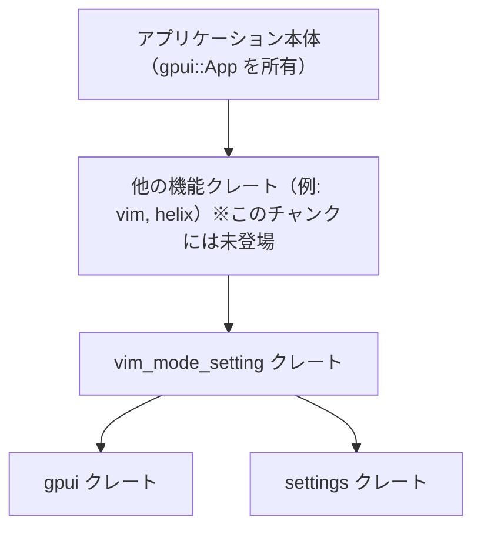
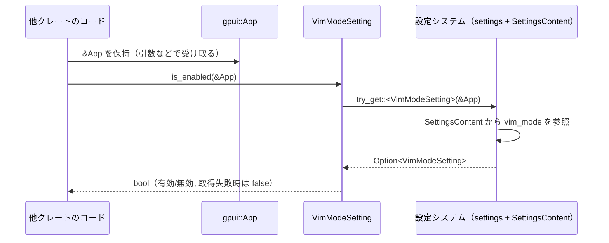

# crates/vim_mode_setting ディレクトリ解説

## 1. ざっくり一言

Vim モード / Helix モードを有効・無効にするための **設定フラグ（真偽値）** を定義し、アプリケーションから簡単に参照できるようにする小さなクレートです。  
他クレートが `vim` クレート全体に依存せずに、モードのオン/オフだけを知るための入口になっています。

---

## 2. このモジュールの役割

### 2.1 概要

- このディレクトリ（クレート）は、**「Vim モード」「Helix モード」が有効かどうか** を表す設定値を定義します。
- 設定システム（`settings` クレート）に統合される形で、アプリケーション全体から参照できるようにします。
- `gpui::App` から設定を読み出すヘルパーメソッドを提供し、呼び出し側が細かい設定取得ロジックを意識しなくてよい構造になっています。

### 2.2 アーキテクチャ内での位置づけ

コードから読み取れる依存関係は次の通りです。

- `vim_mode_setting` クレート
  - `gpui::App` を使ってアプリケーションコンテキストにアクセスします。
  - `settings` クレートの `RegisterSetting`, `Settings`, `SettingsContent` を使って設定システムに統合されます。
- 他の機能クレート（例: Vim エディタ機能本体）は、このクレートに依存してモードのオン/オフを確認する想定です（モジュールコメントに記述あり）。

これを簡単な Mermaid 図にすると次のようになります。



### 2.3 設計上のポイント

コードから読み取れる設計上の特徴は次の通りです。

- **タプル構造体による新しい型定義**
  - `VimModeSetting(pub bool)` / `HelixModeSetting(pub bool)` のように、単なる `bool` をラップする「新しい型」として定義されています。
  - これにより、「どの `bool` がどの機能のフラグか」が型レベルで区別されます。

- **設定システムとの統合**
  - `#[derive(RegisterSetting)]` により、`settings` クレート側の設定登録処理が自動生成されます（生成内容自体はこのチャンクには現れていません）。
  - `Settings` トレイトを実装し、`SettingsContent` から自分自身を組み立てる方法を定義しています。

- **簡易な読み取り API**
  - `VimModeSetting::is_enabled(&App)` / `HelixModeSetting::is_enabled(&App)` という静的メソッドで、有効・無効を `bool` として直接取得できます。
  - 内部では `Self::try_get(cx)` を使い、取得に失敗した場合は **`false` にフォールバック** する方針になっています。

- **Vim クレートからの分離**
  - モジュールコメントにある通り、「他クレートが Vim/Helix モードを制御するのに `vim` クレート全体へ依存させたくない」という意図で、設定部分だけを独立クレートに切り出しています。

---

## 3. 主要な機能一覧

このクレートが提供する主な機能は次の通りです。

- **Vim モード設定の定義と取得**
  - `VimModeSetting(pub bool)` 型の定義
  - `VimModeSetting::is_enabled(&App) -> bool` による有効/無効判定

- **Helix モード設定の定義と取得**
  - `HelixModeSetting(pub bool)` 型の定義
  - `HelixModeSetting::is_enabled(&App) -> bool` による有効/無効判定

- **設定システムとの連携**
  - `Settings` トレイト実装を通じて、`SettingsContent` から `VimModeSetting` / `HelixModeSetting` を構築する処理
  - `RegisterSetting` 派生マクロによる、設定システムへの登録（詳細はこのチャンクには未登場）

---

## 4. 関数・構造体の解説

### 4.1 型一覧

| 名前               | 種別             | 役割 / 用途 |
|--------------------|------------------|-------------|
| `VimModeSetting`   | タプル構造体     | Vim モードが有効かどうかを表す設定値です。内部に `bool` を 1 つだけ持ち、`true` なら有効、`false` なら無効として解釈されます。`RegisterSetting` の派生と `Settings` 実装により、アプリケーションの設定システムと結び付きます。 |
| `HelixModeSetting` | タプル構造体     | Helix モードが有効かどうかを表す設定値です。構造・用途は `VimModeSetting` と同様で、Helix モード専用のフラグとして型レベルで区別されます。 |

補足として使用されている主な外部型は次の通りです（定義はこのチャンクには含まれません）。

- `gpui::App`
  - アプリケーション全体のコンテキストを表す型と推測できます。設定取得などのコンテキスト情報を保持している役割です。
- `settings::Settings`
  - 設定型が実装するトレイトで、`from_settings` などのメソッドを通じて汎用的な設定コンテンツから具体的な設定型を構築します。
- `settings::SettingsContent`
  - 実際の設定値が詰まっている構造体で、`vim_mode` / `helix_mode` フィールドを持つことがコードから分かります。
- `settings::RegisterSetting`
  - `derive` 用のマクロです。`VimModeSetting` / `HelixModeSetting` を設定システムに登録するためのコードを自動生成していると考えられますが、詳細はこのチャンクからは分かりません。

### 4.2 主要な関数

#### `VimModeSetting::is_enabled(cx: &App) -> bool`

```rust
impl VimModeSetting {
    pub fn is_enabled(cx: &App) -> bool {
        Self::try_get(cx)
            .map(|vim_mode| vim_mode.0)
            .unwrap_or(false)
    }
}
```

**概要**

- アプリケーションコンテキスト `App` から現在の設定を読み取り、**Vim モードが有効かどうか** を `bool` で返します。
- もし設定が取得できなかった場合は、**デフォルトで `false`（無効）** を返します。

**引数**

| 引数名 | 型     | 説明 |
|--------|--------|------|
| `cx`   | `&App` | `gpui` のアプリケーションコンテキストです。設定システムにアクセスするために使用されます。 |

**戻り値**

- `bool`
  - `true`: Vim モードが有効と判断された場合
  - `false`: Vim モードが無効、もしくは設定を取得できなかった場合

**内部処理の流れ**

1. `Self::try_get(cx)` を呼び出し、`Option<VimModeSetting>` のような値を取得します。  
   （`try_get` の具体的な定義はこのチャンクにはありませんが、`map` と `unwrap_or` の使い方から `Option<Self>` を返していると解釈できます。）
2. `map(|vim_mode| vim_mode.0)` で、`VimModeSetting` がラップしている `bool`（タプル構造体の 0 番目のフィールド）を取り出します。
3. `unwrap_or(false)` で、`try_get` が `None` を返した場合は `false` を返します。

**Examples（使用例）**

次の例は、`VimModeSetting::is_enabled` を使って、Vim モードの状態を表示するコードです。

```rust
use gpui::App;                          // gpui クレートから App 型をインポートする
use vim_mode_setting::VimModeSetting;   // このクレートから VimModeSetting 型をインポートする

fn print_vim_mode(cx: &App) {           // アプリケーションコンテキストへの参照を受け取る関数
    let enabled = VimModeSetting::is_enabled(cx); // 設定システムから Vim モードの有効/無効を取得する
    if enabled {                        // 取得結果が true の場合
        println!("Vim mode is enabled"); // Vim モードが有効であることを出力する
    } else {                            // 取得結果が false の場合
        println!("Vim mode is disabled"); // Vim モードが無効であることを出力する
    }
}
```

**Errors / Panics**

- この関数自身の中には `unwrap` や `panic!` はありません。
- `try_get` が内部で panic する可能性があるかどうかは、`settings` クレート側の実装に依存しており、このチャンクからは分かりません。
- 少なくとも、この関数のロジックとしては、
  - `try_get` が `None` を返した場合でも `unwrap_or(false)` により panic はせず、単に `false` を返します。

**Edge cases（エッジケース）**

- **設定が存在しない場合 / 読み出せない場合**
  - `try_get(cx)` が `None` を返した場合、結果は `false` になります。
  - そのため、「設定が保存されていない」状況と「明示的に無効に設定された」状況を、この関数だけでは区別できません。
- **繰り返し呼び出される場合**
  - 毎回 `try_get` を呼び出す実装になっており、キャッシュなどは行っていません。
  - 設定システム側でどうキャッシュしているかは、このチャンクからは分かりません。

**使用上の注意点**

- この関数は、「設定が取得できない場合は無効扱いにする」という方針で設計されています。
  - 「設定取得に失敗したことを検出したい」場合には、この関数だけでは情報が足りず、`try_get` 相当の API を直接使う必要がある可能性があります（ただし `try_get` が公開 API かどうかは、このチャンクからは分かりません）。
- 引数の `&App` は有効なアプリケーションコンテキストである必要があります。
  - `App` の取得方法や有効期間は `gpui` クレート側の仕様に依存します（このチャンクには出てきません）。

---

#### `HelixModeSetting::is_enabled(cx: &App) -> bool`

```rust
impl HelixModeSetting {
    pub fn is_enabled(cx: &App) -> bool {
        Self::try_get(cx)
            .map(|helix_mode| helix_mode.0)
            .unwrap_or(false)
    }
}
```

**概要**

- `VimModeSetting::is_enabled` と同様に、Helix モードが有効かどうかを `bool` で返します。
- 設定が取得できなかったときは `false` を返す点も同じです。

**引数**

| 引数名 | 型     | 説明 |
|--------|--------|------|
| `cx`   | `&App` | 設定取得に使用するアプリケーションコンテキストです。 |

**戻り値**

- `bool`
  - `true`: Helix モードが有効と判断された場合
  - `false`: Helix モードが無効、もしくは設定を取得できなかった場合

**内部処理の流れ**

- `VimModeSetting::is_enabled` と同じパターンで、
  1. `Self::try_get(cx)` で `Option<HelixModeSetting>` を取得
  2. `.map(|helix_mode| helix_mode.0)` で内部の `bool` を取り出す
  3. `.unwrap_or(false)` で `None` の場合は `false` を返す

**Examples（使用例）**

Vim/Helix モードの両方を見て、どちらか一方が有効な場合に処理を行う例です。

```rust
use gpui::App;                           // gpui クレートから App 型をインポートする
use vim_mode_setting::{                  // このクレートから 2 つの設定型をインポートする
    VimModeSetting,
    HelixModeSetting,
};

fn setup_editor_modes(cx: &App) {        // アプリケーションコンテキストへの参照を受け取る関数
    let vim_enabled = VimModeSetting::is_enabled(cx);     // Vim モードの有効/無効を取得する
    let helix_enabled = HelixModeSetting::is_enabled(cx); // Helix モードの有効/無効を取得する

    if vim_enabled {                                      // Vim モードが有効な場合
        println!("Configure editor for Vim keybindings"); // Vim キーバインドを設定する処理を行う想定
    }

    if helix_enabled {                                    // Helix モードが有効な場合
        println!("Configure editor for Helix keybindings"); // Helix キーバインドを設定する処理を行う想定
    }

    if !vim_enabled && !helix_enabled {                  // どちらも無効な場合
        println!("Use default keybindings");             // デフォルトのキーバインドを使う処理を行う想定
    }
}
```

**Errors / Panics**

- この関数自身は `VimModeSetting::is_enabled` と同様、内部で `unwrap` を呼び出していないため、`try_get` が panic しない限り、この関数から panic することはありません。
- `try_get` の挙動は `settings` クレート次第で、このチャンクからは詳細不明です。

**Edge cases（エッジケース）**

- 設定が存在しない／読めない場合は、`false` を返します。
- Vim モードとの**相互排他**や優先順位などは、このクレート内では一切扱っていません。
  - たとえば両方とも `true` になることを禁止しているかどうかは、このチャンクからは分かりません。

**使用上の注意点**

- Vim モードとの関係性（排他制御や優先度）は、このレベルの API では管理していません。
  - どのような組み合わせを許可するかは、呼び出し側のポリシーに依存します。
- やはり設定取得に失敗した場合は `false` になるため、
  - 「Helix モードが明示的に無効にされている」のか、
  - 「設定が存在しない/読み出せないために `false` になっている」のか、
  はこの関数だけからは区別できません。

### 4.3 その他の関数・トレイト実装

`Settings` トレイト実装は、設定システム側が内部で利用するためのもので、通常の呼び出し側コードから直接使うことはあまり想定されていないと考えられます（トレイトの設計次第ですが、このチャンクからは詳細は分かりません）。

#### `impl Settings for VimModeSetting { fn from_settings(content: &SettingsContent) -> Self }`

```rust
impl Settings for VimModeSetting {
    fn from_settings(content: &SettingsContent) -> Self {
        Self(content.vim_mode.unwrap())
    }
}
```

- **役割**
  - 汎用的な `SettingsContent` から `VimModeSetting` を構築する処理を定義します。
- **処理内容**
  - `content.vim_mode.unwrap()` で `vim_mode` フィールドから内部の値を取り出し、それを `VimModeSetting` に包んで返します。
- **注意点**
  - `unwrap()` を使用しているため、`vim_mode` フィールドが失敗状態（`None` や `Err`）である場合には panic します。
  - つまり「`SettingsContent` を構築する時点で `vim_mode` が必ず入っている」という前提で設計されています。

#### `impl Settings for HelixModeSetting { fn from_settings(content: &SettingsContent) -> Self }`

```rust
impl Settings for HelixModeSetting {
    fn from_settings(content: &SettingsContent) -> Self {
        Self(content.helix_mode.unwrap())
    }
}
```

- `VimModeSetting` と同様に、`SettingsContent` の `helix_mode` フィールドから値を取り出し、それを `HelixModeSetting` に包んで返します。
- `unwrap()` による panic の可能性も同様です。

---

## 5. データフロー

ここでは、「他クレートのコードが Vim モードの有効/無効を判定するとき」のデータフローを説明します。

1. 他クレートのコードは、`gpui::App` 型のコンテキストへの参照（`&App`）を持っています。
2. そのコードは `VimModeSetting::is_enabled(&App)` を呼び出します。
3. `VimModeSetting::is_enabled` は、`Self::try_get(cx)` を通じて設定システムに問い合わせます。
4. 設定システムは内部の `SettingsContent` から `VimModeSetting` を組み立てて返します（`from_settings` を利用）。
5. `is_enabled` は `VimModeSetting` の内部の `bool` を取り出し、呼び出し元に返します。

これを sequence diagram で表すと次のようになります。



Helix モードについても、`VimModeSetting` を `HelixModeSetting` に置き換えた同様の流れになります。

---

## 6. 使い方（How to Use）

### 6.1 基本的な使用方法

最も基本的な使い方は、**既に手元にある `&App` から、`is_enabled` を呼び出してモードの状態を取得する**ことです。

```rust
use gpui::App;                          // アプリケーションコンテキストを提供する gpui クレート
use vim_mode_setting::VimModeSetting;   // Vim モード設定を表す型をインポートする

fn maybe_enable_vim_mode(cx: &App) {    // アプリケーションコンテキストへの参照を受け取る関数
    // Vim モードが有効かどうかを設定システムから取得する
    let enabled = VimModeSetting::is_enabled(cx);

    if enabled {                        // true（有効）の場合
        // ここで Vim モードの初期化やキーバインドの設定を行う想定
        println!("Initializing Vim mode features...");
    } else {                            // false（無効）の場合
        // Vim モードを使わない場合の処理を行う想定
        println!("Vim mode is disabled; using default behavior.");
    }
}
```

Helix モードについても、`HelixModeSetting::is_enabled(cx)` を同様に呼び出します。

```rust
use gpui::App;                           // App 型をインポートする
use vim_mode_setting::HelixModeSetting;  // Helix モード設定型をインポートする

fn maybe_enable_helix_mode(cx: &App) {   // アプリケーションコンテキストへの参照を受け取る関数
    let enabled = HelixModeSetting::is_enabled(cx); // Helix モードの有効/無効を取得する

    if enabled {                         // Helix モードが有効な場合
        println!("Initializing Helix mode features..."); // Helix モード用の処理を行う想定
    }
}
```

### 6.2 よくある使用パターン

#### パターン 1: モードに応じてエディタのキーバインドを切り替える

Vim / Helix / デフォルトのいずれかのキーバインドを選択するようなコード例です。

```rust
use gpui::App;                           // App 型
use vim_mode_setting::{                  // 2 つの設定型をインポート
    VimModeSetting,
    HelixModeSetting,
};

enum Keymap {                            // キーバインドの種類を表す簡単な enum（このファイル内で定義）
    Default,                             // デフォルトのキーバインド
    Vim,                                 // Vim ライクなキーバインド
    Helix,                               // Helix ライクなキーバインド
}

fn select_keymap(cx: &App) -> Keymap {   // 現在の設定に応じて Keymap を選ぶ関数
    let vim_enabled = VimModeSetting::is_enabled(cx);     // Vim モードの有効/無効を取得する
    let helix_enabled = HelixModeSetting::is_enabled(cx); // Helix モードの有効/無効を取得する

    if vim_enabled {                                     // Vim モードが有効な場合
        Keymap::Vim                                      // Vim キーマップを選択する
    } else if helix_enabled {                            // Vim が無効で Helix が有効な場合
        Keymap::Helix                                    // Helix キーマップを選択する
    } else {                                             // どちらも無効な場合
        Keymap::Default                                  // デフォルトキーマップを選択する
    }
}
```

ここでは、Vim と Helix の両方が `true` になった場合の扱いを「Vim 優先」とする例を示していますが、  
どのような優先順位にするかは呼び出し側のポリシー次第です。

#### パターン 2: UI 上で状態を表示する

設定画面などで「現在 Vim/Helix モードが有効かどうか」をラベルとして表示するイメージです。

```rust
use gpui::App;                           // App 型
use vim_mode_setting::{                  // 2 つの設定型をインポート
    VimModeSetting,
    HelixModeSetting,
};

fn status_text(cx: &App) -> String {     // ステータス表示用の文字列を返す関数
    let vim = VimModeSetting::is_enabled(cx);     // Vim モードの状態
    let helix = HelixModeSetting::is_enabled(cx); // Helix モードの状態

    match (vim, helix) {                           // 両方の状態の組み合わせで分岐する
        (true, false) => "Vim mode: ON".into(),    // Vim のみ ON
        (false, true) => "Helix mode: ON".into(),  // Helix のみ ON
        (true, true)  => "Vim & Helix modes: ON".into(), // 両方 ON（許可するかどうかはポリシー次第）
        (false, false) => "Vim/Helix modes: OFF".into(), // どちらも OFF
    }
}
```

このように、`is_enabled` は単なる `bool` を返すため、UI 表示や分岐の条件として簡単に利用できます。

### 6.3 使用上の注意点（まとめ）

- **取得失敗時は `false` になる**
  - `is_enabled` は `try_get` の結果が `None` の場合に `false` を返すため、
    - 「設定が見つからない／読み出せない」といった異常系と、
    - 「ユーザーが明示的に無効に設定した」という正常系
    を区別しません。
  - 異常系を検出したい場合は、より低レベルな API（`try_get` や `Settings` トレイト経由の取得）を検討する必要があります（ただし、このチャンクにはその具体的な API は記載されていません）。

- **`from_settings` における `unwrap`**
  - `Settings` トレイト実装内の `from_settings` は `unwrap()` を使用しています。
  - そのため、`SettingsContent` 内の `vim_mode` / `helix_mode` フィールドが適切に初期化されていない場合や、エラー状態になっている場合には panic が発生します。
  - 実運用では、設定ファイルやデフォルト値の定義などを通じて、それらのフィールドが必ず存在するように設計されている前提と考えられますが、このチャンクからは詳細は分かりません。

- **Vim クレートへの依存を避けたい場合の入口**
  - このクレートは、モジュールコメントの通り、「Vim/Helix モードのオン/オフだけを知りたい他クレート」が `vim` クレート本体に依存しなくて済むように切り出されています。
  - 「モードの状態を参照するだけ」の場合は、このクレートに依存することで依存関係を小さく保てます。

---

## 7. 関連ファイル

このディレクトリ内のファイルと、その役割は次の通りです。

| パス                                   | 役割 / 関係 |
|----------------------------------------|-------------|
| `vim_mode_setting/Cargo.toml`          | `vim_mode_setting` クレートのメタデータと依存関係を定義しています。`gpui` および `settings` クレートへのワークスペース依存が記述されています。 |
| `vim_mode_setting/src/vim_mode_setting.rs` | 本体のライブラリコードです。`VimModeSetting` / `HelixModeSetting` の定義、`Settings` トレイト実装、`is_enabled` メソッドなどが含まれます。 |

このチャンクには含まれていませんが、論理的に密接に関係する外部クレートとしては次のものが挙げられます。

- `gpui` クレート
  - `App` 型を提供し、アプリケーションコンテキストおよび設定アクセスの基盤となっています。
- `settings` クレート
  - `RegisterSetting` 派生マクロ、`Settings` トレイト、`SettingsContent` 型を提供し、本クレートの設定型をアプリ全体の設定システムに統合しています。

これら外部クレートの具体的なファイル構成や API は、このチャンクには現れていないため、詳細は不明です。
