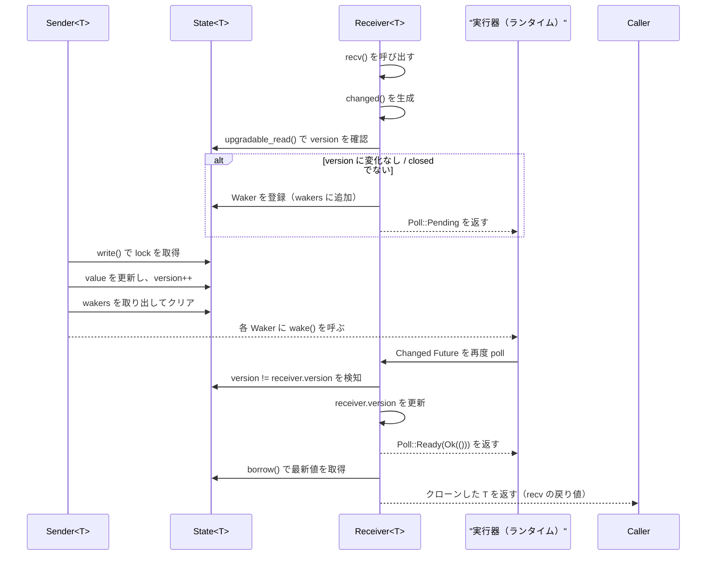

## 1. ざっくり一言

`watch` クレートは、「常に最新の値」を共有しつつ、その値の**変化を非同期に待ち受けるための 1 対多の watch チャンネル**を提供します。  
単一の `Sender<T>` と複数の `Receiver<T>` で構成され、変更通知と最新値の読み取りを行います。

---

## 2. このモジュールの役割

### 2.1 概要

- このクレートは、**共有される 1 つの値 T の更新を複数の受信側が監視する**ための仕組みを提供します。
- 送信側 (`Sender<T>`) は値を更新し、受信側 (`Receiver<T>`) は
  - 同期的に「今の値」を読む (`borrow`)
  - 非同期に「値が変わるまで待つ」 (`changed` / `recv`)
  ことができます。
- 受信側が 0 個になった／送信側がいなくなったことを、専用のエラー型で通知します。

### 2.2 アーキテクチャ内での位置づけ

クレート内の主な構成要素と依存関係は次のようになっています。

```mermaid
graph TD
    Client["利用側コード"] -->|channel() を呼び出し| ChannelFn["channel<T>()"]
    ChannelFn --> Sender["Sender<T>（送信側）"]
    ChannelFn --> Receiver["Receiver<T>（受信側）"]

    Sender --> State["State<T>（共有状態）"]
    Receiver --> State

    State --> RwLock["Arc<RwLock<...>>（parking_lot）"]
    State --> Wakers["BTreeMap<WakerId, Waker>（待機中タスク）"]
    State --> Errors["NoSenderError / NoReceiverError"]

    subgraph error モジュール
      Errors
    end
```

- 共有状態 `State<T>` は `Arc<RwLock<...>>` で包まれ、スレッド間で共有されます。
- `Sender` / `Receiver` はこの共有状態へのハンドルを持つ薄いラッパーです。
- `error` モジュールには、チャネルの「終端状態」を表すエラー型が定義され、`watch` モジュールから `pub use` されています。

### 2.3 設計上のポイント

コードから読み取れる主な設計上の特徴は次のとおりです。

- **単一送信者・複数受信者**
  - `Sender<T>` は `Clone` を実装しておらず、送信側は基本的に 1 つです。
  - `Receiver<T>` は `Clone` を実装しており、監視側を複数に増やせます。
- **共有状態は読み取り中心**
  - 値とメタ情報 (`version`, `closed`, `wakers`) は `Arc<RwLock<State<T>>>` で共有されます。
  - `Receiver` 側は `RwLock` の**読み取りロック**中心、`Sender` 側が書き込みロックを取得する構造です。
- **バージョン番号による変更検知**
  - 値の更新ごとに `version: usize` がインクリメントされます。
  - 各 `Receiver` は自身の `version` を持ち、この差分で「新しい値が来たかどうか」を判定します。
- **非同期実行器との連携**
  - `Changed<'_, T>` という内部構造体が `Future<Output = Result<(), NoSenderError>>` を実装し、
    `Waker` を `BTreeMap` に登録／解除することで、変更通知を行います。
- **明示的な終端エラー**
  - 受信側がいなくなった場合: `NoReceiverError`
  - 送信側がいなくなった場合: `NoSenderError`

---

## 3. 主要な機能一覧

このクレートが提供する主要な機能を箇条書きで示します。

- `channel<T>(value: T) -> (Sender<T>, Receiver<T>)`  
  初期値付きの watch チャンネルを新しく作成します。
- `Sender<T>::send(&mut self, value: T) -> Result<(), NoReceiverError>`  
  値を更新し、待機中の受信タスクを起こします。
- `Sender<T>::receiver(&self) -> Receiver<T>`  
  既存の `Sender` から追加の `Receiver` を作成します。
- `Receiver<T>::borrow(&mut self)`  
  ロック付きで最新値を同期的に借用します（非クローン）。
- `Receiver<T>::changed(&mut self) -> impl Future<Output = Result<(), NoSenderError>>`  
  値が変わるか、送信側が閉じられるまで待機します。
- `Receiver<T>::recv(&mut self) -> impl Future<Output = Result<T, NoSenderError>>`  
  値の変化を待ち、その時点の値のクローンを返します。
- `Receiver<T>::constant(value: T) -> Receiver<T>`  
  変更されない固定値を持つ `Receiver` を生成します（送信側は存在しません）。
- エラー型
  - `NoReceiverError`: `send` したが受信側が 1 つも存在しない状態。
  - `NoSenderError`: 送信側がすべてドロップされ、これ以上値が更新されない状態。

---

## 4. 関数・構造体の解説

### 4.1 型一覧

公開・内部を含めた主な型の一覧です。

| 名前 | 種別 | 公開範囲 | 役割 / 用途 |
|------|------|----------|-------------|
| `Sender<T>` | 構造体 | `pub` | 値を更新する送信側ハンドル。内部の共有状態への書き込みを担当します。 |
| `Receiver<T>` | 構造体 | `pub` | 値の最新状態を読み取り、変更通知を受け取る受信側ハンドル。`Clone` 可能です。 |
| `NoReceiverError` | 構造体 | `pub` | 送信時に受信者がいないことを表すエラー。`std::error::Error` を実装。 |
| `NoSenderError` | 構造体 | `pub` | 受信時に送信側がすでにいないことを表すエラー。`std::error::Error` を実装。 |
| `State<T>` | 構造体 | 非公開 | 共有される内部状態。値・バージョン・クローズフラグ・`Waker` マップを保持します。 |
| `WakerId` | 構造体 | 非公開 | `Waker` マップでのキーとして使う連番 ID。オーバーフローはラップします。 |
| `Changed<'a, T>` | 構造体 | 非公開 | `Receiver::changed` が返す内部 `Future` 型。`&'a mut Receiver<T>` を保持します。 |

### 4.2 重要な関数 / メソッドの詳細

#### `channel<T>(value: T) -> (Sender<T>, Receiver<T>)`

**概要**

- 初期値 `value` を持つ新しい watch チャンネルを作成し、対応する `Sender` と `Receiver` を返します。
- 戻り値の `Receiver` は、最初の値（`value`）をすでに「最新値」として保持しています。

**引数**

| 引数名 | 型 | 説明 |
|--------|----|------|
| `value` | `T` | 初期値。共有状態にそのまま格納されます。 |

**戻り値**

- `(Sender<T>, Receiver<T>)`  
  - `Sender<T>`: 以降の更新を行うためのハンドル。  
  - `Receiver<T>`: 初期値を含む更新を監視するためのハンドル。

**内部処理の流れ**

1. `State<T>` を生成し、`value` とメタ情報（空の `wakers`、初期 `version = 0`、`closed = false`）を設定します。
2. これを `parking_lot::RwLock` で包み、さらに `Arc` に入れて共有状態にします。
3. `Sender` と `Receiver` は、この同じ `Arc<RwLock<State<T>>>` を共有します。
4. `Receiver` の `version` は 0 に初期化されます。

**Examples（使用例）**

```rust
use watch::channel;

async fn example() {
    // 初期値 0 を持つ watch チャンネルを作成する
    let (mut sender, mut receiver) = channel(0_i32);

    // Receiver はすぐに初期値を読むことができる
    assert_eq!(*receiver.borrow(), 0);

    // 値を 1 に更新
    sender.send(1).unwrap();

    // 更新が届くまで待ってから値を取得
    let v = receiver.recv().await.unwrap();
    assert_eq!(v, 1);
}
```

**Edge cases（エッジケース）**

- `value` がどんな型でも、そのまま `State<T>` に移動されます。
- 直後に `Receiver` をドロップしてから `send` を呼ぶと、以降の送信で `NoReceiverError` が返りうることに注意が必要です。

---

#### `impl<T> Sender<T>`

##### `fn receiver(&self) -> Receiver<T>`

**概要**

- 既存の `Sender` から、同じ共有状態を監視する新しい `Receiver` を作ります。
- 新しい `Receiver` の `version` は、呼び出し時点の共有状態の `version` で初期化されます。

**引数 / 戻り値**

- 引数: `&self`
- 戻り値: `Receiver<T>`

**内部処理の流れ**

1. 共有状態の読み取りロックを取得し、現在の `state.version` を読みます。
2. 同じ `Arc<RwLock<State<T>>>` を共有し、`version` をその値で初期化した `Receiver` を返します。

**挙動のポイント**

- 新しく生成された `Receiver` にとって、「生成前に起こっていた送信」は**既に反映済み**とみなされます。
  - つまり、生成後に行われる最初の送信から `changed` / `recv` が反応します。
- ただし、生成直後に `borrow` を呼べば、その時点での最新値を読むことができます。

---

##### `fn send(&mut self, value: T) -> Result<(), NoReceiverError>`

**概要**

- 値を新しい `value` に更新し、待機中の `Receiver::changed` / `Receiver::recv` を起こします。
- 受信側が存在しない場合は `Err(NoReceiverError)` を返します。

**引数**

| 引数名 | 型 | 説明 |
|--------|----|------|
| `value` | `T` | 新しい値。既存の値を上書きします。 |

**戻り値**

- `Ok(())`  
  - 少なくとも 1 つの `Receiver` が存在する場合。
- `Err(NoReceiverError)`  
  - 共有状態を保持する `Arc` の参照が `self` だけ（つまり `Receiver` が 1 つもない）場合。

**内部処理の流れ（大まか）**

1. `Arc::get_mut(&mut self.state)` を試みます。
   - これが `Some` を返すのは「`Sender` の持つ `Arc` だけが残っている（＝受信側 0）」時です。
   - この場合:
     1. 内部の `State<T>` への可変参照を取得し、`value` を更新します。
     2. `debug_assert` で `wakers` が空であることを確認します。
     3. `Err(NoReceiverError)` を返します。
2. それ以外（`Receiver` が 1 つ以上存在）は:
   1. 書き込みロックを取得し、`state.value` を更新。
   2. `state.version` を `wrapping_add(1)` でインクリメント。
   3. `mem::take(&mut state.wakers)` で `Waker` のマップを一旦取り出し、ロックを解放します。
   4. 取り出した `Waker` それぞれに対して `wake()` を呼び、待機中タスクを再スケジュールします。
   5. `Ok(())` を返します。

**Examples（使用例）**

```rust
use watch::channel;

async fn send_example() {
    let (mut sender, _receiver) = channel(String::from("initial"));

    // 受信者が存在するため Ok(()) が返る
    assert!(sender.send("updated".to_string()).is_ok());

    // 受信者をすべてドロップした後はエラーになる
    drop(_receiver);
    assert_eq!(sender.send("no one".into()), Err(watch::NoReceiverError));
}
```

**Errors / Panics**

- `Err(NoReceiverError)`:
  - `Receiver` が 1 つも存在しない状態で `send` したとき。
- `debug_assert_eq!(state.wakers.len(), 0);` があるため、デバッグビルドでは
  「受信者がいないのに `Waker` が登録されている」場合にパニックします
  （通常の使用では発生しない前提のパスです）。

**Edge cases**

- 受信者が 0 のときも `state.value` 自体は更新されますが、`version` はインクリメントされません。
  - そのため、その後に新しく `Receiver` を作ると
    - `borrow()` で最新値は読める
    - しかし、その「受信者がいなかった期間の更新」は「過去の更新」として扱われ、`changed` では検知されません。

**使用上の注意点**

- 戻り値の `Result` を無視すると、「受信者がいないのに送っている」状態に気づきにくくなります。
  - 監視が必須の値であれば、`Err(NoReceiverError)` をログに出すなどの扱いが必要です。

---

#### `impl<T> Receiver<T>`

##### `fn borrow(&mut self) -> parking_lot::MappedRwLockReadGuard<'_, T>`

**概要**

- 現在の値への読み取りロック付き参照を取得します。
- 呼び出し時点の `version` をレシーバ側にも反映するため、
  「最新値まで追いついた」とみなされます。

**引数 / 戻り値**

- 引数: `&mut self`
- 戻り値: `MappedRwLockReadGuard<'_, T>`（`&T` とほぼ同様に扱える読み取りロックガード）

**内部処理の流れ**

1. `self.state.read()` で `State<T>` への読み取りロックを取得します。
2. `self.version = state.version;` で、内部バージョンを最新に更新します。
3. `RwLockReadGuard::map(state, |state| &state.value)` により、
   `State<T>` 全体ではなく `T` への参照だけを持つガードに変換して返します。

**Examples（使用例）**

```rust
use watch::channel;

fn sync_read_example() {
    let (mut sender, mut receiver) = channel(10);

    // 最新値を同期的に取得
    assert_eq!(*receiver.borrow(), 10);

    // 値を更新
    sender.send(20).unwrap();

    // 再度 borrow すると、更新後の値が読める
    assert_eq!(*receiver.borrow(), 20);
}
```

**Edge cases**

- `borrow` の呼び出しだけでは、待機中の `changed` / `recv` が解決することはありません。
  - ただし、`borrow` 自体が `self.version` を最新に更新するため、
    **`borrow` 後に新しく `changed()` を作ると、「すでに見た値」に対しては Ready になりません。**
    （テストで確認されています）

**使用上の注意点**

- `borrow` はロックを保持したまま値へアクセスするため、
  長時間ロックを保持すると `Sender` や他の `Receiver` の進行に影響する可能性があります。
  - 大きな処理を行う場合は、値をクローンしてロックを早めに解放することも検討が必要です。

---

##### `fn changed(&mut self) -> impl Future<Output = Result<(), NoSenderError>>`

**概要**

- 値が自分の知っているバージョンから更新されるか、
  送信側がすべてドロップされるまで待つ `Future` を返します。
- 成功時は `Ok(())`（値は別途 `borrow` で読む）、送信側がなくなったら `Err(NoSenderError)` です。

**内部処理のポイント（`Changed` の `poll`）**

1. `upgradable_read()` で読み取りロックを取得。
2. `state.version != self.receiver.version` の場合
   - 送信側でバージョンが更新されているので、`receiver.version` を更新し `Ok(())` で即 `Ready`。
   - このとき、`wakers` からの削除は送信側ですでに行われているため、再削除はしません。
3. `state.closed == true` の場合
   - 送信側がドロップされており、`Err(NoSenderError)` を `Ready` で返します。
4. それ以外（値に変化もなく、閉じてもいない）場合
   - ロックを `upgrade` して書き込みロックに昇格。
   - すでに登録していた `Waker` があれば削除（スプリアスウェイク対応）。
   - 新しい `WakerId` を払い出し、`cx.waker().clone()` を `wakers` に登録。
   - `Poll::Pending` を返します。
5. `Changed` が `Drop` されるとき
   - 未登録のまま残っている `waker` があれば削除し、メモリリークを防ぎます。

**Examples（使用例）**

```rust
use watch::channel;

async fn wait_for_change() {
    let (mut sender, mut receiver) = channel(0);

    sender.send(1).unwrap();

    // 「次の」変化を待つ（ここでは 1 -> 2 への変化が対象）
    let mut value = *receiver.borrow();       // まず現在値を読む（1）
    assert_eq!(value, 1);

    // 変化待ち
    let changed = receiver.changed().await;
    assert!(changed.is_ok());

    // 変化後の値を読む
    value = *receiver.borrow();
    assert_eq!(value, 2);
}
```

**Edge cases**

- 送信側がドロップされている場合は、`Poll::Ready(Err(NoSenderError))` となります。
- 異なる `Receiver` クローンごとに独立した `version` を持つため、
  「誰か別の受信者が既に値を読んだ」ことは自分の `changed` には影響しません。

**使用上の注意点**

- `changed` が返す `Future` は `&mut Receiver<T>` を内部に保持するため、
  その `Future` が完了するまで同じ `Receiver` を別用途で同時に使うことはできません。

---

##### `fn constant(value: T) -> Receiver<T>`

**概要**

- 更新されない固定値を保持する `Receiver` を作成します。
- 対応する `Sender` は存在しません。

**挙動のポイント**

- 内部的には `channel` と似た `State<T>` を作りますが、`Sender` は返されません。
- `state.closed` は `false` のままです（送信側が存在しないため、閉じる契機がありません）。

**重要な注意点**

- この `Receiver` に対して `changed().await` や `recv().await` を呼ぶと、
  **値も `closed` フラグも変化しないため Future が完了しません**（待ち続けます）。
- 想定される用途は、「値が変わらない前提で `borrow()` による読み取り専用で使うケース」です。

---

##### `async fn recv(&mut self) -> Result<T, NoSenderError>`（`T: Clone`）

**概要**

- 「次の値の変化」を待ち、その時点の値をクローンして返します。
- `changed().await?;` の直後に `borrow().clone()` を行う合成メソッドです。

**内部処理の流れ**

1. `self.changed().await?;`
   - ここで、値が変わるか、送信側が閉じるまで待機します。
2. `Ok(self.borrow().clone())`
   - 最新値を `borrow` で読み、`Clone` して返します。

**Examples（使用例）**

```rust
use watch::channel;

async fn recv_example() {
    let (mut sender, mut receiver) = channel(0);

    sender.send(1).unwrap();
    assert_eq!(receiver.recv().await.unwrap(), 1);

    // 連続した送信は最後の値だけが観測される
    sender.send(2).unwrap();
    sender.send(3).unwrap();
    assert_eq!(receiver.recv().await.unwrap(), 3);
}
```

**Edge cases**

- 送信側がドロップされた後に `recv()` を呼ぶと、`Err(NoSenderError)` が返ります。
- 中間の値は「最新値」によって**上書きされる**ため、
  短時間に何度も送信すると、受信者は最後の値だけを見る可能性があります（テストで確認されています）。

**使用上の注意点**

- `T: Clone` が必要です。大きな構造体などを頻繁に `recv` する場合は、
  クローンコストに注意が必要です。
  - その場合、`changed` + `borrow` で必要なタイミングだけアクセスするパターンも考えられます。

---

### 4.3 その他の内部構造

- `State<T>`
  - フィールド:
    - `value: T` – 共有される最新値。
    - `wakers: BTreeMap<WakerId, Waker>` – `changed` 待機中のタスクを起こすための `Waker` 集合。
    - `next_waker_id: WakerId` – `wakers` に登録するための ID カウンタ。
    - `version: usize` – 値の更新回数（オーバーフロー時はラップします）。
    - `closed: bool` – 送信側がすべてドロップされたかどうか。
- `WakerId`
  - 単純なラップされた `usize` で、`post_inc` により「現在の値を返しつつカウンタをインクリメント」します。
- `Changed<'a, T>`
  - `Future` を実装し、`Receiver::changed` の実体として動きます。
  - `Drop` 実装により、`Waker` 登録情報のクリーンアップを担当します。

---

## 5. データフロー

ここでは典型的なシナリオとして、「1 つの `Sender` と 1 つの `Receiver`」で `recv` を使う場合のデータフローを示します。

### 5.1 シーケンス図



### 5.2 要点

- 共有状態 `State<T>` は常に**1 つだけ**存在し、`Sender` とすべての `Receiver` から参照されます。
- 各 `Receiver` は自分専用の `version` を持ち、「自分が最後に確認したバージョン」と比較することで更新を検知します。
- `wakers` マップは「現在 `changed` で待機中のタスク」の集合であり、`send` によって一気に wake されます。
- 送信側の `Drop` では、`closed = true` に設定して登録済み `Waker` をすべて wake し、
  受信側の `changed` / `recv` を `NoSenderError` として完了させます。

---

## 6. 使い方（How to Use）

### 6.1 基本的な使用方法

単純な 1 送信者・1 受信者での利用例です。  
（ここでは任意の async ランタイム上で動かすことを想定しています。）

```rust
use watch::channel;

async fn basic_usage() {
    // 初期値 0 でチャンネルを作成
    let (mut sender, mut receiver) = channel(0_i32);

    // 初期値を同期的に読む
    assert_eq!(*receiver.borrow(), 0);

    // 値を 1 に更新
    sender.send(1).unwrap();

    // 次の変化を待って値を取得（1 が返る）
    let v = receiver.recv().await.unwrap();
    assert_eq!(v, 1);

    // さらに値を 2,3 と更新
    sender.send(2).unwrap();
    sender.send(3).unwrap();

    // 連続した送信は最後の値だけが観測される（3）
    let v = receiver.recv().await.unwrap();
    assert_eq!(v, 3);

    // 受信側をドロップすると、以降の send で NoReceiverError が返る
    drop(receiver);
    assert!(sender.send(4).is_err());
}
```

ポイント:

- `borrow` は「今の値」を読みたいときに使います。
- `recv` は「次に値が変わるまで待つ」場合に便利です。
- 連続送信時には「最後の値だけが観測されうる」ことに注意が必要です。

---

### 6.2 よくある使用パターン

#### 6.2.1 複数の受信者で最新値を共有する

`Receiver<T>` は `Clone` できるため、複数タスクで同じチャンネルを監視できます。

```rust
use watch::channel;
use std::sync::Arc;

async fn multi_receiver_example() {
    let (mut sender, receiver) = channel(0);

    // 受信者を複数クローンする
    let mut rx1 = receiver.clone();
    let mut rx2 = receiver.clone();

    // タスク1: rx1 で監視
    let task1 = async move {
        loop {
            match rx1.recv().await {
                Ok(v) => println!("rx1 = {}", v),
                Err(_) => break, // 送信側が閉じた
            }
        }
    };

    // タスク2: rx2 で監視
    let task2 = async move {
        loop {
            match rx2.recv().await {
                Ok(v) => println!("rx2 = {}", v),
                Err(_) => break,
            }
        }
    };

    // 送信タスク
    let send_task = async move {
        for i in 1..=5 {
            sender.send(i).unwrap();
        }
        // ここで sender が drop されると、受信側は NoSenderError を受け取る
    };

    // これらを任意のランタイムで同時に進行させる
}
```

各 `Receiver` は独立した `version` を持つため、「ある受信者が値を見逃しても、他の受信者には影響しない」構造になっています。

#### 6.2.2 更新検知だけを行い、値は必要なときだけ読む

大きな値や重い構造体を持つ場合、毎回 `recv` で `Clone` するのではなく、`changed` + `borrow` の組み合わせで利用できます。

```rust
use watch::channel;

async fn changed_and_borrow_example() {
    let (mut sender, mut receiver) = channel(String::from("initial"));

    // バックグラウンドで値を更新する
    sender.send("v1".into()).unwrap();
    sender.send("v2".into()).unwrap();

    // いまのところどんな値かは気にせず、「変わったこと」だけ知りたい
    receiver.changed().await.unwrap(); // 少なくとも 1 回は変化している

    // 必要になったタイミングで最新値を読む
    let latest = receiver.borrow().clone();
    assert_eq!(latest, "v2");
}
```

#### 6.2.3 変更されない設定値などへの利用（`constant`）

`Receiver::constant` は、「変わらない値」を `Receiver` として扱いたい場面に利用できます。

```rust
use watch::Receiver;

fn constant_example() {
    let mut rx = Receiver::constant(42u32);

    // 値は変わらない前提で、常に borrow で読む
    assert_eq!(*rx.borrow(), 42);

    // recv や changed は完了しない（送信側が存在しないため）
}
```

---

### 6.3 よくある間違い

```rust
use watch::Receiver;

async fn pitfalls() {
    // 間違い例 1: constant に対して recv する（完了しない）
    let mut rx = Receiver::constant(0);
    // NG: いつまでも待ち続ける
    // let _ = rx.recv().await;

    // 間違い例 2: send の結果を無視して、受信者が本当にいるか確認しない
    // let (mut sender, _receiver) = watch::channel(0);
    // drop(_receiver);
    // sender.send(1).unwrap(); // unwrap でパニックになる可能性がある

    // 正しい扱い例（エラーを確認する）
    // let result = sender.send(1);
    // if let Err(e) = result {
    //     eprintln!("no receivers: {}", e);
    // }
}
```

---

### 6.4 使用上の注意点（まとめ）

- **バージョンと更新の関係**
  - `Receiver` は自分の `version` と `State.version` の差だけで更新有無を判断します。
  - `borrow` を呼ぶと `Receiver` の `version` が最新に更新されるため、
    その後に作成した `changed` は「borrow 前の更新」には反応しません。
- **中間値の欠落**
  - 短時間に連続して `send` した場合、受信側は最後の値だけを見る可能性があります。
  - 「すべての値を順番に処理したい」用途には向きません。
- **constant レシーバー**
  - `Receiver::constant` で作られたレシーバーには送信側が存在せず、
    `changed` / `recv` は完了しません。**読み取り専用**に使う必要があります。
- **エラーの扱い**
  - `send` の `NoReceiverError` は、「誰も監視していないのに送っている」ことを意味します。
  - `recv` / `changed` の `NoSenderError` は、「これ以上値が更新されない」ことを意味します。
- **ロック保持時間**
  - `borrow` は `RwLock` の読み取りロックを保持するため、
    長時間ロックしたまま重い処理を行うと、他のスレッドでの更新に影響する可能性があります。

---

## 7. 関連ファイル

このディレクトリ（`crates/watch`）内の主なファイルと役割です。

| パス | 役割 / 関係 |
|------|-------------|
| `watch/Cargo.toml` | クレート設定。`name = "watch"` としてライブラリクレートを定義し、`src/watch.rs` をライブラリ本体としています。`parking_lot` を依存に持ち、テスト用に `futures` / `gpui` / `ctor` / `zlog` を利用します。 |
| `watch/src/error.rs` | エラー型 `NoReceiverError` / `NoSenderError` を定義するモジュールです。どちらも `std::error::Error` を実装し、`watch` 本体から `pub use` されています。 |
| `watch/src/watch.rs` | クレートのメイン実装ファイルです。`channel` 関数、`Sender<T>` / `Receiver<T>`、内部状態 `State<T>`、変更待ち `Future` など、すべてのロジックがここに実装されています。テストコードも同ファイル内の `mod tests` に含まれます。 |

この 3 ファイルで、watch チャンネル機構が完結している構成になっています。
