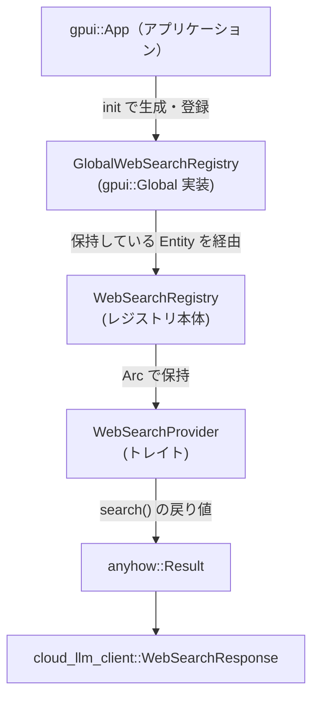
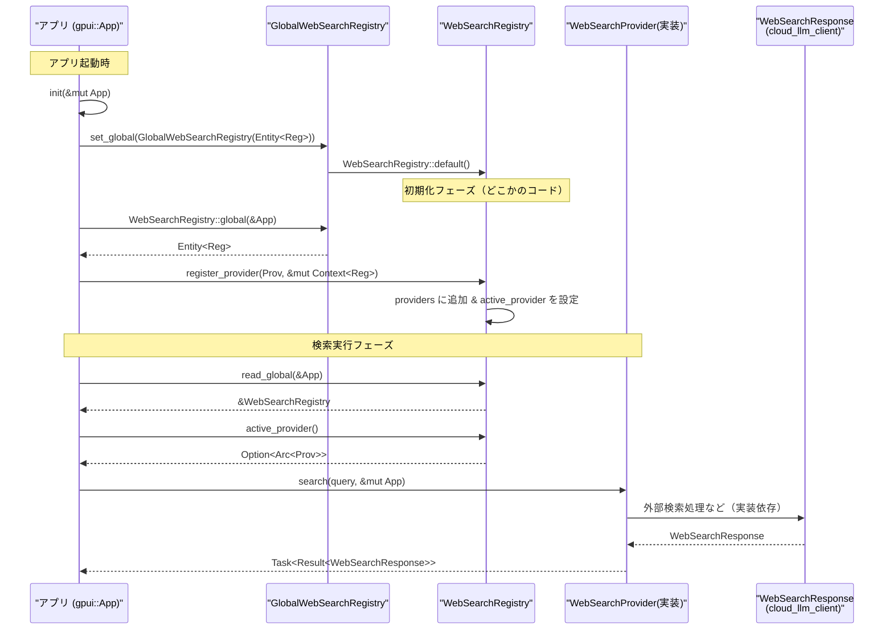

# web_search ディレクトリ解説

## 1. ざっくり一言

`web_search` クレートは、アプリケーション内で利用する「Web検索プロバイダ」を登録・管理し、アクティブなプロバイダを通じて Web 検索を実行するためのレジストリを提供するモジュールです。

---

## 2. このモジュールの役割

### 2.1 概要

- このモジュールは、複数の Web 検索サービス（「プロバイダ」）を一元管理するためのレジストリを提供します。
- プロバイダは `WebSearchProvider` トレイトで抽象化されており、検索クエリを受け取って `WebSearchResponse` を返す非同期タスクを生成します。
- レジストリは `gpui` のグローバル状態としてアプリケーションに登録され、どこからでもアクティブなプロバイダを取得できるように設計されています。

### 2.2 アーキテクチャ内での位置づけ

依存関係と役割を簡単に図示します（外部クレートの詳細な挙動はこのコードからは分かりませんが、名前から推測できる範囲でラベルを付けています）。



- `gpui::App` はアプリケーションコンテキストです。
- `GlobalWebSearchRegistry` は `gpui::Global` を実装し、`WebSearchRegistry` の `Entity` をグローバルに保持します。
- `WebSearchRegistry` は `HashMap` でプロバイダを管理し、アクティブプロバイダを 1 つ記録します。
- 各プロバイダは `cloud_llm_client::WebSearchResponse` を返す検索タスクを提供します。

### 2.3 設計上のポイント

コードから読み取れる設計上の特徴は次のとおりです。

- **プラガブルなプロバイダ設計**
  - `WebSearchProvider` トレイトにより、任意の実装をプロバイダとして登録できます。
  - プロバイダの識別には `WebSearchProviderId`（`SharedString` のラッパー）が使われます。
- **グローバルレジストリによる共有**
  - `init` 関数を通じて `WebSearchRegistry` が `gpui` のグローバル状態として登録され、どこからでもアクセス可能になります。
- **状態管理**
  - レジストリは内部に
    - `providers: HashMap<WebSearchProviderId, Arc<dyn WebSearchProvider>>`
    - `active_provider: Option<Arc<dyn WebSearchProvider>>`
    を持ちます。
  - アクティブプロバイダは任意（存在しない場合もある）という前提で設計されています。
- **エラーハンドリング**
  - 検索処理は `anyhow::Result<WebSearchResponse>` を返すタスクとして定義され、詳細なエラー型は隠蔽されます。
  - エラーの内容は各プロバイダ実装に委ねられています。

---

## 3. 主要な機能一覧

このモジュールが提供する主な機能を列挙します。

- `init`: `WebSearchRegistry` を作成し、`gpui` のグローバル状態に登録する。
- `WebSearchProvider` トレイト:
  - `id`: プロバイダを一意に識別する ID を返す。
  - `search`: クエリ文字列から Web 検索を行う非同期タスクを生成する。
- `WebSearchRegistry::global`: グローバルな `WebSearchRegistry` の `Entity` を取得する。
- `WebSearchRegistry::read_global`: グローバルな `WebSearchRegistry` を読み取り専用で参照する。
- `WebSearchRegistry::providers`: 登録済みプロバイダを列挙する。
- `WebSearchRegistry::active_provider`: 現在のアクティブプロバイダを取得する。
- `WebSearchRegistry::set_active_provider`: 指定したプロバイダをアクティブにし、同時にレジストリへ登録する。
- `WebSearchRegistry::register_provider`: 新しいプロバイダをレジストリに登録し、まだアクティブプロバイダがなければ自動的にアクティブにする。
- `WebSearchRegistry::unregister_provider`: プロバイダをレジストリから削除し、アクティブだった場合はアクティブ状態を解除する。

---

## 4. 関数・構造体の解説

### 4.1 型一覧

| 名前 | 種別 | 役割 / 用途 |
|------|------|-------------|
| `WebSearchProviderId` | 構造体（`pub SharedString` のラッパー） | 各 Web 検索プロバイダを一意に識別する ID。`Eq` / `Hash` などを実装しており、`HashMap` のキーとして利用されます。 |
| `WebSearchProvider` | トレイト | Web 検索プロバイダの共通インターフェース。ID 取得と検索タスク生成のメソッドを定義します。 |
| `GlobalWebSearchRegistry` | 構造体 + `Global` 実装 | `gpui::Global` を実装し、`WebSearchRegistry` の `Entity` をグローバルに保持するためのラッパーです。 |
| `WebSearchRegistry` | 構造体 | プロバイダの登録・列挙・アクティブプロバイダ管理を行うレジストリ本体です。内部に `HashMap` と `active_provider` を持ちます。 |

`Cargo.toml` から、このクレートはライブラリクレートであり、ルートは `src/web_search.rs` であることが分かります。

### 4.2 主要関数・メソッドの詳細

#### `pub fn init(cx: &mut App)`

**概要**

- `WebSearchRegistry` を生成し、`GlobalWebSearchRegistry` を通じて `gpui::App` にグローバルオブジェクトとして登録します。
- アプリケーション起動時などに 1 回呼び出すことを想定した初期化関数です。

**引数**

| 引数名 | 型 | 説明 |
|--------|----|------|
| `cx` | `&mut App` | `gpui` のアプリケーションコンテキスト。グローバルオブジェクトの登録に使用します。 |

**戻り値**

- なし（`()`）。

**内部処理の流れ**

1. `cx.new(|_cx| WebSearchRegistry::default())` で、デフォルトの `WebSearchRegistry` を生成し、`Entity<WebSearchRegistry>` を取得します。
2. 得られた `Entity` を `GlobalWebSearchRegistry` 構造体でラップします。
3. `cx.set_global(GlobalWebSearchRegistry(registry))` で、このラッパーを `gpui` のグローバルとして登録します。

**Examples（使用例）**

アプリケーション起動時にレジストリを初期化する例です。

```rust
use gpui::App;
use web_search::init;

// アプリケーションのセットアップ処理のどこかで呼び出すことを想定
fn setup(app: &mut App) {
    init(app); // WebSearchRegistry をグローバルに登録する
}
```

※ `web_search` クレートのモジュールパスは `Cargo.toml` の `name` に基づき `web_search` としています。

**Edge cases（エッジケース）**

- `init` が複数回呼ばれた場合の挙動は、このコードからは分かりません。
  - `gpui::App::set_global` の仕様に依存します（上書きされるのかエラーなのかは不明です）。

**使用上の注意点**

- 通常はアプリケーション起動時に 1 回だけ呼び出すことが前提と考えられます。
- レジストリを使うコードは、この初期化が終わっていることを前提として設計する必要があります。

---

#### `pub trait WebSearchProvider`

```rust
pub trait WebSearchProvider {
    fn id(&self) -> WebSearchProviderId;
    fn search(&self, query: String, cx: &mut App) -> Task<Result<WebSearchResponse>>;
}
```

**概要**

- Web 検索を提供するコンポーネント（プロバイダ）のインターフェースです。
- 個々の検索サービス（例: 外部検索 API など）はこのトレイトを実装してレジストリに登録されます。

**メソッド: `id(&self) -> WebSearchProviderId`**

- プロバイダを一意に識別する ID を返します。
- レジストリの `HashMap` のキーとして使われます。

**メソッド: `search(&self, query: String, cx: &mut App) -> Task<Result<WebSearchResponse>>`**

**引数**

| 引数名 | 型 | 説明 |
|--------|----|------|
| `query` | `String` | 検索クエリ文字列。所有権を受け取るため、呼び出し側で `String` にして渡す必要があります。 |
| `cx` | `&mut App` | `gpui` のアプリケーションコンテキスト。UI 更新やタスクスケジューリングなどに利用される可能性がありますが、詳細は実装依存です。 |

**戻り値**

- `Task<Result<WebSearchResponse>>`
  - `Task<T>` は `gpui` が提供する非同期タスク型と考えられますが、詳細はこのコードからは分かりません。
  - `Result<WebSearchResponse>` は `anyhow::Result<WebSearchResponse>`（`use anyhow::Result;`）であり、エラー型は `anyhow::Error` によってラップされます。

**実装イメージ（Examples）**

単純なスタブプロバイダの実装例です（実際の `Task` の生成方法は `gpui` に依存するため、コメントで疑似コードとして記述します）。

```rust
use std::sync::Arc;
use gpui::App;
use cloud_llm_client::WebSearchResponse;
use web_search::{WebSearchProvider, WebSearchProviderId};
use collections::HashMap; // 実際の利用方法はこのチャンクからは不明

struct MyProvider;

// WebSearchProvider の実装
impl WebSearchProvider for MyProvider {
    fn id(&self) -> WebSearchProviderId {
        // "my-provider" という ID を持つプロバイダとする
        WebSearchProviderId("my-provider".into())
    }

    fn search(&self, query: String, cx: &mut App) 
        -> gpui::Task<anyhow::Result<WebSearchResponse>> 
    {
        // 実際には gpui の Task を生成する必要がある
        // 具体的な生成方法はこのチャンクからは分からないため、
        // ここでは擬似コードでコメントのみとします。
        unimplemented!("Task の生成方法は gpui の API に依存します");
    }
}
```

**Errors / Panics**

- どのような条件で `Err` を返すかは各プロバイダの実装に依存します。
  - 典型的にはネットワークエラーやレスポンスのパースエラーなどが想定されますが、このコードからは断定できません。
- このトレイト自体は panic を要求していません。

**使用上の注意点**

- `id` が他のプロバイダと重複すると、レジストリの `HashMap` で上書きされるため、ID は一意になるように設計する必要があります。
- `search` は `cx: &mut App` を受け取るため、呼び出し元はミュータブルなアプリケーションコンテキストを用意する必要があります。

---

#### `pub fn global(cx: &App) -> Entity<Self>`

（`impl WebSearchRegistry` 内）

```rust
pub fn global(cx: &App) -> Entity<Self> {
    cx.global::<GlobalWebSearchRegistry>().0.clone()
}
```

**概要**

- グローバルに登録された `WebSearchRegistry` の `Entity` を取得します。
- 書き込みを伴う操作（`register_provider` など）を行う際に、この `Entity` を使ってレジストリにアクセスする前段として利用します。

**引数**

| 引数名 | 型 | 説明 |
|--------|----|------|
| `cx` | `&App` | `gpui` のアプリケーションコンテキスト（不変参照）。グローバルオブジェクトの取得に使用します。 |

**戻り値**

- `Entity<Self>`（`Entity<WebSearchRegistry>`）
  - `gpui` が提供するエンティティハンドルで、内部に実体（`WebSearchRegistry`）を保持していると考えられます。

**内部処理の流れ**

1. `cx.global::<GlobalWebSearchRegistry>()` でグローバルに登録されている `GlobalWebSearchRegistry` を取得します。
2. その中にある `Entity<WebSearchRegistry>`（フィールド `0`）を `clone()` して返します。

**Edge cases**

- `GlobalWebSearchRegistry` が登録されていない状態で呼び出された場合の挙動は、このコードからは分かりません。
  - おそらく `gpui::App::global` の仕様に依存します。

**使用上の注意点**

- `init` が正常に呼ばれていることが前提です。
- この関数はレジストリそのものではなく `Entity` を返すので、実際の読み書きには `gpui` が提供する API（`read`, `update` など）が別途必要になります（このチャンクには登場しません）。

---

#### `pub fn read_global(cx: &App) -> &Self`

```rust
pub fn read_global(cx: &App) -> &Self {
    cx.global::<GlobalWebSearchRegistry>().0.read(cx)
}
```

**概要**

- グローバルな `WebSearchRegistry` に対する読み取り専用の参照を取得します。
- プロバイダの一覧取得や、アクティブプロバイダの参照など、読み取りだけを行う用途に適しています。

**引数**

| 引数名 | 型 | 説明 |
|--------|----|------|
| `cx` | `&App` | `gpui` のアプリケーションコンテキスト。 |

**戻り値**

- `&Self`（`&WebSearchRegistry`）
  - レジストリに対する不変参照です。

**内部処理の流れ**

1. `cx.global::<GlobalWebSearchRegistry>()` でグローバルラッパーを取得します。
2. 中の `Entity<WebSearchRegistry>` に対して `read(cx)` を呼び出し、不変参照 `&WebSearchRegistry` を取得します。
   - `read` の詳細な挙動は `gpui::Entity` の実装に依存しますが、ここでは読み取り専用アクセスとみなせます。

**Examples（使用例）**

アクティブプロバイダの ID をログに出力する例です。

```rust
use gpui::App;
use web_search::WebSearchRegistry;

fn log_active_provider(app: &App) {
    let registry = WebSearchRegistry::read_global(app);          // レジストリの不変参照を取得
    if let Some(provider) = registry.active_provider() {         // アクティブプロバイダを取得
        let id = provider.id();                                  // プロバイダ ID
        eprintln!("Active web search provider: {:?}", id);       // デバッグ出力
    } else {
        eprintln!("No active web search provider");              // アクティブが存在しない場合
    }
}
```

**Edge cases**

- 初期化前や、`GlobalWebSearchRegistry` が存在しない場合の挙動は不明です。
- アクティブプロバイダが存在しない場合、`active_provider()` は `None` を返します。

**使用上の注意点**

- 返される参照は読み取り専用であり、この参照を通じてプロバイダの登録・削除などは行えません。
- `WebSearchRegistry` 自体のライフタイムは `gpui` が管理しているため、取得した参照の有効期間には `gpui` のルールに従う必要があります。

---

#### `pub fn register_provider<T: WebSearchProvider + 'static>(&mut self, provider: T, _cx: &mut Context<Self>)`

```rust
pub fn register_provider<T: WebSearchProvider + 'static>(
    &mut self,
    provider: T,
    _cx: &mut Context<Self>,
) {
    let id = provider.id();
    let provider = Arc::new(provider);
    self.providers.insert(id, provider.clone());
    if self.active_provider.is_none() {
        self.active_provider = Some(provider);
    }
}
```

**概要**

- 新しい Web 検索プロバイダをレジストリに登録します。
- まだアクティブプロバイダが設定されていない場合は、このプロバイダをアクティブとして設定します。

**引数**

| 引数名 | 型 | 説明 |
|--------|----|------|
| `provider` | `T`（`T: WebSearchProvider + 'static`） | 登録するプロバイダの実体。 |
| `_cx` | `&mut Context<Self>` | `gpui::Context<WebSearchRegistry>`。この関数内では未使用です（プレースホルダーとして受け取っています）。 |

**戻り値**

- なし（`()`）。

**内部処理の流れ**

1. `provider.id()` でプロバイダ ID を取得します。
2. `Arc::new(provider)` で `Arc<dyn WebSearchProvider>` として共有ポインタに包みます。
3. `self.providers.insert(id, provider.clone())` で `HashMap` に登録します。
   - 同じ ID が既に存在する場合は、上書きされます。
4. `self.active_provider.is_none()` でアクティブプロバイダが未設定かを確認し、未設定なら `self.active_provider = Some(provider);` でこのプロバイダをアクティブにします。

**Examples（概念的な使用例）**

実際の `Context<Self>` の取得方法はこのチャンクからは分からないため、概念的な例として示します。

```rust
use web_search::{WebSearchRegistry, WebSearchProvider};

fn register_my_provider(registry: &mut WebSearchRegistry, cx: &mut gpui::Context<WebSearchRegistry>) {
    struct MyProvider;
    impl WebSearchProvider for MyProvider {
        fn id(&self) -> web_search::WebSearchProviderId {
            web_search::WebSearchProviderId("my-provider".into())
        }
        fn search(&self, query: String, cx: &mut gpui::App) 
            -> gpui::Task<anyhow::Result<cloud_llm_client::WebSearchResponse>> 
        {
            unimplemented!()
        }
    }

    registry.register_provider(MyProvider, cx);   // 最初の登録ならアクティブにもなる
}
```

※ `Context<WebSearchRegistry>` のインスタンスをどう取得するかは `gpui` の API に依存しており、このチャンクには登場しません。

**Edge cases**

- 既に同じ `WebSearchProviderId` を持つプロバイダが登録されている場合、そのエントリは新しいプロバイダで上書きされます。
- すでにアクティブプロバイダが存在する場合は、アクティブプロバイダは変更されません（この関数はアクティブプロバイダを「最初の 1 回だけ」設定します）。

**使用上の注意点**

- ID の重複管理は呼び出し側に委ねられています。意図せず上書きしないよう、ID 設計に注意が必要です。
- `provider` の型は `'static` 制約があるため、非 `'static` な参照を含むプロバイダはそのままでは登録できません。

---

#### `pub fn set_active_provider(&mut self, provider: Arc<dyn WebSearchProvider>)`

```rust
pub fn set_active_provider(&mut self, provider: Arc<dyn WebSearchProvider>) {
    self.active_provider = Some(provider.clone());
    self.providers.insert(provider.id(), provider);
}
```

**概要**

- 指定したプロバイダをアクティブプロバイダとして設定し、同時にレジストリに登録します。
- すでにレジストリに登録されていないプロバイダをアクティブにする場合にも利用できます。

**引数**

| 引数名 | 型 | 説明 |
|--------|----|------|
| `provider` | `Arc<dyn WebSearchProvider>` | アクティブにしたいプロバイダ。 |

**戻り値**

- なし。

**内部処理の流れ**

1. `self.active_provider = Some(provider.clone());` でアクティブプロバイダを更新します。
2. `self.providers.insert(provider.id(), provider);` で `providers` マップにも登録します。
   - 既存の同じ ID のプロバイダがある場合は上書きされます。

**Edge cases**

- すでにアクティブプロバイダが存在する場合、その情報は上書きされます。
- ここで渡した `provider` がすでに `providers` に存在するかどうかに関係なく、`insert` によって最新の値に置き換えられます。

**使用上の注意点**

- 「アクティブにしたいプロバイダ」を外部で生成したうえで、この関数に渡す設計になっています。
- `register_provider` と異なり、「最初だけ」などの条件はなく、常にアクティブプロバイダを上書きします。

---

#### `pub fn unregister_provider(&mut self, id: WebSearchProviderId)`

```rust
pub fn unregister_provider(&mut self, id: WebSearchProviderId) {
    self.providers.remove(&id);
    if self.active_provider.as_ref().map(|provider| provider.id()) == Some(id) {
        self.active_provider = None;
    }
}
```

**概要**

- 指定した ID のプロバイダをレジストリから削除します。
- 削除対象がアクティブプロバイダだった場合は、アクティブプロバイダを `None` にリセットします。

**引数**

| 引数名 | 型 | 説明 |
|--------|----|------|
| `id` | `WebSearchProviderId` | 削除したいプロバイダの ID。 |

**戻り値**

- なし。

**内部処理の流れ**

1. `self.providers.remove(&id)` で、`providers` マップから該当 ID のエントリを削除します。
2. `self.active_provider.as_ref().map(|provider| provider.id())` で、現在のアクティブプロバイダの ID を取得します。
3. それが `Some(id)` と等しい場合、`self.active_provider = None;` でアクティブプロバイダをクリアします。

**Edge cases**

- 指定した ID のプロバイダが登録されていない場合、`self.providers.remove(&id)` は何も起こさず、その後の条件も偽となるため、何も変更されません。
- アクティブプロバイダが削除された場合、代わりのアクティブプロバイダを自動的に選び直すことはありません（`None` のままになります）。

**使用上の注意点**

- アクティブプロバイダ削除後、`active_provider()` が `None` を返す可能性があるため、呼び出し側でその前提を考慮する必要があります。
- 「最後のプロバイダが削除された」などのケースを考慮しておくと安全です。

---

#### その他のメソッド

以下のメソッドは比較的単純なゲッターやイテレータを提供します。

| メソッド名 | 概要 |
|-----------|------|
| `pub fn providers(&self) -> impl Iterator<Item = &Arc<dyn WebSearchProvider>>` | 登録済みの全プロバイダの `Arc` への参照をイテレータとして返します。 |
| `pub fn active_provider(&self) -> Option<Arc<dyn WebSearchProvider>>` | 現在のアクティブプロバイダを `Option` で返します。存在しない場合は `None` を返します。 |

`active_provider` は内部の `Option<Arc<dyn WebSearchProvider>>` を `clone` して返すため、呼び出し側で `Arc` を保持してもレジストリ側と共有したまま利用できます。

---

## 5. データフロー

ここでは、典型的な利用シナリオ（初期化 → プロバイダ登録 → 検索実行）のデータフローを示します。  
実際の呼び出しコードはこのディレクトリには含まれていないため、`gpui` の API 部分は概念レベルの説明です。

### 5.1 処理の流れ（文章）

1. アプリケーション起動時に `init(&mut App)` が呼ばれ、空の `WebSearchRegistry` がグローバルに登録されます。
2. どこかの初期化処理で、`WebSearchRegistry::global` / `Context<WebSearchRegistry>` を通じて `register_provider` が呼ばれ、1 つ以上のプロバイダが登録されます。
   - 最初に登録されたプロバイダは自動的にアクティブになります。
3. 検索を行いたい箇所で、`WebSearchRegistry::read_global(&App)` を使ってレジストリを読み取り、`active_provider()` からアクティブプロバイダを取得します。
4. 取得したプロバイダに対して `search(query, &mut App)` を呼び出し、`Task<Result<WebSearchResponse>>` を得ます。
5. その `Task` を `gpui` の仕組みに従って実行・待機し、結果の `WebSearchResponse` やエラーを処理します。

### 5.2 シーケンス図（Mermaid）



※ 外部 API 呼び出しや `Task` の実行方法は、このチャンクからは分からないため「実装依存」としています。

---

## 6. 使い方（How to Use）

### 6.1 基本的な使用方法

ここでは、最小限の典型的なコードフロー（初期化 → プロバイダ実装 → 登録 → 検索）を擬似的に示します。  
`gpui` の詳細 API はこのチャンクにはないため、一部はコメントで概念的に表現します。

```rust
use std::sync::Arc;
use anyhow::Result;
use gpui::{App};
use cloud_llm_client::WebSearchResponse;
use web_search::{init, WebSearchRegistry, WebSearchProvider, WebSearchProviderId};

// 1. アプリ起動時にレジストリを初期化する
fn setup(app: &mut App) {
    init(app); // WebSearchRegistry をグローバルに登録
}

// 2. 独自の WebSearchProvider を定義する
struct MyProvider;

impl WebSearchProvider for MyProvider {
    fn id(&self) -> WebSearchProviderId {
        WebSearchProviderId("my-provider".into()) // 一意な ID
    }

    fn search(&self, query: String, cx: &mut App) -> gpui::Task<Result<WebSearchResponse>> {
        // ここで query を使って Web 検索を行い、Task を返す
        // 実際の Task 生成方法は gpui に依存するため省略
        unimplemented!()
    }
}

// 3. どこかの初期化コードでプロバイダを登録する（概念例）
fn register_providers(app: &mut App) {
    // 実際には、Entity<WebSearchRegistry> と Context<WebSearchRegistry> を
    // gpui の API から取得し、そこで register_provider を呼び出す必要があります。
    // このチャンクにはその API がないため、ここでは疑似コードとして示します。

    // let entity = WebSearchRegistry::global(app);
    // app.update_entity(entity, |registry, cx| {
    //     registry.register_provider(MyProvider, cx);
    // });
}

// 4. 検索を実行する（概念例）
fn do_search(app: &mut App, query: String) {
    let registry = WebSearchRegistry::read_global(app); // レジストリを読み取り
    if let Some(provider) = registry.active_provider() {
        let task = provider.search(query, app);         // アクティブプロバイダで検索タスクを生成
        // task を gpui の仕組みに従って実行・待機し、結果を処理する
    }
}
```

### 6.2 よくある使用パターン

1. **単一プロバイダだけを使うパターン**
   - アプリケーションで 1 種類の Web 検索サービスだけを使う場合、
     - `register_provider` で 1 回登録すれば自動的にアクティブになります。
   - その後は `active_provider()` から常に同じプロバイダが返されます。

2. **複数プロバイダを切り替えるパターン**
   - 複数の `WebSearchProvider` 実装を登録し、ユーザー設定や UI からの操作で `set_active_provider` を呼び出して切り替える形が想定できます。
   - 例:
     - 起動時に複数プロバイダを `register_provider` で登録。
     - ユーザーが設定画面で選択したプロバイダの `Arc` を取得し、`set_active_provider` でアクティブにする。

3. **プロバイダの動的追加・削除**
   - プラグインのロード・アンロードなどでプロバイダが動的に増減する場合、
     - ロード時: `register_provider`
     - アンロード時: `unregister_provider`
     を呼び出すことで管理できます。

### 6.3 使用上の注意点（まとめ）

- **初期化の前提**
  - `WebSearchRegistry::global` / `read_global` を呼び出す前に、必ず `init(&mut App)` が実行されている必要があります。
  - 初期化順序を管理しないと、`global()` や `read_global()` 呼び出し時にエラーが発生する可能性があります（実際の挙動は `gpui` の実装依存です）。

- **アクティブプロバイダが存在しない場合**
  - `active_provider()` は `Option<Arc<dyn WebSearchProvider>>` を返すため、呼び出し側で `None` を考慮する必要があります。
    - プロバイダ未登録
    - アクティブプロバイダを `unregister_provider` で削除した直後
    などのケースでは `None` になります。

- **ID の重複**
  - `WebSearchProviderId` が同一のプロバイダを複数登録した場合、`HashMap` の仕様により後から登録した方が前のものを上書きします。
  - 意図しない上書きを避けるため、プロバイダ ID は一意になるように設計することが重要です。

- **スレッド安全性**
  - `WebSearchRegistry` 内部では `Arc` と `HashMap` を利用していますが、`Mutex` や `RwLock` などの明示的なロックは使われていません。
  - 実際の並行アクセス制御は `gpui::Entity` およびその周辺の仕組みに委ねられています。
  - 並行実行環境での利用方法は `gpui` のドキュメントを確認する必要があります。

- **タスクのライフサイクル**
  - `search` は `Task<Result<WebSearchResponse>>` を返しますが、その実行・キャンセル・エラー処理は `gpui` 側の責務です。
  - タスクを放置すると、未完了の非同期処理が残る可能性があります。

---

## 7. 関連ファイル

このディレクトリに含まれるファイルと、その役割をまとめます。

| パス | 役割 / 関係 |
|------|------------|
| `web_search/Cargo.toml` | `web_search` ライブラリクレートの定義。クレート名、ライセンス、ライブラリエントリ（`src/web_search.rs`）および依存クレート（`anyhow`, `cloud_llm_client`, `collections`, `gpui`, `serde` など）を指定しています。 |
| `web_search/src/web_search.rs` | 本レポートの対象となるメイン実装ファイル。`WebSearchProvider` トレイト、`WebSearchRegistry`、およびそれをグローバルに登録する仕組み（`init`, `GlobalWebSearchRegistry` など）を提供します。 |

このモジュールだけでは、実際の Web 検索ロジックや UI との統合部分は分かりませんが、`WebSearchProvider` を実装した別モジュールや、`gpui` を用いたタスク実行コードが別のクレート／ファイルに存在することが前提の設計になっています。
