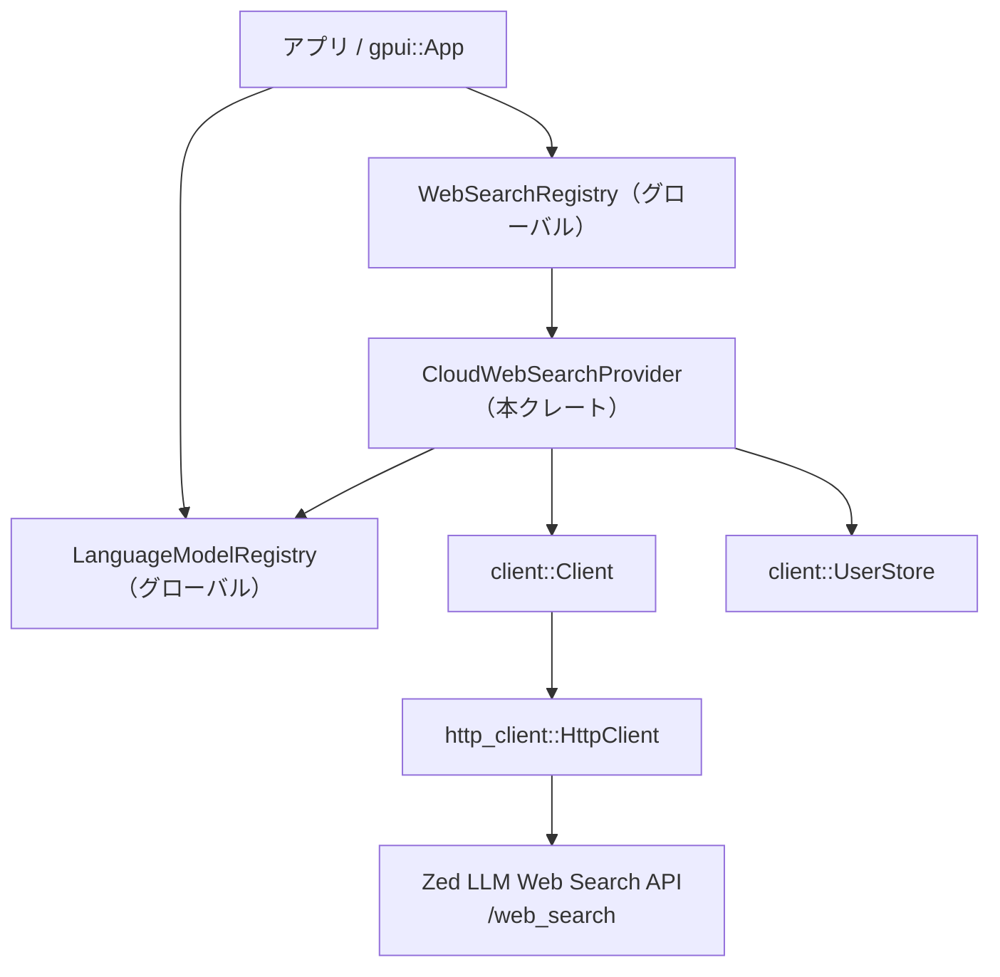
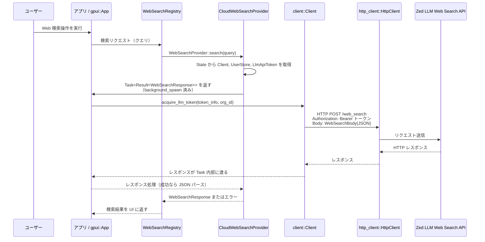

# crates/web_search_providers ディレクトリ解説

## 1. ざっくり一言

`web_search_providers` クレートは、Zed のクラウド LLM バックエンドに対する **Web 検索 API（/web_search）** を、共通の `web_search::WebSearchProvider` インターフェースとして **登録・提供するためのアダプタ** です。  
デフォルトの言語モデルが Zed 提供のものに切り替わるタイミングで、自動的に Web 検索プロバイダを登録・解除します。

---

## 2. このモジュールの役割

### 2.1 概要

このディレクトリ（クレート）は、主に次の 2 点を担います。

- Zed 全体で利用される `WebSearchRegistry` に対して、  
  **クラウド Web 検索プロバイダ（CloudWebSearchProvider）を登録・解除する初期化処理** を提供する。
- `client::Client` とクラウド LLM 用トークン (`LlmApiToken`) を利用して、  
  **HTTP 経由で `/web_search` エンドポイントを呼び出し、`WebSearchResponse` を返す WebSearchProvider 実装** を提供する。

### 2.2 アーキテクチャ内での位置づけ

このクレートは、UI ランタイム（`gpui::App`）、言語モデルレジストリ、Web 検索レジストリ、クラウド LLM HTTP API の間を橋渡しする位置にあります。



- `init` 関数が `WebSearchRegistry::global` にアクセスし、`CloudWebSearchProvider` を登録します。
- `CloudWebSearchProvider` は内部で `client::Client` と `UserStore` を保持し、  
  `cloud_llm_client::WebSearchBody/WebSearchResponse` 型を使って `/web_search` API を呼び出します。
- `LanguageModelRegistry` のデフォルトモデルが変わったときに subscription を通じてイベントを受け取り、  
  Zed 提供モデルを利用している場合のみプロバイダを有効化します。

### 2.3 設計上のポイント

コードから読み取れる設計上の特徴は次のとおりです。

- **責務分割**
  - クレートのルート（`web_search_providers.rs`）は、**レジストリとの統合と初期化処理**だけを担当します。
  - `cloud.rs` は、**実際の Web 検索処理（HTTP 呼び出しとトークン管理）**をカプセル化しています。
- **状態管理**
  - `CloudWebSearchProvider` 自体は薄いラッパで、実際の状態は `Entity<State>` として `gpui` のエンティティシステムに保持されます。
  - `State` には `Client`, `UserStore`, `LlmApiToken` が保存され、各検索時にそれを参照します。
- **エラーハンドリング**
  - HTTP 通信と JSON パースには `anyhow::Result` を利用し、コンテキスト付きのエラー（`context("...")`）を追加しています。
  - LLM トークンの期限切れに対しては `NeedsLlmTokenRefresh` を用い、**最大 3 回までトークンを再取得してリトライ**します。
  - それ以外の HTTP エラーは 1 回で失敗として扱い、レスポンスボディをエラーメッセージに含めます。
- **条件付き登録**
  - デフォルト言語モデルが Zed 提供（`is_provided_by_zed()`）の場合のみ Web 検索プロバイダを登録し、それ以外の場合は解除します。

---

## 3. 主要な機能一覧

このクレートが提供する主な機能は次のとおりです。

- `init`:  
  グローバルな `WebSearchRegistry` に対して、Zed 用 Web 検索プロバイダを登録する初期化処理。
- デフォルト言語モデル変更時の自動更新:
  - `LanguageModelRegistry` のイベントを購読し、デフォルトモデルが Zed 提供かどうかに応じて  
    `CloudWebSearchProvider` の登録／解除を自動で行う。
- `CloudWebSearchProvider`（WebSearchProvider 実装）:
  - クエリ文字列を受け取り、Zed の `/web_search` API に HTTP POST して `WebSearchResponse` を返す。
  - `UserStore` から組織 ID を取得し、組織コンテキスト付きで LLM トークンを取得・更新する。
- `perform_web_search`:
  - LLM API トークンの取得・更新と `/web_search` への HTTP リクエストを行い、結果を JSON としてパースする非公開ヘルパ関数。

---

## 4. 関数・構造体の解説

### 4.1 型一覧

このクレート内で定義されている主な型は次の 2 つです。

| 名前 | 種別 | 役割 / 用途 |
|------|------|-------------|
| `CloudWebSearchProvider` | 構造体 | `web_search::WebSearchProvider` の実装。Zed のクラウド LLM バックエンドに対して Web 検索を行うプロバイダです。内部状態は `Entity<State>` に委譲されます。 |
| `State` | 構造体 | `CloudWebSearchProvider` の内部状態を保持します。`client::Client`、`client::UserStore`、および `LlmApiToken` を持ち、検索時に利用します。 |

関連する定数:

- `ZED_WEB_SEARCH_PROVIDER_ID: &str = "zed.dev";`  
  - このプロバイダを識別する ID 文字列で、`WebSearchProviderId` に包んでレジストリに登録・解除する際に使われます。

### 4.2 主要な関数・メソッドの詳細

#### `pub fn init(client: Arc<Client>, user_store: Entity<UserStore>, cx: &mut App)`

**概要**

- グローバルな `WebSearchRegistry` を取得し、Zed 用 Web 検索プロバイダを登録する初期化処理です。
- 内部で `register_web_search_providers` を呼び出し、必要な subscription も張ります。

**引数**

| 引数名 | 型 | 説明 |
|--------|----|------|
| `client` | `Arc<Client>` | クラウド API との通信や LLM トークン管理を行うクライアント。共有のため `Arc` で渡されます。 |
| `user_store` | `Entity<UserStore>` | 現在のユーザーや組織情報を保持するエンティティ。ここから組織 ID を取得します。 |
| `cx` | `&mut App` | `gpui` アプリケーションコンテキスト。グローバルレジストリ取得やエンティティ更新に利用されます。 |

**戻り値**

- なし（`()`）。  
  `WebSearchRegistry` の内部状態を変更する副作用を持つだけです。

**内部処理の流れ**

1. `WebSearchRegistry::global(cx)` を呼んでグローバルなレジストリ（`Entity<WebSearchRegistry>`）を取得します。
2. `registry.update(cx, |registry, cx| { ... })` でレジストリを更新し、その中で `register_web_search_providers` を呼び出します。
3. `register_web_search_providers` が Zed プロバイダの登録とイベント購読をセットアップします（詳細は後述）。

**Examples（使用例）**

アプリケーション初期化コードからこのクレートを利用する例です。

```rust
use std::sync::Arc;
use client::{Client, UserStore};
use gpui::{App, Entity};
use web_search_providers::init as init_web_search_providers;

// アプリ起動時などに呼び出す
fn setup_web_search(client: Arc<Client>, user_store: Entity<UserStore>, cx: &mut App) {
    // Web 検索プロバイダをグローバルレジストリに登録する
    init_web_search_providers(client, user_store, cx);
}
```

**Errors / Panics**

- この関数自体は `Result` を返さず、明示的なエラーハンドリングは行っていません。
- 内部で利用する `WebSearchRegistry::global` や `update` が panic するかどうかは、これらの実装に依存しており、このコードからは分かりません。

**Edge cases（エッジケース）**

- `init` を複数回呼び出した場合の挙動は、このコードだけでは明確ではありません。
  - `register_web_search_providers` 内で重複登録を避ける明示的なロジックはありませんが、`WebSearchRegistry` 側でどう扱うかは不明です。

**使用上の注意点**

- `client` と `user_store` は、アプリケーションのライフタイムにわたって有効である必要があります（`CloudWebSearchProvider` 内で保持されます）。
- `init` は通常、アプリ起動時に 1 回だけ呼び出す前提で設計されていると考えられますが、厳密な制約はコードからは読み取れません。

---

#### `impl CloudWebSearchProvider { pub fn new(client: Arc<Client>, user_store: Entity<UserStore>, cx: &mut App) -> Self }`

**概要**

- `CloudWebSearchProvider` のインスタンスを作成し、その内部状態 `State` を `gpui` のエンティティとして初期化します。

**引数**

| 引数名 | 型 | 説明 |
|--------|----|------|
| `client` | `Arc<Client>` | クラウド API と通信するクライアント。 |
| `user_store` | `Entity<UserStore>` | 現在のユーザー／組織情報を保持するエンティティ。 |
| `cx` | `&mut App` | `gpui::App` コンテキスト。エンティティ生成に使用します。 |

**戻り値**

- `CloudWebSearchProvider`  
  - 内部に `Entity<State>` を保持したプロバイダインスタンスです。

**内部処理の流れ**

1. `cx.new(|cx| State::new(client, user_store, cx))` を呼び、`State` のエンティティを生成します。
2. `State::new` 内で `global_llm_token(cx)` を用いて `LlmApiToken` を取得し、`State` に保持します。
3. 生成した `Entity<State>` を `CloudWebSearchProvider { state }` に詰めて返します。

**Examples（使用例）**

このメソッドは通常クレート内部からのみ使用されます（`mod cloud;` が `pub` でないため）。  
クレート内部からの利用例（概念的な例）です。

```rust
use std::sync::Arc;
use client::{Client, UserStore};
use gpui::{App, Entity};
use crate::cloud::CloudWebSearchProvider;

// クレート内での利用例（外部クレートからは `crate::cloud` にはアクセスできません）
fn create_provider(client: Arc<Client>, user_store: Entity<UserStore>, cx: &mut App) -> CloudWebSearchProvider {
    CloudWebSearchProvider::new(client, user_store, cx)
}
```

**Errors / Panics**

- `CloudWebSearchProvider::new` 自体は `Result` を返しません。
- `State::new` 内で呼び出す `global_llm_token(cx)` の挙動（エラーや panic の可能性）は、このコードからは分かりません。

**Edge cases（エッジケース）**

- `global_llm_token(cx)` が有効なトークンを返せない場合（例えば未設定など）の挙動は不明です。
- `client` や `user_store` が不完全な状態で渡された場合、後続の検索処理で失敗する可能性があります（ただしこのコンストラクタでは検証していません）。

**使用上の注意点**

- 外部クレートからは直接 `CloudWebSearchProvider` を生成せず、通常は `init` を通じて `WebSearchRegistry` に登録されたものを利用する設計になっています（`cloud` モジュールが非公開なため）。
- `client` や `user_store` は `Arc` / `Entity` で共有されるため、ライフタイムと所有関係に注意する必要があります。

---

#### `impl WebSearchProvider for CloudWebSearchProvider { fn search(&self, query: String, cx: &mut App) -> Task<Result<WebSearchResponse>> }`

**概要**

- 与えられたクエリ文字列に対して Web 検索を行うためのエントリポイントです。
- 実際の HTTP 呼び出しは `perform_web_search` に委譲し、`gpui` のバックグラウンドタスクとして実行されます。

**引数**

| 引数名 | 型 | 説明 |
|--------|----|------|
| `query` | `String` | 検索クエリ文字列。 |
| `cx` | `&mut App` | `gpui::App` コンテキスト。エンティティ読み出しとタスク生成に利用します。 |

**戻り値**

- `Task<Result<WebSearchResponse>>`  
  - 非同期に進行するタスクハンドルで、完了時に `anyhow::Result<WebSearchResponse>` を返します。  
  - `Task` の具体的な使い方（待ち方）は `gpui` の仕様に依存し、このコードからは詳細は分かりません。

**内部処理の流れ**

1. `self.state.read(cx)` で内部状態 `State` を読み出します。
2. そこから `client`、`llm_api_token` を clone します。
3. `user_store.read(cx)` を呼び、`current_organization()` から現在の組織を取得し、その `id` を `OrganizationId` として `Option` で保持します。
4. `WebSearchBody { query }` を生成します。
5. `cx.background_spawn(async move { perform_web_search(client, llm_api_token, organization_id, body).await })` を呼び、  
   `perform_web_search` を実行するバックグラウンドタスクを起動し、その `Task` を返します。

**Examples（使用例）**

外部コードは通常 `WebSearchRegistry` 経由でこのメソッドを利用しますが、ここでは概念的な利用例を示します。

```rust
use anyhow::Result;
use gpui::App;
use web_search::WebSearchProvider; // トレイト
use crate::cloud::CloudWebSearchProvider;

// クレート内のどこかで
fn search_example(provider: &CloudWebSearchProvider, cx: &mut App) {
    // Web 検索タスクを生成
    let task = provider.search("Rust async web search".to_string(), cx);

    // `task` の待ち方や結果の取り出し方は gpui::Task の API に依存します。
    // ここでは詳細なコードは示せませんが、完了時には Result<WebSearchResponse> が得られます。
}
```

**Errors / Panics**

- `search` 自体は `Result` を返さず、エラーはタスク内の `Result<WebSearchResponse>` に反映されます。
- エラー要因の例（`perform_web_search` より）:
  - LLM トークンの取得／更新失敗。
  - HTTP リクエストの送信失敗。
  - レスポンスステータスが成功でなく、かつトークン更新対象でない場合。
  - レスポンスボディの JSON パース失敗。

**Edge cases（エッジケース）**

- `query` が空文字列でも、そのまま `WebSearchBody` に詰めて送信されます。サーバー側がどう扱うかは、このコードからは分かりません。
- `current_organization()` が `None` の場合、`organization_id` は `None` となり、そのまま `client.acquire_llm_token` 等に渡されます。  
  `None` がどう解釈されるかは `client` 側の実装に依存します。

**使用上の注意点**

- 重い処理（ネットワーク I/O）を行うため、UI スレッド上で同期的に結果を待たず、`Task` を適切に扱う必要があります。
- 検索結果は `WebSearchResponse` に依存するため、その構造に従って結果を解釈する必要があります（`cloud_llm_client` クレート参照）。

---

#### `async fn perform_web_search(client: Arc<Client>, llm_api_token: LlmApiToken, organization_id: Option<OrganizationId>, body: WebSearchBody) -> Result<WebSearchResponse>`

**概要**

- LLM API トークンを取得し、Zed の `/web_search` エンドポイントに HTTP POST して結果を取得する内部ヘルパ関数です。
- トークンが期限切れなどで無効だった場合、最大 3 回までトークンを更新してリトライします。

**引数**

| 引数名 | 型 | 説明 |
|--------|----|------|
| `client` | `Arc<Client>` | HTTP クライアントやトークン管理機能を持つクライアント。 |
| `llm_api_token` | `LlmApiToken` | 使用する LLM API の種別や設定を表すトークン情報。 |
| `organization_id` | `Option<OrganizationId>` | 現在の組織 ID。`None` の場合は組織コンテキストなしでトークン取得を行います。 |
| `body` | `WebSearchBody` | クエリ文字列などを含む Web 検索リクエストボディ。 |

**戻り値**

- `Result<WebSearchResponse>`  
  - 成功時: サーバーからの JSON レスポンスを `WebSearchResponse` にデシリアライズした値。
  - 失敗時: `anyhow::Error` に包まれたエラー。

**内部処理の流れ**

1. `const MAX_RETRIES: usize = 3;` を定義し、リトライ回数を 3 回に設定。
2. `client.http_client()` から `http_client::HttpClient` を取得。
3. `client.acquire_llm_token(&llm_api_token, organization_id.clone()).await?` で初回の LLM トークンを取得。
4. ループ開始:
   1. リトライ回数が 0 なら `"max retries exceeded"` エラーで終了。
   2. `http_client::Request::builder()` で HTTP POST リクエストを構築:
      - メソッド: `POST`
      - URI: `http_client.build_zed_llm_url("/web_search", &[])?.as_ref()`
      - ヘッダ:
        - `Content-Type: application/json`
        - `Authorization: Bearer {token}`
      - ボディ: `serde_json::to_string(&body)?` の結果文字列を `into()` でボディに変換。
   3. `http_client.send(request).await.context("failed to send web search request")?` で送信。
   4. レスポンスのステータスを判定:
      - 成功 (`is_success()` が `true`) の場合:
        - ボディを `String` に読み込み、`serde_json::from_str(&body)?` で `WebSearchResponse` にデシリアライズして返す。
      - `response.needs_llm_token_refresh()` が `true` の場合:
        - `client.refresh_llm_token(&llm_api_token, organization_id.clone()).await?` でトークンを更新。
        - `retries_remaining -= 1` してループ継続。
      - それ以外のエラーの場合:
        - ボディを `String` に読み込み、ステータスとボディ内容を含むメッセージで `anyhow::bail!` して終了。

**Examples（使用例）**

この関数は `pub` ではないため、外部から直接呼び出すことはできません。  
クレート内での概念的な利用例は、`search` メソッド内に書かれているものと同様です。

```rust
// 概念的な例（実際には CloudWebSearchProvider::search がこの関数を呼び出します）
async fn example_call(
    client: Arc<Client>,
    token: LlmApiToken,
    org: Option<OrganizationId>,
) -> anyhow::Result<WebSearchResponse> {
    let body = WebSearchBody { query: "Rust programming".to_string() };
    perform_web_search(client, token, org, body).await
}
```

**Errors / Panics**

この関数で `Err` が返り得る主なケース:

- `client.acquire_llm_token` や `client.refresh_llm_token` の失敗。
- `http_client.build_zed_llm_url` の失敗（URI 構築エラー）。
- `http_client::Request::builder().body(...)` の失敗（リクエスト構築エラー）。
- `http_client.send(request)` の失敗（ネットワークエラーなど）。
- レスポンスが成功ステータスであっても:
  - ボディの読み込み (`read_to_string`) 失敗。
  - JSON パース (`serde_json::from_str`) 失敗。
- レスポンスが成功でなく、かつ `needs_llm_token_refresh()` でもない場合:
  - ステータスとボディ内容を含むメッセージで `anyhow::bail!` します。
- トークン更新が繰り返し必要となり、`MAX_RETRIES` 回を超えた場合:
  - `"max retries exceeded"` というエラーを返します。

panic については、この関数内で明示的に `panic!` は呼んでいません。  
ただし、`anyhow::bail!` は `Err` を返すだけで panic はしません。

**Edge cases（エッジケース）**

- サーバーが成功ステータスを返しても、ボディが期待する JSON フォーマットでない場合、JSON パースエラーになります。
- `needs_llm_token_refresh()` の判定ロジックは `NeedsLlmTokenRefresh` の実装に依存しており、  
  どのステータスやレスポンスがトークン期限切れとみなされるかは、このコードからは分かりません。
- ネットワークの一時的な障害（タイムアウトなど）は、**トークン更新以外の理由のエラー**として扱われるため、  
  この関数では自動リトライされません（1 回で失敗します）。

**使用上の注意点**

- この関数は I/O を伴うため、必ず非同期コンテキストから `await` して利用する必要があります（クレート内では `background_spawn` が利用されています）。
- エラー内容にはステータスコードやレスポンスボディが含まれるため、ログに出力する際には機密情報を含んでいないか注意が必要です。

---

### 4.3 その他の関数・メソッド

主要ロジックを補助する関数・メソッドの一覧です。

| 名前 | 役割（1 行） |
|------|--------------|
| `fn register_web_search_providers(...)` | `WebSearchRegistry` に Zed プロバイダを登録し、`LanguageModelRegistry` のイベント購読をセットアップします。 |
| `fn register_zed_web_search_provider(...)` | デフォルト言語モデルが Zed 提供かどうかを判定し、それに応じてプロバイダの登録／解除を行います。 |
| `impl State { pub fn new(...) -> Self }` | `Client`, `UserStore`, `LlmApiToken` を受け取り、`State` 構造体を初期化します。 |
| `impl WebSearchProvider for CloudWebSearchProvider { fn id(&self) -> WebSearchProviderId }` | このプロバイダの ID として `"zed.dev"` を返します。 |

---

## 5. データフロー

ここでは、ユーザーが Web 検索を行ったときの代表的なデータフローを説明します。  
実際の UI コンポーネントからの呼び出しはこのクレートには現れませんが、概念的な流れは次のとおりです。

1. ユーザーがエディタ上で Web 検索をトリガーします。
2. アプリケーションは `WebSearchRegistry` を通じて適切な `WebSearchProvider`（ここでは `CloudWebSearchProvider`）を選択し、`search` を呼び出します。
3. `CloudWebSearchProvider::search` は内部状態から `Client`、`UserStore`、`LlmApiToken` を取得し、`perform_web_search` をバックグラウンドタスクで実行します。
4. `perform_web_search` が `/web_search` API を呼び出し、結果を `WebSearchResponse` として返します。
5. タスク完了時に、`Result<WebSearchResponse>` が呼び出し元（`WebSearchRegistry` または UI）へ伝達され、画面表示などに利用されます。



この図は概念的なものです。`WebSearchRegistry` の内部実装や UI への結果通知方法は、このクレートからは読み取れません。

---

## 6. 使い方（How to Use）

### 6.1 基本的な使用方法

外部からこのクレートを利用する際の主なエントリポイントは `init` 関数です。  
アプリケーション起動時に `Client` と `UserStore` を用意し、`init` を呼び出します。

```rust
use std::sync::Arc;
use client::{Client, UserStore};
use gpui::{App, Entity};
use web_search_providers::init as init_web_search_providers;

// 何らかのアプリケーション初期化関数
fn app_init(cx: &mut App) {
    // ここでは Client や UserStore の生成方法は省略します
    let client: Arc<Client> = /* 既存の Client を取得、または生成 */ unimplemented!();
    let user_store: Entity<UserStore> = /* UserStore エンティティを生成 */ unimplemented!();

    // Web 検索プロバイダをセットアップする
    init_web_search_providers(client, user_store, cx);
}
```

`init` を呼ぶことで次のような状態になります。

- `WebSearchRegistry` に Zed 用 Web 検索プロバイダが登録される（条件付き）。
- `LanguageModelRegistry` の `DefaultModelChanged` イベント購読がセットアップされる。

### 6.2 よくある使用パターン

1. **Zed 提供モデルを利用しているときだけ Web 検索を有効化**

   - 何も特別なことをしなくても、デフォルト言語モデルが Zed 提供のものに変わったときに自動でプロバイダが登録されます。
   - ユーザーが別のモデル（Zed 以外のプロバイダ）のデフォルトに切り替えた場合、自動的に `unregister_provider` が呼ばれます。

   これにより、UI 側は「Web 検索が利用可能かどうか」の判定を `WebSearchRegistry` に委ねることができます。

2. **アプリケーションの設定リロード時にも `init` を再利用**

   - 設定の再読み込みなどで `Client` や `UserStore` が再構築される場合、再度 `init` を呼ぶパターンが考えられます。
   - このときの重複登録などの挙動は `WebSearchRegistry` の実装によりますが、コード上では特別なガードは設けられていません。

### 6.3 使用上の注意点（まとめ）

- **前提条件**
  - `client::Client` は LLM トークンの取得／更新や `http_client::HttpClient` へのアクセスが正しく行える状態である必要があります。
  - `UserStore` は現在の組織情報を提供できる前提で用いられていますが、`current_organization()` が `None` でも処理は進みます。その場合の挙動は `Client` 側に依存します。

- **ネットワーク／エラー処理**
  - Web 検索は HTTP を介して外部サービスにアクセスするため、ネットワークエラーやサーバーエラーが発生し得ます。
  - トークン期限切れとみなされた場合のみ自動リトライ（最大 3 回）が行われ、それ以外のエラーは即座に失敗として扱われます。
  - 呼び出し側（`WebSearchRegistry` や UI）は、`Result<WebSearchResponse>` のエラーを適切にユーザーへフィードバックする必要があります。

- **パフォーマンス**
  - レスポンスボディを `String` に全読み込みしたあと `serde_json::from_str` でデシリアライズしているため、レスポンスが非常に大きい場合にはメモリ使用量が増えます。
  - 呼び出し自体はバックグラウンドタスクで行われるため UI スレッドをブロックしませんが、タスク数が増えすぎると全体の帯域やクラウド API のレート制限に影響する可能性があります。

- **セキュリティ／ログ**
  - エラー時にはレスポンスボディを含めた詳しいメッセージが生成されるため、ログへの出力時には機密情報を含まないか注意が必要です。

---

## 7. 関連ファイル

このディレクトリ内および密接に関係するファイルは次のとおりです。

| パス | 役割 / 関係 |
|------|------------|
| `web_search_providers/Cargo.toml` | クレート名・バージョン・ライセンス、および依存クレート（`client`, `cloud_llm_client`, `web_search`, `gpui` など）を定義します。 |
| `web_search_providers/src/web_search_providers.rs` | クレートのルートファイル。`init` 関数を公開し、`WebSearchRegistry` と `LanguageModelRegistry` を用いたプロバイダの登録・解除ロジックを定義します。 |
| `web_search_providers/src/cloud.rs` | `CloudWebSearchProvider` と内部状態 `State`、および `perform_web_search` を定義し、実際の HTTP ベースの Web 検索処理を実装します。 |

このクレートは、以下の外部クレートとも密接に関連しています（定義はこのチャンクには含まれません）。

- `client` クレート: `Client`, `UserStore`, トークン取得／更新 API、`NeedsLlmTokenRefresh` などを提供。
- `cloud_llm_client` クレート: `WebSearchBody`, `WebSearchResponse` など、Web 検索 API のペイロード型を提供。
- `web_search` クレート: `WebSearchProvider`, `WebSearchProviderId`, `WebSearchRegistry` など、Web 検索の共通インターフェースとレジストリ機構を提供。
- `language_model` クレート: `LlmApiToken`, `LanguageModelRegistry`, および `is_provided_by_zed()` などを提供。

これらの外部クレートの詳細な実装はこのチャンクには含まれていないため、本レポートでは利用されているインターフェースの範囲でのみ説明しています。
