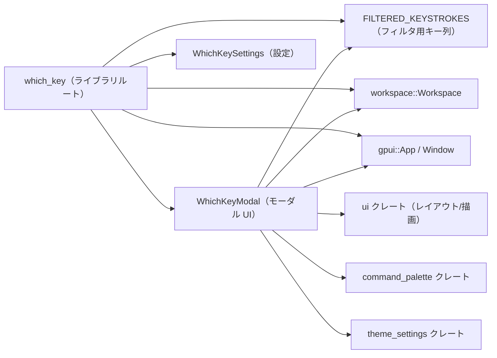
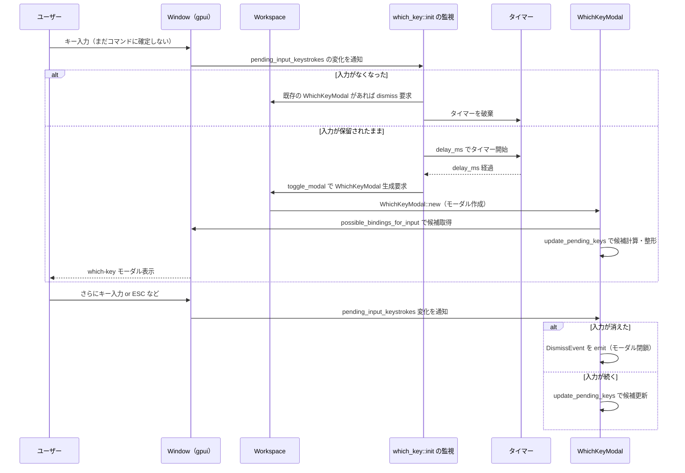

## 1. ざっくり一言

Zed エディタのキーボード入力を監視し、「今押しているキー列に続く可能なキーバインド候補」をポップアップ（モーダル）で表示する which-key 風機能と、その設定・初期化を提供するクレートです。

---

## 2. このモジュールの役割

### 2.1 概要

- このクレートは、ユーザーがキーボードショートカットの続きが思い出せないときに、入力途中のキー列に対して「続きのキー候補と対応アクション」を一覧表示するために存在します。
- アプリケーション全体（`gpui::App`）に対して監視処理を登録し、一定時間キー入力が保留状態のままなら、`WhichKeyModal` モーダルを開きます。
- モーダル側では、ウィンドウに登録されているキーバインドから候補を列挙し、フィルタ・グルーピング・ソートを行って見やすく表示します。
- 有効・無効と表示遅延時間（ミリ秒）は `WhichKeySettings` 経由で設定できます。

### 2.2 アーキテクチャ内での位置づけ

クレート内外の主なコンポーネントの関係を簡略化して示します。



- `which_key::init` がエントリポイントで、`gpui::App` に対して監視を登録します。
- 監視から `Workspace` と `Window` にアクセスし、必要に応じて `WhichKeyModal` を `Workspace` のモーダルとして開きます。
- `WhichKeyModal` は UI 周りの型（`ui` クレート）やテーマ情報（`ThemeSettings`）、コマンド名の整形（`command_palette::humanize_action_name`）と連携します。
- キー列のフィルタには、ライブラリルートに定義された `FILTERED_KEYSTROKES` が使われます。
- 設定値の取得は `WhichKeySettings` 経由で行われます。

### 2.3 設計上のポイント

コードから読み取れる特徴は次のとおりです。

- **責務分割**
  - `which_key.rs`  
    - 初期化 (`init`) と、フィルタ用のキー列定数 `FILTERED_KEYSTROKES` を提供します。
  - `which_key_modal.rs`  
    - which-key モーダルの状態管理・候補計算・描画など UI 関連の処理をまとめています。
  - `which_key_settings.rs`  
    - 設定ストレージ (`SettingsContent`) から `WhichKeySettings` 構造体を構築するロジックのみを担います。
- **状態管理**
  - `WhichKeyModal` は、フォーカス・スクロール位置・候補一覧・入力中キー列・購読ハンドル（サブスクリプション）といった UI 状態を保持します。
  - ライブラリルートの `init` 自体は状態を持たず、監視を登録するだけです。
- **イベント駆動**
  - `cx.observe_new` で新しい `Workspace` の生成を監視し、各ウィンドウごとに `cx.observe_pending_input` でキー入力の保留状態を監視します。
  - モーダル側でも `cx.observe_pending_input` を購読し、入力中のキー列が変化するたびに候補一覧を更新します。
- **非同期と遅延表示**
  - `background_executor().timer` による非同期タイマーで、「入力が一定時間保留されている場合にだけモーダルを表示する」という振る舞いを実現しています。
- **フィルタとグルーピング**
  - `FILTERED_KEYSTROKES` で「which-key に出してもノイズになるキー列」を除外します。
  - `group_bindings` で、同じ 1 キーから始まる複数の候補を `"+N keybinds"` という 1 行にまとめ、一覧を圧縮します。

---

## 3. 主要な機能一覧

このクレートが提供する主な機能です。

- **which-key 機能の初期化**  
  - `init(&mut App)` でアプリケーションに監視処理とモーダル表示ロジックを登録します。
- **入力保留中のキーストローク監視**
  - `Window::pending_input_keystrokes` を監視し、キー列が保留状態の時だけ which-key モーダルを表示します。
- **キーバインド候補の取得と整形**
  - `Window::possible_bindings_for_input` から候補を取得し、未入力の残りのキー列とアクション名に変換します。
- **フィルタリング**
  - `FILTERED_KEYSTROKES` に登録されたキー列を接頭辞に持つ候補を which-key 表示から除外します。
- **候補のグルーピング**
  - `group_bindings` で、同じ最初の 1 キーから始まる複数候補をまとめて `"+N keybinds"` として表示します。
- **モーダル UI の描画**
  - 入力済みキー列のタイトル＋「キー列列」と「アクション名列」の 2 カラムで候補を表示し、必要に応じてスクロールバーを付けます。
  - ステータスバーの高さを考慮して、モーダル位置を調整します。
- **設定の読み込み**
  - `WhichKeySettings` により、`enabled`（有効/無効）と `delay_ms`（表示までの遅延時間）を設定コンテンツから読み込みます。

---

## 4. 関数・構造体の解説

### 4.1 型・定数一覧

| 名前 | 種別 | 可視性 | 役割 / 用途 |
|------|------|--------|-------------|
| `WhichKeyModal` | 構造体 | crate 内（`which_key_modal` モジュールは非公開） | which-key のモーダル UI と、その内部状態（候補一覧・入力中キー列など）を保持します。 |
| `WhichKeySettings` | 構造体 | crate 内（`which_key_settings` モジュールは非公開） | which-key 機能の設定（有効フラグと遅延時間）を表現します。 |
| `FILTERED_KEYSTROKES` | `static LazyLock<Vec<Vec<Keystroke>>>` | `pub` | which-key 表示から除外するキー列パターンの一覧です。各要素は 1 つの「キー列」（複数の `Keystroke`）です。 |

※ `SharedString` などの型は外部クレート由来で、このチャンクには定義がありません。

---

### 4.2 主要な関数・メソッド

#### 4.2.1 `init(cx: &mut App)`

**概要**

アプリケーション起動時に呼ばれる初期化関数です。which-key 用設定の登録と、各 `Workspace` / `Window` に対する「入力保留状態の監視」と「モーダル表示タイマー」のセットアップを行います。

**引数**

| 引数名 | 型 | 説明 |
|--------|----|------|
| `cx` | `&mut App` | アプリケーション全体のコンテキストです。監視登録や非同期タスク生成に使われます。 |

**戻り値**

- なし（`()`）。副作用として監視と設定登録を行います。

**内部処理の流れ**

1. `WhichKeySettings::register(cx)` を呼び出し、which-key 用の設定スキーマをアプリケーションに登録します。  
   （`RegisterSetting` の派生によるメソッドで、実装詳細はこのチャンクにはありません。）
2. `cx.observe_new(|_: &mut Workspace, window, cx| { ... })` を登録し、新しい `Workspace` が作られるたびにコールバックが実行されるようにします。
3. コールバック内で `window` が存在しない場合は何もせず終了します。
4. 各ウィンドウに対して `cx.observe_pending_input(window, move |workspace, window, cx| { ... })` を登録し、保留中のキー入力が変化したときに呼ばれるハンドラを設定します。
5. ハンドラ内では:
   - `window.pending_input_keystrokes()` が `None` の場合
     - 既に表示中の `WhichKeyModal` があれば `dismiss` させる。
     - 表示待ちのタイマー（`timer`）を破棄して終了。
   - `Some(pending)` の場合
     - `WhichKeySettings::get_global(cx)` から設定を取得し、`enabled` が `false` なら何もせず終了。
     - `delay_ms` を読み取り、その時間後に実行されるタイマー付き非同期タスクを `cx.spawn_in(window, async move |workspace_handle, cx| { ... })` で起動します。
     - タスクは `background_executor().timer` で `delay_ms` ミリ秒待った後、`workspace_handle.update_in` で UI スレッドに戻り、まだ `WhichKeyModal` が開いていなければ `workspace.toggle_modal` で新しいモーダルを開きます。
6. それぞれの監視は `.detach()` され、ハンドルを保持せずにライフタイム管理をフレームワークに任せています。

**Errors / Panics**

- `workspace_handle.update_in(...).log_err()` でエラーは `util::ResultExt` の `log_err` に渡されており、失敗してもパニックせずログに記録されるだけと解釈できますが、詳細な挙動は `ResultExt` の実装に依存します。
- 他に `unwrap` などは使っていないため、この関数自身から直接のパニックは発生しません。

**Edge cases（エッジケース）**

- **ウィンドウが存在しない Workspace**  
  `window` が `None` の場合は監視を登録せずに終了します。
- **pending_input_keystrokes が `None`**  
  入力が確定した、もしくはキャンセルされたときに `None` となり、その時点で which-key モーダルは自動的に閉じられ、タイマーも破棄されます。
- **短時間にキー入力が繰り返される場合**  
  コード上、以前に起動したタイマーをキャンセルしてはいません（`timer.replace(...)` の戻り値は捨てています）。  
  ただしモーダル表示時には `workspace.active_modal::<WhichKeyModal>(cx).is_some()` をチェックし、既に表示中なら新規表示を行わないため、多重表示は防がれています。

**使用上の注意点**

- `init` はアプリケーション起動時に一度だけ呼び出す前提で設計されているように見えます。複数回呼び出すと、`observe_new` が重複登録される可能性があります（このクレート内には重複防止の仕組みは見当たりません）。
- which-key 機能を完全に無効化したい場合は、コードではなく設定（`WhichKeySettings`）の `enabled` を `false` にする想定です。

**使用例（簡略）**

```rust
use gpui::App;                 // App コンテキスト
use which_key::init;           // which-key の初期化関数

fn setup(app: &mut App) {      // アプリ側のセットアップ関数の一例
    init(app);                 // which-key 機能を登録する
    // 他のプラグインや機能の初期化...
}
```

---

#### 4.2.2 `WhichKeyModal::new(workspace: WeakEntity<Workspace>, window: &mut Window, cx: &mut Context<Self>) -> Self`

**概要**

which-key モーダルのインスタンスを生成し、現在のフォーカス位置とキー入力監視、フォーカスアウト監視をセットアップします。生成時点で一度 `update_pending_keys` を呼び出して初期候補を計算します。

**引数**

| 引数名 | 型 | 説明 |
|--------|----|------|
| `workspace` | `WeakEntity<Workspace>` | モーダルを所有している `Workspace` への弱参照です。ステータスバーの表示状態の取得などに利用します。 |
| `window` | `&mut Window` | モーダルが属するウィンドウです。キー入力やビューサイズの情報を取得します。 |
| `cx` | `&mut Context<Self>` | モーダル自身のコンテキストで、サブスクリプション登録やフォーカスハンドル取得などに使います。 |

**戻り値**

- 初期化された `WhichKeyModal` インスタンス。

**内部処理の流れ**

1. `window.focused(cx)` で現在フォーカスされている要素の `FocusHandle` を取得し、存在しない場合は `cx.focus_handle()`（モーダル自身？）を代わりに使用します。
2. `cx.weak_entity()` から自分自身の `WeakEntity<WhichKeyModal>` を取得します（`handle` 変数）。
3. 構造体フィールドを初期化します。
   - `_workspace` に引数の `workspace` を保存。
   - `focus_handle` に 1. で取得したフォーカスハンドルを保存。
   - `scroll_handle` を `ScrollHandle::new()` で初期化。
   - `bindings` は空の `Vec`。
   - `pending_keys` は空文字列。
   - `_pending_input_subscription` には `cx.observe_pending_input(window, |this, window, cx| { this.update_pending_keys(window, cx); })` を登録し、「入力保留状態が変化するたびに `update_pending_keys` が呼ばれる」ようにします。
   - `_focus_out_subscription` には `window.on_focus_out(&focus_handle, ...)` を登録し、「フォーカスがモーダル生成時のフォーカス位置から外れたら `DismissEvent` を emit する」ようにします。
4. 最後に `this.update_pending_keys(window, cx)` を 1 回呼び出し、生成直後の保留入力に基づいて候補一覧を計算します。

**Edge cases**

- 生成時点で `window.pending_input_keystrokes()` が `None` の場合、`update_pending_keys` 内で即座に `DismissEvent` が emit されるため、モーダルは実質的にすぐ閉じる挙動になります。
- `window.focused(cx)` が `None` のときは `cx.focus_handle()` がフォールバックとして使われます。どの要素に対応するかはこのチャンクからは分かりません。

**使用上の注意点**

- 通常はクレート外から直接 `WhichKeyModal::new` を呼び出すことはなく、`Workspace::toggle_modal` 経由で利用されます（実際に呼び出しているのは `which_key::init` 内のクロージャです）。
- `WhichKeyModal` のモジュール (`which_key_modal`) は非公開のため、クレート外からはこの型を直接参照できません。

---

#### 4.2.3 `fn update_pending_keys(&mut self, window: &mut Window, cx: &mut Context<Self>)`

**概要**

現在の保留中キー列に基づいて which-key の候補一覧を更新する内部メソッドです。候補の取得 → フィルタ → 残りキー列の算出 → グルーピング → ソート → テキスト化、という一連の処理を行います。

**引数**

| 引数名 | 型 | 説明 |
|--------|----|------|
| `window` | `&mut Window` | 保留中のキー列とキーバインド候補の問い合わせに使用します。 |
| `cx` | `&mut Context<Self>` | `text_for_keystrokes` など UI 側ユーティリティの呼び出しに利用します。 |

**戻り値**

- なし（`self` の `pending_keys` と `bindings` を更新します）。

**内部処理の流れ**

1. `window.pending_input_keystrokes()` で現在の保留中キー列を取得。
   - `None` の場合は `cx.emit(DismissEvent)` を呼び、モーダルを閉じるシグナルを送って終了します。
2. `window.possible_bindings_for_input(pending_keys)` で、「このキー列にマッチしうるキーバインド」の一覧を取得します。
3. 各バインディングを `(Vec<Keystroke>, action)` に変換します。
   - `keystrokes()` でバインディング全体のキー列を取得し、各 `Keystroke` の `inner()` をコピーして `Vec<Keystroke>` を作成。
   - `action()` で対応するアクションオブジェクトを得ます。
4. フィルタリング:
   - `FILTERED_KEYSTROKES` に含まれるキー列を「先頭から持つ」バインディングは除外します。  
     具体的には、任意の `filtered` について「`keystrokes` の長さが `filtered` 以上、かつ先頭 `filtered.len()` 要素が完全一致」の場合に除外します。
5. 残ったバインディングごとに:
   - すでに押されているキー数 `pending_keys.len()` 分だけスキップし、残りのキー列 `remaining_keystrokes` を計算します。
   - `command_palette::humanize_action_name(action.name())` でアクション名を人間向けのラベルに変換し、`SharedString` に変換します。
6. `group_bindings` に渡して、同じ先頭キーを持つ複数バインディングのグルーピングを行います。
7. グルーピング後の結果をソートします。
   - まず `action_name` が `'+'` で始まる（グループ）かどうかで、非グループを先に、グループを後にします。
   - 次にキー列の長さ（`keystrokes.len()`）で昇順ソートします。
   - さらに `text_for_keystrokes` でテキスト化した長さで比較し、最後に文字列として辞書順比較を行います。
8. `binding_data.dedup()` で重複エントリを削除します（隣接要素の完全一致のみ削除されますが、ソート済みなので同一のものは隣り合うと期待されています）。
9. `self.pending_keys` を `text_for_keystrokes(&pending_keys, cx)` の結果で更新します。
10. `self.bindings` を `binding_data` から `Vec<(SharedString, SharedString)>` に変換します。
    - キー列側は `text_for_keystrokes(&keystrokes, cx)` でテキストに変換します。

**Edge cases**

- `possible_bindings_for_input` が空のベクタを返した場合、`bindings` は空になり、モーダルにはタイトルだけが表示されます（`render` 側で `has_rows` を確認しているため）。
- `pending_keys.len()` が各バインディングの全キー列長と同じ、もしくはそれより大きい場合の挙動は、`possible_bindings_for_input` の仕様に依存します。この関数では単純に `keystrokes[pending_keys.len()..]` でスライスしていますので、前提として「候補は常に `pending_keys` を接頭辞として持つ」ことが期待されています。

**使用上の注意点**

- このメソッドは `WhichKeyModal` の内部でのみ呼び出され、外部 API として利用することは想定されていません。
- フィルタ対象のキー列を増減したい場合は、`FILTERED_KEYSTROKES` 側を変更する必要があります（ランタイムでの動的変更はありません）。

---

#### 4.2.4 `impl Render for WhichKeyModal { fn render(&mut self, window: &mut Window, cx: &mut Context<Self>) -> impl IntoElement }`

**概要**

モーダルの見た目とレイアウトを定義するメソッドです。入力済みキー列をタイトル行に表示し、その下に「残りのキー列」と「アクション名」を左右 2 カラムで表示します。ステータスバーの高さに応じて画面下部の位置を調整し、縦方向のスクロールにも対応します。

**主な処理内容**

- ビューポートサイズからモーダルの最大幅・最大高さを決定し、画面幅の 50% / 高さの 40% を上限とします（ただし最大幅は 480px）。
- `Workspace` の `status_bar_visible(cx)` を確認し、ステータスバーが表示されている場合は、その高さ＋マージン分だけモーダルを上に押し上げます。
- タイトル領域:
  - 現在の `pending_keys` を `Label` で強調表示（`FontWeight::MEDIUM`, `Color::Accent`）。
  - 候補行が存在する場合は、その下に `Divider` を表示します。
- コンテンツ領域:
  - 左カラム: `bindings` の各キー列を右寄せで表示（`Color::Accent`）。
  - 右カラム: `bindings` の各アクション名を表示。アクション名が `'+'` で始まる（グループ）場合は `Color::Success`、それ以外は `Color::Default` で表示し、1 行に収まらない場合はトリミングします。
  - 全体に `overflow_y_scroll()` と `vertical_scrollbar_for(&self.scroll_handle, ...)` を設定し、行数が多い場合はスクロール可能にします。
- 位置決め:
  - `absolute().bottom(bottom_offset).right(px(16.))` により、画面右下寄りに浮かぶパネルとして表示します。
  - `min_w(px(220.))` と `max_w(max_panel_width)` で最小/最大幅を制限します。
  - `elevation_3(cx)` で背景から浮き上がるようなスタイルを適用しているように見えます（詳細は UI クレートに依存します）。

**Edge cases**

- `self.bindings` が空の場合は、タイトル行のみが表示され、候補リスト部分はレンダリングされません（`.when(has_rows, |el| { ... })`）。
- `_workspace.upgrade()` に失敗した場合（`Workspace` が破棄されているなど）は、ステータスバー分のオフセットは 0 として扱われます（`unwrap_or(px(0.))`）。

**使用上の注意点**

- `render` はフレームワーク（gpui）によって呼ばれる前提であり、外部から直接呼び出すことはありません。
- レイアウトや色などを変更したい場合は、このメソッドを編集する必要があります。UI コンポーネントは `ui` クレートの fluent なビルダーインターフェースを利用しているため、その API 仕様に従う必要があります。

---

#### 4.2.5 `fn group_bindings(binding_data: Vec<(Vec<Keystroke>, SharedString)>) -> Vec<(Vec<Keystroke>, SharedString)>`

**概要**

同じ先頭キーから始まる複数の候補エントリをまとめて 1 行の「グループ」表示（`"+N keybinds"`）に変換する関数です。候補数が多くなりすぎるのを防ぐための加工用ユーティリティです。

**引数**

| 引数名 | 型 | 説明 |
|--------|----|------|
| `binding_data` | `Vec<(Vec<Keystroke>, SharedString)>` | 「残りのキー列」と「アクション名」からなる候補一覧です。ここでは、すでに「入力済みキー列」は取り除かれている前提です。 |

**戻り値**

- グルーピング後の候補一覧。  
  - 先頭キーが同じで、かつ複数存在するグループは `[(first_key), "+{count} keybinds"]` の 1 エントリにまとめられます。
  - それ以外の候補は入力と同じ形でそのまま返されます。

**内部処理の流れ**

1. `HashMap<Option<Keystroke>, Vec<(Vec<Keystroke>, SharedString)>>` を用意し、「先頭キー（`Some(Keystroke)`） or 先頭キーなし（`None`）」ごとに候補をグルーピングします。
2. 各候補 `(remaining_keystrokes, action_name)` について、`remaining_keystrokes.first().cloned()` をキーとしてマップに追加します。
3. グループごとに以下を行います。
   - `group_bindings.dedup_by_key(|(keystrokes, _)| keystrokes.clone())` で、同じ残りキー列を持つ重複エントリを除去します。
   - `first_key` が `Some()` かつ `group_bindings.len() > 1` の場合:
     - そのグループは「複数候補がある 1 キー」とみなし、`vec![first_key]` と `format!("+{} keybinds", count)` を 1 つのエントリとして `result` に追加します。
   - それ以外（先頭キーがない、または 1 件のみ）の場合:
     - そのグループの全候補を `result` にそのまま追加します。
4. 最終的な `result` を返します。

**Edge cases**

- `remaining_keystrokes` が空の候補（`Vec` 長さ 0）の場合は `first_key` が `None` となり、グルーピング対象にはなりません（個別候補として残ります）。
- あるキーに紐づく候補が 1 つだけの場合もグルーピングはされず、そのまま個別表示されます。

**使用上の注意点**

- この関数は which-key モーダルの内部でのみ使用されます。グループ表示のテキストは英語固定（`"+{} keybinds"`）であり、ローカライズはこの関数では行われていません。

**簡単なイメージ例（擬似コード）**

```rust
use gpui::Keystroke;

// 疑似的なキー列（実際には Keystroke::parse などで生成）
let a = Keystroke::parse("a").unwrap();
let b = Keystroke::parse("b").unwrap();

let data = vec![
    (vec![a],           "Action A".into()),
    (vec![a, b],        "Action A then B".into()),
    (vec![b],           "Action B".into()),
];

let grouped = group_bindings(data);
// grouped の中身（概念的なイメージ）
// - "a" から始まる候補が 2 つあるため: (["a"], "+2 keybinds")
// - "b" だけの候補はそのまま:       (["b"], "Action B")
```

---

#### 4.2.6 `impl Settings for WhichKeySettings { fn from_settings(content: &SettingsContent) -> Self }`

**概要**

アプリケーション全体の設定コンテンツ (`SettingsContent`) から `WhichKeySettings` を構築するメソッドです。which-key 関連の設定箇所（`which_key` セクション）から `enabled` と `delay_ms` を取り出します。

**引数**

| 引数名 | 型 | 説明 |
|--------|----|------|
| `content` | `&SettingsContent` | アプリケーション全体の設定オブジェクトです。`content.which_key` フィールドに which-key 用設定が格納されている前提です。 |

**戻り値**

- `WhichKeySettings`  
  - `enabled`: which-key 機能を有効にするかどうか。  
  - `delay_ms`: モーダルを表示するまでの遅延（ミリ秒）。

**内部処理の流れ**

1. `let which_key: &WhichKeySettingsContent = content.which_key.as_ref().unwrap();`
   - `content.which_key` が `Some` であることを前提に `unwrap` しています。
   - `WhichKeySettingsContent` 型の詳細はこのチャンクにはありません。
2. `enabled: which_key.enabled.unwrap(),`
   - `which_key.enabled` が `Some(bool)` であることを前提に `unwrap` しています。
3. `delay_ms: which_key.delay_ms.unwrap(),`
   - 同様に、`which_key.delay_ms` が `Some(u64)` であることを前提に `unwrap` しています。

**Errors / Panics**

- 次の条件でパニックが発生します。
  - `content.which_key` が `None` の場合。
  - `which_key.enabled` または `which_key.delay_ms` が `None` の場合。
- これらは「設定が必須であり、欠けていてはならない」という前提条件をコードで表していると解釈できます。

**Edge cases**

- 設定ファイルに which-key セクションが存在しない場合や、`enabled` / `delay_ms` が明示されていない場合は、起動時または設定読み込み時にパニックとなる可能性があります。
- デフォルト値によるフォールバック処理はこの実装には含まれていません。

**使用上の注意点**

- 設定を変更する際は、`enabled` と `delay_ms` を必ず設定する必要があります。  
  実際の設定ファイルの書き方は `settings` クレート側の仕様に依存するため、このチャンクからは分かりません。

---

#### 4.2.7 `fn dismiss(&self, cx: &mut Context<Self>)`

**概要**

`DismissEvent` を emit するだけの薄いラッパーメソッドです。モーダルを閉じてもらうためのシグナルをフレームワークに送ります。

**引数 / 戻り値**

- 引数:
  - `cx: &mut Context<Self>` — イベント送信に利用するコンテキスト。
- 戻り値:
  - なし。副作用として `DismissEvent` が発火します。

**使用上の注意点**

- 実際のモーダル閉鎖処理は `EventEmitter<DismissEvent>` の実装と、周辺フレームワーク（`Workspace` / `gpui`）側に委ねられています。

---

### 4.3 その他の要素

- **`FILTERED_KEYSTROKES`**

  - ハードコードされたキー列文字列（例: `"g j"`, `"ctrl-w ctrl-a"` など）を `Keystroke::parse` でパースし、成功したものだけを `Vec<Vec<Keystroke>>` として保持します。
  - 文字列のパースに失敗した場合は、そのエントリは単に無視されます（エラーは表に出ません）。
  - `WhichKeyModal::update_pending_keys` のフィルタリングで、「このベクタのいずれかを接頭辞にもつキー列」を候補一覧から除外するために使われます。

---

## 5. データフロー

ここでは、「ユーザーがキーを押してから which-key モーダルが表示されるまで」の典型的な流れを示します。

### 5.1 シーケンス図



### 5.2 要点

- which-key モーダルが表示されるのは「キー入力が pending 状態のまま `delay_ms` ミリ秒経過した」場合のみです。
- モーダル表示後も、ユーザーがキー入力を続けると `update_pending_keys` が呼び出され、候補一覧がリアルタイムに更新されます。
- 入力がキャンセルされたり確定したりすると `pending_input_keystrokes()` が `None` になり、その時点でモーダルは閉じられます。
- フォーカスがモーダル生成時のフォーカス位置から外れたときにも `DismissEvent` が emit され、モーダルが閉じられます。

---

## 6. 使い方（How to Use）

### 6.1 基本的な使用方法

1. **アプリケーション起動時に `which_key::init` を呼ぶ**

   アプリケーション側の初期化コードの中で、`gpui::App` のミュータブル参照を渡して `init` を呼び出します。

```rust
use gpui::App;         // フレームワークの App 型
use which_key::init;   // which-key の初期化関数

fn setup(app: &mut App) {
    // which-key 機能を登録
    init(app);

    // ここで Workspace や他機能の初期化を続ける...
}
```

2. **設定で有効化・遅延時間を指定**

   - `WhichKeySettings` は `Settings` を実装しており、`enabled: bool` と `delay_ms: u64` を持ちます。
   - 実際の設定ファイルや UI での変更方法は `settings` クレート側に依存しているため、このチャンクからは分かりませんが、少なくとも次の 2 つの値が必要です。
     - `enabled`: `true` なら which-key 機能が有効になります。
     - `delay_ms`: キー入力が保留状態になってからモーダルを表示するまでの遅延（ミリ秒）。

3. **ユーザーがキー入力すると、delay 後にモーダルが表示される**

   - 有効化されていれば、`delay_ms` ミリ秒後に which-key モーダルが表示され、残りのキー候補とアクション名が一覧されます。

### 6.2 よくある使用パターン

このクレートは主に内部ワイヤリングと UI を提供するため、アプリ側で取り得るパターンは主に「設定値の調整」となります。

- **which-key を完全に無効化する**
  - `WhichKeySettings.enabled` を `false` に設定すると、`init` 内でのチェックにより一切モーダルが表示されなくなります。
- **表示遅延の調整**
  - `WhichKeySettings.delay_ms` を小さな値（例: 150 ms 程度）にすると、キーを少し止めただけですぐ which-key モーダルが出るようになります。
  - 大きな値にすると、意図しないポップアップ表示を減らせますが、その分ヘルプとしての即時性は下がります。
- **フィルタ対象のカスタマイズ（ライブラリコードを編集する場合）**
  - `"g j"` や `"ctrl-w ctrl-a"` など、which-key に出してもノイズになりやすいキー列は `FILTERED_KEYSTROKES` の配列で定義されています。
  - このリストに新しいキー列文字列を追加することで、「特定のキー列から始まる候補を一覧から除外する」ことができます。  
    （ライブラリ利用者としてではなく、このクレート自体を編集する場合の話です。）

### 6.3 使用上の注意点

- **`init` を複数回呼ばない**
  - このクレート内には「既に初期化済みかどうか」を判定する保護ロジックはありません。  
    複数回呼び出すと `observe_new` や `observe_pending_input` が重複登録される可能性があります。
- **設定値の必須性**
  - `WhichKeySettings::from_settings` では `content.which_key` とその中の `enabled`, `delay_ms` を `unwrap` しています。  
    これらが未設定の場合はパニックになるため、設定側で必ず値を用意する必要があります。
- **キー列フィルタの静的性**
  - `FILTERED_KEYSTROKES` は静的な定数であり、実行時に変更する手段はありません。  
    フィルタを変えたい場合はソースコードを変更する必要があります。
- **非同期タイマーの挙動**
  - 短時間に何度もキー入力が発生すると、複数の非同期タイマーが同時に走る可能性があります。  
    ただし、モーダルは「既に表示されている場合は何もしない」ようになっているため、多重表示にはなりません。
- **フォーカスの扱い**
  - モーダルは「生成時点のフォーカスハンドル」を覚えており、そのフォーカスが外れたときに自動的に閉じます。  
    そのため、フォーカス移動を多用する環境ではモーダルが早めに閉じることがあります。

---

## 7. 関連ファイル

このディレクトリ内のファイルと役割の一覧です。

| パス | 役割 / 関係 |
|------|------------|
| `which_key/Cargo.toml` | `which_key` クレートのメタデータと依存関係を定義します。ライブラリのエントリポイントは `src/which_key.rs` に指定されています。 |
| `which_key/src/which_key.rs` | クレートのルートモジュールです。which-key 機能の初期化関数 `init` と、フィルタ用定数 `FILTERED_KEYSTROKES` を定義し、モーダル・設定モジュールを内部モジュールとして宣言します。 |
| `which_key/src/which_key_modal.rs` | which-key のモーダル UI 実装です。`WhichKeyModal` 構造体、候補計算ロジック（`update_pending_keys`、`group_bindings`）、および描画ロジック（`Render` 実装）を含みます。 |
| `which_key/src/which_key_settings.rs` | which-key 機能の設定構造体 `WhichKeySettings` と、その `Settings` 実装を提供します。設定コンテンツ (`SettingsContent`) から `enabled` と `delay_ms` を読み出します。 |

このチャンクには、`gpui` や `workspace`、`settings` など他クレートの実装は含まれていないため、それらの API の詳細は外部ドキュメントに依存します。
