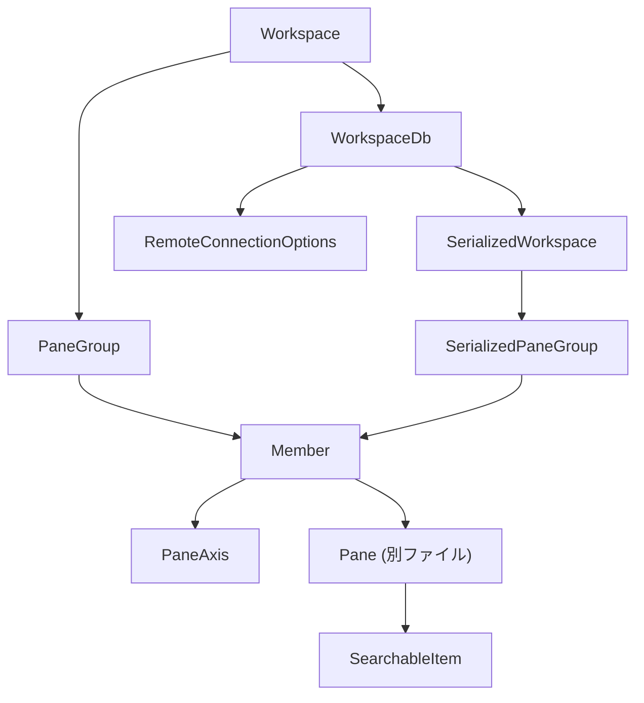
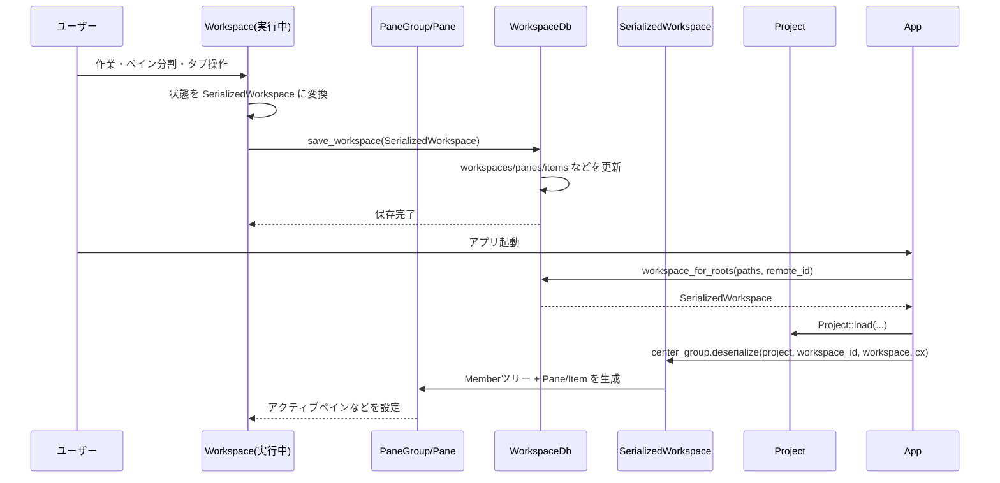
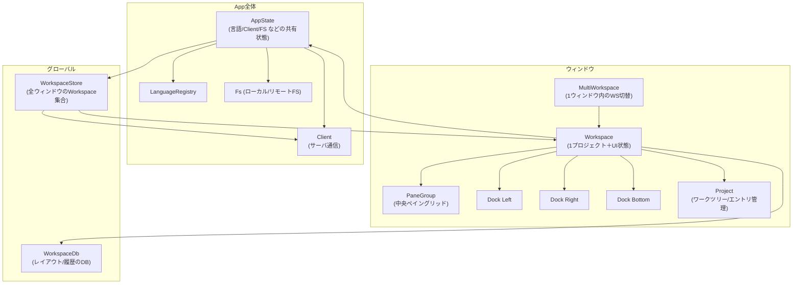
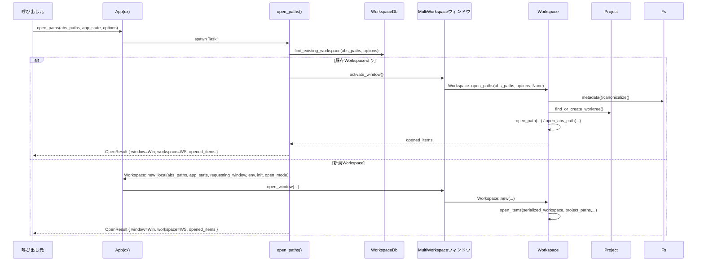

このチャンクに含まれているコードは、`workspace` クレートの中核的な UI／状態管理コンポーネントの定義になっています。

- `active_file_name.rs`  
  ステータスバーに「アクティブなファイル名」を表示する小さなビューです。`StatusItemView` を実装し、アクティブな `ItemHandle` からパス情報を取り出してボタンとして描画します。

- `dock.rs`  
  画面の左右・下に表示される「ドックパネル」（プロジェクトツリーやターミナルなどを入れるサイドバー的な領域）を管理するコンポーネントです。  
  - `Panel` トレイト: 任意のパネルが満たすべきインターフェース（位置・サイズ・アイコン・ズーム状態など）を定義  
  - `PanelHandle`: 実際の `Entity<T: Panel>` を抽象化して操作するためのハンドル  
  - `Dock`: 複数のパネルを並べ、アクティブパネルの切り替え・ズーム・サイズリサイズ・位置変更・永続化（`DockData` / `PanelSizeState`）などを行う本体です  
  - `PanelButtons`: ステータスバー上に並ぶ「パネル切り替えボタン」のビューで、各パネルのアイコン・コンテキストメニューなどを描画します。

- `focus_follows_mouse.rs`  
  「マウスが乗った要素に自動的にフォーカスを移す」機能の共通実装です。  
  - グローバル状態 `FfmState` に「フォーカス対象のウィンドウと FocusHandle」と「デバウンス用 Task」を持ち、  
  - `FocusFollowsMouse` トレイト拡張で `on_hover` による遅延フォーカス制御を提供します（親要素が子要素のフォーカスを奪いにくいように contains チェック付き）。

- `history_manager.rs`  
  最近開いたワークスペースの履歴（Windows のジャンプリストなどに使う）を管理するモジュールです。  
  - `HistoryManager` が `WorkspaceDb` から履歴をロードし、`MenuItem` を通じて OS のジャンプリストへ反映。  
  - ユーザがジャンプリストから項目を削除した場合、対応するワークスペース ID を DB から削除する処理も含まれます。

- `invalid_item_view.rs`  
  ファイルやバッファのオープンに失敗したときに代わりに表示される「エラー用タブ」の実装です。  
  - エラーの概要メッセージと対象パスを表示し、ローカルファイルなら「標準アプリで開く」ボタン（`OpenWithSystem` アクション）を提供します。  
  - `Item` トレイトを実装し、タブのタイトル文字列をパスから生成します。

- `item.rs`  
  エディタ内でタブとして扱われる「アイテム」（エディタ、検索結果、ターミナルなど）の共通インターフェースを定義する中核モジュールです。  
  - `Item` トレイト: タブの表示・保存・ナビゲーション・検索・パンくずリスト・ドロップ処理など、多数のフックを提供  
  - `ItemHandle` / `WeakItemHandle`: 実体への操作（タブ表示、保存、ナビゲーション、シリアライズ連携など）を行うハンドル  
  - `SerializableItem` / `SerializableItemHandle`: ワークスペース永続化のためのシリアライズ API  
  - `FollowableItem` / `FollowableItemHandle`: コラボレーション機能（ビューのフォロー／更新同期）向けの API  
  - テスト用の `TestItem`／`TestProjectItem` なども含まれ、実運用コードの振る舞いを検証するためのスタブになっています。

- `modal_layer.rs`  
  コマンドパレットなどの「モーダルビュー」を一括管理するレイヤです。  
  - `ModalView` トレイト: モーダル固有の事前クローズ判定（`on_before_dismiss`）、背景フェード有無、素の描画かどうか、コマンドパレットかどうか、などを定義  
  - `ModalLayer`: 現在アクティブなモーダルを 1 つだけ保持し、フォーカスの保存／復元、DismissEvent の購読、クリックでの閉じる処理などを実装します。  
  - `is_active_modal_command_palette` で「現在のモーダルがコマンドパレットか」を判定でき、他モジュール（例えば自動保存）の分岐に使われます。

- `multi_workspace.rs` / `multi_workspace_tests.rs`  
  1 ウィンドウ内に複数ワークスペースをタブ／リストとして保持する機能の管理です。  
  - `MultiWorkspace`:  
    - 複数の `Workspace` を保持し、「次／前のワークスペースへ移動」「ワークスペースを別ウィンドウへ移動」「プロジェクトを開く」「サイドバーの状態／幅／位置の永続化」などを行う。  
    - AI サイドバー（エージェント）用の `Sidebar` / `SidebarHandle` を抽象化し、`AgentV2FeatureFlag` や `DisableAiSettings` に基づいて有効・無効を切り替え。  
    - 複数ワークスペース＋サイドバーを含めた UI 全体を `Render` 実装で組み立てています。  
  - `multi_workspace_tests.rs`: プロジェクトグループキーやサイドバー有効／無効の挙動をテストするためのユニットテスト群です。

- `notifications.rs`  
  ワークスペース内の通知（画面下部のバナー的 UI やトースト）を統合的に扱うモジュールです。  
  - `NotificationId` と `Notification` トレイトを軸に、  
    - ワークスペース単位の通知 (`Workspace::show_notification`, `show_error`, `show_toast`)  
    - アプリ全体に配信される通知 (`show_app_notification`, `dismiss_app_notification`)  
    を実装。  
  - LSP からのプロンプト表示用 `LanguageServerPrompt`（markdown レンダリング・ボタン・自動 dismiss 機能付き）、シンプルなエラー表示 `ErrorMessagePrompt`、汎用メッセージ用 `simple_message_notification::MessageNotification` など複数の通知ビューコンポーネントが含まれます。  
  - `NotifyResultExt` / `NotifyTaskExt` / `DetachAndPromptErr` などの拡張トレイトで、`Result` や `Task` に対して「エラーを通知として表示しつつ処理を続行・切り離す」ユーティリティも提供しています。

- `pane.rs`（途中まで）  
  中央のタブ付きエリアを表す `Pane` の実装が始まっています。  
  - タブ操作アクション（`CloseActiveItem`, `SplitLeft`, `ActivateNextItem`, …）  
  - ナビゲーション履歴管理（`NavHistory`, `ItemNavHistory`）  
  - セーブ関連の意図 `SaveIntent` と、タブクローズ時の保存プロンプト処理  
  - プレビュータブ・ピン留めタブ・分割・ズーム・自動保存などのロジック  
  など、多くの機能がここに集中していますが、このチャンクではまだファイルの途中までです。

---

このチャンクでは `Workspace` 周辺の重要コンポーネント（ドック、ペイン、モーダル、通知、多重ワークスペース、アイテム抽象など）がひと通り定義されており、エディタ UI の大部分の振る舞いが見え始めています。  
残りのチャンク（`pane.rs` の続きや `workspace.rs` 本体など）が届いた段階で、指定されている 7 セクション構成（役割／機能一覧／公開 API・型／データフロー／使い方／変更の仕方／関連ファイル）に沿ったディレクトリ全体の解説レポートをまとめます。

---

# workspace/src ディレクトリ（pane / pane_group / persistence / searchable）解説

## 0. ざっくり一言

`workspace/src` のこのチャンクは、エディタの **ペイン分割レイアウト（Pane / PaneGroup）** と、ワークスペースの **永続化（WorkspaceDb / SerializedWorkspace）**、および **検索用インターフェース（SearchableItem）** を担う中核部分と、それらの挙動を検証するテストを含んでいます。

---

## 1. このモジュールの役割

### 1.1 概要

- ペイン（タブの集合）を水平・垂直に分割・リサイズし、アクティブなペインを装飾付きで描画する仕組みを提供します（`pane_group.rs`）。
- ペイン構成・開いているタブ・リモート接続・ブレークポイントなど、ワークスペース全体の状態をデータベースに保存・復元する仕組みを提供します（`persistence.rs` / `persistence/model.rs`）。
- 各タブ（Item）が共通の検索 UI から検索・置換できるようにするための抽象インターフェースを定義します（`searchable.rs`）。
- `pane.rs` 末尾のテスト群で、タブのドラッグ・ピン留め・クローズ動作、ペイン分割動作など UI レベルの契約を検証しています。

### 1.2 アーキテクチャ内での位置づけ

このチャンク内の主な型・モジュール間の依存関係は概ね次のようになっています。



- `Workspace`（別ファイル）から見ると、中央のペインレイアウトを `PaneGroup`/`Member`/`PaneAxis` で管理し、その構造を `SerializedPaneGroup` として `WorkspaceDb` 経由で永続化します。
- 各 `Pane` の中身（Item）は `SearchableItem` を実装することで検索 UI と連携可能になります。

### 1.3 設計上のポイント

- **ツリー構造のレイアウト表現**  
  `Member` が `PaneAxis`（子を持つ軸）か `Pane`（葉）かを表し、任意にネストした分割レイアウトを表現します。
- **フレックスベースのサイズ管理**  
  `PaneAxis` は各子に対して float の `flexes` を持ち、ドラッグでのリサイズを flex 値の更新として扱います。
- **UI とモデルの分離**  
  レイアウトロジックは `PaneGroup` / `PaneAxis` にまとめ、描画・イベント処理は `pane_group::element::PaneAxisElement` に分離されています。
- **永続化フォーマットの明示的なモデル**  
  DB テーブルと 1:1 で対応する `SerializedWorkspace` / `SerializedPaneGroup` / `SerializedPane` / `SerializedItem` を用意し、永続化ロジックは `WorkspaceDb` に集中させています。
- **非同期・逐次復元**  
  Item の復元は `SerializableItemRegistry` 経由で非同期に行われ、Pane ごとに `add_item` していく形で UI に組み立てられます。
- **テスト駆動の UI 契約**  
  `pane.rs` のテストが「タブ移動・ピン留め・クローズ時にラベルがどう変わるか」を文字列として検証しており、UI の期待仕様をコード上で明確にしています。

---

## 2. 主要な機能一覧

- ペイン分割・レイアウト管理（`PaneGroup`, `Member`, `PaneAxis`, `SplitDirection`）
- ペイン分割 UI の描画・ドラッグリサイズ操作（`pane_group::element::PaneAxisElement`）
- コラボレーション時の「リーダー」ペイン装飾（`PaneRenderContext`, `LeaderDecoration`, `PaneLeaderDecorator`）
- ワークスペース全体のシリアライズ／デシリアライズ（`SerializedWorkspace`, `SerializedPaneGroup` など）
- ワークスペースの DB 保存・ロード、最近使ったワークスペースやセッション復元（`WorkspaceDb`）
- リモート接続（SSH / WSL / Docker）の永続化と復元（`RemoteConnectionKind`, `remote_connections`）
- デバッガのブレークポイント保存・復元（`Breakpoint`, `breakpoints`）
- ツールチェーン設定と「信頼済みワークツリー」状態の保存（`toolchains`, `save_trusted_worktrees` 他）
- 検索可能 Item のための共通インターフェース提供（`SearchableItem`, `SearchOptions`, `SearchToken`）
- ペイン操作・タブ操作の包括的なテストユーティリティとシナリオ（`pane.rs` のテスト＋ヘルパー）

---

## 4. 関数・構造体の解説

### 4.1 型一覧

#### 4.1.1 レイアウト関連（pane_group.rs）

| 名前 | 種別 | 役割 / 用途 |
|------|------|-------------|
| `PaneGroup` | 構造体 | 中央エリアのペイン群（単一ペインまたは分割ツリー）のルート。ペインの分割・移動・削除・リサイズを管理する。 |
| `Member` | enum (`Axis` / `Pane`) | レイアウトツリーのノード。`Axis` は複数の子を持つ分割、`Pane` は実際のペイン。 |
| `PaneAxis` | 構造体 | ある軸（水平/垂直）に沿って並んだ `Member` 群と、その flex サイズ・境界矩形を保持する。 |
| `PaneRenderContext<'a>` | 構造体 | コラボレーション時の参加者情報など、ペイン描画に必要なコンテキスト。`PaneLeaderDecorator` 実装も持つ。 |
| `LeaderDecoration` | 構造体 | ペイン枠の色やステータスボックスなど、ペインの視覚的な装飾内容。 |
| `PaneLeaderDecorator` | trait | 「どのペインがリーダーか／どう装飾するか」を決める拡張ポイント。 |
| `ActivePaneDecorator` | 構造体 | 装飾なしで「アクティブペインのみ追跡する」簡易デコレータ。 |
| `PaneAxisElement` | 構造体（UI要素） | 実際の UI レイアウトとドラッグハンドルのイベント処理を担う gpui の `Element` 実装。 |
| `SplitDirection` | enum (`Up/Down/Left/Right`) | 分割方向や移動方向を表す。対応する `Axis` や「増加方向かどうか」等のヘルパーを提供。 |

#### 4.1.2 永続化モデル（persistence/model.rs）

| 名前 | 種別 | 役割 / 用途 |
|------|------|-------------|
| `RemoteConnectionId` | Newtype(u64) | `remote_connections` テーブルの主キー。 |
| `RemoteConnectionKind` | enum | リモート接続種別（Ssh / Wsl / Docker）。DB 用の文字列表現を持つ。 |
| `SerializedWorkspaceLocation` | enum | ローカルかリモートか、およびリモート接続オプション一式。 |
| `SessionWorkspace` | 構造体 | 前回セッションで開いていたワークスペースと、その所属ウィンドウ ID。 |
| `SerializedProjectGroupKey` | 構造体 | 複数ワークスペースをまたぐ「プロジェクトグループ」識別子のシリアライズ版。 |
| `MultiWorkspaceState` | 構造体 | 一つの OS ウィンドウ内の MultiWorkspace 状態（アクティブ workspace, サイドバー状態など）。 |
| `SerializedMultiWorkspace` | 構造体 | あるウィンドウに属する `SessionWorkspace` 群＋その `MultiWorkspaceState`。 |
| `SerializedWorkspace` | 構造体 | 一つのワークスペースの完全な永続化状態（パス・ペイン構成・dock状態・ブレークポイント等）。 |
| `DockStructure` / `DockData` | 構造体 | 左・右・下パネルの可視状態／アクティブパネル／ズーム状態を表し、DB カラムとして保存される。 |
| `SerializedPaneGroup` | enum (`Group` / `Pane`) | ペインレイアウトのシリアライズ表現。`PaneAxis` に対応する `Group` と `SerializedPane` に対応する `Pane`。 |
| `SerializedPane` | 構造体 | 一つの `Pane` 内のタブ情報（`SerializedItem` 群・アクティブ・pinned_count）。 |
| `SerializedItem` | 構造体 | タブ (Item) 一つの情報（kind 名、ItemId、active / preview). DB に直接保存される。 |

#### 4.1.3 永続化ロジック（persistence.rs）

| 名前 | 種別 | 役割 / 用途 |
|------|------|-------------|
| `SerializedAxis` | Newtype(`gpui::Axis`) | `Axis` をテキストでシリアライズするためのラッパー。 |
| `SerializedWindowBounds` | Newtype(`WindowBounds`) | ウィンドウの位置・サイズ・状態を DB カラムとして保存するためのラッパー。 |
| `WindowBoundsJson` | enum | KVP に JSON で保存するためのウィンドウ境界の簡易表現。 |
| `Breakpoint` | 構造体 | 1 ファイル内の 1 ブレークポイントの DB 表現。状態や条件式を含む。 |
| `WorkspaceDb` | 構造体（Domain） | `workspaces` などの全テーブルに対する読み書きメソッドを持つ永続化層。 |
| `WorkspaceEntry` | 型エイリアス | `(WorkspaceId, SerializedWorkspaceLocation, PathList, DateTime<Utc>)` のタプル。 |
| `SessionWorkspace`（再掲） | 構造体 | セッション復元用のワークスペース情報。 |
| `DockStructure`（再掲） | 構造体 | デフォルト dock 状態の read/write にも使われる。 |

#### 4.1.4 検索インターフェース（searchable.rs, 冒頭のみ）

| 名前 | 種別 | 役割 / 用途 |
|------|------|-------------|
| `SearchToken` | Newtype(u64) | 検索セッションを一意に識別するトークン。 |
| `SearchEvent` | enum | 検索結果やアクティブマッチの変更を通知するイベント。 |
| `Direction` | enum (`Next` / `Prev`) | 検索方向。`opposite` で逆方向を取得可能。 |
| `SearchOptions` | 構造体 | 大文字小文字・単語単位・正規表現・置換対応など、サポートする検索機能フラグ。 |
| `FilteredSearchRange` | enum | 「選択範囲のみ検索」か「デフォルト範囲（通常は全体）」かを表す。 |
| `SearchableItem` | trait | 各 Item が検索 UI とやりとりするためのインターフェース（`Item + EventEmitter<SearchEvent>` を継承）。 |

---

### 4.2 重要な関数の詳細（抜粋・最大 7 件）

#### 4.2.1 `PaneGroup::split(&mut self, old_pane, new_pane, direction, cx)`

```rust
pub fn split(
    &mut self,
    old_pane: &Entity<Pane>,
    new_pane: &Entity<Pane>,
    direction: SplitDirection,
    cx: &mut App,
)
```

**概要**

- 既存のペイン `old_pane` を指定方向に分割し、新しいペイン `new_pane` を追加します。
- 対象ペインが見つからない場合は、ツリー内の「最初のペイン」を基準にフォールバックして分割します。

**引数**

| 引数名 | 型 | 説明 |
|--------|----|------|
| `old_pane` | `&Entity<Pane>` | 分割元としたいペイン。 |
| `new_pane` | `&Entity<Pane>` | 分割後に追加されるペイン。既に生成済みの `Pane` を渡す。 |
| `direction` | `SplitDirection` | 分割方向（Up/Down/Left/Right）。 |
| `cx` | `&mut App` | アプリケーションコンテキスト。`mark_positions` などで更新に使われる。 |

**戻り値**

- なし（副作用として `PaneGroup` 内部のレイアウトツリーを更新します）。

**内部処理の流れ**

1. `self.root` が `Member::Pane` の場合  
   - `pane == old_pane` なら `Member::new_axis(old_pane, new_pane, direction)` で Axis ノードに差し替えます。
2. `self.root` が `Member::Axis` の場合  
   - `PaneAxis::split` に再帰的に委譲し、ツリー内の該当ペインを探して分割します。
3. いずれでも `old_pane` が見つからなかった場合  
   - `first_pane = self.root.first_pane()` を取得し、そのペインを基準として再度分割します。
4. 最後に `self.mark_positions(cx)` を呼び出し、各 `Pane` の `in_center_group` フラグなどを更新します。

**Edge cases（エッジケース）**

- `old_pane` がレイアウトツリーに存在しない場合でも、**必ず何らかのペインを分割**します（`first_pane` を使用）。
- `self.root` が単一の `Member::Pane` の場合でも、分割するとトップレベルが `Member::Axis` になります。
- `direction` に応じて、新・旧どちらのペインが手前側／後ろ側に来るかが変わります（`Member::new_axis` 内で処理）。

**使用上の注意点**

- `new_pane` はこの関数を呼ぶ前に `Workspace` 側で生成されている必要があります（例：`Workspace::split_pane` 内で生成）。
- 分割後のフォーカス移動や active pane の切り替えなどは、呼び出し側（`Workspace` 等）で行う設計になっている可能性があります。このチャンク単体からは詳細は読み取れません。

---

#### 4.2.2 `PaneGroup::move_to_border(&mut self, active_pane, direction, cx) -> Result<bool>`

```rust
pub fn move_to_border(
    &mut self,
    active_pane: &Entity<Pane>,
    direction: SplitDirection,
    cx: &mut App,
) -> Result<bool>
```

**概要**

- 与えられた `active_pane` を、指定方向の「最外側の位置」へ移動します（Vim の `Ctrl+w` + `Shift+hjkl` に類似）。
- 軸の向きが合わない場合はルートの構造を組み替えて、新しい外周に移動させます。

**戻り値**

- `Ok(true)` : ペインを見つけて移動した。
- `Ok(false)` : 対象ペインは見つかったが、すでに該当方向の外周にあるため移動不要。
- `Err(_)` : レイアウトツリー内に対象ペインが見つからなかった。

**内部処理の流れ**

1. `find_pane_at_border(direction)` で、指定方向の外周にあるペインを取得。
   - それが `active_pane` 自身なら `Ok(false)` を返して終了。
2. `remove_internal(active_pane)?` を呼び、ツリーから対象ペインを一旦取り除く。
   - `false` が返った場合は、「ルートが単一 Pane で remove できなかった」などとして `Ok(false)`。
3. ルートが `Member::Axis(root)` かつ `direction.axis() == root.axis` のとき:
   - `direction.increasing()` に応じて先頭または末尾に `active_pane` を挿入。
4. それ以外の場合:
   - 既存の `self.root` と `Member::Pane(active_pane)` を新しい `PaneAxis` でまとめ、ルートを Axis に置き換える。
5. `mark_positions(cx)` を呼び、位置情報を更新して `Ok(true)` を返す。

**Edge cases**

- ルートが 1 個の `Pane` のとき、`remove_internal` は `Ok(false)` を返すため、この関数では移動は行われません（この状況では外周同士の移動が意味を持たないため）。
- 軸方向が異なる場合（例：縦方向 Axis に対して左右方向に動かしたい場合）、ルートごと新しい `PaneAxis` で包むため、レイアウトツリーの構造が変わります。

**使用上の注意点**

- エラー時（`Err(_)`）は「指定ペインがツリーに存在しない」という論理的なバグが疑われるケースです。呼び出し側でログ出力などを行うとよいです。
- 移動後のアクティブペインとしての扱いは変わりませんが、`PaneGroup::render` の `active_pane` 判定に影響するため、呼び出し順序に注意します。

---

#### 4.2.3 `PaneGroup::resize(&mut self, pane, direction, amount, bounds, cx)`

```rust
pub fn resize(
    &mut self,
    pane: &Entity<Pane>,
    direction: Axis,
    amount: Pixels,
    bounds: &Bounds<Pixels>,
    cx: &mut App,
)
```

**概要**

- 指定ペインの境界をドラッグした際に呼ばれる想定のメソッドで、`PaneAxis` の `flexes` を更新してペインサイズを変更します。

**引数**

| 引数名 | 型 | 説明 |
|--------|----|------|
| `pane` | `&Entity<Pane>` | リサイズ対象のペイン。 |
| `direction` | `Axis` | リサイズ方向の軸（Horizontal/Vertical）。 |
| `amount` | `Pixels` | ドラッグ量。正負を持ち得る。 |
| `bounds` | `&Bounds<Pixels>` | コンテナ全体の矩形。Axis 側で最小サイズ計算に使用。 |
| `cx` | `&mut App` | レイアウト更新のためのコンテキスト。 |

**内部処理の流れ**

1. ルートが `Member::Pane` の場合はリサイズ不要なので何もしない。
2. `Member::Axis(axis)` の場合は `axis.resize(pane, direction, amount, bounds)` を呼び、対象ペインを含む Axis で flexes を調整。
3. 最後に `mark_positions(cx)` を呼んでレイアウト更新（`in_center_group` のみですが、統一のため呼ばれます）。

**PaneAxis::resize のポイント**

- コンテナ全体のサイズと現在の `flexes` から、各ペインのピクセルサイズを計算します。
- 最小サイズ（水平: 80px, 垂直: 100px）を下回らないように制約をかけながら、対象ペインと隣接ペインの flex を調整します。
- 対象ペインがサブ Axis の中にある場合は、再帰的にそこまで辿っていきます。

**Edge cases**

- 対象ペインは見つかるが、Axis の向きが `direction` と異なる場合は `Some(false)` を返して何も変更しません（PaneAxis 側）。`PaneGroup` 側では戻り値は無視しています。
- すでに最小サイズぎりぎりまで縮んでいるペインに対してさらに縮めるドラッグ操作を行っても、それ以上は縮まらず、レイアウト破綻を防ぎます。

**使用上の注意点**

- 通常は `pane_group::element::PaneAxisElement` のマウスイベントから呼ばれるため、直接呼び出すよりは UI コンポーネント経由での利用が想定されます。
- `bounds` には **現在の全体の矩形** を渡す必要があり、誤った値を渡すとサイズ比がおかしくなります。

---

#### 4.2.4 `SerializedPaneGroup::deserialize(...)`

```rust
#[async_recursion(?Send)]
pub(crate) async fn deserialize(
    self,
    project: &Entity<Project>,
    workspace_id: WorkspaceId,
    workspace: WeakEntity<Workspace>,
    cx: &mut AsyncWindowContext,
) -> Option<(Member, Option<Entity<Pane>>, Vec<Option<Box<dyn ItemHandle>>>)>
```

**概要**

- DB などから読み出された `SerializedPaneGroup` を、実際の `Member` ツリーと `Pane`、および `ItemHandle` 群に復元します。
- 再帰的に子要素を処理しながら、最初に `active: true` なペインをアクティブペインとして返します。

**戻り値**

- `Some((member, active_pane, items))`  
  - `member`: 復元された `Member`（Axis または Pane）。  
  - `active_pane`: ツリー全体のうち、`SerializedPane.active == true` なペイン（なければ `None`）。  
  - `items`: 復元された `ItemHandle` 群（`None` は復元失敗した項目）。
- `None`: すべての子が空で、結果として何も復元すべきペインがない場合。

**内部処理の流れ**

1. `Group { axis, children, flexes }` の場合:
   - 子 `SerializedPaneGroup` を順に `deserialize` し、得られた `Member` と `items` をまとめる。
   - すべての子が `None` の場合は `None` を返す。
   - 子が 1 つだけの場合、その 1 つの `Member` を直接返し、無駄な Axis 層を省略する。
   - 子が複数の場合は `PaneAxis::load(axis.0, members, flexes)` で Axis を構築し、`Member::Axis` として返す。
2. `Pane(serialized_pane)` の場合:
   - `workspace.add_pane(window, cx)` で新しい `Pane` を追加し、その `WeakEntity<Pane>` を得る。
   - `SerializedPane::deserialize_to` を呼び出して、Item の復元・アクティブ設定・ピン留め数設定を行う。
   - 復元後に `Pane` にアイテムが 1 つもない場合は、そのペインを `Workspace::force_remove_pane` で削除して `None` を返す。
   - アイテムが存在すれば `Member::Pane(pane)` として返す。

**Edge cases**

- 子 `Group` / `Pane` から何も復元されなかった場合（すべての Pane が空だったなど）は `None` を返し、上位でそのノードがスキップされます。
- `flexes` の内容がおかしい（長さが一致しない等）の場合でも、`PaneAxis::load` 側で検証・リセットされます。
- deserialize 中の個々の Item 復元に失敗しても、`log_err()` して残りは処理を継続し、完全には復元できないペインでも可能な範囲で表示する設計です。

**使用上の注意点**

- 複数の `SerializedPaneGroup` をまとめて復元する場合、どのペインをアクティブにするかは `active` フラグの最初の `true` が採用されることに注意します。
- `workspace` は `WeakEntity` で渡されるため、復元中にワークスペースが破棄されていると `None` が返ります。

---

#### 4.2.5 `SerializedPane::deserialize_to(...)`

```rust
pub async fn deserialize_to(
    &self,
    project: &Entity<Project>,
    pane: &WeakEntity<Pane>,
    workspace_id: WorkspaceId,
    workspace: WeakEntity<Workspace>,
    cx: &mut AsyncWindowContext,
) -> Result<Vec<Option<Box<dyn ItemHandle>>>>
```

**概要**

- 1 つの `SerializedPane` を実際の `Pane` に復元します。  
  各 `SerializedItem` から `SerializableItemRegistry::deserialize` を呼び出し、`Pane::add_item` します。
- アクティブタブ・プレビュータブ・ピン留め数もここで設定します。

**内部処理の流れ**

1. 各 `SerializedItem` について:
   - `SerializableItemRegistry::deserialize(&item.kind, project.clone(), workspace.clone(), workspace_id, item.item_id, ...)` を呼び出し、非同期タスクを収集。
   - `item.active` / `item.preview` に応じて `active_item_index` / `preview_item_index` を記録。
2. `join_all(item_tasks)` で全アイテムの復元を待ち、戻り値を `items: Vec<Option<Box<dyn ItemHandle>>>` に格納。
   - `Some(handle)` が得られたものだけ `Pane::add_item(handle.clone(), true, true, None, ...)` で Pane に追加。
3. `active_item_index` があれば、そのインデックスのタブを `Pane::activate_item` でアクティブ化。
4. `preview_item_index` があれば、`pane.item_for_index` でアイテム ID を取得し、`Pane::set_preview_item_id` でプレビュー状態を設定。
5. 最後に `pane.set_pinned_count(self.pinned_count.min(items.len()))` でピン留め数を復元（タブ数を超えないように補正）。

**Edge cases**

- `SerializableItemRegistry::deserialize` が `Err` を返すと、そのアイテムは `None` になり Pane には追加されませんが、他のアイテムの復元は続行されます。
- `pinned_count` はタブ数を超えないよう `items.len()` との `min` で制限されます。
- `pane` が `upgrade()` できない（すでに破棄されている）場合は、その後の更新処理は `?` 演算子で中断されます。

**使用上の注意点**

- Item の型ごとに `SerializableItemRegistry` での登録が必要です。未登録の kind を復元しようとすると `None` となり、タブが欠けた状態で復元されます。
- 復元後の `Pane` にタブが 0 件であっても、この関数自体はエラーにはなりません（空ペインを削除するかどうかは呼び出し側の責務です）。実際の削除は前述の `SerializedPaneGroup::deserialize` 側で行われています。

---

#### 4.2.6 `WorkspaceDb::workspace_for_roots_internal(&self, worktree_roots, remote_connection_id)`

```rust
fn workspace_for_roots_internal<P: AsRef<Path>>(
    &self,
    worktree_roots: &[P],
    remote_connection_id: Option<RemoteConnectionId>,
) -> Option<SerializedWorkspace>
```

**概要**

- 指定した作業ツリールート（ディレクトリ群）とリモート接続 ID に対応するワークスペースを DB から検索し、`SerializedWorkspace` として返します。
- パス集合は `PathList` で正規化されるため、**順序に依存せず** マッチします。

**内部処理の流れ**

1. `PathList::new(worktree_roots)` で、重複除去やソートを含むパスリストを生成。
2. 「ローカル」「空パス」の場合（`root_paths.is_empty() && remote_connection_id.is_none()`）は、空ワークスペースは ID でのみ復元する設計のため `None` を返す。
3. SQL `SELECT` で `paths IS ?` および `remote_connection_id IS ?` を条件に 1 レコードを検索。
4. 見つからなければ `None`。見つかれば:
   - 取得した `paths` / `paths_order` から `PathList::deserialize` でパス集合を再構築。
   - `remote_connection_id` がある場合は `self.remote_connection` を呼び出して `RemoteConnectionOptions` を取得。
   - `get_center_pane_group(workspace_id)` でペイン構成を `SerializedPaneGroup` として復元。
   - ブレークポイントやユーザツールチェーンもそれぞれのヘルパーから読み出して `SerializedWorkspace` に詰める。

**Edge cases**

- `remote_connection_id` が存在するにもかかわらず、対応する `remote_connections` レコードが削除されている場合は、`remote_connection()` が `Err` になり、`location` は `Local` として扱われます（`log_err()` されます）。
- 同一パス・同一リモート接続に対して複数の `workspaces` 行が残っている場合でも、`LIMIT 1` で「最初の 1 件」のみを返します。`save_workspace` 側で古い行は消される設計です。

**使用上の注意点**

- ローカルで「空ワークスペース」（パスなし）を復元したい場合は、この関数ではなく `workspace_for_id` を使用する必要があります（`test_empty_workspace_window_bounds` がその前提をテストしています）。
- パスの比較は文字列としての一致で行われるため、パスの正規化（シンボリックリンク等）は呼び出し側で行う必要があります。

---

#### 4.2.7 `WorkspaceDb::save_workspace(&self, workspace: SerializedWorkspace)`

```rust
pub(crate) async fn save_workspace(&self, workspace: SerializedWorkspace)
```

**概要**

- 現在のワークスペース状態を `workspaces` および関連テーブル一式（`pane_groups`, `panes`, `items`, `breakpoints`, `user_toolchains` など）に保存します。
- 同じパス・同じリモート接続の古い行はガーベジコレクションされます。

**内部処理の流れ（簡略）**

1. `paths = workspace.paths.serialize()` で `PathList` を文字列にシリアライズ。
2. 保存対象がリモートの場合、`get_or_create_remote_connection_internal` で `remote_connections` テーブルから ID を取得／作成。
3. 保存用トランザクション（セーブポイント）を開始し、以下を順に実行：
   - `pane_groups` / `panes` を `workspace.id` で削除（古いペイン構成を破棄）。
   - `breakpoints` を削除し、新しいマップの内容を `INSERT`。
   - `user_toolchains` を削除し、新しい設定を `INSERT OR REPLACE`。
   - パスが空でない場合、同じ `paths` + `remote_connection_id` を持つ他の `workspaces` 行を削除。
   - `INSERT INTO workspaces ... ON CONFLICT DO UPDATE` で `paths`, `paths_order`, `remote_connection_id`, dock 情報, `session_id`, `window_id`, `timestamp` を upsert。
   - `save_pane_group(conn, workspace.id, &workspace.center_group, None)` でペイン構成を再帰的に保存。
4. いずれかのステップでエラーが起きた場合はセーブポイント内でロールバックされます。

**Edge cases**

- パスが空のワークスペースは「ID で識別される別物」として扱われるため、同じ空パスの他ワークスペースは削除されません（コメントにも明記されています）。
- ブレークポイントやツールチェーンは毎回「全削除→全再挿入」で更新されるため、部分更新は行われません。
- `remote_connection` 挿入時に JSON 化などで失敗した場合、そのワークスペース保存全体がエラーになり、以前の状態が残ります。

**使用上の注意点**

- `workspace.id` は既に `WorkspaceDb::next_id()` 等で割り当て済みである前提です。未割り当ての ID で保存すると、他テーブルの外部キー整合性が崩れる可能性があります。
- 保存処理は `async fn` であり、呼び出し側では `await` してからプロセス終了する必要があります（テスト `test_flush_serialization_completes_before_quit` がその前提を検証しています）。

---

### 4.3 その他の代表的な関数・メソッド

| 関数名 / メソッド名 | 役割（1 行） |
|----------------------|--------------|
| `PaneGroup::panes(&self)` | 現在のレイアウトツリーに含まれるすべての `Pane` の一覧を返す。 |
| `PaneGroup::find_pane_in_direction` | アクティブペインのカーソル位置と境界から、隣接するペインを方向指定で検索する。 |
| `PaneAxis::render` | `pane_axis` UI 要素を用いて、子ペインとリサイズハンドルを描画する。 |
| `element::PaneAxisElement::compute_resize` | ドラッグ操作に応じて `flexes` を更新する詳細なリサイズロジック。 |
| `read_default_window_bounds` / `write_default_window_bounds` | 「新規ウィンドウ」が使うデフォルト境界を KVP から読み書きする。 |
| `read_multi_workspace_state` / `write_multi_workspace_state` | MultiWorkspace ウィンドウ単位の状態（アクティブ workspace など）を KVP に永続化。 |
| `WorkspaceDb::recent_workspaces_on_disk` | DB の最近ワークスペース一覧から、実際にファイルシステム上に存在するものだけを返し、存在しないものを削除する。 |
| `resolve_worktree_workspaces` | Git のリンクドワークツリーを「元のリポジトリパス」に解決し、重複エントリを統合する。 |
| `delete_unloaded_items` | 現在メモリ上に存在しない ItemId を持つ DB レコードを一括削除するユーティリティ。 |
| `SearchableItem::supported_options` | その Item がどの検索機能をサポートしているか（大文字小文字・正規表現等）を定義。 |

---

## 5. データフロー

ここでは代表的なシナリオとして、**ワークスペースの保存と復元** におけるデータの流れを説明します。

### 5.1 シナリオ概要

1. ユーザーがエディタで複数のペイン・タブを開いて作業する。
2. アプリ終了時や明示的な保存時に、現在の状態が `SerializedWorkspace` として `WorkspaceDb::save_workspace` に渡され、DB に保存される。
3. アプリ再起動時には、ルートディレクトリやセッション情報に基づき `WorkspaceDb::workspace_for_roots` / `workspace_for_id` が呼ばれ、`SerializedWorkspace` を読み出す。
4. 読み出した `SerializedWorkspace.center_group` の `SerializedPaneGroup::deserialize` によって `PaneGroup` の `Member` ツリーと `Pane`／`ItemHandle` が再構築される。

### 5.2 シーケンス図



この流れにより、**ペインの分割状態・タブ順序・ピン留め状態・ブレークポイントなどが前回の状態通りに復元**されます。

---

## 6. 使い方（How to Use）

### 6.1 基本的な使用方法

#### 6.1.1 PaneGroup の初期化と分割

実際のコードでは `Workspace` がペインを作成し、その集合を `PaneGroup` に渡します。簡略化した例を示します。

```rust
use gpui::{App, Window, Entity};
use crate::{Pane, pane_group::{PaneGroup, SplitDirection}};

// PaneGroup を初期化し、右方向に分割して 2 つのペインを作る例
fn setup_panes(app: &mut App, window: &mut Window) {
    // 既存の Pane を作成する（実際には Workspace::add_pane などを経由） // Pane エンティティを作る
    let pane_a: Entity<Pane> = /* Workspace などから取得する */ todo!();
    let pane_b: Entity<Pane> = /* 新しく作る */ todo!();

    // PaneGroup を単一ペインで初期化                                       // root = Pane(pane_a)
    let mut group = PaneGroup::new(pane_a.clone());

    // 右方向に分割して pane_b を追加                                        // A | B というレイアウトになる
    group.split(&pane_a, &pane_b, SplitDirection::Right, app);

    // この PaneGroup を Workspace の center_group などに保持する            // 以降、render / resize などに使う
}
```

この後、`Workspace` 側で `group.render(...)` を使って UI に描画し、マウスイベントは `PaneAxisElement` が受け取る形になります。

#### 6.1.2 WorkspaceDb を使った保存と復元（簡略版）

```rust
use crate::persistence::{WorkspaceDb};
use crate::persistence::model::{SerializedWorkspace, SerializedWorkspaceLocation};
use crate::{WorkspaceId, path_list::PathList};
use chrono::Utc;

// ワークスペース状態を DB に保存する                                  // 保存側の例
async fn save(db: &WorkspaceDb, ws: SerializedWorkspace) {
    db.save_workspace(ws).await;                                         // 非同期に保存
}

// ワークスペースをパスから復元する                                      // 復元側の例
fn load_latest_for_paths(db: &WorkspaceDb) -> Option<SerializedWorkspace> {
    // ルートディレクトリの配列                                            // 例: 1 つのプロジェクトルート
    let roots = ["/path/to/project"];

    db.workspace_for_roots(&roots)                                      // パス集合から検索
}
```

実際のアプリでは、ロードした `SerializedWorkspace` を `Workspace` 型にマッピングしつつ、`SerializedPaneGroup::deserialize` を呼んでペイン構成を復元します。

#### 6.1.3 SearchableItem を実装する（概略）

`SearchableItem` 自体の全定義はこのチャンクには出ていませんが、冒頭部分から想定される基本実装例です。

```rust
use gpui::{Context, Window};
use crate::item::Item;
use crate::searchable::{SearchableItem, SearchOptions, SearchEvent};

struct MyItem {
    // 内部にテキストバッファなどを持つと想定                           // 実際のフィールドは省略
}

impl Item for MyItem {
    // 既存 Item インターフェースの実装（省略）                           // フォーカス・タイトルなど
}

impl gpui::EventEmitter<SearchEvent> for MyItem {
    // 検索結果が変わったときに SearchEvent を emit する実装（省略）
}

impl SearchableItem for MyItem {
    type Match = (); // 実際にはマッチ位置情報などの型                     // ここではダミー

    fn supported_options(&self) -> SearchOptions {
        SearchOptions {
            case: true,
            word: true,
            regex: false,                                               // 正規表現は未サポート等
            replacement: true,
            selection: true,
            find_in_results: false,
        }
    }

    fn search_bar_visibility_changed(
        &mut self,
        visible: bool,
        _window: &mut Window,
        _cx: &mut Context<Self>,
    ) {
        // 検索バーが開閉されたときの処理                                  // 例: ハイライトをリセットする等
        if !visible {
            // 検索ハイライトをクリア
        }
    }
}
```

このように `SearchableItem` を実装することで、共通の検索 UI から Item に対して検索・置換操作ができます。

---

### 6.2 よくある使用パターン

- **キーボードショートカットでペインを移動**  
  Vim 風の操作を実装する場合、キー入力に応じて `PaneGroup::move_to_border(active_pane, direction, cx)` を呼び出し、アクティブペインを分割領域の端まで移動させることができます。

- **ペインサイズのリセット**  
  ユーザーがペインを何度もリサイズしてレイアウトが崩れた場合、`PaneGroup::reset_pane_sizes(cx)` を呼ぶことで、すべての `flexes` を 1.0 に戻し均等割にできます。

- **セッション復元時に MultiWorkspace を構成**  
  `WorkspaceDb::last_session_workspace_locations` で前回セッションの `SessionWorkspace` を取得し、`read_serialized_multi_workspaces` でウィンドウ単位にグルーピングすることで、複数ワークスペースを 1 つのウィンドウ内に再構成できます（テストで検証されています）。

---

### 6.3 よくある間違い

```rust
// 誤り例: 空パスのローカルワークスペースを workspace_for_roots で探そうとする
let ws = db.workspace_for_roots::<&str>(&[]);
// => 常に None を返す（空ワークスペースは ID でしか復元されない）

// 正しい例: 空ワークスペースは workspace_for_id で復元
let ws_id = WorkspaceId(1);
let ws = db.workspace_for_id(ws_id);
```

```rust
// 誤り例: PaneGroup に存在しない Pane を move_to_border しようとする
let result = pane_group.move_to_border(&some_pane, SplitDirection::Left, cx);
// some_pane がツリー内にないと Err になる可能性

// 正しい例: 事前に pane_group.panes() に含まれているか確認する
if pane_group.panes().iter().any(|p| *p == &some_pane) {
    let _ = pane_group.move_to_border(&some_pane, SplitDirection::Left, cx);
}
```

---

### 6.4 使用上の注意点（まとめ）

- **PaneGroup / PaneAxis**

  - `PaneGroup::split` / `move_to_border` / `resize` は `&mut App` / `&mut Window` など UI スレッドコンテキストから呼ぶ前提です。バックグラウンドスレッドから直接呼び出さないようにします。
  - 最小ペインサイズ（80×100px）を超えてのリサイズはできないため、非常に小さいウィンドウではリサイズの挙動が制約されます。

- **永続化（WorkspaceDb）**

  - `save_workspace` は非同期であり、アプリ終了時には必ず `await` したうえでプロセス終了する必要があります（テストでフラッシュ完了を確認）。
  - ローカルのパスが存在しないワークスペースは、自動的に削除されることがあります（`recent_workspaces_on_disk` では 7 日以内に消えたパスは一時的に許容するなどのロジックがあります）。
  - リモート接続情報は `RemoteConnectionKind` と複数のフィールドをキーに一意に決まるため、同じ設定で繰り返し保存しても同じ ID が再利用されます。

- **検索（SearchableItem）**

  - `SearchOptions` のフラグを `true` にしても、実際に機能を提供していないと UI 側との期待がずれるため、サポートしていないものは `false` のままにします。
  - `SearchEvent` の発火を忘れると、検索バー側の表示（ヒット件数・現在位置など）が更新されません。

- **テストヘルパー（pane.rs）**

  - `set_labeled_items` や `assert_item_labels` はあくまでテスト専用です。本番コードから参照しない前提になっています。

---

## 7. 関連ファイル

このチャンク内で互いに密接に関係するファイルと、その役割をまとめます。

| パス | 役割 / 関係 |
|------|------------|
| `workspace/src/pane_group.rs` | ペイン分割レイアウトの中心。`PaneGroup` / `Member` / `PaneAxis` と、対応する gpui 要素 `PaneAxisElement` を定義する。 |
| `workspace/src/pane.rs`（本チャンクにはテスト部のみ） | `Pane` 型本体は別チャンクですが、ここではタブのドラッグ・ピン留め・クローズ・分割操作などの挙動を検証するテストとテストヘルパーを含む。 |
| `workspace/src/persistence/model.rs` | 永続化用のデータモデル定義。`SerializedWorkspace` / `SerializedPaneGroup` / `SerializedPane` / `SerializedItem` などを提供し、`WorkspaceDb` と `Workspace` の橋渡し役。 |
| `workspace/src/persistence.rs` | SQLite を用いた永続化実装。テーブルスキーマ・マイグレーション・`WorkspaceDb` の各種クエリ・ユーティリティ関数・テストを含む。 |
| `workspace/src/searchable.rs` | Item の検索機能用インターフェース。`SearchToken` / `SearchOptions` / `SearchableItem` などを定義し、エディタ UI の検索バーと個別 Item を接続する。 |

このほか、コード中で参照されている以下のモジュール／型が別ファイルに存在しますが、このチャンクには定義が含まれていません。

- `crate::Workspace` : ワークスペース全体（中央 PaneGroup やドック、ステータスなど）を表す型。
- `crate::item::{Item, ItemHandle}` : タブとして表示されるビューの抽象化。
- `project::Project` : プロジェクト（複数ワークツリー）を表す型。
- `remote::RemoteConnectionOptions` : SSH / WSL / Docker 接続オプション。
- `settings::Settings`, `SettingsStore` : ユーザー設定の読み書き。

これらの詳細な実装はこのチャンクには含まれていないため、具体的な挙動については別チャンクまたは元リポジトリの該当ファイルを参照する必要があります。

---

# depth1-workspace-214 ディレクトリ コード解説

## 0. ざっくり一言

このディレクトリ（モジュール）は、エディタの「ワークスペース」を表現・管理する中核部分で、  
1つのウィンドウ内のプロジェクト・ペイン・ドック・コラボレーション状態・永続化（WorkspaceDB）などをまとめて扱う仕組みを提供します。

---

## 1. このモジュールの役割

### 1.1 概要

- このモジュールは **エディタの1ウィンドウ＝1ワークスペースの全状態** を管理するために存在し、  
  - ファイルやバッファを開く／分割するペイン群
  - 左/右/下ドックに表示される各種パネル
  - 接続中のプロジェクト・リモート接続・コラボレーション状態
  - ワークスペースレイアウトや開いているタブの永続化
- さらに、複数ワークスペースを1ウィンドウ内で切り替える `MultiWorkspace` や、  
  すべてのワークスペースを横断してコラボレーション更新を配信する `WorkspaceStore` などと連携します。

### 1.2 アーキテクチャ内での位置づけ

主要コンポーネント間の関係を簡略化すると、次のようになります。



- **`AppState`**  
  アプリ全体で共有されるクライアント、言語レジストリ、ファイルシステム、ユーザ/ワークスペースストアなどを保持し、`Global` として登録されます。
- **`Workspace`**  
  1つのプロジェクト＋その表示ウィンドウの UI 状態とロジックをまとめた中心的な構造体です。
- **`WorkspaceStore`**  
  全ウィンドウの `Workspace` を `(AnyWindowHandle, WeakEntity<Workspace>)` の集合として管理し、  
  コラボレーション更新（`UpdateFollowers`）の配信や `Follow` RPC の処理を行います。
- **`WorkspaceDb`（別モジュール）**  
  ペイン構成や開いているアイテム、ウィンドウ位置などの永続化・復元を行います。

### 1.3 設計上のポイント

コードから読み取れる設計上の特徴をまとめると次の通りです。

- **状態の分離**
  - アプリ全体: `AppState`
  - ウィンドウ内複数ワークスペース: `MultiWorkspace`
  - 各ワークスペース: `Workspace`
  - 全ワークスペース横断: `WorkspaceStore`
- **UI とモデルの疎結合**
  - `Workspace` は `Pane`, `Dock`, `StatusBar`, `ModalLayer`, `ToastLayer` など UI コンポーネントを `Entity` として参照し、  
    実際の描画は `Render` 実装や各コンポーネント側に委譲しています。
- **非同期処理とシリアライズ**
  - 多くの操作が `Task<T>` を返し、`cx.spawn_in` / `cx.background_spawn` で非同期実行されます。
  - ワークスペース状態の永続化は `SERIALIZATION_THROTTLE_TIME` によるデバウンス付きで行われます（`serialize_workspace` / `serialize_workspace_internal`）。
- **コラボレーション機能の抽象化**
  - 通話・ルーム管理は `AnyActiveCall` トレイトに抽象化され、  
    `GlobalAnyActiveCall` を通じて現在の通話状態にアクセスします。
  - 「誰をフォローしているか」は `CollaboratorId` と `FollowerState` で管理されます。
- **パネル/ペインレイアウト**
  - 中央のペイン群は `PaneGroup` と `Member`（`Pane` or `PaneAxis`）で木構造として表現されます。
  - 左右/下ドックは `Dock` と `Panel` の組み合わせで管理され、ピクセル/フレックスサイズは `PanelSizeState` などで永続化されます。

---

## 2. 主要な機能一覧

このモジュールが提供する主な機能を列挙します。

- ローカルワークスペースの作成・オープン
  - `Workspace::new_local`
  - 無パスワークスペース（空プロジェクト）の作成
- 既存ウィンドウ／ワークスペースの再利用 or 新規作成によるパスオープン
  - 自由関数 `open_paths`
  - `Workspace::open_paths`（既存ワークスペースへの追加）
- ワークスペース状態の永続化／復元
  - レイアウト・開いているタブ・ドック状態・ブレークポイント・ツールチェインなどのシリアライズ
  - `Workspace::serialize_workspace_internal`
  - `Workspace::load_workspace`
  - `open_workspace_by_id` / `restore_multiworkspace`
- ペイン／タブ／ドック操作
  - ペイン分割・結合・移動・サイズ変更
  - アイテム（タブ）の追加・移動・保存・クローズ
  - ドックの開閉・ズーム・サイズ変更・レイアウト（`BottomDockLayout`）
- ナビゲーション履歴・最近開いたファイルの取得
  - `recent_navigation_history_iter` / `recent_navigation_history`
- コラボレーション（フォロー機能）
  - 他コラボレーターや Agent のアクティブビューを追従 (`start_following`, `follow`, `unfollow`)
  - `WorkspaceStore` 経由で `UpdateFollowers` を送受信
- 通話・チャンネルとの連携
  - `join_channel` / `join_channel_internal`
  - `join_in_room_project`
- リモートプロジェクトのオープン
  - `open_remote_project_with_new_connection`
  - `open_remote_project_with_existing_connection`
- ウィンドウ／アプリ全体の制御
  - `prepare_to_close` / `reload` / `close_global`
  - ウィンドウ位置の推論 (`window_bounds_env_override`, `remote_workspace_position_from_db`)
- UI 装飾と入力コンテキスト
  - クライアントサイドのウィンドウ装飾 (`client_side_decorations`)
  - キーコンテキスト構築 (`key_context`)
  - 合成キーストローク送信 (`send_keystrokes_impl`)

---

## 3. 公開 API と詳細解説

### 3.1 型一覧（構造体・列挙体など）

代表的な型を抜粋して示します（このチャンクに定義があるものに限定しています）。

| 名前 | 種別 | 役割 / 用途 |
|------|------|-------------|
| `AppState` | 構造体 | 言語レジストリ・`Client`・ユーザ/ワークスペースストア・`Fs` 等、アプリ全体で共有される状態を保持し、`Global` として登録されます。 |
| `GlobalAppState` | 構造体 | `AppState` を `Global` に乗せるための薄いラッパ。 |
| `Workspace` | 構造体 | 1つのプロジェクト＋そのウィンドウ内 UI 状態（ペイン・ドック・モーダル・トースト・通知・コラボ状態など）を包括的に管理する中核構造体。 |
| `WorkspaceStore` | 構造体 | 全ウィンドウにまたがる `Workspace` の集合を持ち、`proto::Follow` / `proto::UpdateFollowers` メッセージの分配を行います。 |
| `CollaboratorId` | `enum` | フォロー対象を表す ID（`PeerId` か内蔵 Agent）。 |
| `FollowerState` | 構造体 | あるリーダー（`CollaboratorId`）をフォローしているときの、フォロワー側の状態（どのペインで表示しているか、アクティブビューIDなど）を保持。 |
| `Event` | `enum` | `Workspace` が外部へ通知するイベント（ペイン追加/削除、アイテム追加/削除、ユーザによる保存など）。`EventEmitter<Event>` を実装。 |
| `OpenVisible` | `enum` | パスオープン時に「タブやプロジェクトパネル上で可視にするか」を指定するフィルタ。`All/None/OnlyFiles/OnlyDirectories`。 |
| `WorkspaceLocation` | `enum` | 現在のワークスペースの永続化対象（ローカル or リモート or セッションからの切り離し or 保存不要）を表現。 |
| `OpenMode` | `enum` | 新しいワークスペースを「新規ウィンドウ」「既存 MultiWorkspace に追加」「追加してアクティブ化」のどれで開くか。 |
| `OpenOptions` | 構造体 | `open_paths` や `Workspace::open_paths` の挙動（可視性、フォーカスするか、新規WS強制か、待機するかなど）を指定するオプション。 |
| `OpenResult` | 構造体 | ワークスペース/ウィンドウを開いた結果（`window`, `workspace`, `opened_items`）をまとめた戻り値。 |
| `AnyActiveCall` | トレイト | コラボ通話/ルームの実装に依存しないインターフェース。ルームID、チャンネル参加、プロジェクト共有・参加などの操作を提供。 |
| `GlobalAnyActiveCall` | 構造体 | `AnyActiveCall` 実装を `Global` に乗せるためのラッパ。 |
| `ParticipantLocation` | `enum` | リモート参加者が「共有プロジェクト」「未共有プロジェクト」「外部」のどこにいるかを表現。 |
| `RemoteCollaborator` | 構造体 | `Workspace` から見たリモート参加者の簡易ビュー（ユーザ/peer_id/場所など）。 |
| `WorkspacePosition` | 構造体 | リモートワークスペースを開く際のウィンドウ位置候補（Bounds/ディスプレイID/centered_layout）。 |
| `MultiWorkspaceRestoreResult` | 構造体 | `restore_multiworkspace` の結果（ウィンドウハンドルと復元エラー一覧）。 |
| `ActivateInDirectionTarget` | `enum` | フォーカス移動ターゲット（Pane / Dock / Sidebar）。ショートカットでのフォーカス移動に使用。 |

### 3.2 関数詳細（最大 7 件）

#### `Workspace::new(workspace_id: Option<WorkspaceId>, project: Entity<Project>, app_state: Arc<AppState>, window: &mut Window, cx: &mut Context<Self>) -> Self`

**概要**

- 既存 `Project` と `AppState` をもとに、新しい `Workspace` インスタンスを初期化します。
- ペイン/ドック/ステータスバー/モーダルなど UI コンポーネントの生成と、各種イベント購読・非同期タスクをセットアップします。

**引数**

| 引数名 | 型 | 説明 |
|--------|----|------|
| `workspace_id` | `Option<WorkspaceId>` | WorkspaceDb 上の ID。`None` の場合は未登録の一時ワークスペースとして扱われます。 |
| `project` | `Entity<Project>` | このワークスペースで操作するプロジェクト。ワークツリーやファイルツリーを提供。 |
| `app_state` | `Arc<AppState>` | アプリ全体の共有状態。`client` や `fs`, `user_store` などを内部で利用します。 |
| `window` | `&mut Window` | このワークスペースを表示する GPUI のウィンドウ。 |
| `cx` | `&mut Context<Self>` | `Workspace` 用の GPUI コンテキスト。Entity 生成や購読設定に使用されます。 |

**戻り値**

- 初期化済みの `Workspace` 構造体。返された直後から `Render` とイベント処理が可能な状態です。

**内部処理の流れ（概要）**

1. `TrustedWorktrees` や `SettingsStore` に対する購読を設定し、信頼済みワークツリーの永続化/自動信頼の挙動を構成します。
2. `project` のイベント（`WorktreeAdded`/`Removed`/`Toast` など）を購読し、  
   ウィンドウタイトル更新・履歴更新・通知表示・フォロー解除などを行うハンドラを登録します。
3. ブレークポイントストアやツールチェインストアのイベントを購読し、変化があればワークスペースのシリアライズをスケジュールします。
4. 中央ペイン `PaneGroup` と初期ペイン (`Pane::new`) を生成し、`PaneAdded` イベントを発火します。
5. `WorkspaceStore` に `(AnyWindowHandle, WeakEntity<Workspace>)` として自分自身を登録します。
6. 現在ユーザや接続状態を監視するタスク `_observe_current_user` を `cx.spawn_in` で起動します。
7. フォロー更新（`leader_updates_rx`）を順次処理する `_apply_leader_updates` タスクを起動します。
8. ドック (`left_dock`, `right_dock`, `bottom_dock`) とステータスバー、モーダル/トーストレイヤーを生成し、必要な購読を設定します。
9. `GlobalAnyActiveCall` が存在すれば、通話イベント購読 (`on_active_call_event`) を設定し、既存のアクティブコール状態を引き継ぎます。
10. シリアライズ対象アイテムを受け取るチャネルと `_items_serializer` タスクを構築します。
11. ウィンドウアクティベーション・ウィンドウサイズ変更・外観変更などの観測を設定し、  
    ウィンドウ境界保存 (`save_window_bounds`) やテーマリロードなどを行います。
12. 最初のフレームレンダリング後にウィンドウタイトルと初期通知表示を `cx.defer_in` で行います。

**Examples（使用例）**

通常は直接呼び出さず、`Workspace::new_local` や `open_workspace_by_id` の内部で使用されます。  
テストでは `Workspace::test_new` が簡易ラッパとして定義されています。

```rust
// プロジェクトと AppState が既に存在する場合の直接利用例（テストなど）
let workspace = cx.new(|cx| {
    Workspace::new(
        Some(workspace_id),
        project_entity.clone(),
        app_state.clone(),
        window,
        cx,
    )
});
```

**Edge cases**

- `workspace_id` が `None` の場合、`serialize_workspace_internal` では DB への保存ではなく Dock 状態のみ KVP に書き出されます（`WorkspaceLocation::None` 分岐）。
- `TrustedWorktrees` や各種 global が未登録の場合は、対応する購読はスキップされます（`try_get_global` を使用）。

**使用上の注意点**

- `Workspace::new` は **同期初期化**のみを行い、実際のファイルオープンは行いません。ファイルやレイアウトの復元は `load_workspace` や `open_items` 側で行われます。
- `window` と `cx` を使うため、必ず GPUI の `update` / `view` コンテキスト内から呼ぶ必要があります。

---

#### `Workspace::new_local(abs_paths: Vec<PathBuf>, app_state: Arc<AppState>, requesting_window: Option<WindowHandle<MultiWorkspace>>, env: Option<HashMap<String, String>>, init: Option<Box<dyn FnOnce(&mut Workspace, &mut Window, &mut Context<Workspace>) + Send>>, open_mode: OpenMode, cx: &mut App) -> Task<anyhow::Result<OpenResult>>`

**概要**

- ローカルファイル/ディレクトリのパス一覧から、新しいローカル `Project` と `Workspace` を作成し、  
  適切なウィンドウ（既存 MultiWorkspace のタブ or 新規ウィンドウ）に配置します。
- 既存の serialized workspace があれば、レイアウトや dock 状態を復元し、パスごとのタブを開きます。

**引数**

| 引数名 | 型 | 説明 |
|--------|----|------|
| `abs_paths` | `Vec<PathBuf>` | 開きたい絶対パス（ファイル/ディレクトリ）。 |
| `app_state` | `Arc<AppState>` | 共有状態。`Client`・`Fs`・`LanguageRegistry` などを利用します。 |
| `requesting_window` | `Option<WindowHandle<MultiWorkspace>>` | 既存のウィンドウに追加したい場合に指定します。`None` なら新規ウィンドウ。 |
| `env` | `Option<HashMap<String, String>>` | プロジェクト起動時の CLI 環境変数（リモートツールなどで利用）。 |
| `init` | `Option<Box<dyn FnOnce(&mut Workspace, &mut Window, &mut Context<Workspace>) + Send>>` | ウィンドウ描画前にワークスペースにカスタム初期化を行うコールバック。 |
| `open_mode` | `OpenMode` | `NewWindow` / `Add` / `Activate` のいずれか。 |
| `cx` | `&mut App` | アプリケーションコンテキスト。 |

**戻り値**

- 非同期 `Task` として `anyhow::Result<OpenResult>` を返します。
  - `OpenResult.window`: `WindowHandle<MultiWorkspace>`
  - `OpenResult.workspace`: 新規作成された `Workspace` Entity
  - `OpenResult.opened_items`: 各パスに対応して開かれた `ItemHandle`（失敗時は `Err` or `None`）

**内部処理 概要**

1. `Project::local` を使ってローカルプロジェクトハンドルを生成。
2. `WorkspaceDb::global(cx)` と KVP ストアを取得。
3. パスを `Fs::canonicalize` で正規化し、WorkspaceDb から該当ルートの過去ワークスペース (`workspace_for_roots`) を検索。
4. 過去ワークスペースがあれば
   - `paths_to_open` を過去の順序に合わせて並べ替え
   - ツールチェインやユーザ定義ツールチェインを DB から読み込み、`Project` に適用
5. `open_mode` と `requesting_window` に応じて
   - 既存 MultiWorkspace ウィンドウに `Workspace::new` で追加
   - あるいは `cx.open_window` で新規ウィンドウを開き、その中で `Workspace::new` を呼ぶ
6. `open_items` を通して serialized workspace と `project_paths` からタブを復元し、必要ならデフォルト Dock 状態を復元。
7. ナビゲーション履歴を更新し、`OpenResult` を返す。

**Examples（使用例）**

```rust
// 単一フォルダ / ファイルを新しいウィンドウで開く例
fn open_folder_in_new_window(cx: &mut App, path: PathBuf) {
    let app_state = AppState::global(cx);
    let task = Workspace::new_local(
        vec![path],
        app_state.clone(),
        None,        // 新規ウィンドウ
        None,        // 環境変数なし
        None,        // カスタム初期化なし
        OpenMode::Activate,
        cx,
    );

    cx.spawn(async move |cx| {
        let OpenResult { window, .. } = task.await?;
        window.update(cx, |_, window, _| window.activate_window()).ok();
        Ok::<_, anyhow::Error>(())
    });
}
```

**Errors / Panics**

- DB からの読込やツールチェイン読込で `Err` が返る場合があります。`anyhow::Result` として Task 内で報告されます。
- `cx.open_window` が失敗した場合も `Err` になります。

**Edge cases**

- `abs_paths` が空の場合: 「空ワークスペース」として扱われ、デフォルト Dock 状態復元ロジックが発動します。
- 過去ワークスペースが存在しない場合: 新規 `WorkspaceId` を DB から採番します。
- 一部パスの `project_path_for_path` 解決に失敗した場合でも、他のパスは開き続けます。

**使用上の注意点**

- `init` コールバックはウィンドウ描画前に呼ばれるため、初期アイテムの追加や初期パネルの設定に適しています。
- 呼び出し元は Task の `await` 結果をチェックし、エラー時のユーザ通知などを行う必要があります。

---

#### `Workspace::open_paths(&mut self, abs_paths: Vec<PathBuf>, options: OpenOptions, pane: Option<WeakEntity<Pane>>, window: &mut Window, cx: &mut Context<Self>) -> Task<Vec<Option<anyhow::Result<Box<dyn ItemHandle>>>>>`

**概要**

- 既存の `Workspace` に対して、複数の絶対パス（ファイル/ディレクトリ）を開きます。
- ディレクトリは Worktree としてプロジェクトに追加され、ファイルは対応する `Pane` にアイテムとしてオープンされます。

**引数**

| 引数名 | 型 | 説明 |
|--------|----|------|
| `abs_paths` | `Vec<PathBuf>` | 開く絶対パス。事前に正規化されていなくても良い。 |
| `options` | `OpenOptions` | 可視性/フォーカス/新規 WS かどうか（ここでは `visible` と `focus` のみ使用）。 |
| `pane` | `Option<WeakEntity<Pane>>` | 開くペインを指定する場合に使用。`None` ならアクティブ or 最後に使用したペイン。 |
| `window` | `&mut Window` | 現在のウィンドウ。 |
| `cx` | `&mut Context<Self>` | `Workspace` のコンテキスト。 |

**戻り値**

- パスごとの結果 `Vec<Option<anyhow::Result<Box<dyn ItemHandle>>>>` を返す `Task`。
  - `None` … ディレクトリなどアイテムを開かなかったケース
  - `Some(Ok(item))` … 正常にアイテムを開けた
  - `Some(Err(e))` … 何らかの理由で開けなかった

**内部処理 概要**

1. `abs_paths` をソートし（親ディレクトリが先）、`Fs::metadata` を使って「ファイルかディレクトリか」を判定。
2. `OpenVisible` に応じて `visible: bool` を決定し、`Workspace::project_path_for_path`（= `Project::find_or_create_worktree`）で `ProjectPath` を解決。
3. 各パスごとに async タスクを生成:
   - ディレクトリ → `None` を返す（worktree 追加は別経路）
   - ファイル → `open_path` を用いて対応ペインに Item を開く
4. 呼び出し元で指定された順番から、「最後にアクティブにすべきエントリ（ファイル or ディレクトリ）」を決定し、  
   `project::Event::ActiveEntryChanged` を一度だけ発火してプロジェクトパネルの選択状態を更新。
5. `join_all` で全タスクを待ち合わせて結果ベクタを返す。

**Examples（使用例）**

```rust
// 既存 Workspace にファイルを追加で開く例
let task = workspace.update_in(cx, |workspace, window, cx| {
    workspace.open_paths(
        vec![PathBuf::from("/path/to/file1"), PathBuf::from("/path/to/file2")],
        OpenOptions {
            visible: Some(OpenVisible::OnlyFiles),
            focus: Some(true),
            ..Default::default()
        },
        None, // アクティブペインに開く
        window,
        cx,
    )
})?;

cx.spawn(async move |_| {
    let results = task.await;
    for result in results.into_iter().flatten() {
        if let Err(e) = result {
            log::error!("failed to open: {e:#}");
        }
    }
    Ok::<_, anyhow::Error>(())
});
```

**Edge cases**

- `Fs::metadata` がエラーになる（ファイルが存在しない、権限なし）と `visible` 判定が `None` となり、そのパスはスキップされます。
- WSL やリモート FS の場合も `Fs` 実装が抽象化しているため、ここでは特別扱いはありません。

**使用上の注意点**

- 戻り値の `Task` は **必ず `await` するか、`detach` してエラーをログに出す**など、結果を無視しないほうがデバッグしやすくなります。
- 同期コンテキストで直接 `await` せず、必ず `cx.spawn_in` / `cx.spawn` を通して実行します。

---

#### 自由関数 `open_paths(abs_paths: &[PathBuf], app_state: Arc<AppState>, open_options: OpenOptions, cx: &mut App) -> Task<anyhow::Result<OpenResult>>`

**概要**

- アプリケーション全体から呼ばれる「エントリポイント」として、  
  与えられたパス集合を開くのに最適なワークスペース/ウィンドウを選び、必要であれば新規に作成します。
- 既存のローカルワークスペースがパスにマッチするかを `find_existing_workspace` で評価し、  
  再利用 or 新規 `Workspace::new_local` のどちらを使うかを決めます。

**引数**

| 引数名 | 型 | 説明 |
|--------|----|------|
| `abs_paths` | `&[PathBuf]` | 開きたい絶対パス一覧。 |
| `app_state` | `Arc<AppState>` | 共有状態。 |
| `open_options` | `OpenOptions` | 既存WS再利用フラグや可視性、リクエスト元ウィンドウ、OpenMode など。 |
| `cx` | `&mut App` | アプリケーションコンテキスト。 |

**戻り値**

- 非同期 `Task` として `anyhow::Result<OpenResult>` を返します。

**内部処理 概要**

1. （Windows の場合）WSL パスかどうかを検出し、後で警告用通知に利用。
2. `find_existing_workspace` を用いて、`SerializedWorkspaceLocation::Local` で最適な `(WindowHandle<MultiWorkspace>, Entity<Workspace>)` を探索。
3. 条件に応じて `open_visible` を `OpenVisible::All/None/...` に調整（`wait` オプションなど）。
4. **既存ワークスペースがあれば**:
   - 対象ウィンドウをアクティブ化し、ターゲットワークスペースを `MultiWorkspace::activate`。
   - `Workspace::open_paths` を呼び、結果 `opened_items` を `OpenResult` として返す。
5. **なければ**:
   - `Workspace::new_local` を呼び、新しいウィンドウ or 既存ウィンドウに `Workspace` を作成。
6. （Windows + WSL パスの場合）WSL 用開き直しを促す通知を表示。

**Examples（使用例）**

```rust
fn open_from_cli(cx: &mut App, args: Vec<PathBuf>) {
    let app_state = AppState::global(cx);
    let task = open_paths(
        &args,
        app_state.clone(),
        OpenOptions {
            visible: Some(OpenVisible::All),
            focus: Some(true),
            open_new_workspace: None, // 既存WSがあれば再利用
            ..OpenOptions::default()
        },
        cx,
    );

    cx.spawn(async move |cx| {
        let OpenResult { window, .. } = task.await?;
        window.update(cx, |_, window, _| window.activate_window()).ok();
        Ok::<_, anyhow::Error>(())
    });
}
```

**使用上の注意点**

- CLI など「どこに開くか」を決めたい呼び出し元からは、この関数経由で開くのが基本になります。
- `open_options.open_new_workspace` を `Some(true)` にすると、常に新規ワークスペースが作られます。

---

#### `Workspace::prepare_to_close(&mut self, close_intent: CloseIntent, window: &mut Window, cx: &mut Context<Self>) -> Task<Result<bool>>`

**概要**

- ワークスペースを閉じる前処理を行い、閉じてよいかどうか（保存完了/ユーザキャンセル）を判定します。
- アクティブコールや共有プロジェクトの状態、未保存アイテムの有無、最後のワークスペースかどうかなどを考慮します。

**引数**

| 引数名 | 型 | 説明 |
|--------|----|------|
| `close_intent` | `CloseIntent` | 閉じる意図（`Quit` / `CloseWindow` / `ReplaceWindow`）。挙動に影響。 |
| `window` | `&mut Window` | 現在のウィンドウ。保存時のプロンプト等に使います。 |
| `cx` | `&mut Context<Self>` | `Workspace` コンテキスト。 |

**戻り値**

- `Task<Result<bool>>`  
  - `Ok(true)` … 閉じ処理を続行してよい（保存済み or 保存不要）  
  - `Ok(false)` … ユーザキャンセル等により閉じてはいけない  
  - `Err` … 保存処理などで致命的エラー

**内部処理 概要**

1. `close_intent == CloseIntent::CloseWindow` のとき、`self.removing = true` に設定。
2. ワークスペース数や OS（macOS かどうか）に応じて、「最後のウィンドウを閉じる際にワークスペースを復元するか」フラグを計算。
3. アクティブコールがあり、かつ最後のワークスペースで、かつルーム内にいる場合:
   - `CloseWindow` であれば「通話を切るかどうか」のプロンプトを出し、キャンセルなら `false` を返す。
   - `ReplaceWindow` の場合、共有プロジェクトの unshare を試みる。
4. `save_all_internal(SaveIntent::Close)` を呼び、すべての dirty アイテム保存を行う。
5. `close_intent != Quit` かつ「最後のワークスペースを保存しない」場合、`remove_from_session` を実行しセッションIDを外す。

**Examples（使用例）**

通常は `MultiWorkspace` 側やアプリ全体の終了処理から呼ばれます（直接呼ぶ場面は少ない想定）。

```rust
let task = workspace.update_in(cx, |workspace, window, cx| {
    workspace.prepare_to_close(CloseIntent::CloseWindow, window, cx)
})?;

cx.spawn(async move |_| {
    let should_close = task.await?;
    if should_close {
        // 実際にウィンドウを閉じる
    }
    Ok::<_, anyhow::Error>(())
});
```

**使用上の注意点**

- この関数は「閉じてよいか」の判定だけを行い、実際にウィンドウを閉じたりはしません。呼び出し側で結果に応じて `window.remove_window()` 等を行う必要があります。
- 保存プロンプトは内部で出されるため、ユーザに二重で聞かないようにします。

---

#### `Workspace::serialize_workspace_internal(&self, window: &mut Window, cx: &mut App) -> Task<()>`

**概要**

- ワークスペースの状態（レイアウト・開いているアイテム・ドック状態・ブレークポイント・ツールチェイン・ウィンドウ位置/ディスプレイなど）を WorkspaceDb および KVP ストアへ保存します。
- `serialize_workspace` から呼び出され、200ms 程度のデバウンス後に実際の書き込みを行う役割を担います。

**引数**

| 引数名 | 型 | 説明 |
|--------|----|------|
| `window` | `&mut Window` | ウィンドウ境界や表示ディスプレイの取得に使用。 |
| `cx` | `&mut App` | アプリコンテキスト。DB や KVP へのアクセスに使用。 |

**戻り値**

- 書き込みを行う `Task<()>`。呼び出し側で `await` あるいは `detach` します。

**内部処理 概要**

1. `database_id` が `None` の場合:
   - Dock 状態のみを KVP に書き出す（空ワークスペース向け）`WorkspaceLocation::None` or `DetachFromSession`。
2. `WorkspaceLocation::Location` の場合:
   - 各ペイン (`Member`) を `SerializedPaneGroup` に変換。
   - `capture_dock_state` で Dock 表示状態を `DockStructure` として取得。
   - `window.window_bounds()` と display UUID、breakpoints、user_toolchains、`session_id` 等を含む `SerializedWorkspace` を構築。
   - `WorkspaceDb::save_workspace` をバックグラウンドで実行。
3. `WorkspaceLocation::DetachFromSession` の場合:
   - `set_window_open_status` と `set_session_id(None)` を DB へ書き出し、空ワークスペース用のデフォルト Dock 状態も KVP に保存。

**Examples（使用例）**

通常は `serialize_workspace` からのみ呼ばれます。  
即時保存が必要な場合は `flush_serialization` がラッパとして提供されています。

```rust
// 終了時などに即座に保存を行いたい場合:
let bounds_task = workspace.save_window_bounds(window, cx);
let serialize_task = workspace.serialize_workspace_internal(window, cx);
cx.spawn(async move |_| {
    bounds_task.await;
    serialize_task.await;
});
```

**使用上の注意点**

- 直接多用せず、通常は `serialize_workspace` 経由で呼び出すことでデバウンスされます。
- `database_id` が未設定のワークスペースではレイアウトは DB に保存されません（Dock 状態のみ）。

---

#### `restore_multiworkspace(multi_workspace: SerializedMultiWorkspace, app_state: Arc<AppState>, cx: &mut AsyncApp) -> anyhow::Result<MultiWorkspaceRestoreResult>`

**概要**

- 以前保存された `SerializedMultiWorkspace`（1 ウィンドウ内に複数ワークスペースが並んでいる状態）を復元し、  
  ウィンドウハンドルと復元エラー一覧を返します。

**引数**

| 引数名 | 型 | 説明 |
|--------|----|------|
| `multi_workspace` | `SerializedMultiWorkspace` | DB から読み出した複数ワークスペースのシリアライズ済み状態。 |
| `app_state` | `Arc<AppState>` | 共有状態。 |
| `cx` | `&mut AsyncApp` | 非同期アプリケーションコンテキスト。 |

**戻り値**

- `MultiWorkspaceRestoreResult`  
  - `window_handle`: 作成された `WindowHandle<MultiWorkspace>`  
  - `errors`: 復元に失敗した各ワークスペースに対応するエラー一覧

**内部処理 概要**

1. `workspaces` リストから最初の `SessionWorkspace` を取り出し、それを基準にウィンドウを作成。
   - パスが空なら `open_workspace_by_id` で空ワークスペースを復元。
   - パスがあれば `Workspace::new_local` で開く。
2. 残りの `SessionWorkspace` について、同じウィンドウに `OpenMode::Add` で順次復元。
   - 復元失敗時は、そのエラーを `errors` に蓄積。
3. `state.active_workspace_id` があれば、その ID を持つワークスペースをアクティブ化。
4. サイドバー開閉状態・サイドバーのシリアライズ状態を復元し、ウィンドウをアクティブ化。
5. `MultiWorkspaceRestoreResult` を返す。

**使用上の注意点**

- 一部ワークスペースの復元に失敗しても、他は復元され、そのエラーだけが `errors` に格納されます。
- 呼び出し側は `errors` をユーザに通知するか、ログに残すなどの処理を行えます。

---

#### `join_channel(channel_id: ChannelId, app_state: Arc<AppState>, requesting_window: Option<WindowHandle<MultiWorkspace>>, requesting_workspace: Option<WeakEntity<Workspace>>, cx: &mut App) -> Task<Result<()>>`

**概要**

- 現在のアクティブコール（`AnyActiveCall`）を使って特定のチャネルに参加し、  
  必要であればワークスペースを開いたり、既存ワークスペースをフォーカスさせます。
- 失敗した場合は適切なエラーメッセージをユーザへプロンプト表示し、`Result<()>` 上では `Ok(())` を返します（エラーを「処理済み」とみなす）。

**主なポイント**

- 既に同じチャネルにいる場合:
  - そのチャネルで最もアクティブなプロジェクトを `join_in_room_project` で開こうとします。
- チャネルを変える際に、現在プロジェクト共有中かつリモート参加者がいる場合は  
  「チャンネルを変えてよいか」の確認プロンプトを出します。
- チャンネル参加後、必要に応じて「最もアクティブなプロジェクト」に参加 or 自分のローカルプロジェクトを共有するロジックが `join_channel_internal` にまとまっています。

**使用上の注意点**

- 失敗時も `Result` は `Ok(())` で返るため、「join に成功したかどうか」を `Result` では判断できません。  
  （エラーはその場でユーザに表示済みという前提の設計です。）
- `channel_id` に対応するチャネルが存在しない／権限がないなどの場合、プロンプトでエラー内容が表示されます。

---

#### `with_active_or_new_workspace(cx: &mut App, f: impl FnOnce(&mut Workspace, &mut Window, &mut Context<Workspace>) + Send + 'static)`

**概要**

- 現在アクティブな `MultiWorkspace` ウィンドウがあれば、そのアクティブ `Workspace` に対してコールバック `f` を実行します。
- なければ新規空ワークスペース（`open_new`）を作り、その中で `f` を実行します。

**Examples（使用例）**

```rust
// アクティブなワークスペース（なければ新規）でメッセージ通知を出す例
with_active_or_new_workspace(cx, |workspace, window, cx| {
    workspace.show_notification(
        NotificationId::unique::<MyNotification>(),
        cx,
        |cx| {
            cx.new(|cx| MessageNotification::new("Hello workspace", cx))
        },
    );
});
```

**使用上の注意点**

- コールバック `f` は `Send + 'static` である必要があります（非同期タスクに乗る可能性があるため）。
- `f` 内では `Workspace` を同期的に操作できるため、簡易な UI 操作やモーダル表示に便利です。

---

### 3.3 その他の関数（一部抜粋）

| 関数名 | 役割（1 行） |
|--------|--------------|
| `Workspace::flush_serialization` | 現在のシリアライズ待ちタスクをキャンセルし、即座にレイアウトとウィンドウ境界を保存します（終了処理向け）。 |
| `open_workspace_by_id` | `WorkspaceId` から空ワークスペース（または未保存コンテンツを持つワークスペース）を復元します。 |
| `create_and_open_local_file` | 指定パスのローカルファイルを作成（なければ）し、ローカル/WSL ワークスペースで開きます。 |
| `open_remote_project_with_new_connection` | 新しいリモート接続を張ってリモートプロジェクトを開き、`Workspace` として配置します。 |
| `open_remote_project_with_existing_connection` | 既存接続でリモートプロジェクトを開くバリアント。 |
| `remote_workspace_position_from_db` | リモートワークスペースのウィンドウ位置候補を DB/KVP から推定します。 |
| `client_side_decorations` | クライアントサイドのウィンドウ装飾（角丸・影・リサイズ枠）を描画するためのラッパ要素を構築します。 |
| `reload` | 全ワークスペースに対して保存確認のうえ、アプリケーションを再起動 (`cx.restart`) します。 |

---

## 4. データフロー

ここでは「パスを指定してワークスペースを開く」シナリオにおけるデータフローを説明します。

1. 呼び出し元（CLI やメニューアクション）が `open_paths(&abs_paths, app_state, options, cx)` を呼ぶ。
2. `open_paths` は `find_existing_workspace` を使い、同じロケーション（ローカル）の既存ワークスペースを探す。
3. 見つかれば、そのウィンドウの `Workspace::open_paths` でファイル/ディレクトリを開く。なければ `Workspace::new_local` で新しいウィンドウ/ワークスペースを作る。
4. 各 `Workspace::open_paths` は `Project::find_or_create_worktree` を通じて Worktree を作成し、`open_path` / `open_abs_path` でペインにアイテムを追加する。
5. 最終的に `OpenResult` として `window` と `workspace`、開かれた `ItemHandle` のリストを返す。

これをシーケンス図で表現すると次のようになります。



---

## 5. 使い方（How to Use）

### 5.1 基本的な使用方法

#### 5.1.1 ローカルパスからワークスペースを開く

```rust
use std::path::PathBuf;
use crate::workspace::{open_paths, OpenOptions, OpenVisible};
use crate::AppState;
use gpui::App;

// CLI などから呼ばれることを想定した例
fn open_paths_from_cli(cx: &mut App, paths: Vec<PathBuf>) {
    // グローバル AppState を取得
    let app_state = AppState::global(cx); // Global に登録済み

    // 開き方のオプションを構築
    let options = OpenOptions {
        visible: Some(OpenVisible::All), // ディレクトリもファイルも可視化
        focus: Some(true),               // 開いたワークスペースにフォーカス
        ..OpenOptions::default()
    };

    // 非同期 Task を生成
    let task = open_paths(&paths, app_state.clone(), options, cx);

    // 実行して結果を処理
    cx.spawn(async move |cx| {
        let result = task.await?;
        // 成功したら該当ウィンドウをアクティブ化
        result.window.update(cx, |_, window, _| {
            window.activate_window();
        }).ok();
        Ok::<_, anyhow::Error>(())
    });
}
```

#### 5.1.2 既存ワークスペースにファイルを追加で開く

```rust
use crate::workspace::{Workspace, OpenOptions, OpenVisible};
use gpui::{App, Window};

fn open_in_existing_workspace(
    workspace: &mut Workspace,
    window: &mut Window,
    cx: &mut gpui::Context<Workspace>,
    path: PathBuf,
) {
    let options = OpenOptions {
        visible: Some(OpenVisible::OnlyFiles),
        focus: Some(true),
        ..OpenOptions::default()
    };

    // Workspace::open_paths は Task を返す
    let task = workspace.open_paths(vec![path], options, None, window, cx);

    // エラーはログに出すだけなら detach でもよい
    task.detach_and_log_err(cx);
}
```

#### 5.1.3 アクティブ or 新規ワークスペースで簡単な操作を行う

```rust
use crate::workspace::with_active_or_new_workspace;
use gpui::App;

fn show_simple_notification(cx: &mut App) {
    with_active_or_new_workspace(cx, |workspace, window, cx| {
        use crate::notifications::MessageNotification;
        use crate::NotificationId;

        struct SimpleNotification;
        workspace.show_notification(
            NotificationId::unique::<SimpleNotification>(),
            cx,
            |cx| {
                cx.new(|cx| MessageNotification::new("Hello from plugin", cx))
            },
        );
        // 必要であれば window や workspace に対する追加操作もここで行える
    });
}
```

### 5.2 よくある使用パターン

1. **空のワークスペースを開いてからカスタマイズ**
   ```rust
   use crate::workspace::{open_new, OpenOptions};
   use gpui::App;

   fn open_empty_workspace(cx: &mut App) {
       let app_state = AppState::global(cx);
       let options = OpenOptions::default();

       open_new(options, app_state.clone(), cx, |workspace, window, cx| {
           // 初期ペインにウェルカムビューなどを追加する
           // workspace.add_item_to_active_pane(...);
       }).detach_and_log_err(cx);
   }
   ```

2. **リモートプロジェクトを開く**
   - 接続オブジェクトと delegate を用意して `open_remote_project_with_new_connection` を呼び出します。
   - ローカルと同様に `OpenVisible` を使って「フォルダだけ開く／ファイルも開く」を制御できます。

3. **通話中に別チャンネルへ移動**
   ```rust
   use crate::workspace::join_channel;

   fn switch_channel(cx: &mut App, channel_id: ChannelId) {
       let app_state = AppState::global(cx);
       let task = join_channel(channel_id, app_state.clone(), None, None, cx);
       task.detach_and_log_err(cx); // エラーメッセージは内部でプロンプト表示される
   }
   ```

### 5.3 よくある間違い

```rust
// NG例: App コンテキスト外で Entity を直接操作しようとする
fn wrong_usage(workspace: &Workspace) {
    // workspace.active_pane.update(...) などは App/Context がないと使えない
}

// 正しい例: 必ず cx.update / update_in 内で操作する
fn correct_usage(workspace_entity: gpui::Entity<Workspace>, cx: &mut App) {
    workspace_entity.update(cx, |workspace, cx| {
        // ここで workspace に安全にアクセスできる
        let _is_edited = workspace.is_edited();
    }).ok();
}
```

```rust
// NG例: Task の結果を完全に無視する（エラーが握りつぶされる）
workspace.open_paths(...); // 戻り値を使っていない

// 正しい例: detach_and_log_err か spawn してエラーを処理する
workspace
    .open_paths(...)
    .detach_and_log_err(cx);
```

### 5.4 使用上の注意点（まとめ）

- **GPUI コンテキストの利用**  
  - `Workspace` や `Entity<T>` を操作するときは、必ず `cx.update` / `update_in` の中で行います。
- **非同期タスクと所有権**  
  - 長時間動作する処理は `cx.spawn` / `cx.spawn_in` で `Task` として実行し、`Entity` は `WeakEntity` やクローン済みのハンドルをタスクに渡します。
- **シリアライズ頻度**  
  - レイアウトや Dock 状態の変更ごとに `serialize_workspace` が呼ばれますが、内部でデバウンスされるため通常は明示的な制御は不要です。終了時など即時保存が必要な場合のみ `flush_serialization` を使います。
- **コラボレーションの更新**  
  - `WorkspaceStore` は `Client` のメッセージを受けて各 `Workspace` に `UpdateFollowers` を配信します。  
    フォロー機能を拡張する場合は、`FollowerState` や `AnyActiveCall` の契約を崩さないようにする必要があります。
- **ウィンドウ装飾**  
  - `client_side_decorations` は OS により挙動が異なります。 tiling 状態などを手動でいじる場合は、`Tiling` フラグとの整合性に注意します。

---

## 7. 関連ファイル

このチャンクから参照されているが、定義は別モジュール/ファイルにあるものを一覧にします。  
実際のパスはコードチャンクからは読めないため、モジュール名ベースで記載します。

| パス / モジュール名（論理名） | 役割 / 関係 |
|-------------------------------|------------|
| `crate::project` (`Project`, `Worktree`, `BreakpointStore` など) | プロジェクトとワークツリー、ファイルツリーやブレークポイント管理を提供し、`Workspace` から集中的に参照されます。 |
| `crate::pane` (`Pane`, `NavHistory`, `pane::Event` など) | 中央ペインでのタブ管理・ナビゲーション履歴・分割/結合などを実装。`Workspace` は複数の `Pane` を束ねてレイアウトします。 |
| `crate::dock` (`Dock`, `Panel`, `PanelSizeState`, `DockPosition`) | 左/右/下ドックとそのパネル群の管理を行います。`Workspace` は 3 つの `Dock` を保持し、サイズや開閉を制御します。 |
| `crate::multi_workspace::MultiWorkspace` | 1 ウィンドウ内に複数の `Workspace` を持ち、タブ形式で切り替えるためのコンテナ。`open_workspace_by_id` や `restore_multiworkspace` で使用。 |
| `crate::db::WorkspaceDb` | ワークスペースやリモート接続情報の永続化を担当するデータベースレイヤー。`serialize_workspace_internal` や `remote_workspace_position_from_db` で使用。 |
| `crate::client` (`Client`, `Status` など) | サーバとの通信・コラボレーションメッセージ送受信を行うクライアント。`WorkspaceStore` と `join_channel` で利用されます。 |
| `crate::modal_layer::ModalLayer` / `crate::toast_layer::ToastLayer` | モーダルダイアログ・トースト通知の表示レイヤー。`Workspace` がインスタンスを保持し、`toggle_modal`, `toggle_status_toast` で制御します。 |
| `crate::status_bar::StatusBar` | ウィンドウ下部のステータスバー。アクティブペイン/マルチワークスペース情報などを表示します。 |
| `crate::settings` / `theme_settings` / `WorkspaceSettings` | 各種設定の読み書きとテーマ・UI フォント・centered layout パディングなどの適用。 |
| `crate::remote` / `RemoteConnectionOptions` / `RemoteClient` | SSH/WSL/Docker などのリモート接続に関する型。`open_remote_project_with_new_connection` などで使用されます。 |

※ 上記のモジュール名はコード中の使用箇所から読み取れる論理名であり、実際のファイル構成（`src/...`）はこのチャンクからは特定できません。