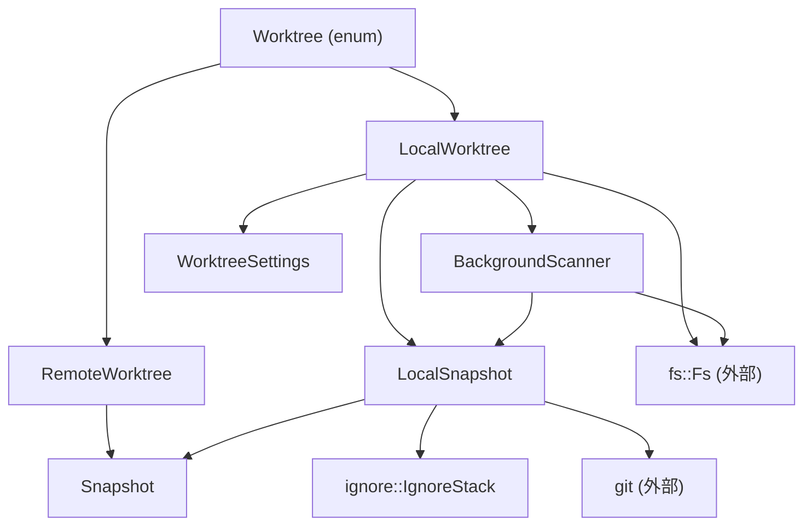
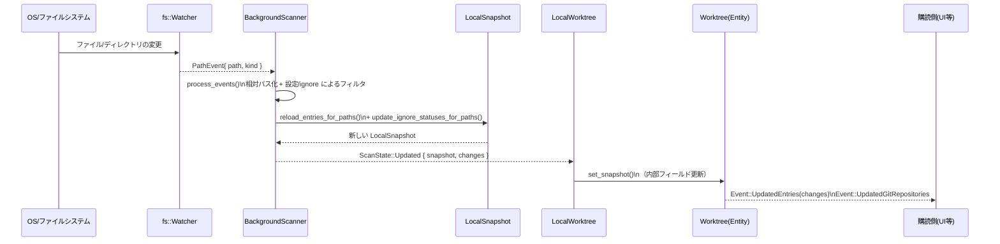

# worktree/ ディレクトリ

## 1. ざっくり一言

`worktree` クレートは、Zed の「プロジェクト（ワークツリー）」に属するファイル・ディレクトリの集合をローカル／リモート双方で管理し、  
ファイルシステムの監視・Git の無視設定・ユーザ設定を組み合わせて **常に最新のファイルツリーのスナップショット** を維持するためのモジュール群です。

---

## 2. このモジュールの役割

### 2.1 概要

このディレクトリは次の問題を解決するために存在します。

> 「プロジェクト内の大量のファイル・ディレクトリを、  
> Git の ignore・ユーザ設定・ファイルシステムイベントを考慮しながら効率的に追跡し、  
> Zed 本体やリモートとの同期に使える一貫したスナップショットとして提供する」

主な役割は:

- ローカル/リモートの **Worktree** を表現し、ファイルツリーの状態を `Snapshot` として保持する  
- バックグラウンドでファイルシステムをスキャンし、FS イベントに応じてスナップショットを更新する  
- `.gitignore`, `.git/info/exclude`, グローバル Git ignore とユーザ設定 (`WorktreeSettings`) を統合して、  
  「スキャン対象にするか」「検索対象に含めるか」「プライベート/非表示とみなすか」を決める  
- ファイルの読み書き（エンコーディング自動判別を含む）や、エントリの作成・削除・コピーなどの高レベル操作を提供する  
- リモートワークツリーと gRPC (`rpc::proto`) を通じてスナップショットを同期する

### 2.2 アーキテクチャ内での位置づけ

crate 内の主要コンポーネントと依存関係を簡略化して示すと、次のようになります。



- `Worktree` … アプリから見える中心的なモデル。ローカル (`LocalWorktree`) とリモート (`RemoteWorktree`) をラップします。
- `Snapshot` … 現在のファイルツリーの状態（エントリ集合）を保持するイミュータブルなスナップショットです。
- `LocalSnapshot` … `Snapshot` に加え、Git ignore・リポジトリ情報・FS ハンドルなど「ローカル専用の付帯情報」を持ちます。
- `BackgroundScanner` … `fs::Fs` / `fs::Watcher` からのイベントを処理し、`LocalSnapshot` を更新します。
- `IgnoreStack` … グローバル/ローカル/リポジトリごとの Git ignore をスタックとして管理します。
- `WorktreeSettings` … ユーザ設定 (`SettingsStore`) から構築される、パスベースの除外/非表示/プライベート判定ロジックです。

### 2.3 設計上のポイント

コードから読み取れる設計上の特徴は次のとおりです。

- **ローカルとリモートの二層構造**
  - 高レベル API は `Worktree` が提供し、その内部で `LocalWorktree` / `RemoteWorktree` に分岐します。
  - 両者で `Snapshot` のフォーマットを共通化し、リモート更新も `Snapshot::apply_remote_update` で適用します。

- **イミュータブルなスナップショット + 差分イベント**
  - `Snapshot` は `SumTree` ベースの永続データ構造で、`Entry` や `PathEntry` を順序付き木として保持します。
  - バックグラウンドスキャンは新しい `LocalSnapshot` を組み立て、`UpdatedEntriesSet` / `UpdatedGitRepositoriesSet` として差分を通知します。

- **Git ignore とユーザ設定の統合**
  - `ignore::IgnoreStack` で
    - グローバル gitignore (`~/.config/git/ignore` 等)
    - `.git/info/exclude`
    - 各ディレクトリの `.gitignore`
    をスタック状に管理し、`is_abs_path_ignored` で判定します。
  - さらに `WorktreeSettings` の
    - `file_scan_exclusions` / `file_scan_inclusions`
    - `private_files` / `hidden_files` / `read_only_files`
    を適用して、スキャンの有無・可視性・プライバシーを決めます。

- **FS イベント駆動 + 明示的リフレッシュ**
  - `fs::Fs::watch` からの `PathEvent` を `BackgroundScanner::run` が受け取り、変更のあった部分だけを再スキャンします。
  - 明示的なリフレッシュ (`refresh_entries_for_paths` / `add_path_prefix_to_scan`) もサポートし、UI 操作に応じて必要な範囲だけを読み込みます。

- **エンコーディングの自動判別とバイナリ検出**
  - `decode_file_text` と `analyze_byte_content` により、UTF‑8/UTF‑16/Shift‑JIS/EUC‑JP/ISO‑2022‑JP/GBK/Windows‑1252 などを自動判別しつつ、
    音声ファイル等のバイナリを誤ってテキストとして扱わないようにしています。
  - 非テキストと推定された場合や 6GB 超の巨大ファイルは `load_file` でエラーになります。

---

## 3. 主要な機能一覧

このディレクトリが提供する主な機能は次のとおりです。

- ローカルワークツリーの生成:
  - `Worktree::local` で `fs::Fs` を使って指定パスからワークツリーを構築
- リモートワークツリーの生成:
  - `Worktree::remote` でリモートプロジェクトと `rpc::proto` を通じた同期を管理
- スナップショット API:
  - `Snapshot` / `LocalSnapshot` からエントリを列挙 (`entries`, `files`, `directories`, `child_entries` など)
  - エントリ数・ファイル数・ディレクトリ数の集計 (`entry_count`, `visible_file_count` など)
- エントリ操作:
  - ファイル/ディレクトリの作成 (`Worktree::create_entry`)
  - 削除 (`Worktree::delete_entry`)
  - 外部パスからのコピー (`Worktree::copy_external_entries`)
  - ディレクトリ展開 (`expand_entry`, `expand_all_for_entry`)
- ファイル I/O:
  - テキストファイルの読み込み (`Worktree::load_file`) … エンコーディング自動判別付き
  - バイナリファイルの読み込み (`Worktree::load_binary_file`)
  - ファイルの書き込み (`Worktree::write_file`) … Rope + エンコーディング指定
- Git リポジトリ検出と管理:
  - `.git` ディレクトリや gitfile（別ディレクトリへの参照）からリポジトリを検出
  - `.git/info/exclude` / グローバル gitignore を `IgnoreStack` に取り込む
- パスごとのフラグ管理:
  - `Entry` ごとに `is_ignored`, `is_hidden`, `is_private`, `is_external`, `is_always_included` などを保持
- 設定連動:
  - `WorktreeSettings` を `SettingsStore` から取得し、変更を監視してバックグラウンドスキャナを再起動
- FS イベント制御（テスト用）:
  - `WorktreeModelHandle::flush_fs_events` / `flush_fs_events_in_root_git_repository` によるテスト用同期

---

## 4. 関数・構造体の解説

### 4.1 型一覧（主要な構造体・列挙体）

| 名前 | 種別 | 役割 / 用途 |
|------|------|-------------|
| `Worktree` | enum | ローカル (`LocalWorktree`) とリモート (`RemoteWorktree`) をまとめた高レベル API。`Deref<Target = Snapshot>` により `Snapshot` メソッドも直接呼び出せます。 |
| `LocalWorktree` | 構造体 | ローカルファイルシステムと `fs::Fs` を使ってスナップショットを維持するワークツリー。バックグラウンドスキャナや設定を保持します。 |
| `RemoteWorktree` | 構造体 | リモートホスト上のワークツリーを `AnyProtoClient` を通じて反映するワークツリー。ローカルにはファイルは存在せず、`Snapshot` のみ保持します。 |
| `Snapshot` | 構造体 | ワークツリー内の全エントリを `SumTree<Entry>` / `SumTree<PathEntry>` で保持するイミュータブルなスナップショット。 |
| `LocalSnapshot` | 構造体 | `Snapshot` に加え、Git ignore 情報・ローカルリポジトリ一覧・`global_gitignore` などローカル固有の状態を保持します。 |
| `Entry` | 構造体 | 1 ファイル/ディレクトリに対応するエントリ。パス・inode・mtime・サイズ・種別 (`EntryKind`)・各種フラグを持ちます。 |
| `EntryKind` | enum | `File` / `Dir` / `PendingDir` / `UnloadedDir`。ディレクトリのロード状態を区別します。 |
| `File` | 構造体 | 言語レイヤに公開されるファイルハンドル。`language::File` / `language::LocalFile` を実装し、`Worktree` と `RelPath` を保持します。 |
| `WorktreeSettings` | 構造体 | 設定ファイルから構築される、パスベースの `PathMatcher` 群（除外 / 包含 / プライベート / 非表示 / 読み取り専用）をまとめた設定。 |
| `IgnoreStack` | 構造体 | グローバル/リポジトリ/ディレクトリごとの `Gitignore` をチェーンし、最終的に「この絶対パスは無視されるか」を判定します。 |
| `Event` | enum | `Worktree` が発行するイベント。エントリ更新・Git リポジトリ更新・ルート削除などを表します。 |
| `PathChange` | enum | 差分通知用の変更種別。`Added` / `Removed` / `Updated` / `AddedOrUpdated` / `Loaded`。 |
| `UpdatedGitRepository` | 構造体 | ローカル Git リポジトリの追加/削除/変更の情報。`.git` や commondir のパスを含みます。 |
| `Traversal<'a>` | 構造体 | `Snapshot` 上を順序付きに走査するためのイテレータ。ファイル/ディレクトリ/無視エントリのフィルタ条件を持ちます。 |
| `ChildEntriesIter<'a>` | 構造体 | ある親パス直下の子エントリだけを列挙するイテレータ。 |
| `ProjectEntryId` | 新しい型 (`usize` ラッパ) | 各エントリに一意に付与される ID。永続的な参照に利用されます。 |
| `WorkDirectory` | enum | Git リポジトリの「作業ディレクトリ」がワークツリー内か上位階層かを表します。 |
| `WorktreeModelHandle` | trait | テスト用トレイト。`Entity<Worktree>` に対して FS イベントをフラッシュさせるメソッドを提供します（`cfg(feature = "test-support")`）。 |

### 4.2 代表的な関数の詳細

以下では、利用頻度が高く振る舞いが複雑な関数を 7 つ選んで説明します。

---

#### `Worktree::local(path, visible, fs, next_entry_id, scanning_enabled, worktree_id, cx) -> Result<Entity<Worktree>>`

**概要**

ローカルファイルシステム上のパスから新しいローカルワークツリー (`Worktree::Local`) を構築し、  
`gpui::Entity<Worktree>` としてアプリケーションに登録します。  
バックグラウンドスキャナや設定監視もこの中で初期化されます。

**引数**

| 引数名 | 型 | 説明 |
|--------|----|------|
| `path` | `impl Into<Arc<Path>>` | ワークツリーのルートパス（ファイルまたはディレクトリ）。 |
| `visible` | `bool` | Zed UI にワークツリー名を表示するかどうか。`full_path` の表示にも影響します。 |
| `fs` | `Arc<dyn Fs>` | 抽象化されたファイルシステム実装（`RealFs` / `FakeFs` 等）。 |
| `next_entry_id` | `Arc<AtomicUsize>` | `ProjectEntryId` を生成するためのカウンタ。複数ワークツリー間で共有可能です。 |
| `scanning_enabled` | `bool` | バックグラウンドでのディレクトリスキャン／FS 監視を有効にするか。 |
| `worktree_id` | `WorktreeId` | 設定や RPC で使う論理的なワークツリー ID。 |
| `cx` | `&mut AsyncApp` | gpui の非同期アプリコンテキスト。Entity の生成やタスク起動に利用します。 |

**戻り値**

- 成功時: `Entity<Worktree>`（`Worktree::Local` を内部に持つ）
- 失敗時: `anyhow::Error`（FS メタデータの取得失敗やハンドルオープン失敗など）

**内部処理の流れ（簡略）**

1. 引数 `path` を `Arc<Path>` に変換し、`fs.metadata` で存在と属性（ディレクトリ/ファイルなど）を取得する。
2. `fs.is_case_sensitive` によりファイルシステムの大小文字区別有無を保存。
3. ルートパスが存在する場合は `fs.open_handle` でファイルハンドルを開き、後のリネーム検出用に保持。
4. `discover_root_repo_common_dir` で、ルート直下の `.git` から commondir を解決し、`root_repo_common_dir` に設定。
5. `Snapshot::new` でベースとなる `Snapshot` を構築し、それを含む `LocalSnapshot` を初期化。
6. `SettingsStore` から `WorktreeSettings` を取得し、グローバルに変更を監視。変更時には `restart_background_scanners` を呼びます。
7. ルートメタデータが存在する場合:
   - `Entry::new` でルートエントリを作成し、ディレクトリの場合は `PendingDir` / `UnloadedDir` を設定。
   - 単一ファイルワークツリーなら、`WorktreeSettings` に基づき `is_private` / `is_hidden` を設定。
   - `LocalSnapshot::insert_entry` でエントリを登録。
8. スキャン要求用のチャネル (`ScanRequest`, `PathPrefixScanRequest`) を作成。
9. `LocalWorktree` を構築し、`start_background_scanner` で FS 監視とディレクトリスキャンを開始。
10. `cx.new` を通して `Entity<Worktree>` を返す。

**Examples（使用例）**

簡略化したローカルワークツリー生成例です（実際には `gpui` のセットアップが必要です）。

```rust
use std::{path::Path, sync::{Arc, atomic::AtomicUsize}};
use fs::RealFs;
use gpui::{AsyncApp, TestAppContext};
use settings::WorktreeId;
use worktree::Worktree;

// テスト用の簡単な例
#[gpui::test]
async fn open_local_worktree(cx: &mut TestAppContext) {
    // RealFs を準備する                                         
    let fs = Arc::new(RealFs::new(None, cx.executor()));         

    // Entry ID カウンタを用意する                                  
    let next_id = Arc::new(AtomicUsize::new(0));                 

    // WorktreeId は RPC/設定で使う ID                              
    let worktree_id = WorktreeId::from_proto(0);                 

    // `/project` をルートとするローカルワークツリーを開く          
    let tree = Worktree::local(
        Path::new("/project"),    // ルートパス                    
        true,                     // UI に表示する                 
        fs,                       // ファイルシステム実装          
        next_id,                  // ID カウンタ                   
        true,                     // スキャンを有効化              
        worktree_id,              // WorktreeId                    
        &mut cx.to_async(),       // AsyncApp コンテキスト         
    )
    .await
    .expect("failed to open worktree");

    // 初期スキャン完了を待つ                                      
    cx.read(|cx| tree.read(cx).as_local().unwrap().scan_complete())
        .await;
}
```

**Errors / Panics**

- `fs.metadata` / `fs.open_handle` / `discover_root_repo_common_dir` が失敗すると `anyhow::Error` を返します。
- panic 条件はこの関数内にはありませんが、後続処理で `expect` を使っている箇所（例: `.git` の親ディレクトリの存在）があるため、  
  ルートパスが極端に異常な状態の場合に panic する可能性があります。

**Edge cases（エッジケース）**

- ルートパスが存在しない場合:
  - `metadata` は `None` となり、ルートエントリは作られません。
  - ただしワークツリー自体は生成されるため、後でファイルが作成されればスキャンにより反映されます。
- `scanning_enabled = false` の場合:
  - ルートがディレクトリなら `EntryKind::UnloadedDir` で登録され、バックグラウンドスキャンは起動されません。
- ルートが単一ファイルのとき:
  - `WorktreeSettings::is_path_private` / `is_path_hidden` に基づき `is_private` / `is_hidden` が設定されます（例: `.env` はプライベート）。

**使用上の注意点**

- `gpui` の `AsyncApp` 上でのみ呼び出せる設計です（テストでは `TestAppContext::to_async` を使用）。
- 返される `Entity<Worktree>` を利用する際は、`scan_complete` で初期スキャン完了を待ってから `entries` などを使うと状態が安定します。
- `next_entry_id` を複数ワークツリーで共有すると ID が一意に保たれますが、その前提でテストも書かれています。

---

#### `Worktree::load_file(path: &RelPath, cx: &Context<Worktree>) -> Task<Result<LoadedFile>>`

**概要**

ローカルワークツリー内のファイルを読み込んでテキストとして返します。  
内部でエンコーディング検出とバイナリ判定を行い、`LoadedFile` として `File` ハンドルとテキスト内容を返します。  
リモートワークツリーではサポートされておらず、エラーになります。

**引数**

| 引数名 | 型 | 説明 |
|--------|----|------|
| `path` | `&RelPath` | ワークツリー内の相対パス。空パスでルートエントリを指します。 |
| `cx` | `&Context<Worktree>` | gpui のコンテキスト。タスク起動とエンティティ参照に利用します。 |

**戻り値**

- `Task<Result<LoadedFile>>`  
  - 成功時: `LoadedFile { file: Arc<File>, text: String, encoding: &'static Encoding, has_bom: bool }`  
  - 失敗時: `anyhow::Error`（巨大ファイル・バイナリ判定・FS エラーなど）

**内部処理の流れ**

1. `Worktree` が `Local` かどうかを判定。`Remote` の場合は即座にエラーの `Task` を返す。
2. ローカルの場合、`LocalWorktree::load_file` を呼び出す。
3. `LocalWorktree::load_file` 内では:
   - `absolutize` で絶対パスに変換。
   - `refresh_entry(path)` を呼び、（必要なら）バックグラウンドスキャン経由で該当エントリを最新状態にします。
   - FS メタデータを取得し、サイズが `FILE_SIZE_MAX`（6GB）以上なら `"File is too large to load"` でエラー終了。
   - `decode_file_text(fs, &abs_path)` によりバイト列を読み込み、バイナリ判定とエンコーディング検出を行う。
4. `refresh_entry` の結果に応じて:
   - エントリが存在する場合: `File::for_entry` で `File` を構築。
   - エントリが存在しない場合: 設定による除外などとみなし、FS メタデータから `File { entry_id: None, ... }` を構築。
5. `LoadedFile` を返す。

**Examples（使用例）**

```rust
use gpui::{Context, App};
use util::rel_path::RelPath;
use worktree::{Worktree, LoadedFile};

fn load_readme(tree: &Worktree, cx: &Context<Worktree>) {
    // "README.md" への相対パスを作成                              
    let path = RelPath::unix("README.md").unwrap();              

    // 非同期タスクとしてファイルをロード                        
    let task = tree.load_file(&path, cx);                        

    // gpui のタスクとして待機する例（簡略化）                   
    cx.spawn(async move |_this, _cx| {                           
        match task.await {                                       
            Ok(loaded) => {                                     
                println!("encoding: {:?}", loaded.encoding.name());
                println!("text: {}", &loaded.text[.. loaded.text.len().min(100)]);
            }
            Err(err) => eprintln!("failed to load file: {err:#}"),
        }
    })
    .detach();
}
```

**Errors / Panics**

- リモートワークツリー (`Worktree::Remote`) の場合: `"remote worktrees can't yet load files"` というエラーを返します。
- ファイルサイズが 6GB 以上の場合: `"File is too large to load"` としてエラー。
- `decode_file_text` 内で
  - バイナリ と判定された場合 `"Binary files are not supported"` でエラー。
  - FS 読み込みに失敗した場合も `anyhow::Error` でエラー。
- `worktree` エンティティがドロップされていた場合: `"worktree was dropped"` エラー。

**Edge cases**

- 設定で除外されたパス（`WorktreeSettings::is_path_excluded` が true）の場合:
  - スナップショットにエントリは作られませんが、物理ファイルが存在すれば `File` は生成され、`entry_id: None` として返されます。
- Git ignore や hidden なディレクトリ配下のファイル:
  - 必要に応じて `refresh_entry` がディレクトリを展開し、`is_ignored` / `is_hidden` フラグを付けたままエントリを作成します。
- エンコーディング:
  - BOM があれば BOM に従い、なければ `analyze_byte_content` と `EncodingDetector` に基づいて検出します。
  - うまく判別できないケースでは、UTF‑8 とみなしてから ESC 文字の有無に応じて判定をリトライする実装になっています。

**使用上の注意点**

- 巨大ファイル（6GB 以上）やバイナリファイルはテキスト表示の対象外です。
- ローカルワークツリーでのみ使用できます。リモートファイルのロード機能はまだ実装されていません。
- `refresh_entry` が内部でスキャンをトリガーするため、初回アクセス時には多少の遅延が発生することがあります。

---

#### `Worktree::write_file(path, text, line_ending, encoding, has_bom, cx) -> Task<Result<Arc<File>>>`

**概要**

ローカルワークツリー内のファイルを指定したテキスト・エンコーディングで保存し、  
保存後の `File` ハンドルを返します。  
UTF‑8 の場合は `fs.save` による効率的なストリーミング書き込み、それ以外は一度メモリに展開した上で書き込みます。

**引数**

| 引数名 | 型 | 説明 |
|--------|----|------|
| `path` | `Arc<RelPath>` | ワークツリー内での相対パス。存在しない場合は新規作成されます。 |
| `text` | `Rope` | 保存するテキスト内容。大きなテキストでも扱いやすい文字列構造です。 |
| `line_ending` | `LineEnding` | 改行コードの種類（Unix / Windows）。保存時に正規化されます。 |
| `encoding` | `&'static Encoding` | 保存に使用する文字エンコーディング（`encoding_rs`）。 |
| `has_bom` | `bool` | BOM（Byte Order Mark）を付与するかどうか。UTF‑16 では BOM を明示的に付与します。 |
| `cx` | `&Context<Worktree>` | gpui コンテキスト。 |

**戻り値**

- `Task<Result<Arc<File>>>`  
  - 成功時: 保存されたファイルを表す `File` ハンドル（`Arc<File>`）。  
    - スナップショットに含まれる場合は `entry_id` 付き  
    - 設定で除外された場合は `entry_id: None`
  - 失敗時: `anyhow::Error`（FS 書き込み失敗・メタデータ取得失敗・エンティティ drop など）

**内部処理の流れ（要約）**

1. ローカルワークツリーでなければエラーの `Task` を返す（リモートでは未実装）。
2. FS と絶対パスを計算し、非同期タスク `write` を起動:
   - `encoding == UTF_8 && !has_bom`:
     - `fs.save(&abs_path, &text, line_ending)` を呼び出し、Rope をチャンク単位で書き込み。
   - それ以外:
     - `text.to_string()` で一度 `String` に変換。
     - 改行コードを `line_ending` に合わせて置換。
     - UTF‑16 の場合は BOM + UTF‑16 BE/LE で手動エンコード。
     - その他のエンコーディングは `encoding.encode` を使用し、必要に応じて BOM 付与。
     - `fs.write(&abs_path, &bytes)` で書き込み。
3. 書き込み完了後、`refresh_entry(path)` を呼び出し、最新の `Entry` を取得。
   - エントリがあれば `File::for_entry` で `File` を構築。
   - エントリが無ければ「除外されたファイル」とみなし、メタデータから `File { entry_id: None, ... }` を構築。

**Examples（使用例）**

```rust
use encoding_rs::SHIFT_JIS;
use text::Rope;
use util::rel_path::RelPath;
use worktree::Worktree;

fn save_shift_jis_file(tree: &Worktree, cx: &Context<Worktree>) {
    // 相対パスを用意                                         
    let path = RelPath::unix("src/main_sjis.rs").unwrap().into(); 

    // 書き込みたいテキストを Rope に変換                      
    let rope: Rope = "println!(\"こんにちは\");\n".into();       

    let task = tree.write_file(
        path,               // 保存先パス                     
        rope,               // テキスト内容                   
        LineEnding::Unix,   // 改行コード                     
        SHIFT_JIS,          // エンコーディング               
        false,              // BOM なし                       
        cx,
    );

    cx.spawn(async move |_this, _cx| {
        match task.await {
            Ok(file) => println!("saved: {:?}", file.path),
            Err(err) => eprintln!("failed to save file: {err:#}"),
        }
    })
    .detach();
}
```

**Errors / Panics**

- FS 操作失敗:
  - ディレクトリが存在しない場合などは `fs.save` / `fs.write` が `Err` を返します。
- エンティティがドロップされていた場合:
  - `"worktree dropped"` / `"Excluded buffer ... got removed during saving"` などのエラー。
- panic は基本的に発生しませんが、テキスト→バイト変換で OOM になるほど巨大なテキストを一度に扱うと OS 依存の挙動になります。

**Edge cases**

- 設定で除外されているパス（`is_path_excluded` が true）に書き込んだ場合:
  - ファイルは物理的には保存されますが、スナップショットには現れず、`entry_id: None` の `File` が返されます。
- すでに存在するファイルを上書きする場合:
  - `refresh_entry` により既存の `Entry` が更新され、`PathChange::Updated` が発行されます。
- Git ignore や hidden の判定:
  - 書き込み後の `Entry` 作成時に `ignore_stack_for_abs_path` と `WorktreeSettings` の判定が適用され、  
    `is_ignored` / `is_hidden` / `is_private` 等のフラグが更新されます。

**使用上の注意点**

- UTF‑8 以外のエンコーディングでは一度全テキストをメモリに展開するため、非常に大きなファイルではメモリ使用量に注意が必要です。
- リモートワークツリーでは現在未実装であり、常にエラーとなります。
- `path` が設定で除外されていると、書き込みは成功してもワークツリー上では表示されません。

---

#### `Worktree::create_entry(path, is_directory, content, cx) -> Task<Result<CreatedEntry>>`

**概要**

ワークツリー内に新しいファイルまたはディレクトリを作成し、  
それがワークツリーのインデックスに含まれるかどうかを `CreatedEntry` で返します。  
ローカルでは `fs::Fs` を直接操作し、リモートでは RPC 経由で作成します。

**引数**

| 引数名 | 型 | 説明 |
|--------|----|------|
| `path` | `Arc<RelPath>` | 新規エントリの相対パス。中間ディレクトリが存在しない場合でもテストでは作成を期待しています。 |
| `is_directory` | `bool` | ディレクトリを作成するか（`true`）ファイルを作成するか（`false`）。 |
| `content` | `Option<Vec<u8>>` | ファイルの初期内容。`None` の場合は空ファイルが作成されます。ディレクトリの場合は無視されます。 |
| `cx` | `&Context<Worktree>` | gpui コンテキスト。 |

**戻り値**

- `Task<Result<CreatedEntry>>`
  - `CreatedEntry::Included(Entry)` … 作成され、ワークツリーにインデックスされた場合
  - `CreatedEntry::Excluded { abs_path }` … 作成されたが、設定によりスキャン対象外と判定された場合
  - エラー … FS 書き込み失敗・RPC エラーなど

**内部処理（ローカル版）**

1. 絶対パス `abs_path` を計算し、`path_excluded = settings.is_path_excluded(&path)` を評価。
2. バックグラウンドタスク `write` を起動:
   - `is_directory` が true: `fs.create_dir(&abs_path)` を呼ぶ。
   - false: `fs.write(&abs_path, content.unwrap_or(&[]))` を呼ぶ。
3. `lowest_ancestor` を計算:
   - `path` の祖先のうち、すでに `Entry` が存在する最も下位のパス（なければ空パス）。
4. `cx.spawn` で以下を実行:
   - `write.await` で作成完了を待つ。
   - `path_excluded` が true なら `CreatedEntry::Excluded { abs_path }` を即返す。
   - そうでなければ:
     - `path.strip_prefix(lowest_ancestor)` で `lowest_ancestor` からの相対パスをとり、その各祖先に対して `refresh_entry` を呼び、ディレクトリツリーを更新。
     - 最終的に `path` 自身について `refresh_entry(path)` を呼び、その結果の `Entry` を `CreatedEntry::Included` に変換する。

**内部処理（リモート版）**

- `proto::CreateProjectEntry` を RPC で送り、リモート側から `Entry` と `worktree_scan_id` を受け取ります。
- 返ってきた `Entry` は `RemoteWorktree::insert_entry` を通じて `Snapshot` に組み込まれます。
- サーバ側でフィルタされてエントリが作成されなかった場合は `CreatedEntry::Excluded` になります。

**Examples（使用例・ローカル）**

```rust
use util::rel_path::rel_path;
use worktree::{Worktree, CreatedEntry};

async fn create_dir_and_file(tree: &mut Worktree, cx: &Context<Worktree>) {
    // ディレクトリ a/b/c を作成                                 
    let dir_task = tree.create_entry(rel_path("a/b/c").into(), true, None, cx);

    // ファイル a/b/c/file.txt を作成                            
    let file_task = tree.create_entry(
        rel_path("a/b/c/file.txt").into(),
        false,
        Some(b"hello".to_vec()),
        cx,
    );

    let dir_result = dir_task.await.unwrap();
    let file_result = file_task.await.unwrap();

    match (dir_result, file_result) {
        (CreatedEntry::Included(dir), CreatedEntry::Included(file)) => {
            assert!(dir.is_dir());
            assert!(file.is_file());
        }
        _ => {
            // 設定によっては Excluded の可能性もある               
        }
    }
}
```

**Errors / Panics**

- FS 書き込み失敗時: `anyhow::Error` を返します。
- `.strip_prefix` などは不正なパスに対して `unwrap` を使っている箇所がありますが、`lowest_ancestor` の計算と整合しているため、  
  正常な `RelPath` 同士であれば panic は起こらない前提です。

**Edge cases**

- `file_scan_exclusions` にマッチするパス:
  - 物理的にはファイル/ディレクトリが作成されますが、`CreatedEntry::Excluded { abs_path }` となりスナップショットには載りません。
- `.gitignore` や `.git/info/exclude` による ignore:
  - これは `is_path_excluded` ではなく Git ignore のレイヤーなので、通常は `CreatedEntry::Included(...)` として戻り、  
    `Entry.is_ignored = true` の状態でスナップショットに現れます（テスト `test_create_file_in_expanded_gitignored_dir` 参照）。

**使用上の注意点**

- FS 実装に依存しますが、テストコードからは
  - 中間ディレクトリが存在しないパスでも作成できる（`a/b/c/d.txt` のようなケース）ことが期待されています。
- 除外設定が変わった場合は、作成済みのパスの扱いも変わる可能性があります。そのため設定変更後は再スキャンが行われます。

---

#### `LocalWorktree::refresh_entries_for_paths(paths: Vec<Arc<RelPath>>) -> barrier::Receiver`

**概要**

指定された相対パス群を **「リフレッシュ対象」としてバックグラウンドスキャナに依頼** し、  
処理完了を待つための `barrier::Receiver` を返します。

**引数**

| 引数名 | 型 | 説明 |
|--------|----|------|
| `paths` | `Vec<Arc<RelPath>>` | リフレッシュしたいパスのリスト。親ディレクトリが `UnloadedDir` の場合はディレクトリのスキャンもトリガーされます。 |

**戻り値**

- `barrier::Receiver`  
  - `recv().await` で、該当パスに対するスキャンとスナップショット更新が完了したことを待てます。

**内部処理**

1. `barrier::channel` で `(tx, rx)` を作成。
2. `ScanRequest { relative_paths: paths, done: smallvec![tx] }` を `scan_requests_tx` に `try_send`。
3. `rx` を返す。
4. 実際の処理は `BackgroundScanner::next_scan_request` / `process_scan_request` で行われ、
   - `reload_entries_for_paths` により該当パスのメタデータを取り直し (`fs.metadata`)、
   - ディレクトリなら必要に応じて再スキャン (`enqueue_scan_dir` → `scan_dirs`) されます。
5. 最終的に `send_status_update` 経由で `ScanState::Updated` が `LocalWorktree` に通知され、  
   その中で `barrier`（`done`）が drop されることで待機中の受信側が解除されます。

**Examples（使用例）**

```rust
use util::rel_path::rel_path;
use worktree::Worktree;

async fn expand_dir(tree: &Worktree, cx: &Context<Worktree>) {
    // ローカルワークツリーを取得                                 
    let local = tree.as_local().expect("local worktree only");   

    // "src" ディレクトリの直下を再スキャン                       
    let rx = local.refresh_entries_for_paths(vec![rel_path("src").into()]);

    // バックグラウンドスキャン完了まで待つ                       
    rx.recv().await;                                             

    // 以降、"src" 配下の最新状態を Snapshot から取得できる       
}
```

**Edge cases**

- スキャンキューが閉じている（ワークツリーがクローズされている）場合:
  - `try_send` は `Err` となり、リフレッシュ要求が無視される可能性があります（戻り値 `Receiver` は待ち続ける可能性がある点に注意が必要です）。
- 同じパスへの連続したリクエスト:
  - `BackgroundScanner::next_scan_request` でマージされ、まとめて処理されます。

**使用上の注意点**

- UI から「あるディレクトリを展開したい」場合や、「特定のパスを強制的に再読み込みしたい」場合に使われます。
- 実際にどの範囲がスキャンされるかは、`WorktreeSettings` や `ignore_stack_for_abs_path` によって制御されます。

---

#### `Snapshot::entries(&self, include_ignored: bool, start: usize) -> Traversal<'_>`

**概要**

スナップショット内のエントリを、パス順に走査するためのイテレータ (`Traversal`) を返します。  
ファイル・ディレクトリ双方を含み、`include_ignored` に応じて Git ignore されたエントリを含めるかを選択できます。

**引数**

| 引数名 | 型 | 説明 |
|--------|----|------|
| `include_ignored` | `bool` | `true` で ignore されたエントリも含める。`false` で `is_ignored && !is_always_included` なエントリを除外。 |
| `start` | `usize` | スキップするエントリ数（フィルタ適用後のオフセット）。 |

**戻り値**

- `Traversal<'_>` … `Iterator<Item = &Entry>` を実装しており、`for` ループなどで列挙できます。

**内部処理**

- `traverse_from_offset(true, true, include_ignored, start)` を呼び出し、
  - `include_files = true`
  - `include_dirs = true`
  - `include_ignored = include_ignored`
  を指定した `Traversal` を構築します。
- `Traversal` は `sum_tree::Cursor` と `TraversalTarget::Count` を使って、`start` 番目から順にエントリを返します。

**Examples（使用例）**

```rust
use util::rel_path::RelPath;
use worktree::Worktree;
use util::paths::PathStyle;

fn list_visible_entries(tree: &Worktree) {
    // Snapshot を取得（Deref により tree から直接呼び出しも可） 
    let snapshot = tree.snapshot();                              

    // ignore されていない全エントリをパス順に列挙               
    for entry in snapshot.entries(false, 0) {                    
        println!(
            "{} (dir: {}, ignored: {})",
            entry.path.display(snapshot.path_style()),
            entry.is_dir(),
            entry.is_ignored,
        );
    }
}
```

**Edge cases**

- `start` が総エントリ数以上の場合:
  - 空のイテレータになり、`next()` は常に `None` を返します。
- `include_ignored = false` の場合:
  - `is_ignored && !is_always_included` なエントリは内部集計から除外されますが、  
    `is_always_included` なエントリは ignore されていても含まれます。

**使用上の注意点**

- `entries(true, 0)` は非常に多くのエントリ（ignore された `node_modules` なども含む）を返す可能性があるため、  
  UI などから呼ぶ場合は注意が必要です。
- 子エントリだけが欲しい場合は `child_entries` / `child_entries_with_options` を使う方が効率的です。

---

#### `LocalSnapshot::ignore_stack_for_abs_path(&self, abs_path: &Path, is_dir: bool, fs: &dyn Fs) -> IgnoreStack`

**概要**

指定した絶対パスに対して、どの Git ignore / exclude / グローバル ignore が適用されるかを表す `IgnoreStack` を構築します。  
この結果を利用して、`Entry.is_ignored` の判定やディレクトリスキャンの可否を決めます。

**引数**

| 引数名 | 型 | 説明 |
|--------|----|------|
| `abs_path` | `&Path` | 判定対象の絶対パス。 |
| `is_dir` | `bool` | ディレクトリかどうか。`.git` などの特別扱いに影響します。 |
| `fs` | `&dyn Fs` | `.git` ディレクトリの有無などを確認するための FS 実装。 |

**戻り値**

- `IgnoreStack` … このパスに対して適用される ignore ルールチェーン。  
  `IgnoreStack::is_abs_path_ignored` で実際の ignore 判定を行います。

**内部処理の流れ**

1. `abs_path.ancestors()` をたどりながら:
   - 各祖先ディレクトリに対応する `.gitignore` が `ignores_by_parent_abs_path` にあれば `new_ignores` に積む。
   - 各祖先直下の `.git` のメタデータを `fs.metadata` で確認し、最初に見つかった `.git` の親を `repo_root` とする。
2. ベースとなる `IgnoreStack` を作成:
   - `global_gitignore` があれば `IgnoreStack::global(global_gitignore)`。
   - なければ `IgnoreStack::none()`。
3. `repo_root` があれば:
   - `repo_exclude_by_work_dir_abs_path` から `.git/info/exclude` の `Gitignore` を取り出し、`IgnoreKind::RepoExclude` としてスタックに積む。
   - `IgnoreStack.repo_root` に `repo_root` を記録。
4. `new_ignores` をルート側から順に適用:
   - 祖先ディレクトリ自体が既に ignore されている場合 (`is_abs_path_ignored(parent_abs_path, true)`):
     - 以降を `IgnoreStack::all()` として扱い、すべて ignore として扱う。
   - そうでなければ、そのディレクトリ直下の `.gitignore` を `IgnoreKind::Gitignore` としてスタックに積む。
5. 最後に `abs_path` 自身が ignore されているかを判定し、ignore されていれば `IgnoreStack::all()` に置き換える。

**Tests から読み取れる挙動**

- `.gitignore` が `.git/info/exclude` やグローバル ignore の設定を **上書き（ホワイトリスト）** できることがテストで確認されています。
  - 例: `test_repo_exclude` … `.git/info/exclude` で `.env.*` を除外しつつ `.gitignore` で `!.env.example` と書くと、`.env.example` はトラッキング対象になります。
- グローバル ignore のパスはリポジトリルートを基準に解決されることが `test_global_gitignore` で確認されています。

**使用上の注意点**

- この関数は非公開ですが、`Entry.is_ignored` の振る舞いを理解する上で重要です。
- `fs.metadata` を多用するため、極端に深いパスに対して頻繁に呼び出すとコストがかかる点に注意が必要です（実装ではキャッシュマップを併用しています）。

---

#### `decode_file_text(fs: &dyn Fs, abs_path: &Path) -> Result<(String, &'static Encoding, bool)>`

**概要**

ローカルファイル（絶対パス）を開き、バイナリ/テキストを判定しつつ適切なエンコーディングで文字列にデコードします。  
BOM・UTF‑16 の検知・バイナリヘッダの検出・`chardetng` による自動判別を組み合わせた実装です。

**引数**

| 引数名 | 型 | 説明 |
|--------|----|------|
| `fs` | `&dyn Fs` | ファイルを開くための FS 実装。同期リード (`open_sync`) を利用します。 |
| `abs_path` | `&Path` | 読み込むファイルの絶対パス。 |

**戻り値**

- 成功時: `(text, encoding, has_bom)`
  - `text: String` … デコードされたテキスト内容。
  - `encoding: &'static Encoding` … 実際に使用したエンコーディング（`encoding_rs`）。
  - `has_bom: bool` … 内容から BOM を検出したかどうか。
- 失敗時: `anyhow::Error`  
  - バイナリと判断された場合 `"Binary files are not supported"`  
  - FS 読み込み失敗など

**内部処理の流れ（簡略）**

1. `fs.open_sync(abs_path)` でファイルを開く。
2. 先頭 `FILE_ANALYSIS_BYTES`（1024 bytes）だけを読み込んで `file_first_bytes` に格納する。
3. `decode_byte_header(&file_first_bytes)` を呼び出し:
   - `Encoding::for_bom` で BOM を検出（UTF‑16/UTF‑8 など）。
   - BOM がなければ `analyze_byte_content` で
     - 典型的なバイナリヘッダ（`PDF`, `RIFF`, `PNG` など）  
     - NUL バイト分布 + UTF‑16 の妥当性チェック  
     から `ByteContent::{Utf16Le, Utf16Be, Binary, Unknown}` を判定。
4. `ByteContent::Binary` の場合は `"Binary files are not supported"` でエラー。
5. ファイル全体を読み込んでから `decode_byte_full(bytes, bom_encoding, byte_content)` を呼ぶ。
6. `decode_byte_full` 内では:
   - `bom_encoding` があれば `decode_with_bom_removal` を使用し、BOM を除去。
   - `ByteContent::Utf16Le/Utf16Be` なら UTF‑16 としてデコード。
   - それ以外では
     - `String::from_utf8(bytes)` を試す。
     - 成功し、ESC (`0x1b`) を含まないなら UTF‑8 とみなす。
     - ESC を含む、あるいは UTF‑8 として失敗した場合は、`EncodingDetector` (`chardetng`) でエンコーディングを推定しデコード。

**Tests から読み取れるサポート範囲**

`test_load_file_encoding` 等から、少なくとも以下のエンコーディングで期待通りにデコードできることが確認されています。

- UTF‑8
- Shift‑JIS
- EUC‑JP
- ISO‑2022‑JP
- Windows‑1252
- GBK
- UTF‑16LE/UTF‑16BE（BOM 有り/無しのケース）

`analyze_byte_content` と `is_known_binary_header` のテストでは、RIFF/WAV, OGG, FLAC, MP3 などのヘッダを **バイナリとして確実に判定** することが確認されています。

**使用上の注意点**

- `LocalWorktree::load_file` からのみ直接利用されており、外部 API としては公開されていません。
- バイナリ判定はヒューリスティックですが、テストでは PCM 16bit WAV のようなケースもカバーされています。
- 極端に壊れたテキストや混在エンコーディングファイルでは、誤ったエンコーディングで表示される可能性があります。

---

### 4.3 その他の主な関数（一覧）

| 関数名 | 所属 | 役割（1 行） |
|--------|------|--------------|
| `Worktree::remote` | `Worktree` | リモートワークツリーを構築し、RPC 経由で `Snapshot` を更新する。 |
| `Worktree::delete_entry` | `Worktree` | 指定 ID のエントリを削除し、必要ならゴミ箱に移動しつつ `Event::DeletedEntry` を発行する。 |
| `Worktree::copy_external_entries` | `Worktree` | ワークツリー外のパスからファイル/ディレクトリを再帰コピーし、インデックスに反映する。 |
| `Worktree::expand_entry` / `expand_all_for_entry` | `Worktree` | ディレクトリを展開し、その配下をスキャンする／再帰的にすべて展開する。 |
| `Snapshot::entry_for_path` | `Snapshot` | 指定された `RelPath` のエントリを取得する。 |
| `Snapshot::resolve_relative_path` | `Snapshot` | `~` やワークツールートを考慮して、実行可能ファイルのパスを解決する。 |
| `LocalWorktree::scan_complete` | `LocalWorktree` | バックグラウンドスキャンが完全に停止するまで待機する Future を返す。 |
| `BackgroundScanner::run` | `BackgroundScanner` | 初期スキャンと、その後の FS イベント処理ループのメイン関数。 |
| `discover_ancestor_git_repo` | モジュール関数 | ルートより上位にある Git リポジトリ（親リポジトリ）と `.gitignore` を検出する。 |

---

## 5. データフロー

ここでは、「ローカルワークツリー上のファイル変更がどのように `Snapshot` とイベントに反映されるか」の典型的なフローを説明します。

### 5.1 FS イベントから `UpdatedEntries` まで

1. ユーザまたは外部プロセスがワークツリー内のファイル/ディレクトリを変更する。
2. `fs::Fs::watch` が `PathEvent { path, kind }` を `BackgroundScanner` にストリームとして渡す。
3. `BackgroundScanner::process_events` が:
   - ルートパス外のイベントや、`file_scan_exclusions` にマッチするパスをフィルタ。
   - `.git` 配下の「無視してよいファイル」（`INDEX_LOCK` など）をスキップ。
   - `RelPath` に変換し、必要なら `.gitignore` / `.git/info/exclude` / グローバル ignore の更新フラグを立てる。
4. 対象パスに対して `reload_entries_for_paths` を実行し:
   - 新しいメタデータを取得 (`fs.metadata`)。
   - `LocalSnapshot::ignore_stack_for_abs_path` で ignore 状態を再評価。
   - 追加/更新/削除されたエントリを `LocalSnapshot` に反映。
5. ignore 設定の変更があれば `update_ignore_statuses_for_paths` で再帰的に子ディレクトリの `is_ignored` を更新。
6. スキャン完了後、`send_status_update` が古い `Snapshot` との差分を `UpdatedEntriesSet` として計算し、`ScanState::Updated` を `LocalWorktree` に送信。
7. `LocalWorktree::set_snapshot` が:
   - `self.snapshot` を更新。
   - `Event::UpdatedEntries(changes)` と `Event::UpdatedGitRepositories` を発行。
   - `snapshot_subscriptions` を解決し、待機中の `wait_for_snapshot` などを完了させる。

この流れをシーケンス図で表すと次のようになります。



- `UI` 側は `gpui::Context::subscribe` を通じて `Event::UpdatedEntries` を購読し、  
  それをもとにツリービューや検索インデックスを更新するといった使い方が想定されています。

---

## 6. 使い方（How to Use）

### 6.1 基本的な使用方法

ここでは、ローカルワークツリーを開き、初期スキャン完了後にエントリ一覧を表示し、ファイルを読み書きするまでの典型的な流れを示します。  
（実際には `gpui` のセットアップが必要ですが、概念把握のためにまとめています。）

```rust
use std::{
    path::Path,
    sync::{Arc, atomic::AtomicUsize},
};
use fs::RealFs;
use gpui::{AppContext, Context, TestAppContext};
use settings::WorktreeId;
use util::rel_path::RelPath;
use util::paths::PathStyle;
use worktree::{Worktree, LoadedFile};

#[gpui::test]
async fn basic_worktree_usage(cx: &mut TestAppContext) {
    // 1. FS と WorktreeId を準備する                          
    let fs = Arc::new(RealFs::new(None, cx.executor()));        
    let next_id = Arc::new(AtomicUsize::new(0));                
    let worktree_id = WorktreeId::from_proto(0);                

    // 2. ローカルワークツリーを開く                           
    let tree = Worktree::local(
        Path::new("/project"),
        true,           // UI に表示
        fs,
        next_id,
        true,           // スキャン有効
        worktree_id,
        &mut cx.to_async(),
    )
    .await
    .unwrap();

    // 3. 初期スキャン完了を待つ                              
    cx.read(|cx| tree.read(cx).as_local().unwrap().scan_complete())
        .await;

    // 4. すべての可視エントリを列挙して表示                  
    tree.read_with(cx, |tree, _| {
        let snapshot = tree.snapshot();
        for entry in snapshot.entries(false, 0) {
            println!(
                "{} (dir: {}, ignored: {})",
                entry.path.display(snapshot.path_style()),
                entry.is_dir(),
                entry.is_ignored,
            );
        }
    });

    // 5. ファイルを読み込む                                   
    let loaded: LoadedFile = tree
        .update(cx, |tree, cx| {
            let path = RelPath::unix("src/main.rs").unwrap();
            tree.load_file(&path, cx)                 // Task を返す
        })
        .await
        .unwrap();                                     // Task 完了

    println!("loaded encoding: {}", loaded.encoding.name());
    println!("first line: {}", loaded.text.lines().next().unwrap_or(""));

    // 6. ファイルを書き込む                                   
    tree
        .update(cx, |tree, cx| {
            let path = RelPath::unix("src/generated.rs").unwrap().into();
            tree.write_file(
                path,
                "// generated\n".into(),
                Default::default(),   // LF
                encoding_rs::UTF_8,
                false,                // BOM なし
                cx,
            )
        })
        .await
        .unwrap();
}
```

### 6.2 よくある使用パターン

#### パターン1: 特定ディレクトリの展開と子エントリの取得

```rust
use util::rel_path::rel_path;
use worktree::Worktree;

async fn list_children(tree: &Worktree, cx: &mut Context<Worktree>) {
    // "src" ディレクトリ配下のスキャンを明示的に要求         
    let refresh = tree
        .as_local()
        .unwrap()
        .refresh_entries_for_paths(vec![rel_path("src").into()]);
    refresh.recv().await;                                   

    // スキャン完了後に子エントリを列挙                       
    tree.read_with(cx, |tree, _| {
        let snapshot = tree.snapshot();
        for entry in snapshot.child_entries(rel_path("src")) {
            println!("{}", entry.path.display(snapshot.path_style()));
        }
    });
}
```

#### パターン2: Worktree 更新イベントの購読

```rust
use gpui::Context;
use worktree::{Worktree, Event, PathChange};

fn subscribe_updates(tree: &mut Worktree, cx: &mut Context<Worktree>) {
    cx.subscribe(&cx.entity(), move |tree, _entity, event, _cx| {
        if let Event::UpdatedEntries(changes) = event {
            for (path, _id, change) in changes.iter() {
                println!(
                    "path {:?} changed: {:?}",
                    path.as_unix_str(),
                    change,           // PathChange::Added / Removed など
                );
            }
        }
    })
    .detach();
}
```

#### パターン3: exclude / include / hidden / private フラグに基づいた絞り込み

```rust
use worktree::Worktree;

fn list_non_private_visible_files(tree: &Worktree) {
    let snapshot = tree.snapshot();
    for entry in snapshot.files(false, 0) {     // ignore されていないファイルのみ
        if !entry.is_private && !entry.is_hidden {
            println!(
                "{} (size: {})",
                entry.path.display(snapshot.path_style()),
                entry.size,
            );
        }
    }
}
```

### 6.3 使用上の注意点（まとめ）

- **ローカル/リモートで利用可能な API が異なる**
  - `load_file` / `write_file` / `create_entry` の実装は `LocalWorktree` と `RemoteWorktree` で異なります。
  - 一部機能（ローカルファイル読み書きなど）はリモートワークツリーでは未サポートである旨がエラーメッセージに明示されています。

- **設定による除外と Git ignore の違い**
  - `file_scan_exclusions`: 物理 FS に存在しても `Entry` 自体を作らず、完全にスナップショットから除外します。
  - Git ignore (`.gitignore`, `.git/info/exclude`, グローバル ignore): `is_ignored = true` としてエントリを残し、検索などから除外します。
  - `file_scan_inclusions` は ignore を上書きして「常に含める」 (`is_always_included`) ための設定です。

- **巨大ファイル・バイナリファイル**
  - `load_file` は 6GB を超えるファイルや `analyze_byte_content` によりバイナリと判定されたファイルに対してエラーを返します。
  - バイナリファイルを誤ってテキストとして扱ってしまうリスクを下げるための設計です。

- **バックグラウンドスキャンの状態**
  - `scan_complete` で完全アイドル状態を待てますが、FS イベントが頻発する環境では完了まで時間がかかる可能性があります。
  - 明示的なリフレッシュ (`refresh_entries_for_paths` / `add_path_prefix_to_scan`) を併用すると、必要な範囲だけを優先的に更新できます。

- **Path と Style**
  - ワークツリー内のパスは `RelPath` として管理され、表示や結合には `PathStyle` を用います。
  - `full_path` は `visible` フラグに応じて、`worktree_name/relative/path` 形式または絶対パス形式で返されます。

---

## 7. 関連ファイル

| パス | 役割 / 関係 |
|------|------------|
| `worktree/Cargo.toml` | `worktree` クレートのパッケージ設定。`fs`, `git`, `gpui`, `settings` など多くのワークスペースクレートに依存します。 |
| `worktree/src/worktree.rs` | このクレートのメイン実装。`Worktree`, `LocalWorktree`, `RemoteWorktree`, `Snapshot` などの主要型と、バックグラウンドスキャナやエンコーディング検出処理が定義されています。 |
| `worktree/src/ignore.rs` | `IgnoreStack` と `IgnoreStackEntry` の定義。`.gitignore` / `.git/info/exclude` / グローバル ignore を統合して ignore 判定を行うユーティリティです。 |
| `worktree/src/worktree_settings.rs` | `WorktreeSettings` の定義と `Settings` 実装。ユーザ設定 (`SettingsStore`) からパスマッチャ (`PathMatcher`) を構築し、除外/包含/プライベート/非表示/読み取り専用の判定を行います。 |
| `worktree/tests/integration/main.rs` | ワークツリー全体の振る舞い（スキャン、ignore ロジック、FS イベント、ランダム操作、エンコーディングなど）を検証する包括的な統合テスト群です。 |
| `worktree/tests/integration/worktree_settings.rs` | `WorktreeSettings` に関する統合テストが含まれるファイルです（このチャンクでは内容は提示されていません）。 |

これらのファイルに加え、`fs`, `git`, `settings`, `util`, `language`, `rpc` などの外部クレートが協調して、  
Zed のプロジェクトビュー・言語サーバ・リモートコラボ機能と連携する形になっています。
