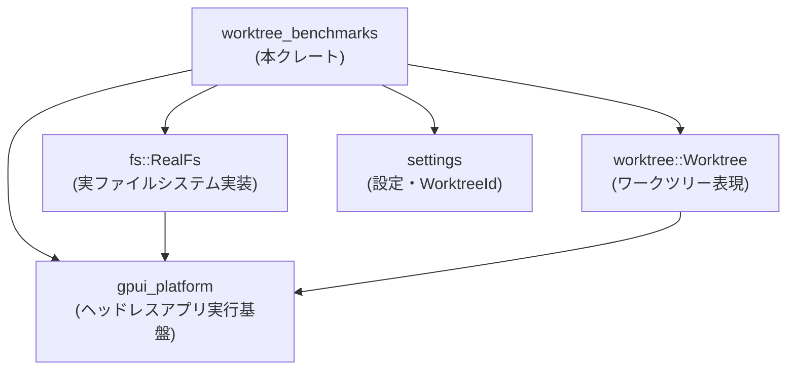
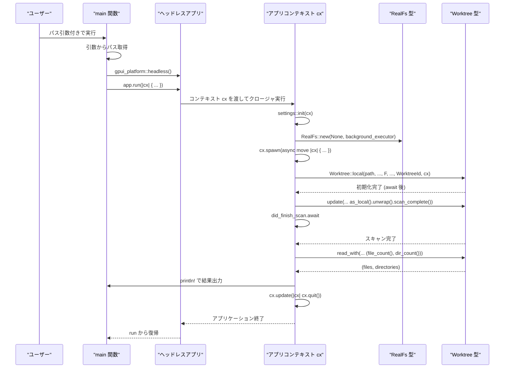

# worktree_benchmarks ディレクトリ解説

---

## 1. ざっくり一言

`worktree_benchmarks` は、指定したワークツリールートディレクトリをスキャンし、その完了までの時間と、見つかったファイル数・ディレクトリ数を計測して標準出力に表示するベンチマーク用バイナリクレートです。

---

## 2. このモジュールの役割

### 2.1 概要

- このクレートは、`worktree` クレートが提供する `Worktree` のスキャン処理を計測するために存在しています。
- コマンドライン引数で受け取ったパスをワークツリールートとして `Worktree` を初期化し、スキャン完了まで待機して経過時間を計測します。
- 計測後、`Worktree` が把握しているファイル数とディレクトリ数を取得し、経過時間とともに表示します。

### 2.2 アーキテクチャ内での位置づけ

このクレートは、他のクレートが提供する機能を組み合わせて「ベンチマーク実行ツール」として機能します。依存関係の概要は次のとおりです。



- `gpui_platform`  
  イベントループや非同期タスク実行を担うヘッドレスアプリケーション基盤を提供しています（`headless()`, `run`, `cx.spawn`, `cx.update`, `cx.quit` などの利用から推測できます）。
- `fs::RealFs`  
  実際のファイルシステムにアクセスする実装です。`RealFs::new(None, cx.background_executor().clone())` という形で初期化されています。
- `worktree::Worktree`  
  ワークツリー（プロジェクトのディレクトリツリー）を表現し、スキャンやファイル数・ディレクトリ数取得といった操作を提供していると解釈できます。
- `settings`  
  `settings::init(cx)` による初期化と、`WorktreeId::from_proto(0)` によるワークツリー識別子の生成を担っています。

※ `gpui_platform`, `fs`, `worktree`, `settings` 各クレートの内部実装はこのディレクトリには含まれていないため、ここでは利用されている API 名から読み取れる範囲でのみ説明しています。

### 2.3 設計上のポイント

コードから読み取れる設計上の特徴は次のとおりです。

- **単機能・単ファイル構成**
  - エントリポイントは `src/main.rs` の `fn main()` のみです。
  - ライブラリ部分はなく、完全に CLI ツールとして設計されています。
- **イベントループ + 非同期タスク**
  - `gpui_platform::headless()` でアプリケーションを生成し、`app.run(|cx| { ... })` 内で初期化と処理を行います。
  - 実際のスキャン処理は `cx.spawn(async move |cx| { ... })` 内の async タスクで実行され、イベントループと統合されています。
- **共有状態の扱い**
  - `RealFs` は `Arc<RealFs>` として共有され、`Worktree::local` に渡されています。
  - `Arc<AtomicUsize>` が `Worktree::local` に渡されており、何らかの共有カウンタ用に使われていると考えられますが、具体的な用途はこのコードからは分かりません。
- **エラーハンドリングの方針**
  - コマンドライン引数が足りない場合はメッセージを表示して終了します。
  - `Worktree::local(...).await.expect("...")` により、ワークツリーの初期化に失敗した場合は panic で異常終了します。
  - `this.as_local().unwrap()` を使用しており、`Worktree` がローカルでない場合は panic になりますが、このプログラムでは `Worktree::local` で生成しているためローカルである前提です。

---

## 3. 主要な機能一覧

このクレートが提供する主要な機能は次のとおりです。

- コマンドライン引数からワークツリールートパスを取得し、未指定時に使い方を表示して終了する。
- `gpui_platform` のヘッドレスアプリケーションを起動し、設定 (`settings`) の初期化を行う。
- `RealFs` を初期化し、`Worktree::local` を用いてワークツリーを非同期に生成する。
- ワークツリーの「スキャン完了」をトリガーし、その完了までの経過時間を計測する。
- スキャン完了後に `file_count()` と `dir_count()` を通じてファイル数・ディレクトリ数を取得する。
- 計測結果（経過時間・ディレクトリ数・ファイル数）を標準出力に出力する。
- 計測終了後にアプリケーションの終了 (`cx.quit()`) を指示する。

---

## 4. 関数・構造体の解説

### 4.1 `fn main()`

```rust
fn main() {
    let Some(worktree_root_path) = std::env::args().nth(1) else {
        println!(
            "Missing path to worktree root\nUsage: bench_background_scan PATH_TO_WORKTREE_ROOT"
        );
        return;
    };
    let app = gpui_platform::headless();

    app.run(|cx| {
        settings::init(cx);
        let fs = Arc::new(RealFs::new(None, cx.background_executor().clone()));

        cx.spawn(async move |cx| {
            let worktree = Worktree::local(
                Path::new(&worktree_root_path),
                true,
                fs,
                Arc::new(AtomicUsize::new(0)),
                true,
                WorktreeId::from_proto(0),
                cx,
            )
            .await
            .expect("Worktree initialization to succeed");
            let did_finish_scan =
                worktree.update(cx, |this, _| this.as_local().unwrap().scan_complete());
            let start = std::time::Instant::now();
            did_finish_scan.await;
            let elapsed = start.elapsed();
            let (files, directories) =
                worktree.read_with(cx, |this, _| (this.file_count(), this.dir_count()));
            println!(
                "{:?} for {directories} directories and {files} files",
                elapsed
            );
            cx.update(|cx| {
                cx.quit();
            })
        })
        .detach();
    })
}
```

#### 概要

- ベンチマークツールのエントリポイントです。
- コマンドライン引数からワークツリールートパスを取得し、ヘッドレスな GUI コンテキストを立ち上げた上で `Worktree` を初期化します。
- ワークツリーのスキャン完了までの時間を計測し、スキャン結果のファイル数・ディレクトリ数とともに表示して終了します。

#### 引数

`main` 関数自体に引数はありませんが、以下のように OS からのコマンドライン引数を使用します。

- `std::env::args().nth(1)`  
  - 1 番目の引数（プログラム名の次）をワークツリールートパスとして解釈します。
  - `Some(worktree_root_path)` の場合にのみ処理を続行し、`None` の場合は使用方法を表示して即座に `return` します。

#### 戻り値

- 戻り値の型は `()` です。
- プロセスの終了ステータスは、正常終了・panic の場合ともに OS 側から判断されます（コード内では明示的な終了コードは設定していません）。

#### 内部処理の流れ（アルゴリズム）

1. **コマンドライン引数の取得**
   - `std::env::args().nth(1)` で 1 番目の引数を取得します。
   - 引数がない場合は  
     `"Missing path to worktree root\nUsage: bench_background_scan PATH_TO_WORKTREE_ROOT"`  
     を表示して終了します。

2. **ヘッドレスアプリケーションの生成**
   - `let app = gpui_platform::headless();` でヘッドレスなアプリケーションオブジェクトを生成します。

3. **アプリケーションの実行**
   - `app.run(|cx| { ... })` でアプリケーションを起動し、クロージャ内で初期化とメイン処理を行います。
   - このクロージャはアプリケーションコンテキスト `cx` を受け取ります。

4. **設定とファイルシステム実装の初期化**
   - `settings::init(cx);` で設定系の初期化を行います。
   - `RealFs::new(None, cx.background_executor().clone())` でファイルシステム実装を生成し、`Arc` で包んで共有可能にします。

5. **非同期タスクの生成**
   - `cx.spawn(async move |cx| { ... }).detach();` で非同期タスクを生成し、ベンチマークの本体処理をこのタスク内で実行します。
   - `detach()` によってタスクハンドルを保持せずに実行を継続します。

6. **Worktree の初期化**
   - async タスク内で `Worktree::local(...)` を `await` し、スキャン対象のワークツリーを表すオブジェクトを取得します。
   - 初期化が失敗した場合は `expect("Worktree initialization to succeed")` により panic します。

7. **スキャン完了のトリガーと待機**
   - `worktree.update(cx, |this, _| this.as_local().unwrap().scan_complete())` を呼び出して、ローカルワークツリーの `scan_complete()` を実行します。
     - `update` の戻り値（ここでは `did_finish_scan`）は `await` 可能な値（Future）です。
   - `let start = std::time::Instant::now();` で計測開始時刻を記録し、`did_finish_scan.await;` でスキャン完了まで待機します。
   - 完了後、`start.elapsed()` で経過時間を取得します。

8. **ファイル数・ディレクトリ数の取得**
   - `worktree.read_with(cx, |this, _| (this.file_count(), this.dir_count()))` でワークツリーの読み取りロックを取得し、ファイル数とディレクトリ数を取得します。
   - 戻り値は `(files, directories)` のタプルとして受け取られます。

9. **結果の表示とアプリケーション終了**
   - `println!("{:?} for {directories} directories and {files} files", elapsed);` で経過時間と件数を表示します。
   - `cx.update(|cx| { cx.quit(); })` を呼び出してアプリケーションの終了を指示し、イベントループを終了します。

#### Examples（使用例）

CLI からの基本的な実行例です。

```bash
# ワークスペースルートにいる場合の例
cargo run -p worktree_benchmarks -- /path/to/worktree/root
```

- `/path/to/worktree/root` の部分に、スキャン対象としたいディレクトリのパスを指定します。
- 実行が完了すると、次のような出力が得られます（数値は例です）。

```text
1.234s for 1200 directories and 8500 files
```

※ 実際のフォーマットは `{:?}` による `std::time::Duration` のデバッグ表示に依存します。

#### Errors / Panics

この関数が引き起こしうる主なエラー・panic 条件は次のとおりです。

- **引数不足時の早期終了**
  - コマンドライン引数が 1 つも指定されていない場合：
    - 使用メッセージを表示して `main` から `return` し、以降の処理は行われません。
- **Worktree 初期化の失敗**
  - `Worktree::local(...).await` の結果が `Err` の場合、`expect("Worktree initialization to succeed")` により panic します。
  - どのような条件で `Err` になるかは、このコードからは分かりません（`Worktree::local` の実装次第です）。
- **`as_local().unwrap()` による panic の可能性**
  - `this.as_local()` が `None` を返した場合、`unwrap()` により panic します。
  - このプログラムでは `Worktree::local` で生成しているためローカルワークツリーである前提ですが、`Worktree` の仕様詳細はこのコードからは分かりません。

#### Edge cases（エッジケース）

- **存在しないパスを渡した場合**
  - `Path::new(&worktree_root_path)` 自体は常に生成されますが、その後の `Worktree::local` がどのように扱うかは不明です。
  - 成功しなければ `expect` によって panic する可能性があります。
- **非常に大きなディレクトリを指定した場合**
  - ファイルやディレクトリが非常に多い場合、`did_finish_scan.await` による待機時間と、`file_count()` / `dir_count()` の取得時間が長くなることが予想されますが、具体的な性能特性はこのコードからは分かりません。
- **ファイルシステムアクセス権限の問題**
  - アクセス権限が不足しているディレクトリを含む場合の挙動は、`RealFs` および `Worktree` の実装に依存するため、このコードからは不明です。

#### 使用上の注意点

- ワークツリールートパスは **必ず 1 つ** 引数として指定する必要があります。
- 指定するパスは、`Worktree` が対応している形式の「ワークツリー」である必要がありますが、その具体的な条件はこのコードからは分かりません。
- このツールは主にベンチマーク用途のため、エラーハンドリングは簡略化されており、内部エラー時には panic で終了することがあります。
- 実行中は大量のファイルシステムアクセスが行われる可能性があるため、大規模なディレクトリで実行すると時間がかかったり、ディスクへの負荷が高くなる可能性があります。

---

### 4.2 外部型と関連メソッド（このコードから見える範囲）

このディレクトリ外で定義されている型・関数のうち、`main.rs` から利用されている主なものを整理します。

| 名前 | 所属 | このコードから分かる役割 / 用途 |
|------|------|--------------------------------|
| `gpui_platform::headless()` | `gpui_platform` クレート | ヘッドレス（UI を持たない）アプリケーションオブジェクトを生成する関数です。戻り値には `run` メソッドがあり、アプリケーションのエントリ処理を登録できます。 |
| `app.run(|cx| { ... })` | `gpui_platform` クレートの戻り値 | アプリケーションを起動し、コンテキスト `cx` を引数にクロージャを実行します。 |
| `cx.spawn(async move |cx| { ... })` | `gpui_platform` に由来するコンテキスト | 非同期タスクをスケジューリングするメソッドです。`detach()` を呼ぶことでハンドルを保持せずに実行できるようです。 |
| `cx.update(|cx| { cx.quit(); })` | 同上 | アプリケーションの状態を更新するためのメソッドで、ここでは終了指示 `cx.quit()` の発行に使われています。 |
| `fs::RealFs` | `fs` クレート | 実ファイルシステムの実装を表す型です。`RealFs::new(None, cx.background_executor().clone())` で生成され、`Arc<RealFs>` として共有されます。 |
| `RealFs::new(...)` | `fs::RealFs` の関連関数 | ファイルシステム実装の初期化関数です。第 1 引数 `None` と第 2 引数として `background_executor` が渡されていますが、その意味はこのコードからは分かりません。 |
| `worktree::Worktree` | `worktree` クレート | スキャン対象のワークツリー全体を管理する型です。 |
| `Worktree::local(...)` | `Worktree` の関連関数 | ローカルワークツリーを非同期に初期化する関数です。`await` 後に `Result` のような型が返り、`expect` で成功を前提としています。 |
| `worktree.update(cx, |this, _| ...)` | `Worktree` インスタンス | `Worktree` の状態を更新するためのメソッドで、クロージャ内でミュータブルな操作（`scan_complete()`）を行っています。戻り値は `await` 可能な値（Future）です。 |
| `this.as_local().unwrap().scan_complete()` | `Worktree` の内部表現 | `Worktree` をローカルワークツリーとして扱うメソッドチェーンです。`as_local()` は `Option` を返し、`scan_complete()` がスキャン完了を扱うメソッドであると解釈できます。 |
| `worktree.read_with(cx, |this, _| ...)` | `Worktree` インスタンス | 読み取り専用の操作を行うメソッドで、ここでは `file_count()` と `dir_count()` の取得に使用されています。 |
| `this.file_count()` / `this.dir_count()` | `Worktree` のメソッド | ワークツリー内のファイル数とディレクトリ数を返すメソッドです。戻り値の具体的な型はこのコードからは分かりません。 |
| `settings::init(cx)` | `settings` クレート | 設定周りの初期化処理を行う関数です。 |
| `settings::WorktreeId` | `settings` クレート | ワークツリーを識別する ID 型です。 |
| `WorktreeId::from_proto(0)` | `settings::WorktreeId` の関連関数 | 数値から `WorktreeId` を生成する関数です。ここでは `0` 固定で生成されています。 |

これらの型・メソッドの詳細な仕様や戻り値の型は、このディレクトリには定義が含まれていないため、ここでは名前と使用箇所から分かる範囲に留めています。

---

## 5. データフロー

ここでは、「ユーザーがパスを指定してベンチマークを 1 回実行する」という典型的なシナリオにおけるデータと処理の流れを説明します。

1. ユーザーがコマンドラインからプログラムを実行し、ワークツリールートパスを引数として渡します。
2. `main` 関数が引数からパス文字列を取得し、`gpui_platform::headless()` でヘッドレスアプリを起動します。
3. `app.run(|cx| { ... })` 内で `settings::init(cx)` による設定初期化と `RealFs` の生成が行われます。
4. `cx.spawn(async move |cx| { ... })` により、非同期タスク内で `Worktree::local(...)` を `await` してワークツリーを初期化します。
5. 初期化された `Worktree` に対して `update` 経由で `scan_complete()` が呼び出され、スキャンの完了を待機します。
6. スキャン完了後、`read_with` を用いてファイル数・ディレクトリ数を読み取り、経過時間とともに標準出力へ書き出します。
7. 最後に `cx.update(|cx| cx.quit())` でアプリケーションを終了します。

### シーケンス図



この図は、ユーザーによる実行からアプリケーション終了までの主要なメソッド呼び出しとデータ（パス、件数、経過時間）の流れを表しています。

---

## 6. 使い方（How to Use）

### 6.1 基本的な使用方法

最も基本的な使い方は、「スキャン対象ディレクトリのパスを 1 つ指定して実行する」ことです。

#### 1. ソースから実行する場合

```bash
# ワークスペースルートで実行する例
cargo run -p worktree_benchmarks -- /path/to/worktree/root
```

- `-p worktree_benchmarks` は、このクレートを指定して実行するためのオプションです。
- `--` 以降の `/path/to/worktree/root` が `main` 関数の `std::env::args().nth(1)` として渡されます。

#### 2. ビルド済みバイナリから実行する場合

ビルドを済ませてから、生成されたバイナリを直接実行することもできます（バイナリ名は Cargo の設定に依存します）。

```bash
# 例: リリースビルド
cargo build -p worktree_benchmarks --release

# 生成されたバイナリの実行例（実際のパス・バイナリ名は環境によって異なります）
./target/release/worktree_benchmarks /path/to/worktree/root
```

実行に成功すると、標準出力には次のような情報が表示されます。

```text
1.234567s for 1200 directories and 8500 files
```

### 6.2 よくある使用パターン

このクレートはベンチマーク用であるため、次のような使い方が考えられます（いずれも、このクレートが「1 パスを受け取って1回計測する」という仕様に基づく利用例です）。

1. **単一プロジェクトのスキャン性能確認**
   - あるプロジェクトディレクトリ（ワークツリー）を指定し、そのスキャン時間とファイル/ディレクトリ件数を確認する用途です。
   - プロジェクトの規模とスキャン時間の関係を把握できます。

2. **複数ディレクトリの比較**
   - シェルスクリプト等を用いて、複数のディレクトリに対してこのバイナリを順番に実行し、スキャン時間を比較することができます。
   - 例えば、似たプロジェクト構成でファイル数やディレクトリ数の違いがスキャン時間にどう影響するかを見る用途です。

   ```bash
   for dir in /path/to/project1 /path/to/project2; do
       echo "Benchmarking $dir"
       cargo run -p worktree_benchmarks -- "$dir"
   done
   ```

3. **設定や `worktree` 実装変更後の性能確認**
   - `worktree` や `fs` クレートを変更した場合、その変更がスキャン性能に与える影響を確認するための定点計測ツールとして利用できます。
   - このクレート自体は変更せずに、依存クレート側の変更の効果を測ることができます。

### 6.3 使用上の注意点

このクレートを利用する際の共通の注意点をまとめます。

- **引数は必須**
  - ワークツリールートパスは必須であり、引数が与えられない場合はスキャンは行われません。
- **パスの妥当性**
  - `Worktree::local` に渡されるパスは、`Worktree` の実装が期待する形式の「ワークツリー」である必要があります。
  - 存在しないパスやアクセス権限がないパスを渡した場合の挙動は `Worktree::local` の実装に依存し、このコードからは詳細は分かりませんが、初期化に失敗した場合は panic となります。
- **エラーハンドリングが簡略化されている**
  - ベンチマーク用途のため、`expect` や `unwrap` を用いた単純なエラーハンドリングが行われています。
  - そのため、内部エラーや想定外の状態が発生した場合には、ユーザー向けの詳細なメッセージではなく panic で終了する可能性があります。
- **スキャン負荷**
  - ワークツリーが大きい場合、スキャン処理がファイルシステムに高い負荷をかける可能性があります。
  - 本番環境のストレージ上で頻繁に実行する場合は、他の処理への影響を考慮する必要があります（これは一般的なファイルスキャン処理に関する注意点です）。
- **単一スレッド / マルチスレッドかは不明**
  - `Arc` や `AtomicUsize` が用いられているため並行処理が行われている可能性がありますが、具体的なスレッドモデルは `gpui_platform` と `worktree` の実装に依存し、このコードからは判断できません。

---

## 7. 関連ファイル

このモジュール（ディレクトリ）と密接に関係するファイル・クレートを一覧にします。

| パス / クレート名 | 役割 / 関係 |
|-------------------|------------|
| `worktree_benchmarks/Cargo.toml` | このベンチマークバイナリクレートのパッケージ定義ファイルです。`fs`, `gpui_platform`, `settings`, `worktree` への依存関係が `workspace = true` を通じて宣言されています。 |
| `worktree_benchmarks/src/main.rs` | 本ドキュメントで解説したエントリポイントであり、ベンチマーク処理の全体フローが実装されています。 |
| `fs` クレート（別ディレクトリ、パス不明） | `RealFs` 型を提供し、実ファイルシステムへのアクセスを担います。`worktree_benchmarks` からは依存として参照されていますが、このチャンクには実装は含まれていません。 |
| `worktree` クレート（別ディレクトリ、パス不明） | `Worktree` 型やその関連メソッド (`local`, `update`, `read_with`, `file_count`, `dir_count`, `as_local`, `scan_complete` など) を提供するクレートです。 |
| `settings` クレート（別ディレクトリ、パス不明） | `settings::init` や `WorktreeId` 等、設定・識別子周りの機能を提供しているクレートです。 |
| `gpui_platform` クレート（別ディレクトリ、パス不明） | ヘッドレスアプリケーションの起動 (`headless`, `run`) やコンテキスト操作 (`spawn`, `update`, `quit`, `background_executor`) を提供するクレートです。 |

これらの依存クレートの実装詳細は、このディレクトリには含まれていません。そのため、`worktree_benchmarks` はあくまで「既存の `Worktree` 実装のスキャン性能を測るための薄いラッパーツール」として理解すると整理しやすくなります。
