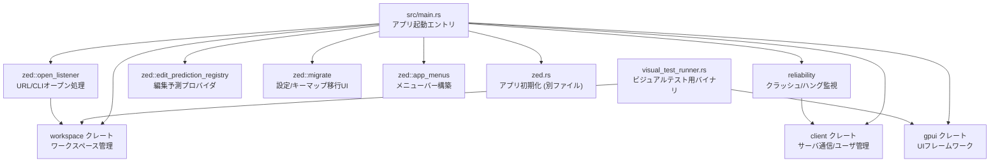

# crates/zed ディレクトリ

## 1. ざっくり一言

`crates/zed` は Zed エディタ本体のバイナリクレートです。  
GUI アプリケーション `zed` の起動・CLI 連携・ワークスペース復元・単一インスタンス制御・信頼性計測・一部開発用ツール（visual test runner など）をまとめて実装しています。

---

## 2. このモジュールの役割

### 2.1 概要

- このクレートは **Zed のアプリケーションプロセスを立ち上げるエントリポイント** です。
- 以下のような責務を担います。
  - コマンドライン引数の解釈と、各種モード（通常起動 / askpass / nc / crash handler / ETW 収集など）の切り替え
  - GPUI アプリケーション (`gpui::Application`) の初期化と、`workspace` / `client` / `project` など他クレートのセットアップ
  - 既存インスタンスへの CLI 経由のオープン要求転送 (`OpenListener` / `OpenRequest`)
  - クラッシュ・ハング検出と minidump / プロファイルの保存・アップロード（`reliability`）
  - 編集補完・AI 編集提案のプロバイダ登録（`edit_prediction_registry`）
  - 設定・キーマップの自動マイグレーション UI（`migrate`）
  - macOS 用のビジュアル回帰テストランナー（`visual_test_runner`）

### 2.2 アーキテクチャ内での位置づけ

主な内部モジュールと外部クレートの関係はおおよそ次のようになっています。



> 注: `zed.rs` やその他多くの UI / 機能クレートはこのチャンクには含まれていませんが、`main.rs` から初期化されます。

### 2.3 設計上のポイント

コードから読み取れる特徴をまとめます。

- **イベント駆動 / 非同期志向**
  - `gpui::Application` 上で **前景・背景の 2 種類の executor** を使い分け、UI スレッドとバックグラウンド処理を分離しています。
  - 非同期処理は `AsyncApp` / `gpui_tokio` / `smol` などでスケジュールされます。

- **グローバル状態の明示的な登録**
  - `AppState`（`workspace` クレート 定義）を `AppState::set_global` で登録し、多数のサブシステムから参照可能にしています。
  - `OpenListener`, `ThemeRegistry`, `GlobalKeyValueStore` なども `Global` 実装を通じてグローバル化されます。

- **プラットフォームごとの分岐**
  - `build.rs` で Linux の rpath や macOS のリンクオプション・Windows のリソース埋め込み（アイコン / conpty DLL）を設定。
  - ランタイムでも `cfg(target_os)` に応じて WSL / ETW / Flatpak 通知などを切り替えています。
  - `mac_only_instance.rs` による単一インスタンス制御は macOS 専用です。

- **単一インスタンス + CLI 経由での制御**
  - Linux/FreeBSD: Unix ドメインソケット (`listen_for_cli_connections`)。
  - macOS: TCP ローカルポート + ハンドシェイク文字列。
  - Windows: `windows_only_instance`（別ファイル）で制御。
  - どのプラットフォームでも、2 回目以降の起動は既存プロセスにオープン要求を転送する設計です。

- **信頼性とテレメトリ**
  - クラッシュ時の minidump 収集と Sentry へのアップロード (`reliability::upload_minidump`)。
  - ハング検出時のスレッドタイミングを `.miniprof.json` に保存し、`MAX_HANG_TRACES` 件までローテーション。
  - ビルド時間の内部計測 (`upload_build_timings`) も行います。

---

## 3. 主要な機能一覧

このディレクトリが提供する主な機能を列挙します。

- `zed` バイナリ
  - CLI 引数の解析 (`Args` struct)
  - 各種モード切り替え（askpass / crash handler / nc / ETW トレース / printenv / system_specs など）
  - GPUI アプリケーション / ワークスペース / テレメトリ / 各種 UI モジュールの初期化
  - 既存インスタンス検出と、URL・パスオープン要求の処理

- ワークスペース・ファイルオープン周り
  - `OpenListener`: URL/パス/diff 情報を非同期に受け取る窓口
  - `OpenRequest::parse`: `zed://…` / `ssh://…` / `zed-cli://…` / `zed://git/…` などの URL 文字列を解析
  - `open_paths_with_positions`: パス + 行/列情報のリストを開き、オプションで diff ビューを作成
  - `restore_or_create_workspace`: 起動時に前回セッション復元 / 最後のワークスペース復元 / 初回オンボーディング表示を選択

- 信頼性・クラッシュ関連（`reliability.rs`）
  - メインスレッドのハング検出と、タイミング情報を JSON (`*.miniprof.json`) として保存
  - 過去の minidump (`*.dmp`) + 付随 JSON の読み込みとアップロード
  - リモートプロジェクトから取得したクラッシュ情報のアップロード
  - 開発者向けのビルドタイム計測アップロード（feature flag でスタッフ向け）

- Visual regression tests（`visual_test_runner.rs` – macOS 専用）
  - `VisualTestAppContext` を使った決定的な UI レンダリング
  - プロジェクトパネル / エディタ / マルチワークスペースサイドバー / エラー表示など多数の UI コンポーネントのスクリーンショット比較
  - `UPDATE_BASELINE=1` でベースライン画像を更新

- メニューバー構築（`zed::app_menus`）
  - "Zed" / "File" / "Edit" / "Selection" / "View" / "Go" / "Run" / "Window" / "Help" 各メニューを定義
  - 各メニュー項目は `zed_actions` や `workspace` / `editor` / `debugger_ui` などのアクションを呼び出します

- 編集予測（AI 補完）プロバイダ登録（`zed::edit_prediction_registry`）
  - 設定 (`SettingsStore` / 言語別設定) に応じて Copilot / Zed 内蔵モデル / Codestral などのプロバイダを割り当て
  - エディタ生成時に該当するプロバイダを自動アタッチ
  - 設定変更・ユーザ情報更新時に既存エディタのプロバイダを更新

- 設定・キーマップのマイグレーション UI（`zed::migrate`）
  - `settings.json` / `keymap.json` に deprecated な設定が含まれている場合、ツールバーにバナーを表示
  - バナーの "Backup and Update" ボタン押下でバックアップファイルを作成し、新形式へ自動変換

- 単一インスタンス制御（`zed::mac_only_instance`）
  - macOS において、ユーザ ID・リリースチャンネルごとにポートを変える TCP リスナーを常駐
  - 2 回目以降の起動時には既存インスタンスへハンドシェイクを送り、重複起動を防止

- リソース / 補助スクリプト
  - `resources/flatpak/manifest-template.json`: Flatpak 用のビルド/パッケージングテンプレート
  - `resources/windows/sign.ps1`: Windows バイナリ署名のための PowerShell スクリプト（Trusted Signing のパラメータを環境変数から取得）
  - `resources/windows/zed.sh`: WSL 環境で `zed.exe` を呼び出すラッパースクリプト
  - `build.rs`: Linux/macOS/Windows 向けのリンクオプション設定・Git SHA / ビルド ID の埋め込み・conpty DLL の取得など

---

## 4. 関数・構造体の解説

### 4.1 主な型一覧

このチャンク内で定義され、他モジュールからも重要になりそうな型を整理します。

| 名前 | 定義ファイル | 種別 | 役割 / 用途 |
|------|--------------|------|-------------|
| `Args` | `src/main.rs` | 構造体 | `clap` による `zed` CLI の全引数定義。パス・diff・各種隠しモードを含む。 |
| `IdType` | `src/main.rs` | enum | `system_id` / `installation_id` が新規か既存かを区別するラッパー。 |
| `OpenRequest` | `src/zed/open_listener.rs` | 構造体 | `RawOpenRequest` + URL 解析結果を保持し、`handle_open_request` に渡すための中間表現。 |
| `OpenRequestKind` | 同上 | enum | `CliConnection` / `Extension` / `AgentPanel` / `GitClone` など、オープン要求の種類を表す。 |
| `RawOpenRequest` | 同上 | 構造体 | URL・diff パス・WSL 情報など、外部から渡される生のオープン要求。 |
| `OpenListener` | 同上 | 構造体（`Global`実装） | `RawOpenRequest` をメインスレッドに送る MPSC 送信側。アプリ全体の「開く」入口。 |
| `MigrationType` | `src/zed/migrate.rs` | enum | マイグレーション対象が `Keymap` か `Settings` かを区別。 |
| `MigrationBanner` | 同上 | 構造体 | ツールバーに表示される「バックアップして設定を更新」バナーのビュー状態。 |
| `MigrationEvent` | 同上 | enum | マイグレーション状態の変化（対象 / in-memory 移行かどうか）を通知するイベント。 |
| `MigrationNotification` | 同上 | 構造体 | グローバルに発火されるマイグレーション通知 (`EventEmitter`)。 |
| `IsOnlyInstance` | `src/zed/mac_only_instance.rs` | enum | 現プロセスが唯一のインスタンスかどうか (`Yes` / `No`)。 |
| `TestResult` | `src/visual_test_runner.rs` (macOS) | enum | ビジュアルテストの結果（パス / ベースライン更新パス）を表す。 |

> `AppState` など多くの重要な型は別クレート (`workspace` 等) に定義されており、本チャンクには出ていません。

### 4.2 重要な関数の詳細

#### 4.2.1 `fn main()`（`src/main.rs`）

**概要**

`zed` バイナリのエントリポイントです。  
CLI 引数を解釈し、各種特殊モードの処理を行った上で GPUI アプリケーションを立ち上げ、ワークスペースや各種サブシステムを初期化します。

**引数 / 戻り値**

- 引数: なし（`std::env::args` を通じて CLI にアクセス）
- 戻り値: `()`（エラー時は `process::exit` で終了コードを返す）

**内部処理の流れ（主要ステップ）**

1. 起動時間の記録 (`STARTUP_TIME`) と root 実行防止（Unix）。
2. `Args::parse()` で CLI 引数をパース。
3. 特殊モードのハンドリング:
   - `--askpass`（非 Windows）: `askpass::main` を起動して即終了。
   - `--crash-handler`: `crashes::crash_server` を起動。
   - Windows の `--record-etw-trace` / `--foreground`。
   - `--nc`: MCP 用の netcat 互換モード（`nc::main`）。
   - `--printenv`: 環境変数を JSON で出力。
   - `--dump_all_actions`: 全 GPUI アクションの JSON スキーマ出力。
4. ユーザデータディレクトリの上書き (`paths::set_custom_data_dir`)。
5. Windows で askpass 用の CLI パス設定。
6. 必要なディレクトリの作成 (`init_paths`) と失敗時の UI 通知 (`files_not_created_on_launch`)。
7. ログ / トレースの初期化（`zlog` / `ztracing`）。
8. アプリバージョン・コミット SHA・`system_specs` モードの処理。
9. Rayon スレッドプール構築。
10. Windows では conpty.dll の存在確認。
11. `Application::with_platform` で GPUI アプリケーション作成、`Assets` を登録。
12. AppDatabase・`system_id` / `installation_id` / `session` 非同期生成とクラッシュハンドラ初期化。
13. `OpenListener::new()` でオープン要求チャネルを作成し、単一インスタンスチェック（OS ごとに異なる）。
14. Git / FS / 設定ファイルウォッチャ・シェル環境ロードをセットアップ。
15. URL / 再オープン時コールバック（`app.on_open_urls` / `app.on_reopen`）を登録。
16. `app.run` のクロージャ内で:
    - 各種グローバル状態・サブシステム（設定・テーマ・プロジェクト・デバッガ・拡張など）の初期化。
    - テレメトリの開始とイベント送信。
    - `AppState` の構築とグローバル登録。
    - ほぼ全ての UI / 機能クレートの `init` 呼び出し。
    - `OpenListener` をグローバル登録し、最初の `open_rx.try_next()` から `OpenRequest` を生成、またはワークスペース復元。
    - 以降 `open_rx` を監視し、新たな URL / パスオープン要求を随時 `handle_open_request` に渡す。

**使用例（CLI）**

```bash
# 通常起動
zed

# ファイルを特定位置で開く（path:line:column）
zed src/main.rs:120:5

# ディレクトリをプロジェクトとして開く
zed ~/projects/my-app

# 2 ファイルの diff を開く
zed --diff old.rs new.rs
```

**Errors / Panics**

- パス初期化に失敗した場合: `files_not_created_on_launch` がエラーダイアログを表示し、アプリは終了します。
- Linux/FreeBSD でウィンドウを開けない場合: `fail_to_open_window` が標準エラーとデスクトップ通知を出し、`process::exit(1)` します。
- `GPUI` の `build_global()` は `unwrap()` を呼んでおり、スレッドプール構築に失敗すると panic になります（通常の環境では想定外）。

**エッジケース**

- `--system_specs` 指定時は UI を立ち上げず、システム情報を標準出力して即終了。
- `ZED_STATELESS` や `RELEASE_CHANNEL` 環境変数により、単一インスタンスチェックやパスの扱いが変化します。
- ターミナルが PTY でない場合はログをファイルに出力し、そうでない場合は stdout に出します。

**使用上の注意点**

- `zed` バイナリはサーバとしても振る舞うため、同一ユーザ・同一チャンネルで複数起動しても、2 回目以降は既存プロセスにオープン要求を転送して即終了する場合があります。
- `ZED_COMMIT_SHA` / `ZED_BUILD_ID` は `build.rs` から埋め込まれます。再現性のあるビルドでは環境変数で上書き可能です。

---

#### 4.2.2 `pub(crate) async fn restore_or_create_workspace(app_state: Arc<AppState>, cx: &mut AsyncApp) -> Result<()>`（`main.rs`）

**概要**

起動時に **どのワークスペースを開くか** を決定し、必要に応じてオンボーディング画面や空ワークスペースを作成します。

**引数**

| 引数名 | 型 | 説明 |
|--------|----|------|
| `app_state` | `Arc<AppState>` | クライアント・ファイルシステム・ユーザ・言語レジストリなどをまとめたアプリケーション状態。 |
| `cx` | `&mut AsyncApp` | 非同期 GPUI アプリケーションコンテキスト。DB アクセスなどを行う。 |

**戻り値**

- `Result<()>` – エラー時には `anyhow::Error` を返し、呼び出し元で `fail_to_open_window_async` が通知を行います。

**処理の流れ**

1. `KeyValueStore::global` を取得し、過去に起動したことがあるか (`FIRST_OPEN` キー) を確認。
2. `restorable_workspaces` を呼び出し、復元可能なローカル・リモートワークスペース情報を取得。
3. ローカルの `SerializedMultiWorkspace` ごとに `restore_multiworkspace` を実行し、各ウィンドウグループ内のワークスペースを復元。
4. リモートの `SessionWorkspace` ごとに `open_remote_project` を非同期で起動。
5. すべての復元タスクを `future::join_all` で待機し、エラーがあればログ出力＆カウント。
6. エラー数に応じてトースト通知用のメッセージを組み立て、どこかのワークスペースでトースト表示を試みる。
   - どのウィンドウも開けていない場合には、空のワークスペースを新規に開き、そこでトーストを表示。
7. `restorable_workspaces` が `None` の場合:
   - `FIRST_OPEN` が未設定であれば `show_onboarding_view` でオンボーディング画面を開く。
   - それ以外の場合は `workspace::open_new` で空のワークスペースを作成し、初期エディタを開くかどうかを `WorkspaceSettings::restore_on_startup` に応じて決める。

**使用例（擬似コード）**

```rust
// app.run(...) 内などから
cx.spawn({
    let app_state = app_state.clone();
    async move |cx| {
        if let Err(e) = restore_or_create_workspace(app_state, cx).await {
            fail_to_open_window_async(e, cx);
        }
    }
}).detach();
```

**エッジケース**

- 前回セッションが存在しない状態で `RestoreOnStartupBehavior::LastSession` が設定されている場合は、自動的に `LastWorkspace` にフォールバックします。
- リモートワークスペースの復元は `RemoteSettings` に依存するため、接続先設定が変更されていると失敗する可能性があります。

**使用上の注意点**

- この関数は UI スレッドと DB / FS アクセスを組み合わせるため、必ず `AsyncApp` 上で呼び出し、UI 更新は `cx.update` 経由で行います。
- エラーはまとめて `Result` に返されますが、個別の復元エラーはログとトーストで通知されるため、呼び出し側で個別に処理する必要はありません。

---

#### 4.2.3 `impl OpenRequest { pub fn parse(request: RawOpenRequest, cx: &App) -> Result<Self> }`（`zed/open_listener.rs`）

**概要**

`RawOpenRequest`（URL 文字列や diff 情報を含む生のオープン要求）を解析し、  
`OpenRequest`（種別・パス・リモート接続情報を正規化したもの）へ変換します。

**引数**

| 引数名 | 型 | 説明 |
|--------|----|------|
| `request` | `RawOpenRequest` | URL のリスト、diff ペア、WSL 情報などを含む未解析の要求。 |
| `cx` | `&App` | GPUI アプリケーション。`RemoteSettings` や `parse_zed_link` などに利用。 |

**戻り値**

- `Result<OpenRequest>` – 成功時には解析済みの `OpenRequest`。URL フォーマットエラーなどで `Err`。

**URL パターンと処理**

`request.urls` を順に処理し、以下のようなパターンマッチを行います。

- `zed-cli://<server_name>`
  - CLI IPC サーバへの接続 (`connect_to_cli`) を行い、`OpenRequestKind::CliConnection` を設定。
- `zed-dock-action://<index>`
  - Dock メニューインデックスを `usize` としてパースし、`DockMenuAction` を設定。
- `file://...` / `zed://file...`
  - `parse_file_path` で URL デコードし、`open_paths` に積む。
- `zed://ssh...` / `ssh://...`
  - `parse_ssh_file_path` で `RemoteConnectionOptions::Ssh` を構築し、`remote_connection` にセット。ローカルパスと同時指定は禁止。
- `zed://extension/<id>`
  - `OpenRequestKind::Extension` として拡張機能ビューを開く。
- `zed://agent/shared/<uuid>`
  - 有効な UUID の場合 `OpenRequestKind::SharedAgentThread` に変換。
- `zed://agent?...`
  - `parse_agent_url` で外部ソース・プロンプトを抽出し、`AgentPanel` を開くための kind を設定。
- `zed://schemas/<path>`
  - `BuiltinJsonSchema` として組み込み JSON Schema ビューを開く。
- `zed://settings` / `zed://settings/<path>`
  - 設定 UI を開き、必要に応じて特定のパスにジャンプ。
- `zed://git/clone?...`
  - `parse_git_clone_url` で `repo` クエリパラメータを抽出し、`GitClone` kind を設定。
- `zed://git/commit/<sha>?repo=<path>`
  - `parse_git_commit_url` で commit SHA と repo パスを抽出し、`open_paths` と `GitCommit` kind を設定。
- `https://zed.dev/...` 等で `parse_zed_link` にマッチするもの
  - チャンネル参加 / ノートオープン用の `join_channel` / `open_channel_notes` を設定。

**エッジケース**

- `ssh://` URL とローカルパスを同時に指定すると、`"cannot open both local and ssh paths"` というエラーで失敗します。
- `zed://git/commit` のクエリに `repo` がない、あるいは空の場合はエラーになります。
- `zed://agent/shared/` の ID が UUID 形式でない場合はログにエラーを出し、kind は `None` のままになります。

**使用例**

```rust
let raw = RawOpenRequest {
    urls: vec!["zed://git/commit/abc123?repo=/path/to/repo".into()],
    ..Default::default()
};

let open_req = OpenRequest::parse(raw, cx)?;
assert!(matches!(open_req.kind, Some(OpenRequestKind::GitCommit { .. })));
assert_eq!(open_req.open_paths, vec!["/path/to/repo"]);
```

**使用上の注意点**

- `OpenRequest::parse` は **最初の URL で `kind` を決め、その後の URL は主にパスリストに追加** していきます。複数の `kind` を同時に指定することは想定されていません。
- `parse_ssh_file_path` は `RemoteSettings::get_global` に依存するため、テストでは適切な設定の初期化が必要です。

---

#### 4.2.4 `pub async fn open_paths_with_positions(...)`（`zed/open_listener.rs`）

```rust
pub async fn open_paths_with_positions(
    path_positions: &[PathWithPosition],
    diff_paths: &[[String; 2]],
    diff_all: bool,
    app_state: Arc<AppState>,
    open_options: workspace::OpenOptions,
    cx: &mut AsyncApp,
) -> Result<(WindowHandle<MultiWorkspace>, Vec<Option<Result<Box<dyn ItemHandle>>>>)>
```

**概要**

パスと行/列情報（`PathWithPosition`）のリスト・diff ペアを受け取り、  
適切な `MultiWorkspace` ウィンドウを開いてファイル・diff ビューを表示します。  
結果として、開かれたウィンドウハンドルと各アイテムのオープン結果を返します。

**主な引数**

| 引数名 | 型 | 説明 |
|--------|----|------|
| `path_positions` | `&[PathWithPosition]` | パスとオプションの行・列情報。`derive_paths_with_position` などで生成。 |
| `diff_paths` | `&[[String; 2]]` | 2 要素配列のリスト。各要素が diff の旧ファイル / 新ファイルパス。 |
| `diff_all` | `bool` | `true` の場合、ディレクトリ diff や複数ファイル diff を一括表示する MultiDiff モード。 |
| `app_state` | `Arc<AppState>` | ワークスペースを開くために必要なアプリケーション状態。 |
| `open_options` | `OpenOptions` | 新規ウィンドウを開くか、既存を再利用するか、などのオプション。 |
| `cx` | `&mut AsyncApp` | 非同期 GPUI コンテキスト。 |

**戻り値**

- `WindowHandle<MultiWorkspace>`: 対象のマルチワークスペースウィンドウ。
- `Vec<Option<Result<Box<dyn ItemHandle>>>>`:
  - `Vec` の長さは `path_positions` と同じ。
  - 各要素は「そのパスを開く際の結果（成功なら `Box<dyn ItemHandle>`）」または `None`（何も開かれなかった）を表す。

**処理の流れ**

1. `path_positions` からパスだけを取り出し `Vec<PathBuf>` を作成。
2. `workspace::open_paths` を呼び出し、パス群に対応するワークスペース / ファイル / エディタを開く。
3. 戻り値 `OpenResult` から `MultiWorkspace` ハンドルと `opened_items` を取得。
4. `diff_all` が `true` かつ `diff_paths` が非空なら:
   - `MultiDiffView::open` を呼び出し、マルチ diff ビューを開いて `items` に追加。
5. そうでなければ、`diff_paths` を 1 ペアずつ `FileDiffView::open` で開く。
6. `items` の `Err` をラップして `"error opening {path:?}: {error}"` のようにメッセージを補強。
7. `items` のクローンを作成し、中身の `ItemHandle` を取り出して `navigate_to_positions` を呼び出し、行/列情報に応じてカーソル位置やスクロール位置を調整。

**エッジケース**

- diff 表示で `Path::canonicalize` に失敗すると、その diff ビューの作成に失敗し、エラーメッセージが `items` に記録されます。
- `navigate_to_positions` は `items` に対応する `ItemHandle` が `None` の場合はスキップします。

**使用例（簡略版）**

```rust
let paths_with_pos = derive_paths_with_position(fs, vec!["src/main.rs:10:1"]).await;
let (window, items) = open_paths_with_positions(
    &paths_with_pos,
    &[],
    false,
    app_state.clone(),
    OpenOptions::default(),
    &mut cx,
).await?;
```

**使用上の注意点**

- この関数は **既存ウィンドウを再利用するか新規に作るか** を `open_options` に委ねます。CLI などから呼び出す場合は、`OpenOptions::open_new_workspace` / `requesting_window` に注意が必要です。
- `diff_paths` にディレクトリを渡す場合は、呼び出し元で `diff_all` を適切に設定することが前提になっています。

---

#### 4.2.5 `pub fn init(client: Arc<Client>, cx: &mut App)`（`reliability.rs`）

**概要**

Zed の信頼性・クラッシュ関連の機能を初期化します。  
ハング監視・minidump アップロード・リモートクラッシュファイル取得・ビルドタイム計測のアップロードなどを行います。

**引数**

| 引数名 | 型 | 説明 |
|--------|----|------|
| `client` | `Arc<Client>` | サーバへの HTTP リクエストやテレメトリに使う Zed クライアント。 |
| `cx` | `&mut App` | GPUI アプリケーションコンテキスト。イベント購読やバックグラウンドタスク起動に利用。 |

**戻り値**

- なし（副作用のみ）

**処理の流れ**

1. デバッグビルドかどうかを確認し、release ビルドであれば `monitor_hangs` を実行。
2. `cx.on_flags_ready` で feature flags の読み込み完了時にコールバックを登録:
   - スタッフ (`is_staff`) の場合、`upload_build_timings` をバックグラウンドで実行。
3. テレメトリ設定で diagnostics が有効な場合:
   - `upload_previous_minidumps` をバックグラウンドで実行し、ログディレクトリ内の `.dmp` + `.json` をアップロード後、削除。
4. 新しい `Project` が作られたときに `cx.observe_new` 経由で購読:
   - リモートプロジェクト (`remote_client` が存在) の場合、`proto::GetCrashFiles` を呼び出してサーバ側に保存されたクラッシュファイル一覧を取得。
   - 各 `CrashReport` を `upload_minidump` でアップロード。

**使用例（`main` 内）**

```rust
reliability::init(client.clone(), cx);
```

**エッジケース**

- `MINIDUMP_ENDPOINT` が未設定の場合、minidump 関連処理はログに警告を出して即終了します。
- minidump / JSON メタデータが壊れている場合、そのファイルはスキップされ、アップロードされません。

**使用上の注意点**

- `upload_minidump` は HTTP リクエストで Sentry 互換の endpoint に multipart/form-data を送信します。  
  サーバ側の仕様変更に敏感な部分なので、エラーメッセージに含まれるレスポンスボディが重要です。
- ハング監視は `BackgroundExecutor` のタイマーと MPSC チャネルの backpressure を利用しているため、異常に重いバックグラウンド処理があると「ハング」と誤判定される可能性があります。

---

#### 4.2.6 `#[cfg(target_os = "macos")] fn run_visual_tests(project_path: PathBuf, update_baseline: bool) -> Result<()>`（`visual_test_runner.rs`）

**概要**

macOS 専用のビジュアル回帰テストランナーです。  
テスト用プロジェクトを開いた Zed UI を `VisualTestAppContext` 上で描画し、スクリーンショットを基準画像と比較します。

**引数**

| 引数名 | 型 | 説明 |
|--------|----|------|
| `project_path` | `PathBuf` | テスト用 Rust プロジェクトのパス（`create_test_files` で生成されたもの）。 |
| `update_baseline` | `bool` | `true` の場合は比較ではなくベースライン画像を更新する。 |

**戻り値**

- `Result<()>` – 1 つでもテストが失敗すると `Err("N tests failed")` のようなエラーを返す。

**処理の流れ（簡略化）**

1. `VisualTestAppContext::with_asset_source` で macOS Metal ベースのテストコンテキストを作成。
2. フォント・設定ストア・`AppState` をテスト用に初期化 (`init_app_state`)。
3. `workspace::Workspace` と `ProjectPanel` などを実際に構築し、`project_path` を worktree として追加。
4. `main.rs` を開き、ウィンドウをレンダリング。
5. 次のような複数のテストシナリオを順に実行し、それぞれ `run_visual_test` でスクリーンショットを比較:
   - `project_panel`
   - `workspace_with_editor`
   - `multi_workspace_sidebar`（サイドバー UI）
   - `error_message_wrapping`（長いエラーメッセージの折り返し）
   - `agent_thread_with_image_*`（AI エージェントスレッドビュー）
   - `breakpoint_hover_*`（ブレークポイントホバー表示）
   - `diff_review_*`（差分レビュー UI）
   - `thread_item_icon_decorations`
   - `settings_ui_*` / `tool_permissions_settings` など
6. 各テストごとに `TestResult` を集計し、合格/失敗数とベースライン更新数をまとめて出力。
7. 終了前に worktree・ウィンドウをクリーンアップし、残っているバックグラウンドタスクを一定時間進行させる。

**使用例（CLI）**

```bash
# ビジュアルテスト実行
cargo run -p zed --bin zed_visual_test_runner --features visual-tests

# UI 変更後にベースラインを更新
UPDATE_BASELINE=1 \
  cargo run -p zed --bin zed_visual_test_runner --features visual-tests
```

**エッジケース**

- Metal / VisualTestAppContext が利用できない環境（非 macOS）では、`main` が「macOS のみ」とメッセージを出して `exit(1)` します。
- アニメーション・ツールチップなど時間依存の UI は `advance_clock` を使って決定的に表示時刻を制御しています。  
  そのため、テストコード側の待機時間 (`TOOLTIP_SHOW_DELAY` など) に変更が入るとベースラインとの差異が出る可能性があります。

**使用上の注意点**

- テストは実際のファイルシステム・Git・外部プロセス（`git` コマンド）を使用します。  
  テストを再現するには Git が利用可能である必要があります。
- 生成されるスクリーンショット・diff 画像は `VISUAL_TEST_OUTPUT_DIR`（デフォルト `target/visual_tests`）に保存されます。

---

#### 4.2.7 `pub fn init(client: Arc<Client>, user_store: Entity<UserStore>, cx: &mut App)`（`zed/edit_prediction_registry.rs`）

**概要**

エディタに対する「編集予測」（AI 補完に近い機能）のプロバイダを、  
ユーザ設定や言語設定に基づいて自動的に割り当て・更新するためのエントリポイントです。

**引数**

| 引数名 | 型 | 説明 |
|--------|----|------|
| `client` | `Arc<Client>` | サーバ接続や HTTP クライアントを提供するクライアント。 |
| `user_store` | `Entity<UserStore>` | ログインユーザ情報・権限を管理するストア。 |
| `cx` | `&mut App` | GPUI アプリケーションコンテキスト。 |

**戻り値**

- なし（副作用のみ）

**処理の流れ**

1. `EditPredictionStore::global` を初期化し、`client` / `user_store` と紐付け。
2. 新しい `Editor` が作成されたときのフックを登録（`cx.observe_new`）:
   - フルエディタモード（`editor.mode().is_full()`）のみ対象。
   - 古い Copilot 用アクション名を新しいアクションにマッピングする互換アクションを登録。
   - エディタの `WeakEntity` と対応するウィンドウハンドルを内部の `HashMap` に保存。
   - 現在の設定 (`SettingsStore` / 言語設定) から `EditPredictionProviderConfig` を計算し、`assign_edit_prediction_provider` でプロバイダを割り当て。
3. `cx.on_action(clear_edit_prediction_store_edit_history)` を登録し、明示的な「履歴クリア」アクションを処理。
4. `user_store` に対する `cx.subscribe` を登録:
   - `PrivateUserInfoUpdated` イベント時に **最新の provider 設定** を再計算し、すべてのエディタに再適用。
5. `SettingsStore` に対する `cx.observe_global` を登録:
   - 設定変更ごとに `edit_prediction_provider_config_for_settings` を再評価。
   - 設定が変わった場合、テレメトリイベント `"Edit Prediction Provider Changed"` を送信し、全エディタにプロバイダを再割当て。

**プロバイダの選択ロジック（`edit_prediction_provider_config_for_settings`）**

- `EditPredictionProvider::None` → プロバイダ無し (`None`)。
- `Copilot` → `EditPredictionProviderConfig::Copilot`。
- `Zed` → Zed 内蔵モデル `Zeta`。
- `Codestral` → `CodestralEditPredictionDelegate`。
- `Ollama` / `OpenAiCompatibleApi` → モデル名と `prompt_format` に基づき
  - `Zeta` / FIM 形式 (`EditPredictionModel::Fim`) を選択。
  - 推論に失敗した場合は `None`（プロバイダ無し）。
- `Mercury` → `EditPredictionModel::Mercury`。
- `Experimental(_)` → 現状 `None`（無効化）。

**エッジケース**

- プロジェクトに紐付いていないエディタ (`editor.project()` が `None`) では、Zed モデルの provider を設定しません。
- `Codestral` プロバイダ選択時には、`load_codestral_api_key` を呼び出して API キー読込を非同期で開始しますが、キーが設定されていない場合は実際のリクエスト時に失敗する可能性があります。
- テストコード `test_subscribe_uses_stale_provider_config_after_settings_change` では、設定変更後に `PrivateUserInfoUpdated` が発火しても **最新の provider 設定が使われ続けること** を検証しています。

**使用例（初期化側）**

```rust
let user_store = cx.new(|cx| UserStore::new(client.clone(), cx));
edit_prediction_registry::init(client.clone(), user_store, cx);
```

**使用上の注意点**

- エディタのライフサイクルに合わせて `WeakEntity<Editor>` を `HashMap` に保存しているため、`Editor` 解放時に `on_release` で必ずエントリを削除しています。  
  新しい消費コードを追加する場合、この前提を壊さないよう注意が必要です。
- モデル名からの `prompt_format` 推論 (`infer_prompt_format`) はいくつかのプレフィックスベースのヒューリスティクのみ実装されており、未知のモデル名では `None` を返します。

---

### 4.3 その他の関数・ユーティリティ一覧

| 関数名 | 定義ファイル | 役割（1 行） |
|--------|--------------|--------------|
| `files_not_created_on_launch` | `main.rs` | 必要なディレクトリ作成に失敗した場合、エラーダイアログを表示して終了。 |
| `fail_to_open_window` / `_async` | `main.rs` | ウィンドウオープン失敗時に標準エラー出力と Linux/FreeBSD のデスクトップ通知を行う。 |
| `stdout_is_a_pty` | `main.rs` | 標準出力が TTY かどうかと `FORCE_CLI_MODE` を組み合わせ、ログ出力先の判断に使う。 |
| `system_id` / `installation_id` | `main.rs` | グローバル KVP ストアを使ってシステム/インストール ID を生成・保存。 |
| `restorable_workspaces` / `restorable_workspace_locations` | `main.rs` | 起動時に復元すべきワークスペースとその配置（ローカル/リモート）を決定。 |
| `init_paths` | `main.rs` | `paths::config_dir()` など複数ディレクトリを作成し、失敗したパスを `ErrorKind` ごとに集計。 |
| `monitor_hangs` / `save_hang_trace` | `reliability.rs` | メインスレッドのハング状態を検知し、`.miniprof.json` にタイミング情報を保存。 |
| `upload_previous_minidumps` | `reliability.rs` | ローカル log ディレクトリ内の minidump ファイルを Sentry エンドポイントへアップロード。 |
| `listen_for_cli_connections` | `open_listener.rs` (Linux/FreeBSD) | Unix ドメインソケット経由で CLI からの URL を受け取り `OpenListener` に転送。 |
| `handle_cli_connection` | `open_listener.rs` | CLI IPC (`CliRequest`) から届いたオープン要求をパースし、エディタに反映。 |
| `open_workspaces` / `open_local_workspace` | `open_listener.rs` | CLI の `--wait` や `--reuse` 相当のオプションを解釈し、必要なワークスペースを開く。 |
| `derive_paths_with_position` | `open_listener.rs` | `"path:line:row"` 形式を `PathWithPosition` に変換し、実在ファイル優先で補正。 |
| `ensure_only_instance` / `check_got_handshake` | `mac_only_instance.rs` | macOS 用の単一インスタンス制御。ポートとハンドシェイク文字列で重複起動を防止。 |

---

## 5. データフロー

ここでは、**CLI からファイルを開く** 典型パスのデータフローを示します。

1. ユーザが `zed src/main.rs:10:5` を実行。
2. `main` が `Args::parse` で `paths_or_urls` を取得。
3. `parse_url_arg` により `"src/main.rs:10:5"` が `file://<絶対パス>` 形式に正規化される。
4. `OpenListener::new()` で作ったチャネルに `RawOpenRequest` を送信。
5. `open_rx` を受信した `app.run` 内のコードが `OpenRequest::parse` で URL を解析。
6. 解析済み `OpenRequest` を `handle_open_request` に渡し、`open_paths_with_positions` で実際にエディタを開く。

これをシーケンス図にすると次のようになります。

```mermaid
sequenceDiagram
    participant User as ユーザ
    participant CLI as zed バイナリ(main)
    participant App as gpui::Application
    participant OL as OpenListener
    participant OLMod as OpenRequest/handle_open_request
    participant WS as Workspace/MultiWorkspace

    User->>CLI: zed src/main.rs:10:5
    CLI->>CLI: Args::parse() / parse_url_arg()
    CLI->>OL: OpenListener::open(RawOpenRequest{urls:[file://...]})
    Note right of OL: mpsc::unbounded で送信

    App->>App: app.run(|cx| { ... let (_, open_rx) = OpenListener::new(); ... })
    App->>App: open_rx.try_next()
    App->>OLMod: OpenRequest::parse(RawOpenRequest, &App)
    OLMod->>OLMod: kind / open_paths / remote_connection を決定

    OLMod->>WS: handle_open_request(OpenRequest, AppState, &mut App)
    WS->>WS: open_paths_with_positions(&PathWithPosition, ...)
    WS-->User: エディタウィンドウで src/main.rs を10行目付近に表示
```

このフローの中で、リモート URL / diff / dev container 等を含む場合もありますが、基本構造は同様で、`OpenRequest` が一元的に解釈されます。

---

## 6. 使い方（How to Use）

### 6.1 基本的な使用方法

#### 6.1.1 `zed` バイナリとしての利用

最も一般的な利用は、Zed をコードエディタとして起動し、ファイルやディレクトリを開くことです。

```bash
# デフォルト起動（前回プロジェクトの復元設定に従う）
zed

# 特定ファイルを開く
zed path/to/file.rs

# 行・列指定で開く
zed path/to/file.rs:120:5

# ディレクトリをプロジェクトとして開く
zed path/to/project

# 2 つのファイルを diff 表示
zed --diff old/file.rs new/file.rs
```

#### 6.1.2 URL 経由での深いリンク

`OpenRequest::parse` により、`zed://` スキームを使った深いリンクが扱えます。  
ブラウザや別アプリから Zed を呼び出す場合の利用が想定されます。

例（イメージ、実際には OS の URL ハンドラ設定が必要です）:

```text
zed://settings              # 設定画面を開く
zed://settings/editor       # editor 関連の設定にジャンプ
zed://git/clone/?repo=...   # Git リポジトリを clone して開く
zed://agent?prompt=...      # Agent パネルを指定プロンプトで開く
```

#### 6.1.3 Visual test runner

macOS 上で UI のビジュアル回帰テストを実行するには、`visual-tests` feature を有効にして専用バイナリを起動します。

```bash
# テスト実行
cargo run -p zed --bin zed_visual_test_runner --features visual-tests

# 基準画像の更新
UPDATE_BASELINE=1 \
  cargo run -p zed --bin zed_visual_test_runner --features visual-tests
```

### 6.2 よくある使用パターン

#### 6.2.1 CLI からの `--wait` 相当の挙動

`open_listener.rs` には CLI サーバ (`cli` クレート) からのリクエストとして `wait: bool` が渡ってきた場合、  
ファイルやワークスペースが閉じられるまでブロックするロジックが含まれています (`open_local_workspace`)。

これにより、外部ツールから

- Zed でファイルを開く
- ユーザがファイルを閉じるまで待つ

といったフローを構成することができます（具体的な CLI オプション名は `cli` クレート側に定義されています）。

#### 6.2.2 SSH / WSL 経由でのリモートプロジェクトオープン

- Linux/FreeBSD で `ssh://user@host:/path` 形式の URL を渡すと、`RemoteConnectionOptions::Ssh` が構築され、  
  `open_remote_project` を通じてリモートプロジェクトが開かれます。

- Windows では CLI 引数 `--wsl USER@DISTRO` から `RemoteConnectionOptions::Wsl` がセットされ、  
  WSL のパスを対象としたオープンが行われます（`Args` 定義参照）。

#### 6.2.3 設定・キーマップマイグレーション

設定ファイルやキーマップファイルが古い書式を使っている場合、  
該当ファイルをエディタで開いたときに `MigrationBanner` がツールバーに表示されます。

```rust
// MigrationBanner 内でのボタンクリック時
Button::new("backup-and-migrate", "Backup and Update").on_click({
    let workspace = self.workspace.clone();
    move |_, window, cx| {
        let fs = <dyn Fs>::global(cx);
        let task = match migration_type {
            Some(MigrationType::Keymap) => {
                cx.background_spawn(write_keymap_migration(fs.clone()))
            }
            Some(MigrationType::Settings) => {
                cx.background_spawn(write_settings_migration(fs.clone()))
            }
            None => unreachable!(),
        };
        task.detach_and_notify_err(workspace.clone(), window, cx);
    }
})
```

### 6.3 使用上の注意点（まとめ）

- **ローカルパスと SSH パスの混在禁止**  
  `OpenRequest::parse` は `ssh://` を含むリクエストとローカルパスを同時に扱うことを許可していません。  
  リモートとローカルを同時に開きたい場合は、リクエストを分ける必要があります。

- **`:line:column` 書式と実在ファイル**  
  `derive_paths_with_position` は非 Windows 環境で、`"path:line:row"` の `path` 部分が実在ファイルである場合、  
  行・列指定を無視して単純なパスとして扱います（NTFS alternate data stream との衝突回避のための仕様）。  
  コロンを含むパス名を使用する場合はこの挙動に注意が必要です。

- **単一インスタンス前提の設計**  
  macOS / Linux / Windows いずれの実装も、同一ユーザ・同一チャンネルでの多重起動は基本的に既存プロセスへのオープン要求に変換されます。  
  そのため、外部ツールから `zed` を複数回呼び出した場合でも、1 つの Zed プロセスがそれらを順次処理する前提になっています。

- **ビジュアルテストは macOS のみ**  
  `visual_test_runner` は `#[cfg(target_os = "macos")]` でガードされており、他 OS ではスタブ `main` が `exit(1)` します。

- **minidump アップロードの前提**  
  `MINIDUMP_ENDPOINT` が設定されていない場合、クラッシュレポートは収集されますがサーバには送信されません。  
  社内運用や自前サーバで利用する場合は、この環境変数の設定が必要です。

---

## 7. 関連ファイル

このディレクトリおよび周辺で、本チャンクと密接に関係するファイル・ディレクトリです。

| パス | 役割 / 関係 |
|------|------------|
| `crates/zed/Cargo.toml` | このクレートの設定。`zed` / `zed_visual_test_runner` の bin 定義と、膨大なワークスペース依存クレートの一覧を持つ。 |
| `crates/zed/build.rs` | Linux/macOS/Windows 向けビルドスクリプト。rpath 設定・Git SHA 埋め込み・conpty DLL ダウンロード・Windows リソース埋め込みなど。 |
| `crates/zed/resources/flatpak/manifest-template.json` | Flatpak パッケージのテンプレート。`APP_ID` などを `envsubst` で埋め込んで利用。 |
| `crates/zed/resources/windows/sign.ps1` | Windows バイナリを Trusted Signing 経由で署名するための PowerShell スクリプト。各種パラメータを環境変数から取得。 |
| `crates/zed/resources/windows/zed.sh` | WSL 環境で `zed.exe` を呼び出すシェルスクリプト。`WSL_DISTRO_NAME` を用いて `--wsl` 引数を構築。 |
| `crates/zed/src/zed.rs` | `main.rs` から `zed::init` などで呼ばれるメインモジュール。ワークスペース・UI の詳細初期化を担当（本チャンクには内容が含まれていません）。 |
| `crates/workspace` | `AppState` / `Workspace` / `MultiWorkspace` / `WorkspaceDb` など、プロジェクト・ウィンドウ管理の中心クレート。`main.rs` や `open_listener.rs` から多用されています。 |
| `crates/client` | `Client` / `UserStore` / テレメトリ / サーバ API を提供。`reliability` や `edit_prediction_registry` で利用。 |
| `crates/agent_ui` / `crates/agent` | AI エージェントの UI / ロジック。`visual_test_runner` や `OpenRequestKind::AgentPanel` から参照。 |
| `crates/git_ui` | diff ビュー (`FileDiffView` / `MultiDiffView`) や commit ビュー。`open_listener.rs` から diff 表示に使用。 |
| `crates/settings` / `crates/migrator` | 設定ファイルの管理とマイグレーションロジック。`zed::migrate` から利用。 |

> `crates/zed/src/zed/telemetry_log.rs` や `visual_tests.rs` など他のファイルも `main.rs` から初期化されていますが、このチャンクには内容が含まれていないため詳細は不明です。

以上が、このチャンクに含まれる `crates/zed` ディレクトリの構造と主な振る舞いです。
