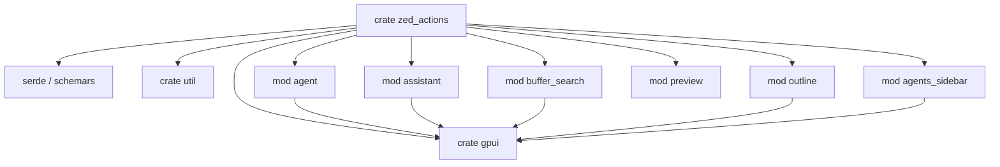
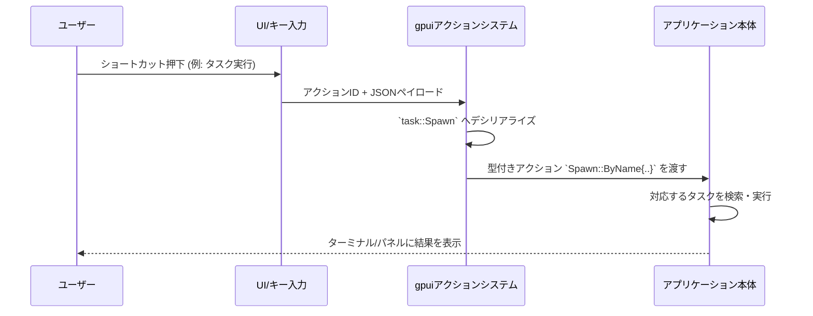

この回答では `crates/zed_actions` ディレクトリ（`Cargo.toml` と `src/lib.rs`）について解説します。

---

## 0. ざっくり一言

`zed_actions` クレートは、Zed アプリケーション内で使われる **各種アクション（コマンド）の型と名前空間** をまとめて定義するためのクレートです。UI 操作・Git・タスク実行・AI エージェント・プレビューなどの機能を、`gpui::Action` ベースで型安全に表現する「宣言集」です。

---

## 2. このモジュールの役割

### 2.1 概要

- このディレクトリは、Zed の UI 全体で使用される **アクション ID と、そのペイロード構造体** を一括定義する役割を持ちます。
- アクションは `gpui::Action` 派生や `actions!` マクロによって登録され、キー割り当てやコマンドパレットなどから呼び出される前提の設計になっています。
- すべてのアクション型は `serde::Deserialize` / `schemars::JsonSchema` を実装しており、JSON からの復元やスキーマ生成を通じて、設定ファイルや外部からの入力と連携できるようになっています。

### 2.2 アーキテクチャ内での位置づけ

- 外部クレート依存:
  - `gpui`: `Action` トレイトと `actions!` マクロを提供する UI フレームワーク的なクレート。
  - `serde`, `schemars`: JSON シリアライズ/デシリアライズと JSON スキーマ生成。
  - `util`: `util::serde::default_true` のみ使用（`buffer_search::Deploy::focus` のデフォルト値に利用）。
  - `uuid`: `assistant::OpenRulesLibrary` で UUID 型を利用。
- 内部構造:
  - `src/lib.rs` 一つのファイルの中に、多数のサブモジュール（`editor`, `agent`, `assistant`, `buffer_search`, `preview` など）が定義されています。
  - 各サブモジュールは概ね「機能領域」ごとにアクションをグルーピングしており、名前空間（`namespace`）もそれに合わせて設定されています。

代表的なモジュール間・クレート間依存を図にすると、次のようになります。



> この図は、`zed_actions` がどの機能モジュールと外部クレートに依存しているかを大まかに示しています。実際のハンドラ（アクションを受けて処理するコード）は、このチャンクには登場しません。

### 2.3 設計上のポイント

- **宣言中心・ロジック最小**  
  - ほとんどが `struct` / `enum` の定義と `actions!` マクロ呼び出しで構成されており、複雑な処理ロジックは含まれていません。
- **`gpui::Action` による統一されたアクションモデル**  
  - `#[derive(Action)]` と `actions!` マクロにより、アクションの登録・名前空間・エイリアス管理を統一的に扱える構造です。
- **JSON 入力を前提とした設計**  
  - 多くのアクションに `#[serde(deny_unknown_fields)]` が付いており、想定外のフィールドを含む JSON はエラーになります。
  - `#[serde(default)]` / `#[serde(skip)]` / `#[serde(untagged)]` といった属性により、「外部から指定できる項目」と「コード内からのみ設定される項目」が明確に分かれています。
- **「リンク切り防止」のための `init()`**  
  - 冒頭コメントと `pub fn init() {}` があり、バイナリ側でこの関数を呼ぶことで「このクレートが何も使われないと最適化で落ちてしまう」ことを防ぐ用途であると明記されています。

---

## 3. 主要な機能一覧

このクレートが定義している主なアクション群を、機能カテゴリごとにまとめます。

- 一般 UI / 設定関連
  - `OpenSettings`, `OpenSettingsFile`, `OpenProjectSettings`
  - `OpenDefaultKeymap`, `OpenKeymapFile`, `OpenKeymap`
  - `OpenAccountSettings`, `OpenServerSettings`
  - `OpenOnboarding`, `OpenZedPredictOnboarding`, `OpenGitIntegrationOnboarding`
  - `OpenSettingsAt`（特定設定パスにジャンプ）
- ブラウザ / URL
  - `OpenBrowser`（既定ブラウザで URL オープン）
  - `OpenZedUrl`（`zed://` URL をアプリ内でオープン）
- 拡張機能・ACP 関連
  - `Extensions`（拡張マネージャを開く、カテゴリ/ID 絞り込み付き）
  - `AcpRegistry`（ACP レジストリを開く）
- フォントサイズ / ズーム
  - `DecreaseBufferFontSize`, `IncreaseBufferFontSize`, `ResetBufferFontSize`
  - `DecreaseUiFontSize`, `IncreaseUiFontSize`, `ResetUiFontSize`
  - `ResetAllZoom`
- エディタ / パネル操作
  - `editor` モジュール: `MoveUp`, `MoveDown`, `RevealInFileManager`
  - `project_panel`: `Toggle`, `ToggleFocus`
  - `debug_panel`: `Toggle`, `ToggleFocus`
  - `outline`: `ToggleOutline`（`TOGGLE_OUTLINE` 関数ポインタも提供）
  - `command_palette::Toggle`
  - `agents_sidebar`: `ToggleThreadSwitcher`, `FocusSidebarFilter`, `MoveWorkspaceToNewWindow`
  - `notebook`: `NotebookMoveDown`, `NotebookMoveUp`
- Git / VCS 関連
  - `git`: `CheckoutBranch`, `Switch`, `SelectRepo`, `FilterRemotes`, `CreateRemote`, `Branch`, `ViewStash`, `Worktree`, `CreatePullRequest`
  - `git_onboarding::OpenGitIntegrationOnboarding`
- 検索
  - `search::ToggleIncludeIgnored`
  - `buffer_search::Deploy` + `DeployReplace` / `Dismiss` / `FocusEditor`
- 題材別プレビュー
  - `preview::markdown`: `OpenPreview`, `OpenPreviewToTheSide`
  - `preview::svg`: 同上
- タスク実行
  - `RevealTarget`（タスク結果の表示場所）
  - `task::Spawn`（名前/タグ/モーダル経由でタスク実行）
  - `task::Rerun`（前回タスクの再実行）
- AI エージェント / アシスタント
  - `agent` モジュール: 設定/オンボーディング/チャット/ズーム/クリップボード等のアクション
  - `agent::ReviewBranchDiff`, `ResolveConflictsWithAgent`, `ResolveConflictedFilesWithAgent`
  - `assistant` モジュール: エージェントパネルのトグルや `OpenRulesLibrary`, `InlineAssist`
  - `agents_sidebar` モジュール: スレッド切り替えやワークスペース移動
- フィードバック / テーマ
  - `feedback`: `EmailZed`, `FileBugReport`, `RequestFeature`
  - `theme::ToggleMode`
  - `theme_selector::Toggle`, `icon_theme_selector::Toggle`
- リモート / デバッグ
  - `remote_debug`: `SimulateDisconnect`, `SimulateTimeout`, `SimulateTimeoutExhausted`
  - `dev::ToggleInspector`
  - `debugger`: `ToggleEnableBreakpoint`, `UnsetBreakpoint`, `OpenProjectDebugTasks`
- プロジェクト / WSL
  - `projects::OpenRecent`, `OpenRemote`, `OpenDevContainer`
  - `wsl_actions`（Windows のみ）: `OpenFolderInWsl`, `OpenWsl`
  - `WslConnectionOptions`: WSL 接続のためのオプション構造体
- その他
  - `toast::RunAction`
  - `workspace::CopyPath`, `CopyRelativePath`, `OpenWithSystem`
  - `vim::OpenDefaultKeymap`
  - `ChangeKeybinding`（キーバインド変更用アクション）

---

## 4. 関数・構造体の解説

ここでは代表的な構造体・列挙体・関数を中心に、使い方と挙動を整理します。すべてが公開 API とみなせますが、同種のものはグループでまとめます。

### 4.1 共通パターン：`Action` 派生と `actions!` マクロ

- `#[derive(Action)]`  
  - `gpui::Action` を実装するための derive マクロです。
  - ほとんどのアクション型は `#[derive(Deserialize, JsonSchema, Action)]` の形になっており、
    - JSON からの読み込み（`serde::Deserialize`）
    - JSON スキーマ生成（`schemars::JsonSchema`）
    - アクションとしての登録（`Action` 派生）
    を同時に行います。

- `actions!(namespace, [Action1, Action2, ...]);`  
  - 引数の `namespace` 名（例: `zed`, `git`, `agent`）とアクション名を組み合わせて、識別子を定義します。
  - 典型的には「引数無し」のアクションコマンドを定義する用途で使われており、ペイロードを持たない単純なコマンドになります。
  - 一部のアクションには `#[action(deprecated_aliases = [...])]` が付いており、過去の名前での呼び出しとの互換性を維持するために使われています（具体的な文字列表現はコードからは分かりません）。

### 4.2 汎用アクション型（OpenBrowser / OpenZedUrl / ChangeKeybinding など）

#### `OpenBrowser`

```rust
#[derive(Clone, PartialEq, Deserialize, JsonSchema, Action)]
#[action(namespace = zed)]
#[serde(deny_unknown_fields)]
pub struct OpenBrowser {
    pub url: String,
}
```

- 役割: システムの既定ブラウザで指定 URL を開くアクションを表します。
- フィールド:
  - `url: String` – 開く URL。
- 特徴:
  - `deny_unknown_fields` により、`url` 以外のフィールドを含む JSON はデシリアライズ時にエラーになります。
- エッジケース:
  - URL の妥当性チェックがどこで行われるかは、このクレートのコードからは分かりません。

#### `OpenZedUrl`

```rust
#[derive(Clone, PartialEq, Deserialize, JsonSchema, Action)]
#[action(namespace = zed)]
#[serde(deny_unknown_fields)]
pub struct OpenZedUrl {
    pub url: String,
}
```

- 役割: `zed://` 形式の URL をアプリ内で扱うアクションです。
- 仕様は `OpenBrowser` とほぼ同じで、URL のスキームや処理方法はアプリ本体側のロジックに委ねられます。

#### `ChangeKeybinding`

```rust
#[derive(PartialEq, Clone, Default, Action, JsonSchema, Serialize, Deserialize)]
#[action(namespace = zed, no_json, no_register)]
pub struct ChangeKeybinding {
    pub action: String,
}
```

- 役割: 「キーマップを開き、特定のアクションのキーバインドを編集する」といった操作を表すアクションです。
- フィールド:
  - `action: String` – 対象となるアクション名を表す文字列。
- `#[action(namespace = zed, no_json, no_register)]` について:
  - 属性名から、「JSON 経由の外部呼び出し対象にはせず (`no_json`)、一般的なアクション登録処理からも除外する (`no_register`)」用途が想定されます。
  - ただし、これら属性の正確な意味は `gpui` 側の実装依存であり、このコードだけでは断定できません。

### 4.3 拡張機能関連：`ExtensionCategoryFilter` と `Extensions`

#### `ExtensionCategoryFilter`

```rust
#[derive(PartialEq, Clone, Copy, Debug, Deserialize, JsonSchema)]
#[serde(rename_all = "snake_case")]
pub enum ExtensionCategoryFilter {
    Themes,
    IconThemes,
    Languages,
    Grammars,
    LanguageServers,
    ContextServers,
    AgentServers,
    Snippets,
    DebugAdapters,
}
```

- 役割: 拡張マネージャで表示する拡張のカテゴリを絞り込むための列挙体です。
- `snake_case` にリネームされるので、JSON 上では `"themes"`, `"icon_themes"` のような文字列として扱われます。

#### `Extensions`

```rust
#[derive(PartialEq, Clone, Default, Debug, Deserialize, JsonSchema, Action)]
#[action(namespace = zed)]
#[serde(deny_unknown_fields)]
pub struct Extensions {
    #[serde(default)]
    pub category_filter: Option<ExtensionCategoryFilter>,
    #[serde(default)]
    pub id: Option<String>,
}
```

- 役割: 拡張機能管理画面を開くアクションです。
- フィールド:
  - `category_filter: Option<ExtensionCategoryFilter>`  
    – 特定カテゴリ（テーマ、言語サーバー等）に絞るためのフィルタ。省略可能。
  - `id: Option<String>`  
    – 特定の拡張 ID のみにフォーカスするための識別子。省略可能。
- 挙動:
  - 両方が `None` の場合は、「通常の拡張一覧を開く」といった使い方が想定されますが、実際の挙動はハンドラ側に依存します。

### 4.4 検索関連：`buffer_search::Deploy` とそのメソッド

```rust
#[derive(PartialEq, Clone, Deserialize, JsonSchema, Action)]
#[action(namespace = buffer_search)]
#[serde(deny_unknown_fields)]
pub struct Deploy {
    #[serde(default = "util::serde::default_true")]
    pub focus: bool,
    #[serde(default)]
    pub replace_enabled: bool,
    #[serde(default)]
    pub selection_search_enabled: bool,
}
```

- 役割: バッファ検索 UI を指定の設定で「展開」するアクションです。
- フィールド:
  - `focus: bool`  
    – 検索 UI にフォーカスを当てるかどうか。`util::serde::default_true` により、未指定時は `true` になります。
  - `replace_enabled: bool`  
    – 置換機能の有効/無効。未指定時は `false`。
  - `selection_search_enabled: bool`  
    – 選択範囲を検索対象にするかどうか。未指定時は `false`。
- エッジケース:
  - 余計なフィールド付き JSON は `deny_unknown_fields` によりエラー。
  - `focus` を明示的に `false` にすれば、「UI は開くがフォーカスは奪わない」といった使い方が可能です。

`Deploy` には補助メソッドが定義されています。

```rust
impl Deploy {
    pub fn find() -> Self {
        Self {
            focus: true,
            replace_enabled: false,
            selection_search_enabled: false,
        }
    }

    pub fn replace() -> Self {
        Self {
            focus: true,
            replace_enabled: true,
            selection_search_enabled: false,
        }
    }
}
```

- `Deploy::find()`  
  - 「検索のみ」を行うための典型的な構成を返します。
- `Deploy::replace()`  
  - 「検索と置換」を有効にした構成を返します。

同モジュール内には引数無しアクションも定義されています。

```rust
actions!(
    buffer_search,
    [
        /// Deploys the search and replace interface.
        DeployReplace,
        /// Dismisses the search bar.
        Dismiss,
        /// Focuses back on the editor.
        FocusEditor
    ]
);
```

- `DeployReplace` – 検索+置換 UI を開くコマンド（`Deploy::replace()` と関連付けて使われることが想定されます）。
- `Dismiss` – 検索バーを閉じる。
- `FocusEditor` – エディタにフォーカスを戻す。

### 4.5 タスク実行関連：`RevealTarget`, `Spawn`, `Rerun`

#### `RevealTarget`

```rust
#[derive(Default, Clone, Copy, Debug, PartialEq, Eq, Serialize, Deserialize, JsonSchema)]
#[serde(rename_all = "snake_case")]
pub enum RevealTarget {
    /// In the central pane group, "main" editor area.
    Center,
    /// In the terminal dock, "regular" terminal items' place.
    #[default]
    Dock,
}
```

- 役割: タスクの実行結果や UI 要素をどこに表示するかを選択するための列挙体です。
- デフォルト値: `Dock`。
- JSON 表現: `"center"` / `"dock"` のような `snake_case` 文字列。

#### `Spawn`

```rust
#[derive(Debug, PartialEq, Clone, Deserialize, JsonSchema, Action)]
#[action(namespace = task)]
#[serde(untagged)]
pub enum Spawn {
    ByName {
        task_name: String,
        #[serde(default)]
        reveal_target: Option<RevealTarget>,
    },
    ByTag {
        task_tag: String,
        #[serde(default)]
        reveal_target: Option<RevealTarget>,
    },
    ViaModal {
        #[serde(default)]
        reveal_target: Option<RevealTarget>,
    },
}
```

- 役割: タスクを「名前」「タグ」または「モーダル UI を開いて選択」という 3 通りの方法で起動するアクションです。
- バリアント:
  - `ByName` – `{"task_name": "...", "reveal_target": "dock"}` のような JSON に対応。
  - `ByTag` – `{"task_tag": "...", ...}` に対応。
  - `ViaModal` – `{"reveal_target": "center"}` のように、ユーザーに選択してもらうモーダルを開くパス。
- `#[serde(untagged)]` のため、どのバリアントかは JSON のフィールド構成によって自動判別されます。
  - 両方のフィールドが混在するような不正な JSON の扱いは、serde の仕様に依存し、このコードだけからは詳細は分かりません。

```rust
impl Spawn {
    pub fn modal() -> Self {
        Self::ViaModal {
            reveal_target: None,
        }
    }
}
```

- `Spawn::modal()` は `ViaModal { reveal_target: None }` を生成するショートカットです。

#### `Rerun`

```rust
#[derive(PartialEq, Clone, Deserialize, Default, JsonSchema, Action)]
#[action(namespace = task)]
#[serde(deny_unknown_fields)]
pub struct Rerun {
    #[serde(default)]
    pub reevaluate_context: bool,
    #[serde(default)]
    pub allow_concurrent_runs: Option<bool>,
    #[serde(default)]
    pub use_new_terminal: Option<bool>,
    #[serde(skip)]
    pub task_id: Option<String>,
}
```

- 役割: 「最後に実行したタスク」または指定 ID のタスクを再実行するアクションです。
- フィールド:
  - `reevaluate_context: bool`  
    – コメントによると、「タスク実行前にコンテキスト（`ZED_FILE`, `ZED_COLUMN` など）を再評価するかどうか」を制御します。デフォルトは `false`。
  - `allow_concurrent_runs: Option<bool>`  
    – タスクの `allow_concurrent_runs` プロパティの上書き用。
  - `use_new_terminal: Option<bool>`  
    – `use_new_terminal` プロパティの上書き用。
  - `task_id: Option<String>`  
    – 特定のタスク ID を再実行したい場合に使用。`#[serde(skip)]` なので JSON からは設定されず、コード側でのみセットされます。

### 4.6 AI エージェント関連：`agent` / `assistant` モジュール

#### `agent` モジュールのアクション

`actions!` マクロで、次のようなアクション名が定義されています（一部抜粋）:

- 設定/オンボーディング系: `OpenSettings`, `OpenOnboardingModal`, `OpenAcpOnboardingModal`, `ResetOnboarding`
- UI 操作: `Chat`, `ToggleModelSelector`, `ResetAgentZoom`, `PasteRaw`
- 認証関連: `ReauthenticateAgent`
- コンテキスト追加: `AddSelectionToThread`

ペイロード付きのアクションもあります。

##### `ReviewBranchDiff`

```rust
#[derive(Clone, PartialEq, Deserialize, JsonSchema, Action)]
#[action(namespace = agent)]
#[serde(deny_unknown_fields)]
pub struct ReviewBranchDiff {
    pub diff_text: SharedString,
    pub base_ref: SharedString,
}
```

- 役割: ブランチの diff テキストとベースブランチ名を渡して、レビュー用のエージェントスレッドを開くアクションです。
- `SharedString` は `gpui` 由来の文字列型で、所有権/共有を効率的に扱うための型と推測されますが、詳細はこのチャンクにはありません。

##### `ConflictContent` / `ResolveConflictsWithAgent`

```rust
#[derive(Clone, Debug, PartialEq, Deserialize, JsonSchema)]
pub struct ConflictContent {
    pub file_path: String,
    pub conflict_text: String,
    pub ours_branch_name: String,
    pub theirs_branch_name: String,
}

#[derive(Clone, PartialEq, Deserialize, JsonSchema, Action)]
#[action(namespace = agent)]
#[serde(deny_unknown_fields)]
pub struct ResolveConflictsWithAgent {
    pub conflicts: Vec<ConflictContent>,
}
```

- 役割:
  - `ConflictContent` は 1 つのマージコンフリクト領域を表すデータ構造。
  - `ResolveConflictsWithAgent` はそれらをまとめてエージェントに渡し、解決支援スレッドを開くことを表します。

##### `ResolveConflictedFilesWithAgent`

```rust
#[derive(Clone, PartialEq, Deserialize, JsonSchema, Action)]
#[action(namespace = agent)]
#[serde(deny_unknown_fields)]
pub struct ResolveConflictedFilesWithAgent {
    pub conflicted_file_paths: Vec<String>,
}
```

- 役割: ファイルパスの一覧のみを渡して、プロジェクト全体のコンフリクト解決をエージェントに依頼するアクションです。

#### `assistant` モジュール

```rust
actions!(
    agent,
    [
        Toggle,
        #[action(deprecated_aliases = ["assistant::ToggleFocus"])]
        ToggleFocus
    ]
);
```

- 「assistant」というモジュール名ですが、名前空間は `agent` になっており、既存のエージェント UI をトグルする役割です。

##### `OpenRulesLibrary`

```rust
#[derive(PartialEq, Clone, Default, Debug, Deserialize, JsonSchema, Action)]
#[action(namespace = agent, deprecated_aliases = ["assistant::OpenRulesLibrary", "assistant::DeployPromptLibrary"])]
#[serde(deny_unknown_fields)]
pub struct OpenRulesLibrary {
    #[serde(skip)]
    pub prompt_to_select: Option<Uuid>,
}
```

- 役割: エージェントの「ルール/プロンプトライブラリ」を開くアクションです。
- `prompt_to_select`:
  - `#[serde(skip)]` のため、JSON からは受け取らず、コードからのみ設定されます。
  - 指定されている場合は、「特定のプロンプトを事前に選択して開く」ような使われ方が想定されますが、実際の挙動はこのクレートからは分かりません。

##### `InlineAssist`

```rust
#[derive(Clone, Default, Deserialize, PartialEq, JsonSchema, Action)]
#[action(namespace = assistant)]
#[serde(deny_unknown_fields)]
pub struct InlineAssist {
    pub prompt: Option<String>,
}
```

- 役割: エディタ内インラインアシスト機能を起動するアクションと解釈できます。
- フィールド:
  - `prompt: Option<String>` – あらかじめ与えるプロンプト。`None` の場合は、ユーザー入力を想定している可能性があります。

### 4.7 その他の重要構造体：`outline::TOGGLE_OUTLINE`, `WslConnectionOptions`

#### `outline::TOGGLE_OUTLINE`

```rust
pub mod outline {
    use std::sync::OnceLock;
    use gpui::{AnyView, App, Window, actions};

    actions!(
        outline,
        [
            #[action(name = "Toggle")]
            ToggleOutline
        ]
    );
    /// A pointer to outline::toggle function, exposed here to sewer the breadcrumbs <-> outline dependency.
    pub static TOGGLE_OUTLINE: OnceLock<fn(AnyView, &mut Window, &mut App)> = OnceLock::new();
}
```

- 役割:
  - `ToggleOutline` アクションと、それに対応する `toggle` 関数へのポインタを外部からセットするための静的変数を定義しています。
  - コメントから、「パンくずリストとアウトラインモジュール間の依存を分離する」ために関数ポインタを経由させていることが分かります。
- `OnceLock<fn(AnyView, &mut Window, &mut App)>`:
  - 一度だけ関数ポインタをセットし、その後は読み取り専用で使うことができます。
  - 実際にどこで `set` されるかはこのチャンクには現れません。

#### `WslConnectionOptions`

```rust
#[derive(Debug, Clone, PartialEq, Eq, Hash)]
pub struct WslConnectionOptions {
    pub distro_name: String,
    pub user: Option<String>,
}
```

- 役割: WSL 接続に関するオプション（ディストリ名とユーザー名）を表す構造体です。
- 特徴:
  - `Hash` を実装しているため、ハッシュマップなどのキーとして使えるようになっています。
  - シリアライズ関連の derive は付いていないので、JSON 経由ではなくコード内のみで使われる前提のデータと考えられます。

---

## 5. データフロー

このクレート自体にはロジックはほとんど含まれていませんが、典型的な「アクションがどのように使われるか」のデータフローを概念レベルで示します。

ここでは `task::Spawn` アクションを例にします。

1. ユーザーがキーボードショートカットやコマンドパレットで「タスクを実行する」操作を行う。
2. UI / キーバインディングシステムが、内部的なアクション ID（名前空間 + アクション名）と JSON ペイロードを `gpui` に渡す。
3. `gpui` は対応する `Action` 型（ここでは `task::Spawn`）を探し、このクレートで定義された型にデシリアライズする。
4. アプリケーション本体のハンドラが、`Spawn` のバリアントとフィールドを見てタスクを実行し、結果を `RevealTarget` に従って UI に表示する。

これをシーケンス図で表すと、次のようなイメージになります。



> 実際のハンドラやディスパッチ API はこのチャンクには現れないため、ここでは抽象的な流れのみ示しています。

---

## 6. 使い方（How to Use）

このクレートは主に「Zed 本体」から利用される前提ですが、ここでは外部クレートからの基本的な使い方イメージを示します。

### 6.1 基本的な使用方法

#### 6.1.1 初期化 (`init`)

`init` 関数は空実装ですが、コンパイラの最適化でクレート全体が落とされないように、バイナリ側から明示的に呼び出す前提の関数です。

```rust
// main.rs （Zed 本体側の例）
fn main() {
    // zed_actions クレートを「使っている」と認識させるために呼び出す
    zed_actions::init();

    // あとは通常どおりアプリケーションを起動
    // run_app();
}
```

#### 6.1.2 ペイロード付きアクションの生成

たとえばブラウザで URL を開くアクションを自前のコードから発行する場合のイメージです。

```rust
use zed_actions::OpenBrowser;

fn open_website() {
    // ペイロード構造体を作成
    let action = OpenBrowser {
        url: "https://example.com".to_string(),
    };

    // ここで gpui のアクション送信 API に渡す想定
    // （具体的な関数名や呼び出し方法は、このクレートには定義されていません）
    // app.dispatch_action(action);
}
```

### 6.2 よくある使用パターン

#### 6.2.1 検索 UI の展開

検索バーを「検索のみ」構成で開く場合:

```rust
use zed_actions::buffer_search::Deploy;

fn find_in_buffer() {
    // 検索のみ用のプリセットを利用
    let action = Deploy::find();

    // gpui 経由でアクションをディスパッチする想定
    // dispatch(action);
}
```

検索+置換を有効にして開く場合:

```rust
use zed_actions::buffer_search::Deploy;

fn replace_in_buffer() {
    // 検索+置換用のプリセット
    let action = Deploy::replace();

    // dispatch(action);
}
```

#### 6.2.2 タスクをモーダル経由で実行

```rust
use zed_actions::Spawn;

fn run_task_via_modal() {
    // モーダルでタスクを選択する
    let action = Spawn::modal();

    // dispatch(action);
}
```

#### 6.2.3 エージェントにブランチ差分を渡す

```rust
use gpui::SharedString;
use zed_actions::agent::ReviewBranchDiff;

fn review_branch() {
    let action = ReviewBranchDiff {
        diff_text: SharedString::from("diff --git ..."), // 実際の diff テキスト
        base_ref: SharedString::from("main"),
    };

    // dispatch(action);
}
```

> 上記の `dispatch` や `app.dispatch_action` といった呼び出しはあくまでイメージであり、具体的な API 名はこのクレートには定義されていません。

### 6.3 使用上の注意点

- **`serde(deny_unknown_fields)` の存在**
  - 多くのアクション型に `#[serde(deny_unknown_fields)]` が付いています。
  - 設定ファイルや JSON 経由でアクションを指定する場合、定義されていないフィールド名を含めるとデシリアライズエラーになります。
- **デフォルト値 (`serde(default)` / 独自デフォルト)**
  - `buffer_search::Deploy::focus` のように、`util::serde::default_true` が指定されているフィールドは「未指定時に true」になります。
  - `Option<T>` に `#[serde(default)]` が付いているフィールドは、省略時には `None` になります。
- **`serde(skip)` のフィールド**
  - `assistant::OpenRulesLibrary::prompt_to_select` や `task::Rerun::task_id` など、`#[serde(skip)]` が付いたフィールドは JSON から指定できません。
  - これらはコード側で直接構造体を生成・編集する際にのみ設定されることを前提としているため、外部設定ファイルで値を渡そうとしても反映されません。
- **`serde(untagged)` の列挙体**
  - `task::Spawn` は `untagged` であり、フィールド構成によってバリアントが決まります。
  - `task_name` と `task_tag` を両方含む不正な JSON など、曖昧な場合の挙動は serde の仕様に依存し、このクレート単体からは保証できません。
- **`OnceLock` の静的変数**
  - `outline::TOGGLE_OUTLINE` は一度だけ設定可能な関数ポインタです。
  - 通常はアプリケーション起動時に 1 回だけ `set` し、その後は読み取り専用で使用する前提と考えられます。

---

## 7. 関連ファイル

このディレクトリ内および密接に関連する要素をまとめます。

| パス / クレート名 | 役割 / 関係 |
|-------------------|------------|
| `crates/zed_actions/Cargo.toml` | クレート名・バージョン・依存クレート（`gpui`, `serde`, `schemars`, `util`, `uuid`）を定義するマニフェストです。 |
| `crates/zed_actions/src/lib.rs` | このクレートの本体。すべてのアクション型・名前空間・補助的な構造体/列挙体がここに定義されています。 |
| `gpui`（ワークスペース内の別クレート） | `Action` トレイトと `actions!` マクロを提供し、本クレートで定義されたアクションを UI システムと接続する役割を担います。 |
| `util`（ワークスペース内の別クレート） | `util::serde::default_true` を通じて、`buffer_search::Deploy::focus` のデフォルト値設定に利用されています。 |
| `serde` / `schemars` | すべてのペイロード構造体/列挙体の JSON シリアライズ/デシリアライズおよびスキーマ生成で使用されます。 |
| `uuid` | `assistant::OpenRulesLibrary` の `prompt_to_select` フィールドで使用されます。 |

> 実際にアクションを処理するハンドラや UI コンポーネントは、別クレート（Zed 本体側）に定義されており、このチャンクには含まれていません。
