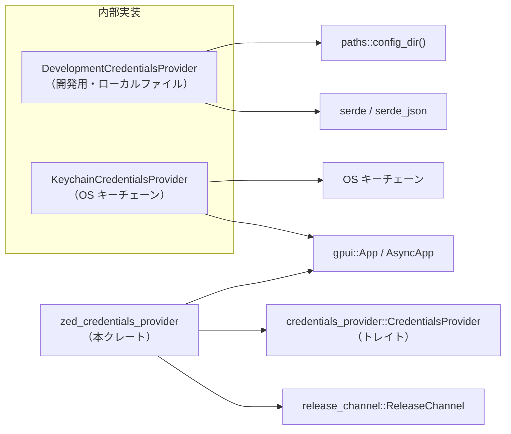
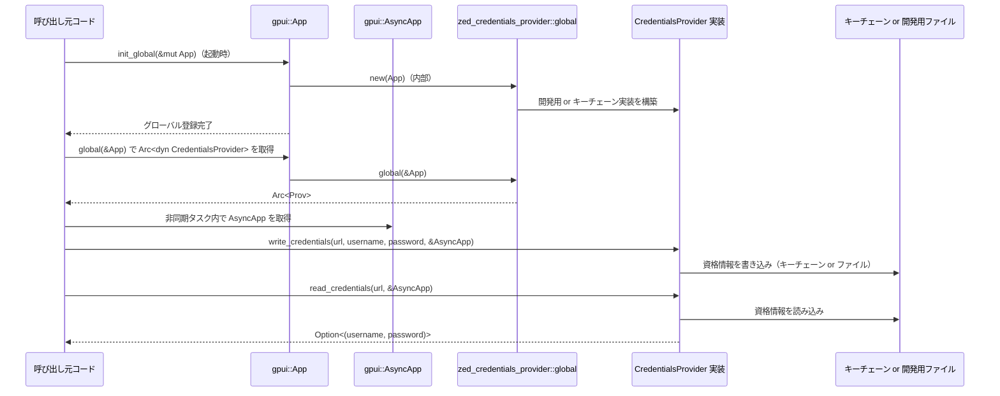

# zed_credentials_provider/ ディレクトリ

## 1. ざっくり一言

Zed エディタ内で利用する **グローバルな認証情報プロバイダ（`CredentialsProvider`）を構成・提供するクレート**です。  
開発環境ではローカルファイル、本番相当の環境では OS のキーチェーンを使うように切り替えます。

---

## 2. このモジュールの役割

### 2.1 概要

- このクレートは、他のコードから **一貫したインターフェース (`CredentialsProvider` トレイト)** で認証情報（ユーザー名・パスワードなど）を読み書きできるようにします。
- 実際にどこへ保存するかは **実行中のリリースチャネル（Dev / Nightly / Preview / Stable）と環境変数** によって決まり、
  - 開発環境（Dev）では、デフォルトでローカルファイル（開発用プロバイダ）に保存
  - それ以外のチャネル、または特定の環境変数が設定されている場合は OS のキーチェーンを利用  
 という動作になっています。
- GPUI (`gpui`) のグローバル機構（`Global` トレイト）を使い、`CredentialsProvider` をアプリケーション全体で共有します。

### 2.2 アーキテクチャ内での位置づけ

このクレートが他の主要コンポーネントとどう関係しているかを図示します。



- 外部コードは基本的に `zed_credentials_provider::global(cx)` だけを呼び出し、`Arc<dyn CredentialsProvider>` を取得します。
- どの具体実装（`KeychainCredentialsProvider` か `DevelopmentCredentialsProvider`）が使われるかは、`ReleaseChannel::try_global(cx)` と環境変数 `ZED_DEVELOPMENT_USE_KEYCHAIN` により決定されます。
- 開発用プロバイダは `paths::config_dir()` の配下に JSON ファイルを作成し、`serde_json` でシリアライズ／デシリアライズします。
- キーチェーンプロバイダは `gpui::AsyncApp` 経由で、OS キーチェーンへのアクセスを委譲しています（実際の実装はこのチャンクにはありません）。

### 2.3 設計上のポイント

- **グローバルな共有**  
  - `ZedCredentialsProvider` 構造体が `Global` を実装しており、`gpui::App` のグローバルストレージに保存されます。
- **実装の切り替え**  
  - リリースチャネル (`ReleaseChannel`) と環境変数 `ZED_DEVELOPMENT_USE_KEYCHAIN` によって、開発用プロバイダとキーチェーンプロバイダを切り替えます。
- **非同期インターフェース**  
  - `CredentialsProvider` トレイトは `Future` を返す非同期メソッドを持ち、I/O を伴う処理を非同期で扱えるようになっています。
- **開発用プロバイダはあくまで開発専用**  
  - ドキュメントコメントにもある通り、開発用プロバイダは「セキュアではない」前提で、開発時の利便性のためだけに存在します。
- **環境変数の取り扱い**  
  - `LazyLock<bool>` により、環境変数 `ZED_DEVELOPMENT_USE_KEYCHAIN` の値を一度だけ読み込み、以後の判定で再利用します。

---

## 3. 主要な機能一覧

- **グローバルな `CredentialsProvider` の登録**: `init_global` で、`gpui::App` にグローバルな認証情報プロバイダを登録します。
- **グローバルな `CredentialsProvider` の取得**: `global` で、現在の `App` から `Arc<dyn CredentialsProvider>` を取得します。
- **リリースチャネルに応じたプロバイダ選択**: `new` 内で `ReleaseChannel::try_global` と環境変数を参照し、開発用／キーチェーン用プロバイダを選択します。
- **OS キーチェーンに保存するプロバイダ**: `KeychainCredentialsProvider` が `CredentialsProvider` を実装し、`AsyncApp` 経由で OS キーチェーンにアクセスします。
- **ローカルファイルに保存する開発用プロバイダ**: `DevelopmentCredentialsProvider` が `CredentialsProvider` を実装し、JSON ファイルに資格情報を保存します。
- **開発用資格情報ファイルの読み書き**: `DevelopmentCredentialsProvider::load_credentials` / `save_credentials` で、`HashMap<String, (String, Vec<u8>)>` を JSON として読み書きします。

---

## 4. 関数・構造体の解説

### 4.1 型一覧

| 名前 | 種別 | 公開範囲 | 役割 / 用途 |
|------|------|----------|-------------|
| `ZedCredentialsProvider` | 構造体（タプル構造体） | `pub` | `Arc<dyn CredentialsProvider>` をラップし、`gpui::Global` として登録するための型です。 |
| `KeychainCredentialsProvider` | 構造体（中身なし） | crate 内のみ | OS のキーチェーンに資格情報を保存・取得する `CredentialsProvider` 実装です。実体は `AsyncApp` のメソッドに委譲します。 |
| `DevelopmentCredentialsProvider` | 構造体 | crate 内のみ | 開発時専用のファイルベースの `CredentialsProvider` 実装です。`path: PathBuf` に保存先ファイルパスを保持します。 |
| `ZED_DEVELOPMENT_USE_KEYCHAIN` | `static LazyLock<bool>` | crate 内のみ | 環境変数 `ZED_DEVELOPMENT_USE_KEYCHAIN` の有無と値（非空かどうか）をキャッシュし、「開発用プロバイダを使うかどうか」の判定に利用します。 |

> `CredentialsProvider` トレイト自体は外部クレート `credentials_provider` に定義されており、このチャンクには定義が含まれていません。

### 4.2 関数詳細（主要 7 件）

#### `init_global(cx: &mut App)`

**概要**

- 現在の `gpui::App` に対して、このクレートで選択された `CredentialsProvider` をグローバルとして登録します。
- アプリケーション起動時に一度だけ呼び出すことを想定した初期化処理です。

**引数**

| 引数名 | 型 | 説明 |
|--------|----|------|
| `cx` | `&mut App` | GPUI アプリケーションのコンテキスト。グローバル値登録に使用します。 |

**戻り値**

- なし（`()`）。副作用として `cx` に `ZedCredentialsProvider` を登録します。

**内部処理の流れ**

1. `new(cx)` を呼び出して、現在のリリースチャネル・環境変数に応じた `Arc<dyn CredentialsProvider>` を構築します。
2. その結果を `ZedCredentialsProvider` に包んで `cx.set_global` に渡し、GPUI のグローバルストレージに登録します。

**Examples（使用例）**

```rust
use gpui::App;
use zed_credentials_provider::init_global;

// アプリケーション起動時のどこかで呼ぶことを想定
fn setup_credentials_provider(cx: &mut App) {
    // 現在のリリースチャネルと環境変数に応じた
    // CredentialsProvider がグローバル登録される
    init_global(cx);
}
```

**Errors / Panics**

- この関数自身は `Result` を返さず、`?` も使用していないため、ここで明示的にエラーを返すことはありません。
- 内部で使用している `new(cx)` も `Result` を返さないため、ここから見える範囲では panic も行っていません。

**Edge cases（エッジケース）**

- `ReleaseChannel::try_global(cx)` が `None` を返す場合でも、そのケースを考慮済みで `KeychainCredentialsProvider` が選択されます。

**使用上の注意点**

- 一般に、アプリケーション全体で一度だけ呼び出すことを前提とした設計になっています。複数回呼んだ場合の上書きは `gpui::App` の実装に依存します（このチャンクからは詳細不明です）。

---

#### `global(cx: &App) -> Arc<dyn CredentialsProvider>`

**概要**

- `init_global` で登録済みのグローバル `ZedCredentialsProvider` を取得し、その中の `Arc<dyn CredentialsProvider>` を返します。
- まだ登録されていない場合は、その場で `new(cx)` により新しいプロバイダを作成して返します。

**引数**

| 引数名 | 型 | 説明 |
|--------|----|------|
| `cx` | `&App` | GPUI アプリケーションコンテキスト。グローバル値の取得に使用します。 |

**戻り値**

- `Arc<dyn CredentialsProvider>`  
  現在利用すべき認証情報プロバイダの共有参照を返します。

**内部処理の流れ**

1. `cx.try_global::<ZedCredentialsProvider>()` でグローバル登録済みの値を検索します。
2. 見つかった場合は、`provider.0.clone()` により内部の `Arc<dyn CredentialsProvider>` をクローンして返します。
3. 見つからない場合は `unwrap_or_else(|| new(cx))` により、新しくプロバイダを構築して返します。

**Examples（使用例）**

```rust
use gpui::App;
use zed_credentials_provider::global;

fn use_credentials_provider(cx: &App) {
    // グローバルに登録された CredentialsProvider を取得する
    let provider = global(cx);

    // ここから先は credentials_provider::CredentialsProvider トレイトの
    // メソッド（read_credentials など）を使って利用する
}
```

**Errors / Panics**

- `try_global` が失敗した場合も、panic にはならず `None` として扱われ、`new(cx)` で新規作成にフォールバックします。

**Edge cases（エッジケース）**

- `init_global` を呼んでいない状態でも、この関数を呼ぶと自動的にプロバイダが作成されます。そのため、初期化順序に依存しにくい設計になっています。

**使用上の注意点**

- 同一の `App` から複数回呼び出しても、内部では `Arc` のクローンにより軽量に共有されます。
- どの具体的な実装（キーチェーン／開発用）が返るかは、`new(cx)` の実装と実行時環境に依存します。

---

#### `new(cx: &App) -> Arc<dyn CredentialsProvider>`

**概要**

- 実行中のリリースチャネルと環境変数に基づき、使用する `CredentialsProvider` 実装を選択し、そのインスタンスを `Arc` で包んで返します。
- 外部には公開されておらず、`init_global` / `global` からのみ利用されます。

**引数**

| 引数名 | 型 | 説明 |
|--------|----|------|
| `cx` | `&App` | リリースチャネル情報を取得するために使用するコンテキストです。 |

**戻り値**

- `Arc<dyn CredentialsProvider>`  
  選択されたプロバイダ（開発用またはキーチェーン）の共有参照です。

**内部処理の流れ**

1. `ReleaseChannel::try_global(cx)` を呼び出し、現在のリリースチャネルを取得します。
2. `match` 式で分岐します。  
   - `Some(ReleaseChannel::Dev)` の場合:  
     - デフォルトでは開発用プロバイダを使うため、`use_development_provider = !*ZED_DEVELOPMENT_USE_KEYCHAIN` としています。  
       - 環境変数が **未設定または空** → `ZED_DEVELOPMENT_USE_KEYCHAIN == false` → `use_development_provider == true`  
       - 環境変数が **非空で設定されている** → `ZED_DEVELOPMENT_USE_KEYCHAIN == true` → `use_development_provider == false`
   - `Some(Nightly | Preview | Stable)` または `None` の場合:  
     - `use_development_provider = false` とし、開発用プロバイダは使いません。
3. `if use_development_provider { ... } else { ... }` で分岐し、  
   - `true` の場合: `Arc::new(DevelopmentCredentialsProvider::new())`  
   - `false` の場合: `Arc::new(KeychainCredentialsProvider)`  
   を返します。

**Examples（使用例）**

外部コードから直接呼ぶことは想定されていませんが、挙動イメージとして:

```rust
use gpui::App;

fn example(cx: &App) {
    // 実際には zed_credentials_provider::global(cx) の内部で呼ばれる
    let provider: std::sync::Arc<dyn credentials_provider::CredentialsProvider> =
        zed_credentials_provider::new(cx); // ※ new は非公開なので実際には呼べません
}
```

**Errors / Panics**

- この関数内で `Result` は使用されておらず、panic も発生させていません。
- `ReleaseChannel::try_global` が `None` を返しても安全に処理され、キーチェーンプロバイダが選択されます。

**Edge cases（エッジケース）**

- 環境変数 `ZED_DEVELOPMENT_USE_KEYCHAIN` が **空文字列** の場合も「未設定扱い」となり、開発用プロバイダが利用されます。
- `ReleaseChannel` が取得できない（`None`）ケースは、「Dev ではない」と同様に扱われます。

**使用上の注意点**

- 開発用プロバイダはセキュアではないため、`ReleaseChannel::Dev` 以外で使われないようにしています。
- この関数を直接公開していないことで、外部から「どの実装を使うか」を固定されにくくしています。

---

#### `DevelopmentCredentialsProvider::new() -> Self`

**概要**

- 開発用の `CredentialsProvider` 実装を初期化します。
- 認証情報を保存するファイルパスを `paths::config_dir().join("development_credentials")` に設定します。

**引数**

- なし。

**戻り値**

- `DevelopmentCredentialsProvider`  
  `path` フィールドに保存先ファイルパスを設定した構造体インスタンスです。

**内部処理の流れ**

1. `paths::config_dir()` を呼び出して、設定用ディレクトリのパスを取得します（具体的なパスは OS に依存し、このチャンクからは不明です）。
2. そのディレクトリに `"development_credentials"` という名前のファイルパスを連結し、`path` フィールドに格納します。
3. `Self { path }` を返します。

**Examples（使用例）**

```rust
fn create_dev_provider() {
    // 開発用 CredentialsProvider のインスタンスを作成する
    let provider = zed_credentials_provider::DevelopmentCredentialsProvider::new(); // 実際には非公開
    // provider.path は config_dir/development_credentials になる
}
```

※ 実際には `DevelopmentCredentialsProvider` は非公開なので、外部からこの関数を直接呼び出すことはできません。

**Errors / Panics**

- この関数内で I/O や `Result` は使用されておらず、panic の可能性も特にありません。

**Edge cases（エッジケース）**

- `paths::config_dir()` がどのようなパスを返すかは、このチャンクからは分かりませんが、無効なパスであれば後続のファイル I/O でエラーが発生する可能性があります。

**使用上の注意点**

- 「開発専用」である点がコメントで明示されています。本番向けコードからこのプロバイダを利用することは想定されていません。

---

#### `DevelopmentCredentialsProvider::load_credentials(&self) -> Result<HashMap<String, (String, Vec<u8>)>>`

**概要**

- 開発用資格情報ファイルから JSON を読み込み、URL 文字列をキー、`(username, password_bytes)` を値とする `HashMap` に復元します。

**引数**

| 引数名 | 型 | 説明 |
|--------|----|------|
| `&self` | `&DevelopmentCredentialsProvider` | 読み込み対象ファイルのパス情報を持つインスタンスです。 |

**戻り値**

- `anyhow::Result<HashMap<String, (String, Vec<u8>)>>`  
  成功時は URL → (ユーザー名, パスワードバイト列) のマップを返します。  
  失敗時はファイル読み込みエラーや JSON パースエラーを含む `anyhow::Error` を返します。

**内部処理の流れ**

1. `std::fs::read(&self.path)?` でファイル全体をバイト列として読み込みます。
2. `serde_json::from_slice(&json)?` で `HashMap<String, (String, Vec<u8>)>` にデシリアライズします。
3. 成功したマップを `Ok(credentials)` として返します。

**Examples（使用例）**

```rust
use std::collections::HashMap;

fn read_dev_credentials(provider: &zed_credentials_provider::DevelopmentCredentialsProvider) {
    // 認証情報ファイルを読み込む
    let map: HashMap<String, (String, Vec<u8>)> = provider.load_credentials().unwrap();
    // map["https://example.com"].0 が username
    // map["https://example.com"].1 が password のバイト列
}
```

※ 実際には型が非公開なので、同様のコードはクレート内部でのみ利用可能です。

**Errors / Panics**

- ファイルが存在しない、読み取りできない、または JSON 形式が不正な場合は `Err(anyhow::Error)` を返します。
- `?` 演算子により、`std::fs::read` と `serde_json::from_slice` のエラーがそのまま伝播します。

**Edge cases（エッジケース）**

- ファイルがまだ作られていない場合（存在しない場合）もエラー (`Err`) になります。  
  ただし、この関数の呼び出し側（`read_credentials` / `write_credentials`）の一部では `unwrap_or_default()` でこのエラーを握りつぶし、空のマップとして扱っています。

**使用上の注意点**

- クレート内部では、「ファイルがないことは異常だが、読み取り側で握りつぶすケースもある」という前提で使われています。  
  `delete_credentials` 実装では `?` をそのまま返しているため、呼び出し側からはエラーとして認識されます。

---

#### `DevelopmentCredentialsProvider::save_credentials(&self, credentials: &HashMap<String, (String, Vec<u8>)>) -> Result<()>`

**概要**

- 与えられた資格情報マップを JSON にシリアライズし、開発用資格情報ファイルに上書きします。

**引数**

| 引数名 | 型 | 説明 |
|--------|----|------|
| `&self` | `&DevelopmentCredentialsProvider` | 書き込み先ファイルのパス情報を持つインスタンスです。 |
| `credentials` | `&HashMap<String, (String, Vec<u8>)>` | URL → (ユーザー名, パスワードバイト列) のマップです。 |

**戻り値**

- `anyhow::Result<()>`  
  成功時は `Ok(())` を返し、失敗時はファイル書き込みエラーや JSON シリアライズエラーを含む `anyhow::Error` を返します。

**内部処理の流れ**

1. `serde_json::to_string(credentials)?` でマップを JSON 文字列にシリアライズします。
2. `std::fs::write(&self.path, json)?` でファイルに書き込みます（既存ファイルがあれば上書き）。
3. `Ok(())` を返します。

**Examples（使用例）**

```rust
use std::collections::HashMap;

fn write_dev_credentials(provider: &zed_credentials_provider::DevelopmentCredentialsProvider) {
    let mut map = HashMap::new();
    map.insert(
        "https://example.com".to_string(),
        ("user".to_string(), b"password".to_vec()),
    );

    // JSON としてファイルに保存する
    provider.save_credentials(&map).unwrap();
}
```

**Errors / Panics**

- シリアライズに失敗した場合（理論上、値が JSON 化できない場合）や、ディスク書き込みに失敗した場合は `Err(anyhow::Error)` を返します。

**Edge cases（エッジケース）**

- ディスク容量不足やパーミッションエラーなどで `std::fs::write` が失敗した場合、そのエラーが呼び出し元に伝播します。
- 一度に全マップを書き戻す設計のため、マップが大きくなるとファイルサイズも増大します。

**使用上の注意点**

- 複数スレッドや複数プロセスから同じファイルを書き換える同期処理はこのコードにはありません。高頻度で並行書き込みを行うと競合が起きる可能性があります（このチャンクではその対策は確認できません）。

---

#### `impl CredentialsProvider for DevelopmentCredentialsProvider::write_credentials`

```rust
fn write_credentials<'a>(
    &'a self,
    url: &'a str,
    username: &'a str,
    password: &'a [u8],
    _cx: &'a AsyncApp,
) -> Pin<Box<dyn Future<Output = Result<()>> + 'a>>
```

**概要**

- `CredentialsProvider` トレイトの一実装として、指定された URL・ユーザー名・パスワードを開発用の JSON ファイルに保存します。
- 既に同じ URL のエントリがある場合は、上書きされます。

**引数**

| 引数名 | 型 | 説明 |
|--------|----|------|
| `&self` | `&DevelopmentCredentialsProvider` | 資格情報ファイルへのパスを持つインスタンスです。 |
| `url` | `&str` | サービスの URL。資格情報のキーとして用いられます。 |
| `username` | `&str` | 保存するユーザー名です。 |
| `password` | `&[u8]` | 保存するパスワードのバイト列です。 |
| `_cx` | `&AsyncApp` | 非同期コンテキストですが、この実装では未使用です（変数名先頭に `_` が付いています）。 |

**戻り値**

- `Pin<Box<dyn Future<Output = Result<()>> + 'a>>`  
  非同期に完了する `Future` を返します。完了時に `Result<()>` で成功／失敗が分かります。

**内部処理の流れ**

`async move { ... }.boxed_local()` で定義された非同期ブロックの中身は次の通りです。

1. `let mut credentials = self.load_credentials().unwrap_or_default();`  
   - ファイルから既存の資格情報マップを読み込みます。
   - 読み込みエラー（ファイルがない・壊れている等）の場合は、空のマップを使います。
2. `credentials.insert(url.to_string(), (username.to_string(), password.to_vec()));`  
   - 指定された URL に対応するエントリを追加または更新します。
3. `self.save_credentials(&credentials)` を呼び出し、変更されたマップをファイルに保存します。

**Examples（使用例）**

```rust
use credentials_provider::CredentialsProvider;
use gpui::AsyncApp;
use std::sync::Arc;

async fn store_dev_credential(app: &AsyncApp, provider: Arc<dyn CredentialsProvider>) {
    // "https://example.com" の資格情報を書き込む
    provider
        .write_credentials(
            "https://example.com",  // URL
            "user",                 // username
            b"password",            // password (バイト列)
            app,                    // AsyncApp コンテキスト（開発用プロバイダでは未使用）
        )
        .await
        .unwrap();
}
```

**Errors / Panics**

- `save_credentials` が `Err` を返した場合、そのエラーが `Result<()>` として呼び出し元に返されます。
- `load_credentials` の失敗は `unwrap_or_default` で握りつぶされるため、ここからエラーとして返ることはありません。

**Edge cases（エッジケース）**

- 資格情報ファイルが存在しない場合でも、`unwrap_or_default` によって空のマップから始めるため、新しいファイルが作成されます。
- JSON が壊れていてパースできない場合も、壊れた内容は捨てられ、空のマップとして扱われます。

**使用上の注意点**

- 開発用とはいえ、壊れたファイル内容が silently 破棄される設計になっています。重要な情報であっても復元はできません（このコードから読み取れる範囲ではそうなっています）。
- `_cx` は未使用ですが、トレイトのシグネチャ上受け取っています。将来的に非同期コンテキストが必要になった場合に拡張しやすい形です。

---

### 4.3 その他の関数

ここでは詳細説明を省いた補助的な関数や他のトレイトメソッドを一覧化します。

| 関数名 / メソッド | 所属 | 役割（1 行） |
|------------------|------|--------------|
| `impl CredentialsProvider for KeychainCredentialsProvider::read_credentials` | `KeychainCredentialsProvider` | `AsyncApp::update` 経由で OS キーチェーンから資格情報を非同期に読み出します。 |
| `impl CredentialsProvider for KeychainCredentialsProvider::write_credentials` | `KeychainCredentialsProvider` | `AsyncApp::update` 経由で OS キーチェーンに資格情報を書き込みます。 |
| `impl CredentialsProvider for KeychainCredentialsProvider::delete_credentials` | `KeychainCredentialsProvider` | `AsyncApp::update` 経由で OS キーチェーンから資格情報を削除します。 |
| `impl CredentialsProvider for DevelopmentCredentialsProvider::read_credentials` | `DevelopmentCredentialsProvider` | 資格情報ファイルを読み込み、指定 URL のエントリを返します。エラー時は空のマップ扱いです。 |
| `impl CredentialsProvider for DevelopmentCredentialsProvider::delete_credentials` | `DevelopmentCredentialsProvider` | 資格情報ファイルを読み込み、指定 URL のエントリを削除して保存し直します。読み込みに失敗すると `Err` を返します。 |

---

## 5. データフロー

ここでは、「資格情報を書き込んでから読み出す」までの典型的なフローを、どのコンポーネントがどのように関わるかという観点で整理します。

### 5.1 シーケンス図



### 5.2 要点

- 呼び出し元コードは `init_global` / `global` だけを知っていればよく、どの具体的なストレージ（キーチェーン／ファイル）が使われているかを意識する必要はありません。
- OS キーチェーンを使うかファイルを使うかは **リリースチャネルと環境変数** によって自動的に決まります。
- `CredentialsProvider` のメソッドはすべて `Future` ベースであり、`AsyncApp` を通じて UI スレッドや I/O スレッドと連携します（具体的な実装はこのチャンクには含まれていません）。

---

## 6. 使い方（How to Use）

### 6.1 基本的な使用方法

ここでは、「Zed 互換の GPUI アプリケーション内から資格情報を保存・取得する」という典型的な使い方を示します。

```rust
use std::sync::Arc;
use anyhow::Result;
use gpui::{App, AsyncApp};
use credentials_provider::CredentialsProvider;
use zed_credentials_provider::{init_global, global};

// アプリケーション起動時の初期化フェーズ
fn app_init(cx: &mut App) {
    // 実行環境（Dev / Nightly / ...）に応じた CredentialsProvider を
    // グローバルとして登録する
    init_global(cx);
}

// どこかの同期コードから CredentialsProvider を取得する
fn get_provider(cx: &App) -> Arc<dyn CredentialsProvider> {
    // まだ init_global が呼ばれていない場合も、global が内部で new を呼び出し
    // プロバイダを構築してくれる
    global(cx)
}

// 非同期コンテキスト内での利用例
async fn store_and_load(
    app: &AsyncApp,                // gpui の AsyncApp（非同期コンテキスト）
    provider: Arc<dyn CredentialsProvider>,
) -> Result<()> {
    // 資格情報を書き込む
    provider
        .write_credentials(
            "https://example.com", // URL
            "user",                // ユーザー名
            b"password",           // パスワード（バイト列）
            app,                   // AsyncApp コンテキスト
        )
        .await?;

    // 資格情報を読み出す
    if let Some((username, password_bytes)) =
        provider.read_credentials("https://example.com", app).await?
    {
        // username, password_bytes を利用する
        println!("username = {username}, password_len = {}", password_bytes.len());
    }

    Ok(())
}
```

このコードでは、具体的にキーチェーンが使われるのか開発用ファイルが使われるのかは、実行環境に依存して自動的に切り替わります。

---

### 6.2 よくある使用パターン

#### パターン 1: 開発時はファイル、本番はキーチェーン

- 前提:
  - 開発時: `ReleaseChannel::Dev`
  - 本番/配布版: `ReleaseChannel::Stable` / `Preview` / `Nightly`

動作:

- コード上は常に `global(cx)` から `CredentialsProvider` を取るだけです。
- Dev 環境では、デフォルトで `DevelopmentCredentialsProvider` によるファイル保存になります。
- Stable/Nightly/Preview では `KeychainCredentialsProvider` による OS キーチェーン保存になります。

#### パターン 2: 開発環境でもキーチェーンを使いたい場合

- 開発環境で実際のキーチェーン動作を試したい場合、環境変数 `ZED_DEVELOPMENT_USE_KEYCHAIN` を非空で設定します。

例（Unix 系シェル）:

```bash
export ZED_DEVELOPMENT_USE_KEYCHAIN=1
# そのまま Zed を起動すると、Dev チャネルでもキーチェーンプロバイダが使われる
```

- この状態で `global(cx)` を呼ぶと、Dev チャネルであっても `KeychainCredentialsProvider` が選択されます。

---

### 6.3 使用上の注意点（まとめ）

- **開発用プロバイダはセキュアではない**  
  - `DevelopmentCredentialsProvider` はプレーンな JSON ファイルに資格情報を保存します。  
    クレート内コメントにも「 MUST only be used in development」と明記されています。
- **環境変数の扱い**  
  - `ZED_DEVELOPMENT_USE_KEYCHAIN` は「存在していて、かつ非空のときだけ有効」です。空文字は未設定扱いになります。
- **ファイルの破損時の挙動**  
  - 開発用プロバイダでは、読み込みエラーや JSON 破損時に `unwrap_or_default()` を使う箇所があり、破損した内容を捨てて空のマップとして扱います。  
    その場合、既存の資格情報は失われ、上書き保存で新しい内容のみが残ります。
- **削除時のエラー処理**  
  - `DevelopmentCredentialsProvider::delete_credentials` は `load_credentials()?` を使っているため、ファイル読み込みやパースのエラーがそのまま `Err` として呼び出し元に返されます。
- **同期 I/O の利用**  
  - 開発用プロバイダは `std::fs::read` / `write` を直接呼んでおり、非同期 I/O ではありません。高頻度で大量の read/write を行うと、性能に影響が出る可能性があります。
- **並行アクセスの考慮**  
  - 同一ファイルへの複数プロセス／スレッドからの同時アクセスを調停する仕組みは、このコードからは確認できません。並行書き込みがある場合は競合が起こりうる前提で扱う必要があります。

---

## 7. 関連ファイル

このディレクトリ内のファイルと、密接に関係する外部クレートを整理します。

| パス / クレート名 | 種別 | 役割 / 関係 |
|-------------------|------|------------|
| `zed_credentials_provider/Cargo.toml` | マニフェスト | クレート名や依存クレート（`credentials_provider`, `gpui`, `paths`, `release_channel`, `serde`, `serde_json` など）を定義します。 |
| `zed_credentials_provider/src/zed_credentials_provider.rs` | ライブラリ本体 | 本回答で解説した、`ZedCredentialsProvider` 型と各種 `CredentialsProvider` 実装のすべてのコードが含まれます。 |
| `credentials_provider`（別クレート） | トレイト定義 | このクレートで実装している `CredentialsProvider` トレイトの定義元です（このチャンクには定義が含まれていません）。 |
| `gpui`（別クレート） | UI / アプリ基盤 | `App` / `AsyncApp` / `Global` などを提供し、グローバル登録とキーチェーンとの橋渡しに使われます。 |
| `paths`（別クレート） | パスユーティリティ | `paths::config_dir()` を提供し、開発用資格情報ファイルの保存先ディレクトリを決定します。 |
| `release_channel`（別クレート） | リリースチャネル情報 | `ReleaseChannel::Dev/Nightly/Preview/Stable` と `try_global` を提供し、どの `CredentialsProvider` を選択するかの判定に使われます。 |

このチャンクに含まれていないクレートやファイルについては、役割のみを推測的に記載しており、詳細な実装は分かりません。
