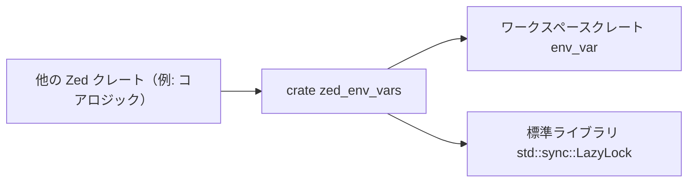
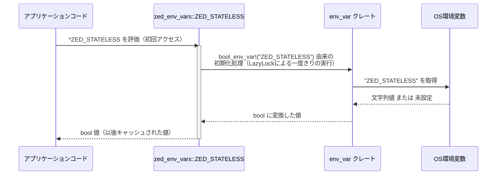

# crates/zed_env_vars ディレクトリ解説

## 1. ざっくり一言

`zed_env_vars` クレートは、Zed の動作を環境変数で切り替えるための小さなヘルパークレートです。現在のところ、Zed を「ステートレスモード」で動かすかどうかを表す `ZED_STATELESS` フラグと、環境変数用の型・マクロを再エクスポートしています。

---

## 2. このモジュールの役割

`zed_env_vars` はワークスペース内の他クレートから共通して利用される「環境変数定義の窓口」としての役割を持っています。

- Zed 全体で使う環境変数（少なくとも `ZED_STATELESS`）を 1 箇所にまとめる
- 環境変数を扱うための共通の型・マクロ（`EnvVar`, `bool_env_var`, `env_var`）を再エクスポートする
- 実際の環境変数処理ロジックはワークスペース内の `env_var` クレートに委譲する

### アーキテクチャ内での位置づけ

このクレートは、他の Zed クレートから参照され、内部では `env_var` クレートと標準ライブラリ `std::sync::LazyLock` に依存します。



---

## 3. 主要な機能一覧

- `ZED_STATELESS`:  
  Zed をステートレスモードで動作させるかどうかを表す、`LazyLock<bool>` なグローバル定数。
- `EnvVar`（再エクスポート）:  
  環境変数を表現・管理するための型（定義は `env_var` クレート側）。
- `bool_env_var` マクロ（再エクスポート）:  
  ブール値の環境変数を扱うためのマクロ（定義は `env_var` クレート側）。`ZED_STATELESS` の初期化に使用。
- `env_var` マクロ（再エクスポート）:  
  一般的な環境変数を扱うためと思われるマクロ（定義は `env_var` クレート側）。  
  ※具体的なシグネチャや挙動はこのチャンクからは読み取れません。

---

## 4. 関数・構造体の解説

このクレートのコードは非常に小さく、公開 API は以下の 4 つです。

### 4.1 公開アイテム一覧

| 名前 | 種別 | 定義場所 | 役割 / 用途 |
|------|------|----------|-------------|
| `ZED_STATELESS` | `static LazyLock<bool>` | `src/zed_env_vars.rs` | Zed をステートレスモードで動かすかどうかのフラグ |
| `EnvVar` | 構造体（推定） | `env_var` クレート | 環境変数をラップするための型。ここでは再エクスポートのみ |
| `bool_env_var` | マクロ | `env_var` クレート | ブール環境変数用の `LazyLock<bool>`（など）を作るマクロ。ここでは `ZED_STATELESS` の初期化に使用 |
| `env_var` | マクロ | `env_var` クレート | 一般的な環境変数用のマクロ。ここでは再エクスポートのみ |

`EnvVar`, `bool_env_var`, `env_var` の詳細な型定義やマクロの展開内容は、このバッチには含まれていません。

### 4.2 `pub static ZED_STATELESS: LazyLock<bool>`

#### 概要

```rust
pub use env_var::{EnvVar, bool_env_var, env_var};
use std::sync::LazyLock;

/// Whether Zed is running in stateless mode.
/// When true, Zed will use in-memory databases instead of persistent storage.
pub static ZED_STATELESS: LazyLock<bool> = bool_env_var!("ZED_STATELESS");
```

- Zed が「ステートレスモード」で動いているかどうかを表すグローバルフラグです。
- ステートレスモードが有効なときは、**オンメモリのデータベース**を使い、**永続ストレージを使わない**ことがコメントから分かります。
- 型は `std::sync::LazyLock<bool>` で、**最初にアクセスされたときに一度だけ初期化され、その後は同じ値が再利用される**遅延初期化の静的値です。

#### 初期化の仕組み

- 右辺の `bool_env_var!("ZED_STATELESS")` は、`env_var` クレートから再エクスポートされているマクロです。
- このマクロは `LazyLock<bool>` 型の値を生成しており、`ZED_STATELESS` の初期値として使われています。
- 実際に OS の環境変数 `"ZED_STATELESS"` をどのタイミングでどのように読み込むかは、`bool_env_var` マクロの実装に依存しますが、
  - `LazyLock` の性質から、「**最初に `ZED_STATELESS` にアクセスした時点で一度だけ評価され、その結果の `bool` が以後使い回される**」という動作になります。

> 環境変数の未設定時や不正な値の扱い（例: `"foo"` が渡されたときに `Err` にするのか、`false` にするのか等）は、`env_var` クレート側の仕様であり、このチャンクからは分かりません。

#### 使い方の基本

`LazyLock<bool>` は `Deref<Target = bool>` を実装しているため、`*ZED_STATELESS` で `bool` 値を取得できます。

```rust
use zed_env_vars::ZED_STATELESS;

fn is_stateless() -> bool {
    // LazyLock<bool> を参照外しして bool を得る
    *ZED_STATELESS
}
```

あるいは、`LazyLock::force` を使って参照を得ることもできます。

```rust
use std::sync::LazyLock;
use zed_env_vars::ZED_STATELESS;

fn is_stateless_ref() -> &'static bool {
    LazyLock::force(&ZED_STATELESS) // &'static bool を返す
}
```

#### エッジケース

- **環境変数が未設定のとき**  
  - `bool_env_var!` マクロがどのように扱うか（デフォルト値にフォールバックするか、エラー扱いか）は、このコードからは分かりません。
- **環境変数の値が不正なとき**（例えば `"not-a-bool"` のような文字列）  
  - 同様に、どのようなルールで `bool` に変換しているかは `env_var` クレート依存で、このチャンクからは不明です。
- **プロセス起動後に環境変数を変更した場合**  
  - `LazyLock` の仕様により、一度初期化された後は値が固定されます。  
    そのため、プロセス起動後に OS の環境変数 `"ZED_STATELESS"` を変更しても、`ZED_STATELESS` が返す値は変わりません。

#### 使用上の注意点

- **値は起動後固定される**  
  - `LazyLock<bool>` にキャッシュされるため、プロセスの途中で `"ZED_STATELESS"` を切り替えて動作を変える、といった使い方はできません。
- **テスト時の切り替え**  
  - 同一プロセス内でテストを複数走らせ、テストごとに `ZED_STATELESS` の値を変えたい場合は注意が必要です。  
    一度アクセスされた後は再初期化できないため、「テストプロセスごとに環境変数を設定する」といった粒度で制御する必要があります。
- **参照外しが必要**  
  - 型は `LazyLock<bool>` であり、`bool` そのものではありません。`if *ZED_STATELESS { ... }` のように、参照外しを行って利用します。

### 4.3 再エクスポートされる型・マクロ

#### `EnvVar`

- `env_var` クレートから再エクスポートされています。
- 環境変数を表現・管理するための型と推測されますが、このチャンクには定義が含まれていないため、フィールド構成やメソッドは不明です。
- このクレートを通じて `EnvVar` を使うことで、`env_var` クレートに直接依存せずに環境変数ロジックを利用できます。

#### `bool_env_var` マクロ

- シグネチャの詳細は不明ですが、`ZED_STATELESS` の宣言から、`bool_env_var!("ZED_STATELESS")` という形で呼び出されることが分かります。
- `LazyLock<bool>` 型の値を返しているため、
  - OS 環境変数 `"ZED_STATELESS"` を読み取り
  - それを `bool` に変換する処理
  を内部で行っていると考えられます（詳細な変換ルールは不明）。

#### `env_var` マクロ

- 一般的な環境変数を扱うためのマクロと推測されますが、このチャンクには使用例や定義が存在しません。
- 正確な使用方法（引数やオプションなど）は、`env_var` クレート側のドキュメント・実装を参照する必要があります。

---

## 5. データフロー

代表的なシナリオとして、「アプリケーションコードが `ZED_STATELESS` を参照し、その裏側で環境変数が一度だけ読まれる」流れを示します。



2 回目以降の `*ZED_STATELESS` では、`OS` への問い合わせや `env_var` クレートでの変換は行われず、`LazyLock` に保存された値がそのまま返される想定です。

---

## 6. 使い方（How to Use）

### 6.1 基本的な使用方法

Zed のどこかのコードから、ZED がステートレスモードかどうかを判定して挙動を切り替える、という使い方が想定されます。

```rust
use zed_env_vars::ZED_STATELESS; // このクレートから ZED_STATELESS をインポート

fn initialize_databases() {
    if *ZED_STATELESS {                      // LazyLock<bool> を参照外しして bool を得る
        // ステートレスモード: 永続ストレージを使わずオンメモリ DB などを利用
        setup_in_memory_databases();
    } else {
        // 通常モード: 永続ストレージを利用
        setup_persistent_databases();
    }
}

// 以降は、実際の初期化処理（定義はこのチャンクには存在しません）
fn setup_in_memory_databases() { /* ... */ }
fn setup_persistent_databases() { /* ... */ }
```

このように、`if *ZED_STATELESS { ... }` を条件分岐に使うのが典型的な利用方法です。

### 6.2 よくある使用パターン

#### パターン 1: 起動時に一度読み出してローカル変数に保持する

複数箇所で同じ判定を行う場合、読みやすさのためにローカル変数にコピーして使うパターンです。

```rust
use zed_env_vars::ZED_STATELESS;

fn run() {
    let stateless = *ZED_STATELESS;    // bool としてローカルにコピー

    if stateless {
        // ステートレス向けのセットアップ
        setup_in_memory_databases();
    } else {
        // 通常モード向けのセットアップ
        setup_persistent_databases();
    }

    // 以降のコードでも stateless を使って分岐できる
    if stateless {
        // ステートレス専用の処理
    }
}
```

`LazyLock` 自体は安価に参照できますが、コードの見通しのためにローカル変数へ展開するのは一般的な書き方です。

#### パターン 2: 構造体の設定項目として取り込む

（概念レベルの例です。実際の構造体定義はこのチャンクにはありません。）

```rust
use zed_env_vars::ZED_STATELESS;

struct AppConfig {
    stateless: bool,      // 環境変数から読み取ったフラグ
}

impl AppConfig {
    fn from_env() -> Self {
        AppConfig {
            stateless: *ZED_STATELESS,   // LazyLock の値を構造体にコピー
        }
    }
}
```

このように設定情報をまとめる型に取り込むことで、「どの環境変数を見ているか」を集約できます。

### 6.3 使用上の注意点

- **`ZED_STATELESS` の値はプロセス内で固定される**  
  - `LazyLock` により最初のアクセス時に決まり、その後は変わりません。  
    実行中に環境変数 `"ZED_STATELESS"` を変更しても、動作は切り替わらない前提で設計する必要があります。
- **環境変数が未設定または不正値のときの挙動は、このチャンクからは不明**  
  - `bool_env_var` マクロ（`env_var` クレート）の実装に依存します。  
    具体的な挙動（例: デフォルト `false` になるかどうか）を前提にしたロジックを書く場合は、`env_var` クレート側のドキュメントや実装を確認する必要があります。
- **型は `bool` ではなく `LazyLock<bool>`**  
  - そのままでは `if ZED_STATELESS { ... }` のように使えません。`*ZED_STATELESS` で参照外しして `bool` を得る必要があります。
- **スレッドセーフ**  
  - `std::sync::LazyLock` はスレッドセーフな遅延初期化を行う型です。  
    複数スレッドから `ZED_STATELESS` に同時アクセスしても、内部で適切に同期され、一度だけ初期化されます。

---

## 7. 関連ファイル

このディレクトリ内で `zed_env_vars` クレートと密接に関係するファイル・依存をまとめます。

| パス / 名前 | 種別 | 役割 / 関係 |
|------------|------|-------------|
| `zed_env_vars/Cargo.toml` | マニフェスト | クレート名や依存関係（`env_var`）、ライブラリのエントリポイント (`src/zed_env_vars.rs`) を定義 |
| `zed_env_vars/src/zed_env_vars.rs` | ライブラリ本体 | `ZED_STATELESS` の定義と、`EnvVar`, `bool_env_var`, `env_var` の再エクスポートを提供 |
| `env_var`（ワークスペース依存） | 別クレート | 環境変数を扱うための型・マクロを定義しているクレート。`EnvVar`, `bool_env_var`, `env_var` の実体がここにあると考えられます（このチャンクには配置パスは含まれていません） |

このクレートを理解・利用する上では、とくに `env_var` クレート側の仕様（どのように環境変数をパースし、デフォルト値を決めるか）を併せて確認することが重要になります。
