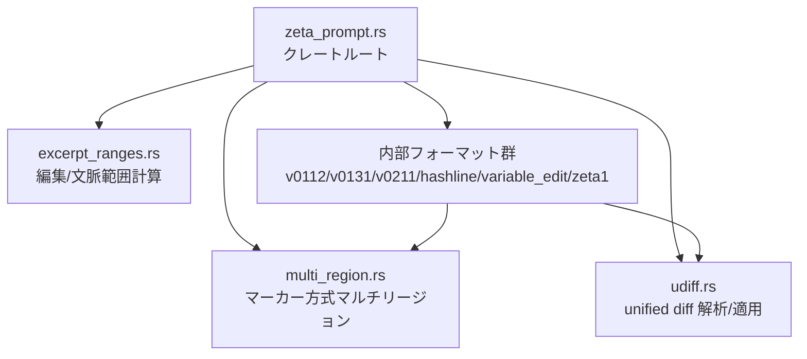
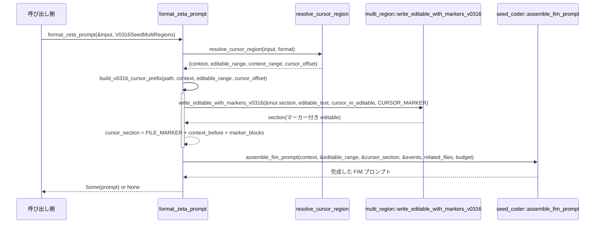

# zeta_prompt ディレクトリ解説

## 1. ざっくり一言

`zeta_prompt` は、エディタの状態（カーソル位置・編集履歴・関連ファイルなど）から **LLM 用のプロンプトを生成**し、さらに **LLM の出力を元のテキストへの編集に変換**するためのヘルパークレートです。  
複数世代のプロンプト形式（`ZetaFormat`）や、diff／マーカー形式などの入出力表現をまとめて扱います。

---

## 2. このモジュールの役割

### 2.1 概要

- このディレクトリは **「コード編集アシスタント用のプロンプト／出力フォーマット実装」** を提供します。
- 主な責務は次のとおりです。
  - カーソル位置と構文情報から **編集可能領域・コンテキスト領域の計算**
  - 選択したフォーマットに応じた **プロンプト文字列の組み立て**
  - モデル出力（diff 形式・マーカー形式・専用コマンド形式など）からの **編集内容の復元**
  - 学習用に、元テキストと diff から **期待されるモデル出力の生成**

### 2.2 アーキテクチャ内での位置づけ

主なファイル間・モジュール間の依存関係は次のようになっています。



- `zeta_prompt.rs`
  - クレートの公開 API の大部分を提供します。
  - `ZetaPromptInput`, `ZetaFormat`、プロンプト生成／出力解析関数などを定義します。
  - 内部モジュールとして、各フォーマット（`v0131_git_merge_markers_prefix`, `seed_coder`, `hashline`, `v0304_variable_edit`, `zeta1` など）を持ちます。
- `excerpt_ranges.rs`
  - カーソル周辺のテキストと構文ノード範囲から、**編集可能範囲・文脈範囲**を決定するロジックを持ちます。
- `multi_region.rs`
  - 編集可能領域を複数ブロックに分割し、`<|marker_1|>` などのマーカーで囲む **マルチリージョン表現**のエンコード／デコードを提供します。
- `udiff.rs`
  - `git diff` 風の unified diff 文字列のパーサと、テキストへの適用ロジックを提供します。
- これらを `zeta_prompt.rs` がまとめて呼び出し、選択された `ZetaFormat` に応じた振る舞いを実現します。

### 2.3 設計上のポイント

コードから読み取れる特徴は次の通りです。

- **フォーマットごとの戦略を分離**
  - `ZetaFormat` 列挙体でフォーマットバージョンを表現し、`match` で仕様の違いを切り替えています。
  - 共通部分（編集範囲計算・関連ファイル整形・トークン予算管理）は共通関数にまとめています。
- **テキスト指向の処理**
  - 入力は `&str` とバイトオフセット／行番号ベースで扱われます。
  - UTF-8 の境界は `floor_char_boundary` で安全に扱っています（マーカー境界のスナップなど）。
- **トークン数は近似で管理**
  - `estimate_tokens(bytes: usize) -> usize`（実装は `bytes / 3`）で簡易なトークン数見積りを行い、プロンプト全体が上限を超えないようにします。
- **差分適用と境界条件への配慮**
  - `udiff` では「末尾の改行が無い」「マルチバイト文字」「`No newline at end of file` マーカーあり／なし」などを考慮した実装になっています。
- **学習と推論の両方を支援**
  - 推論時: `format_zeta_prompt` / `parse_zeta2_model_output`
  - 学習時: `format_expected_output` / `encode_patch_as_output_for_format` など。

---

## 3. 主要な機能一覧

このディレクトリが提供する主な機能は次のとおりです。

- **編集・文脈範囲の計算**
  - `compute_editable_and_context_ranges` による、カーソル周辺の editable / context 範囲の決定
  - `ExcerptRanges` による、異なるトークン予算向けの範囲プリセット
- **プロンプト生成（推論時）**
  - `ZetaPromptInput` ＋ `ZetaFormat` から、フォーマットに応じたプロンプト文字列を構築
  - 追加コンテキスト（関連ファイル・編集履歴）のトークン予算内挿入
- **モデル出力の解析（推論時）**
  - フォーマットごとに、出力文字列から新しい editable 部分を取り出し、元の excerpt 上の範囲へマッピング
  - マルチリージョン形式（marker span）や hashline 形式などのデコード
- **学習用ターゲット生成**
  - 元 editable テキストと diff から、各 `ZetaFormat` に対応する **期待出力文字列**（マーカー／変換コマンド等）を構築
- **unified diff の解析とテキストへの適用**
  - `DiffParser`, `apply_diff_to_string_with_hunk_offset` による diff → 変更適用
  - コンテキストの曖昧マッチと行番号による解決
- **マルチリージョン・マーカー形式**
  - editable テキストをブロック分割し、`<|marker_1|>...<|marker_N|>` で区切る
  - 変更範囲のみを marker span で表現し、元テキストとの対応づけを行う
- **hashline / variable-edit / zeta1 などの補助フォーマット**
  - 行ハッシュ＋コマンドベースの編集（`<|set|>`, `<|insert|>`）
  - editable 範囲を固定せず、コンテキスト中の任意範囲を置換する variable-edit 形式
  - 旧 zeta1 形式のプロンプト／出力クレンジング

---

## 4. 関数・構造体の解説

### 4.1 型一覧（構造体・列挙体など）

| 名前 | 種別 | 役割 / 用途 |
|------|------|-------------|
| `ZetaPromptInput` | 構造体 | カーソル位置・excerpt・編集履歴・関連ファイルなど、プロンプト生成に必要な入力一式を表します。 |
| `ZetaFormat` | 列挙体 | プロンプト／出力フォーマットのバージョン（`V0131GitMergeMarkersPrefix`, `V0211SeedCoder`, `V0316SeedMultiRegions` など）を表します。 |
| `Event` | 列挙体 | 現在は `BufferChange`（ファイルの diff）イベントのみを持ち、編集履歴としてプロンプトに埋め込まれます。 |
| `ActiveBufferDiagnostic` | 構造体 | カーソルバッファ上の診断情報（エラー位置など）を表現するための型です（このチャンクでは使用箇所はありません）。 |
| `RelatedFile` | 構造体 | 関連ファイル 1 つ分（パス、最大行、抜粋群）を表し、プロンプトに添付されます。 |
| `RelatedExcerpt` | 構造体 | 関連ファイル内の抜粋（行範囲とテキスト、優先度 `order`）を表します。 |
| `ExcerptRanges` | 構造体 | 150/180/350/512 トークンなど、複数トークン予算で計算済みの editable/context 範囲を保持します。 |
| `DiffParser<'a>` | 構造体 | unified diff 文字列から `DiffEvent` を順次取り出すイテレータです。 |
| `DiffEvent<'a>` | 列挙体 | diff の「1 ファイルの 1 hunk」または「ファイル終端」を表します。 |
| `Hunk` (`udiff`) | 構造体 | `context`（元テキスト一部）と `edits`（範囲＋置換テキスト）、開始行情報を含む 1 hunk を表します。 |
| `Edit` (`udiff`) | 構造体 | `context` 内のバイト範囲と、そこを置換するテキストを表します。 |
| `ParsedOutput` | 構造体 | モデル出力の解析結果としての「新しい editable テキスト」と、それが適用される excerpt 内範囲を保持します。 |

このほか、`multi_region` や `hashline`, `v0304_variable_edit` 内部に補助的な構造体がいくつかあります（`ParsedTag`, `LineRef`, `ParsedHunk` など）。

---

### 4.2 重要な関数の詳細

ここではディレクトリ全体の利用において特に重要な 7 関数を取り上げます。

#### `format_zeta_prompt(input: &ZetaPromptInput, format: ZetaFormat) -> Option<String>`

**概要**

- `ZetaPromptInput` と `ZetaFormat` をもとに、**推論時にモデルへ渡すプロンプト文字列**を構築します。
- トークン上限 `MAX_PROMPT_TOKENS`（4096）を超える場合は `None` を返します。

**引数**

| 引数名 | 型 | 説明 |
|--------|----|------|
| `input` | `&ZetaPromptInput` | カーソル excerpt、カーソル位置、編集履歴、関連ファイル、事前計算済み excerpt 範囲などを含む入力。 |
| `format` | `ZetaFormat` | 利用したいプロンプトフォーマット。 |

**戻り値**

- `Some(prompt)` : トークン数の近似が上限以内で収まったプロンプト文字列。
- `None` : 近似トークン数が `MAX_PROMPT_TOKENS` を超えた場合。

**内部処理の流れ**

1. `format_prompt_with_budget_for_format(input, format, MAX_PROMPT_TOKENS)` を呼び出します。
2. その中で `resolve_cursor_region` により、実際に使う `context` テキスト・editable 範囲・cursor offset を決定します。
3. フォーマットに応じて
   - Seed-Coder / multi-region 系: `seed_coder::assemble_fim_prompt` 経由で組み立て
   - その他の zeta2 フォーマット: 関連ファイル → edit history → cursor section の順に連結
4. 最後に `estimate_tokens(prompt.len())` で簡易トークン数を計算し、上限チェックを行います。

**使用例**

```rust
use std::{ops::Range, path::Path, sync::Arc};
use zeta_prompt::{
    ZetaPromptInput, ZetaFormat, ExcerptRanges,
    format_zeta_prompt,
};

fn build_simple_prompt() -> Option<String> {
    // カーソル位置を含むファイル内容
    let cursor_excerpt = "fn main() {\n    println!(\"hello\");\n}\n";

    // 全体をコンテキスト、`println!` 行だけ editable とする
    let editable = cursor_excerpt.find("println!").unwrap();
    let editable_end = cursor_excerpt.find(");").unwrap() + 2;
    let editable_range: Range<usize> = editable..editable_end;
    let context_range: Range<usize> = 0..cursor_excerpt.len();

    let excerpt_ranges = ExcerptRanges {
        editable_150: editable_range.clone(),
        editable_180: editable_range.clone(),
        editable_350: editable_range.clone(),
        editable_150_context_350: context_range.clone(),
        editable_180_context_350: context_range.clone(),
        editable_350_context_150: context_range,
        ..Default::default()
    };

    let input = ZetaPromptInput {
        cursor_path: Arc::from(Path::new("src/main.rs")),
        cursor_excerpt: Arc::from(cursor_excerpt),
        cursor_offset_in_excerpt: editable, // println! の先頭にカーソルがあると仮定
        excerpt_start_row: Some(0),
        events: Vec::new(),
        related_files: None,
        active_buffer_diagnostics: Vec::new(),
        excerpt_ranges,
        syntax_ranges: None,
        experiment: None,
        in_open_source_repo: false,
        can_collect_data: false,
        repo_url: None,
    };

    // 例: Git merge marker ベースのフォーマット
    format_zeta_prompt(&input, ZetaFormat::V0131GitMergeMarkersPrefix)
}
```

**Edge cases（エッジケース）**

- `ZetaPromptInput` の editable/context 範囲が矛盾している（例: editable が context の外）と、その先の処理で panic する可能性があります。
- 関連ファイル・イベントが多い場合、トークン予算から順に削られ、最終的に cursor section だけになることがあります（テストから確認できます）。

**使用上の注意点**

- `format_zeta_prompt` は **文字数ベースの近似トークン数**で判定しているため、実際のモデルトークン数と完全には一致しません。
- `ZetaPromptInput.excerpt_ranges` は呼び出し側で妥当な値をセットする前提です。`compute_legacy_excerpt_ranges` などを利用して計算する想定です。

---

#### `resolve_cursor_region(input: &ZetaPromptInput, format: ZetaFormat) -> (&str, Range<usize>, Range<usize>, usize)`

**概要**

- カーソル excerpt とフォーマットに基づき、**実際にプロンプトに使う `context`・editable 範囲・context 範囲・カーソル位置**を決定します。
- ここで返される `context` は `cursor_excerpt` の一部（スライス）です。

**引数**

| 引数名 | 型 | 説明 |
|--------|----|------|
| `input` | `&ZetaPromptInput` | excerpt, カーソル位置、excerpt_ranges、syntax_ranges などを含む入力。 |
| `format` | `ZetaFormat` | フォーマットに紐づく editable/context トークン予算が利用されます。 |

**戻り値**

タプル `(context_text, editable_range_in_context, context_range_in_excerpt, cursor_offset_in_context)`:

- `&str` : `input.cursor_excerpt[context_range]` のスライス。
- `Range<usize>` : `context_text` 内での editable 範囲。
- `Range<usize>` : 元の `cursor_excerpt` 内での context 範囲。
- `usize` : `context_text` 内でのカーソル位置（byte offset）。

**内部処理の流れ**

1. `input.syntax_ranges` が `Some` の場合:
   - `token_limits_for_format(format)` で `(editable_tokens, context_tokens)` を取得。
   - `compute_editable_and_context_ranges(cursor_excerpt, cursor_offset_in_excerpt, syntax_ranges, editable_tokens, context_tokens)` を呼び出し、byte 範囲を得ます。
2. `syntax_ranges` が無い場合:
   - `excerpt_range_for_format(format, &input.excerpt_ranges)` で、事前計算済み範囲から `(editable_range, context_range)` を取得します。
3. `context_text = &cursor_excerpt[context_range.clone()]` を作り、
   - editable と cursor のオフセットから `context_start` を引いて `context` 内の座標に変換します。

**使用例（抜粋）**

`format_prompt_with_budget_for_format` 内で次のように利用されています。

```rust
let (context, editable_range, context_range, cursor_offset) =
    resolve_cursor_region(input, format);

// context: 実際にプロンプトに埋め込む抜粋
// editable_range: context 内で編集可能な部分
// context_range: cursor_excerpt 内での context 範囲
// cursor_offset: context 内のカーソル位置
```

**Edge cases**

- `syntax_ranges` に含まれる範囲・`excerpt_ranges` の範囲が `cursor_excerpt.len()` を超えている場合、`panic` する可能性があります。
- `cursor_offset_in_excerpt` が `context_range` の外にある場合、`saturating_sub` を使っているため負にはなりませんが、論理的には不整合になります。

**使用上の注意点**

- `ZetaPromptInput` を構築する際は、`cursor_offset_in_excerpt` と `excerpt_ranges`/`syntax_ranges` の一貫性が重要です。
- `context` は `cursor_excerpt` のスライスなので、呼び出し側でライフタイムに注意する必要があります（通常は関数内で完結します）。

---

#### `compute_editable_and_context_ranges(...) -> (Range<usize>, Range<usize>)`（`excerpt_ranges.rs`）

```rust
pub fn compute_editable_and_context_ranges(
    cursor_excerpt: &str,
    cursor_offset: usize,
    syntax_ranges: &[Range<usize>],
    editable_token_limit: usize,
    context_token_limit: usize,
) -> (Range<usize>, Range<usize>)
```

**概要**

- カーソルを含む抜粋テキストと構文ノード範囲をもとに、**編集可能範囲（editable）と文脈範囲（context）を byte 範囲として計算**します。
- editable はカーソル周辺を優先し、構文ノード境界を考慮しながらトークン予算内に収めます。

**引数**

| 引数名 | 型 | 説明 |
|--------|----|------|
| `cursor_excerpt` | `&str` | カーソル付近の抜粋テキスト（ファイル全体ではなく、周辺数百行程度）。 |
| `cursor_offset` | `usize` | `cursor_excerpt` 内でのカーソル byte オフセット。 |
| `syntax_ranges` | `&[Range<usize>]` | カーソルを含む構文ノードの byte 範囲（内側から外側への順）。 |
| `editable_token_limit` | `usize` | editable 範囲用のトークン予算。 |
| `context_token_limit` | `usize` | editable を囲む追加 context のトークン予算。 |

**戻り値**

- `(editable_range, context_range)`:
  - どちらも `cursor_excerpt` 内の byte 範囲です。

**内部処理の流れ（概要）**

1. `compute_line_starts` で行頭オフセット一覧を計算。
2. `offset_to_row` でカーソル行・最大行を求める。
3. `compute_editable_range_from_text`:
   - Phase 1: トークン予算の 75% でカーソル行から上下に対称に行単位で拡張。
   - Phase 2: `syntax_ranges` から得られる構文ノード境界を、残り予算の範囲で可能な限り含める。
   - Phase 3: 残り予算で、より少なく拡張した側を優先しながら行単位でさらに拡張。
4. `expand_context_from_text`:
   - editable 周辺の構文ノード境界を、`context_token_limit` 内で含めようと試みる。
   - 構文に基づく拡張が行われない場合のみ、行単位で上下拡張。
5. 行番号範囲を `row_range_to_byte_range` で byte 範囲に変換して返却。

**使用例（概念的）**

```rust
use zeta_prompt::excerpt_ranges::compute_editable_and_context_ranges;

let cursor_excerpt = "fn main() {\n    let x = 1;\n}\n";
// ここでは構文ノード範囲を仮で全体とする
let syntax = vec![0..cursor_excerpt.len()];

let cursor_offset = cursor_excerpt.find("let").unwrap();

let (editable, context) = compute_editable_and_context_ranges(
    cursor_excerpt,
    cursor_offset,
    &syntax,
    350, // editable 用トークン予算
    150, // context 用トークン予算
);
```

**Edge cases**

- 空文字列の場合でも `compute_line_starts` は `[0]` を返すため、処理は動作しますが editable/context は空範囲になります。
- 改行のない長い 1 行テキストでは、行単位の拡張は効きませんが、トークン数は行長から見積もられます。

**使用上の注意点**

- `syntax_ranges` は「カーソルを含むノードの内側から外側」順である前提で処理が書かれています。別の順序で渡すと意図と異なる挙動になる可能性があります。
- `editable_token_limit` / `context_token_limit` は zeta フォーマットごとに `token_limits_for_format` が返す値を使うのが前提です。

---

#### `udiff::apply_diff_to_string_with_hunk_offset(diff_str: &str, text: &str) -> Result<(String, Option<usize>)>`

**概要**

- unified diff 文字列 `diff_str` をパースし、元テキスト `text` に適用した結果を返します。
- 併せて「最初の hunk のコンテキストが `text` のどの byte offset にマッチしたか」も返します。これはカーソル位置の変換などに利用されます。

**引数**

| 引数名 | 型 | 説明 |
|--------|----|------|
| `diff_str` | `&str` | `--- a/file`, `+++ b/file`, `@@ ... @@` などを含む unified diff。複数ファイル分を含んでも構いません。 |
| `text` | `&str` | パッチを適用したい元のテキスト。 |

**戻り値**

- `Ok((new_text, first_hunk_offset))`:
  - `new_text`: diff を適用した後のテキスト。
  - `first_hunk_offset`: 最初の hunk の context が `text` 内のどこにマッチしたか（byte offset）。カーソル位置補正に使用できます。
- `Err`: diff のパースや context マッチングに失敗した場合。

**内部処理の流れ（概要）**

1. `DiffParser::new(diff_str)` でパーサを初期化。
2. `next()` で `DiffEvent` を順次取り出し、`DiffEvent::Hunk { hunk, .. }` を処理する。
3. 各 hunk について:
   - `find_context_candidates(&text, &mut hunk)` で context 部分が `text` のどこに現れるか候補リストを取得。
   - `disambiguate_by_line_number` で `Hunk.start_line` があれば行番号と付き合わせて 1 つに決定。
   - `hunk.edits` を逆順で適用し、`text.replace_range` でテキストを書き換える。
4. 最初にマッチした hunk の offset を `first_hunk_offset` として保持する。

**使用例**

```rust
use zeta_prompt::udiff::apply_diff_to_string_with_hunk_offset;

let original = "line1\nline2\nline3\n";
let diff = "\
--- a/file.txt
+++ b/file.txt
@@ -1,3 +1,3 @@
 line1
-line2
+replaced
 line3
";

let (patched, hunk_offset) = apply_diff_to_string_with_hunk_offset(diff, original)?;
assert_eq!(patched, "line1\nreplaced\nline3\n");
// hunk_offset は "line1" の先頭オフセット（0）になる
```

**Errors**

- hunk context が `text` 内にマッチしない場合: `"couldn't resolve hunk"` エラー。
- diff の構文が不正な場合: `"Failed to parse diff"` など。

**Edge cases**

- 元テキスト末尾の改行の有無と、diff 内の `\ No newline at end of file` マーカーの有無が一致しない場合でも、`find_context_candidates` が fallback して末尾の phantom 改行を扱います。
- マルチバイト文字を含む場合でも、コンテキストは diff から作られた `String` を基準にしているため、char 境界を壊さないように範囲が調整されています（テストで確認）。

**使用上の注意点**

- diff は基本的に単一ファイルを想定しており、複数ファイルを含む場合でも同一 `text` に対して順次適用する形になります。ファイルパスでのフィルタリングはここでは行われません。
- `apply_diff_to_string`（hunk offset なし）という薄いラッパーも提供されています。

---

#### `multi_region::encode_from_old_and_new_v0316(...) -> Result<String>`

```rust
pub fn encode_from_old_and_new_v0316(
    old_editable: &str,
    new_editable: &str,
    cursor_offset_in_new: Option<usize>,
    cursor_marker: &str,
    end_marker: &str,
) -> Result<String>
```

**概要**

- 古い editable テキストと新しい editable テキストを比較し、**変更が生じた最小の marker span** を `V0316` 形式でエンコードします。
- 出力は `<|marker_1|>...<|marker_N|>` のタグと中間コンテンツ、末尾の `end_marker`（`V0316_END_MARKER`）から構成されます。

**引数**

| 引数名 | 型 | 説明 |
|--------|----|------|
| `old_editable` | `&str` | 変更前の editable 領域テキスト。通常、末尾に改行を追加してから渡されます。 |
| `new_editable` | `&str` | 変更後の editable 領域テキスト。 |
| `cursor_offset_in_new` | `Option<usize>` | 新しいテキスト内でのカーソル位置（byte offset）。`None` ならカーソルマーカーは挿入されません。 |
| `cursor_marker` | `&str` | カーソル位置を表す特別な文字列（`CURSOR_MARKER`）。 |
| `end_marker` | `&str` | 末尾に付与する終了マーカー（`V0316_END_MARKER`）。 |

**戻り値**

- `Ok(encoded)` : マーカー付きの学習ターゲット文字列。
- `Err` : 内部で使用する `encode_from_old_and_new_impl` が失敗した場合（入力範囲不整合など）。

**内部処理の流れ（概要）**

1. `compute_marker_offsets(old_editable)` で、行数とブロックサイズルールに従って editable を複数ブロックに分割。
2. `encode_from_old_and_new_impl` に共通ロジックを委譲:
   - 古いテキストと新しいテキストの共通 prefix / suffix の長さを求め、変更範囲を特定。
   - 変更されたブロックをカバーする最小のマーカーインデックス `[start_marker_idx, end_marker_idx]` を計算。
   - ブロック境界（旧テキスト）のオフセットを `map_boundary_offset` で新テキスト側へマッピングし、行頭にスナップ。
   - span 内の各ブロックの内容を順に出力し、必要ならカーソルマーカーを挿入。
   - 先頭と末尾にマーカータグ＋`end_marker` を付与。
3. 編集がない場合は `encode_from_old_and_new_impl` 側で `<|marker_k|><|marker_k|><end_marker>` のような「no-edit」表現が使われます（`encode_from_old_and_new_v0316` 自体は、no-edit のときも同じ API）。

**使用例（概念）**

```rust
use zeta_prompt::multi_region::{
    encode_from_old_and_new_v0316, V0316_END_MARKER,
};
use zeta_prompt::CURSOR_MARKER;

let old = "line1\nline2\nline3\n";
let new = "line1\nLINE2\nline3\n";

let encoded = encode_from_old_and_new_v0316(
    old,
    new,
    Some(new.find("LINE2").unwrap()),
    CURSOR_MARKER,
    V0316_END_MARKER,
)?;

// encoded は、変更を含むブロックだけをカバーする marker span にカーソルマーカーを入れた文字列になる
```

**Edge cases**

- `old_editable == new_editable` の場合でも、no-edit を表す marker span が生成されます（`encode_from_old_and_new_impl` の仕様）。
- very short テキストでマーカー分割が 2 ブロックにしかならない場合でも動作します。

**使用上の注意点**

- `old_editable` は `format_expected_output` 内のように、末尾に改行を足した形で扱われる前提です一貫性のため、このパターンに従うと安全です。
- 同じファイルに対する複数の変更をまとめて 1 つの editable 文字列で扱う想定です。

---

#### `format_expected_output(input: &ZetaPromptInput, format: ZetaFormat, patch: &str, cursor_offset: Option<usize>) -> Result<String>`

**概要**

- 学習用に、`ZetaPromptInput` と diff 文字列 `patch` から、そのフォーマットでの **期待されるモデル出力文字列**を生成します。
- multi-region / hashline / variable-edit など、フォーマットごとの複雑なエンコード規則をここで肩代わりします。

**引数**

| 引数名 | 型 | 説明 |
|--------|----|------|
| `input` | `&ZetaPromptInput` | editable 領域の元テキスト、カーソル位置などを含む。 |
| `format` | `ZetaFormat` | 出力形式。 |
| `patch` | `&str` | editable 領域に対する unified diff。 |
| `cursor_offset` | `Option<usize>` | diff 内でのカーソル位置（hunk の新テキストに対するオフセット）。 |

**戻り値**

- `Ok(expected_output)` : モデルが出力するべき文字列。
- `Err` : diff の適用失敗や、フォーマット特有のエラー時。

**内部処理の流れ（概要）**

1. `resolve_cursor_region` で editable/context を取得し、`old_editable` を `String` としてコピーし、末尾に改行を追加（なければ）。
2. `encode_patch_as_output_for_format` を試す:
   - hashline, variable-edit, multi-region の「空パッチ（変更なし）」など、フォーマット固有のケースではここで完結します。
3. 上記で `Some(output)` が返ればそれを返す。
4. そうでないフォーマットの場合:
   - multi-region 系 (`V0316/17/18`):
     1. `udiff::apply_diff_to_string_with_hunk_offset(patch, &old_editable)` で新しい editable を作る。
     2. `cursor_in_new_text` でカーソル位置を新テキスト上のオフセットに変換。
     3. 対応する `encode_from_old_and_new_v0316/v0318/v0317` を使って marker span を生成する。
   - それ以外:
     1. パッチが空なら `old_editable` を使い、空でないなら diff を適用して `result` を作成。
     2. カーソル位置があれば `CURSOR_MARKER` を挿入。
     3. 末尾の改行を整え、`output_end_marker_for_format` があれば付与。

**使用上の注意点**

- `patch` は editable 領域に対する diff である前提です（ファイル全体の diff ではなく、editable 部分を切り出したものを使う設計）。
- `cursor_offset` の意味はフォーマットごとにやや異なりますが、`apply_diff_to_string_with_hunk_offset` の戻り値を利用することで整合を取っています。

---

#### `parse_zeta2_model_output(output: &str, format: ZetaFormat, prompt_inputs: &ZetaPromptInput) -> Result<ParsedOutput>`

**概要**

- 推論時にモデルから返ってきた `output`（必要なら end marker を含む）をパースし、**新しい editable テキストと、それを適用すべき excerpt 内の byte 範囲**を返します。
- フォーマットに応じて、hashline／variable-edit／multi-region などの専用デコーダを呼び分けます。

**引数**

| 引数名 | 型 | 説明 |
|--------|----|------|
| `output` | `&str` | モデルからの生出力（end marker を含む場合があります）。 |
| `format` | `ZetaFormat` | 出力形式。 |
| `prompt_inputs` | `&ZetaPromptInput` | もともとプロンプト生成に使った入力。editable/context 範囲の計算に再利用されます。 |

**戻り値**

- `Ok(ParsedOutput { new_editable_region, range_in_excerpt })`:
  - `new_editable_region`: editable 部分に挿入すべき新しいテキスト。
  - `range_in_excerpt`: `ZetaPromptInput.cursor_excerpt` 内で、そのテキストを置き換えるべき byte 範囲。
- `Err` : フォーマット固有のパースに失敗した場合。

**内部処理の流れ（概要）**

1. `output_end_marker_for_format(format)` で end marker が定義されていれば、末尾から 1 回だけ剥がします。
2. `resolve_cursor_region(prompt_inputs, format)` で `context`, `editable_range_in_context`, `context_range` などを再取得。
3. フォーマットに応じて `match`:
   - `v0226Hashline`:
     - `hashline::output_has_edit_commands` に応じて `hashline::apply_edit_commands`（ハッシュ付きコマンドからの復元）またはそのままテキストを利用。
   - `V0304VariableEdit`:
     - `v0304_variable_edit::apply_variable_edit(context, output)` で置き換え範囲と新テキストを取得。
   - `V0304SeedNoEdits`:
     - 出力が `NO_EDITS` で始まる場合は編集なしとして old editable を返す。
   - `V0306SeedMultiRegions`:
     - `NO_EDITS` なら編集なし、そうでなければ `multi_region::apply_marker_span`。
   - `V0316/18`:
     - `multi_region::apply_marker_span_v0316/18` を使用。
   - `V0317`:
     - カーソル相対マーカーのため、`cursor_offset_in_editable` を計算して `apply_marker_span_v0317` を呼ぶ。
   - それ以外: 出力文字列をそのまま editable の新テキストとみなす。
4. `range_in_excerpt` は `context_range.start + range_in_context.start ..` で計算。

**使用例（抜粋）**

```rust
use zeta_prompt::{parse_zeta2_model_output, ZetaFormat};

fn apply_model_edit(
    input: &ZetaPromptInput,
    format: ZetaFormat,
    model_output: &str,
) -> anyhow::Result<String> {
    let parsed = parse_zeta2_model_output(model_output, format, input)?;
    let mut excerpt = input.cursor_excerpt.to_string();
    excerpt.replace_range(parsed.range_in_excerpt, &parsed.new_editable_region);
    Ok(excerpt)
}
```

**使用上の注意点**

- 呼び出し側では、`ZetaPromptInput` はプロンプト生成に使ったものと **同じ** でなければ、一致しない範囲への適用になり得ます。
- モデルが end marker を出力しなかった場合でも、ここでは end marker が無いものとして扱います（`strip_suffix` の戻り値をそのまま使います）。

---

#### `hashline::apply_edit_commands(editable_region: &str, model_output: &str) -> String`

（詳細は `hashline` モジュール内にあります。ここでは概要のみ説明します。）

**概要**

- `<|set|>` / `<|insert|>` コマンドを含む hashline 形式のモデル出力を解釈し、**元の editable テキストに編集を適用**します。
- 行ごとに `{index}:{hash}|` という識別子を付け、そのハッシュを使って対象行を特定します。

**主な挙動**

- `<|set|>start:end` : 指定範囲の行を `content` で置き換え。
- `<|insert|>line` : 指定行の **後** に `content` を挿入。（`<|insert|>` 単独だと先頭の前）
- ハッシュが一致しない場合、そのコマンドは無視されます。
- 元テキストの末尾の改行の有無を保つように調整されます。

---

### 4.3 その他の代表的な関数一覧

| 関数名 | 所属 | 役割（1 行） |
|--------|------|--------------|
| `prompt_input_contains_special_tokens` | `zeta_prompt` | 指定フォーマットの特別トークンが既に excerpt 内に含まれているかチェックします。 |
| `special_tokens_for_format` | `zeta_prompt` | フォーマットごとに予約済みのトークン（prefix/suffix/middle 等）一覧を返します。 |
| `token_limits_for_format` | `zeta_prompt` | フォーマットごとの `(editable_tokens, context_tokens)` を返します。 |
| `excerpt_ranges_for_format` / `excerpt_range_for_format` | `zeta_prompt` | `ExcerptRanges` から、フォーマットに対応する editable/context 範囲を選びます。 |
| `write_cursor_excerpt_section_for_format` | `zeta_prompt` | フォーマットごとの cursor セクション部分（ファイル名＋excerpt＋カーソルマーカー）の出力を行います。 |
| `format_edit_history_within_budget` | `zeta_prompt` | 編集履歴イベントをトークン予算内に収まるよう整形します。 |
| `format_related_files_within_budget` | `zeta_prompt` | `RelatedFile` 群を優先度順に並べ、トークン予算に合わせて部分的に含めます。 |
| `write_related_files` | `zeta_prompt` | `format_related_files_within_budget` の低レベル版として、`<|file_sep|>` 付きでまとめて書き出します。 |
| `multi_region::compute_marker_offsets(_v0318)` | `multi_region` | editable テキストをブロックに分割し、マーカー位置 byte オフセットのリストを返します。 |
| `multi_region::apply_marker_span(_v0316/_v0317/_v0318)` | `multi_region` | モデル出力の marker span から新しい editable テキストを復元します。 |
| `udiff::strip_diff_path_prefix` | `udiff` | diff 内のパスから共通 prefix を取り除きます。 |
| `udiff::strip_diff_metadata` | `udiff` | `diff --git` や `index` など patch 適用に不要な行を取り除きます。 |

---

## 5. データフロー

ここでは「**V0316 マルチリージョン Seed-Coder フォーマットでプロンプトを生成する**」場合のデータフローを例に説明します。

### 概要

1. 呼び出し側は `ZetaPromptInput` と `ZetaFormat::V0316SeedMultiRegions` を用意して `format_zeta_prompt` を呼びます。
2. `resolve_cursor_region` で editable/context 範囲とカーソル位置が決まります。
3. `build_v0316_cursor_prefix` が editable 部分をマーカー付きブロックに分割し、カーソルマーカーを埋め込みます（内部で `multi_region::write_editable_with_markers_v0316`）。
4. `seed_coder::assemble_fim_prompt` が suffix/prefix/middle 部を組み合わせて最終的なプロンプトを構築します。

### シーケンス図



この後、学習時には `format_expected_output` が同じ `ZetaPromptInput` と diff を使って、対応する multi-region 出力を生成します。その際に `udiff::apply_diff_to_string_with_hunk_offset` と `multi_region::encode_from_old_and_new_v0316` が利用されます。

---

## 6. 使い方（How to Use）

### 6.1 基本的な使用方法

ここでは、**V0131 Git merge markers プレフィックス形式**を例に、実行時の典型的なフローを示します。

1. カーソル excerpt と editable/context 範囲を決める。
2. `ZetaPromptInput` を構築する。
3. `format_zeta_prompt` でプロンプト文字列を作り、モデルに渡す。
4. モデル出力を `parse_zeta2_model_output` で解析し、元テキストへ適用する。

```rust
use std::{ops::Range, path::Path, sync::Arc};
use zeta_prompt::{
    ZetaPromptInput, ZetaFormat, ExcerptRanges,
    format_zeta_prompt, parse_zeta2_model_output,
    CURSOR_MARKER,
};

fn end_to_end_example() -> anyhow::Result<()> {
    // 1. カーソル excerpt と範囲を決める
    let file_text = "fn main() {\n    println!(\"hello\");\n}\n";
    let cursor_offset = file_text.find("println!").unwrap();
    let editable_range = cursor_offset..file_text.find(");").unwrap() + 2;
    let context_range = 0..file_text.len();

    // Excerpt 全体を cursor_excerpt として扱う簡単な例
    let excerpt_ranges = ExcerptRanges {
        editable_150: editable_range.clone(),
        editable_180: editable_range.clone(),
        editable_350: editable_range.clone(),
        editable_150_context_350: context_range.clone(),
        editable_180_context_350: context_range.clone(),
        editable_350_context_150: context_range.clone(),
        ..Default::default()
    };

    // 2. ZetaPromptInput を構築
    let input = ZetaPromptInput {
        cursor_path: Arc::from(Path::new("src/main.rs")),
        cursor_excerpt: Arc::from(file_text),
        cursor_offset_in_excerpt: cursor_offset,
        excerpt_start_row: Some(0),
        events: Vec::new(),
        related_files: None,
        active_buffer_diagnostics: Vec::new(),
        excerpt_ranges,
        syntax_ranges: None, // 構文情報があればここに入れる
        experiment: None,
        in_open_source_repo: false,
        can_collect_data: false,
        repo_url: None,
    };

    // 3. プロンプト生成
    let format = ZetaFormat::V0131GitMergeMarkersPrefix;
    let prompt = format_zeta_prompt(&input, format)
        .ok_or_else(|| anyhow::anyhow!("prompt exceeds token budget"))?;

    // --- ここで prompt をモデルに渡し、model_output を得る ---
    // 例として、println! を eprintln! に書き換えた出力を想定する
    let fake_model_output = "\
eprintln!(\"hello\");
>>>>>>> UPDATED\n";

    // 4. モデル出力の解析と適用
    let parsed = parse_zeta2_model_output(fake_model_output, format, &input)?;
    let mut new_excerpt = input.cursor_excerpt.to_string();
    new_excerpt.replace_range(parsed.range_in_excerpt, &parsed.new_editable_region);

    println!("Result:\n{}", new_excerpt);
    Ok(())
}
```

### 6.2 よくある使用パターン

#### パターン 1: Seed-Coder + multi-region (V0316/V0318/V0317)

- 特徴:
  - ファイル前後のコンテキストは Seed-Coder の FIM 形式で表現。
  - editable 領域は `multi_region` によるマーカー分割。
- 利用コード（概念）:

```rust
use zeta_prompt::{ZetaFormat, format_zeta_prompt};

let prompt = format_zeta_prompt(&input, ZetaFormat::V0316SeedMultiRegions)?;
```

学習時には同じ `input` と diff を使って:

```rust
use zeta_prompt::format_expected_output;

let expected = format_expected_output(&input, ZetaFormat::V0316SeedMultiRegions, patch, cursor_offset)?;
```

#### パターン 2: hashline 形式での細粒度編集

- 編集対象を行ハッシュ付きでエンコードし、モデルに `<|set|>` / `<|insert|>` コマンドを出させるパターンです。
- 推論時は `v0226Hashline` フォーマットを使い、出力を `parse_zeta2_model_output` に渡します。
- 学習時は `hashline::patch_to_edit_commands(old_editable, patch, cursor_offset)` を直接利用できます。

#### パターン 3: variable-edit 形式で editable 範囲を固定しない

- `V0304VariableEdit` では editable 範囲を固定せず、モデル出力側で `<|fim_middle|>` と `<|fim_suffix|>` を用いて「置換対象範囲」を指定させます。
- 推論時は `parse_zeta2_model_output` 内で `v0304_variable_edit::apply_variable_edit` が使われ、置換範囲が決まります。
- 学習時は `v0304_variable_edit::patch_to_variable_edit_output` で patch から expected output を生成します。

### 6.3 よくある間違い

```rust
use zeta_prompt::multi_region::encode_from_old_and_new_v0316;
use zeta_prompt::CURSOR_MARKER;

// 間違い例: old_editable に末尾改行がないまま encode する
let old = "aaa\nbbb\nccc"; // ← 改行なし
let new = "aaa\nBBB\nccc";
// no-edit との整合が崩れたり、他コードと前提がズレる可能性がある
let encoded = encode_from_old_and_new_v0316(old, new, None, CURSOR_MARKER, "<[end]>");
```

```rust
// 正しい例: format_expected_output と同様に、末尾に改行を付与して扱う
let mut old_editable = "aaa\nbbb\nccc".to_string();
if !old_editable.ends_with('\n') {
    old_editable.push('\n');
}
let encoded = encode_from_old_and_new_v0316(
    &old_editable,
    "aaa\nBBB\nccc\n",
    None,
    CURSOR_MARKER,
    "<[end]>"
)?;
```

```rust
use zeta_prompt::ZetaPromptInput;

// 間違い例: prompt 生成時と output 解析時で別々の ZetaPromptInput を作る
let input_for_prompt = /* ... */;
// prompt を作成 → モデルに投げる
let prompt = format_zeta_prompt(&input_for_prompt, format).unwrap();

// 別のオブジェクトで parse してしまう
let input_for_parse = /* カーソル位置や excerpt_ranges が異なる */;
let parsed = parse_zeta2_model_output(model_output, format, &input_for_parse)?;
// → range_in_excerpt がズレる可能性が高い
```

```rust
// 正しい例: 同じ ZetaPromptInput を再利用する
let parsed = parse_zeta2_model_output(model_output, format, &input_for_prompt)?;
```

### 6.4 使用上の注意点（まとめ）

- **トークン予算**
  - `estimate_tokens` は「バイト数 / 3」による近似値です。実際のモデルのトークナイザとは一致しません。
  - `apply_prompt_budget_margin` により 90% 程度の余裕を持って組み立てていますが、厳密な保証ではありません。
- **オフセットの一貫性**
  - すべてのオフセットは byte 基準です。editable/context 範囲、カーソル位置、diff 中のオフセットの意味を混同しないように注意が必要です。
  - `resolve_cursor_region` の戻り値を通じて、「どのテキストに対するオフセットか」を意識すると混乱が減ります。
- **UTF-8 の境界**
  - マーカー境界スナップや variable-edit の検索では `floor_char_boundary` を多用し、不正な UTF-8 スライスを避けています。
  - 呼び出し側が byte offset を計算する際も、可能なら `char_indices` 等を利用し、文字境界に揃えると安全です。
- **diff の前提**
  - `udiff` 系 API は、「元テキストと diff が対応している」ことを前提としています。別バージョンのファイルに diff を適用すると context がマッチせずエラーになります。

---

## 7. 関連ファイル

| パス | 役割 / 関係 |
|------|------------|
| `zeta_prompt/Cargo.toml` | ライブラリクレート `zeta_prompt` の設定。lib のエントリポイントを `src/zeta_prompt.rs` に設定しています。 |
| `zeta_prompt/src/zeta_prompt.rs` | クレートルート。`ZetaPromptInput`, `ZetaFormat`、プロンプト生成・出力解析・学習用出力生成など、公開 API の中心を提供します。内部に各フォーマットモジュール（`v0120_git_merge_markers`, `hashline`, `seed_coder`, `v0304_variable_edit`, `zeta1` など）を含みます。 |
| `zeta_prompt/src/excerpt_ranges.rs` | カーソル周辺のテキストと構文ノード範囲から editable/context 範囲を計算するロジックを提供します。`compute_editable_and_context_ranges` はクレートから再エクスポートされています。 |
| `zeta_prompt/src/multi_region.rs` | editable テキストを複数ブロックに分割し `<|marker_*|>`形式で表現するマルチリージョンエンコード／デコードを実装します。`V0316/V0317/V0318` などのバージョン差もこのファイルで扱われます。 |
| `zeta_prompt/src/udiff.rs` | unified diff 文字列のパース (`DiffParser`) と、テキストへの適用 (`apply_diff_to_string_with_hunk_offset`) を提供します。multi-region や variable-edit などで「old → new テキスト」変換に利用されます。 |

この 5 ファイルで、プロンプト生成・出力解釈・学習用ターゲット生成・差分適用までの一連の処理が完結する構成になっています。
