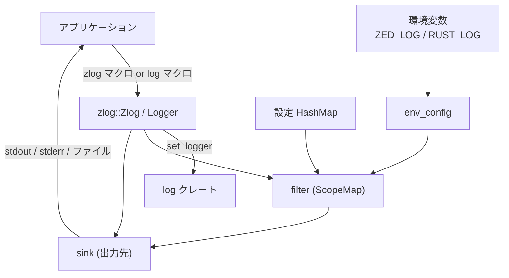
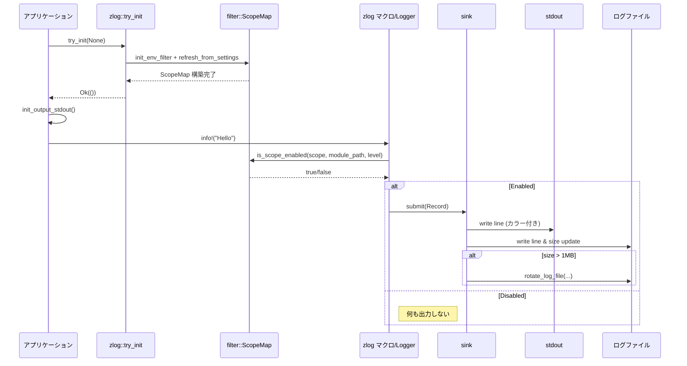

# zlog/ ディレクトリ

## 1. ざっくり一言

Zlog は、Zed 用アプリケーション／ライブラリ向けのロギング基盤で、  
環境変数 `ZED_LOG` / `RUST_LOG` や設定マップに基づいて、**スコープ（階層名）やモジュール単位でログレベルを制御し、stdout / stderr / ファイルにカラー付きで出力する**仕組みを提供します。

---

## 2. このモジュールの役割

### 2.1 概要

- このクレートは、`log` クレート互換のロガー実装と、独自のロギングマクロ群を提供します。
- ログの有効／無効は
  - 環境変数 (`ZED_LOG` / `RUST_LOG`)
  - 実行時設定 (`HashMap<String, String>`)
  - ビルトインのデフォルトフィルタ  
 から作られる **ScopeMap** によって決定されます。
- 出力先は stdout / stderr / ログファイルの 3 種類で、ファイルは最大 1MB ごとに自動ローテーションされます。

### 2.2 アーキテクチャ内での位置づけ

主なモジュール間と外部依存関係の関係を示します。



### 2.3 設計上のポイント

- **責務の分割**
  - `env_config`：環境変数文字列のパース（`"info,my_crate=debug"` など）
  - `filter`：スコープ／モジュールごとのログレベル判定・設定のマージ
  - `sink`：ログの整形・カラー付け・ファイルローテーションなど出力担当
  - `zlog`：`log::Log` 実装・マクロ・初期化 API・タイマー機能
- **スコープ構造**
  - 固定長配列によるスコープ（`SCOPE_DEPTH_MAX = 4`）
  - `"crate.subscope.subsubscope"` のような階層的な名前でログを絞り込み可能
- **エラーハンドリング**
  - 設定・環境変数のパースには `anyhow::Result` を使用し、エラー時は `stderr` にメッセージを出力
  - ロックのポイズン発生時は `clear_poison()` で回復し、処理継続する方針
- **パフォーマンス配慮**
  - ログレベルの上限を `AtomicU8` にキャッシュし、早期に「絶対出ないログ」を弾く
  - ScopeMap はソート済み配列＋レンジで木構造を表現し、ツリー探索で判定
- **スレッドセーフ**
  - フィルタ構成は `RwLock<ScopeMap>`＋`AtomicU8`
  - 出力は `Mutex<File>`＋`AtomicBool` / `AtomicU64` で共有

---

## 3. 主要な機能一覧

- 環境変数 `ZED_LOG` / `RUST_LOG` のパース（`env_config::parse`）
- デフォルトフィルタ・環境変数・設定マップを統合した **ScopeMap** 構築（`ScopeMap::new_from_settings_and_env`）
- スコープ（`crate.subscope`）／モジュールパス（`crate::mod::submod`）ごとのログレベル判定（`filter::is_scope_enabled`）
- ログレベル上限の高速チェック（`filter::is_possibly_enabled_level`）
- stdout / stderr へのカラー付きログ出力（`sink::submit`）
- ログファイルへの出力と 1MB 超過時のローテーション（`sink::init_output_file`, `rotate_log_file`）
- `log` クレートとの統合（`Zlog` / `Logger` の `log::Log` 実装と `try_init`）
- ログマクロ：
  - `trace!`, `debug!`, `info!`, `warn!`, `error!`
  - スコープ付きロガーを作る `scoped!` / `scoped_logger`
  - 実行時間を計測する `time!` と `Timer`

---

## 4. 関数・構造体の解説

### 4.1 主要な型一覧

| 名前 | 定義モジュール | 種別 | 役割 / 用途 |
|------|----------------|------|-------------|
| `EnvFilter` | `env_config` | 構造体 | グローバルレベルと、モジュール名ごとのレベル指定を保持します。 |
| `ScopeMap` | `filter` | 構造体 | スコープ／モジュールごとに有効な `LevelFilter` を表現するツリー構造です。 |
| `ScopeMapEntry` | `filter` | 構造体 | `ScopeMap` 内の1ノード。スコープ名・有効レベル・子ノード範囲を持ちます。 |
| `EnabledStatus` | `filter` | enum | あるスコープ・モジュール・レベルが「有効/無効/未設定」かを表します。 |
| `Record<'a>` | `sink` | 構造体 | 出力直前のログレコード（スコープ・レベル・メッセージなど）です。 |
| `Logger` | `zlog` | 構造体 | 固定のスコープを持つロガー。マクロや `Log` 実装で利用されます。 |
| `Zlog` | `zlog` | 構造体 | グローバルロガーとして `log::Log` を実装する型です。 |
| `Timer` | `zlog` | 構造体 | スコープ付き計測タイマー。終了時に `trace` または `warn` を出します。 |
| `Scope` | `zlog` | 型エイリアス | `&'static str; 4` の配列。`Logger` の内部スコープ表現です。 |
| `ScopeRef<'a>` | `zlog` | 型エイリアス | ライフタイム付きスコープ配列。フィルタ判定や出力に使用します。 |
| `ScopeAlloc` | `zlog` | 型エイリアス | `String; 4` の配列。設定文字列→スコープへの変換に利用します。 |

---

### 4.2 重要な関数・メソッド（詳細）

#### 4.2.1 `env_config::parse(filter: &str) -> anyhow::Result<EnvFilter>`

**概要**

- 環境変数 `ZED_LOG` / `RUST_LOG` の値のような文字列をパースして、  
  グローバルログレベルとモジュール別ディレクティブの集合（`EnvFilter`）を生成します。
- 文字列はカンマ区切りで、要素は `"level"` または `"name=level"` 形式です。

**主な挙動**

- `"info"` のように `'='` を含まない要素で、かつ `parse_level` に成功したものは **グローバルレベル** として扱われます。
  - 複数指定するとエラー（`"Cannot set multiple max levels"`）。
- `"my_module=debug"` のような `name=level` 形式は **ディレクティブ** として `directive_names` / `directive_levels` に追加します。
  - `name` は空白をトリムし、末尾の `".rs"` は取り除かれます。
- `'='` を含まない要素で `parse_level` に失敗したものは、「レベル指定なしのモジュール名」とみなされ、  
  `LevelFilter::max()`（全レベル有効）でディレクティブとして登録されます。
- 無効なレベル名（`"foobar"` 等）が `name=level` 形式で指定された場合はエラーとなります。

**`parse_level` が受け付けるレベル**

大文字小文字は無視され、次の名前が有効です。

- `"TRACE"`, `"DEBUG"`, `"INFO"`, `"WARN"`, `"ERROR"`
- `"OFF"` / `"NONE"` → `LevelFilter::Off`
- それ以外はエラー（`anyhow::bail!("Invalid level: {level}")`）

**使用例**

```rust
use zlog::env_config;

fn main() -> anyhow::Result<()> {
    // グローバル info、モジュールごとに個別設定
    let env = "info,project=debug,agent=off";
    let filter = env_config::parse(env)?;   // 文字列を解析

    assert_eq!(
        filter.level_global,
        Some(log::LevelFilter::Info)
    );
    assert_eq!(
        filter.directive_names,
        vec!["project".to_string(), "agent".to_string()]
    );
    assert_eq!(
        filter.directive_levels,
        vec![log::LevelFilter::Debug, log::LevelFilter::Off]
    );

    Ok(())
}
```

**Edge cases（エッジケース）**

- `"info,warn"` のようにグローバルレベルを複数指定 → エラー。
- `"my_module=foobar"` のような無効レベル → エラー。
- `"my_module"` のような裸のモジュール名 → `my_module` に `LevelFilter::max()` が設定されます。
- `"foo.rs=debug"` → 名前の末尾 `".rs"` は取り除かれ、`"foo"` として扱われます。

**使用上の注意点**

- グローバルレベルは 0 or 1 個だけ指定できます。
- レベル名は `OFF` / `NONE` を除き、標準的な 5 種類のみなので、スペルミスに注意する必要があります。
- 環境変数での設定ミスは `process_env` 経由で `stderr` にメッセージが出力されます。

---

#### 4.2.2 `filter::refresh_from_settings(settings: &HashMap<String, String>)`

**概要**

- デフォルトフィルタ、環境変数からの設定（`EnvFilter`）、引数 `settings` の 3 つを統合し、  
  新しい `ScopeMap` を構築してグローバルに差し替えます。
- 併せて「理論上最も詳細なレベル」（`LEVEL_ENABLED_MAX_CONFIG`）を更新し、  
  `is_possibly_enabled_level` の高速フィルタとして利用します。

**引数**

| 引数名 | 型 | 説明 |
|--------|----|------|
| `settings` | `HashMap<String, String>` | 実行時設定。キーはスコープ（例: `"crate.subscope"`）またはモジュールパス（例: `"crate::mod::submod"`）、値はログレベル文字列です。 |

**内部処理の流れ（概要）**

1. `ENV_FILTER.get()` で環境変数由来の `EnvFilter` を取得（未初期化なら `None`）。
2. `ScopeMap::new_from_settings_and_env(settings, env_config, DEFAULT_FILTERS)` を呼び出し、マージされた新しい `ScopeMap` を生成。
3. 新しい `ScopeMap` の `entries` から、`enabled` が `Some(level)` であるものを走査し、  
   最も「詳細なレベル」（数値的に大きいレベル）を求める。
4. その値を `LEVEL_ENABLED_MAX_CONFIG` に保存。
5. `SCOPE_MAP.write()` でグローバルの `ScopeMap` を新しいものに置き換える。
6. `log::trace!("Log configuration updated")` を出力。

**設定のマージルール**

- 優先順位（高い順）：
  1. `settings` 引数のキー・値
  2. 環境変数からの設定（`EnvFilter`）
  3. `DEFAULT_FILTERS` 定数内のデフォルト設定
- 同じスコープ名・モジュールパスに対する設定が複数ある場合、  
  **後から追加されたものが上書き**されます（テスト `precedence` で確認されています）。

**使用例**

```rust
use std::collections::HashMap;
use zlog::filter;

fn reload_log_settings() {
    // 設定ファイルなどから読み込んだ内容を想定
    let mut settings = HashMap::new();
    settings.insert("my_crate".to_string(), "debug".to_string());
    settings.insert(
        "my_crate::db::query".to_string(),
        "trace".to_string(),
    );

    // グローバルフィルタを更新
    filter::refresh_from_settings(&settings);
}
```

**Edge cases**

- `settings` の値に無効なレベル文字列が含まれる場合：
  - `"disable"`, `"no"`, `"none"`, `"disabled"` → 警告を出しつつ `LevelFilter::Off` として扱います。
  - それ以外の無効値 → 警告を出してそのエントリを無視します。
- `settings` が空でも、環境変数やデフォルトフィルタがあれば、それらだけから ScopeMap が構築されます。

**使用上の注意点**

- この関数は **グローバル状態を書き換える** ため、通常は設定変更のタイミング（起動時や設定リロード時）だけで呼び出す前提です。
- スレッドセーフですが、高頻度で呼び続けると `RwLock` の取り合いによるオーバーヘッドが増えます。

---

#### 4.2.3 `filter::is_scope_enabled(scope: &ScopeRef<'_>, module_path: Option<&str>, level: log::Level) -> bool`

**概要**

- 指定されたスコープ（`ScopeRef`）とモジュールパス、ログレベルに対して、  
  「そのログを出力すべきかどうか」を判定します。
- まず「理論上出る可能性があるレベルか」を高速チェックし、  
  その後 `ScopeMap` での詳細な判定を行います。

**引数**

| 引数名 | 型 | 説明 |
|--------|----|------|
| `scope` | `&ScopeRef<'_>` | ログのスコープ（`["crate", "subscope", "", ""]` 等）。 |
| `module_path` | `Option<&str>` | モジュールパス（`"crate::mod::submod"`）または `None`。 |
| `level` | `log::Level` | ログのレベル（`Error`〜`Trace`）。 |

**戻り値**

- `true`：このスコープ・モジュール・レベルのログを出力するべき
- `false`：出力しない

**内部処理の流れ（概要）**

1. `is_possibly_enabled_level(level)` を呼び出し、`LEVEL_ENABLED_MAX_CONFIG` と比較。
   - ここで `false` なら即座に `false` を返す（詳細判定に進まない）。
2. `LEVEL_ENABLED_MAX_STATIC` と比較して `is_enabled_by_default` を計算。
3. `SCOPE_MAP` を `read` ロックで取得。ポイズン時は `clear_poison` して回復。
4. `ScopeMap` が空なら `is_enabled_by_default` を返す。
5. `ScopeMap::is_enabled(scope, module_path, level)` を呼び出し、
   - `EnabledStatus::Enabled` → `true`
   - `Disabled` → `false`
   - `NotConfigured` → `is_enabled_by_default` を返す。

**スコープ／モジュールの解決の概略**

- スコープ（`["a","b","c","d"]`）に対しては、ツリーを上から順にたどり、  
  途中で見つかった `enabled` 設定を「より内側ほど優先」して適用します。
- `module_path` がある場合：
  - スコープが空または crate 名のみのとき、crate 名に基づくスコープ設定を補完します。
  - モジュールパスに対するフィルタ（`"crate::mod::submod"`）があれば、それを適用します。
    - ただしスコープが crate 名より深い場合は、そのスコープ設定が優先されます。

**使用例**

```rust
use zlog::{filter, private, ScopeRef, SCOPE_DEPTH_MAX};

fn example_check() {
    // スコープ ["my_crate", "db", "", ""] を作る
    let scope: ScopeRef<'_> = private::scope_ref_new(&["my_crate", "db"]);

    // "my_crate::db::query" というモジュールの DEBUG ログが有効か調べる
    let enabled = filter::is_scope_enabled(
        &scope,
        Some("my_crate::db::query"),
        log::Level::Debug,
    );

    println!("db query debug enabled? {enabled}");
}
```

**Edge cases**

- `ScopeMap` が空の場合：
  - `LEVEL_ENABLED_MAX_STATIC` 以下のレベル（デフォルトは `Info` まで）は `true`、それより詳細なレベルは `false` になります。
- `LEVEL_ENABLED_MAX_CONFIG` より詳細なレベルは、スコープ設定に関係なく常に `false` になります。
- モジュールパスに対するフィルタとスコープフィルタの優先関係：
  - スコープが crate 名のみの場合、モジュールパスフィルタがそれを上書きします。
  - スコープがより深い場合は、そのスコープ設定がモジュール設定より優先されます。

**使用上の注意点**

- この関数自体は `pub` なので、アプリ側で「先にフィルタだけ確認してから重いメッセージを組み立てる」といった用途に使えます。
- ただし、通常は `zlog` のマクロや `Logger` / `Zlog` の `enabled`/`log` 実装が内部で呼び出します。

---

#### 4.2.4 `sink::init_output_file(path: &'static PathBuf, path_rotate: Option<&'static PathBuf>) -> io::Result<()>`

**概要**

- ログファイル出力を初期化します。
- 既存ファイルが指定サイズ（1MB）以上なら、ローテーション（コピーしてからトランケート）を行い、新しいログを書き込む準備をします。

**引数**

| 引数名 | 型 | 説明 |
|--------|----|------|
| `path` | `&'static PathBuf` | 現在のログファイルパス。`'static` で OnceLock に保持されます。 |
| `path_rotate` | `Option<&'static PathBuf>` | ローテーション先ファイルパス（例: `"app.log.old"`）。なければコピーせずトランケートのみ。 |

**内部処理の流れ（概要）**

1. `ENABLED_SINKS_FILE` を `try_lock` で取得（初期化時に他スレッドから呼ばれない前提）。
2. `SINK_FILE_PATH` / `SINK_FILE_PATH_ROTATE` を OnceLock 経由でセット。
3. `open_or_create_log_file(path, path_rotate, SINK_FILE_SIZE_BYTES_MAX)` を呼び出し：
   - ファイルサイズが 1MB 以上なら `rotate_log_file` でローテーションし、新しいファイルを開く。
   - それ以外は既存ファイルに append モードで追記。
4. メタデータからファイルサイズを取得し、`SINK_FILE_SIZE_BYTES` に保存。
5. `ENABLED_SINKS_FILE` に開いた `File` を格納。

**使用例**

```rust
use std::path::PathBuf;
use zlog::init_output_file;

fn init_file_logging() -> std::io::Result<()> {
    // PathBuf を 'static にするために Box::leak を使う
    let log_path: &'static PathBuf = Box::leak(PathBuf::from("app.log"));
    let rotate_path: &'static PathBuf = Box::leak(PathBuf::from("app.log.old"));

    init_output_file(log_path, Some(rotate_path))?;
    Ok(())
}
```

**Edge cases**

- 既存ログファイルが 1MB 以上の場合：
  - `path_rotate` が `Some` ならコピーしてから元ファイルをトランケートします。
  - `path_rotate` が `None` なら「ローテーションパスがない」というエラーを `stderr` に出しつつ、元ファイルをトランケートします。
- `metadata` の取得に失敗した場合は、単純に新規作成／追記のパスへ進みます。

**使用上の注意点**

- `path` / `path_rotate` は `'static` 必須なので、通常は
  - `Box::leak(PathBuf::from("..."))` のようにヒープに確保してリークする
  - あるいは `lazy_static` / `once_cell` などで `'static` な `PathBuf` を用意する  
 などのパターンで使います。
- この関数は起動時に 1 回だけ呼び出すことを前提としており、複数回呼ぶと `OnceLock` の制約によりパニックします。

---

#### 4.2.5 `sink::submit(mut record: Record)`

**概要**

- 1件のログレコードを受け取り、現在有効な出力先（stdout / stderr / ファイル）に書き出します。
- stdout / stderr には ANSI カラー付きで出力し、ファイルにはプレーンなテキストで出力します。
- ファイルサイズを監視し、上限超過時に自動ローテーションを行います。

**内部処理の流れ（概要）**

1. `record.module_path` が `None` か、`.rs` で終わらない場合は、`record.line` を `None` にして行番号表示を抑制します。
2. `ENABLED_SINKS_STDOUT` が `true` なら stdout にカラー付き出力。
   - そうでなければ `ENABLED_SINKS_STDERR` が `true` のとき stderr に同様の形式で出力。
3. `ENABLED_SINKS_FILE` を `lock` で取得。
   - `Some(file)` なら `SizedWriter` ラッパーを使ってログ行を書き込み、  
     その際に書き込んだバイト数を `SINK_FILE_SIZE_BYTES` に加算。
4. 書き込み後のサイズが `SINK_FILE_SIZE_BYTES_MAX` を超えていたら、ファイルを閉じてローテーション（`rotate_log_file`）を実行。
   - 成功すれば新しいファイルハンドルに差し替え。
   - 失敗時は `stderr` にエラーメッセージを出し、ファイル出力を無効化。
5. ローテーション後、`SINK_FILE_SIZE_BYTES` を 0 にリセット。

**出力フォーマット（例：stdout）**

```
2024-01-01T12:34:56+09:00 INFO [crate.module:123] message...
```

- 日時は `chrono::Local` の ISO 8601 形式。
- レベルは固定幅 5 文字（`ERROR` / `WARN ` / `INFO ` / `DEBUG` / `TRACE`）。
- ソース部は `SourceFmt` によって `[scope.or.module:line]` の形式で組み立てられます。

**使用例（通常は直接呼ばずマクロ経由で利用）**

```rust
use zlog::{sink, default_logger, info};

fn main() {
    // 通常はマクロだけで十分：
    zlog::init_output_stdout();
    info!("hello via macro");

    // どうしても直接使いたい場合：
    let logger = default_logger!();
    sink::submit(sink::Record {
        scope: logger.scope,
        level: log::Level::Info,
        message: &format_args!("hello via submit"),
        module_path: Some(module_path!()),
        line: Some(line!()),
    });
}
```

**Edge cases**

- `ENABLED_SINKS_STDOUT` と `ENABLED_SINKS_STDERR` の両方が `true` の場合：
  - stdout 側が優先され、stderr には出力されません。
- ログファイル書き込み中にパニックが発生して `Mutex` がポイズンされた場合：
  - 次の呼び出しで `clear_poison()` により回復し、可能な限り処理を継続します。
- ローテーションに失敗した場合：
  - 「ローテーションに失敗したがトランケートする」旨のメッセージを `stderr` に出力し、  
    その後のファイル出力は失敗したパスによっては無効化される可能性があります。

**使用上の注意点**

- 通常は `trace!` / `info!` などのマクロ、または `Logger` / `Zlog` の `log` 実装から間接的に呼び出す前提であり、  
  アプリコードから直接呼び出す必要はほとんどありません。
- 出力先を有効化するには、事前に `init_output_stdout` / `init_output_stderr` / `init_output_file` のいずれかを呼び出す必要があります。

---

#### 4.2.6 `zlog::try_init(filter: Option<String>) -> anyhow::Result<()>`

**概要**

- グローバルロガーとして `Zlog` を `log` クレートに登録し、  
  環境変数または引数のフィルタ文字列を適用して、フィルタ設定を初期化します。
- これにより、`log::info!` など `log` クレート標準マクロからのログが Zlog にルーティングされます。

**引数**

| 引数名 | 型 | 説明 |
|--------|----|------|
| `filter` | `Option<String>` | 明示的なフィルタ文字列。`None` の場合は `ZED_LOG` / `RUST_LOG` / `CI` から取得。 |

**内部処理の流れ（概要）**

1. `log::set_logger(&ZLOG)?` でグローバルロガーを `Zlog` に設定。
2. `log::set_max_level(log::LevelFilter::max())` で `log` クレート側の最大レベルを最詳細に設定。
   - 実際のフィルタリングは Zlog 側で行うため。
3. `process_env(filter)` を呼び出し、`ZED_LOG` / `RUST_LOG` / `CI` もしくは `filter` から `EnvFilter` を作成し、`filter::init_env_filter` を呼ぶ。
4. 空の設定マップを与えて `filter::refresh_from_settings(&HashMap::default())` を呼び、  
   デフォルトフィルタ＋環境設定から初期の `ScopeMap` を構築。

**関連関数**

- `init()`：`try_init(None)` を呼び、失敗時は `log::error!` と `eprintln!` でエラーを出力。
- `init_test()`：
  - `get_env_config()` が `Some` のとき（`ZED_LOG` / `RUST_LOG` / `CI` が設定されているとき）、`try_init(None)` を呼び、
  - 成功したら `init_output_stdout()` を呼んで stdout 出力を有効化。

**使用例**

```rust
use zlog::{self, info};

fn main() -> anyhow::Result<()> {
    // フィルタは環境変数に任せる
    zlog::try_init(None)?;

    // 出力先として stdout を有効化
    zlog::init_output_stdout();

    info!("Application started");

    Ok(())
}
```

**Edge cases**

- `log::set_logger` は一度しか成功しないため、  
  すでに別のロガーが登録されていると `Err` を返します。
- `filter` 引数と `ZED_LOG` / `RUST_LOG` が両方ある場合：
  - 実装上、`get_env_config().or(filter)` なので、**環境変数が優先**され、`filter` は使われません。
- `CI` 環境変数が存在し、`ZED_LOG` / `RUST_LOG` が未設定の場合：
  - `get_env_config()` は `"info"` を返し、デフォルトで `info` レベルのロギングが有効になります。

**使用上の注意点**

- `try_init` を呼ばずに `log::info!` などを呼んでも、Zlog には届きません（`log` クレートのデフォルト動作になります）。
- 出力先の初期化（`init_output_stdout` など）は別途必要です。  
  `try_init` はフィルタ設定のみを行います。

---

#### 4.2.7 `Timer` と `time!` マクロ

**概要**

- `Timer` は、生成されてから終了するまでの時間を計測し、  
  終了時に `trace` または `warn` レベルのログを自動で出力するユーティリティです。
- `time!` マクロで簡単に生成でき、スコープを抜けたとき（`Drop`）に自動終了します。

**主要メソッド**

- `Timer::new(logger: Logger, name: &'static str) -> Self`
  - 現在時刻を記録し、`name` を付けてタイマーを開始します。
- `Timer::warn_if_gt(self, warn_limit: Duration) -> Self`
  - 指定した時間 `warn_limit` を超えた場合に `warn` レベルでログを出すよう設定します。
- `Timer::end(self)`
  - 明示的にタイマーを終了し、ログを出力します。
- `Drop for Timer`
  - `end` が呼ばれていない場合、`drop` 時に自動で `finish()` を呼びます。

**ログ出力のルール**

- `warn_if_longer_than` が `Some(limit)` で、経過時間 `elapsed > limit` の場合：
  - `warn!` で  
    `"Timer '{}' took {:?}. Which was longer than the expected limit of {:?}"`  
    をログ出力。
- それ以外の場合：
  - `trace!` で `"Timer '{}' finished in {:?}"` をログ出力。
- いずれの場合も、一度ログを出したら `done = true` にして二重出力を防ぎます。

**使用例**

```rust
use std::time::Duration;
use zlog::{self, time, default_logger};

fn main() -> anyhow::Result<()> {
    zlog::try_init(None)?;
    zlog::init_output_stdout();

    {
        // デフォルトロガーでスコープ "my_crate" を持つタイマーを作成
        let logger = default_logger!();
        let _timer = time!(logger => "load_config")
            .warn_if_gt(Duration::from_secs(1));

        // ここで設定読み込み処理などを行う
        // スコープ終了時に _timer が Drop され、ログが出力される
    }

    Ok(())
}
```

**Edge cases**

- `end()` を呼んだ後にスコープを抜けても、`drop` 側では `done` フラグによりログは二重に出ません。
- `warn_if_gt` を呼ばない場合、常に `trace` レベルのログとして出力されます。
- 非同期コード上で使うと、await 中の待ち時間も含めた「実時間」が計測されます（コメントにある通り、これは仕様です）。

**使用上の注意点**

- ログレベルに応じてフィルタされるので、`trace` や `warn` が無効なスコープではタイマーのログは出ません。
- コメントにもある通り、**async の「CPU時間」計測には向きません**。非同期処理の待ち時間も含めた「経過時間」を見るためのツールです。

---

### 4.3 その他の公開関数・マクロ（一覧）

| 名前 | 種別 | 役割（1 行） |
|------|------|--------------|
| `init()` | 関数 | `try_init(None)` を呼び、失敗時にログと標準エラーへエラーメッセージを出力します。 |
| `init_test()` | 関数 | 環境変数が設定されているテスト環境向けに、ロガーと stdout 出力を初期化します。 |
| `process_env(filter: Option<String>)` | 関数 | `ZED_LOG` / `RUST_LOG` / `CI` / `filter` から文字列を取得し、`EnvFilter` を初期化します。 |
| `init_output_stdout()` | 関数 | stdout 出力フラグ（`ENABLED_SINKS_STDOUT`）を有効化します。 |
| `init_output_stderr()` | 関数 | stderr 出力フラグ（`ENABLED_SINKS_STDERR`）を有効化します。 |
| `flush()` | 関数 | stdout とログファイルのバッファをフラッシュします。 |
| `trace!` / `debug!` / `info!` / `warn!` / `error!` | マクロ | 指定ログレベルでメッセージを出力する zlog 独自マクロです（`Logger` を明示またはデフォルト）。 |
| `log!` | マクロ | 任意の `Logger` と `Level` を使ってログを記録する下位マクロです。 |
| `default_logger!` | マクロ | crate 名をスコープとする `Logger` を生成します。 |
| `scoped!(parent => name)` / `scoped!(name)` | マクロ | 既存ロガーにサブスコープ名を追加した `Logger` を生成します。 |
| `crate_name!` | マクロ | 現在の `module_path!()` から crate 名だけを抽出します。 |

---

## 5. データフロー

### 5.1 代表的な処理シナリオ

ここでは、次のような典型的なシナリオを例にします。

1. アプリケーション起動時に `zlog::try_init` と `init_output_stdout` を呼ぶ。
2. アプリケーションコードで `info!("message")` を呼び出す。
3. スコープ・モジュール・レベルに応じてフィルタされ、stdout / ファイルへ出力される。

### 5.2 シーケンス図



---

## 6. 使い方（How to Use）

### 6.1 基本的な使用方法

#### 6.1.1 最小構成：環境変数＋stdout でログを出す

```rust
use zlog::{self, info};                       // zlog 本体と info! マクロをインポート

fn main() -> anyhow::Result<()> {
    //
    // 1. ロガーの初期化
    //
    // フィルタは環境変数 ZED_LOG / RUST_LOG / CI に任せる
    zlog::try_init(None)?;                    // log クレートに Zlog を登録し、フィルタを構成

    //
    // 2. 出力先の設定
    //
    zlog::init_output_stdout();               // stdout への出力を有効化（カラー付き）

    //
    // 3. ログ出力
    //
    info!("Application started");             // デフォルトロガー (crate 名スコープ) で INFO ログ

    Ok(())
}
```

環境変数の例（README より）:

```bash
# 全体は info、"project" は debug、"agent" は off
ZED_LOG=info,project=debug,agent=off
```

### 6.2 よくある使用パターン

#### 6.2.1 スコープ付きロガーでコンポーネントごとにログを分ける

```rust
use zlog::{self, default_logger, scoped, debug};

fn handle_request() {
    // crate 名をスコープにもつデフォルトロガー
    let root = default_logger!();                 // scope = ["my_crate", "", "", ""]

    // さらに "http" というサブスコープを追加
    let http_logger = scoped!(root => "http");    // scope = ["my_crate", "http", "", ""]

    debug!(http_logger => "Received request");    // スコープ my_crate.http の DEBUG ログ
}
```

この場合、設定側では例えば次のようにしてスコープごとに制御できます。

- `my_crate=info`（crate 全体は info）
- `my_crate.http=trace`（HTTP 関連は trace まで有効）

#### 6.2.2 実行時設定マップからフィルタを更新する

```rust
use std::collections::HashMap;
use zlog::{self, filter};

fn reload_logging_config_from_file() {
    // 例: 設定ファイルから読み込んだ結果を構築
    let mut settings = HashMap::new();
    settings.insert("my_crate".to_string(), "warn".to_string());
    settings.insert("my_crate::db::query".to_string(), "trace".to_string());

    // 現在の EnvFilter とデフォルトフィルタを維持しつつ、settings を最優先で適用
    filter::refresh_from_settings(&settings);
}
```

#### 6.2.3 ログファイルへの出力とローテーション

```rust
use std::path::PathBuf;
use zlog::{self, info, init_output_file};

fn init_logging_to_file() -> anyhow::Result<()> {
    // 'static な PathBuf を用意
    let log_path: &'static PathBuf = Box::leak(PathBuf::from("app.log"));
    let rotate_path: &'static PathBuf = Box::leak(PathBuf::from("app.log.old"));

    // ロガー初期化
    zlog::try_init(None)?;

    // ログファイル出力を有効化（1MB 超で app.log.old にローテーション）
    init_output_file(log_path, Some(rotate_path))?;

    info!("Logging to file started");
    Ok(())
}
```

#### 6.2.4 Timer で処理時間を計測する

```rust
use std::time::Duration;
use zlog::{self, time, info};

fn main() -> anyhow::Result<()> {
    zlog::try_init(None)?;
    zlog::init_output_stdout();

    {
        let _timer = time!("load_config")              // デフォルトロガーで Timer を作成
            .warn_if_gt(Duration::from_millis(500));  // 0.5秒を超えたら warn を出す

        // 設定読み込み処理
        // ...
    } // ここで _timer が Drop され、trace または warn ログが出る

    info!("Config loaded");
    Ok(())
}
```

### 6.3 使用上の注意点（まとめ）

- **初期化順序**
  - `log` クレート経由のログを Zlog に流したい場合は、必ずアプリ起動時に `zlog::try_init` / `init` を呼ぶ必要があります。
  - 出力先は **別途** `init_output_stdout` / `init_output_stderr` / `init_output_file` で有効化する必要があります。
- **環境フィルタ文字列**
  - `"info,my_module=debug,agent=off"` のような形式で指定します。
  - `'='` のないトークンはレベルとして解釈できればグローバルレベル、それ以外は「裸のモジュール名」として `LevelFilter::max()` が設定されます。
  - グローバルレベルは 1 つだけにしてください（複数指定するとエラー）。
- **スコープの深さ**
  - `SCOPE_DEPTH_MAX = 4` のため、`default_logger!` の crate 名に加えてサブスコープは最大 3 階層までです。
  - これ以上の深さを `scoped!` で追加すると、デバッグビルドではパニックします。
- **スコープ vs モジュールの優先順位**
  - 同じ crate に対して、スコープ `"crate.subscope"` とモジュール `"crate::mod::submod"` が両方設定されている場合、
    - crate 名だけのスコープに対してはモジュール設定が上書き
    - crate 名より深いスコープが指定されていれば、そのスコープ設定が優先 となります。
- **レベル文字列の受け付け方**
  - 設定マップの値は `"trace"`, `"debug"`, `"info"`, `"warn"`, `"error"`, `"off"` のほか、
    - `"disable"`, `"no"`, `"none"`, `"disabled"` は警告付きで `"off"` として扱われます。
    - それ以外の文字列は警告の上、無視されます。
- **Timer の特性**
  - async 処理では await 中の待ち時間も含めて計測されるため、「実際にどれくらいかかったか」を見る用途に向きますが、「CPU 使用時間」の測定には向きません。

---

## 7. 関連ファイル

| パス | 役割 / 関係 |
|------|------------|
| `zlog/Cargo.toml` | クレート名・依存クレート (`log`, `chrono`, `anyhow`, `collections` など) を定義します。ライブラリエントリポイントは `src/zlog.rs` です。 |
| `zlog/README.md` | `ZED_LOG` 環境変数の概要とレベル指定の基本的な使い方を説明しています。 |
| `zlog/src/zlog.rs` | クレートのメインモジュール。`log::Log` 実装 (`Zlog` / `Logger`)、マクロ、タイマー、初期化関数など公開 API の中心です。 |
| `zlog/src/env_config.rs` | 環境変数文字列を `EnvFilter` にパースするロジックとテストが定義されています。 |
| `zlog/src/filter.rs` | `ScopeMap` とログレベル判定・設定のマージロジック (`refresh_from_settings`, `is_scope_enabled`) を提供します。 |
| `zlog/src/sink.rs` | stdout / stderr / ファイルへのログ出力、フォーマット、ファイルローテーションの実装とそのテストが含まれます。 |

このディレクトリ全体で、環境ベースの柔軟なログフィルタリングと、複数の出力先をもつロギング基盤を構成しています。