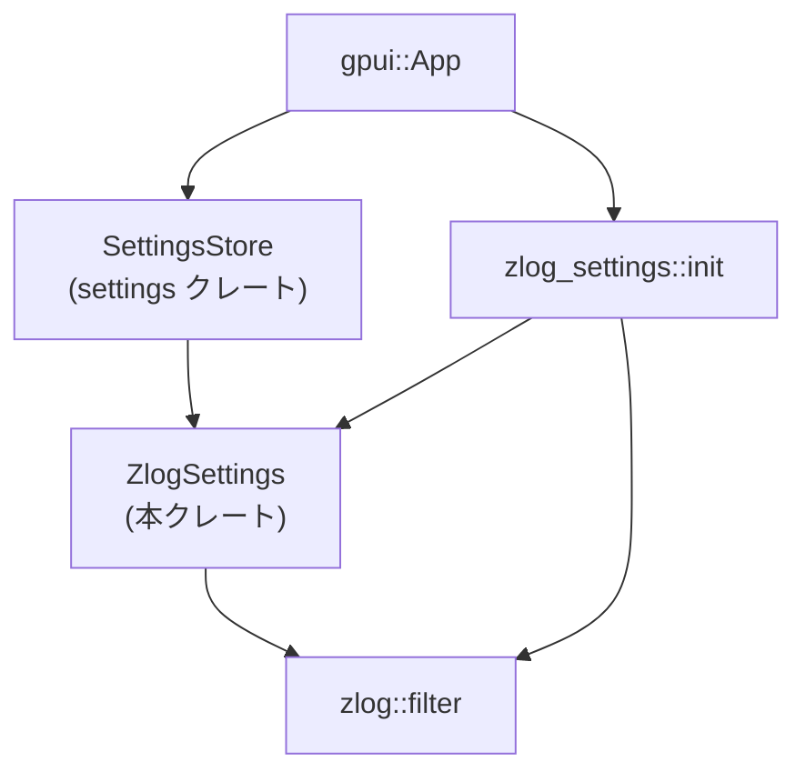
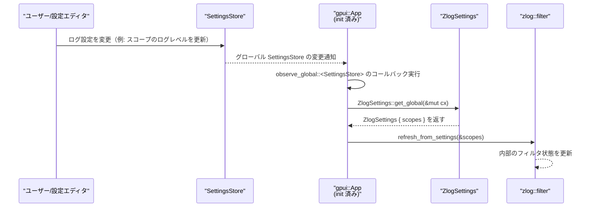

# zlog_settings/ ディレクトリ解説

## 1. ざっくり一言

`zlog_settings` クレートは、アプリケーションの設定システム（`SettingsStore`）からログ関連の設定を読み取り、`zlog` クレートのログフィルタ（`zlog::filter`）に反映するための薄いブリッジモジュールです。

---

## 2. このモジュールの役割

### 2.1 概要

- このモジュールは **「設定ファイルに書かれたログレベル指定」** を **`zlog` のログフィルタに反映する** ために存在します。
- `ZlogSettings` 構造体で「スコープ名 → ログレベル」のマップを定義し、設定システムから復元します。
- `init` 関数は、グローバルな `SettingsStore` の変化を監視し、変更があれば `zlog::filter` の設定を更新します。

### 2.2 アーキテクチャ内での位置づけ

このクレートは、UI/アプリケーションフレームワーク（`gpui::App`）と、設定システム（`settings` クレート）、ログシステム（`zlog` クレート）の間をつなぐ位置にあります。



- `gpui::App`  
  アプリケーション全体のコンテキスト。ここからグローバルな `SettingsStore` を監視します。
- `SettingsStore`  
  すべての設定値を保持するストア。`observe_global::<SettingsStore>` で監視対象になります。
- `ZlogSettings`  
  ログ用の設定だけを抜き出した構造体です。
- `zlog::filter`  
  ログのスコープやレベルを制御するコンポーネントで、本クレートから `refresh_from_settings` が呼び出されます。
- `zlog_settings::init`  
  上記コンポーネント同士を「監視・同期」という形で結びつける初期化関数です。

### 2.3 設計上のポイント

コードから読み取れる設計上の特徴は次のとおりです。

- **責務の分離**
  - このクレートは「設定の構造定義」と「設定 → ログフィルタ同期」のみに責務を絞っています。
  - ログ出力自体の処理や設定の保存処理は、他クレート（`zlog`, `settings`）に任されています。
- **状態の扱い**
  - 自前で状態を保持するフィールドはなく、すべての状態は `SettingsStore` および `ZlogSettings` のインスタンスとして外部にあります。
  - `init` は監視ハンドラを登録するだけで、構造体を保持しません（`.detach()` によりハンドルを破棄）。
- **リアクティブな更新**
  - `App::observe_global::<SettingsStore>` によって、設定変更のたびにコールバックが呼ばれ、その都度 `zlog` のフィルタが更新されます。
  - 手動で「設定が変わったらログフィルタを更新する」コードを書く必要がなくなります。
- **設定統合の仕組み**
  - `ZlogSettings` は `RegisterSetting` 派生と `Settings` トレイト実装により、`settings` クレートの設定システムと統合されています。
  - `ZlogSettings::get_global(cx)` というメソッドは、この統合により提供されていると考えられますが、具体的な実装はこのチャンクにはありません。

---

## 3. 主要な機能一覧

このディレクトリ（クレート）が提供する主な機能は次のとおりです。

- `ZlogSettings` 構造体:  
  ログスコープごとのログレベル設定を保持するデータ構造。
- `Settings` トレイト実装 (`impl Settings for ZlogSettings`):  
  グローバルな設定コンテンツ（`SettingsContent`）から `ZlogSettings` を復元する処理。
- `init(cx: &mut App)` 関数:  
  `SettingsStore` を監視し、設定から `ZlogSettings` を読み取り、`zlog::filter` を更新する初期化ロジック。

---

## 4. 関数・構造体の解説

### 4.1 型一覧（構造体）

| 名前           | 種別     | 役割 / 用途                                                                 |
|----------------|----------|-------------------------------------------------------------------------------|
| `ZlogSettings` | 構造体   | ログスコープ名とログレベルの対応関係を保持し、`settings` システムと統合する |

#### `ZlogSettings`

```rust
#[derive(Clone, Debug, RegisterSetting)]
pub struct ZlogSettings {
    /// A map of log scopes to the desired log level.
    /// Useful for filtering out noisy logs or enabling more verbose logging.
    ///
    /// Example: {"log": {"client": "warn"}}
    pub scopes: HashMap<String, String>,
}
```

- `scopes`
  - 型: `HashMap<String, String>`（`collections` クレート由来）
  - 内容: 「スコープ名 → ログレベル」を表すマップです（例: `"client" -> "warn"`）。
  - 英語コメントから、特定のスコープを詳しくしたり（`debug` 等）、逆にノイズを抑える（`warn` 以上にする）用途が想定されています。

導出されているトレイト:

- `Clone` / `Debug`:  
  値の複製やデバッグ表示が容易になります。
- `RegisterSetting`:  
  `settings` クレート側の derive マクロであり、この型を設定システムに登録するためのメタ情報を生成していると考えられます（具体的な生成内容はこのチャンクからは分かりません）。

`Settings` トレイト実装:

```rust
impl Settings for ZlogSettings {
    fn from_settings(content: &settings::SettingsContent) -> Self {
        ZlogSettings {
            scopes: content.log.clone().unwrap(),
        }
    }
}
```

- `Settings` は `settings` クレートのトレイトで、設定コンテンツから自身を復元する役割を持ちます。
- `content.log` フィールドの型はコードからは明示されていませんが、`clone().unwrap()` されているため、`Option<_>` である可能性が高いです（推測であり、厳密な型はこのチャンクにはありません）。
- `unwrap()` を呼んでいるため、`content.log` が `None` の場合にはパニックが発生します。

### 4.2 関数詳細

#### `init(cx: &mut App)`

```rust
pub fn init(cx: &mut App) {
    cx.observe_global::<SettingsStore>(|cx| {
        let zlog_settings = ZlogSettings::get_global(cx);
        zlog::filter::refresh_from_settings(&zlog_settings.scopes);
    })
    .detach();
}
```

**概要**

- グローバルな `SettingsStore` を監視し、変更があるたびに最新の `ZlogSettings` を取得して `zlog::filter` に反映する初期化関数です。
- アプリケーション起動時など、`gpui::App` の初期化フェーズで一度呼び出すことを想定した関数です。

**引数**

| 引数名 | 型         | 説明                                                                 |
|--------|------------|----------------------------------------------------------------------|
| `cx`   | `&mut App` | `gpui::App` の可変参照。グローバルな `SettingsStore` や設定値にアクセスするためのコンテキストです。 |

**戻り値**

- 戻り値の型: `()`
- 直接の戻り値はありませんが、副作用として `SettingsStore` の監視が開始されます。

**内部処理の流れ（アルゴリズム）**

1. `cx.observe_global::<SettingsStore>(|cx| { ... })` を呼び出し、グローバルな `SettingsStore` の監視を登録します。
   - `SettingsStore` の内容が変更されるたびに、このクロージャが呼び出されると考えられます。
2. 監視用クロージャ内で `ZlogSettings::get_global(cx)` を呼び出し、現在の `ZlogSettings` を取得します。
   - `get_global` は `RegisterSetting` / `Settings` により提供されているメソッドと推測されますが、実装はこのチャンクにはありません。
3. 取得した設定から `zlog_settings.scopes` を取り出し、`zlog::filter::refresh_from_settings(&zlog_settings.scopes);` を呼び出します。
   - メソッド名から、`scopes` の内容に基づいてログフィルタの設定を更新していると解釈できますが、詳細は `zlog` クレート側の実装に依存します。
4. `observe_global` の戻り値に対して `.detach()` を呼び出します。
   - 監視ハンドルを変数に保持せずに切り離すことで、監視がバックグラウンドで継続されると考えられます（正確な挙動は `gpui` の仕様に依存し、このチャンク単体からは断定できません）。

**Examples（使用例）**

`gpui::App` の初期化処理の中で `init` を呼ぶ想定の例です。  
ここでは、すでに `&mut App` が手元にある関数内で利用する形にしています。

```rust
use gpui::App;                    // gpui クレートの App 型
use zlog_settings::init;          // 本クレートの init 関数

fn setup_logging(app: &mut App) { // 何らかの初期化フェーズで呼ばれる関数
    // SettingsStore の変更を監視し、ログ設定を自動反映する仕組みを有効化する
    init(app);
    
    // ここで他のログ関連初期化（zlog 自体の初期設定など）を行うことも可能です
}
```

このコードを実行した後は、`SettingsStore` の中でログ関連の設定が更新されるたびに、`zlog::filter` が自動的に更新されるようになります。

**Errors / Panics**

- `init` 関数自身は `Result` を返さず、明示的なエラー処理は行っていません。
- ただし、内部で呼び出される以下の処理の挙動次第では、パニックやエラーが発生しうる可能性があります。
  - `cx.observe_global::<SettingsStore>`  
    - どのような条件で失敗するかは、このチャンクには記述がありません。
  - `ZlogSettings::get_global(cx)`  
    - グローバル設定が存在しない場合の挙動は、このチャンクには記述がありません。
  - `zlog::filter::refresh_from_settings`  
    - 渡された `scopes` が不正な内容だった場合の扱いは、`zlog` クレート側の実装に依存します。

**Edge cases（エッジケース）**

コードから読み取れる範囲でのエッジケースは次のとおりです。

- `SettingsStore` に `ZlogSettings` がまだ保存されていない場合
  - この場合、`ZlogSettings::get_global(cx)` がどのように振る舞うかは、このチャンクからは分かりません。
  - デフォルト値を返すか、パニックするか、`Option` を返すかなどは外部実装依存です。
- `scopes` が空のマップである場合
  - `refresh_from_settings(&zlog_settings.scopes)` は空のマップを受け取ります。
  - その結果としてログがすべて出るのか、すべて抑制されるのかなどは `zlog` クレート側の実装に依存します。

**使用上の注意点**

- `init` は、**アプリケーションのライフサイクルの早い段階で一度だけ呼び出す** ことが前提と考えられます。
  - 複数回呼び出すと監視が重複登録される可能性がありますが、その挙動は `gpui` の実装に依存し、このチャンクからは判断できません。
- `&mut App` を受け取るため、`init` を呼び出せる場所は `App` の可変参照が存在するスコープに限られます。
- 監視は `.detach()` によってハンドルが破棄されるため、手動で停止する API（たとえばハンドルの drop）はここでは利用されていません。
  - 監視の寿命や停止条件は `gpui` の仕様に依存します。

---

#### `Settings for ZlogSettings::from_settings(content: &settings::SettingsContent) -> ZlogSettings`

```rust
impl Settings for ZlogSettings {
    fn from_settings(content: &settings::SettingsContent) -> Self {
        ZlogSettings {
            scopes: content.log.clone().unwrap(),
        }
    }
}
```

**概要**

- `settings::SettingsContent` から `ZlogSettings` を構築するためのメソッドです。
- 設定システムが内部で利用し、ストア済みの生の設定情報を `ZlogSettings` に変換します。

**引数**

| 引数名    | 型                             | 説明                                         |
|-----------|--------------------------------|----------------------------------------------|
| `content` | `&settings::SettingsContent`   | 全体の設定内容を保持する構造体への参照です。 |

**戻り値**

- 型: `ZlogSettings`
- 意味: `content` 内のログ関連設定（`content.log`）を `scopes` に詰めた `ZlogSettings` の新しいインスタンスです。

**内部処理の流れ**

1. `content.log.clone()` を呼び出し、`content` に含まれるログ関連設定を複製します。
2. `.unwrap()` で `Option` から中身を取り出し、`scopes` に格納します。
3. `ZlogSettings { scopes: ... }` を返します。

**Examples（使用例）**

通常は設定システム内部で自動的に呼ばれると考えられますが、明示的に使う場合のイメージです。  
（`SettingsContent` の生成方法はこのチャンクにはないため、ダミーの変数名だけを使います。）

```rust
use settings::{Settings, SettingsContent}; // settings クレートの型

fn load_zlog_settings(content: &SettingsContent) -> ZlogSettings {
    // Settings トレイト経由で ZlogSettings を復元する
    ZlogSettings::from_settings(content)
}
```

**Errors / Panics**

- `unwrap()` の呼び出しにより、`content.log` が `None` の場合は **パニック** します。
  - そのため、設定システム側で `content.log` が必ず `Some(HashMap<String, String>)` になるようにしておく必要があります。

**Edge cases（エッジケース）**

- `content.log` が `None` の場合
  - 上述のとおりパニックします。
- `content.log` が空のマップである場合
  - `ZlogSettings { scopes: HashMap::new() }` が返り、ログフィルタには「特に指定のない状態」が渡されます。
  - その結果のログ挙動は `zlog` クレート側の実装に依存します。
- `content.log` に不正なログレベル文字列（例: `"verbose"` など）が含まれる場合
  - この関数自身は単に文字列をコピーするだけで検証は行っていません。
  - 検証やエラー処理は `zlog::filter::refresh_from_settings` 側で行われるか、あるいは行われないかもしれません（このチャンクからは不明です）。

**使用上の注意点**

- `SettingsContent` を構築する側は、**`log` フィールドを必ず設定する** 必要があります。
  - 未設定 (`None`) にするとパニックにつながります。
- ログレベル文字列のフォーマットや許容値は、このチャンクには記述がないため、`zlog` クレートの仕様に従う必要があります。

---

## 5. データフロー

ここでは、「設定変更がログフィルタに反映される」代表的なフローを説明します。

1. ユーザーまたは別コンポーネントが設定ファイル等を更新し、その内容が `SettingsStore` に反映されます。
2. `gpui::App` が持つ `SettingsStore` に変更があると、`observe_global::<SettingsStore>` に登録されたコールバックが呼ばれます。
3. コールバック内で `ZlogSettings::get_global(cx)` が呼ばれ、最新の `ZlogSettings`（`scopes` マップ）が取得されます。
4. 取得した `scopes` を引数に、`zlog::filter::refresh_from_settings(&zlog_settings.scopes)` が呼ばれ、ログフィルタが更新されます。

この流れを Mermaid のシーケンス図で表すと次のようになります。



- このフローにより、設定の更新からログフィルタ反映までが自動でつながっています。
- 実際のストレージ I/O（設定ファイル読み書きなど）は `settings` クレート側の責務であり、このクレートのコードには現れていません。

---

## 6. 使い方（How to Use）

### 6.1 基本的な使用方法

最も基本的な使い方は、「アプリケーションの起動処理の中で `init` を一度呼び出す」ことです。

```rust
use gpui::App;                    // gpui フレームワークの App 型
use zlog_settings::init;          // 本クレートの初期化関数

fn app_entry(cx: &mut App) {
    // 1. ログ用設定の監視と zlog フィルタへの自動反映を有効化する
    init(cx);

    // 2. 続けて他の初期化処理を行う（ウィンドウ生成など）
    // ...
}
```

ポイント:

- `cx: &mut App` を受け取る初期化フェーズ（ルート関数やセットアップ関数）で `init(cx)` を呼ぶだけで、以後設定変更が自動的にログフィルタに反映されます。
- 呼び出しは 1 回でよく、通常はグローバルな設定システムのセットアップと同じタイミングで行います。

### 6.2 よくある使用パターン

#### パターン1: 他の場所で現在のログ設定を参照したい場合

`ZlogSettings` はグローバル設定から復元されるため、他のコンポーネントから参照することも考えられます。  
`ZlogSettings::get_global(cx)` がこのクレート内でも使われているため、同様のパターンが利用できる可能性があります。

```rust
use gpui::App;
use zlog_settings::ZlogSettings;

fn debug_current_log_scopes(cx: &mut App) {
    // グローバル設定から現在の ZlogSettings を取得する
    let zlog_settings = ZlogSettings::get_global(cx);

    // 現在のスコープ → レベルの対応をデバッグ出力する
    for (scope, level) in &zlog_settings.scopes {
        println!("scope = {scope}, level = {level}");
    }
}
```

※ `get_global` の定義はこのチャンクにはなく、`RegisterSetting` などにより生成されていると考えられます。利用可否やシグネチャは実際の `settings` クレートのドキュメントを確認する必要があります。

#### パターン2: 設定ファイルでスコープごとのログレベルを指定する

コードからは具体的な設定ファイル形式は分かりませんが、コメント例から、「スコープごとに文字列でレベルを指定する」形が想定されています。

```text
例: {"log": {"client": "warn"}}
```

- `"client"` スコープのログレベルを `"warn"` に設定するといった使い方が想定されています。
- 実際の設定記法（JSON / TOML / YAML など）はこのチャンクからは判別できないため、`settings` クレートの仕様に従う必要があります。

### 6.3 使用上の注意点

- **`init` の呼び出しタイミング**
  - アプリケーション起動時など、`gpui::App` のコンテキストが初期化された直後に呼び出すのが自然です。
  - 遅いタイミングで呼ぶと、それ以前の設定変更がログフィルタに反映されていない可能性があります。
- **複数回呼び出しの可能性**
  - 同じ `App` に対して `init` を複数回呼ぶと、`observe_global` の監視が複数登録されるかどうかは `gpui` の仕様次第です。
  - このチャンクからは安全性が判断できないため、原則として 1 回だけ呼び出すことを前提にするのが無難です。
- **`SettingsContent.log` の必須性**
  - `from_settings` 内で `content.log.clone().unwrap()` が呼ばれているため、`SettingsContent` の `log` フィールドは `None` にならない前提です。
  - 設定システム側（設定ファイルの初期値やマイグレーション）で `log` を必ず設定するようにしておく必要があります。
- **ログレベル文字列の妥当性**
  - このクレートでは文字列をそのまま `scopes` に格納しているだけで、文字列の妥当性チェックは行っていません。
  - 実際に認められるログレベル（`"error"`, `"warn"`, `"info"`, `"debug"` など）は `zlog` クレート側の仕様に依存するため、そちらを確認する必要があります。
- **スレッド安全性**
  - `gpui::App` のコンテキストや `observe_global` のスレッド安全性については、このチャンクには情報がありません。
  - UI スレッド専用の API である可能性もあるため、`init` を呼ぶスレッドは `gpui` のドキュメントに従う必要があります。

---

## 7. 関連ファイル

このディレクトリ内で、本モジュールの理解に直接関係するファイルは次のとおりです。

| パス                                 | 役割 / 関係                                                                                     |
|--------------------------------------|-------------------------------------------------------------------------------------------------|
| `zlog_settings/Cargo.toml`           | クレート名（`zlog_settings`）、依存クレート（`gpui`, `collections`, `settings`, `zlog`）などを定義する。 |
| `zlog_settings/src/zlog_settings.rs` | 本レポートで解説した主要ロジックが定義されている。`init` 関数と `ZlogSettings` 構造体を提供する。      |

外部クレート（このディレクトリ外）としては、次のものが密接に関係しています（定義はこのチャンクには含まれていません）。

- `gpui` クレート: `App` 型と `observe_global` メソッドを提供する UI/アプリケーションフレームワーク。
- `settings` クレート: `Settings`, `SettingsStore`, `SettingsContent`, `RegisterSetting` など設定関連の型・トレイトを提供する。
- `zlog` クレート: ログ出力および `zlog::filter::refresh_from_settings` を提供するログライブラリ。
- `collections` クレート: `HashMap` を提供するユーティリティクレート（標準ライブラリのラッパー・再エクスポートである可能性がありますが、詳細はこのチャンクからは不明です）。
