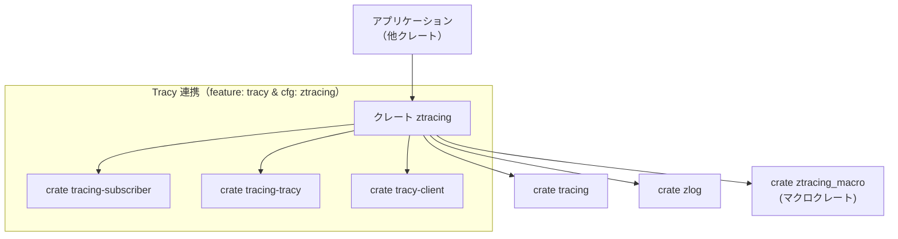
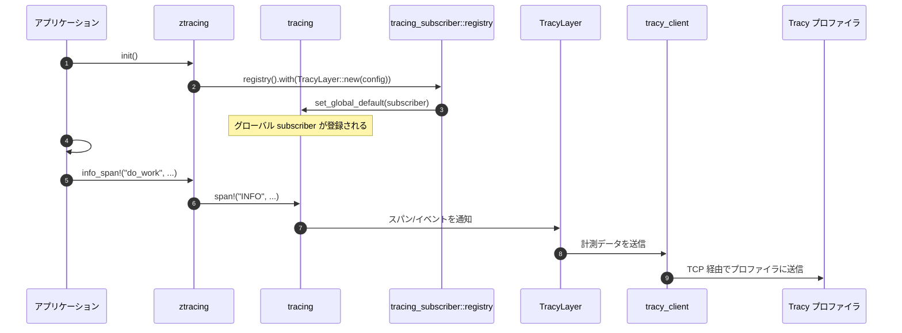

# ztracing/ ディレクトリ解説

## 1. ざっくり一言

`ztracing` は、アプリケーションコードから `tracing` ベースの計測を一元的に呼び出し、  
環境変数と Cargo feature によって **Tracy プロファイラ連携付きのトレース / メモリ計測をオン・オフ**できるラッパークレートです。

---

## 2. このモジュールの役割

### 2.1 概要

- このクレートは、アプリケーションからのトレース計測を
  - 有効時: `tracing` + `tracing-tracy` + `tracy-client` を使って Tracy に送信する
  - 無効時: API だけを残してほぼ完全なノーオーバーヘッドで捨てる  
 ためのスイッチングレイヤーとして機能します。
- ビルド時に環境変数 `ZTRACING` / `ZTRACING_WITH_MEMORY` を見る `build.rs` で `cfg(ztracing)` などのコンパイル条件を切り替えます。
- `init()` を呼び出すことで、Tracy 用の `tracing` subscriber をグローバルに登録し、プロファイラから接続可能な状態にします。

### 2.2 アーキテクチャ内での位置づけ

クレート間の主な依存関係は次の通りです。



- アプリケーション側は基本的に **`ztracing` だけをインポート**し、`tracing` を意識しなくてよい構成になっています。
- `ztracing` は `tracing` の API（`Span` や各種マクロ）を再エクスポートするか、ダミー実装を提供します。
- Tracy 連携は、`tracing-subscriber` + `tracing-tracy` + `tracy-client` を通じて実現されます。

### 2.3 設計上のポイント

コードから読み取れる設計上の特徴は次の通りです。

- **コンパイル時スイッチング**
  - `build.rs` が環境変数を読み、`cfg(ztracing)` / `cfg(ztracing_with_memory)` を付与します。
  - これにより「トレースをビルドから完全に取り除く」か「Tracy と連携する本格的な計測を行う」かを切り替えます。
- **API 互換のダミー実装**
  - 非 `ztracing` モードでは、`Span` 構造体と各種マクロをダミー実装で提供し、ユーザーコードの API は変えずに挙動だけを無効化します。
- **グローバル初期化関数**
  - `init()` が Tracy 連携付きの `tracing` subscriber をグローバルに登録します（`cfg(ztracing)` のときのみ有効な実装）。
- **メモリプロファイリング用のグローバルアロケータ**
  - `cfg(all(ztracing, ztracing_with_memory))` では、`tracy_client::ProfiledAllocator` を `#[global_allocator]` として設定し、メモリアロケーションも Tracy に送ります。

---

## 3. 主要な機能一覧

このディレクトリが提供する主な機能を一覧にします。

- `tracing` API の再エクスポート: `Level`, `field`, `Span`, 各種 `*_span!` マクロや `event!`, `instrument` などを公開します（`cfg(ztracing)` 時）。
- `instrument` 属性マクロの一貫した提供:
  - `cfg(ztracing)`: `tracing::instrument` を再エクスポート。
  - 非 `ztracing` 時: `ztracing_macro::instrument` を再エクスポート。
- 計測無効時のノーオペレーション実装:
  - 独自の `Span` 型と `trace_span!` などのマクロを実装し、呼び出しをほぼ完全に無視します。
- Tracy 向け `tracing` subscriber 初期化:
  - `init()` 関数で `tracing_subscriber::registry()` に `TracyLayer` を組み込み、Tracy プロファイラからの接続を可能にします。
- メモリプロファイリング用グローバルアロケータ:
  - `ZTRACING_WITH_MEMORY` 有効時には `tracy_client::ProfiledAllocator` をグローバルアロケータとして設定します。
- ビルドスクリプトによる環境変数連携:
  - `build.rs` により `ZTRACING` / `ZTRACING_WITH_MEMORY` の変化を検知しつつ、`cfg` フラグを付与します。

---

## 4. 関数・構造体の解説

このセクションでは、ディレクトリ内で定義されている主な関数・型を説明します。

### 4.1 ビルドスクリプト `build.rs::main`

```rust
use std::env;

fn main() {
    if env::var_os("ZTRACING").is_some() {
        println!("cargo::rustc-cfg=ztracing");
    }
    if env::var_os("ZTRACING_WITH_MEMORY").is_some() {
        println!("cargo::rustc-cfg=ztracing");
        println!("cargo::rustc-cfg=ztracing_with_memory");
    }
    println!("cargo::rerun-if-changed=build.rs");
    println!("cargo::rerun-if-env-changed=ZTRACING");
    println!("cargo::rerun-if-env-changed=ZTRACING_WITH_MEMORY");
}
```

**役割**

- ビルド時に環境変数を読み、Rust コンパイラに `cfg(ztracing)` / `cfg(ztracing_with_memory)` を付与します。
- さらに、対象の環境変数や `build.rs` に変更があった場合にビルドスクリプトを再実行させるよう Cargo に指示します。

**挙動の要点**

- `ZTRACING` が設定されている場合:
  - `cargo::rustc-cfg=ztracing` を出力し、コード中の `#[cfg(ztracing)]` ブロックを有効にします。
- `ZTRACING_WITH_MEMORY` が設定されている場合:
  - `ztracing` と `ztracing_with_memory` の両方の `cfg` が有効になります。
- `rerun-if-env-changed`:
  - 環境変数が変わるたびにビルドスクリプトを再実行するため、**環境変数の変更を反映するには再ビルドが必要**であることを示しています。

**使用上の注意点**

- `ZTRACING_WITH_MEMORY` を使う場合は、同時に Tracy 関連の依存クレート（Cargo feature `tracy`）が有効になっている必要があります。そうでない場合、`cfg(ztracing)` のコードがコンパイルされようとして依存クレート不足のコンパイルエラーが発生する可能性があります。

---

### 4.2 トレース API の再エクスポート

```rust
pub use tracing::{Level, field};

#[cfg(ztracing)]
pub use tracing::{
    Span, debug_span, error_span, event, info_span, instrument, span, trace_span, warn_span,
};
```

**役割**

- `ztracing` クレートを通して `tracing` の代表的な API を利用できるように再エクスポートします。
- `cfg(ztracing)` 有効時には、以下のようなものをそのまま `tracing` から引き継ぎます。
  - `Span` 型
  - `debug_span!`, `info_span!`, `trace_span!`, `warn_span!`, `error_span!`
  - `event!`
  - `span!`
  - 属性マクロ `#[instrument]`

**ポイント**

- 利用側は `use ztracing::{info_span, instrument};` のように書くだけで、`tracing` の実装かダミー実装かを意識せずに使えます。
- `Level`, `field` は常に `tracing` から再エクスポートされます（`cfg` によらず有効）。

---

### 4.3 計測無効時のダミー API

`cfg(not(ztracing))` のとき有効になる定義です。

#### ダミーの `instrument` 属性

```rust
#[cfg(not(ztracing))]
pub use ztracing_macro::instrument;
```

- `ztracing` が無効なビルドでも、`#[ztracing::instrument]` 相当の属性を使えるように、別クレート `ztracing_macro` から `instrument` を再エクスポートします。
- `ztracing_macro` クレートの具体的な挙動は、このチャンクにはないため詳細不明です。

#### ダミーマクロ `__consume_all_tokens` と各種 `*_span!` / `event!`

```rust
#[cfg(not(ztracing))]
pub use __consume_all_tokens as trace_span;
#[cfg(not(ztracing))]
pub use __consume_all_tokens as info_span;
#[cfg(not(ztracing))]
pub use __consume_all_tokens as debug_span;
#[cfg(not(ztracing))]
pub use __consume_all_tokens as warn_span;
#[cfg(not(ztracing))]
pub use __consume_all_tokens as error_span;
#[cfg(not(ztracing))]
pub use __consume_all_tokens as event;
#[cfg(not(ztracing))]
pub use __consume_all_tokens as span;

#[cfg(not(ztracing))]
#[macro_export]
macro_rules! __consume_all_tokens {
    ($($t:tt)*) => {
        $crate::Span
    };
}
```

**役割**

- `trace_span!`, `info_span!`, `event!` などをすべて同じマクロ `__consume_all_tokens` に別名として割り当てます。
- マクロ本体は引数（トークン列）を何も使わず、単に `$crate::Span` というトークンだけを展開します。

**挙動の特徴**

- これらのマクロに渡した引数は **コンパイル時に完全に捨てられます**。  
  つまり、次のようなコードでも `expensive()` は呼び出されません。

  ```rust
  // ztracing 無効時: expensive() は評価されない
  let span = ztracing::info_span!("test span"; "val" = expensive());
  ```

- 展開結果は `Span` 型の値（ユニット構造体のコンストラクタ）だけになるため、実行時オーバーヘッドはほぼゼロです。

**エッジケース**

- `event!` など、元の `tracing` 側で戻り値が `()` であるマクロも `Span` を返す形になります。
  - 一般的には戻り値を使わない想定のため大きな問題にはなりにくいですが、戻り値の型を厳密に利用するコードを書く場合は注意が必要です。

#### ダミー `Span` 型とそのメソッド

```rust
#[cfg(not(ztracing))]
pub struct Span;

#[cfg(not(ztracing))]
impl Span {
    pub fn current() -> Self {
        Self
    }

    pub fn enter(&self) {}

    pub fn record<T, S>(&self, _t: T, _s: S) {}
}
```

**役割**

- `tracing::Span` と同じ名前・よく似たメソッドを持つダミーの `Span` 型です。
- API 互換を保ちながら、実際には何もしない実装になっています。

**各メソッドの挙動**

- `Span::current() -> Self`
  - 現在のスパンを取得するインターフェースを模しており、常に新しい `Span` インスタンスを返します。
  - 戻り値はゼロサイズの構造体で、追加の情報は持ちません。
- `enter(&self)`
  - 実装は空で、どのような副作用も発生しません。
  - 実際の `tracing` ではスパンの「エントリ」を表しますが、このダミーでは意味的な効果はありません。
- `record<T, S>(&self, _t: T, _s: S)`
  - 任意の型のキー・値を受け取りますが、引数を無視して何もしません。

**使用上の注意点**

- `record` のジェネリクスにより多様な型を渡せますが、**ztracing 無効時には必ず無視される**ことを前提に利用する必要があります。
- 「現在のスパンが存在しない場合はこう振る舞う」といったロジックは、このダミー実装だけからは区別できません。

---

### 4.4 Tracy 初期化関数 `init()`

#### `cfg(ztracing)` 有効時の `init`

```rust
#[cfg(ztracing)]
pub fn init() {
    use tracing_subscriber::fmt::format::DefaultFields;
    use tracing_subscriber::prelude::*;

    #[derive(Default)]
    struct TracyLayerConfig {
        fmt: DefaultFields,
    }

    impl tracing_tracy::Config for TracyLayerConfig {
        type Formatter = DefaultFields;

        fn formatter(&self) -> &Self::Formatter {
            &self.fmt
        }

        fn stack_depth(&self, _: &tracing::Metadata) -> u16 {
            MAX_CALLSTACK_DEPTH
        }

        fn format_fields_in_zone_name(&self) -> bool {
            true
        }

        fn on_error(&self, client: &tracy_client::Client, error: &'static str) {
            client.color_message(error, 0xFF000000, 0);
        }
    }

    zlog::info!("Starting tracy subscriber, you can now connect the profiler");
    tracing::subscriber::set_global_default(
        tracing_subscriber::registry()
            .with(tracing_tracy::TracyLayer::new(TracyLayerConfig::default())),
    )
    .expect("setup tracy layer");
}
```

**役割**

- `tracing` の subscriber として `tracing_tracy::TracyLayer` を登録し、アプリケーションのスパンやイベントを Tracy プロファイラへ送信可能にします。

**内部処理の流れ**

1. `DefaultFields`（`tracing-subscriber` の標準的なフィールドフォーマッタ）をフィールドに持つ `TracyLayerConfig` 構造体を定義します。
2. `tracing_tracy::Config` トレイトを実装し、以下をカスタマイズします。
   - `formatter()`  
     - `TracyLayer` が使用するフィールドフォーマッタとして `DefaultFields` を返します。
   - `stack_depth()`  
     - スタックトレースの深さとして `MAX_CALLSTACK_DEPTH`（16）を返します。
   - `format_fields_in_zone_name()`  
     - `true` を返し、Tracy のゾーン名にフィールド情報を含めるようにします。
   - `on_error()`  
     - エラー発生時に `tracy_client::Client::color_message` を使ってエラーメッセージを Tracy に送ります。
3. `zlog::info!` で、Tracy subscriber が起動したことをログ出力します。
4. `tracing::subscriber::set_global_default(...)` により、
   - `tracing_subscriber::registry()` に `TracyLayer` を追加した subscriber を **グローバルデフォルト**として登録します。
   - 失敗した場合は `expect("setup tracy layer")` により panic します。

**エラー / パニック条件**

- すでに別の subscriber がグローバルデフォルトとして登録されている状態で `init()` を呼び出すと、
  - `set_global_default` がエラーを返し、
  - `expect("setup tracy layer")` により panic します。
- したがって、`init()` は基本的に **プロセス内で一度だけ呼び出す**前提の関数です。

**エッジケース**

- Tracy 関連の依存クレートが無効な状態で `cfg(ztracing)` が有効になると、コンパイルエラーになる可能性があります。
  - 実際のビルドでは、`ZTRACING` を立てる場合には `Cargo.toml` 側で feature `tracy` を有効にしておく必要があります。

#### 非 `ztracing` 時の `init`

```rust
#[cfg(not(ztracing))]
pub fn init() {}
```

- シグネチャは同じですが、実装は空です。
- アプリケーションは常に `ztracing::init()` を呼び出してよく、`ztracing` 無効時には何も起こりません。

---

### 4.5 メモリプロファイル用グローバルアロケータ

```rust
#[cfg(ztracing)]
const MAX_CALLSTACK_DEPTH: u16 = 16;

#[cfg(all(ztracing, ztracing_with_memory))]
#[global_allocator]
static GLOBAL: tracy_client::ProfiledAllocator<std::alloc::System> =
    tracy_client::ProfiledAllocator::new(std::alloc::System, MAX_CALLSTACK_DEPTH);
```

**役割**

- `cfg(all(ztracing, ztracing_with_memory))` のときに、`std::alloc::System` をラップした `tracy_client::ProfiledAllocator` をグローバルアロケータとして設定します。
- これにより、ヒープアロケーション情報も Tracy に送信され、メモリプロファイリングが可能になります。

**使用上の注意点**

- Rust のプログラムではグローバルアロケータは **1 つだけ**定義できます。
  - 他のクレートや自クレート内で別の `#[global_allocator]` が定義されているとコンパイルエラーになります。
- `ZTRACING_WITH_MEMORY` を有効にする前に、プロジェクト全体でグローバルアロケータが重複していないかを確認する必要があります。

---

## 5. データフロー

ここでは、`ztracing` を用いて Tracy へトレース情報を送る代表的なシナリオのデータフローを示します（`cfg(ztracing)` 有効時）。



- `init()` 呼び出し後、アプリケーション内の `#[ztracing::instrument]` や `info_span!` などから発生するスパン・イベントは、`tracing` を経由して `TracyLayer` に流れ込みます。
- `TracyLayer` は `tracy_client` を通じてネットワーク越しに Tracy プロファイラへデータを送信します。
- `ZTRACING` を立てないビルドでは、`init()` は空、スパン関連マクロはダミーとなり、このフロー全体が発生しません。

---

## 6. 使い方（How to Use）

### 6.1 基本的な使用方法

1. アプリケーションの `Cargo.toml` で `ztracing` を依存に追加し、Tracy を使う場合は feature `tracy` を有効にします。

   ```toml
   [dependencies]
   # パスやバージョンはプロジェクトに合わせて調整
   ztracing = { path = "crates/ztracing", features = ["tracy"] }
   ```

2. アプリケーションの起動時に `ztracing::init()` を一度だけ呼び出します。
3. 必要な関数や処理に `#[ztracing::instrument]` 属性や `info_span!` などを付けます。

```rust
// main.rs （アプリケーション側の例）

// ztracing をインポートする
use ztracing::{self, Level, instrument, info_span};

#[instrument] // この関数の呼び出しをトレースする
fn compute(value: i32) -> i32 {
    // スパンを明示的に作る
    let span = info_span!("compute_span", value);
    let _enter = span.enter(); // スパンに入る（ztracing 無効時は何もしない）

    // ここに本来の処理を書く
    value * 2
}

fn main() {
    // Tracy 連携を初期化（ztracing 無効時は何もしない）
    ztracing::init();

    let result = compute(21);
    println!("result = {}", result);
}
```

- `ZTRACING` / `ZTRACING_WITH_MEMORY` を設定していない場合でも、このコードはコンパイル・実行できます。
  - その場合、`compute` に付けた計測は **ダミー実装**になり、Tracy にもログにも何も送られません。

### 6.2 よくある使用パターン

#### パターン 1: 計測完全無効（本番など）

- 設定
  - Cargo feature `tracy` を無効のまま、もしくは `ZTRACING` を立てずにビルドします。
- 効果
  - `ztracing::init()` は空の関数。
  - `#[instrument]` および `info_span!` などはダミー実装になり、ほぼゼロオーバーヘッドで無視されます。
- 例（ビルドコマンド）

  ```bash
  # 環境変数を設定せずに通常ビルド
  cargo run
  ```

#### パターン 2: Tracy で CPU プロファイリング

- 設定
  - `Cargo.toml` で `ztracing` に `features = ["tracy"]` を付ける。
  - ビルド（または実行）時に `ZTRACING` 環境変数を立てる。
- 効果
  - `cfg(ztracing)` が有効になり、Tracy 向け subscriber とトレース API（`tracing` の実装）が有効になります。
- 例（Unix 系）

  ```bash
  # Tracy 対応ビルド
  ZTRACING=1 cargo run
  ```

- 例（Windows PowerShell）

  ```powershell
  $env:ZTRACING = "1"
  cargo run
  ```

#### パターン 3: Tracy でメモリプロファイリング込み

- 設定
  - 上記パターン 2 に加えて `ZTRACING_WITH_MEMORY` を設定。
- 効果
  - `cfg(ztracing_with_memory)` が有効になり、`tracy_client::ProfiledAllocator` がグローバルアロケータとして設定されます。
  - Tracy 上でメモリアロケーションの情報が取得可能になります。
- 例（Unix 系）

  ```bash
  ZTRACING_WITH_MEMORY=1 cargo run
  ```

- 注意:
  - 他に `#[global_allocator]` を使うクレートがないことを確認する必要があります。

### 6.3 使用上の注意点（まとめ）

- **`init()` は一度だけ呼び出す**
  - `cfg(ztracing)` 有効時に `init()` を複数回呼び出すと、`tracing::subscriber::set_global_default` が失敗し `expect` により panic する可能性があります。
  - 一般的にはアプリケーションのエントリポイント（`main`）で一度だけ呼び出す前提です。

- **環境変数はビルド時に評価される**
  - `ZTRACING` / `ZTRACING_WITH_MEMORY` は `build.rs` で読み取られるため、
    - これらを変更した場合は **再ビルド** が必要です。
    - 実行中に環境変数を変えても、ビルド済みバイナリの挙動は変わりません。

- **Cargo feature `tracy` との組み合わせ**
  - `cfg(ztracing)` を有効にすると、コード中で `tracing_tracy` や `tracy_client` が必ず参照されます。
  - したがって、`ZTRACING`（または `ZTRACING_WITH_MEMORY`）を立てる場合には、
    - アプリケーション側の `Cargo.toml` で `ztracing` の feature `tracy` を有効にしておく必要があります。

- **副作用のないマクロ引数**
  - `ztracing` 無効時には、`info_span!` などに渡した引数は **評価されません**。
  - そのため、マクロ引数に副作用のある処理（`expensive()` やログ出力）を直接書くと、
    - ztracing 有効時：副作用が発生する
    - 無効時：副作用が発生しない  
    という挙動差が生じます。
  - 重要な副作用を持つ処理は、マクロの外側で明示的に実行する設計が安全です。

---

## 7. 関連ファイル

このディレクトリ内および密接に関連するファイル・クレートは次の通りです。

| パス / クレート名          | 役割 / 関係 |
|---------------------------|------------|
| `ztracing/Cargo.toml`     | クレートのメタデータ、依存関係、および feature `tracy`（Tracy 連携用）を定義します。 |
| `ztracing/build.rs`       | 環境変数 `ZTRACING` / `ZTRACING_WITH_MEMORY` から `cfg(ztracing)` / `cfg(ztracing_with_memory)` を設定するビルドスクリプトです。 |
| `ztracing/src/lib.rs`     | 公開 API（`init`, ダミー `Span`, 各種マクロ再エクスポート）と Tracy 連携の実装を含む、クレートの本体です。 |
| クレート `ztracing_macro` | `cfg(not(ztracing))` 時に `#[instrument]` 属性を提供するマクロクレートです。コードはこのチャンクには含まれていないため、詳細な挙動は不明です。 |
| クレート `zlog`           | `init()` 内で起動メッセージを出力するために使用されるログクレートです（このチャンクには定義はありません）。 |
| クレート `tracing` / `tracing-subscriber` | トレース API と subscriber インフラストラクチャを提供するクレートです。`ztracing` はこれらをラップして利用します。 |
| クレート `tracing-tracy` / `tracy-client` | Tracy プロファイラとのブリッジと通信を提供します。feature `tracy` と `cfg(ztracing)` が有効なときに `init()` から利用されます。 |

このレポートは、提示されたファイル（`Cargo.toml`, `build.rs`, `src/lib.rs`）の情報に基づいています。それ以外のファイルやクレート内の実装詳細（`ztracing_macro` など）は、このチャンクからは読み取れないため記述していません。