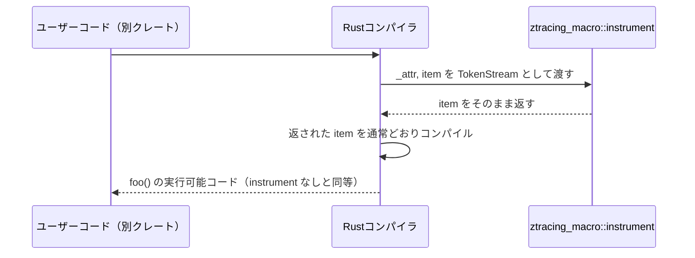

# crates/ztracing_macro ディレクトリ

## 1. ざっくり一言

`ztracing_macro` は、Rust の **属性プロシージャルマクロ（proc-macro attribute）** を 1 つだけ提供するクレートで、`#[instrument]` という属性を定義しています。  
現時点の実装では、この属性は **付けたアイテムを一切変更せず、そのままコンパイラに返すだけの「何もしない属性」** になっています。

---

## 2. このモジュールの役割

### 2.1 概要

- このディレクトリは Rust の **proc-macro クレート** `ztracing_macro` を定義します。
- 提供している機能は一つで、`#[instrument]` という属性マクロです。
- 実装は、属性引数 `_attr` を無視し、対象のコード `item` をそのまま返します。
- そのため、ソースコードに `#[instrument]` を付けても、コンパイル後の挙動は付けない場合と同じになります。

### 2.2 アーキテクチャ内での位置づけ

このクレートは、他のクレートから **コンパイル時** に利用される「属性マクロ提供専用」のクレートです。  
典型的な関係は次のようになります（アプリケーションクレートは例示的なノードです）。


- アプリケーションクレートは `ztracing_macro` を依存として追加します。
- 関数などに `#[instrument]` を付けると、コンパイル時に `ztracing_macro::instrument` が呼ばれます。
- `instrument` は元のコードをそのまま返すため、最終的なコードは属性なしと同等になります。

### 2.3 設計上のポイント

コードから読み取れる設計上の特徴は次のとおりです。

- **proc-macro 専用クレート**
  - `Cargo.toml` の `[lib]` セクションで `proc-macro = true` が指定されています。
  - これにより、このクレートは **通常のライブラリとしては使えず、マクロ専用クレート** になります。
- **状態を持たない実装**
  - グローバル変数や構造体などの状態は存在せず、`instrument` は単に引数を返すだけの純粋な処理です。
- **依存クレートなし**
  - `[dependencies]` が空で、標準ライブラリの `proc_macro` モジュールのみを利用しています。
- **拡張余地のある骨組み**
  - 名前や構造からは、将来的に `instrument` に何らかの処理を追加することも想定されますが、このチャンクのコードだけでは詳細は分かりません。

---

## 3. 主要な機能一覧

このディレクトリ（クレート）が提供する主要な機能は 1 つです。

- `#[instrument]` 属性マクロ  
  付与された関数やアイテムのトークン列を解析・変更せず、そのままコンパイラに返します（現状は完全な no-op 属性です）。

---

## 4. 関数・構造体の解説

### 4.1 公開 API 一覧

| 名前          | 種別                     | 説明                                             |
|---------------|--------------------------|--------------------------------------------------|
| `instrument`  | 属性プロシージャルマクロ | 属性の付いたアイテムをそのまま返す no-op マクロ |

### 4.2 `instrument` 属性マクロ

```rust
#[proc_macro_attribute]
pub fn instrument(
    _attr: proc_macro::TokenStream,
    item: proc_macro::TokenStream,
) -> proc_macro::TokenStream {
    item
}
```

#### 概要

- `#[instrument]` という属性として利用されるプロシージャルマクロです。
- Rust コンパイラから、属性引数と対象アイテムのトークン列を受け取り、**対象アイテムのトークン列をそのまま返します**。
- `_attr` は名前に `_` が付いていることからも分かるように、**完全に無視**されています。

#### シグネチャと引数

| 引数名  | 型                          | 説明 |
|--------|-----------------------------|------|
| `_attr`| `proc_macro::TokenStream`   | 属性の引数部分のトークン列です。`#[instrument(...)]` の `(...)` に対応しますが、現状は一切参照・利用されません。 |
| `item` | `proc_macro::TokenStream`   | 属性が付与されたアイテム（関数など）全体のトークン列です。 |

> `proc_macro::TokenStream` は、コンパイラ内部で扱う「トークン列」（Rust コードの断片）を表す型です。  
> プロシージャルマクロは、このトークン列を解析・変換して別のトークン列を返す仕組みになっています。

#### 戻り値

- 型: `proc_macro::TokenStream`
- 意味:
  - 引数として渡された `item` を **そのまま返しています**。
  - その結果、`#[instrument]` を付けたアイテムは、最終的には **元の宣言と同じ形** でコンパイルされます（`#[instrument]` 自体は展開段階で取り除かれます）。

#### 内部処理の流れ

内部の処理は非常に単純で、次の 2 ステップだけです。

1. コンパイラから属性引数 `_attr` と対象アイテム `item` を受け取る。
2. `_attr` を一切参照せず、`item` をそのまま返す。

擬似フローは次のようになります。

```text
受け取る: (_attr, item)
└─> 処理: 何もしない
    └─> 戻り値: item
```

#### エッジケース

このマクロはトークンを全く解析しないため、主な特徴は次のとおりです。

- **属性引数の扱い**
  - `#[instrument]` でも `#[instrument(level = "debug")]` でも、`_attr` は無視されるため、挙動は同じです。
  - 不正なフォーマットの引数（例: `#[instrument(=)]`）でも、マクロ側ではチェックしません。  
    実際にエラーになるかどうかは、コンパイラによる構文解析の結果に依存します。
- **適用対象**
  - 関数、`impl` ブロック、モジュールなど、Rust の属性を付けられる多くのアイテムに付与できます。
  - ただし、どのアイテムに属性を付けられるかは Rust コンパイラの仕様に依存します。
- **複数属性との組み合わせ**
  - 例えば `#[instrument] #[inline] fn foo() { ... }` のような場合でも、`instrument` は `item` を変更しないため、`#[inline]` など他の属性には影響しません。

#### 使用上の注意点

- **実際の挙動は完全に no-op**
  - `#[instrument]` を付けても、ログ出力・トレース・メトリクス収集などは一切行われません。
  - 挙動としては「属性を付けないのと同じ」と考えるのが安全です。
- **属性引数はすべて無視される**
  - `#[instrument(level = "debug")]` のように引数を書いても、マクロは読み取りません。
  - 将来的に意味を持たせる可能性は考えられますが、現時点のコードからは判断できません。
- **ランタイムから関数として呼び出せない**
  - `proc-macro` クレートは **コンパイル時専用** であり、アプリケーションコードから `instrument(...)` を普通の関数として呼び出すことはできません。

---

## 5. データフロー

ここでは、「アプリケーションクレートの関数に `#[instrument]` を付けたとき」に、**コンパイル時にどのようなデータフローになるか** を説明します。

### 5.1 処理の概要

1. ユーザーがアプリケーション側のコードで `#[instrument] fn foo() { ... }` と記述します。
2. Rust コンパイラは、この属性に対応するマクロを `ztracing_macro::instrument` として見つけます。
3. コンパイラは、属性引数（あれば）と対象アイテムのトークン列を `instrument` 関数に渡します。
4. `instrument` は `item` をそのまま返します。
5. コンパイラは返されたトークン列（= 元の関数定義）を通常どおりコンパイルします。

### 5.2 シーケンス図（コンパイル時）



- この図のとおり、`instrument` マクロは「トークンを受け取りそのまま返す」だけの通過点として働いています。

---

## 6. 使い方（How to Use）

ここでは、このクレートを **別クレートから利用する前提** で説明します（このディレクトリ自体は proc-macro クレートなので、直接 `main.rs` を持って実行するものではありません）。

### 6.1 基本的な使用方法

#### 1. 依存関係として追加する（例）

ワークスペース内の別クレートから利用する例です（パスは環境に合わせて調整が必要です）。

```toml
# 別クレートの Cargo.toml の例

[dependencies]
ztracing_macro = { path = "../crates/ztracing_macro" } # ローカルパス依存として追加する例
```

#### 2. コードで `#[instrument]` を使う

```rust
// 別クレートの src/lib.rs または src/main.rs

use ztracing_macro::instrument;            // ztracing_macro クレートから instrument 属性マクロをインポート

#[instrument]                              // ここで ztracing_macro::instrument マクロがコンパイル時に呼ばれる
fn double(x: i32) -> i32 {                 // 引数 x を 2 倍にして返す関数
    x * 2                                  // 関数本体（instrument マクロはこれを変更しない）
}
```

- この例では、`double` 関数に `#[instrument]` を付けていますが、コンパイル後の挙動は **`#[instrument]` を付けない場合と同じ** です。

#### パス指定で直接呼ぶ例

インポートせずにクレート名付きで指定することもできます。

```rust
// 別クレートの src/lib.rs

#[ztracing_macro::instrument]          // クレートパス付きで instrument マクロを指定
fn triple(x: i32) -> i32 {             // 引数 x を 3 倍にして返す関数
    x * 3
}
```

- こちらも結果は `#[instrument]` と同様で、最終的には `triple` 関数は属性なしと同じ形でコンパイルされます。

### 6.2 よくある使用パターン

機能がシンプルなため、主なパターンは **「どのように属性を付けるか」** の違いになります。

#### パターン1: 複数の関数に一括で付ける

```rust
use ztracing_macro::instrument;          // instrument 属性マクロをインポート

#[instrument]                            // 関数 foo に instrument を付与（no-op）
fn foo(a: i32) -> i32 {
    a + 1
}

#[instrument]                            // 関数 bar にも同じ属性を付与（no-op）
fn bar(b: i32) -> i32 {
    b * 2
}
```

- どちらの関数も、`#[instrument]` を外した場合と同じコードとしてコンパイルされます。

#### パターン2: 属性引数付きでの利用（現状は挙動変化なし）

```rust
use ztracing_macro::instrument;          // instrument 属性マクロをインポート

#[instrument(level = "debug")]           // 引数付きで利用しているが、_attr は無視される
fn baz(x: i32) -> i32 {
    x - 1
}
```

- `level = "debug"` などの指定は `_attr` に入りはしますが、マクロ側で利用していないため挙動は変わりません。

### 6.3 使用上の注意点

- **このマクロは現状 no-op であることを前提にする**
  - `#[instrument]` を付けてもログやトレースは一切行われないため、「付けることで何か計測が行われる」と期待しないほうが安全です。
- **属性引数はすべて無視される**
  - `#[instrument(foo = "bar")]` のような引数は、現時点では意味を持ちません。
- **ランタイム関数としては利用できない**
  - `ztracing_macro` は `proc-macro = true` のクレートのため、アプリケーションコードから `instrument(...)` を通常の関数として呼び出すことはできません。
- **ビルドエラーは主にコンパイラの制約による**
  - このマクロ自体は `item` を素通しするだけなので、多くの場合、ビルドエラーが出るとしたら「元のコードがコンパイルできない」「その位置に属性を書けない」といった理由によります。

---

## 7. 関連ファイル

このディレクトリに含まれるファイルと、その役割は次のとおりです。

| パス                              | 役割 / 関係 |
|-----------------------------------|-------------|
| `ztracing_macro/Cargo.toml`       | `ztracing_macro` クレートのメタデータ定義。`proc-macro = true` により、このクレートがプロシージャルマクロ専用であることを指定しています。 |
| `ztracing_macro/src/lib.rs`       | `#[proc_macro_attribute] pub fn instrument(...)` を定義している本体ファイルです。属性マクロ `instrument` の唯一の実装がここにあります。 |

このチャンクには、テストコードや他のモジュールファイル（`mod.rs` 等）は含まれていません。